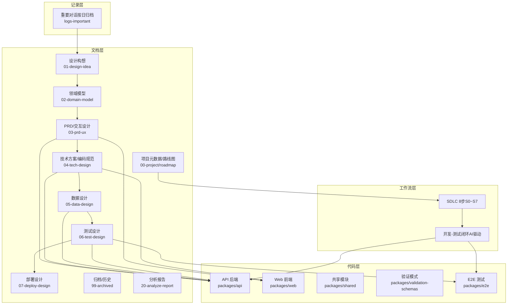
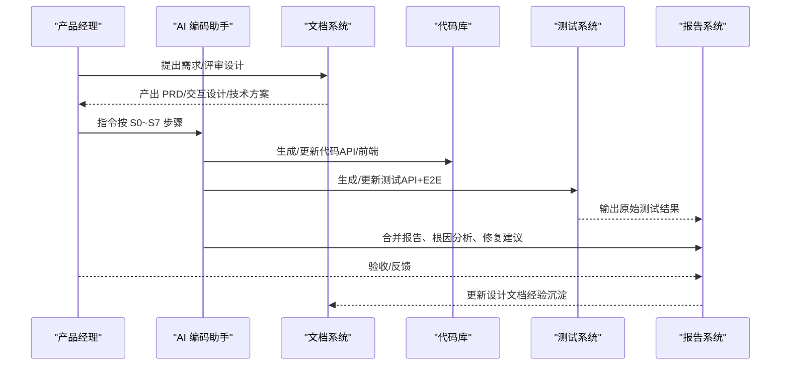
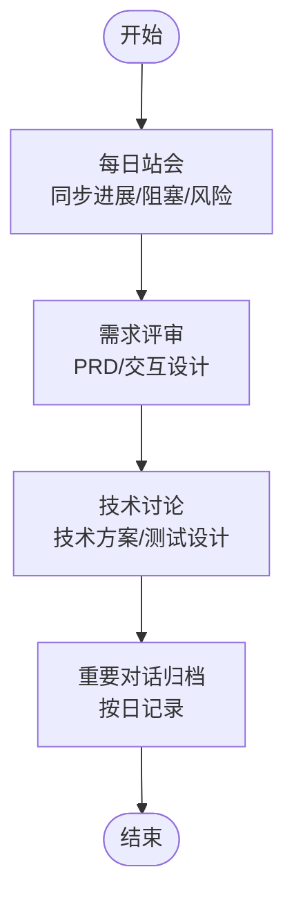
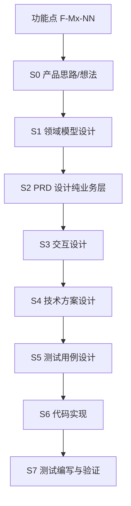
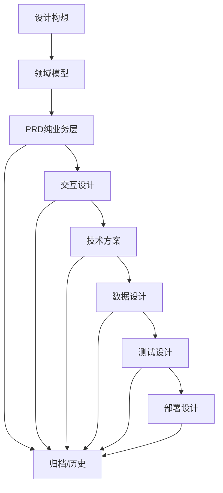
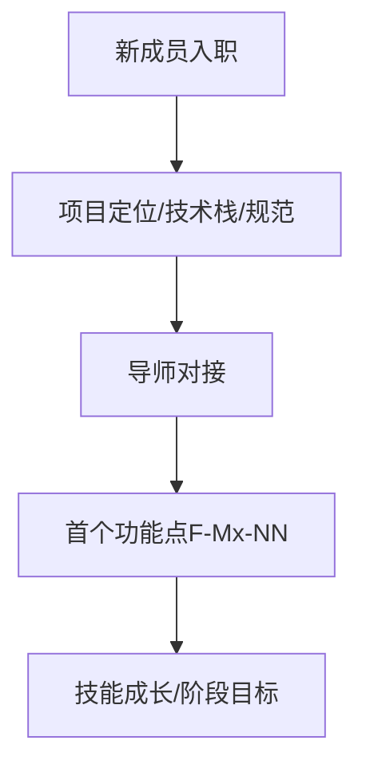
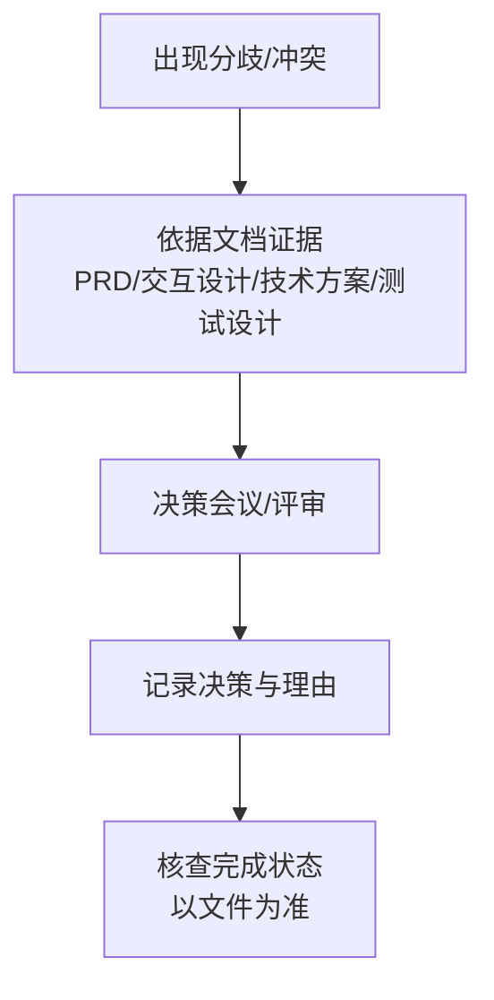
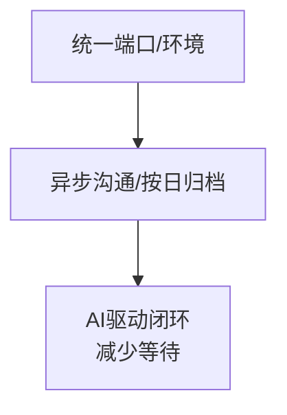
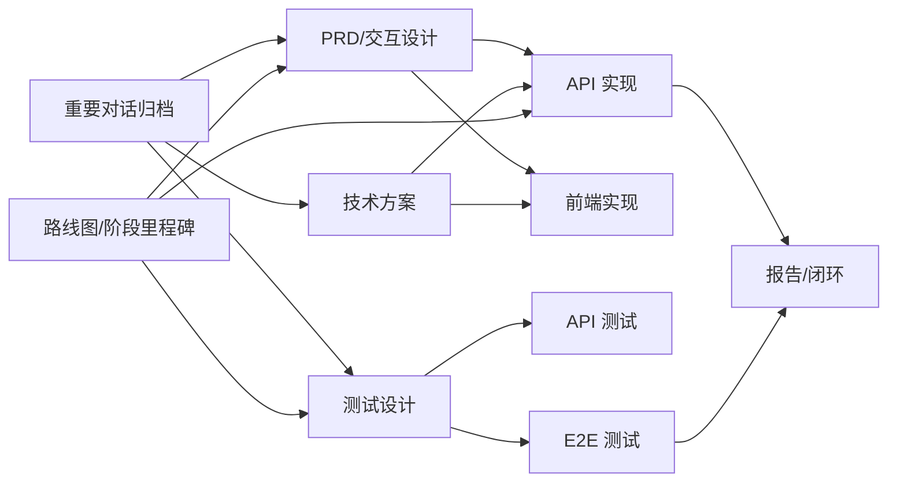

# 团队协作

<cite>
**本文档引用的文件**
- [README.md](file://README.md)
- [AGENTS.md](file://AGENTS.md)
- [CLAUDE.md](file://CLAUDE.md)
- [docs/00-project/roadmap/README.md](file://docs/00-project/roadmap/README.md)
- [docs/00-project/workflow/dev-test-loop-design.md](file://docs/00-project/workflow/dev-test-loop-design.md)
- [docs/01-design-idea/workflow.md](file://docs/01-design-idea/workflow.md)
- [logs-important/2026-04-25-conversation.md](file://logs-important/2026-04-25-conversation.md)
- [logs-important/2026-05-13-conversation.md](file://logs-important/2026-05-13-conversation.md)
</cite>

## 目录
1. [简介](#简介)
2. [项目结构](#项目结构)
3. [核心组件](#核心组件)
4. [架构总览](#架构总览)
5. [详细组件分析](#详细组件分析)
6. [依赖分析](#依赖分析)
7. [性能考虑](#性能考虑)
8. [故障排除指南](#故障排除指南)
9. [结论](#结论)
10. [附录](#附录)

## 简介
本团队协作规范面向“AI原型管理系统”项目，围绕“设计先行、文档驱动、AI协同”的工作流，建立从需求到实现再到测试验证的标准化闭环。文档强调：
- 会议制度与沟通规范：日常站会、需求评审、技术讨论的流程与记录要求
- 任务分配与进度跟踪：以功能点（F-Mx-NN）为最小交付单元，结合路线图与阶段里程碑
- 知识分享与文档维护：对话归档、设计文档分级、经验沉淀
- 新成员入职与培养：导师制度、技能路径、阶段性目标
- 冲突解决与决策流程：基于文档证据的决策机制
- 远程协作与异步沟通：工具使用规范与最佳实践
- 团队文化建设：以“单一流程、单一流程、单一流程”（SSOT）理念推动高效协作与知识传承

## 项目结构
项目采用“文档驱动 + AI协同”的工作流，核心结构如下：
- 文档层：按阶段与主题组织的设计文档、PRD、技术方案、测试设计、部署设计等
- 代码层：monorepo 结构，包含 API、Web、共享模块、验证模式、E2E 等
- 工作流层：以“S0~S7”为最小交付闭环，配合“开发-测试闭环”自动化流程
- 记录层：重要对话按日归档，形成可追溯的知识资产

**图表来源**
- [README.md:32-52](file://README.md#L32-L52)
- [docs/00-project/roadmap/README.md:29-45](file://docs/00-project/roadmap/README.md#L29-L45)
- [docs/00-project/workflow/dev-test-loop-design.md:30-60](file://docs/00-project/workflow/dev-test-loop-design.md#L30-L60)

**章节来源**
- [README.md:1-52](file://README.md#L1-L52)
- [docs/00-project/roadmap/README.md:1-126](file://docs/00-project/roadmap/README.md#L1-L126)

## 核心组件
- SDLC 8步流程（S0~S7）：以功能点为单位的完整交付闭环，确保设计、实现、测试、验证的可追溯性
- 开发-测试闭环（AI驱动）：以 Claude Code 为编排引擎，实现“开发→测试→AI分析→修复→重跑”的自动化闭环
- 文档分级与归档：按阶段与主题的文档目录规范，保证知识资产的可检索与可复用
- 重要对话归档：按日记录 PM 与 AI 的实质性对话，形成可追溯的知识资产
- 端口与环境约定：统一端口与环境变量，避免隐式默认值导致的连接错误

**章节来源**
- [docs/00-project/roadmap/README.md:29-45](file://docs/00-project/roadmap/README.md#L29-L45)
- [docs/00-project/workflow/dev-test-loop-design.md:30-60](file://docs/00-project/workflow/dev-test-loop-design.md#L30-L60)
- [AGENTS.md:246-285](file://AGENTS.md#L246-L285)
- [CLAUDE.md:246-285](file://CLAUDE.md#L246-L285)
- [AGENTS.md:113-160](file://AGENTS.md#L113-L160)
- [CLAUDE.md:113-160](file://CLAUDE.md#L113-L160)

## 架构总览
团队协作架构以“文档→代码→测试→验证”的闭环为核心，结合 AI 协同与自动化工具，形成可复制、可审计、可优化的工作流。

**图表来源**
- [docs/00-project/roadmap/README.md:29-45](file://docs/00-project/roadmap/README.md#L29-L45)
- [docs/00-project/workflow/dev-test-loop-design.md:332-501](file://docs/00-project/workflow/dev-test-loop-design.md#L332-L501)

## 详细组件分析

### 会议制度与沟通规范
- 日常站会：每日固定时间同步任务进展、阻塞问题与风险，使用路线图与功能点状态对齐
- 需求评审：以 PRD 与交互设计为依据，评审业务流程、数据规格与交互逻辑
- 技术讨论：以技术方案与测试设计为依据，讨论架构、接口与边界条件
- 重要对话归档：按日记录 PM 与 AI 的实质性对话，形成可追溯的知识资产

**图表来源**
- [docs/00-project/roadmap/README.md:75-85](file://docs/00-project/roadmap/README.md#L75-L85)
- [AGENTS.md:300-310](file://AGENTS.md#L300-L310)
- [CLAUDE.md:300-310](file://CLAUDE.md#L300-L310)

**章节来源**
- [docs/00-project/roadmap/README.md:75-85](file://docs/00-project/roadmap/README.md#L75-L85)
- [AGENTS.md:300-310](file://AGENTS.md#L300-L310)
- [CLAUDE.md:300-310](file://CLAUDE.md#L300-L310)

### 任务分配与进度跟踪
- 以功能点（F-Mx-NN）为最小交付单元，每个功能点独立完成 S0~S7 全流程
- 路线图与阶段里程碑：按 Phase 与模块维度跟踪完成度
- 代码与测试：以测试驱动的方式推进，确保质量与可追溯性

**图表来源**
- [docs/00-project/roadmap/README.md:29-45](file://docs/00-project/roadmap/README.md#L29-L45)

**章节来源**
- [docs/00-project/roadmap/README.md:29-45](file://docs/00-project/roadmap/README.md#L29-L45)

### 知识分享与文档维护
- 文档分级与命名规范：PRD、交互设计、技术方案、数据设计、测试设计、部署设计等按主题与阶段归档
- 对话归档：重要对话按日保存，便于复盘与知识沉淀
- 经验总结：在路线图与分析报告中沉淀最佳实践与教训

**图表来源**
- [AGENTS.md:246-285](file://AGENTS.md#L246-L285)
- [CLAUDE.md:246-285](file://CLAUDE.md#L246-L285)

**章节来源**
- [AGENTS.md:246-285](file://AGENTS.md#L246-L285)
- [CLAUDE.md:246-285](file://CLAUDE.md#L246-L285)

### 新成员入职、导师制度与技能培养
- 入职流程：熟悉项目定位、技术栈、文档规范与工作流
- 导师制度：由资深成员指导新成员完成首个功能点（F-Mx-NN），确保快速上手
- 技能培养：以阶段目标为导向，逐步掌握设计、实现、测试与验证全流程

**图表来源**
- [README.md:24-31](file://README.md#L24-L31)
- [docs/00-project/roadmap/README.md:10-27](file://docs/00-project/roadmap/README.md#L10-L27)

**章节来源**
- [README.md:24-31](file://README.md#L24-L31)
- [docs/00-project/roadmap/README.md:10-27](file://docs/00-project/roadmap/README.md#L10-L27)

### 冲突解决与决策流程
- 基于文档证据的决策：以 PRD、交互设计、技术方案、测试设计为依据进行决策
- 步骤完成状态核查：以磁盘上的实际文件为准，避免仅凭记忆或推断下结论
- 环境与端口约束：严禁隐式默认值，违反将导致连接错误数据库

**图表来源**
- [AGENTS.md:103-111](file://AGENTS.md#L103-L111)
- [CLAUDE.md:103-111](file://CLAUDE.md#L103-L111)
- [AGENTS.md:139-151](file://AGENTS.md#L139-L151)
- [CLAUDE.md:139-151](file://CLAUDE.md#L139-L151)

**章节来源**
- [AGENTS.md:103-111](file://AGENTS.md#L103-L111)
- [CLAUDE.md:103-111](file://CLAUDE.md#L103-L111)
- [AGENTS.md:139-151](file://AGENTS.md#L139-L151)
- [CLAUDE.md:139-151](file://CLAUDE.md#L139-L151)

### 远程协作与异步沟通规范
- 工具使用：统一端口与环境变量，避免隐式默认值
- 异步沟通：重要对话按日归档，便于后续检索与复盘
- 工作流自动化：以 AI 驱动的开发-测试闭环减少等待与阻塞

**图表来源**
- [AGENTS.md:113-160](file://AGENTS.md#L113-L160)
- [CLAUDE.md:113-160](file://CLAUDE.md#L113-L160)
- [docs/00-project/workflow/dev-test-loop-design.md:384-421](file://docs/00-project/workflow/dev-test-loop-design.md#L384-L421)

**章节来源**
- [AGENTS.md:113-160](file://AGENTS.md#L113-L160)
- [CLAUDE.md:113-160](file://CLAUDE.md#L113-L160)
- [docs/00-project/workflow/dev-test-loop-design.md:384-421](file://docs/00-project/workflow/dev-test-loop-design.md#L384-L421)

## 依赖分析
- 文档与代码的双向依赖：PRD/交互设计驱动 API/前端实现，测试设计驱动测试编写，验证驱动文档更新
- AI 与工具链的依赖：Claude Code 作为编排引擎，依赖统一的端口与环境约定
- 知识资产的依赖：重要对话归档与路线图共同构成项目知识资产

**图表来源**
- [docs/00-project/roadmap/README.md:29-45](file://docs/00-project/roadmap/README.md#L29-L45)
- [docs/00-project/workflow/dev-test-loop-design.md:332-501](file://docs/00-project/workflow/dev-test-loop-design.md#L332-L501)
- [AGENTS.md:300-310](file://AGENTS.md#L300-L310)
- [CLAUDE.md:300-310](file://CLAUDE.md#L300-L310)

**章节来源**
- [docs/00-project/roadmap/README.md:29-45](file://docs/00-project/roadmap/README.md#L29-L45)
- [docs/00-project/workflow/dev-test-loop-design.md:332-501](file://docs/00-project/workflow/dev-test-loop-design.md#L332-L501)
- [AGENTS.md:300-310](file://AGENTS.md#L300-L310)
- [CLAUDE.md:300-310](file://CLAUDE.md#L300-L310)

## 性能考虑
- 以功能点为单位的交付节奏：缩短反馈周期，降低耦合度
- AI 驱动的测试闭环：减少人工干预，提高问题定位与修复效率
- 端口与环境统一：避免隐式默认值导致的性能与稳定性问题

[本节为一般性指导，无需特定文件来源]

## 故障排除指南
- 端口与环境问题：违反环境优先铁律将导致连接错误数据库，需先激活环境再启动服务
- 测试数据安全：测试 DML 必须限定在测试数据范围内，严禁全表删除或无前缀清理
- 步骤完成状态核查：以磁盘上的实际文件为准，避免仅凭记忆或推断下结论

**章节来源**
- [AGENTS.md:139-151](file://AGENTS.md#L139-L151)
- [CLAUDE.md:139-151](file://CLAUDE.md#L139-L151)
- [AGENTS.md:79-102](file://AGENTS.md#L79-L102)
- [CLAUDE.md:79-102](file://CLAUDE.md#L79-L102)
- [AGENTS.md:103-111](file://AGENTS.md#L103-L111)
- [CLAUDE.md:103-111](file://CLAUDE.md#L103-L111)

## 结论
本团队协作规范以“文档驱动 + AI协同”的工作流为核心，通过统一的流程、工具与记录机制，实现从需求到实现再到测试验证的高效闭环。建议团队在实践中持续优化以下方面：
- 会议与沟通的标准化与可追溯性
- 任务分解与进度可视化
- 知识资产的沉淀与复用
- 新成员培养与导师制度的落地
- 冲突解决与决策流程的透明化
- 远程协作工具与异步沟通的最佳实践

[本节为总结性内容，无需特定文件来源]

## 附录
- 项目定位与技术栈：见项目根目录说明
- 系统使用工作流：从 A→F 六阶段的完整流程
- 重要对话归档示例：按日期分文件的对话记录

**章节来源**
- [README.md:5-31](file://README.md#L5-L31)
- [docs/01-design-idea/workflow.md:10-15](file://docs/01-design-idea/workflow.md#L10-L15)
- [logs-important/2026-04-25-conversation.md:1-20](file://logs-important/2026-04-25-conversation.md#L1-L20)
- [logs-important/2026-05-13-conversation.md:1-20](file://logs-important/2026-05-13-conversation.md#L1-L20)