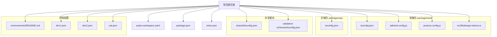
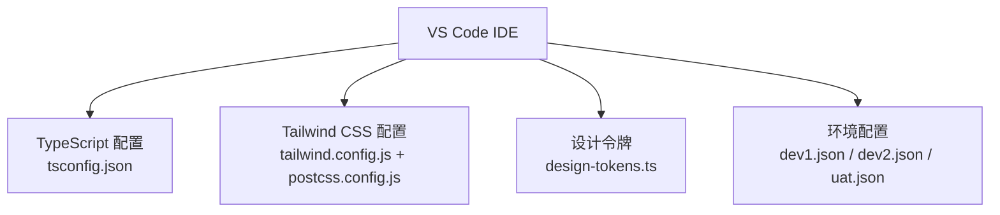
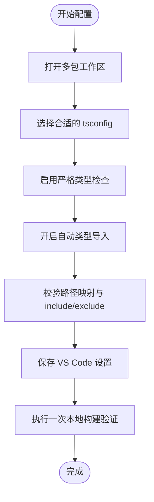
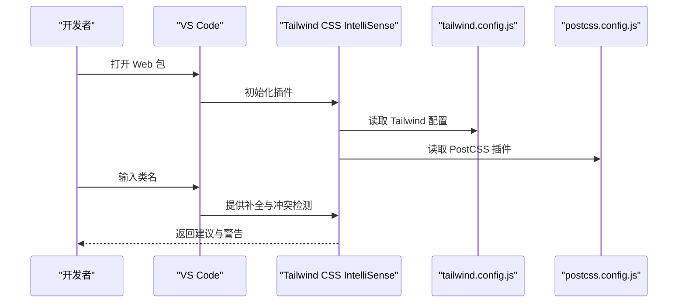
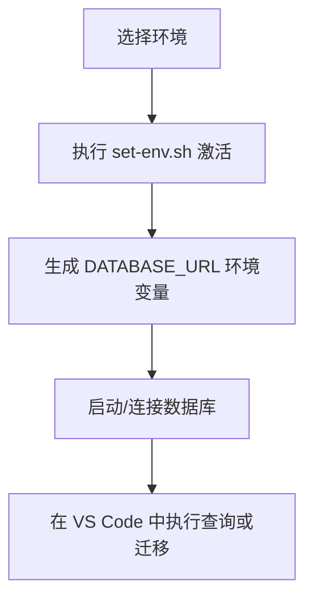
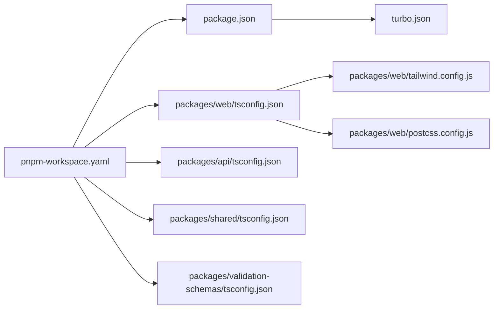

# IDE配置

<cite>
**本文档引用的文件**
- [package.json](file://package.json)
- [pnpm-workspace.yaml](file://pnpm-workspace.yaml)
- [turbo.json](file://turbo.json)
- [packages/web/tsconfig.json](file://packages/web/tsconfig.json)
- [packages/web/tailwind.config.js](file://packages/web/tailwind.config.js)
- [packages/web/postcss.config.js](file://packages/web/postcss.config.js)
- [packages/web/src/lib/design-tokens.ts](file://packages/web/src/lib/design-tokens.ts)
- [environments/README.md](file://environments/README.md)
- [environments/dev1.json](file://environments/dev1.json)
- [environments/dev2.json](file://environments/dev2.json)
- [environments/uat.json](file://environments/uat.json)
- [packages/api/tsconfig.json](file://packages/api/tsconfig.json)
- [packages/shared/tsconfig.json](file://packages/shared/tsconfig.json)
- [packages/validation-schemas/tsconfig.json](file://packages/validation-schemas/tsconfig.json)
</cite>

## 目录
1. [简介](#简介)
2. [项目结构](#项目结构)
3. [核心组件](#核心组件)
4. [架构总览](#架构总览)
5. [详细组件分析](#详细组件分析)
6. [依赖分析](#依赖分析)
7. [性能考虑](#性能考虑)
8. [故障排除指南](#故障排除指南)
9. [结论](#结论)
10. [附录](#附录)

## 简介
本指南面向在 VS Code 中开发 AI 原型管理系统的开发者，目标是帮助你在本地获得一致、高效且具备强类型支持的开发体验。内容涵盖：
- TypeScript 智能提示与类型检查配置
- 代码补全与错误检查策略
- 必需的 VS Code 扩展推荐（ESLint、Prettier、Tailwind CSS、Database Client 等）
- 工作区设置模板、用户设置建议、任务配置思路
- 代码片段与快捷键建议、主题推荐
- 与项目实际配置文件（tsconfig、tailwind、postcss、环境配置）的映射关系

## 项目结构
该仓库采用多包工作区（pnpm workspaces），包含前端 Web 应用、后端 API、共享模块、校验模式与 E2E 测试等。VS Code 配置应覆盖以下要点：
- 多根工作区（multi-root workspace）以同时打开多个包
- 区分 Web 与 API 的 TypeScript 配置
- Tailwind CSS 与 PostCSS 在 Web 包中的集成
- 环境配置文件的统一管理与激活脚本

**图表来源**
- [pnpm-workspace.yaml](file://pnpm-workspace.yaml)
- [package.json](file://package.json)
- [turbo.json](file://turbo.json)
- [packages/web/tsconfig.json](file://packages/web/tsconfig.json)
- [packages/web/tailwind.config.js](file://packages/web/tailwind.config.js)
- [packages/web/postcss.config.js](file://packages/web/postcss.config.js)
- [packages/web/src/lib/design-tokens.ts](file://packages/web/src/lib/design-tokens.ts)
- [packages/api/tsconfig.json](file://packages/api/tsconfig.json)
- [packages/shared/tsconfig.json](file://packages/shared/tsconfig.json)
- [packages/validation-schemas/tsconfig.json](file://packages/validation-schemas/tsconfig.json)
- [environments/README.md](file://environments/README.md)
- [environments/dev1.json](file://environments/dev1.json)
- [environments/dev2.json](file://environments/dev2.json)
- [environments/uat.json](file://environments/uat.json)

**章节来源**
- [pnpm-workspace.yaml](file://pnpm-workspace.yaml)
- [package.json](file://package.json)
- [turbo.json](file://turbo.json)

## 核心组件
- TypeScript 配置：区分 Web 与 API 的 tsconfig，确保类型检查范围与编译目标一致
- Tailwind CSS：通过 tailwind.config.js 与 postcss.config.js 实现样式工具链
- 设计令牌：design-tokens.ts 提供统一的视觉变量，保证组件一致性
- 环境配置：JSON 环境文件与激活脚本配合，确保数据库连接安全与可追踪

**章节来源**
- [packages/web/tsconfig.json](file://packages/web/tsconfig.json)
- [packages/web/tailwind.config.js](file://packages/web/tailwind.config.js)
- [packages/web/postcss.config.js](file://packages/web/postcss.config.js)
- [packages/web/src/lib/design-tokens.ts](file://packages/web/src/lib/design-tokens.ts)
- [environments/README.md](file://environments/README.md)

## 架构总览
下图展示 VS Code 开发体验与项目配置的映射关系，强调类型检查、样式工具链与环境配置三类关键能力。

**图表来源**
- [packages/web/tsconfig.json](file://packages/web/tsconfig.json)
- [packages/web/tailwind.config.js](file://packages/web/tailwind.config.js)
- [packages/web/postcss.config.js](file://packages/web/postcss.config.js)
- [packages/web/src/lib/design-tokens.ts](file://packages/web/src/lib/design-tokens.ts)
- [environments/dev1.json](file://environments/dev1.json)
- [environments/dev2.json](file://environments/dev2.json)
- [environments/uat.json](file://environments/uat.json)

## 详细组件分析

### TypeScript 智能提示与类型检查配置
- 目标：在 VS Code 中启用强类型检查、智能导入、快速修复与符号跳转
- 建议策略：
  - 使用工作区根的 package.json 与 pnpm-workspace.yaml 确保多包联动
  - 分别为 Web 与 API 设置独立 tsconfig，避免类型污染
  - 在 VS Code 中选择正确的 TS Server（建议使用工作区根的 pnpm 安装的 tsserver）
  - 启用“自动类型导入”、“显示完整类型签名”、“在字符串中显示属性”等增强体验的设置
  - 将 tsconfig 的 include/exclude 与路径映射（如 baseUrl、paths）保持与实际构建一致，减少“编辑器 vs 构建”的差异

**图表来源**
- [package.json](file://package.json)
- [pnpm-workspace.yaml](file://pnpm-workspace.yaml)
- [packages/web/tsconfig.json](file://packages/web/tsconfig.json)
- [packages/api/tsconfig.json](file://packages/api/tsconfig.json)

**章节来源**
- [packages/web/tsconfig.json](file://packages/web/tsconfig.json)
- [packages/api/tsconfig.json](file://packages/api/tsconfig.json)
- [packages/shared/tsconfig.json](file://packages/shared/tsconfig.json)
- [packages/validation-schemas/tsconfig.json](file://packages/validation-schemas/tsconfig.json)

### 代码补全与错误检查策略
- 目标：在编辑器中获得准确的补全、实时错误提示与快速修复
- 建议策略：
  - 使用 ESLint 与 Prettier 插件，统一风格与静态检查
  - 在 VS Code 中设置“保存时格式化”和“保存时运行修复”，减少提交前的反复
  - 对于 Web 包，启用 Tailwind CSS IntelliSense 以获得类名补全与冲突检测
  - 对于数据库相关配置，使用 Database Client 插件连接本地 PostgreSQL（基于环境配置）

**章节来源**
- [environments/README.md](file://environments/README.md)
- [environments/dev1.json](file://environments/dev1.json)
- [environments/dev2.json](file://environments/dev2.json)
- [environments/uat.json](file://environments/uat.json)

### Tailwind CSS 集成与样式工具链
- 目标：在 VS Code 中获得 Tailwind 类名补全、冲突检测与 PostCSS 自动前缀
- 建议策略：
  - 安装 Tailwind CSS IntelliSense 插件
  - 确保 tailwind.config.js 与 postcss.config.js 正确加载，以便插件识别
  - 将 design-tokens.ts 中的变量与 Tailwind 主题扩展对齐，避免硬编码值
  - 在 VS Code 中启用“在字符串中显示属性”，提升类名补全体验

**图表来源**
- [packages/web/tailwind.config.js](file://packages/web/tailwind.config.js)
- [packages/web/postcss.config.js](file://packages/web/postcss.config.js)
- [packages/web/src/lib/design-tokens.ts](file://packages/web/src/lib/design-tokens.ts)

**章节来源**
- [packages/web/tailwind.config.js](file://packages/web/tailwind.config.js)
- [packages/web/postcss.config.js](file://packages/web/postcss.config.js)
- [packages/web/src/lib/design-tokens.ts](file://packages/web/src/lib/design-tokens.ts)

### 环境配置与数据库连接
- 目标：在 VS Code 中安全地管理与切换环境，连接本地数据库进行调试
- 建议策略：
  - 使用环境 JSON 文件集中管理端口与数据库连接串
  - 通过激活脚本设置环境变量，避免在代码中硬编码 DATABASE_URL
  - 在 VS Code 中使用任务（Tasks）或启动配置（Launch Configurations）运行环境切换脚本
  - 使用 Database Client 插件连接本地 PostgreSQL（根据环境配置的端口与凭据）

**图表来源**
- [environments/README.md](file://environments/README.md)
- [environments/dev1.json](file://environments/dev1.json)
- [environments/dev2.json](file://environments/dev2.json)
- [environments/uat.json](file://environments/uat.json)

**章节来源**
- [environments/README.md](file://environments/README.md)
- [environments/dev1.json](file://environments/dev1.json)
- [environments/dev2.json](file://environments/dev2.json)
- [environments/uat.json](file://environments/uat.json)

## 依赖分析
- 工作区与包管理：使用 pnpm-workspace.yaml 管理多包；package.json 定义脚本与依赖；turbo.json 提供构建与缓存策略
- TypeScript 配置：Web 与 API 各自拥有独立 tsconfig，共享与校验模式也分别配置
- 样式工具链：Web 包内通过 tailwind.config.js 与 postcss.config.js 集成 Tailwind 与 Autoprefixer
- 环境系统：环境 JSON 文件与激活脚本共同构成环境配置体系

**图表来源**
- [pnpm-workspace.yaml](file://pnpm-workspace.yaml)
- [package.json](file://package.json)
- [turbo.json](file://turbo.json)
- [packages/web/tsconfig.json](file://packages/web/tsconfig.json)
- [packages/api/tsconfig.json](file://packages/api/tsconfig.json)
- [packages/shared/tsconfig.json](file://packages/shared/tsconfig.json)
- [packages/validation-schemas/tsconfig.json](file://packages/validation-schemas/tsconfig.json)
- [packages/web/tailwind.config.js](file://packages/web/tailwind.config.js)
- [packages/web/postcss.config.js](file://packages/web/postcss.config.js)

**章节来源**
- [pnpm-workspace.yaml](file://pnpm-workspace.yaml)
- [package.json](file://package.json)
- [turbo.json](file://turbo.json)

## 性能考虑
- 使用 pnpm 与 Turbo：利用工作区与缓存机制加速安装与构建
- TypeScript：合理设置 include/exclude 与路径映射，避免不必要的文件扫描
- Tailwind：仅在需要时启用“在字符串中显示属性”，减少插件扫描范围
- 环境配置：避免在代码中硬编码数据库连接串，减少运行时错误与重复解析

## 故障排除指南
- 类型检查异常
  - 症状：编辑器报错但构建通过或相反
  - 排查：确认 VS Code 使用的工作区根 pnpm 安装的 tsserver；核对 tsconfig 的 include/exclude 与路径映射
- Tailwind 类名补全失效
  - 症状：无法获得类名补全或冲突检测
  - 排查：确认 tailwind.config.js 与 postcss.config.js 被正确加载；检查 VS Code 工作区是否为项目根
- 数据库连接失败
  - 症状：连接超时或认证失败
  - 排查：确认环境 JSON 的端口与凭据；执行环境激活脚本后再连接；使用 Database Client 插件验证连接

**章节来源**
- [packages/web/tailwind.config.js](file://packages/web/tailwind.config.js)
- [packages/web/postcss.config.js](file://packages/web/postcss.config.js)
- [environments/README.md](file://environments/README.md)

## 结论
通过将 VS Code 的智能提示、类型检查、样式工具链与环境配置与项目实际配置文件对齐，开发者可以获得稳定、一致且高效的开发体验。建议优先完成 TypeScript 与 Tailwind 的基础配置，再逐步完善 ESLint、Prettier、Database Client 等插件，最终形成可复用的工作区模板。

## 附录
- VS Code 扩展推荐清单（按需安装）
  - ESLint：统一代码风格与静态检查
  - Prettier：保存时自动格式化
  - Tailwind CSS IntelliSense：类名补全与冲突检测
  - Database Client：连接本地 PostgreSQL 进行调试
  - GitHub Copilot（可选）：辅助生成代码与注释
- 工作区设置模板建议
  - 启用“保存时运行修复”与“保存时格式化”
  - 设置“在字符串中显示属性”以增强 Tailwind 补全体验
  - 将 TypeScript 版本锁定到工作区根的 pnpm 安装版本
- 任务配置思路
  - 使用 VS Code Tasks 运行环境激活脚本与数据库迁移
  - 将常用命令（如启动 Web、启动 API、运行测试）封装为任务，便于一键执行
- 代码片段与快捷键
  - 为常用组件与查询语句创建代码片段，提高重复性任务效率
  - 自定义快捷键绑定常用操作（如切换环境、打开数据库面板）
- 主题推荐
  - 选择护眼且对比度良好的主题，减少长时间编码疲劳