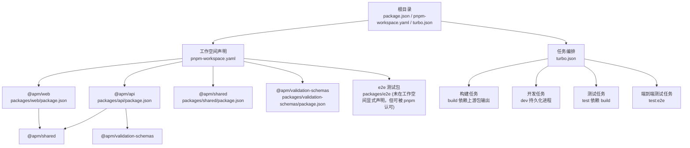
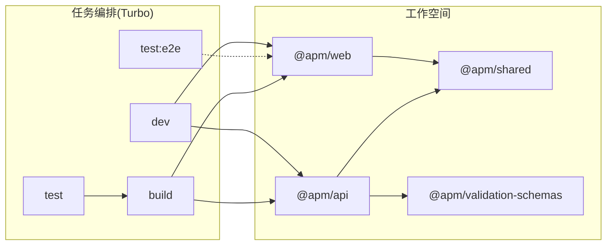
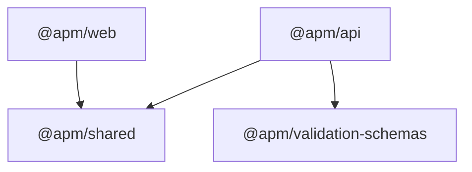

# 包管理配置

<cite>
**本文引用的文件**
- [package.json](file://package.json)
- [pnpm-workspace.yaml](file://pnpm-workspace.yaml)
- [pnpm-lock.yaml](file://pnpm-lock.yaml)
- [turbo.json](file://turbo.json)
- [packages/api/package.json](file://packages/api/package.json)
- [packages/web/package.json](file://packages/web/package.json)
- [packages/shared/package.json](file://packages/shared/package.json)
- [packages/validation-schemas/package.json](file://packages/validation-schemas/package.json)
- [packages/api/tsconfig.json](file://packages/api/tsconfig.json)
- [packages/web/tsconfig.json](file://packages/web/tsconfig.json)
- [packages/shared/tsconfig.json](file://packages/shared/tsconfig.json)
- [packages/validation-schemas/tsconfig.json](file://packages/validation-schemas/tsconfig.json)
- [README.md](file://README.md)
</cite>

## 目录
1. [简介](#简介)
2. [项目结构](#项目结构)
3. [核心组件](#核心组件)
4. [架构总览](#架构总览)
5. [详细组件分析](#详细组件分析)
6. [依赖分析](#依赖分析)
7. [性能考量](#性能考量)
8. [故障排查指南](#故障排查指南)
9. [结论](#结论)
10. [附录](#附录)

## 简介
本文件面向“AI原型管理系统”的包管理与版本控制，系统性阐述基于 pnpm 的 monorepo 工作空间配置与最佳实践，覆盖以下主题：
- pnpm 工作空间与 packages 目录结构
- 依赖管理策略与版本同步机制
- pnpm 特性：linking、store 机制、快照锁定文件的作用
- 包安装、更新、卸载的最佳实践
- 私有包注册表与镜像源配置建议
- 依赖冲突解决与团队协作规范
- 安全与合规注意事项

## 项目结构
本仓库采用 pnpm 工作空间 + Turbo 并行构建的 monorepo 结构，顶层通过工作空间配置声明子包范围，并由 Turbo 统一调度任务。

图表来源
- [pnpm-workspace.yaml:1-3](file://pnpm-workspace.yaml#L1-L3)
- [packages/api/package.json:1-1](file://packages/api/package.json#L1-L1)
- [packages/web/package.json:1-1](file://packages/web/package.json#L1-L1)
- [packages/shared/package.json:1-1](file://packages/shared/package.json#L1-L1)
- [packages/validation-schemas/package.json:1-1](file://packages/validation-schemas/package.json#L1-L1)
- [turbo.json:1-1](file://turbo.json#L1-L1)

章节来源
- [pnpm-workspace.yaml:1-3](file://pnpm-workspace.yaml#L1-L3)
- [turbo.json:1-1](file://turbo.json#L1-L1)
- [README.md:29](file://README.md#L29)

## 核心组件
- 根级包管理器与脚本
  - 根 package.json 声明了项目名称、版本、Node 引擎要求、包管理器版本以及 Turbo 作为开发依赖；同时提供统一的开发、构建、测试、清理与端到端测试脚本，这些脚本通过 Turbo 并行执行各子包任务。
- pnpm 工作空间
  - pnpm-workspace.yaml 使用通配符声明工作空间范围为 packages/*，确保所有子包被纳入同一依赖树与 store 管理。
- 锁定文件与 store
  - pnpm-lock.yaml 记录了完整的依赖解析结果与 store 中的包摘要，保证跨环境一致性与可复现性。
- 任务编排
  - turbo.json 定义了构建、开发、测试、端到端测试等任务的依赖关系与缓存策略，例如构建任务依赖上游包的构建输出，开发任务为持久化进程并注入环境变量。

章节来源
- [package.json:1-2](file://package.json#L1-L2)
- [pnpm-workspace.yaml:1-3](file://pnpm-workspace.yaml#L1-L3)
- [pnpm-lock.yaml:1-800](file://pnpm-lock.yaml#L1-L800)
- [turbo.json:1-1](file://turbo.json#L1-L1)

## 架构总览
下图展示了 monorepo 的包依赖与任务编排关系，强调 workspace:* 依赖与 Turbo 的任务依赖链。

图表来源
- [packages/api/package.json:1-1](file://packages/api/package.json#L1-L1)
- [packages/web/package.json:1-1](file://packages/web/package.json#L1-L1)
- [packages/shared/package.json:1-1](file://packages/shared/package.json#L1-L1)
- [packages/validation-schemas/package.json:1-1](file://packages/validation-schemas/package.json#L1-L1)
- [turbo.json:1-1](file://turbo.json#L1-L1)

## 详细组件分析

### 工作空间与包清单
- 工作空间范围
  - pnpm-workspace.yaml 将 packages/* 纳入工作空间，使各子包共享同一 store 与去重策略。
- 子包清单
  - @apm/api、@apm/web、@apm/shared、@apm/validation-schemas 均为私有包，使用 workspace:* 依赖本地包，实现“本地链接”与版本同步。
- TypeScript 配置
  - 各子包均提供独立 tsconfig.json，采用 bundler 解析器，确保在 monorepo 场景下的模块解析与打包兼容性。

章节来源
- [pnpm-workspace.yaml:1-3](file://pnpm-workspace.yaml#L1-L3)
- [packages/api/package.json:1-1](file://packages/api/package.json#L1-L1)
- [packages/web/package.json:1-1](file://packages/web/package.json#L1-L1)
- [packages/shared/package.json:1-1](file://packages/shared/package.json#L1-L1)
- [packages/validation-schemas/package.json:1-1](file://packages/validation-schemas/package.json#L1-L1)
- [packages/api/tsconfig.json:1-1](file://packages/api/tsconfig.json#L1-L1)
- [packages/web/tsconfig.json:1-1](file://packages/web/tsconfig.json#L1-L1)
- [packages/shared/tsconfig.json:1-1](file://packages/shared/tsconfig.json#L1-L1)
- [packages/validation-schemas/tsconfig.json:1-1](file://packages/validation-schemas/tsconfig.json#L1-L1)

### 依赖关系与版本同步
- workspace:* 依赖
  - @apm/api 与 @apm/web 对 @apm/shared 采用 workspace:*，确保本地开发时自动链接至本地源码，避免发布与版本漂移。
  - @apm/api 对 @apm/validation-schemas 也采用 workspace:*，保持校验模式与后端一致。
- 版本同步机制
  - 由于 workspace:* 指向本地源码，修改任一共享包会即时影响所有消费者，天然实现“同步升级”。
  - 若需跨包统一版本，可通过 pnpm 的版本提升命令或集中维护的版本策略实现（见“性能考量”与“最佳实践”）。

章节来源
- [packages/api/package.json:1-1](file://packages/api/package.json#L1-L1)
- [packages/web/package.json:1-1](file://packages/web/package.json#L1-L1)
- [packages/shared/package.json:1-1](file://packages/shared/package.json#L1-L1)
- [packages/validation-schemas/package.json:1-1](file://packages/validation-schemas/package.json#L1-L1)

### Turbo 任务编排
- 构建任务
  - build 任务依赖上游包的构建输出，确保顺序正确与增量构建生效。
- 开发任务
  - dev 任务标记为持久化进程并注入 WEB_PORT、API_PORT、DATABASE_URL 等环境变量，便于前后端联调。
- 测试任务
  - test 任务依赖 build，保证测试在已构建产物上运行。
- 端到端测试
  - test:e2e 任务独立运行，适合与 UI 或服务端联调场景。

章节来源
- [turbo.json:1-1](file://turbo.json#L1-L1)

### pnpm 特性与工作机制
- Linking（本地链接）
  - workspace:* 依赖通过 link:../<pkg> 实现本地链接，无需发布即可共享代码，提升迭代效率。
- Store 机制
  - pnpm 将依赖安装到全局 store，不同项目与工作空间复用相同包，节省磁盘与网络。
- 快照锁定文件（pnpm-lock.yaml）
  - 记录依赖解析结果与包摘要，确保跨机器与 CI 环境的一致性与可复现性。

章节来源
- [pnpm-lock.yaml:1-800](file://pnpm-lock.yaml#L1-L800)
- [packages/api/package.json:1-1](file://packages/api/package.json#L1-L1)
- [packages/web/package.json:1-1](file://packages/web/package.json#L1-L1)

## 依赖分析
下图展示各包之间的依赖流向与共享依赖关系。

图表来源
- [packages/api/package.json:1-1](file://packages/api/package.json#L1-L1)
- [packages/web/package.json:1-1](file://packages/web/package.json#L1-L1)
- [packages/shared/package.json:1-1](file://packages/shared/package.json#L1-L1)
- [packages/validation-schemas/package.json:1-1](file://packages/validation-schemas/package.json#L1-L1)

章节来源
- [packages/api/package.json:1-1](file://packages/api/package.json#L1-L1)
- [packages/web/package.json:1-1](file://packages/web/package.json#L1-L1)
- [packages/shared/package.json:1-1](file://packages/shared/package.json#L1-L1)
- [packages/validation-schemas/package.json:1-1](file://packages/validation-schemas/package.json#L1-L1)

## 性能考量
- 并行与增量构建
  - 利用 Turbo 的并行执行与任务依赖图，减少整体等待时间；构建任务依赖上游输出，避免重复构建。
- 依赖去重与 store 复用
  - pnpm 的 store 机制显著降低磁盘占用与安装时间；建议开启网络代理与缓存以进一步提速。
- TypeScript 构建优化
  - 各子包使用 bundler 模块解析器，有助于在 monorepo 中实现更快的类型检查与打包速度。
- 版本提升与批量更新
  - 在需要统一升级时，优先使用 pnpm 的版本提升命令，结合锁定文件与工作空间，确保变更可控且可回滚。

## 故障排查指南
- 依赖不一致或构建失败
  - 清理缓存后重新安装：删除 node_modules 与 pnpm-lock.yaml，再执行安装；必要时重建 store。
- workspace:* 无法解析
  - 确认 pnpm-workspace.yaml 路径匹配实际目录；检查子包 package.json 的 name 与路径是否一致。
- 端到端测试失败
  - 确认 test:e2e 任务未被缓存干扰；必要时禁用缓存或清理相关缓存目录。
- 环境变量未生效
  - 检查 turbo.json 中 dev 任务的 env 注入项是否齐全，确保开发服务器端口与数据库地址正确。

章节来源
- [turbo.json:1-1](file://turbo.json#L1-L1)
- [pnpm-workspace.yaml:1-3](file://pnpm-workspace.yaml#L1-L3)
- [pnpm-lock.yaml:1-800](file://pnpm-lock.yaml#L1-L800)

## 结论
本项目通过 pnpm 工作空间与 Turbo 的组合，实现了高效的 monorepo 包管理与任务编排。借助 workspace:* 依赖与 store 机制，既保证了本地开发的高效联动，又确保了跨环境的一致性与可复现性。建议在团队协作中遵循统一的版本提升流程与安全策略，持续优化安装与构建性能。

## 附录

### 包安装、更新、卸载最佳实践
- 安装
  - 使用 pnpm 进行安装，确保工作空间内依赖统一解析；首次安装后可利用 store 提升后续安装速度。
- 更新
  - 使用 pnpm 的版本提升命令对共享包进行批量升级；更新后运行测试与构建，确认无破坏性变更。
- 卸载
  - 卸载前先确认无其他包依赖该包；若存在依赖，应先调整依赖关系或替换为替代方案。

### 私有包注册表与镜像源配置
- 镜像源加速
  - 可通过 pnpm 的 registry 配置切换到国内镜像源，缩短安装时间；建议在团队内统一配置以避免差异。
- 私有注册表
  - 如需使用私有 npm 仓库，可在 pnpm 配置中设置 registry 与认证信息；确保 CI 环境具备相应凭据。

### 团队协作规范与安全考虑
- 版本同步
  - 通过集中式版本提升与锁定文件，确保各子包版本一致；对破坏性变更采用语义化版本号。
- 依赖冲突
  - 使用 pnpm 的依赖解析能力与冲突检测工具，优先选择单一版本；对多版本共存的场景进行严格测试。
- 安全
  - 定期扫描依赖漏洞；限制对不受信任包的使用；在 CI 中加入安全扫描步骤；对敏感信息使用环境变量而非硬编码。