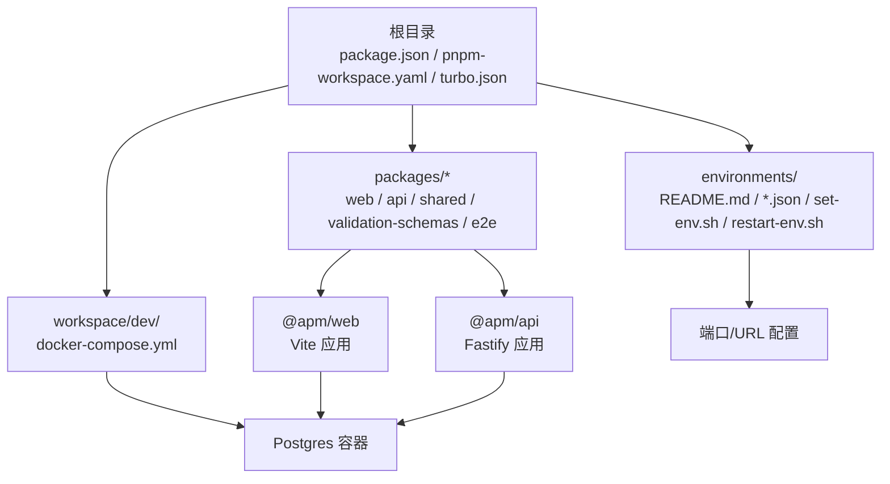
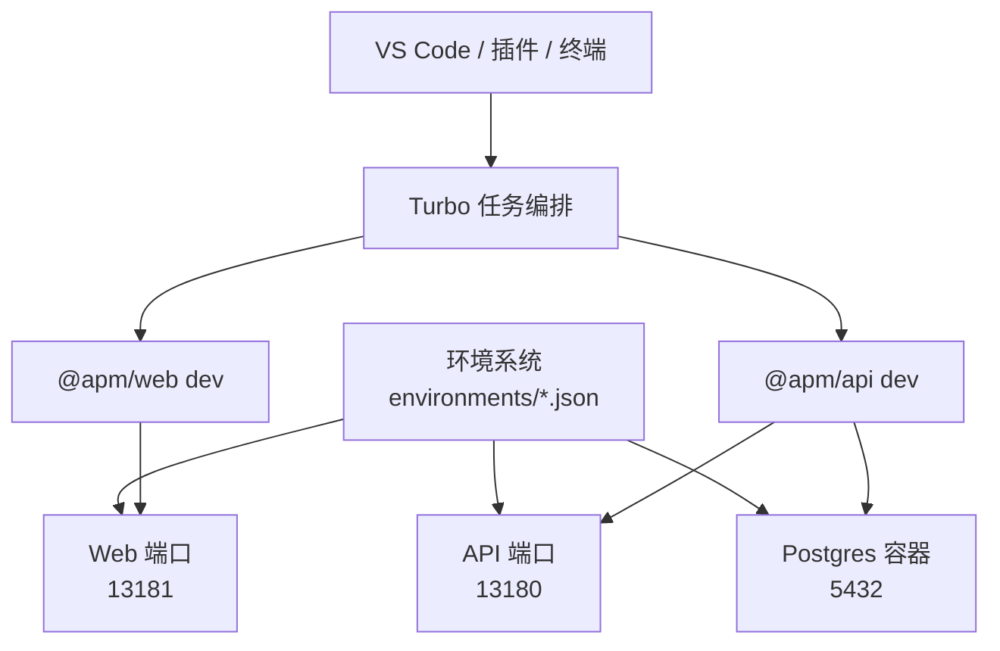
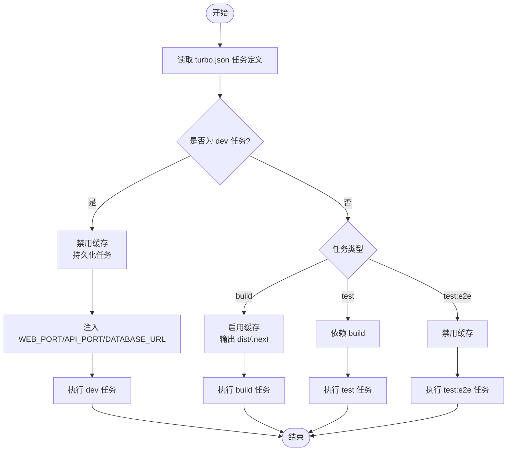
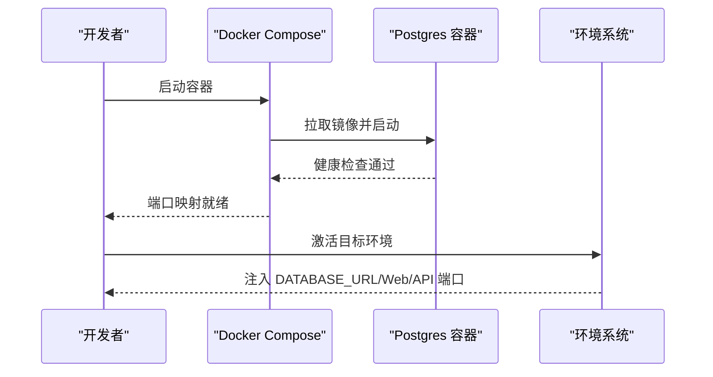
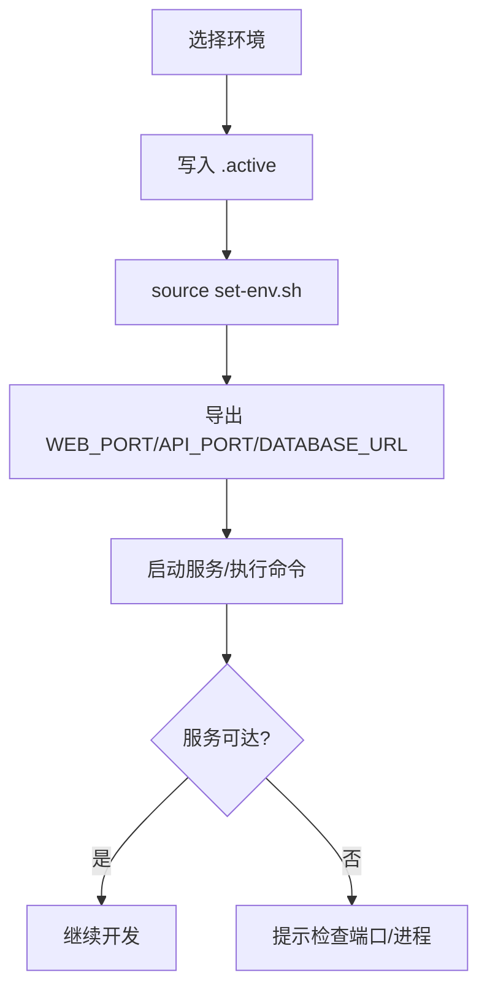
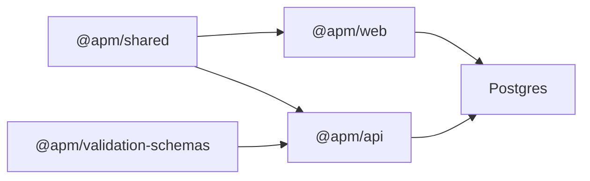

# 工具配置

<cite>
**本文引用的文件**
- [package.json](file://package.json)
- [pnpm-workspace.yaml](file://pnpm-workspace.yaml)
- [turbo.json](file://turbo.json)
- [environments/README.md](file://environments/README.md)
- [environments/dev1.json](file://environments/dev1.json)
- [workspace/dev/docker-compose.yml](file://workspace/dev/docker-compose.yml)
- [packages/api/package.json](file://packages/api/package.json)
- [packages/web/package.json](file://packages/web/package.json)
</cite>

## 目录
1. [简介](#简介)
2. [项目结构](#项目结构)
3. [核心组件](#核心组件)
4. [架构总览](#架构总览)
5. [详细组件分析](#详细组件分析)
6. [依赖分析](#依赖分析)
7. [性能考虑](#性能考虑)
8. [故障排查指南](#故障排查指南)
9. [结论](#结论)
10. [附录](#附录)

## 简介
本文件面向“AI原型管理系统”的开发者，提供一套可落地的开发工具配置方案，涵盖 IDE 设置建议（VS Code）、pnpm monorepo 工作空间与 Turborepo 构建缓存优化、调试与测试工具、代码格式化（Prettier、ESLint）、Docker 开发环境、数据库开发工具、API 测试工具（Postman/Insomnia）、环境变量与密钥安全、日志配置等，帮助团队快速搭建高效一致的开发环境。

## 项目结构
该项目采用 pnpm + Turborepo 的 monorepo 架构，根目录通过工作空间声明各子包；前端使用 Vite，后端使用 Fastify；数据库通过 Docker Compose 提供 Postgres；环境变量与端口通过 environments 目录集中管理。

图表来源
- [pnpm-workspace.yaml:1-3](file://pnpm-workspace.yaml#L1-L3)
- [packages/web/package.json:1-1](file://packages/web/package.json#L1-L1)
- [packages/api/package.json:1-1](file://packages/api/package.json#L1-L1)
- [workspace/dev/docker-compose.yml:1-20](file://workspace/dev/docker-compose.yml#L1-L20)
- [environments/README.md:1-103](file://environments/README.md#L1-L103)

章节来源
- [pnpm-workspace.yaml:1-3](file://pnpm-workspace.yaml#L1-L3)
- [turbo.json:1-1](file://turbo.json#L1-L1)
- [environments/README.md:1-103](file://environments/README.md#L1-L103)

## 核心组件
- 包管理与工作空间
  - pnpm 作为包管理器，根目录定义工作空间范围，统一安装与链接依赖。
- 构建与任务编排
  - Turbo 作为任务编排与缓存引擎，支持增量构建、并行执行与跨包依赖。
- 前端应用
  - Vite 提供开发服务器与构建能力，类型检查与构建链路由 TypeScript/Vite 协同完成。
- 后端应用
  - Fastify 提供高性能 API 服务，配合 Drizzle ORM 进行数据库迁移与查询。
- 数据库
  - Docker Compose 提供 Postgres 实例，健康检查保障可用性。
- 环境与端口
  - environments 目录集中管理不同环境的端口与 URL，确保前后端与数据库端口不冲突。

章节来源
- [package.json:1-2](file://package.json#L1-L2)
- [turbo.json:1-1](file://turbo.json#L1-L1)
- [packages/web/package.json:1-1](file://packages/web/package.json#L1-L1)
- [packages/api/package.json:1-1](file://packages/api/package.json#L1-L1)
- [workspace/dev/docker-compose.yml:1-20](file://workspace/dev/docker-compose.yml#L1-L20)
- [environments/dev1.json:1-1](file://environments/dev1.json#L1-L1)

## 架构总览
下图展示开发环境中的关键组件交互：IDE 通过 VS Code 插件与任务面板触发 Turbo 任务；Turbo 并行执行各包的 dev/build/lint/test；Web 与 API 分别监听各自端口；API 通过 DATABASE_URL 连接 Postgres；环境系统负责注入端口与连接参数。

图表来源
- [turbo.json:1-1](file://turbo.json#L1-L1)
- [packages/web/package.json:1-1](file://packages/web/package.json#L1-L1)
- [packages/api/package.json:1-1](file://packages/api/package.json#L1-L1)
- [workspace/dev/docker-compose.yml:1-20](file://workspace/dev/docker-compose.yml#L1-L20)
- [environments/dev1.json:1-1](file://environments/dev1.json#L1-L1)

## 详细组件分析

### VS Code 配置与插件推荐
- 推荐扩展
  - ESLint：统一代码规范与即时修复
  - Prettier：统一格式化风格
  - EditorConfig：保持团队缩进与换行一致
  - TypeScript Importer：自动导入类型与模块
  - Tailwind CSS IntelliSense：支持 Tailwind 类名提示
  - Docker：容器开发辅助
  - REST Client / Hoppscotch：API 测试（可选）
- 工作区设置建议
  - 将根目录设为工作区，启用 ESLint 与 Prettier
  - 在工作区设置中固定默认终端为集成终端，便于执行脚本
  - 配置任务面板快捷键，一键触发 Turbo 任务
- 主题与配色
  - 推荐使用高对比度暗色主题，减少长时间编码疲劳
  - 与 Tailwind 设计令牌保持一致的 UI 预览一致性

### pnpm monorepo 工作空间配置
- 工作空间范围
  - 通过 pnpm-workspace.yaml 声明 packages/*，确保所有子包被纳入统一管理
- 依赖安装与链接
  - 使用 pnpm install 完成一次性安装，自动处理 workspace:* 依赖
- 版本与发布
  - 建议在根目录统一管理版本与发布流程，避免子包版本漂移

章节来源
- [pnpm-workspace.yaml:1-3](file://pnpm-workspace.yaml#L1-L3)
- [package.json:1-2](file://package.json#L1-L2)

### Turborepo 构建缓存与任务优化
- 任务定义
  - build：按拓扑顺序依赖上游包，输出 dist/.next 等产物目录
  - dev：持久化任务，缓存关闭，注入 WEB_PORT/API_PORT/DATABASE_URL 环境变量
  - test：依赖 build，确保测试在已构建产物基础上进行
  - test:e2e：禁用缓存，保证端到端测试稳定性
- 缓存策略
  - 对于频繁变更的 dev 任务禁用缓存，确保热更新及时
  - 对于稳定且耗时的 build 任务启用缓存，提升重复构建速度
- 并行与依赖
  - Turbo 自动识别包间依赖，最大化并行度，缩短整体构建时间

图表来源
- [turbo.json:1-1](file://turbo.json#L1-L1)

章节来源
- [turbo.json:1-1](file://turbo.json#L1-L1)

### 调试工具配置
- 前端调试
  - 在 VS Code 中为 @apm/web 创建 launch 配置，指向 Vite 开发服务器
  - 支持断点、变量检查与网络请求观察
- 后端调试
  - 为 @apm/api 创建 Node.js 启动配置，使用 tsx 监听模式
  - 配置断点于路由、中间件与数据库调用处
- 环境注入
  - 通过环境系统激活后，确保 API 能正确读取 DATABASE_URL 与端口

章节来源
- [packages/web/package.json:1-1](file://packages/web/package.json#L1-L1)
- [packages/api/package.json:1-1](file://packages/api/package.json#L1-L1)
- [environments/README.md:1-103](file://environments/README.md#L1-L103)

### 测试工具设置
- 单元测试（Vitest）
  - @apm/api 使用 Vitest 进行单元测试，建议在 VS Code 中配置测试运行器
- 端到端测试（Playwright）
  - 基于浏览器自动化，建议在 CI 中单独运行，避免与本地缓存冲突
- 测试覆盖率与报告
  - 建议在 CI 中生成覆盖率报告并上传至平台

章节来源
- [packages/api/package.json:1-1](file://packages/api/package.json#L1-L1)

### 代码格式化与规范（Prettier、ESLint）
- Prettier
  - 统一缩进、引号、尾随逗号等格式规则
  - 与 VS Code 的保存时格式化结合，确保提交前一致
- ESLint
  - 结合 TypeScript 与 React 规范，开启必要的规则集
  - 在 CI 中强制执行，失败即阻止合并
- 冲突与兼容
  - 若 Prettier 与 ESLint 规则冲突，以 Prettier 为主，ESLint 负责逻辑与风格约束

### Docker 开发环境配置
- 本地数据库
  - 使用 workspace/dev/docker-compose.yml 启动 Postgres，设置健康检查
  - 端口映射为 5432:5432，数据卷持久化
- 环境变量注入
  - 通过环境系统生成 DATABASE_URL，避免硬编码
- 多环境隔离
  - 通过不同环境 JSON 文件分配不同端口，避免冲突

图表来源
- [workspace/dev/docker-compose.yml:1-20](file://workspace/dev/docker-compose.yml#L1-L20)
- [environments/README.md:1-103](file://environments/README.md#L1-L103)

章节来源
- [workspace/dev/docker-compose.yml:1-20](file://workspace/dev/docker-compose.yml#L1-L20)
- [environments/README.md:1-103](file://environments/README.md#L1-L103)

### 数据库开发工具设置
- Drizzle Kit
  - 生成迁移、执行迁移、打开 Studio
- 数据库连接
  - 通过 DATABASE_URL 连接，确保端口与凭据来自环境系统
- 数据模型与迁移
  - 建议在本地快速迭代模型，迁移文件纳入版本控制

章节来源
- [packages/api/package.json:1-1](file://packages/api/package.json#L1-L1)
- [environments/README.md:1-103](file://environments/README.md#L1-L103)

### API 测试工具（Postman、Insomnia）
- Postman
  - 导入 OpenAPI/Swagger 文档，自动生成集合
  - 使用环境变量管理不同环境的 BASE URL 与认证信息
- Insomnia
  - 支持分组与环境切换，适合复杂场景的协作
- 建议
  - 将测试用例纳入版本控制，CI 中可复用

### 开发环境变量管理与密钥安全
- 环境系统
  - 通过 environments/*.json 定义端口与 URL，.active 记录当前环境
  - set-env.sh 负责导出环境变量，restart-env.sh 支持完整重启
- 端口分配
  - Web/API/DB 按规则分配端口，避免相邻环境冲突
- 安全约束
  - DATABASE_URL 由环境系统动态生成，禁止硬编码
  - AI 仅能读取与验证，不能修改环境文件

图表来源
- [environments/README.md:1-103](file://environments/README.md#L1-L103)

章节来源
- [environments/README.md:1-103](file://environments/README.md#L1-L103)

### 日志配置
- 建议
  - 前端与后端分别输出结构化日志，便于检索
  - 在 Docker 环境中统一收集容器日志，保留关键错误堆栈
  - 在 VS Code 中使用日志面板或终端查看实时日志

## 依赖分析
- 包间耦合
  - @apm/web 依赖 @apm/shared 与 UI 组件库
  - @apm/api 依赖 @apm/shared 与 @apm/validation-schemas，并通过 Drizzle ORM 访问数据库
- 外部依赖
  - Vite、React、TailwindCSS、TypeScript 等前端生态
  - Fastify、Drizzle ORM、Postgres 等后端生态
- 环境与外部集成
  - 环境系统与 Docker、数据库、API 服务形成闭环

图表来源
- [packages/web/package.json:1-1](file://packages/web/package.json#L1-L1)
- [packages/api/package.json:1-1](file://packages/api/package.json#L1-L1)

章节来源
- [packages/web/package.json:1-1](file://packages/web/package.json#L1-L1)
- [packages/api/package.json:1-1](file://packages/api/package.json#L1-L1)

## 性能考虑
- Turbo 缓存
  - build 任务启用缓存，dev 禁用缓存，test:e2e 禁用缓存，平衡速度与准确性
- 并行执行
  - Turbo 自动识别依赖，最大化并行度
- 本地数据库
  - 使用健康检查与持久化卷，减少反复初始化成本

## 故障排查指南
- 端口冲突
  - 检查 environments/*.json 的端口分配，确保与系统占用无冲突
- 数据库连接失败
  - 确认 Docker 容器健康，DATABASE_URL 来源于环境系统
- 环境变量未生效
  - 确保使用 source 方式加载 set-env.sh，而非直接运行
- Turbo 缓存问题
  - 清理缓存后重试，或临时禁用缓存定位问题

章节来源
- [environments/README.md:1-103](file://environments/README.md#L1-L103)
- [turbo.json:1-1](file://turbo.json#L1-L1)

## 结论
通过 pnpm + Turborepo 的工作空间与任务编排、统一的环境系统与 Docker 数据库、以及完善的调试与测试工具链，团队可以快速搭建稳定高效的开发环境。建议在团队内固化 VS Code 插件清单、ESLint/Prettier 规则与环境变量管理流程，持续优化构建与测试效率。

## 附录
- 常用命令速查
  - 安装依赖：pnpm install
  - 启动开发：pnpm dev（由 Turbo 并行启动 web/api）
  - 构建：pnpm build
  - 代码检查：pnpm lint
  - 单元测试：pnpm test
  - 端到端测试：pnpm test:e2e
  - 数据库迁移：pnpm db:migrate（在 @apm/api 包内）
  - Drizzle Studio：pnpm db:studio（在 @apm/api 包内）