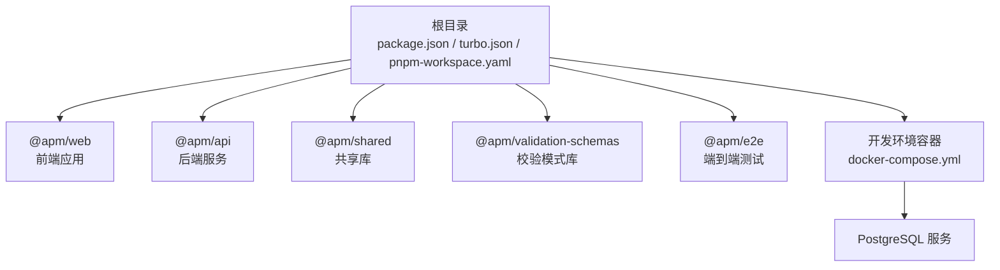
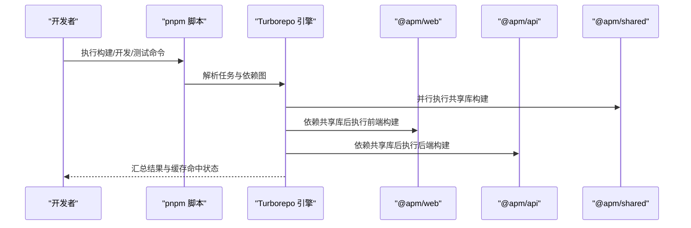
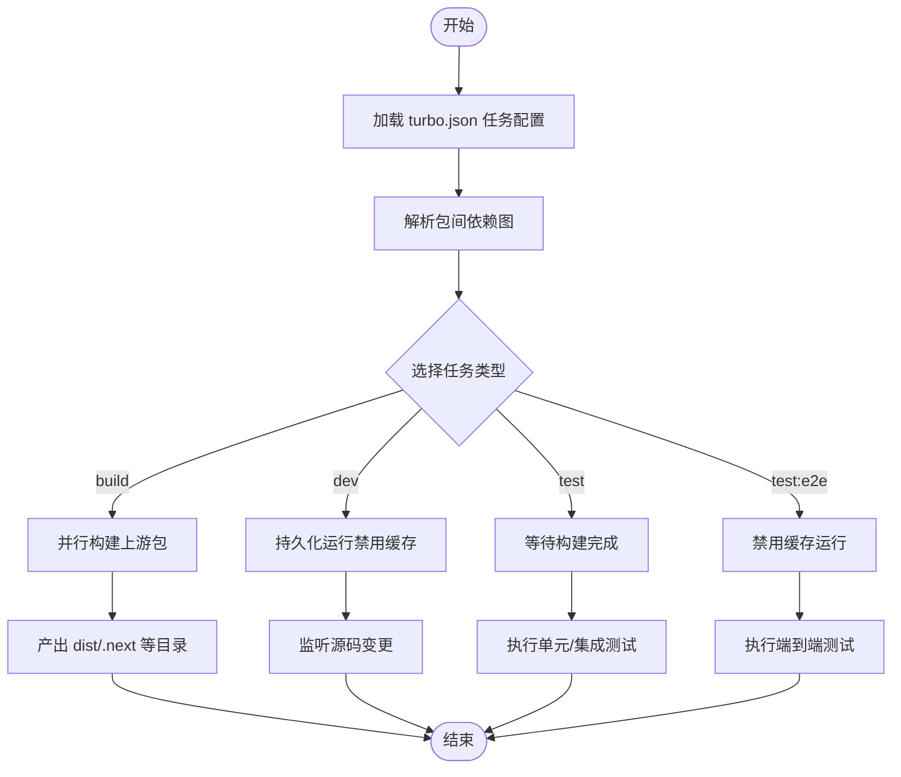
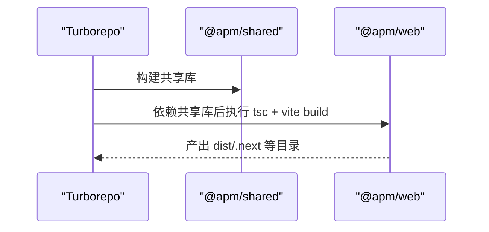
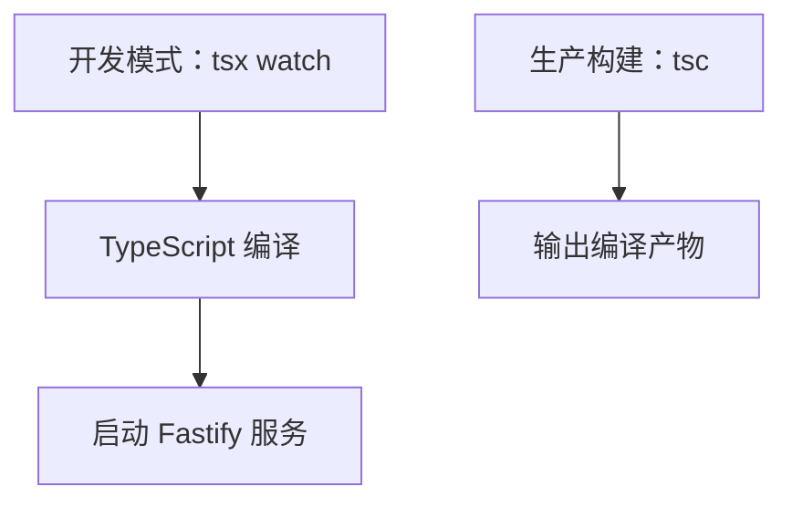
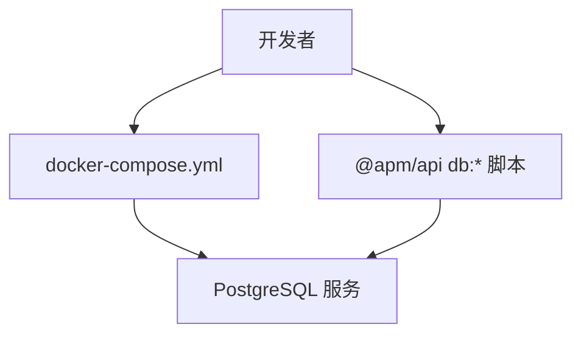
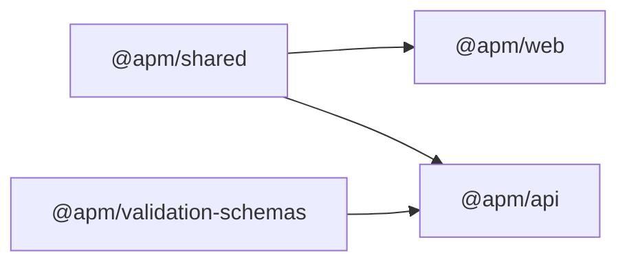

# 构建工具配置

<cite>
**本文引用的文件**
- [turbo.json](file://turbo.json)
- [package.json](file://package.json)
- [pnpm-workspace.yaml](file://pnpm-workspace.yaml)
- [docker-compose.yml](file://workspace/dev/docker-compose.yml)
- [web 包 package.json](file://packages/web/package.json)
- [api 包 package.json](file://packages/api/package.json)
- [shared 包 package.json](file://packages/shared/package.json)
- [validation-schemas 包 package.json](file://packages/validation-schemas/package.json)
- [e2e 包 package.json](file://packages/e2e/package.json)
</cite>

## 目录
1. [简介](#简介)
2. [项目结构](#项目结构)
3. [核心组件](#核心组件)
4. [架构总览](#架构总览)
5. [详细组件分析](#详细组件分析)
6. [依赖分析](#依赖分析)
7. [性能考虑](#性能考虑)
8. [故障排查指南](#故障排查指南)
9. [结论](#结论)
10. [附录](#附录)

## 简介
本文件面向 AI 原型管理系统，系统性梳理基于 Turborepo 的构建工具配置与使用方法，覆盖任务定义、缓存策略、并行执行、依赖图分析、前端构建（Vite）、后端构建（TypeScript 编译）、数据库迁移、Docker 容器化、多环境构建与 CI/CD 集成等主题。目标是帮助开发者快速理解并高效使用该构建体系，同时提供性能优化与运维实践建议。

## 项目结构
项目采用 monorepo 结构，使用 pnpm 工作区管理多个包，并通过 Turborepo 统一调度构建任务。根目录包含工作区与构建配置文件，各业务与共享能力分别位于 packages 子目录中。

**图表来源**
- [pnpm-workspace.yaml:1-3](file://pnpm-workspace.yaml#L1-L3)
- [package.json:1-2](file://package.json#L1-L2)
- [turbo.json:1-1](file://turbo.json#L1-L1)
- [docker-compose.yml:1-20](file://workspace/dev/docker-compose.yml#L1-L20)

**章节来源**
- [pnpm-workspace.yaml:1-3](file://pnpm-workspace.yaml#L1-L3)
- [package.json:1-2](file://package.json#L1-L2)
- [turbo.json:1-1](file://turbo.json#L1-L1)

## 核心组件
- Turborepo 核心：统一的任务编排、缓存与并行执行引擎，通过根级 turbo.json 定义任务契约与缓存规则。
- 包管理：pnpm 工作区管理多包依赖与脚本入口，确保跨包依赖解析与版本一致性。
- 开发容器：Docker Compose 提供本地 Postgres 数据库服务，支撑数据库迁移与集成测试。
- 各子包脚本：前端（Vite + TypeScript）、后端（Fastify + TypeScript）、共享库（纯 TS）、校验模式库（TS + JSON Schema 工具）、端到端测试（Playwright）。

**章节来源**
- [turbo.json:1-1](file://turbo.json#L1-L1)
- [package.json:1-2](file://package.json#L1-L2)
- [pnpm-workspace.yaml:1-3](file://pnpm-workspace.yaml#L1-L3)
- [docker-compose.yml:1-20](file://workspace/dev/docker-compose.yml#L1-L20)
- [web 包 package.json:1-1](file://packages/web/package.json#L1-L1)
- [api 包 package.json:1-1](file://packages/api/package.json#L1-L1)
- [shared 包 package.json:1-1](file://packages/shared/package.json#L1-L1)
- [validation-schemas 包 package.json:1-1](file://packages/validation-schemas/package.json#L1-L1)
- [e2e 包 package.json:1-1](file://packages/e2e/package.json#L1-L1)

## 架构总览
下图展示从命令入口到具体任务执行的总体流程，以及各包之间的依赖关系与输出产物位置。

**图表来源**
- [package.json:1-2](file://package.json#L1-L2)
- [turbo.json:1-1](file://turbo.json#L1-L1)
- [shared 包 package.json:1-1](file://packages/shared/package.json#L1-L1)
- [web 包 package.json:1-1](file://packages/web/package.json#L1-L1)
- [api 包 package.json:1-1](file://packages/api/package.json#L1-L1)

## 详细组件分析

### Turborepo 任务与缓存策略
- 任务定义
  - build：继承自上游包的构建顺序，声明输出目录用于缓存判定。
  - dev：禁用缓存，持久化运行，暴露端口与数据库连接变量。
  - test：依赖已构建产物，保证测试在稳定产物上执行。
  - test:e2e：禁用缓存，适合交互式调试与报告生成。
- 输出与缓存
  - 通过 outputs 字段声明产物路径，Turborepo 将据此判断任务是否需要重新执行。
  - dev 任务禁用缓存以支持热重载与实时调试。
- 并行与依赖图
  - 通过 dependsOn: ["^build"] 自动推导上游依赖，实现按拓扑排序的并行执行。

**图表来源**
- [turbo.json:1-1](file://turbo.json#L1-L1)

**章节来源**
- [turbo.json:1-1](file://turbo.json#L1-L1)

### 前端构建（Vite + TypeScript）
- 脚本职责
  - dev：启动 Vite 开发服务器，支持热更新与调试。
  - build：先执行 TypeScript 项目引用构建，再进行 Vite 打包。
  - preview：预览打包结果。
  - lint：运行 ESLint。
- 产物与缓存
  - build 任务受上游依赖约束，输出目录由 turbo.json 的 outputs 决定，避免重复构建。
- 依赖关系
  - 使用 @apm/shared 作为共享库，确保类型与逻辑复用。

**图表来源**
- [turbo.json:1-1](file://turbo.json#L1-L1)
- [web 包 package.json:1-1](file://packages/web/package.json#L1-L1)
- [shared 包 package.json:1-1](file://packages/shared/package.json#L1-L1)

**章节来源**
- [web 包 package.json:1-1](file://packages/web/package.json#L1-L1)
- [turbo.json:1-1](file://turbo.json#L1-L1)

### 后端构建（TypeScript 编译）
- 脚本职责
  - dev：使用 tsx 监听模式启动 Fastify 应用，便于开发调试。
  - build：执行 TypeScript 编译。
  - db:*：数据库相关脚本（生成、迁移、Studio、种子数据），用于数据库生命周期管理。
- 依赖关系
  - 依赖 @apm/shared 与 @apm/validation-schemas，确保类型与校验一致。

**图表来源**
- [api 包 package.json:1-1](file://packages/api/package.json#L1-L1)

**章节来源**
- [api 包 package.json:1-1](file://packages/api/package.json#L1-L1)

### 共享库与校验模式库（纯 TypeScript）
- 职责
  - shared：提供跨包复用的类型与工具函数。
  - validation-schemas：提供基于 TypeBox/AJV 的校验模式与工具。
- 构建
  - 仅执行 tsc，无额外测试或 lint 脚本，保持最小化构建开销。

**章节来源**
- [shared 包 package.json:1-1](file://packages/shared/package.json#L1-L1)
- [validation-schemas 包 package.json:1-1](file://packages/validation-schemas/package.json#L1-L1)

### 端到端测试（Playwright）
- 脚本职责
  - test：执行无头浏览器测试。
  - test:headed：带界面运行，便于调试。
  - test:debug：进入调试模式。
  - report：打开测试报告。
- 运行特性
  - 在 CI 中可结合缓存禁用策略，确保每次运行的稳定性。

**章节来源**
- [e2e 包 package.json:1-1](file://packages/e2e/package.json#L1-L1)

### 数据库迁移与开发环境
- 开发数据库
  - 使用 Docker Compose 启动 PostgreSQL 服务，设置健康检查与持久卷。
- 迁移与种子
  - 通过 api 包中的 db:* 脚本完成迁移、Studio 与种子数据初始化，确保本地与 CI 环境一致。

**图表来源**
- [docker-compose.yml:1-20](file://workspace/dev/docker-compose.yml#L1-L20)
- [api 包 package.json:1-1](file://packages/api/package.json#L1-L1)

**章节来源**
- [docker-compose.yml:1-20](file://workspace/dev/docker-compose.yml#L1-L20)
- [api 包 package.json:1-1](file://packages/api/package.json#L1-L1)

## 依赖分析
- 工作区与包管理
  - pnpm-workspace.yaml 声明 packages/* 为工作区范围，确保跨包引用与版本收敛。
- 包间依赖
  - @apm/web 依赖 @apm/shared；@apm/api 依赖 @apm/shared 与 @apm/validation-schemas。
- 任务依赖
  - build 任务通过 dependsOn: ["^build"] 自动继承上游构建顺序，形成拓扑有序的并行执行图。

**图表来源**
- [pnpm-workspace.yaml:1-3](file://pnpm-workspace.yaml#L1-L3)
- [web 包 package.json:1-1](file://packages/web/package.json#L1-L1)
- [api 包 package.json:1-1](file://packages/api/package.json#L1-L1)
- [shared 包 package.json:1-1](file://packages/shared/package.json#L1-L1)
- [validation-schemas 包 package.json:1-1](file://packages/validation-schemas/package.json#L1-L1)

**章节来源**
- [pnpm-workspace.yaml:1-3](file://pnpm-workspace.yaml#L1-L3)
- [web 包 package.json:1-1](file://packages/web/package.json#L1-L1)
- [api 包 package.json:1-1](file://packages/api/package.json#L1-L1)
- [shared 包 package.json:1-1](file://packages/shared/package.json#L1-L1)
- [validation-schemas 包 package.json:1-1](file://packages/validation-schemas/package.json#L1-L1)

## 性能考虑
- 增量构建与缓存命中
  - 利用 turbo.json 的 outputs 字段精确声明产物路径，避免不必要的重建。
  - 对于开发场景，dev 任务禁用缓存以获得最佳 DX；生产构建启用缓存以加速重复任务。
- 并行度与依赖图
  - 通过 dependsOn: ["^build"] 让 Turborepo 自动计算最小依赖集合，最大化并行度。
- 任务粒度拆分
  - 将 lint、test、build 分离为独立任务，便于按需执行与缓存复用。
- I/O 与网络
  - 将外部服务（如数据库）置于容器中，减少本地环境差异带来的缓存失效。
- 并行执行建议
  - 在 CI 中根据 CPU 核数合理设置并行度，避免过度竞争磁盘与网络资源。
- 产物清理
  - 使用 clean 任务清理缓存与产物，防止历史状态影响后续构建。

[本节为通用性能指导，无需特定文件引用]

## 故障排查指南
- 构建未触发或缓存异常
  - 检查 turbo.json 的 outputs 是否覆盖了实际产物目录。
  - 确认任务是否正确声明 dependsOn，避免因依赖缺失导致的串行或失败。
- 开发模式无法热更新
  - 确认 dev 任务未被错误地缓存；必要时临时禁用缓存验证问题。
- 数据库迁移失败
  - 检查 docker-compose 中的健康检查与端口映射；确认 db:* 脚本参数与环境变量一致。
- 端到端测试不稳定
  - 在 CI 中避免使用禁用缓存的测试任务；确保前置依赖（如 build、db:migrate）已完成。
- 端口冲突
  - 检查 dev 任务暴露的环境变量（如 WEB_PORT、API_PORT）是否与其他进程冲突。

**章节来源**
- [turbo.json:1-1](file://turbo.json#L1-L1)
- [docker-compose.yml:1-20](file://workspace/dev/docker-compose.yml#L1-L20)
- [api 包 package.json:1-1](file://packages/api/package.json#L1-L1)
- [e2e 包 package.json:1-1](file://packages/e2e/package.json#L1-L1)

## 结论
本项目以 Turborepo 为核心，结合 pnpm 工作区与 Docker 容器化，实现了前端（Vite + Next）、后端（Fastify + TypeScript）、共享库与校验模式库的统一构建与测试体系。通过明确的任务定义、精准的缓存策略与自动化的依赖图分析，显著提升了构建效率与可维护性。建议在 CI/CD 中进一步细化任务粒度与并行度配置，持续优化缓存命中率与执行时间。

[本节为总结性内容，无需特定文件引用]

## 附录
- 多环境构建策略
  - 通过环境变量（如 DATABASE_URL、WEB_PORT、API_PORT）区分开发、UAT、生产环境。
  - 在 CI 中按环境注入对应配置，确保构建与部署一致性。
- CI/CD 集成要点
  - 使用缓存键（cache key）结合依赖哈希，最大化缓存命中。
  - 将数据库迁移与服务启动前置，确保测试阶段可用的基础设施。
  - 将报告与日志归档，便于问题回溯与审计。

[本节为通用实践建议，无需特定文件引用]