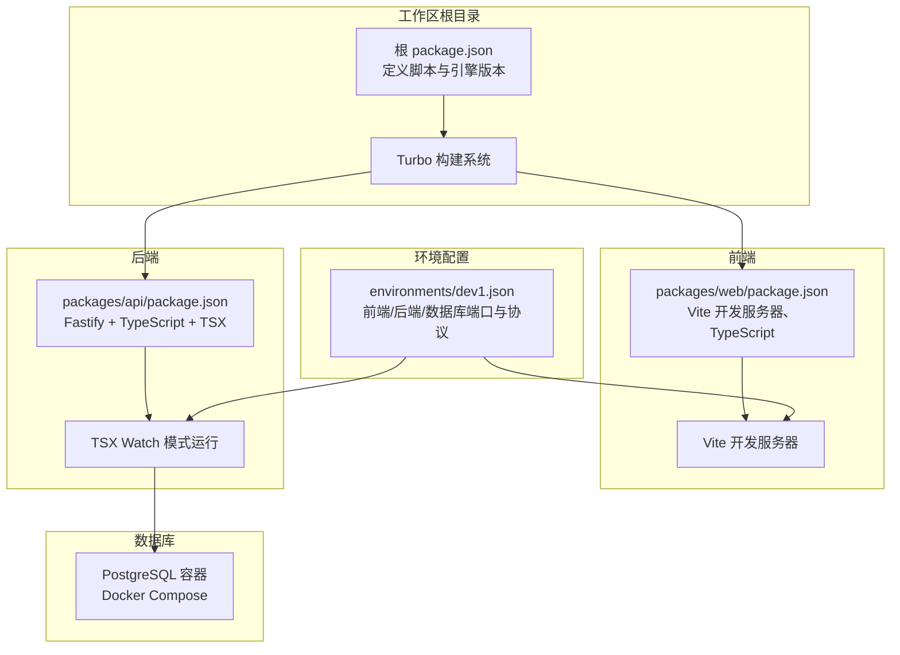
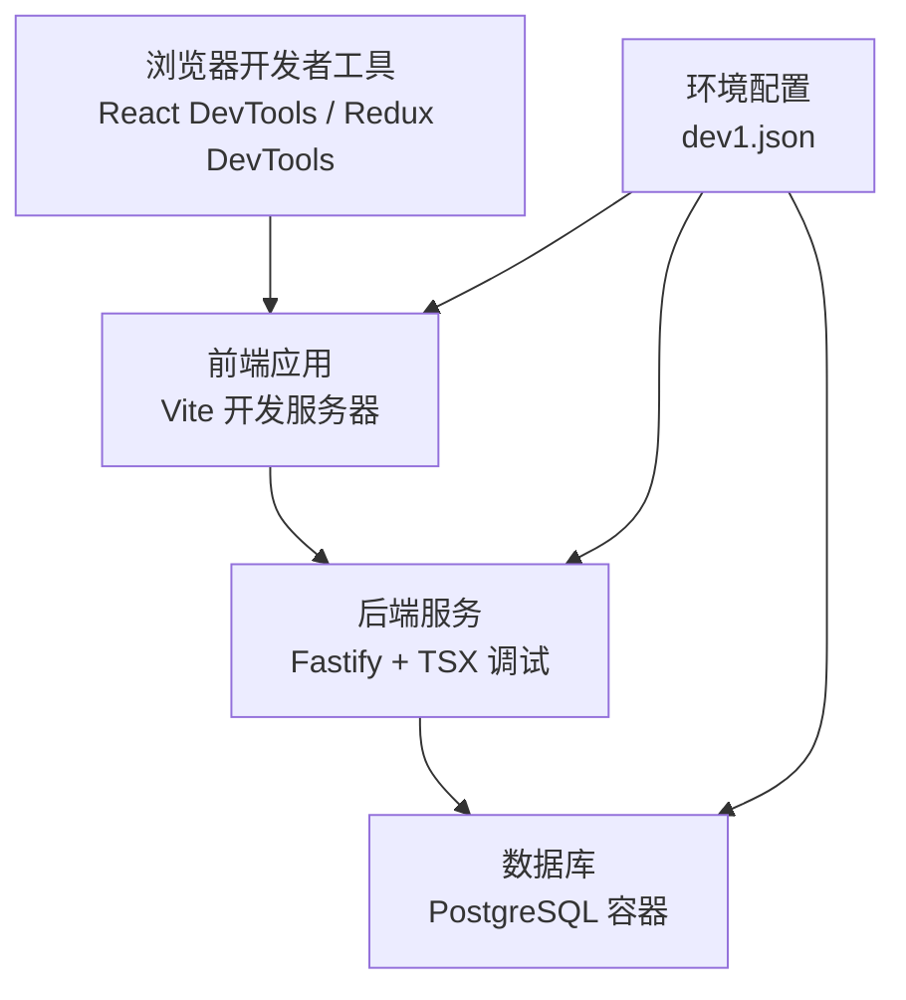
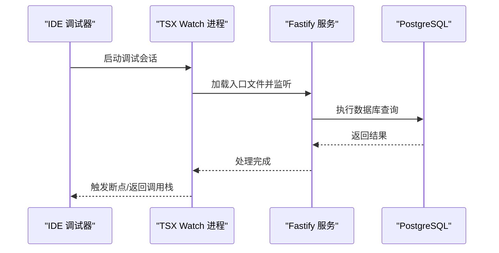
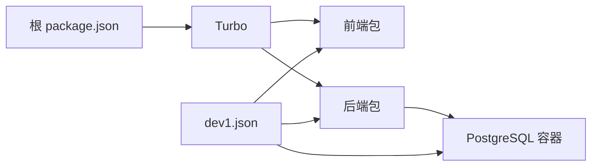

# 调试工具配置

<cite>
**本文引用的文件**
- [package.json](file://package.json)
- [docker-compose.yml](file://workspace/dev/docker-compose.yml)
- [dev1.json](file://environments/dev1.json)
- [packages/web/package.json](file://packages/web/package.json)
- [packages/api/package.json](file://packages/api/package.json)
</cite>

## 目录
1. [简介](#简介)
2. [项目结构](#项目结构)
3. [核心组件](#核心组件)
4. [架构总览](#架构总览)
5. [详细组件分析](#详细组件分析)
6. [依赖分析](#依赖分析)
7. [性能考虑](#性能考虑)
8. [故障排查指南](#故障排查指南)
9. [结论](#结论)
10. [附录](#附录)

## 简介
本指南面向“AI原型管理系统”的前后端与基础设施调试需求，覆盖以下主题：
- 前端调试：浏览器开发者工具、React DevTools、Redux DevTools 的使用建议
- 后端调试：Node.js 调试器、TypeScript 调试、数据库查询调试
- API 调试：Postman、Insomnia 的配置与使用技巧
- 日志与错误追踪：日志配置要点、错误上报与定位
- 性能分析：性能分析工具与指标采集
- 高级调试：远程调试、断点调试、条件断点
- 常见场景与最佳实践：从环境到接口、从数据库到前端渲染的调试闭环

## 项目结构
该仓库采用多包工作区（monorepo），通过统一的脚手架与构建系统组织前端、后端与共享模块。开发时可同时启动前端与后端服务，并通过环境配置文件指定端口与基础路径。

**图表来源**
- [package.json:1-2](file://package.json#L1-L2)
- [packages/web/package.json:1-1](file://packages/web/package.json#L1-L1)
- [packages/api/package.json:1-1](file://packages/api/package.json#L1-L1)
- [docker-compose.yml:1-20](file://workspace/dev/docker-compose.yml#L1-L20)
- [dev1.json:1-1](file://environments/dev1.json#L1-L1)

**章节来源**
- [package.json:1-2](file://package.json#L1-L2)
- [packages/web/package.json:1-1](file://packages/web/package.json#L1-L1)
- [packages/api/package.json:1-1](file://packages/api/package.json#L1-L1)
- [docker-compose.yml:1-20](file://workspace/dev/docker-compose.yml#L1-L20)
- [dev1.json:1-1](file://environments/dev1.json#L1-L1)

## 核心组件
- 前端开发服务器：基于 Vite 的开发模式，支持热更新与 TypeScript 编译
- 后端开发运行：基于 Fastify 的 TypeScript 应用，使用 TSX watch 模式以启用调试器与热重载
- 数据库：PostgreSQL 容器，通过 Docker Compose 提供本地数据库实例
- 环境配置：dev1.json 统一声明前端端口、后端端口、基础路径与数据库连接信息

**章节来源**
- [packages/web/package.json:1-1](file://packages/web/package.json#L1-L1)
- [packages/api/package.json:1-1](file://packages/api/package.json#L1-L1)
- [docker-compose.yml:1-20](file://workspace/dev/docker-compose.yml#L1-L20)
- [dev1.json:1-1](file://environments/dev1.json#L1-L1)

## 架构总览
下图展示开发阶段的调试相关组件交互：浏览器开发者工具与 React DevTools 用于前端调试；后端通过 TSX watch 与 Node.js 调试器配合；数据库通过 Docker Compose 提供本地实例，便于 SQL 查询与性能观察。

**图表来源**
- [packages/web/package.json:1-1](file://packages/web/package.json#L1-L1)
- [packages/api/package.json:1-1](file://packages/api/package.json#L1-L1)
- [docker-compose.yml:1-20](file://workspace/dev/docker-compose.yml#L1-L20)
- [dev1.json:1-1](file://environments/dev1.json#L1-L1)

## 详细组件分析

### 前端调试配置（浏览器、React DevTools、Redux DevTools）
- 浏览器开发者工具
  - 打开方式：F12 或右键检查元素
  - 关键面板：Elements、Console、Sources、Network、Performance、Memory
  - 断点调试：在 Sources 中对源码行设置断点，或使用条件断点
  - 网络请求：在 Network 面板观察 API 请求、响应状态与耗时
  - 性能：Performance 面板记录帧率、CPU 占用与长任务
- React DevTools
  - 安装浏览器扩展后，在 Elements 面板查看组件树、Props 与 State
  - 使用 Profiler 分析组件渲染次数与耗时
- Redux DevTools（如使用 Redux）
  - 安装浏览器扩展，查看 Action 列表、State 变化与时间旅行
  - 结合 React DevTools，定位状态变更来源

提示：本仓库前端基于 Next.js 生态，React DevTools 与 Redux DevTools 均可按上述方式使用。

### 后端调试配置（Node.js 调试器、TypeScript 调试、数据库查询调试）
- Node.js 调试器与 TSX
  - 使用 TSX watch 模式启动后端服务，可在代码中直接设置断点并进行调试
  - 在 IDE 中配置 Node.js 调试任务，附加到 TSX 进程
  - 条件断点：根据请求路径、查询参数或变量值设置断点
- TypeScript 调试
  - 确保 tsconfig 生成 sourcemap，以便断点映射到源码
  - 在 IDE 中选择 TSX 调试配置，确保类型检查与断点同步
- 数据库查询调试
  - 使用 Docker Compose 启动 PostgreSQL 容器，访问本地端口
  - 在数据库客户端中执行 SQL，结合后端日志定位慢查询
  - 使用 EXPLAIN/EXPLAIN ANALYZE 分析查询计划

**图表来源**
- [packages/api/package.json:1-1](file://packages/api/package.json#L1-L1)
- [docker-compose.yml:1-20](file://workspace/dev/docker-compose.yml#L1-L20)

**章节来源**
- [packages/api/package.json:1-1](file://packages/api/package.json#L1-L1)
- [docker-compose.yml:1-20](file://workspace/dev/docker-compose.yml#L1-L20)

### API 调试工具（Postman、Insomnia）配置与技巧
- Postman
  - 创建集合：将常用接口分组管理，统一设置环境变量（如 baseUrl、token）
  - 环境变量：在 dev1.json 中定义的后端 basePath 与端口可用于构造 baseUrl
  - 鉴权：在集合或请求级别设置 Bearer Token 或 Cookie
  - 测试脚本：在 Tests 中编写断言，验证状态码、响应体字段与时间
- Insomnia
  - 使用 Workspaces 管理不同环境与接口
  - 支持 GraphQL（如适用）、REST 与 gRPC
  - 插件生态：可安装插件增强日志与可视化
- 共享与协作
  - 导出集合/工作区，团队成员导入后即可复用断点与断言
  - 在 CI 中使用 Newman（Postman）或 Insomnia CLI 运行自动化测试

### 日志配置、错误追踪与性能分析
- 日志配置
  - 后端：在 Fastify 中注册日志插件，输出请求/响应、错误堆栈与耗时
  - 前端：在浏览器 Console 输出关键事件与错误，避免敏感信息泄露
- 错误追踪
  - 前端：集成错误上报 SDK（如 Sentry），捕获未处理异常与性能指标
  - 后端：统一异常处理器，记录上下文与用户标识，避免泄漏内部细节
- 性能分析
  - 前端：Performance 面板记录首屏、交互延迟与内存占用
  - 后端：采样 CPU/Heap Profile，定位热点函数与内存泄漏

### 高级调试技术
- 远程调试
  - 后端：通过 Node.js 调试器附加到容器内进程，或使用 SSH 隧道
  - 前端：在本地浏览器中打开远端页面，结合 Source Maps 定位问题
- 断点调试
  - 行断点：快速定位错误发生位置
  - 条件断点：仅在特定参数或状态满足时触发
  - 异常断点：在抛出未捕获异常处中断
- 网络与数据库联动
  - 在 Network 面板观察请求序列，结合数据库事务日志定位并发问题
  - 使用慢查询日志与 EXPLAIN 分析瓶颈

## 依赖分析
- 构建与开发工具链
  - 根 package.json 通过 Turbo 管理多包开发与构建
  - 前端使用 Vite 与 TypeScript，后端使用 TSX 与 Fastify
- 数据库依赖
  - Docker Compose 提供 PostgreSQL 实例，便于本地调试与迁移
- 环境配置
  - dev1.json 统一前端端口、后端端口与数据库连接信息，减少配置漂移

**图表来源**
- [package.json:1-2](file://package.json#L1-L2)
- [packages/web/package.json:1-1](file://packages/web/package.json#L1-L1)
- [packages/api/package.json:1-1](file://packages/api/package.json#L1-L1)
- [docker-compose.yml:1-20](file://workspace/dev/docker-compose.yml#L1-L20)
- [dev1.json:1-1](file://environments/dev1.json#L1-L1)

**章节来源**
- [package.json:1-2](file://package.json#L1-L2)
- [packages/web/package.json:1-1](file://packages/web/package.json#L1-L1)
- [packages/api/package.json:1-1](file://packages/api/package.json#L1-L1)
- [docker-compose.yml:1-20](file://workspace/dev/docker-compose.yml#L1-L20)
- [dev1.json:1-1](file://environments/dev1.json#L1-L1)

## 性能考虑
- 前端性能
  - 减少不必要的重渲染：合理拆分组件、使用 memo 化
  - 图片与资源优化：懒加载、压缩与 CDN
  - 首屏指标：关注 FCP/LCP/INP 等指标
- 后端性能
  - 数据库索引与查询优化：使用 EXPLAIN 分析
  - 缓存策略：对热点数据与接口结果进行缓存
  - 并发控制：限制并发与超时，避免雪崩效应
- 调试中的性能影响
  - 关闭不必要的日志级别与监控探针
  - 在生产环境谨慎开启高成本采样

## 故障排查指南
- 常见问题与定位步骤
  - 端口冲突：检查 dev1.json 中的端口是否被占用，必要时修改
  - CORS 问题：确认后端已启用 CORS 插件，前端请求头与跨域策略一致
  - 数据库连接失败：确认 Docker Compose 已启动 PostgreSQL，凭据与端口正确
  - TypeScript 编译错误：检查 tsconfig 与类型声明，确保 sourcemap 生成
- 快速恢复清单
  - 重启前端/后端开发服务器
  - 清理缓存与临时文件（如 node_modules/.vite）
  - 回滚最近一次数据库迁移并重新迁移
  - 在浏览器禁用缓存与扩展干扰

**章节来源**
- [dev1.json:1-1](file://environments/dev1.json#L1-L1)
- [docker-compose.yml:1-20](file://workspace/dev/docker-compose.yml#L1-L20)
- [packages/api/package.json:1-1](file://packages/api/package.json#L1-L1)

## 结论
通过统一的环境配置与多包开发体系，本项目在前端与后端均提供了完善的调试能力。结合浏览器开发者工具、Node.js 调试器、数据库客户端与 API 调试工具，可以快速定位问题并优化性能。建议团队建立标准化的调试流程与断言规范，持续提升开发效率与系统稳定性。

## 附录
- 环境与端口参考
  - 前端端口与 URL：由 dev1.json 中的 web 字段定义
  - 后端端口与 basePath：由 dev1.json 中的 api 字段定义
  - 数据库端口与凭据：由 Docker Compose 与 dev1.json 中的 db 字段定义
- 调试脚本与命令
  - 根级脚本：使用 Turbo 启动全栈开发
  - 前端：Vite 开发服务器
  - 后端：TSX watch 模式运行入口文件
  - 数据库：Drizzle Kit 生成迁移、执行迁移与启动 Studio

**章节来源**
- [package.json:1-2](file://package.json#L1-L2)
- [packages/web/package.json:1-1](file://packages/web/package.json#L1-L1)
- [packages/api/package.json:1-1](file://packages/api/package.json#L1-L1)
- [docker-compose.yml:1-20](file://workspace/dev/docker-compose.yml#L1-L20)
- [dev1.json:1-1](file://environments/dev1.json#L1-L1)