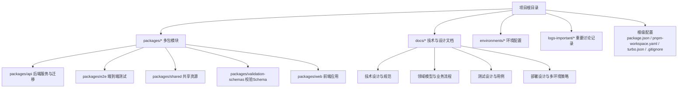
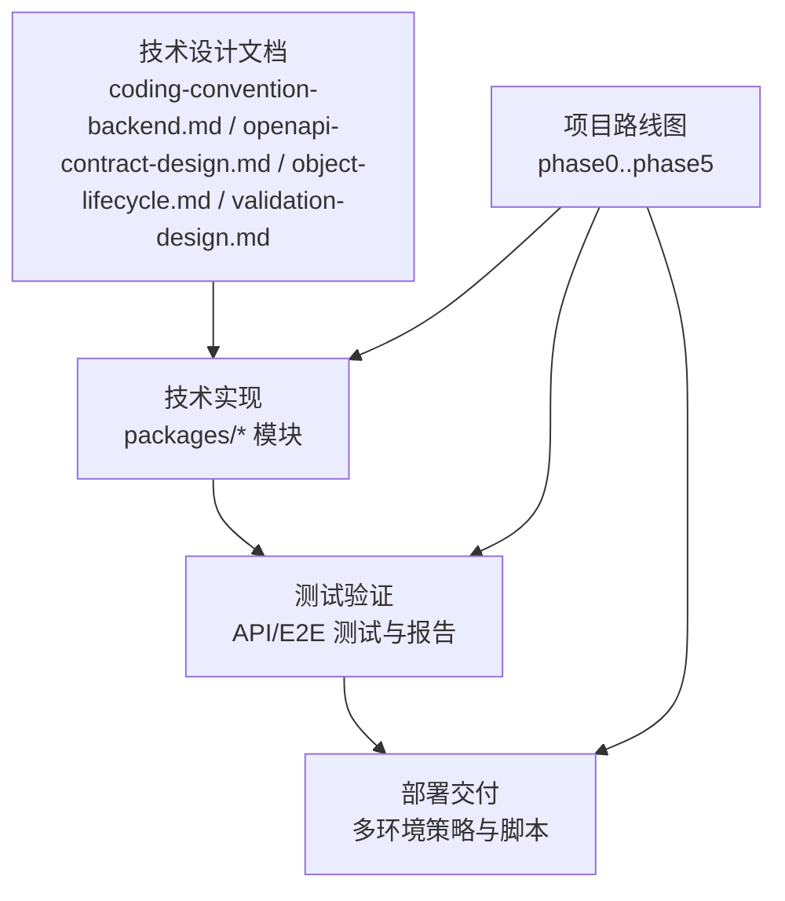
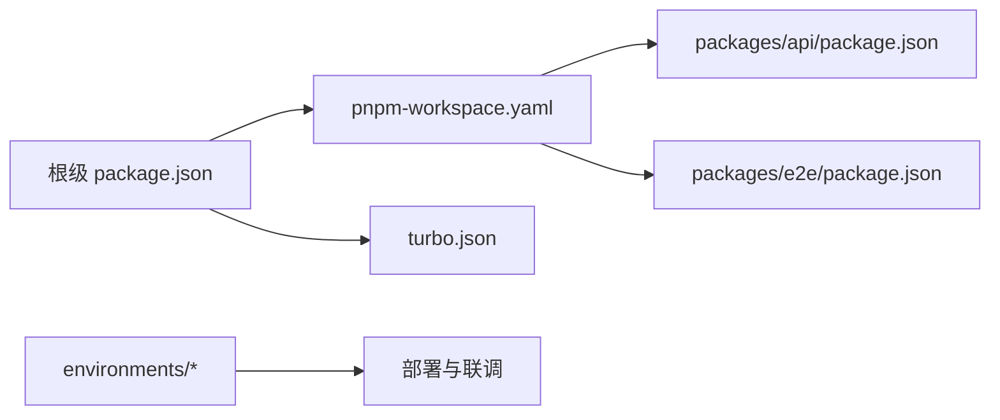

# 开发规范

<cite>
**本文引用的文件**
- [README.md](file://README.md)
- [package.json](file://package.json)
- [pnpm-workspace.yaml](file://pnpm-workspace.yaml)
- [turbo.json](file://turbo.json)
- [.gitignore](file://.gitignore)
- [docs/04-tech-design/coding-convention-backend.md](file://docs/04-tech-design/coding-convention-backend.md)
- [docs/00-project/workflow/dev-test-loop-design.md](file://docs/00-project/workflow/dev-test-loop-design.md)
- [docs/00-project/roadmap/phase0.md](file://docs/00-project/roadmap/phase0.md)
- [docs/00-project/roadmap/phase1.md](file://docs/00-project/roadmap/phase1.md)
- [docs/00-project/roadmap/phase2.md](file://docs/00-project/roadmap/phase2.md)
- [docs/00-project/roadmap/phase3.md](file://docs/00-project/roadmap/phase3.md)
- [docs/00-project/roadmap/phase4.md](file://docs/00-project/roadmap/phase4.md)
- [docs/00-project/roadmap/phase5.md](file://docs/00-project/roadmap/phase5.md)
- [packages/api/tsconfig.json](file://packages/api/tsconfig.json)
- [packages/api/package.json](file://packages/api/package.json)
- [packages/api/test-results/api-results.json](file://packages/api/test-results/api-results.json)
- [packages/api/test-results/e2e-results.json](file://packages/api/test-results/e2e-results.json)
- [packages/e2e/package.json](file://packages/e2e/package.json)
- [packages/e2e/reports/issues/run-20260512-171712-issues.json](file://packages/e2e/reports/issues/run-20260512-171712-issues.json)
- [environments/dev1.json](file://environments/dev1.json)
- [environments/dev2.json](file://environments/dev2.json)
- [environments/uat.json](file://environments/uat.json)
- [environments/README.md](file://environments/README.md)
- [logs-important/2026-04-25-conversation.md](file://logs-important/2026-04-25-conversation.md)
- [logs-important/2026-04-26-conversation.md](file://logs-important/2026-04-26-conversation.md)
- [logs-important/2026-04-29-conversation.md](file://logs-important/2026-04-29-conversation.md)
- [logs-important/2026-05-03-conversation.md](file://logs-important/2026-05-03-conversation.md)
- [logs-important/2026-05-06-conversation.md](file://logs-important/2026-05-06-conversation.md)
- [logs-important/2026-05-08-conversation.md](file://logs-important/2026-05-08-conversation.md)
- [logs-important/2026-05-11-conversation.md](file://logs-important/2026-05-11-conversation.md)
- [logs-important/2026-05-13-conversation.md](file://logs-important/2026-05-13-conversation.md)
</cite>

## 目录
1. [引言](#引言)
2. [项目结构](#项目结构)
3. [核心组件](#核心组件)
4. [架构总览](#架构总览)
5. [详细组件分析](#详细组件分析)
6. [依赖关系分析](#依赖关系分析)
7. [性能考虑](#性能考虑)
8. [故障排查指南](#故障排查指南)
9. [结论](#结论)
10. [附录](#附录)

## 引言
本开发规范面向AI原型管理系统（AI Prototype Manager）的多包工作区，旨在统一团队在TypeScript编码、Git工作流、代码审查、组件设计与架构约束、开发工具配置、文档与注释、版本与发布、重构与遗留代码处理、以及团队协作与沟通等方面的实践。文档以仓库内现有技术设计与项目路线图为依据，结合工作区配置与测试报告，形成可执行、可落地的开发标准。

## 项目结构
项目采用Monorepo与多包工作区布局，通过包管理器与构建系统实现模块化与可维护性。核心目录与职责如下：
- packages：多包模块集合
  - api：后端服务与数据库迁移相关
  - e2e：端到端测试与报告
  - shared：共享资源与公共逻辑
  - validation-schemas：校验Schema定义
  - web：前端应用（如存在）
- docs：技术设计、领域模型、测试设计、部署设计等文档
- environments：环境配置与切换脚本
- logs-important：重要讨论记录与复盘
- 根级配置：package.json、pnpm-workspace.yaml、turbo.json、.gitignore

图表来源
- [pnpm-workspace.yaml](file://pnpm-workspace.yaml)
- [turbo.json](file://turbo.json)
- [package.json](file://package.json)

章节来源
- [pnpm-workspace.yaml](file://pnpm-workspace.yaml)
- [turbo.json](file://turbo.json)
- [package.json](file://package.json)

## 核心组件
- 包管理与工作区
  - 使用 pnpm workspace 进行多包管理，统一依赖与脚本。
  - 通过根级 package.json 统一管理脚本命令与元信息。
- 构建与任务编排
  - 使用 Turbo 进行增量构建与任务缓存，提升迭代效率。
- 测试与验证
  - API 与 E2E 测试结果集中存放于各包的 test-results 与 reports 目录，便于持续集成与问题定位。
- 环境管理
  - environments 提供 dev1/dev2/uat 等环境配置与切换脚本，支持不同阶段的部署与联调。

章节来源
- [package.json](file://package.json)
- [pnpm-workspace.yaml](file://pnpm-workspace.yaml)
- [turbo.json](file://turbo.json)
- [packages/api/test-results/api-results.json](file://packages/api/test-results/api-results.json)
- [packages/api/test-results/e2e-results.json](file://packages/api/test-results/e2e-results.json)
- [packages/e2e/reports/issues/run-20260512-171712-issues.json](file://packages/e2e/reports/issues/run-20260512-171712-issues.json)
- [environments/dev1.json](file://environments/dev1.json)
- [environments/dev2.json](file://environments/dev2.json)
- [environments/uat.json](file://environments/uat.json)

## 架构总览
系统采用分层与模块化的架构设计，围绕“文档驱动设计—技术实现—测试验证—部署交付”的闭环展开。技术设计文档明确了编码规范、接口契约、对象生命周期与验证设计；路线图规划了阶段性目标与里程碑；测试设计提供了模块化测试方案；部署设计覆盖多环境策略。

图表来源
- [docs/04-tech-design/coding-convention-backend.md](file://docs/04-tech-design/coding-convention-backend.md)
- [docs/00-project/roadmap/phase0.md](file://docs/00-project/roadmap/phase0.md)
- [docs/00-project/roadmap/phase1.md](file://docs/00-project/roadmap/phase1.md)
- [docs/00-project/roadmap/phase2.md](file://docs/00-project/roadmap/phase2.md)
- [docs/00-project/roadmap/phase3.md](file://docs/00-project/roadmap/phase3.md)
- [docs/00-project/roadmap/phase4.md](file://docs/00-project/roadmap/phase4.md)
- [docs/00-project/roadmap/phase5.md](file://docs/00-project/roadmap/phase5.md)

## 详细组件分析

### TypeScript 编码标准与命名约定
- 类型安全与严格模式
  - 在 packages/api 的 tsconfig 中启用严格类型检查，确保类型推导与错误前置。
- 命名约定
  - 接口与类型使用大驼峰命名；常量使用全大写与下划线；变量与函数使用小驼峰；类名使用大驼峰；枚举项使用全大写。
- 文件组织
  - 按功能域划分目录，避免跨域耦合；公共类型与工具放置于 shared；校验Schema集中于 validation-schemas。
- 导入与模块化
  - 优先使用相对路径导入；避免循环依赖；同一功能域内的模块通过统一入口导出。

章节来源
- [packages/api/tsconfig.json](file://packages/api/tsconfig.json)
- [pnpm-workspace.yaml](file://pnpm-workspace.yaml)

### Git 工作流程与分支管理策略
- 分支模型
  - Feature Branch：新功能开发从 develop 切出，完成后合并回 develop 并触发评审与测试。
  - Release Branch：在发布前从 develop 切出，进行回归测试与预发布修复，完成后合并至 main 并打标签。
  - Hotfix Branch：线上紧急修复从 main 切出，修复后同时合并回 main 与 develop。
- 提交规范
  - 使用清晰的提交信息，遵循“类型: 内容”格式；关联需求或缺陷编号；简短描述变更动机与影响范围。
- 合并与保护
  - main 与 develop 分支需保护规则；强制要求 CI 通过与至少一名审查者批准。

章节来源
- [docs/00-project/workflow/dev-test-loop-design.md](file://docs/00-project/workflow/dev-test-loop-design.md)

### 代码审查流程与质量标准
- 审查流程
  - PR 必须附带测试用例与变更说明；至少一名审查者批准；CI 通过后方可合并。
- 质量标准
  - 单元测试覆盖率不低于阈值；API/E2E 测试通过；无阻塞性告警；代码风格符合规范。
- 测试报告
  - API 与 E2E 测试结果集中存放，便于审查时核对历史数据与回归情况。

章节来源
- [packages/api/test-results/api-results.json](file://packages/api/test-results/api-results.json)
- [packages/api/test-results/e2e-results.json](file://packages/api/test-results/e2e-results.json)
- [packages/e2e/reports/issues/run-20260512-171712-issues.json](file://packages/e2e/reports/issues/run-20260512-171712-issues.json)

### 组件设计原则与架构约束
- 设计原则
  - 单一职责：每个模块聚焦一个领域能力；高内聚低耦合；可替换与可扩展。
  - 可测试性：优先函数式与纯函数；依赖注入；易于打桩与模拟。
  - 可观测性：关键路径埋点与日志；异常链路告警。
- 架构约束
  - 文档驱动：先有设计文档再实现；接口契约由 OpenAPI 明确；对象生命周期与验证设计先行。
  - 环境隔离：dev1/dev2/uat 环境独立配置与权限控制；生产只允许热修复分支合并。

章节来源
- [docs/04-tech-design/openapi-contract-design.md](file://docs/04-tech-design/openapi-contract-design.md)
- [docs/04-tech-design/object-lifecycle.md](file://docs/04-tech-design/object-lifecycle.md)
- [docs/04-tech-design/validation-design.md](file://docs/04-tech-design/validation-design.md)
- [environments/README.md](file://environments/README.md)

### 开发工具配置与 IDE 设置建议
- 包管理与工作区
  - 使用 pnpm workspace；在根级 package.json 配置统一脚本；在 pnpm-workspace.yaml 声明工作区包。
- 构建与缓存
  - 使用 Turbo 进行增量构建；在 turbo.json 中配置任务依赖与缓存策略。
- 版本与锁定
  - 使用 pnpm-lock.yaml 锁定依赖版本；定期同步与审阅更新。
- Git 与提交钩子
  - 配置 pre-commit 检查（如 lint、格式化、基础测试）；在 .gitignore 中排除本地临时文件与日志。

章节来源
- [package.json](file://package.json)
- [pnpm-workspace.yaml](file://pnpm-workspace.yaml)
- [turbo.json](file://turbo.json)
- [.gitignore](file://.gitignore)

### 文档编写规范与注释标准
- 文档规范
  - 采用 Markdown 结构化文档；按主题与阶段分类存放于 docs；文档标题与层级清晰；链接统一指向仓库内路径。
- 注释标准
  - 函数与类添加 JSDoc 风格注释；说明参数、返回值、异常与注意事项；复杂算法补充伪代码与流程图。
- 变更追踪
  - 关键设计决策与讨论记录归档于 logs-important，便于追溯与复盘。

章节来源
- [logs-important/2026-04-25-conversation.md](file://logs-important/2026-04-25-conversation.md)
- [logs-important/2026-04-26-conversation.md](file://logs-important/2026-04-26-conversation.md)
- [logs-important/2026-04-29-conversation.md](file://logs-important/2026-04-29-conversation.md)
- [logs-important/2026-05-03-conversation.md](file://logs-important/2026-05-03-conversation.md)
- [logs-important/2026-05-06-conversation.md](file://logs-important/2026-05-06-conversation.md)
- [logs-important/2026-05-08-conversation.md](file://logs-important/2026-05-08-conversation.md)
- [logs-important/2026-05-11-conversation.md](file://logs-important/2026-05-11-conversation.md)
- [logs-important/2026-05-13-conversation.md](file://logs-important/2026-05-13-conversation.md)

### 版本管理策略与发布流程
- 版本号策略
  - 语义化版本：主版本号用于不兼容变更；次版本号用于向后兼容的功能新增；修订号用于向后兼容的问题修正。
- 发布流程
  - 从 Release Branch 进行最终验证；通过后合并至 main 并打标签；随后合并回 develop 保持同步。
- 环境与配置
  - environments 提供多环境配置与切换脚本，确保发布一致性与可回滚性。

章节来源
- [docs/00-project/roadmap/phase0.md](file://docs/00-project/roadmap/phase0.md)
- [docs/00-project/roadmap/phase1.md](file://docs/00-project/roadmap/phase1.md)
- [docs/00-project/roadmap/phase2.md](file://docs/00-project/roadmap/phase2.md)
- [docs/00-project/roadmap/phase3.md](file://docs/00-project/roadmap/phase3.md)
- [docs/00-project/roadmap/phase4.md](file://docs/00-project/roadmap/phase4.md)
- [docs/00-project/roadmap/phase5.md](file://docs/00-project/roadmap/phase5.md)
- [environments/README.md](file://environments/README.md)

### 代码重构与遗留代码处理指南
- 重构原则
  - 小步快跑、持续重构；每次改动聚焦单一问题；保留测试与文档同步更新。
- 遗留代码处理
  - 识别风险点与高频修改区域；制定迁移计划；逐步替换为新实现；保留兼容层过渡。
- 变更记录
  - 在 logs-important 中记录重构动机、方案与结果，便于后续审计与知识沉淀。

章节来源
- [logs-important/2026-04-25-conversation.md](file://logs-important/2026-04-25-conversation.md)
- [logs-important/2026-04-26-conversation.md](file://logs-important/2026-04-26-conversation.md)
- [logs-important/2026-04-29-conversation.md](file://logs-important/2026-04-29-conversation.md)
- [logs-important/2026-05-03-conversation.md](file://logs-important/2026-05-03-conversation.md)
- [logs-important/2026-05-06-conversation.md](file://logs-important/2026-05-06-conversation.md)
- [logs-important/2026-05-08-conversation.md](file://logs-important/2026-05-08-conversation.md)
- [logs-important/2026-05-11-conversation.md](file://logs-important/2026-05-11-conversation.md)
- [logs-important/2026-05-13-conversation.md](file://logs-important/2026-05-13-conversation.md)

### 团队协作与沟通规范
- 日常协作
  - 每日站会同步进展与阻塞；跨模块协作通过文档与PR评审；问题及时升级与记录。
- 文档与知识
  - 所有关键设计与决策均沉淀为文档；讨论记录归档于 logs-important；FAQ与最佳实践共享。
- 评审与反馈
  - 评审关注点包括正确性、可维护性、性能与安全性；反馈需具体且可操作。

章节来源
- [docs/00-project/workflow/dev-test-loop-design.md](file://docs/00-project/workflow/dev-test-loop-design.md)
- [logs-important/2026-04-25-conversation.md](file://logs-important/2026-04-25-conversation.md)
- [logs-important/2026-04-26-conversation.md](file://logs-important/2026-04-26-conversation.md)
- [logs-important/2026-04-29-conversation.md](file://logs-important/2026-04-29-conversation.md)
- [logs-important/2026-05-03-conversation.md](file://logs-important/2026-05-03-conversation.md)
- [logs-important/2026-05-06-conversation.md](file://logs-important/2026-05-06-conversation.md)
- [logs-important/2026-05-08-conversation.md](file://logs-important/2026-05-08-conversation.md)
- [logs-important/2026-05-11-conversation.md](file://logs-important/2026-05-11-conversation.md)
- [logs-important/2026-05-13-conversation.md](file://logs-important/2026-05-13-conversation.md)

## 依赖关系分析
- 工作区依赖
  - pnpm-workspace.yaml 声明各包的相对路径与版本策略；package.json 提供统一脚本与元信息。
- 构建依赖
  - turbo.json 描述任务依赖与缓存策略，减少重复计算。
- 环境依赖
  - environments 下的 JSON 配置与脚本为部署与联调提供支撑。

图表来源
- [package.json](file://package.json)
- [pnpm-workspace.yaml](file://pnpm-workspace.yaml)
- [turbo.json](file://turbo.json)
- [packages/api/package.json](file://packages/api/package.json)
- [packages/e2e/package.json](file://packages/e2e/package.json)

章节来源
- [package.json](file://package.json)
- [pnpm-workspace.yaml](file://pnpm-workspace.yaml)
- [turbo.json](file://turbo.json)

## 性能考虑
- 构建性能
  - 使用 Turbo 的增量构建与缓存，减少重复任务；合理拆分任务与依赖，避免不必要的串行。
- 测试性能
  - API 与 E2E 测试结果集中存放，便于快速定位失败用例与回归范围；在 CI 中并行执行不同模块测试。
- 运行时性能
  - 严格类型检查与静态分析有助于提前发现潜在性能问题；避免在热路径中进行昂贵的字符串拼接或深拷贝。

## 故障排查指南
- 测试失败定位
  - 查看 packages/api 与 packages/e2e 的测试结果文件，确认失败用例与错误堆栈；结合 logs-important 中的历史讨论定位回归原因。
- 环境问题
  - 检查 environments 下的配置文件与切换脚本，确认当前环境变量与连接参数是否正确。
- 构建与缓存
  - 清理 Turbo 缓存或禁用缓存进行复现；核对 pnpm-lock.yaml 与依赖版本一致性。

章节来源
- [packages/api/test-results/api-results.json](file://packages/api/test-results/api-results.json)
- [packages/api/test-results/e2e-results.json](file://packages/api/test-results/e2e-results.json)
- [packages/e2e/reports/issues/run-20260512-171712-issues.json](file://packages/e2e/reports/issues/run-20260512-171712-issues.json)
- [environments/dev1.json](file://environments/dev1.json)
- [environments/dev2.json](file://environments/dev2.json)
- [environments/uat.json](file://environments/uat.json)

## 结论
本开发规范以仓库内的技术设计、路线图与测试报告为基础，结合 pnpm workspace 与 Turbo 的工程化能力，形成了覆盖编码、Git、审查、设计、工具、文档、版本、重构与协作的完整标准。建议团队在日常工作中严格执行上述规范，并根据项目演进持续优化与补充。

## 附录
- 相关文档索引
  - 技术设计与规范：[coding-convention-backend.md](file://docs/04-tech-design/coding-convention-backend.md)
  - 开发-测试-发布闭环：[dev-test-loop-design.md](file://docs/00-project/workflow/dev-test-loop-design.md)
  - 项目路线图：phase0..phase5
    - [phase0.md](file://docs/00-project/roadmap/phase0.md)
    - [phase1.md](file://docs/00-project/roadmap/phase1.md)
    - [phase2.md](file://docs/00-project/roadmap/phase2.md)
    - [phase3.md](file://docs/00-project/roadmap/phase3.md)
    - [phase4.md](file://docs/00-project/roadmap/phase4.md)
    - [phase5.md](file://docs/00-project/roadmap/phase5.md)
- 环境配置
  - [environments/README.md](file://environments/README.md)
  - [dev1.json](file://environments/dev1.json)
  - [dev2.json](file://environments/dev2.json)
  - [uat.json](file://environments/uat.json)