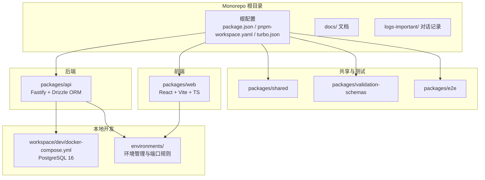
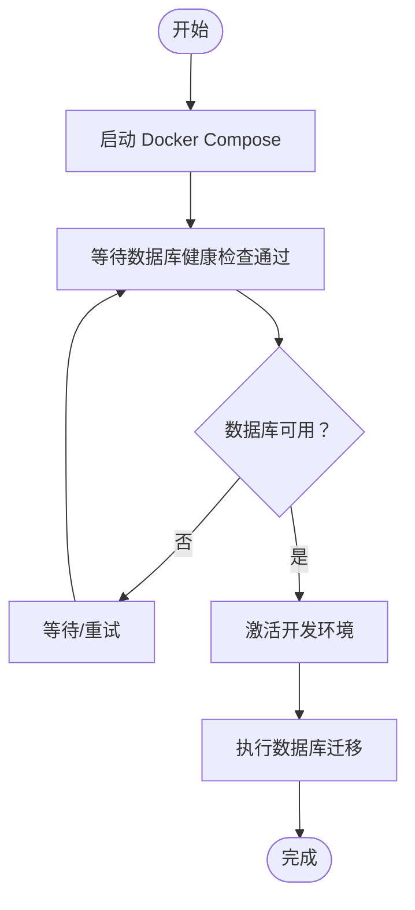
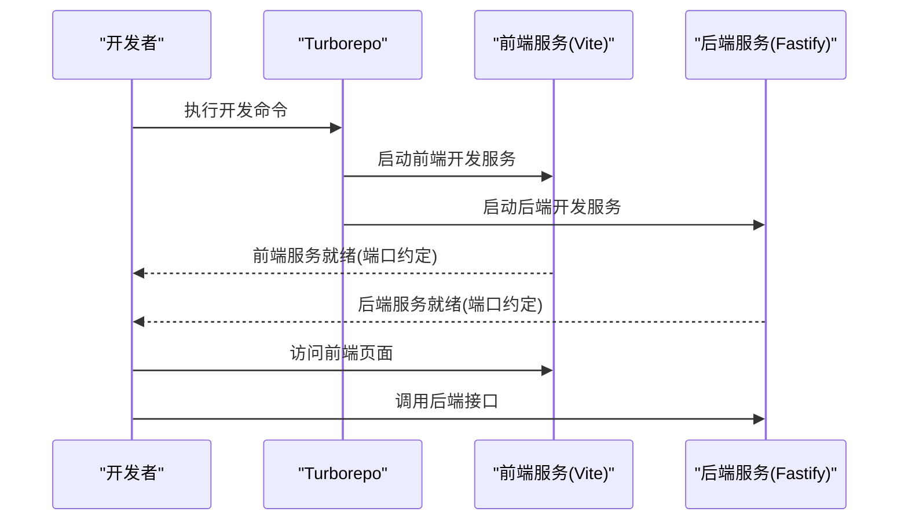

# 快速开始

<cite>
**本文引用的文件**
- [README.md](file://README.md)
- [package.json](file://package.json)
- [pnpm-workspace.yaml](file://pnpm-workspace.yaml)
- [turbo.json](file://turbo.json)
- [docker-compose.yml](file://workspace/dev/docker-compose.yml)
- [environments/README.md](file://environments/README.md)
- [CLAUDE.md](file://CLAUDE.md)
- [packages/api/package.json](file://packages/api/package.json)
- [packages/web/package.json](file://packages/web/package.json)
- [packages/shared/package.json](file://packages/shared/package.json)
- [packages/validation-schemas/package.json](file://packages/validation-schemas/package.json)
- [packages/e2e/package.json](file://packages/e2e/package.json)
</cite>

## 目录
1. [简介](#简介)
2. [项目结构](#项目结构)
3. [前置条件检查](#前置条件检查)
4. [克隆与安装](#克隆与安装)
5. [环境配置与激活](#环境配置与激活)
6. [本地数据库设置](#本地数据库设置)
7. [启动开发服务](#启动开发服务)
8. [常用命令与调试](#常用命令与调试)
9. [常见问题与故障排除](#常见问题与故障排除)
10. [最佳实践与推荐工作流](#最佳实践与推荐工作流)
11. [结语](#结语)

## 简介
本指南面向新加入的开发者，帮助你在最短时间内完成环境搭建、项目初始化与开发服务启动，从而快速投入 AI 原型管理系统的开发工作。项目采用现代化技术栈与 Monorepo 架构，后端基于 Node.js + Fastify + PostgreSQL + Drizzle ORM，前端基于 React + Vite + TypeScript，配合 pnpm workspaces 与 Turborepo 进行统一构建与开发。

## 项目结构
项目采用 Monorepo 结构，核心目录与职责如下：
- packages/api：后端 API 服务（Fastify + Drizzle ORM）
- packages/web：前端应用（React + Vite + TypeScript）
- packages/shared：前后端共享类型与工具
- packages/validation-schemas：校验 Schema 定义
- packages/e2e：端到端测试
- workspace/dev：本地开发环境（Docker Compose）
- environments：环境管理与端口分配规则
- docs：项目文档与设计规范
- logs-important：重要对话记录

图表来源
- [package.json:1-2](file://package.json#L1-L2)
- [pnpm-workspace.yaml:1-3](file://pnpm-workspace.yaml#L1-L3)
- [turbo.json:1-1](file://turbo.json#L1-L1)
- [docker-compose.yml:1-20](file://workspace/dev/docker-compose.yml#L1-L20)
- [environments/README.md:1-103](file://environments/README.md#L1-L103)

章节来源
- [README.md:32-52](file://README.md#L32-L52)
- [package.json:1-2](file://package.json#L1-L2)
- [pnpm-workspace.yaml:1-3](file://pnpm-workspace.yaml#L1-L3)
- [turbo.json:1-1](file://turbo.json#L1-L1)

## 前置条件检查
为确保顺利开发，请提前准备以下环境与工具：
- Node.js 版本：满足工程要求（工程明确要求 Node.js 版本 >= 20）
- 包管理器：pnpm（版本在工程中声明）
- Docker：用于本地数据库容器化启动
- Shell：支持 source 命令（用于环境变量激活）

建议在终端中执行以下命令验证：
- node --version
- pnpm --version
- docker --version

章节来源
- [package.json:1-2](file://package.json#L1-L2)
- [CLAUDE.md:139-160](file://CLAUDE.md#L139-L160)

## 克隆与安装
1) 克隆仓库
- 使用 Git 将项目克隆到本地
- 进入项目根目录

2) 安装工作区依赖
- 在根目录执行安装命令，pnpm 将根据 workspaces 配置安装所有包的依赖
- 安装完成后，各子包的依赖将位于其各自目录下

3) 初始化数据库迁移（可选）
- 若需要在首次启动前预置数据库结构，可在 API 包中执行迁移命令（具体命令以各包内脚本为准）

章节来源
- [pnpm-workspace.yaml:1-3](file://pnpm-workspace.yaml#L1-L3)
- [package.json:1-2](file://package.json#L1-L2)

## 环境配置与激活
本项目采用“环境优先”的设计，所有服务启动与数据库操作前必须先激活环境。环境系统提供两种激活方式：
- 轻量激活：仅导出环境变量，不启动服务（适用于临时执行命令）
- 完整重启：清理旧进程并启动新服务（适用于日常开发）

环境文件与端口分配规则：
- environments/dev1.json、environments/dev2.json、environments/uat.json：开发与测试环境配置
- 端口分配：Web（Vite）/ API（Fastify）/ DB（PostgreSQL）按环境区分，避免端口冲突
- 环境激活脚本：set-env.sh 与 restart-env.sh

使用建议：
- 日常开发推荐使用完整重启方式，确保端口与数据库连接正确
- 激活环境后，再执行后续开发命令（如启动 API、前端、数据库迁移等）

章节来源
- [environments/README.md:1-103](file://environments/README.md#L1-L103)
- [CLAUDE.md:139-160](file://CLAUDE.md#L139-L160)

## 本地数据库设置
项目使用 PostgreSQL 作为数据存储，推荐通过 Docker Compose 在本地快速启动数据库实例：
- 使用 workspace/dev/docker-compose.yml 启动 PostgreSQL 16 容器
- 容器内已配置健康检查，确保数据库可用
- 端口映射为宿主机 5432 → 容器 5432，便于本地连接

启动步骤：
1) 在根目录执行 Docker Compose 启动命令
2) 确认容器健康状态
3) 激活环境后，使用 API 包内的数据库迁移脚本初始化数据库结构

图表来源
- [docker-compose.yml:1-20](file://workspace/dev/docker-compose.yml#L1-L20)
- [environments/README.md:1-103](file://environments/README.md#L1-L103)

章节来源
- [docker-compose.yml:1-20](file://workspace/dev/docker-compose.yml#L1-L20)
- [environments/README.md:1-103](file://environments/README.md#L1-L103)

## 启动开发服务
开发服务由 Turborepo 统一调度，支持并行启动多个包的开发进程。推荐使用以下方式启动：
- 在根目录执行开发命令，Turborepo 将并行启动前端与后端开发服务
- 前端默认端口与后端默认端口已在工程中约定，确保与环境配置一致

启动流程：
1) 激活目标环境（如 dev1）
2) 在根目录执行开发命令
3) 等待前端与后端服务启动完成
4) 在浏览器中访问前端地址进行开发调试

图表来源
- [turbo.json:1-1](file://turbo.json#L1-L1)
- [CLAUDE.md:113-127](file://CLAUDE.md#L113-L127)

章节来源
- [turbo.json:1-1](file://turbo.json#L1-L1)
- [CLAUDE.md:113-127](file://CLAUDE.md#L113-L127)

## 常用命令与调试
- 根目录命令
  - 开发：在根目录执行开发命令，Turborepo 将并行启动前端与后端
  - 构建：统一构建所有包
  - Lint：统一执行代码风格检查
  - 测试：统一执行单元测试
  - E2E 测试：统一执行端到端测试
  - 清理：清理构建产物与缓存

- 子包命令
  - API 包：数据库迁移、类型生成、测试等
  - Web 包：前端开发、构建、预览等
  - Shared 包：共享类型与工具
  - Validation-schemas 包：校验 Schema
  - E2E 包：端到端测试

调试技巧：
- 使用环境激活脚本确保 DATABASE_URL 与端口正确
- 通过健康检查确认数据库可用
- 使用 Turborepo 的并行日志查看各服务启动状态
- 如遇端口冲突，检查环境配置文件中的端口分配

章节来源
- [package.json:1-2](file://package.json#L1-L2)
- [packages/api/package.json](file://packages/api/package.json)
- [packages/web/package.json](file://packages/web/package.json)
- [packages/shared/package.json](file://packages/shared/package.json)
- [packages/validation-schemas/package.json](file://packages/validation-schemas/package.json)
- [packages/e2e/package.json](file://packages/e2e/package.json)

## 常见问题与故障排除
- Node.js 版本不满足要求
  - 现象：安装或启动时报错
  - 解决：升级 Node.js 至满足工程要求的版本

- pnpm 安装失败
  - 现象：依赖安装中断或超时
  - 解决：检查网络与 pnpm 版本，必要时清理缓存后重试

- Docker 启动失败
  - 现象：数据库容器无法启动或端口占用
  - 解决：检查 Docker 服务状态与端口占用情况，释放冲突端口后重试

- 环境未激活导致连接错误
  - 现象：启动后端或执行数据库相关命令时报连接错误
  - 解决：使用环境激活脚本激活目标环境，确保 DATABASE_URL 与端口正确

- 端口冲突
  - 现象：前端或后端服务启动失败
  - 解决：检查环境配置文件中的端口分配，调整至未被占用的端口

- 数据库健康检查失败
  - 现象：迁移或连接时报数据库不可用
  - 解决：等待健康检查通过或重启数据库容器

章节来源
- [package.json:1-2](file://package.json#L1-L2)
- [environments/README.md:1-103](file://environments/README.md#L1-L103)
- [CLAUDE.md:139-160](file://CLAUDE.md#L139-L160)

## 最佳实践与推荐工作流
- 环境优先：任何服务启动与数据库操作前，务必先激活环境
- 端口约定：严格遵循工程约定的端口分配，避免硬编码默认端口
- 数据安全：测试数据必须带前缀隔离，避免误删非测试数据
- 文档落盘：重要设计讨论与变更必须记录到 docs 目录
- 并行开发：利用 Turborepo 并行启动前端与后端，提高开发效率

推荐工作流：
1) 激活目标环境
2) 启动数据库容器
3) 执行数据库迁移
4) 启动前端与后端开发服务
5) 在浏览器中访问前端页面进行开发
6) 编写与运行测试，确保功能稳定

章节来源
- [CLAUDE.md:139-160](file://CLAUDE.md#L139-L160)
- [environments/README.md:1-103](file://environments/README.md#L1-L103)

## 结语
通过以上步骤，你已经完成了环境搭建、依赖安装、数据库初始化与开发服务启动。请遵循“环境优先”与“端口约定”的核心原则，结合最佳实践与推荐工作流，快速投入开发。遇到问题时，优先检查环境激活、端口分配与数据库健康状态。祝你开发顺利！