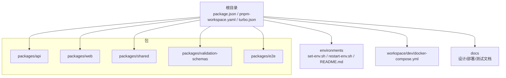
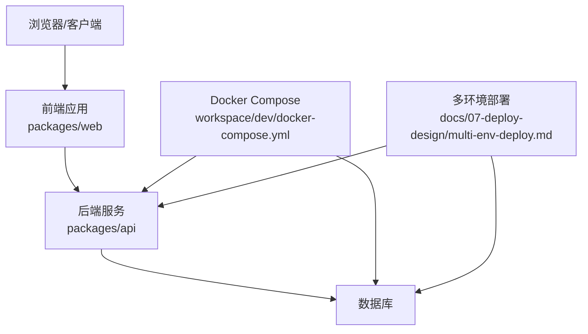
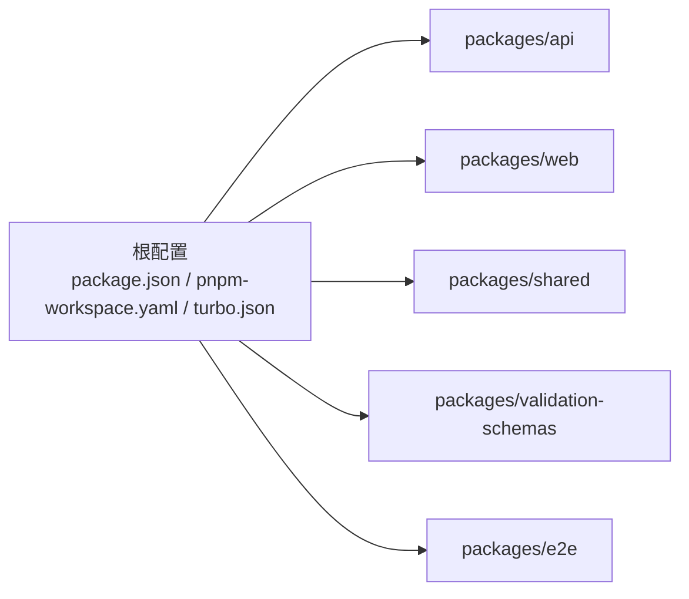

# 常见问题解决

<cite>
**本文引用的文件**
- [README.md](file://README.md)
- [package.json](file://package.json)
- [pnpm-workspace.yaml](file://pnpm-workspace.yaml)
- [turbo.json](file://turbo.json)
- [packages/api/package.json](file://packages/api/package.json)
- [packages/web/package.json](file://packages/web/package.json)
- [packages/shared/package.json](file://packages/shared/package.json)
- [packages/validation-schemas/package.json](file://packages/validation-schemas/package.json)
- [packages/e2e/package.json](file://packages/e2e/package.json)
- [environments/README.md](file://environments/README.md)
- [environments/set-env.sh](file://environments/set-env.sh)
- [environments/restart-env.sh](file://environments/restart-env.sh)
- [workspace/dev/docker-compose.yml](file://workspace/dev/docker-compose.yml)
- [docs/07-deploy-design/multi-env-deploy.md](file://docs/07-deploy-design/multi-env-deploy.md)
- [docs/04-tech-design/openapi-contract-design.md](file://docs/04-tech-design/openapi-contract-design.md)
- [docs/05-data-design/phase1-database-schema.md](file://docs/05-data-design/phase1-database-schema.md)
- [docs/06-test-design/modules/domain-model/f-m2-01-entity/f-m2-01-api.md](file://docs/06-test-design/modules/domain-model/f-m2-01-entity/f-m2-01-api.md)
- [docs/06-test-design/modules/project-management/f-m1-01-project-list/f-m1-01-api.md](file://docs/06-test-design/modules/project-management/f-m1-01-project-list/f-m1-01-api.md)
- [docs/06-test-design/modules/project-management/f-m1-02-create-project/f-m1-02-api.md](file://docs/06-test-design/modules/project-management/f-m1-02-create-project/f-m1-02-api.md)
- [docs/06-test-design/modules/project-management/f-m1-03-project-detail/f-m1-03-api.md](file://docs/06-test-design/modules/project-management/f-m1-03-project-detail/f-m1-03-api.md)
- [docs/06-test-design/modules/project-management/f-m1-04-edit-project/f-m1-04-api.md](file://docs/06-test-design/modules/project-management/f-m1-04-edit-project/f-m1-04-api.md)
- [docs/06-test-design/modules/project-management/f-m1-05-archive/f-m1-05-api.md](file://docs/06-test-design/modules/project-management/f-m1-05-archive/f-m1-05-api.md)
- [docs/06-test-design/modules/project-management/f-m1-06-company/f-m1-06-api.md](file://docs/06-test-design/modules/project-management/f-m1-06-company/f-m1-06-api.md)
- [docs/06-test-design/modules/project-management/f-m1-07-department/f-m1-07-api.md](file://docs/06-test-design/modules/project-management/f-m1-07-department/f-m1-07-api.md)
- [docs/06-test-design/modules/project-management/f-m1-08-role/f-m1-08-api.md](file://docs/06-test-design/modules/project-management/f-m1-08-role/f-m1-08-api.md)
- [docs/06-test-design/modules/project-management/f-m1-09-external-entity/f-m1-09-api.md](file://docs/06-test-design/modules/project-management/f-m1-09-external-entity/f-m1-09-api.md)
- [docs/06-test-design/modules/project-management/f-m1-10-statistics/f-m1-10-api.md](file://docs/06-test-design/modules/project-management/f-m1-10-statistics/f-m1-10-api.md)
- [docs/06-test-design/modules/project-management/f-m1-12-role-behavior/f-m1-12-api.md](file://docs/06-test-design/modules/project-management/f-m1-12-role-behavior/f-m1-12-api.md)
- [docs/06-test-design/modules/project-management/f-m1-13-external-entity-behavior/f-m1-13-api.md](file://docs/06-test-design/modules/project-management/f-m1-13-external-entity-behavior/f-m1-13-api.md)
</cite>

## 目录
1. [简介](#简介)
2. [项目结构](#项目结构)
3. [核心组件](#核心组件)
4. [架构总览](#架构总览)
5. [详细组件分析](#详细组件分析)
6. [依赖关系分析](#依赖关系分析)
7. [性能考虑](#性能考虑)
8. [故障排除指南](#故障排除指南)
9. [结论](#结论)
10. [附录](#附录)

## 简介
本指南面向AI原型管理系统的使用者与维护者，聚焦于安装、运行、部署与日常运维中的常见问题与解决步骤。内容覆盖依赖安装失败、环境变量配置错误、端口冲突、进程启动失败、内存不足、权限问题、数据库连接异常（超时、认证失败、表结构不匹配）、API调用异常（404、500等）、前端页面加载与组件渲染问题、后端服务无响应与路由不可达、数据库查询失败等场景。所有建议均基于仓库现有文档与配置文件进行归纳总结，便于快速定位与修复。

## 项目结构
该工程采用多包工作区（monorepo）组织方式，通过包管理器与构建编排工具统一管理前后端及共享模块。核心目录与文件如下：
- 根级配置：根package.json、pnpm工作区配置、Turbo构建编排
- 包目录：packages/api（后端服务）、packages/web（前端应用）、packages/shared（共享库）、packages/validation-schemas（校验模式）、packages/e2e（端到端测试）
- 环境与部署：environments（环境脚本与说明）、workspace/dev/docker-compose.yml（开发容器编排）
- 文档：docs（设计与部署文档）

**图表来源**
- [pnpm-workspace.yaml](file://pnpm-workspace.yaml)
- [turbo.json](file://turbo.json)
- [packages/api/package.json](file://packages/api/package.json)
- [packages/web/package.json](file://packages/web/package.json)
- [packages/shared/package.json](file://packages/shared/package.json)
- [packages/validation-schemas/package.json](file://packages/validation-schemas/package.json)
- [packages/e2e/package.json](file://packages/e2e/package.json)
- [environments/README.md](file://environments/README.md)
- [workspace/dev/docker-compose.yml](file://workspace/dev/docker-compose.yml)

**章节来源**
- [pnpm-workspace.yaml](file://pnpm-workspace.yaml)
- [turbo.json](file://turbo.json)
- [package.json](file://package.json)

## 核心组件
- 后端服务（packages/api）：提供REST接口与业务逻辑，需配合数据库与认证机制。
- 前端应用（packages/web）：单页应用，负责用户交互与数据展示。
- 共享库（packages/shared）：跨包复用的工具、类型与常量。
- 校验模式（packages/validation-schemas）：统一的数据校验规则。
- 端到端测试（packages/e2e）：验证整体流程与集成点。
- 环境与部署：环境脚本与Docker编排用于本地与CI/CD部署。

**章节来源**
- [packages/api/package.json](file://packages/api/package.json)
- [packages/web/package.json](file://packages/web/package.json)
- [packages/shared/package.json](file://packages/shared/package.json)
- [packages/validation-schemas/package.json](file://packages/validation-schemas/package.json)
- [packages/e2e/package.json](file://packages/e2e/package.json)

## 架构总览
系统采用前后端分离架构，前端通过HTTP请求与后端交互；数据库通过ORM或原生驱动访问；开发环境通过Docker Compose编排服务；多环境部署策略由文档定义。

**图表来源**
- [workspace/dev/docker-compose.yml](file://workspace/dev/docker-compose.yml)
- [docs/07-deploy-design/multi-env-deploy.md](file://docs/07-deploy-design/multi-env-deploy.md)

## 详细组件分析

### 安装与依赖问题
- 症状：安装依赖失败、版本冲突、缓存损坏。
- 可能原因：网络不稳定、镜像源不可用、锁文件与包管理器版本不一致。
- 解决步骤：
  - 清理缓存并重试安装（参考包管理器清理命令与重新安装流程）。
  - 使用工作区配置确保各包依赖解析一致（pnpm工作区）。
  - 检查根package.json与各子包的依赖范围，避免版本漂移。
  - 若使用Turbo，请确认任务图与依赖拓扑正确，必要时重建缓存。

**章节来源**
- [package.json](file://package.json)
- [pnpm-workspace.yaml](file://pnpm-workspace.yaml)
- [turbo.json](file://turbo.json)

### 环境变量与端口配置
- 症状：服务启动后端口被占用、环境变量未生效导致功能异常。
- 可能原因：端口冲突、环境脚本未正确加载、变量拼写错误。
- 解决步骤：
  - 使用环境脚本加载变量（参考环境脚本与说明文档）。
  - 检查Docker编排中端口映射是否与宿主冲突。
  - 在不同环境中核对变量差异，确保与部署文档一致。

**章节来源**
- [environments/README.md](file://environments/README.md)
- [environments/set-env.sh](file://environments/set-env.sh)
- [environments/restart-env.sh](file://environments/restart-env.sh)
- [workspace/dev/docker-compose.yml](file://workspace/dev/docker-compose.yml)

### 进程启动与资源限制
- 症状：进程启动失败、内存不足、权限不足。
- 可能原因：资源配额不足、缺少执行权限、依赖服务未就绪。
- 解决步骤：
  - 调整容器或主机内存与CPU配额，确保满足服务需求。
  - 检查可执行文件权限与用户上下文。
  - 优先启动依赖服务（如数据库），再启动应用服务。

**章节来源**
- [workspace/dev/docker-compose.yml](file://workspace/dev/docker-compose.yml)

### 数据库连接问题
- 症状：连接超时、认证失败、表结构不匹配。
- 可能原因：连接串错误、凭据不正确、迁移未执行、版本不兼容。
- 解决步骤：
  - 对照数据库文档核对连接参数与凭据。
  - 执行数据库迁移脚本，确保表结构与版本一致。
  - 检查网络连通性与防火墙策略。
  - 查看数据库日志定位具体错误。

**章节来源**
- [docs/05-data-design/phase1-database-schema.md](file://docs/05-data-design/phase1-database-schema.md)

### API调用异常
- 症状：404未找到、500服务器内部错误、跨域失败。
- 可能原因：路由未注册、中间件拦截、上游服务不可用、认证失败。
- 排查步骤：
  - 使用OpenAPI契约文档核对端点与参数。
  - 检查后端路由与控制器实现。
  - 关注中间件链路（鉴权、日志、异常处理）。
  - 核对CORS与代理配置。

**章节来源**
- [docs/04-tech-design/openapi-contract-design.md](file://docs/04-tech-design/openapi-contract-design.md)
- [docs/06-test-design/modules/project-management/f-m1-01-project-list/f-m1-01-api.md](file://docs/06-test-design/modules/project-management/f-m1-01-project-list/f-m1-01-api.md)
- [docs/06-test-design/modules/project-management/f-m1-02-create-project/f-m1-02-api.md](file://docs/06-test-design/modules/project-management/f-m1-02-create-project/f-m1-02-api.md)
- [docs/06-test-design/modules/project-management/f-m1-03-project-detail/f-m1-03-api.md](file://docs/06-test-design/modules/project-management/f-m1-03-project-detail/f-m1-03-api.md)
- [docs/06-test-design/modules/project-management/f-m1-04-edit-project/f-m1-04-api.md](file://docs/06-test-design/modules/project-management/f-m1-04-edit-project/f-m1-04-api.md)
- [docs/06-test-design/modules/project-management/f-m1-05-archive/f-m1-05-api.md](file://docs/06-test-design/modules/project-management/f-m1-05-archive/f-m1-05-api.md)
- [docs/06-test-design/modules/project-management/f-m1-06-company/f-m1-06-api.md](file://docs/06-test-design/modules/project-management/f-m1-06-company/f-m1-06-api.md)
- [docs/06-test-design/modules/project-management/f-m1-07-department/f-m1-07-api.md](file://docs/06-test-design/modules/project-management/f-m1-07-department/f-m1-07-api.md)
- [docs/06-test-design/modules/project-management/f-m1-08-role/f-m1-08-api.md](file://docs/06-test-design/modules/project-management/f-m1-08-role/f-m1-08-api.md)
- [docs/06-test-design/modules/project-management/f-m1-09-external-entity/f-m1-09-api.md](file://docs/06-test-design/modules/project-management/f-m1-09-external-entity/f-m1-09-api.md)
- [docs/06-test-design/modules/project-management/f-m1-10-statistics/f-m1-10-api.md](file://docs/06-test-design/modules/project-management/f-m1-10-statistics/f-m1-10-api.md)
- [docs/06-test-design/modules/project-management/f-m1-12-role-behavior/f-m1-12-api.md](file://docs/06-test-design/modules/project-management/f-m1-12-role-behavior/f-m1-12-api.md)
- [docs/06-test-design/modules/project-management/f-m1-13-external-entity-behavior/f-m1-13-api.md](file://docs/06-test-design/modules/project-management/f-m1-13-external-entity-behavior/f-m1-13-api.md)

### 前端页面与组件问题
- 症状：页面空白、样式缺失、组件渲染异常。
- 可能原因：打包产物未生成、静态资源路径错误、运行时依赖缺失、路由未匹配。
- 解决步骤：
  - 检查构建输出与静态资源路径配置。
  - 核对路由与页面组件映射，确保默认导出与命名一致。
  - 查看浏览器控制台与网络面板，定位资源加载失败项。
  - 验证共享库版本与兼容性。

**章节来源**
- [packages/web/package.json](file://packages/web/package.json)

### 后端服务无响应与路由不可达
- 症状：服务端口监听正常但请求无响应、路由返回404。
- 可能原因：中间件阻断、路由前缀不匹配、健康检查失败、反向代理配置错误。
- 解决步骤：
  - 检查中间件顺序与条件分支。
  - 对照OpenAPI契约与路由定义，确认路径与方法一致。
  - 核对反向代理与网关配置，确保请求转发正确。
  - 查看服务日志定位异常堆栈。

**章节来源**
- [docs/04-tech-design/openapi-contract-design.md](file://docs/04-tech-design/openapi-contract-design.md)
- [packages/api/package.json](file://packages/api/package.json)

### 数据库查询失败
- 症状：查询超时、结果为空、字段类型不匹配。
- 可能原因：SQL语法错误、索引缺失、事务隔离级别不当、连接池耗尽。
- 解决步骤：
  - 使用数据库Schema文档核对实体与字段。
  - 分析慢查询日志，优化索引与查询计划。
  - 检查连接池配置与并发上限。
  - 在测试用例中复现并定位具体查询。

**章节来源**
- [docs/05-data-design/phase1-database-schema.md](file://docs/05-data-design/phase1-database-schema.md)
- [docs/06-test-design/modules/domain-model/f-m2-01-entity/f-m2-01-api.md](file://docs/06-test-design/modules/domain-model/f-m2-01-entity/f-m2-01-api.md)

## 依赖关系分析
- 工作区依赖：各包通过pnpm工作区统一管理，减少重复依赖与版本漂移。
- 构建依赖：Turbo按任务图并行执行，提升开发效率。
- 运行时依赖：后端与前端分别声明各自运行时依赖，注意版本兼容性。

**图表来源**
- [pnpm-workspace.yaml](file://pnpm-workspace.yaml)
- [turbo.json](file://turbo.json)
- [package.json](file://package.json)

**章节来源**
- [pnpm-workspace.yaml](file://pnpm-workspace.yaml)
- [turbo.json](file://turbo.json)
- [package.json](file://package.json)

## 性能考虑
- 构建与缓存：合理使用Turbo缓存，避免不必要的全量构建。
- 依赖精简：定期清理未使用依赖，降低包体积与安装时间。
- 运行时优化：为数据库建立必要索引，优化查询路径；为前端启用代码分割与懒加载。
- 资源配额：根据负载调整容器资源限制，避免频繁OOM或CPU饥饿。

## 故障排除指南

### 安装阶段
- 依赖安装失败
  - 清理缓存并重试安装
  - 检查网络与镜像源
  - 使用工作区配置统一依赖解析
- 环境变量配置错误
  - 使用环境脚本加载变量
  - 核对变量名与默认值
  - 在不同环境间比对差异
- 端口冲突
  - 修改Docker映射端口或释放宿主端口
  - 检查进程占用情况

**章节来源**
- [environments/README.md](file://environments/README.md)
- [environments/set-env.sh](file://environments/set-env.sh)
- [environments/restart-env.sh](file://environments/restart-env.sh)
- [workspace/dev/docker-compose.yml](file://workspace/dev/docker-compose.yml)

### 运行阶段
- 进程启动失败
  - 检查依赖服务状态（数据库、缓存等）
  - 查看进程日志与退出码
  - 核对权限与用户上下文
- 内存不足
  - 提升容器或主机内存配额
  - 优化应用内存使用（GC、连接池）
- 权限问题
  - 确认文件与目录权限
  - 校验运行用户与组

**章节来源**
- [workspace/dev/docker-compose.yml](file://workspace/dev/docker-compose.yml)

### 数据库问题
- 连接超时
  - 核对连接串与网络连通性
  - 检查防火墙与安全组
- 认证失败
  - 校验用户名与密码
  - 确认SSL/TLS配置
- 表结构不匹配
  - 执行迁移脚本
  - 对照Schema文档核对字段

**章节来源**
- [docs/05-data-design/phase1-database-schema.md](file://docs/05-data-design/phase1-database-schema.md)

### API异常
- 404未找到
  - 对照OpenAPI契约核对路径与方法
  - 检查路由前缀与中间件
- 500服务器内部错误
  - 查看服务端异常堆栈
  - 核查上游服务可用性
  - 检查中间件链路

**章节来源**
- [docs/04-tech-design/openapi-contract-design.md](file://docs/04-tech-design/openapi-contract-design.md)

### 前端问题
- 页面加载失败
  - 检查构建产物与静态资源路径
  - 核对路由与页面组件映射
- 样式丢失
  - 确认CSS打包与引入顺序
  - 检查主题与变量覆盖
- 组件渲染异常
  - 查看控制台错误
  - 校验props与上下文

**章节来源**
- [packages/web/package.json](file://packages/web/package.json)

### 后端与路由
- 服务无响应
  - 检查中间件与健康检查
  - 核对反向代理与网关配置
- 路由无法访问
  - 对照契约与路由定义
  - 排查权限与鉴权中间件

**章节来源**
- [docs/04-tech-design/openapi-contract-design.md](file://docs/04-tech-design/openapi-contract-design.md)
- [packages/api/package.json](file://packages/api/package.json)

### 数据库查询失败
- 查询超时
  - 分析慢查询日志
  - 优化索引与SQL
- 结果为空
  - 核对过滤条件与关联关系
  - 检查事务隔离级别
- 字段类型不匹配
  - 对照Schema文档
  - 更新模型与序列化逻辑

**章节来源**
- [docs/05-data-design/phase1-database-schema.md](file://docs/05-data-design/phase1-database-schema.md)
- [docs/06-test-design/modules/domain-model/f-m2-01-entity/f-m2-01-api.md](file://docs/06-test-design/modules/domain-model/f-m2-01-entity/f-m2-01-api.md)

## 结论
本指南提供了从安装到运行、从数据库到API、从前端到后端的全链路问题排查思路与解决步骤。建议在日常维护中结合文档与配置文件，建立标准化的环境与部署流程，以降低故障率并提升恢复速度。

## 附录
- 多环境部署策略与最佳实践可参考部署文档。
- OpenAPI契约与数据库Schema是排查API与数据一致性问题的重要依据。
- 测试用例文档可用于复现与验证问题。

**章节来源**
- [docs/07-deploy-design/multi-env-deploy.md](file://docs/07-deploy-design/multi-env-deploy.md)
- [docs/04-tech-design/openapi-contract-design.md](file://docs/04-tech-design/openapi-contract-design.md)
- [docs/05-data-design/phase1-database-schema.md](file://docs/05-data-design/phase1-database-schema.md)