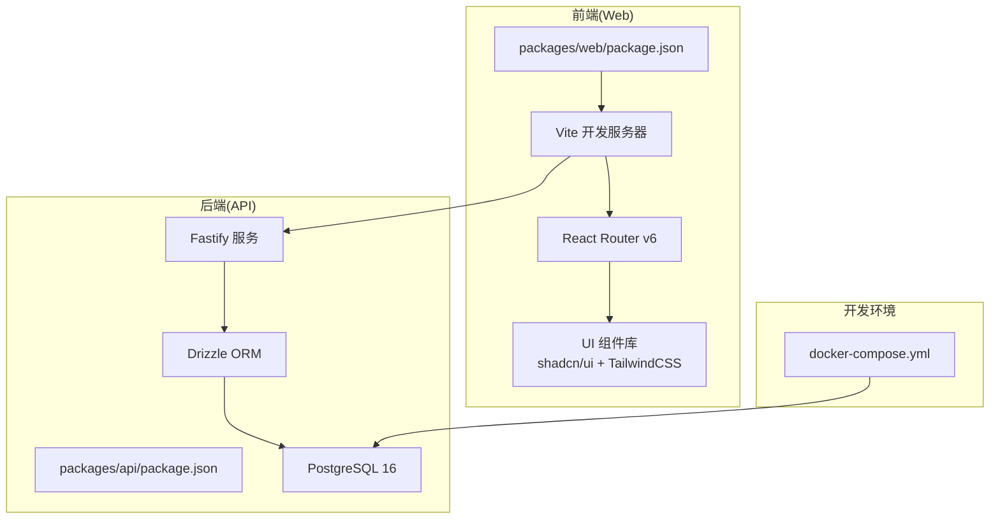
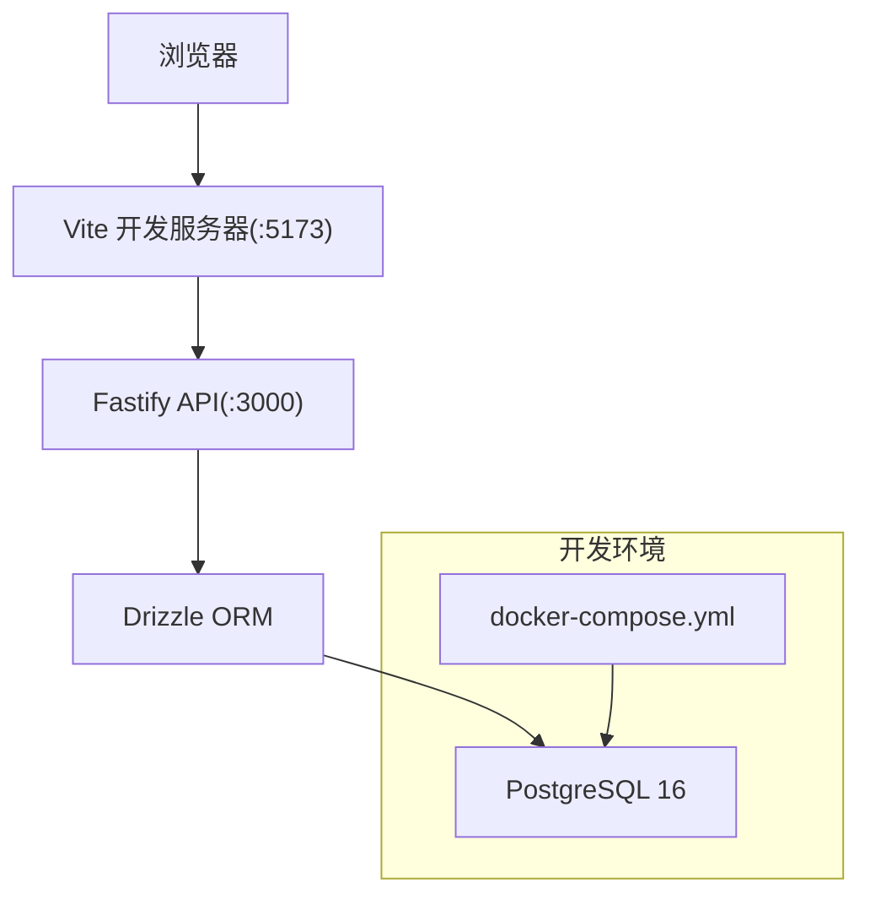
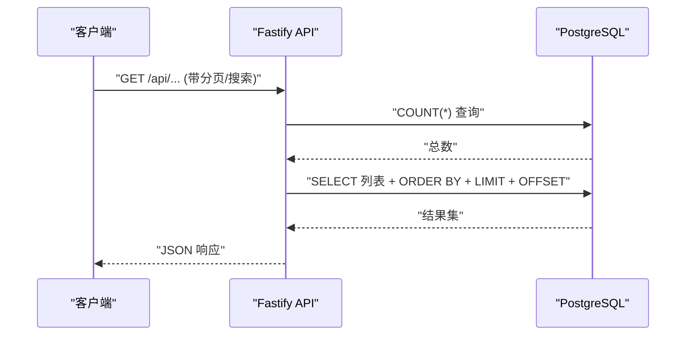
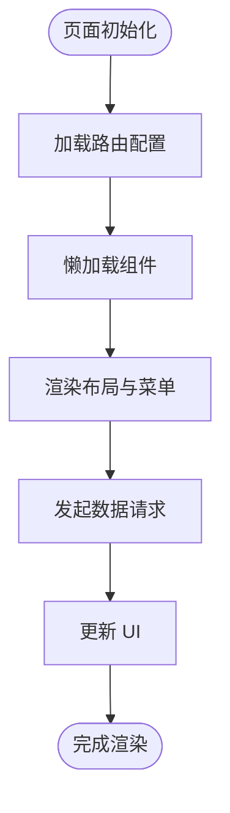
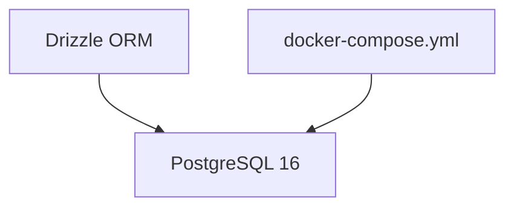
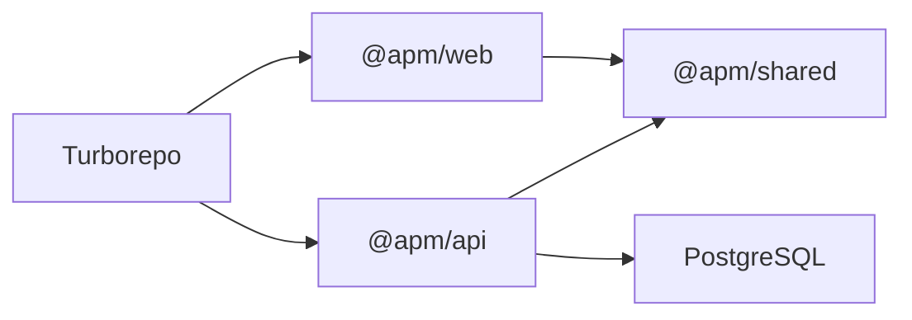
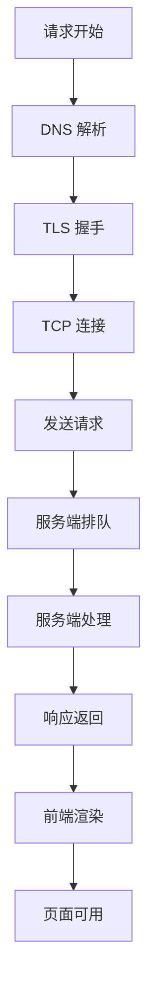
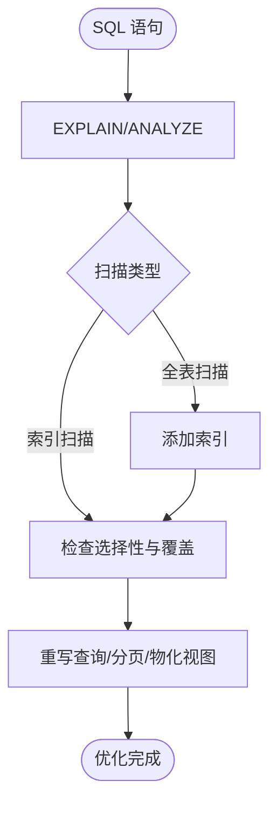
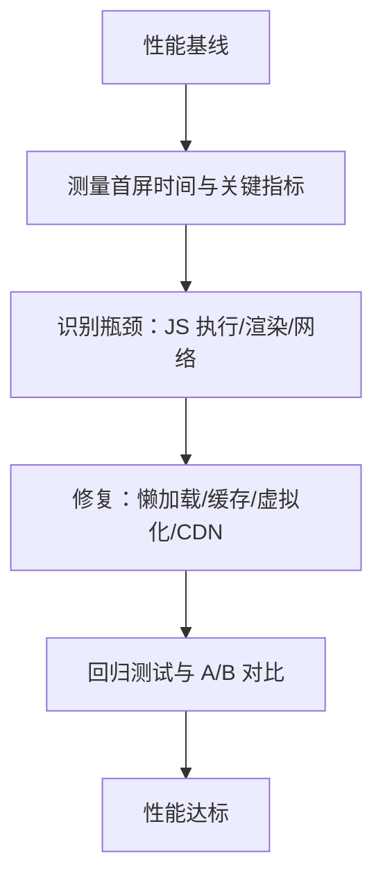

# 性能问题排查

<cite>
**本文引用的文件**
- [README.md](file://README.md)
- [package.json](file://package.json)
- [docker-compose.yml](file://workspace/dev/docker-compose.yml)
- [packages/api/package.json](file://packages/api/package.json)
- [packages/web/package.json](file://packages/web/package.json)
- [packages/api/src/db.ts](file://packages/api/src/db.ts)
- [packages/api/src/services/domain.service.ts](file://packages/api/src/services/domain.service.ts)
- [packages/e2e/inspect-ui.mjs](file://packages/e2e/inspect-ui.mjs)
- [docs/20-analyze-report/m1-ui-gap-analysis-2026-05-11.md](file://docs/20-analyze-report/m1-ui-gap-analysis-2026-05-11.md)
- [docs/20-analyze-report/phase1-infrastructure-audit.md](file://docs/20-analyze-report/phase1-infrastructure-audit.md)
- [logs-important/2026-05-08-conversation.md](file://logs-important/2026-05-08-conversation.md)
- [logs-important/2026-05-11-conversation.md](file://logs-important/2026-05-11-conversation.md)
- [packages/api/tests/project-management/f-m1-04-edit.test.ts](file://packages/api/tests/project-management/f-m1-04-edit.test.ts)
- [packages/api/tests/openapi/openapi-schema.test.ts](file://packages/api/tests/openapi/openapi-schema.test.ts)
</cite>

## 目录
1. [简介](#简介)
2. [项目结构](#项目结构)
3. [核心组件](#核心组件)
4. [架构总览](#架构总览)
5. [详细组件分析](#详细组件分析)
6. [依赖分析](#依赖分析)
7. [性能考虑](#性能考虑)
8. [故障排查指南](#故障排查指南)
9. [结论](#结论)
10. [附录](#附录)

## 简介
本指南面向“AI原型管理系统”的性能问题排查与优化，围绕内存泄漏、CPU占用过高、响应时间过长、数据库性能、前端性能、系统资源监控与告警、性能基准与压测等方面，结合仓库现有技术栈与基础设施，给出可落地的排查步骤、工具建议与优化实践。由于本项目仍处于早期阶段，部分监控与压测设施尚未完善，本文同时提供补齐建议与最佳实践。

## 项目结构
- 采用 Monorepo（pnpm workspaces + Turborepo），前后端分离：
  - 后端：Fastify + PostgreSQL + Drizzle ORM
  - 前端：React + Vite + shadcn/ui + React Router v6
- 开发环境通过 docker-compose 提供 Postgres 服务，端口映射与健康检查已配置
- 通过环境系统控制 DATABASE_URL，避免硬编码与默认值绕过

图表来源
- [packages/web/package.json:1-1](file://packages/web/package.json#L1-L1)
- [packages/api/package.json:1-1](file://packages/api/package.json#L1-L1)
- [workspace/dev/docker-compose.yml:1-20](file://workspace/dev/docker-compose.yml#L1-L20)

章节来源
- [README.md:24-30](file://README.md#L24-L30)
- [package.json:1-2](file://package.json#L1-L2)
- [workspace/dev/docker-compose.yml:1-20](file://workspace/dev/docker-compose.yml#L1-L20)

## 核心组件
- 前端 Web
  - Vite 开发与构建、React Router v6 路由、UI 组件库与样式体系
  - 通过 API Client 统一发起请求，具备基础错误封装
- 后端 API
  - Fastify 服务承载 REST 接口，Drizzle ORM 访问 PostgreSQL
  - 通过环境变量 DATABASE_URL 连接数据库，避免硬编码
- 数据库
  - PostgreSQL 16，容器化部署，健康检查与卷挂载
- 测试与质量
  - OpenAPI 规范一致性测试、E2E UI 检查脚本与报告

章节来源
- [packages/web/package.json:1-1](file://packages/web/package.json#L1-L1)
- [packages/api/package.json:1-1](file://packages/api/package.json#L1-L1)
- [packages/api/src/db.ts:1-24](file://packages/api/src/db.ts#L1-L24)
- [packages/api/tests/openapi/openapi-schema.test.ts:29-56](file://packages/api/tests/openapi/openapi-schema.test.ts#L29-L56)
- [packages/e2e/inspect-ui.mjs:46-74](file://packages/e2e/inspect-ui.mjs#L46-L74)

## 架构总览
系统采用 B/S 架构，前端通过浏览器直连后端 API，后端通过 Drizzle ORM 访问 PostgreSQL。开发环境通过 docker-compose 提供数据库服务，端口与健康检查已配置。

图表来源
- [README.md:26-29](file://README.md#L26-L29)
- [workspace/dev/docker-compose.yml:1-20](file://workspace/dev/docker-compose.yml#L1-L20)
- [packages/api/src/db.ts:1-24](file://packages/api/src/db.ts#L1-L24)

## 详细组件分析

### 后端 API 服务（Fastify + Drizzle + PostgreSQL）
- 连接与迁移
  - 通过 DATABASE_URL 获取连接串，未设置时抛错，避免默认值绕过环境系统
  - 提供 raw 连接用于迁移，避免 prepared statement 缓存干扰
- 服务层示例
  - 领域边界列表查询包含分页、条件过滤与排序，涉及多次数据库访问与聚合计算
- 性能关注点
  - SQL 查询是否使用合适索引
  - 是否存在 N+1 查询
  - 请求处理链路中中间件与序列化开销
  - 并发连接数与连接池配置

图表来源
- [packages/api/src/services/domain.service.ts:1246-1273](file://packages/api/src/services/domain.service.ts#L1246-L1273)
- [packages/api/src/db.ts:1-24](file://packages/api/src/db.ts#L1-L24)

章节来源
- [packages/api/src/db.ts:1-24](file://packages/api/src/db.ts#L1-L24)
- [packages/api/src/services/domain.service.ts:1246-1273](file://packages/api/src/services/domain.service.ts#L1246-L1273)

### 前端 Web（React + Vite + Router）
- 路由与布局
  - React Router v6，路由懒加载与重定向
  - 布局组件包含 Sidebar 折叠与菜单高亮
- 样式与主题
  - TailwindCSS + CSS 变量，支持 light/dark 主题
- 性能关注点
  - 组件渲染次数与重渲染
  - 资源打包体积与按需加载
  - 网络请求并发与缓存策略

图表来源
- [docs/20-analyze-report/phase1-infrastructure-audit.md:82-129](file://docs/20-analyze-report/phase1-infrastructure-audit.md#L82-L129)

章节来源
- [docs/20-analyze-report/phase1-infrastructure-audit.md:82-129](file://docs/20-analyze-report/phase1-infrastructure-audit.md#L82-L129)

### 数据库（PostgreSQL 16）
- 容器化部署
  - 健康检查、端口映射、卷挂载
- 迁移与连接
  - 通过 Drizzle 迁移脚本与 raw 连接执行
- 性能关注点
  - 慢查询日志与执行计划
  - 索引缺失与扫描代价
  - 连接池配置与并发

图表来源
- [workspace/dev/docker-compose.yml:1-20](file://workspace/dev/docker-compose.yml#L1-L20)
- [packages/api/src/db.ts:1-24](file://packages/api/src/db.ts#L1-L24)

章节来源
- [workspace/dev/docker-compose.yml:1-20](file://workspace/dev/docker-compose.yml#L1-L20)
- [packages/api/src/db.ts:1-24](file://packages/api/src/db.ts#L1-L24)

## 依赖分析
- Monorepo 依赖
  - 前后端通过共享包（shared）进行类型与工具复用
  - Turborepo 统一执行 dev/build/lint/test
- 环境与连接
  - DATABASE_URL 由环境系统生成，避免硬编码与默认值
- 测试与文档
  - OpenAPI 规范一致性测试覆盖端点数量
  - E2E UI 检查脚本与报告，辅助前端性能与可用性评估

图表来源
- [package.json:1-2](file://package.json#L1-L2)
- [packages/api/package.json:1-1](file://packages/api/package.json#L1-L1)
- [packages/web/package.json:1-1](file://packages/web/package.json#L1-L1)

章节来源
- [package.json:1-2](file://package.json#L1-L2)
- [packages/api/package.json:1-1](file://packages/api/package.json#L1-L1)
- [packages/web/package.json:1-1](file://packages/web/package.json#L1-L1)

## 性能考虑
- 内存与 GC
  - Node.js 进程可通过外部工具采集堆快照与内存曲线，观察增长趋势与 GC 行为
  - 关注大对象与闭包持有，避免长生命周期引用链
- CPU 占用
  - 使用火焰图定位热点函数，关注序列化、ORM 查询、路由处理
  - 并发与锁竞争：数据库连接池与请求队列
- 响应时间
  - API 端到端时延拆解：DNS/TLS/连接/请求/排队/处理/响应
  - 前端渲染：首屏资源体积、关键渲染路径、重排重绘
- 数据库
  - 慢查询日志、EXPLAIN/ANALYZE、索引使用率
  - 连接池参数与并发上限
- 前端
  - Bundle 体积与分包策略、懒加载、缓存策略
  - 渲染性能：虚拟列表、防抖节流、合成动画

## 故障排查指南

### 一、内存泄漏排查
- 识别与分析
  - 采集 Node.js 堆快照与内存曲线，观察堆增长趋势与 GC 行为
  - 使用火焰图定位长时间驻留的对象与引用链
- 对象引用链追踪
  - 重点检查长生命周期容器（全局单例、缓存）、事件监听器与定时器
  - ORM 查询结果与分页游标是否被意外持有
- 优化建议
  - 及时释放事件监听器与定时器
  - 避免闭包捕获大对象
  - 使用弱引用或惰性初始化减少常驻内存

### 二、CPU 占用过高排查
- 工具与方法
  - 使用火焰图与采样分析定位热点函数
  - 检查序列化/反序列化、正则匹配、大数组遍历
- 并发问题诊断
  - 数据库连接池饱和与等待
  - 请求队列积压与超时重试
- 优化建议
  - 合理设置并发与批处理
  - 缓存热点数据，减少重复计算
  - 优化 ORM 查询与索引

### 三、响应时间过长分析
- API 响应时间
  - 拆解端到端时延，定位排队、处理、IO 瓶颈
  - 检查慢查询与 N+1 问题
- 前端渲染性能
  - 首屏资源体积与关键渲染路径
  - 避免强制同步布局、大量重排重绘
- 优化建议
  - 数据库索引与查询优化
  - 前端懒加载与缓存策略
  - CDN 与静态资源优化

### 四、数据库性能问题诊断
- 慢查询分析
  - 开启慢查询日志，使用 EXPLAIN/ANALYZE 分析执行计划
  - 关注全表扫描与缺失索引
- 索引使用情况
  - 针对高频过滤、排序与连接字段建立复合索引
- 连接池配置
  - 调整最大连接数、空闲超时与查询超时
  - 监控连接池等待队列与饱和度

### 五、前端性能问题识别与优化
- Bundle 体积分析
  - 使用打包分析工具识别大体积依赖与重复模块
- 渲染性能
  - 虚拟列表、防抖节流、合成动画
- 网络请求优化
  - 缓存策略、请求合并、CDN 与压缩

### 六、系统资源监控与告警
- 建议指标
  - CPU 使用率、内存使用、GC 次数与暂停时间、请求时延与错误率、数据库连接数与等待队列
- 告警阈值
  - 时延分位值、错误率、连接池饱和度、磁盘与连接数上限
- 工具
  - Prometheus + Grafana 或云监控平台

### 七、性能基准测试与压力测试
- 基准测试
  - 使用 wrk/JMeter 对关键 API 进行吞吐与延迟测试
- 压力测试
  - 逐步提升并发与数据规模，观察系统拐点与恢复能力
- E2E 场景
  - 结合 Playwright 场景，模拟真实用户路径，测量端到端时延

### 八、具体优化案例与最佳实践
- 案例：列表页渲染卡顿
  - 优化：虚拟滚动、分页与懒加载、减少重渲染
- 案例：接口超时
  - 优化：数据库索引、查询拆分、缓存热点数据
- 最佳实践
  - 代码层面：避免全局状态膨胀、及时清理事件与定时器
  - 架构层面：合理拆分服务、引入缓存与异步处理
  - 运维层面：完善的监控与告警、定期压测与回归

## 结论
本项目当前处于早期阶段，性能监控与压测设施尚需完善。建议优先补齐数据库慢查询分析、前端 Bundle 体积与渲染性能分析、系统资源监控与告警，并建立基准与压测流程。后续可基于火焰图与采样分析持续优化热点路径，配合索引与连接池调优解决数据库瓶颈，最终达成稳定、低延迟、可扩展的系统性能目标。

## 附录

### A. 端到端时延拆解（概念示意）

### B. 数据库查询优化流程（概念示意）

### C. 前端渲染性能优化要点（概念示意）
