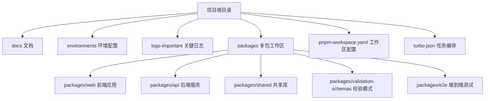
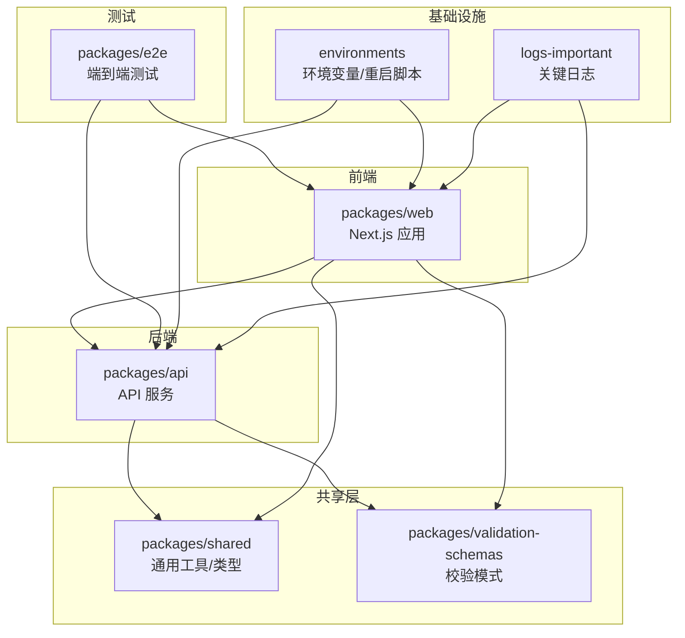
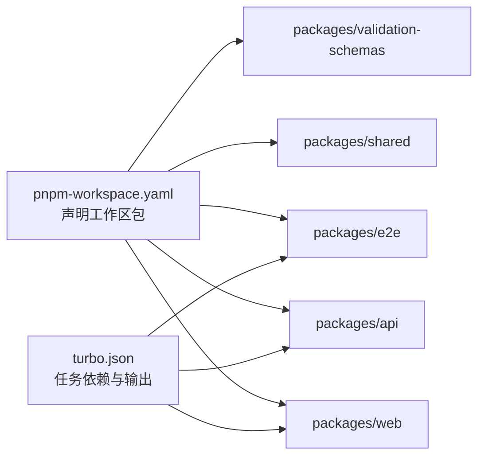

# 故障排除

<cite>
**本文引用的文件**
- [README.md](file://README.md)
- [turbo.json](file://turbo.json)
- [pnpm-workspace.yaml](file://pnpm-workspace.yaml)
- [environments/README.md](file://environments/README.md)
- [environments/set-env.sh](file://environments/set-env.sh)
- [environments/restart-env.sh](file://environments/restart-env.sh)
- [logs-important/2026-04-25-conversation.md](file://logs-important/2026-04-25-conversation.md)
- [logs-important/2026-04-26-conversation.md](file://logs-important/2026-04-26-conversation.md)
- [logs-important/2026-04-29-conversation.md](file://logs-important/2026-04-29-conversation.md)
- [logs-important/2026-05-03-conversation.md](file://logs-important/2026-05-03-conversation.md)
- [logs-important/2026-05-06-conversation.md](file://logs-important/2026-05-06-conversation.md)
- [logs-important/2026-05-08-conversation.md](file://logs-important/2026-05-08-conversation.md)
- [logs-important/2026-05-11-conversation.md](file://logs-important/2026-05-11-conversation.md)
- [logs-important/2026-05-13-conversation.md](file://logs-important/2026-05-13-conversation.md)
</cite>

## 目录
1. [简介](#简介)
2. [项目结构](#项目结构)
3. [核心组件](#核心组件)
4. [架构总览](#架构总览)
5. [详细组件分析](#详细组件分析)
6. [依赖分析](#依赖分析)
7. [性能考虑](#性能考虑)
8. [故障排除指南](#故障排除指南)
9. [结论](#结论)
10. [附录](#附录)

## 简介
本指南面向开发者与运维人员，围绕“AI原型管理系统”的安装、运行、数据库连接、API调用、日志分析、性能问题、网络连接、数据一致性、系统崩溃与异常重启恢复、监控告警响应、紧急修复与热修补丁等主题，提供可操作的诊断与解决步骤。文档基于仓库现有文件与目录结构进行梳理，并结合常见工程实践给出建议。

## 项目结构
该仓库采用多包工作区（monorepo）组织方式，使用 pnpm workspace 管理多个子包，通过 Turbo 进行任务编排与缓存控制。环境变量与部署相关说明集中在 environments 目录；重要日志对话记录位于 logs-important 目录，便于回溯问题线索。

图表来源
- [pnpm-workspace.yaml:1-2](file://pnpm-workspace.yaml#L1-L2)
- [turbo.json:1-1](file://turbo.json#L1-L1)

章节来源
- [README.md:1-25](file://README.md#L1-L25)
- [pnpm-workspace.yaml:1-2](file://pnpm-workspace.yaml#L1-L2)
- [turbo.json:1-1](file://turbo.json#L1-L1)

## 核心组件
- 多包工作区：通过 pnpm workspace 统一管理前端、后端、共享库、校验模式与端到端测试。
- 任务编排：Turbo 控制构建、开发、测试等任务的依赖与缓存策略。
- 环境配置：环境变量设置与环境重启脚本，便于在不同环境（dev/uat）下快速切换与重置。
- 日志记录：关键对话日志集中存放，便于问题复盘与根因分析。

章节来源
- [pnpm-workspace.yaml:1-2](file://pnpm-workspace.yaml#L1-L2)
- [turbo.json:1-1](file://turbo.json#L1-L1)
- [environments/README.md:1-50](file://environments/README.md#L1-L50)
- [environments/set-env.sh:1-50](file://environments/set-env.sh#L1-L50)
- [environments/restart-env.sh:1-50](file://environments/restart-env.sh#L1-L50)

## 架构总览
系统由前端 Web 应用、后端 API 服务、共享库与校验模式组成，通过统一的任务编排与环境配置支撑开发与部署流程。日志与文档为问题定位与知识沉淀提供依据。

图表来源
- [pnpm-workspace.yaml:1-2](file://pnpm-workspace.yaml#L1-L2)
- [turbo.json:1-1](file://turbo.json#L1-L1)
- [environments/README.md:1-50](file://environments/README.md#L1-L50)

## 详细组件分析

### 前端（packages/web）
- 职责：用户界面与交互，调用后端 API 获取/更新原型数据。
- 关注点：构建失败、运行时错误、路由与静态资源加载异常、跨域与鉴权问题。
- 排查要点：浏览器控制台错误、网络面板请求详情、构建产物与 Next.js 日志。

章节来源
- [pnpm-workspace.yaml:1-2](file://pnpm-workspace.yaml#L1-L2)

### 后端（packages/api）
- 职责：提供 REST/GraphQL 接口，处理业务逻辑与数据访问。
- 关注点：启动失败、数据库连接异常、鉴权失败、请求超时、序列化错误。
- 排查要点：服务日志、数据库连接池状态、中间件链路、错误拦截器。

章节来源
- [pnpm-workspace.yaml:1-2](file://pnpm-workspace.yaml#L1-L2)

### 共享库（packages/shared）
- 职责：跨包复用的类型、工具函数、常量与通用配置。
- 关注点：版本不一致导致的类型冲突、打包产物差异、运行时缺失依赖。
- 排查要点：构建日志、依赖树、运行时导入路径。

章节来源
- [pnpm-workspace.yaml:1-2](file://pnpm-workspace.yaml#L1-L2)

### 校验模式（packages/validation-schemas）
- 职责：统一的数据结构与字段约束定义，保障前后端契约一致。
- 关注点：模式变更导致的校验失败、旧版数据兼容性。
- 排查要点：校验报错堆栈、字段映射、默认值与必填项。

章节来源
- [pnpm-workspace.yaml:1-2](file://pnpm-workspace.yaml#L1-L2)

### 端到端测试（packages/e2e）
- 职责：覆盖关键业务流程，验证集成稳定性。
- 关注点：测试环境隔离、依赖服务可用性、断言失败与超时。
- 排查要点：测试日志、截图/录屏、依赖容器健康状态。

章节来源
- [pnpm-workspace.yaml:1-2](file://pnpm-workspace.yaml#L1-L2)

### 环境与任务编排
- 环境变量：通过 set-env.sh 设置运行参数，如端口、数据库连接串等。
- 重启脚本：通过 restart-env.sh 快速重置当前环境，便于快速回归测试。
- 任务编排：Turbo 控制 build/dev/test 等任务的依赖顺序与缓存策略，避免重复构建。

章节来源
- [environments/README.md:1-50](file://environments/README.md#L1-L50)
- [environments/set-env.sh:1-50](file://environments/set-env.sh#L1-L50)
- [environments/restart-env.sh:1-50](file://environments/restart-env.sh#L1-L50)
- [turbo.json:1-1](file://turbo.json#L1-L1)

## 依赖分析
- 工作区依赖：所有包均在 pnpm-workspace.yaml 中声明，确保 monorepo 内部依赖解析正确。
- 任务依赖：Turbo 的 dependsOn 与 outputs 配置保证构建顺序与缓存命中率。
- 潜在风险：未在工作区声明的包可能导致构建失败或运行时找不到模块；缓存失效可能引发重复构建。

图表来源
- [pnpm-workspace.yaml:1-2](file://pnpm-workspace.yaml#L1-L2)
- [turbo.json:1-1](file://turbo.json#L1-L1)

章节来源
- [pnpm-workspace.yaml:1-2](file://pnpm-workspace.yaml#L1-L2)
- [turbo.json:1-1](file://turbo.json#L1-L1)

## 性能考虑
- 构建性能
  - 使用 Turbo 的缓存与并行能力，避免重复构建。
  - 通过 dependsOn 控制任务依赖，减少不必要的重建。
- 运行时性能
  - 前端：关注首屏渲染、代码分割、静态资源体积与懒加载策略。
  - 后端：关注数据库查询优化、连接池配置、中间件开销与并发限制。
- 资源监控
  - 建议在 CI/CD 中加入构建耗时与产物大小的阈值告警。
  - 在生产环境采集 CPU、内存、GC、QPS、P95/P99 响应时间等指标。

章节来源
- [turbo.json:1-1](file://turbo.json#L1-L1)

## 故障排除指南

### 一、安装与环境准备
- 症状
  - 安装依赖失败、构建中断、端口被占用。
- 诊断步骤
  - 确认 Node.js 与 pnpm 版本满足项目要求。
  - 清理 node_modules 与 pnpm-store，重新安装依赖。
  - 检查端口占用情况，必要时修改 WEB_PORT/API_PORT。
- 解决方案
  - 使用 set-env.sh 设置环境变量，确保 DATABASE_URL、WEB_PORT、API_PORT 等正确。
  - 如需重置环境，执行 restart-env.sh。
- 相关文件
  - [environments/set-env.sh:1-50](file://environments/set-env.sh#L1-L50)
  - [environments/restart-env.sh:1-50](file://environments/restart-env.sh#L1-L50)

章节来源
- [environments/README.md:1-50](file://environments/README.md#L1-L50)
- [environments/set-env.sh:1-50](file://environments/set-env.sh#L1-L50)
- [environments/restart-env.sh:1-50](file://environments/restart-env.sh#L1-L50)

### 二、运行时错误（前端/后端）
- 症状
  - 页面白屏、JS 错误、API 请求失败、鉴权异常。
- 诊断步骤
  - 打开浏览器控制台，查看错误堆栈与网络请求状态码。
  - 检查后端服务日志，确认中间件链路与错误拦截是否生效。
  - 对比 validation-schemas 与实际数据结构，排查字段不匹配。
- 解决方案
  - 修正类型/字段不一致问题，必要时增加默认值或迁移脚本。
  - 在 shared 中统一错误格式，便于前端统一处理。
- 相关文件
  - [packages/shared/package.json](file://packages/shared/package.json)
  - [packages/validation-schemas/package.json](file://packages/validation-schemas/package.json)

章节来源
- [packages/shared/package.json](file://packages/shared/package.json)
- [packages/validation-schemas/package.json](file://packages/validation-schemas/package.json)

### 三、数据库连接问题
- 症状
  - 启动时报连接失败、查询超时、事务异常。
- 诊断步骤
  - 检查 DATABASE_URL 是否正确，网络连通性与防火墙策略。
  - 查看连接池配置与最大连接数，确认是否存在连接泄漏。
  - 对比不同环境（dev/uat）的连接串与权限。
- 解决方案
  - 使用 restart-env.sh 重置环境，确保连接串生效。
  - 在 API 层增加连接健康检查与重试策略。
- 相关文件
  - [environments/set-env.sh:1-50](file://environments/set-env.sh#L1-L50)
  - [environments/restart-env.sh:1-50](file://environments/restart-env.sh#L1-L50)

章节来源
- [environments/set-env.sh:1-50](file://environments/set-env.sh#L1-L50)
- [environments/restart-env.sh:1-50](file://environments/restart-env.sh#L1-L50)

### 四、API 调用异常
- 症状
  - 4xx/5xx 错误、响应体为空、CORS 失败、鉴权失败。
- 诊断步骤
  - 使用浏览器网络面板查看请求头、响应头与状态码。
  - 在后端开启详细日志，记录请求 ID、路径、参数与耗时。
  - 对比 OpenAPI/Swagger 文档与实际实现，排查路径/参数不一致。
- 解决方案
  - 在 shared 中统一错误响应格式，前端按约定处理。
  - 在 API 层增加输入校验与参数清洗，减少无效请求。
- 相关文件
  - [packages/api/package.json](file://packages/api/package.json)

章节来源
- [packages/api/package.json](file://packages/api/package.json)

### 五、日志分析与调试
- 前端日志
  - 浏览器控制台与网络面板；构建日志（Next.js）。
- 后端日志
  - 服务标准输出与文件日志；错误拦截器输出。
- 数据库日志
  - SQL 执行计划与慢查询日志；连接池状态。
- 关键对话日志
  - 参考 logs-important 下的历史对话，辅助定位问题背景与时间线。
- 相关文件
  - [logs-important/2026-04-25-conversation.md](file://logs-important/2026-04-25-conversation.md)
  - [logs-important/2026-04-26-conversation.md](file://logs-important/2026-04-26-conversation.md)
  - [logs-important/2026-04-29-conversation.md](file://logs-important/2026-04-29-conversation.md)
  - [logs-important/2026-05-03-conversation.md](file://logs-important/2026-05-03-conversation.md)
  - [logs-important/2026-05-06-conversation.md](file://logs-important/2026-05-06-conversation.md)
  - [logs-important/2026-05-08-conversation.md](file://logs-important/2026-05-08-conversation.md)
  - [logs-important/2026-05-11-conversation.md](file://logs-important/2026-05-11-conversation.md)
  - [logs-important/2026-05-13-conversation.md](file://logs-important/2026-05-13-conversation.md)

章节来源
- [logs-important/2026-04-25-conversation.md](file://logs-important/2026-04-25-conversation.md)
- [logs-important/2026-04-26-conversation.md](file://logs-important/2026-04-26-conversation.md)
- [logs-important/2026-04-29-conversation.md](file://logs-important/2026-04-29-conversation.md)
- [logs-important/2026-05-03-conversation.md](file://logs-important/2026-05-03-conversation.md)
- [logs-important/2026-05-06-conversation.md](file://logs-important/2026-05-06-conversation.md)
- [logs-important/2026-05-08-conversation.md](file://logs-important/2026-05-08-conversation.md)
- [logs-important/2026-05-11-conversation.md](file://logs-important/2026-05-11-conversation.md)
- [logs-important/2026-05-13-conversation.md](file://logs-important/2026-05-13-conversation.md)

### 六、性能问题
- 症状
  - 内存泄漏、CPU 占用过高、响应时间过长。
- 诊断步骤
  - 前端：使用性能面板查看主线程阻塞、重绘重排与资源体积。
  - 后端：采集 GC 日志、慢查询与热点函数；检查连接池与队列长度。
  - 构建：对比 Turbo 缓存命中率与增量构建效果。
- 解决方案
  - 优化前端懒加载与缓存策略；后端引入连接池与限流。
  - 在 CI 中加入性能基线与回归阈值。
- 相关文件
  - [turbo.json:1-1](file://turbo.json#L1-L1)

章节来源
- [turbo.json:1-1](file://turbo.json#L1-L1)

### 七、网络连接问题
- 症状
  - DNS 解析失败、TLS 握手异常、代理/防火墙拦截。
- 诊断步骤
  - 使用 dig/nslookup 检查域名解析；curl/openssl 验证 TLS。
  - 检查本地 hosts 与系统代理设置；确认出站策略。
- 解决方案
  - 更换 DNS 或配置内网解析；调整证书信任链；放通防火墙规则。
- 相关文件
  - [environments/set-env.sh:1-50](file://environments/set-env.sh#L1-L50)

章节来源
- [environments/set-env.sh:1-50](file://environments/set-env.sh#L1-L50)

### 八、数据一致性问题
- 症状
  - 读到脏数据、并发写入冲突、迁移后字段缺失。
- 诊断步骤
  - 核对 validation-schemas 与数据库模式；检查事务边界与隔离级别。
  - 对比历史快照与当前数据，定位变更点。
- 解决方案
  - 引入幂等写入与补偿机制；在 shared 中统一数据访问层。
- 相关文件
  - [packages/validation-schemas/package.json](file://packages/validation-schemas/package.json)
  - [packages/shared/package.json](file://packages/shared/package.json)

章节来源
- [packages/validation-schemas/package.json](file://packages/validation-schemas/package.json)
- [packages/shared/package.json](file://packages/shared/package.json)

### 九、系统崩溃与异常重启
- 症状
  - 服务进程退出、容器重启、无响应。
- 诊断步骤
  - 查看进程退出码与信号；检查 OOM Killer 日志。
  - 使用 restart-env.sh 快速恢复，同时收集崩溃前后的日志。
- 解决方案
  - 增加健康检查与自动重启策略；优化内存与资源上限。
- 相关文件
  - [environments/restart-env.sh:1-50](file://environments/restart-env.sh#L1-L50)

章节来源
- [environments/restart-env.sh:1-50](file://environments/restart-env.sh#L1-L50)

### 十、监控告警响应与处理
- 告警类型
  - 服务不可用、QPS/错误率突增、响应时间超阈、磁盘/内存/CPU 超限。
- 响应流程
  - 快速确认影响范围与 SLA；隔离问题区域；回滚最近变更；发布修复补丁。
  - 记录根因与修复过程，更新知识库。
- 相关文件
  - [logs-important/2026-04-25-conversation.md](file://logs-important/2026-04-25-conversation.md)
  - [logs-important/2026-04-26-conversation.md](file://logs-important/2026-04-26-conversation.md)

章节来源
- [logs-important/2026-04-25-conversation.md](file://logs-important/2026-04-25-conversation.md)
- [logs-important/2026-04-26-conversation.md](file://logs-important/2026-04-26-conversation.md)

### 十一、紧急修复与热修补丁
- 场景
  - 生产事故、严重性能退化、安全漏洞。
- 实施步骤
  - 快速定位最小修复集；在测试环境验证；灰度发布；回滚预案。
  - 使用 set-env.sh 临时调整参数（如禁用某功能），降低影响面。
- 相关文件
  - [environments/set-env.sh:1-50](file://environments/set-env.sh#L1-L50)

章节来源
- [environments/set-env.sh:1-50](file://environments/set-env.sh#L1-L50)

## 结论
本指南提供了从安装、运行、数据库、API 到日志、性能、网络、一致性、崩溃恢复、监控告警与紧急修复的全链路故障排除方法。建议团队在日常开发中持续完善日志与监控体系，固化排障流程，提升问题定位与恢复效率。

## 附录
- 快速检查清单
  - 环境变量是否正确（DATABASE_URL、WEB_PORT、API_PORT）。
  - 依赖安装是否成功，缓存是否清理干净。
  - 网络连通性与 TLS 证书是否正常。
  - 数据库连接池与慢查询是否异常。
  - 前端控制台与网络面板是否有错误。
  - 关键对话日志是否包含问题发生的时间线与上下文。
  - 性能指标是否超出阈值，缓存命中率是否下降。
  - 崩溃日志与健康检查结果是否可用。