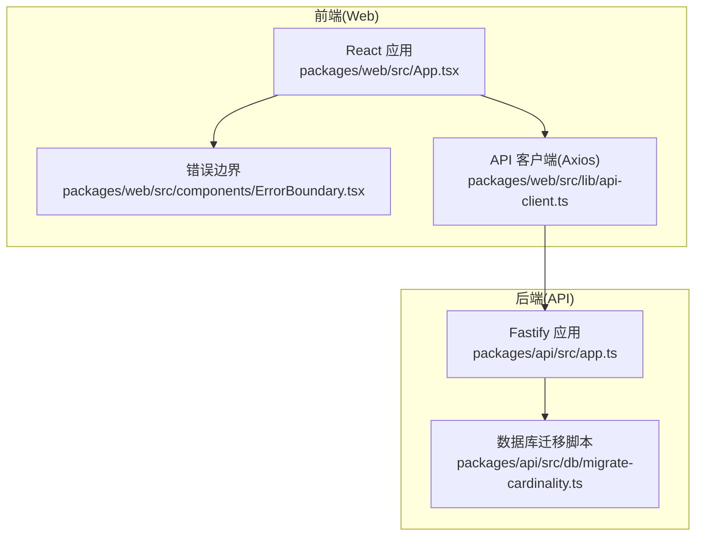
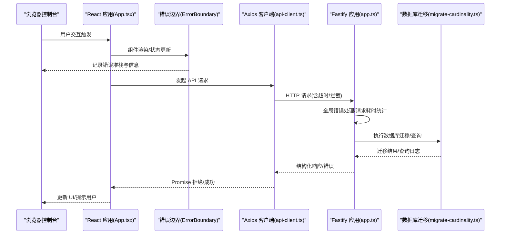
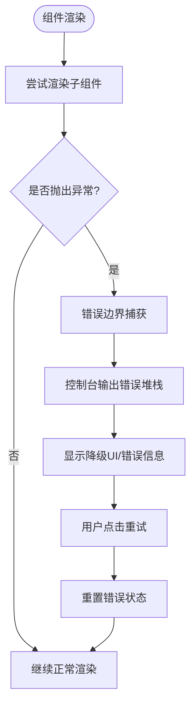
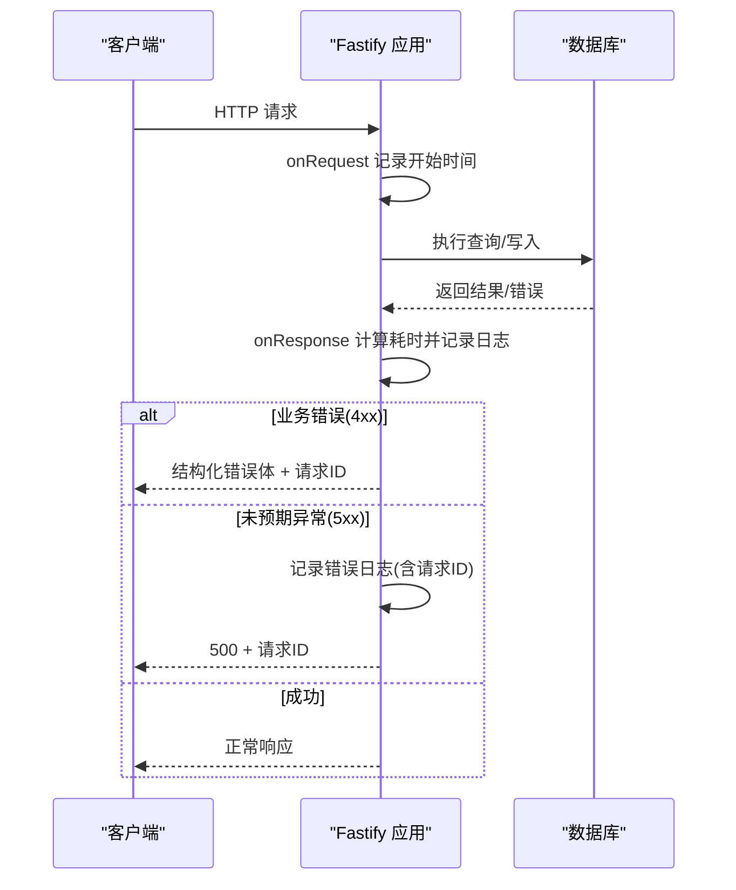
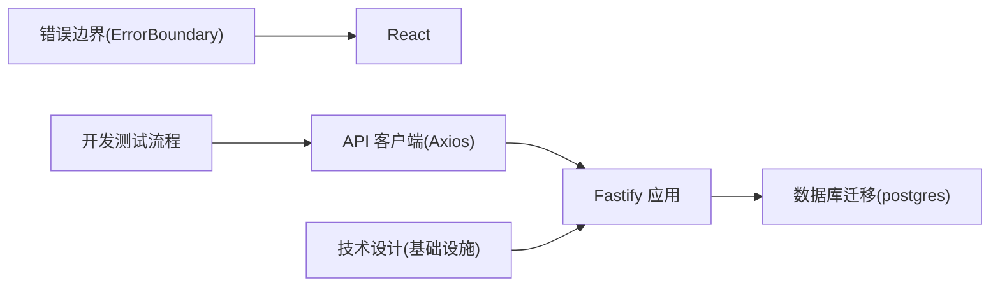

# 日志分析

<cite>
**本文引用的文件**
- [packages/api/src/app.ts](file://packages/api/src/app.ts)
- [packages/api/src/db/migrate-cardinality.ts](file://packages/api/src/db/migrate-cardinality.ts)
- [packages/web/src/App.tsx](file://packages/web/src/App.tsx)
- [packages/web/src/components/ErrorBoundary.tsx](file://packages/web/src/components/ErrorBoundary.tsx)
- [packages/web/src/lib/api-client.ts](file://packages/web/src/lib/api-client.ts)
- [docs/04-tech-design/phase1-infrastructure-plan.md](file://docs/04-tech-design/phase1-infrastructure-plan.md)
- [docs/00-project/workflow/dev-test-loop-design.md](file://docs/00-project/workflow/dev-test-loop-design.md)
- [logs-important/2026-05-13-conversation.md](file://logs-important/2026-05-13-conversation.md)
</cite>

## 目录
1. [简介](#简介)
2. [项目结构](#项目结构)
3. [核心组件](#核心组件)
4. [架构总览](#架构总览)
5. [详细组件分析](#详细组件分析)
6. [依赖分析](#依赖分析)
7. [性能考虑](#性能考虑)
8. [故障排查指南](#故障排查指南)
9. [结论](#结论)
10. [附录](#附录)

## 简介
本指南面向AI原型管理系统（APM）的运维与开发人员，提供从前端到后端的完整日志分析方法论。内容涵盖：
- 如何查看与分析前端应用日志（浏览器控制台、网络请求、React 错误边界）
- 如何查看与分析后端服务日志（Fastify 服务器日志、数据库迁移脚本日志、业务逻辑日志）
- 日志级别与过滤技巧，帮助快速定位问题
- 关键日志信息的解读方法（错误堆栈、请求ID追踪、时间戳分析）
- 日志聚合与分析工具的使用建议
- 如何通过日志发现性能瓶颈与内存泄漏
- 日志轮转与存储最佳实践
- 实战案例：从日志中定位问题根因

## 项目结构
APM采用前后端分离架构：
- 前端 Web 应用位于 packages/web，基于 React + Vite 构建
- 后端 API 应用位于 packages/api，基于 Fastify + Drizzle ORM
- 文档与基础设施规划位于 docs，包含技术设计与部署计划
- 重要日志对话记录位于 logs-important，可用于复盘与案例分析

图表来源
- [packages/web/src/App.tsx:25-113](file://packages/web/src/App.tsx#L25-L113)
- [packages/web/src/components/ErrorBoundary.tsx:13-56](file://packages/web/src/components/ErrorBoundary.tsx#L13-L56)
- [packages/web/src/lib/api-client.ts:13-26](file://packages/web/src/lib/api-client.ts#L13-L26)
- [packages/api/src/app.ts:6-178](file://packages/api/src/app.ts#L6-L178)
- [packages/api/src/db/migrate-cardinality.ts:18-49](file://packages/api/src/db/migrate-cardinality.ts#L18-L49)

章节来源
- [packages/web/src/App.tsx:25-113](file://packages/web/src/App.tsx#L25-L113)
- [packages/api/src/app.ts:6-178](file://packages/api/src/app.ts#L6-L178)

## 核心组件
- 前端错误边界：捕获并记录 React 组件树中的未处理异常，同时向控制台输出错误堆栈，便于前端调试与用户反馈
- API 客户端：统一配置基础URL、超时与响应拦截器，标准化错误消息提取，减少前端重复处理
- Fastify 应用：启用结构化日志、全局错误处理、请求耗时统计、OpenAPI 文档集成与健康检查
- 数据库迁移脚本：一次性迁移脚本，使用 console 输出关键步骤与结果，便于审计与排障

章节来源
- [packages/web/src/components/ErrorBoundary.tsx:13-56](file://packages/web/src/components/ErrorBoundary.tsx#L13-L56)
- [packages/web/src/lib/api-client.ts:13-26](file://packages/web/src/lib/api-client.ts#L13-L26)
- [packages/api/src/app.ts:6-178](file://packages/api/src/app.ts#L6-L178)
- [packages/api/src/db/migrate-cardinality.ts:18-49](file://packages/api/src/db/migrate-cardinality.ts#L18-L49)

## 架构总览
下图展示了从前端到后端的关键日志流：

图表来源
- [packages/web/src/App.tsx:25-113](file://packages/web/src/App.tsx#L25-L113)
- [packages/web/src/components/ErrorBoundary.tsx:13-56](file://packages/web/src/components/ErrorBoundary.tsx#L13-L56)
- [packages/web/src/lib/api-client.ts:13-26](file://packages/web/src/lib/api-client.ts#L13-L26)
- [packages/api/src/app.ts:73-98](file://packages/api/src/app.ts#L73-L98)
- [packages/api/src/app.ts:104-113](file://packages/api/src/app.ts#L104-L113)
- [packages/api/src/db/migrate-cardinality.ts:18-49](file://packages/api/src/db/migrate-cardinality.ts#L18-L49)

## 详细组件分析

### 前端日志分析（浏览器控制台与网络请求）
- 控制台错误
  - React 错误边界会在捕获到异常时打印错误对象与堆栈到控制台，便于定位具体组件与调用链
  - 建议在开发阶段保持控制台打开，关注“错误边界”输出与堆栈信息
- 网络请求日志
  - Axios 客户端统一设置超时与响应拦截器，错误消息会从响应体的 error.message 提取并抛出
  - 建议结合浏览器 Network 面板观察请求/响应头、状态码、耗时与错误体
- 错误边界降级
  - 错误边界提供可选的降级 UI，显示错误消息与堆栈文本，支持“重试”按钮恢复

图表来源
- [packages/web/src/components/ErrorBoundary.tsx:19-25](file://packages/web/src/components/ErrorBoundary.tsx#L19-L25)
- [packages/web/src/components/ErrorBoundary.tsx:34-51](file://packages/web/src/components/ErrorBoundary.tsx#L34-L51)
- [packages/web/src/lib/api-client.ts:20-26](file://packages/web/src/lib/api-client.ts#L20-L26)

章节来源
- [packages/web/src/App.tsx:25-113](file://packages/web/src/App.tsx#L25-L113)
- [packages/web/src/components/ErrorBoundary.tsx:13-56](file://packages/web/src/components/ErrorBoundary.tsx#L13-L56)
- [packages/web/src/lib/api-client.ts:13-26](file://packages/web/src/lib/api-client.ts#L13-L26)

### 后端日志分析（Fastify 服务器与数据库）
- 结构化日志与日志级别
  - Fastify 实例启用结构化日志，日志级别来自环境变量 LOG_LEVEL，默认为 info
  - 建议在开发环境设为 debug 以获得更细粒度的请求耗时与错误细节
- 全局错误处理
  - 对 4xx 业务错误返回结构化错误体，并携带请求ID；对 500 未预期异常记录错误并返回通用错误
  - 请求ID可通过请求上下文获取，用于跨服务/模块关联日志
- 请求耗时统计
  - onRequest/onResponse 钩子记录每个请求的耗时，输出到 debug 日志，便于识别慢接口
- 健康检查
  - /api/v1/health 会执行一次数据库查询，返回健康状态与时间戳，异常时返回降级状态与数据库不可达标记
- 数据库迁移日志
  - 迁移脚本使用 console 输出关键步骤与结果，包含更新数量与残留校验，便于审计与排障

图表来源
- [packages/api/src/app.ts:73-98](file://packages/api/src/app.ts#L73-L98)
- [packages/api/src/app.ts:104-113](file://packages/api/src/app.ts#L104-L113)
- [packages/api/src/app.ts:119-130](file://packages/api/src/app.ts#L119-L130)
- [packages/api/src/db/migrate-cardinality.ts:18-49](file://packages/api/src/db/migrate-cardinality.ts#L18-L49)

章节来源
- [packages/api/src/app.ts:6-178](file://packages/api/src/app.ts#L6-L178)
- [packages/api/src/db/migrate-cardinality.ts:18-49](file://packages/api/src/db/migrate-cardinality.ts#L18-L49)

### 日志级别与过滤技巧
- 常用级别（按严重程度递增）
  - error：致命错误，系统无法继续提供服务
  - warn：潜在问题，需要关注但不影响功能
  - info：一般性信息，确认流程正常
  - debug：开发调试细节，包含请求耗时、参数等
- 过滤建议
  - 按时间范围过滤：结合日志聚合平台的时间轴筛选
  - 按请求ID过滤：前端报错时附带请求ID，后端日志中搜索该ID进行关联
  - 按路径/方法过滤：快速定位特定接口的异常
  - 按耗时阈值过滤：筛选超过阈值的请求，定位慢接口
- 环境变量
  - LOG_LEVEL：控制 Fastify 日志级别
  - API_PORT/API_HOST：控制后端监听端口与主机，便于区分多环境日志源

章节来源
- [packages/api/src/app.ts:7-9](file://packages/api/src/app.ts#L7-L9)
- [packages/api/src/app.ts:165-170](file://packages/api/src/app.ts#L165-L170)

### 关键日志信息解读
- 错误堆栈跟踪
  - 前端：错误边界会输出错误对象与堆栈，优先查看堆栈中的组件名与调用链
  - 后端：全局错误处理器会记录错误对象与请求ID，便于回溯
- 请求ID追踪
  - 后端全局错误处理器与请求钩子均使用 request.id 作为请求ID，前端报错时应记录该ID
- 时间戳分析
  - 健康检查返回时间戳，可据此判断服务是否持续可用
  - 请求耗时统计用于识别慢请求与潜在阻塞点

章节来源
- [packages/web/src/components/ErrorBoundary.tsx:23-25](file://packages/web/src/components/ErrorBoundary.tsx#L23-L25)
- [packages/api/src/app.ts:74-90](file://packages/api/src/app.ts#L74-L90)
- [packages/api/src/app.ts:120-129](file://packages/api/src/app.ts#L120-L129)
- [packages/api/src/app.ts:108-112](file://packages/api/src/app.ts#L108-L112)

### 日志聚合与分析工具使用
- 建议方案
  - 前端：浏览器控制台 + Network 面板；必要时接入轻量前端日志上报（如 Sentry）
  - 后端：结构化日志输出至 stdout/stderr，配合容器日志收集（如 Docker/Compose）与日志聚合平台（如 ELK/Vector/Fluent Bit）
- 关联分析
  - 以请求ID为纽带，将前端错误、后端错误与数据库迁移日志进行串联
  - 结合时间戳与请求耗时，定位异常发生窗口内的所有相关事件

章节来源
- [packages/web/src/lib/api-client.ts:20-26](file://packages/web/src/lib/api-client.ts#L20-L26)
- [packages/api/src/app.ts:73-98](file://packages/api/src/app.ts#L73-L98)
- [packages/api/src/db/migrate-cardinality.ts:18-49](file://packages/api/src/db/migrate-cardinality.ts#L18-L49)

### 性能瓶颈与内存泄漏发现
- 性能瓶颈
  - 通过请求耗时日志识别慢接口；结合数据库迁移脚本输出的更新数量与耗时，评估批量操作影响
  - 健康检查返回降级状态时，关注数据库连接与查询性能
- 内存泄漏
  - 前端：错误边界频繁触发可能暴露组件未正确清理资源的问题；结合浏览器性能面板与内存快照定位
  - 后端：长时间运行的服务需关注连接池与事务未释放；建议引入指标监控与定期巡检

章节来源
- [packages/api/src/app.ts:108-112](file://packages/api/src/app.ts#L108-L112)
- [packages/api/src/app.ts:120-129](file://packages/api/src/app.ts#L120-L129)
- [packages/api/src/db/migrate-cardinality.ts:18-49](file://packages/api/src/db/migrate-cardinality.ts#L18-L49)

### 日志轮转与存储最佳实践
- 轮转策略
  - 按大小与时间轮转，保留最近 N 天的日志，避免磁盘占满
- 存储与归档
  - 将日志持久化到独立卷或对象存储，定期归档冷数据
- 安全与合规
  - 避免在日志中记录敏感信息（如密码、令牌），必要时脱敏
- 可观测性
  - 为关键路径增加结构化字段（如请求ID、接口名、耗时、状态码），便于检索与告警

章节来源
- [packages/api/src/app.ts:7-9](file://packages/api/src/app.ts#L7-L9)

## 依赖分析
- 前端依赖
  - React 错误边界依赖 React 生命周期；API 客户端依赖 Axios；路由与守卫由 React Router 提供
- 后端依赖
  - Fastify 提供结构化日志、插件生态与路由注册；数据库迁移脚本依赖 postgres 客户端
- 文档与基础设施
  - 技术设计文档定义了 Fastify 版本与 CORS 等依赖；开发测试流程文档说明了本地开发与测试注意事项

图表来源
- [packages/web/src/components/ErrorBoundary.tsx:13-56](file://packages/web/src/components/ErrorBoundary.tsx#L13-L56)
- [packages/web/src/lib/api-client.ts:13-26](file://packages/web/src/lib/api-client.ts#L13-L26)
- [packages/api/src/app.ts:6-178](file://packages/api/src/app.ts#L6-L178)
- [packages/api/src/db/migrate-cardinality.ts:14-16](file://packages/api/src/db/migrate-cardinality.ts#L14-L16)
- [docs/04-tech-design/phase1-infrastructure-plan.md:183-184](file://docs/04-tech-design/phase1-infrastructure-plan.md#L183-L184)
- [docs/00-project/workflow/dev-test-loop-design.md:381](file://docs/00-project/workflow/dev-test-loop-design.md#L381)

章节来源
- [packages/web/src/App.tsx:25-113](file://packages/web/src/App.tsx#L25-L113)
- [packages/api/src/app.ts:6-178](file://packages/api/src/app.ts#L6-L178)
- [docs/04-tech-design/phase1-infrastructure-plan.md:183-184](file://docs/04-tech-design/phase1-infrastructure-plan.md#L183-L184)
- [docs/00-project/workflow/dev-test-loop-design.md:381](file://docs/00-project/workflow/dev-test-loop-design.md#L381)

## 性能考虑
- 前端
  - 合理拆分组件与懒加载，避免单次渲染负载过高
  - 错误边界降级应简洁快速，减少二次渲染成本
- 后端
  - 通过请求耗时日志识别慢接口；对数据库批量操作（如迁移）分批执行并记录进度
  - 健康检查应尽量轻量，避免对生产造成额外压力

章节来源
- [packages/web/src/components/ErrorBoundary.tsx:34-51](file://packages/web/src/components/ErrorBoundary.tsx#L34-L51)
- [packages/api/src/app.ts:108-112](file://packages/api/src/app.ts#L108-L112)
- [packages/api/src/db/migrate-cardinality.ts:18-49](file://packages/api/src/db/migrate-cardinality.ts#L18-L49)

## 故障排查指南
- 快速定位步骤
  - 前端：打开控制台，查看错误边界输出与堆栈；Network 面板确认请求/响应状态与耗时
  - 后端：根据请求ID在 Fastify 日志中检索；关注全局错误处理器输出与健康检查状态
  - 数据库：核对迁移脚本输出，确认更新数量与残留校验
- 常见问题
  - 401/403：检查认证头与权限；后端错误体包含请求ID，便于回溯
  - 500：查看后端错误日志与堆栈；必要时降低日志级别为 debug 获取更多细节
  - 慢请求：结合请求耗时日志与数据库查询日志，定位瓶颈环节

章节来源
- [packages/web/src/lib/api-client.ts:20-26](file://packages/web/src/lib/api-client.ts#L20-L26)
- [packages/api/src/app.ts:73-98](file://packages/api/src/app.ts#L73-L98)
- [packages/api/src/app.ts:108-112](file://packages/api/src/app.ts#L108-L112)
- [packages/api/src/db/migrate-cardinality.ts:36-41](file://packages/api/src/db/migrate-cardinality.ts#L36-L41)

## 结论
通过统一的前端错误边界、结构化的后端日志与清晰的请求ID追踪，APM 能够在开发与生产环境中高效定位问题。建议在团队内建立“日志驱动排障”的流程：先从前端控制台与 Network 面板确认现象，再以请求ID关联后端日志与数据库迁移日志，最终形成修复与回归验证闭环。

## 附录
- 实战案例参考
  - 参考重要日志对话记录，复盘历史问题与解决方案，提炼可复用的排查模板
- 开发与测试流程
  - 开发测试流程文档明确了本地开发与 E2E 测试的前置条件与工具链，有助于在受控环境下重现问题

章节来源
- [logs-important/2026-05-13-conversation.md](file://logs-important/2026-05-13-conversation.md)
- [docs/00-project/workflow/dev-test-loop-design.md:381](file://docs/00-project/workflow/dev-test-loop-design.md#L381)