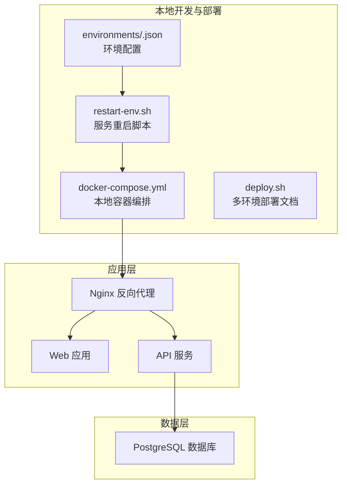
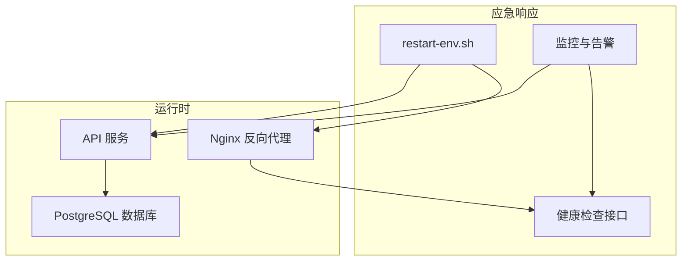
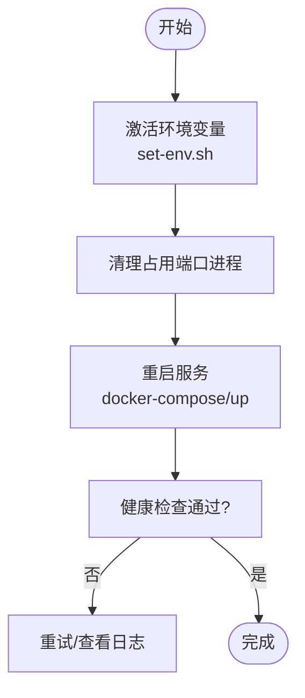
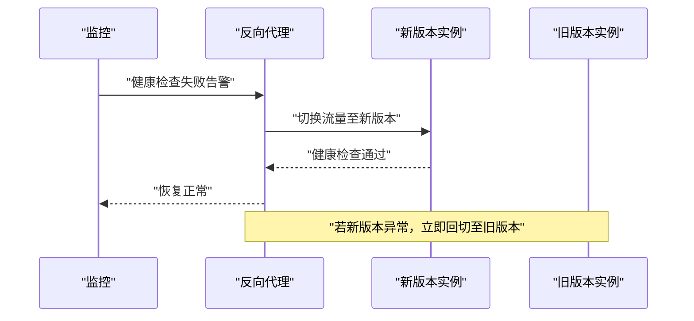
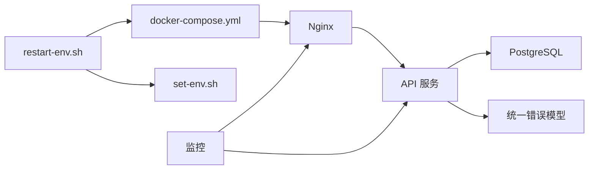

# 紧急响应

<cite>
**本文引用的文件**
- [restart-env.sh](file://environments/restart-env.sh)
- [set-env.sh](file://environments/set-env.sh)
- [multi-env-deploy.md](file://docs/07-deploy-design/multi-env-deploy.md)
- [dev-test-loop-design.md](file://docs/00-project/workflow/dev-test-loop-design.md)
- [app-shared-resources.md](file://docs/02-domain-model/app-shared-resources.md)
- [role-behavior-design.md](file://docs/04-tech-design/role-behavior-design.md)
- [2026-05-21-f-m1-06-company.md](file://docs/superpowers/plans/2026-05-21-f-m1-06-company.md)
- [docker-compose.yml](file://workspace/dev/docker-compose.yml)
- [package.json](file://package.json)
</cite>

## 目录
1. [引言](#引言)
2. [项目结构](#项目结构)
3. [核心组件](#核心组件)
4. [架构总览](#架构总览)
5. [详细组件分析](#详细组件分析)
6. [依赖分析](#依赖分析)
7. [性能考虑](#性能考虑)
8. [故障排查指南](#故障排查指南)
9. [结论](#结论)
10. [附录](#附录)

## 引言
本指南面向AI原型管理系统在生产或准生产环境中的紧急响应与故障恢复场景，覆盖系统崩溃与异常重启后的快速恢复流程、优雅关闭与强制重启策略、数据保护与状态重建、热修补丁与紧急发布（蓝绿部署、滚动更新、回滚）、监控告警分级与处置、灾难恢复与业务连续性、应急团队职责与沟通协调、事后分析与改进流程，并配套具体应急预案与操作手册。

## 项目结构
系统采用多包工作区与多环境部署设计，核心特性包括：
- 多环境并行运行与独立启停：通过环境配置文件与脚本实现隔离与快速切换
- 健康检查与反向代理：Nginx作为入口，转发静态资源与API请求
- 数据库迁移与版本化：Drizzle迁移脚本与版本列配合乐观锁
- 统一错误返回结构与错误码映射：便于客户端与监控侧一致化处理
- 开发-测试-修复闭环：自动化测试与根因分类，支撑快速回滚与热修复

图表来源
- [docker-compose.yml](file://workspace/dev/docker-compose.yml)
- [restart-env.sh](file://environments/restart-env.sh)
- [multi-env-deploy.md](file://docs/07-deploy-design/multi-env-deploy.md)

章节来源
- [multi-env-deploy.md:500-669](file://docs/07-deploy-design/multi-env-deploy.md#L500-L669)
- [restart-env.sh:1-70](file://environments/restart-env.sh#L1-L70)
- [docker-compose.yml](file://workspace/dev/docker-compose.yml)

## 核心组件
- 环境管理与重启
  - 通过环境配置文件与脚本组合，实现环境变量注入、端口占用清理与服务重启
  - 重启脚本不自动迁移数据，数据库由外部管理（Docker/本地PostgreSQL）
- 健康检查与反向代理
  - Nginx作为统一入口，提供静态回退与API转发，支持多环境并存
- 数据一致性与版本控制
  - 数据库迁移脚本与版本列配合乐观锁，确保并发修改与回滚可控
- 统一错误模型
  - 统一返回结构与错误码映射，便于监控与告警侧统一识别与处理
- 自动化测试与修复闭环
  - 测试失败分类与根因分析模板，支撑快速定位与回滚

章节来源
- [restart-env.sh:1-70](file://environments/restart-env.sh#L1-L70)
- [multi-env-deploy.md:500-669](file://docs/07-deploy-design/multi-env-deploy.md#L500-L669)
- [app-shared-resources.md:486-519](file://docs/02-domain-model/app-shared-resources.md#L486-L519)
- [role-behavior-design.md:1313-1327](file://docs/04-tech-design/role-behavior-design.md#L1313-L1327)
- [dev-test-loop-design.md:455-821](file://docs/00-project/workflow/dev-test-loop-design.md#L455-L821)

## 架构总览
下图展示紧急响应相关的系统交互：环境脚本负责服务生命周期管理，Nginx提供健康检查与流量转发，API服务对接数据库并通过迁移脚本保证Schema一致性，监控与告警基于统一错误模型进行分级处置。

图表来源
- [restart-env.sh:1-70](file://environments/restart-env.sh#L1-L70)
- [multi-env-deploy.md:500-669](file://docs/07-deploy-design/multi-env-deploy.md#L500-L669)
- [app-shared-resources.md:486-519](file://docs/02-domain-model/app-shared-resources.md#L486-L519)

## 详细组件分析

### 服务重启与异常恢复流程
- 目标：在系统崩溃或异常重启后，快速恢复服务可用性，最小化业务中断
- 关键步骤
  - 环境激活：通过环境脚本注入数据库URL、端口等变量
  - 端口清理：扫描并终止占用目标端口的残留进程，避免启动冲突
  - 服务重启：根据容器编排文件拉起Web与API服务，等待健康检查通过
  - 数据保护：确认数据库由外部管理（Docker卷/本地实例），重启不涉及数据迁移
- 适用场景
  - 进程卡死但容器未退出
  - 端口被占用导致启动失败
  - 环境变量变更后的重新加载

图表来源
- [restart-env.sh:50-70](file://environments/restart-env.sh#L50-L70)
- [multi-env-deploy.md:500-669](file://docs/07-deploy-design/multi-env-deploy.md#L500-L669)

章节来源
- [restart-env.sh:1-70](file://environments/restart-env.sh#L1-L70)
- [multi-env-deploy.md:500-669](file://docs/07-deploy-design/multi-env-deploy.md#L500-L669)

### 优雅关闭与强制重启
- 优雅关闭
  - 通过反向代理或服务管理器发送关闭信号，等待正在处理的请求完成
  - 记录当前版本与状态，确保可观测性
- 强制重启
  - 若优雅关闭超时或无效，终止进程并立即重启
  - 重启后执行健康检查，确认服务可用
- 数据保护
  - 重启不涉及数据库迁移；若需迁移，请使用独立迁移流程并在维护窗口执行

章节来源
- [multi-env-deploy.md:500-669](file://docs/07-deploy-design/multi-env-deploy.md#L500-L669)
- [restart-env.sh:1-70](file://environments/restart-env.sh#L1-L70)

### 数据恢复与状态重建
- 数据库迁移
  - 使用Drizzle迁移脚本初始化或升级Schema
  - 迁移前备份数据库，迁移后验证关键表结构与索引
- 状态重建
  - 重启后通过健康检查与API可用性验证，确认业务状态恢复
  - 对于缓存/队列等外部状态，结合监控指标评估重建进度

章节来源
- [multi-env-deploy.md:519-534](file://docs/07-deploy-design/multi-env-deploy.md#L519-L534)

### 热修补丁与紧急发布
- 蓝绿部署
  - 准备两套相同配置的环境（蓝/绿），切换反向代理指向新版本
  - 发布前在备用环境进行全链路验证，验证通过后切换流量
- 滚动更新
  - 分批重启实例，每次只替换部分实例，维持整体服务能力
  - 结合健康检查与熔断策略，避免雪崩效应
- 回滚机制
  - 通过反向代理回切到上一个稳定版本
  - 回滚前记录版本号与变更清单，回滚后进行回归验证

图表来源
- [multi-env-deploy.md:500-669](file://docs/07-deploy-design/multi-env-deploy.md#L500-L669)

章节来源
- [multi-env-deploy.md:500-669](file://docs/07-deploy-design/multi-env-deploy.md#L500-L669)
- [2026-05-21-f-m1-06-company.md:1386-1398](file://docs/superpowers/plans/2026-05-21-f-m1-06-company.md#L1386-L1398)

### 监控告警响应流程
- 告警分级
  - P0/P1：服务不可用、核心API不可访问、数据库异常
  - P2：性能退化、偶发错误、非关键功能异常
- 响应时间
  - P0：10分钟内响应，30分钟内恢复
  - P1：30分钟内响应，2小时内恢复
  - P2：2小时内响应，24小时内恢复
- 处理优先级
  - 先隔离影响面（如临时回滚/降级），再根因修复
  - 使用统一错误模型与错误码，便于告警聚合与自动处置

章节来源
- [app-shared-resources.md:486-519](file://docs/02-domain-model/app-shared-resources.md#L486-L519)
- [role-behavior-design.md:1313-1327](file://docs/04-tech-design/role-behavior-design.md#L1313-L1327)
- [dev-test-loop-design.md:793-819](file://docs/00-project/workflow/dev-test-loop-design.md#L793-L819)

### 灾难恢复与业务连续性
- 多环境并存
  - 同时运行多个环境，任一环境故障不影响其他环境
- 数据备份与恢复
  - 定期备份数据库，演练恢复流程，确保RTO/RPO达标
- 业务连续性
  - 通过蓝绿/滚动发布降低单点风险
  - 保持健康检查与日志采集，缩短故障定位时间

章节来源
- [multi-env-deploy.md:641-668](file://docs/07-deploy-design/multi-env-deploy.md#L641-L668)

### 应急团队职责与沟通协调
- 应急指挥官
  - 统一决策、资源协调、对外沟通
- 运维工程师
  - 执行重启、回滚、健康检查与日志收集
- 开发工程师
  - 根因分析、热修补丁、回归验证
- 测试工程师
  - 快速回归、验证修复有效性
- 沟通与协作
  - 建立应急群组，明确升级路径与汇报机制
  - 使用统一错误码与日志格式，提升跨团队协作效率

章节来源
- [dev-test-loop-design.md:455-501](file://docs/00-project/workflow/dev-test-loop-design.md#L455-L501)

### 事后分析与改进
- 事件复盘
  - 输出事件报告，包含时间线、影响面、根因、处置过程与改进建议
- 改进措施
  - 优化健康检查阈值与告警策略
  - 完善自动化测试与回归用例
  - 加强变更评审与灰度发布策略

章节来源
- [dev-test-loop-design.md:455-501](file://docs/00-project/workflow/dev-test-loop-design.md#L455-L501)

## 依赖分析
- 环境脚本依赖容器编排与端口配置
- 健康检查依赖API与Nginx状态
- 数据一致性依赖数据库迁移与版本控制
- 监控与告警依赖统一错误模型与错误码

图表来源
- [restart-env.sh:1-70](file://environments/restart-env.sh#L1-L70)
- [set-env.sh](file://environments/set-env.sh)
- [docker-compose.yml](file://workspace/dev/docker-compose.yml)
- [app-shared-resources.md:486-519](file://docs/02-domain-model/app-shared-resources.md#L486-L519)

章节来源
- [restart-env.sh:1-70](file://environments/restart-env.sh#L1-L70)
- [set-env.sh](file://environments/set-env.sh)
- [docker-compose.yml](file://workspace/dev/docker-compose.yml)
- [app-shared-resources.md:486-519](file://docs/02-domain-model/app-shared-resources.md#L486-L519)

## 性能考虑
- 启动时间优化：减少不必要的初始化步骤，优先加载核心依赖
- 健康检查粒度：区分进程存活、端口监听、业务可用三级检查
- 发布节奏：通过蓝绿/滚动发布降低峰值流量冲击

## 故障排查指南
- 系统不可用
  - 检查Nginx与API健康检查状态
  - 查看容器日志与端口占用情况
- 数据库异常
  - 确认连接字符串与端口映射
  - 执行Schema迁移并验证关键表
- 错误码异常
  - 基于统一错误码映射定位问题类型
  - 结合测试报告与根因分类模板进行修复

章节来源
- [multi-env-deploy.md:641-668](file://docs/07-deploy-design/multi-env-deploy.md#L641-L668)
- [role-behavior-design.md:1313-1327](file://docs/04-tech-design/role-behavior-design.md#L1313-L1327)
- [dev-test-loop-design.md:793-819](file://docs/00-project/workflow/dev-test-loop-design.md#L793-L819)

## 结论
通过多环境并存、健康检查、统一错误模型与自动化测试闭环，系统具备较强的弹性与可恢复性。结合蓝绿/滚动发布与严格的告警分级，可在最短时间内实现故障隔离、快速恢复与持续改进。

## 附录

### 应急预案与操作手册

- 系统崩溃/异常重启快速恢复
  - 步骤
    - 激活目标环境变量
    - 清理占用端口的残留进程
    - 重启服务并等待健康检查通过
    - 验证API与静态资源可用性
  - 参考
    - [restart-env.sh:50-70](file://environments/restart-env.sh#L50-L70)
    - [multi-env-deploy.md:500-669](file://docs/07-deploy-design/multi-env-deploy.md#L500-L669)

- 优雅关闭与强制重启
  - 步骤
    - 发送关闭信号并等待处理完成
    - 超时则强制终止并重启
    - 健康检查通过后确认恢复
  - 参考
    - [multi-env-deploy.md:500-669](file://docs/07-deploy-design/multi-env-deploy.md#L500-L669)

- 数据恢复与状态重建
  - 步骤
    - 执行数据库迁移脚本
    - 验证表结构与索引
    - 重启后进行健康检查与回归验证
  - 参考
    - [multi-env-deploy.md:519-534](file://docs/07-deploy-design/multi-env-deploy.md#L519-L534)

- 热修补丁与紧急发布
  - 蓝绿部署
    - 在备用环境验证后切换流量
  - 滚动更新
    - 分批重启实例，结合健康检查
  - 回滚机制
    - 立即回切至上一个稳定版本
  - 参考
    - [multi-env-deploy.md:500-669](file://docs/07-deploy-design/multi-env-deploy.md#L500-L669)
    - [2026-05-21-f-m1-06-company.md:1386-1398](file://docs/superpowers/plans/2026-05-21-f-m1-06-company.md#L1386-L1398)

- 监控告警响应
  - 告警分级与响应时间
  - 统一错误模型与错误码映射
  - 参考
    - [app-shared-resources.md:486-519](file://docs/02-domain-model/app-shared-resources.md#L486-L519)
    - [role-behavior-design.md:1313-1327](file://docs/04-tech-design/role-behavior-design.md#L1313-L1327)
    - [dev-test-loop-design.md:455-501](file://docs/00-project/workflow/dev-test-loop-design.md#L455-L501)

- 灾难恢复与业务连续性
  - 多环境并存与独立启停
  - 数据备份与恢复演练
  - 参考
    - [multi-env-deploy.md:641-668](file://docs/07-deploy-design/multi-env-deploy.md#L641-L668)

- 应急团队与沟通
  - 职责分工与升级路径
  - 统一错误码与日志格式
  - 参考
    - [dev-test-loop-design.md:455-501](file://docs/00-project/workflow/dev-test-loop-design.md#L455-L501)