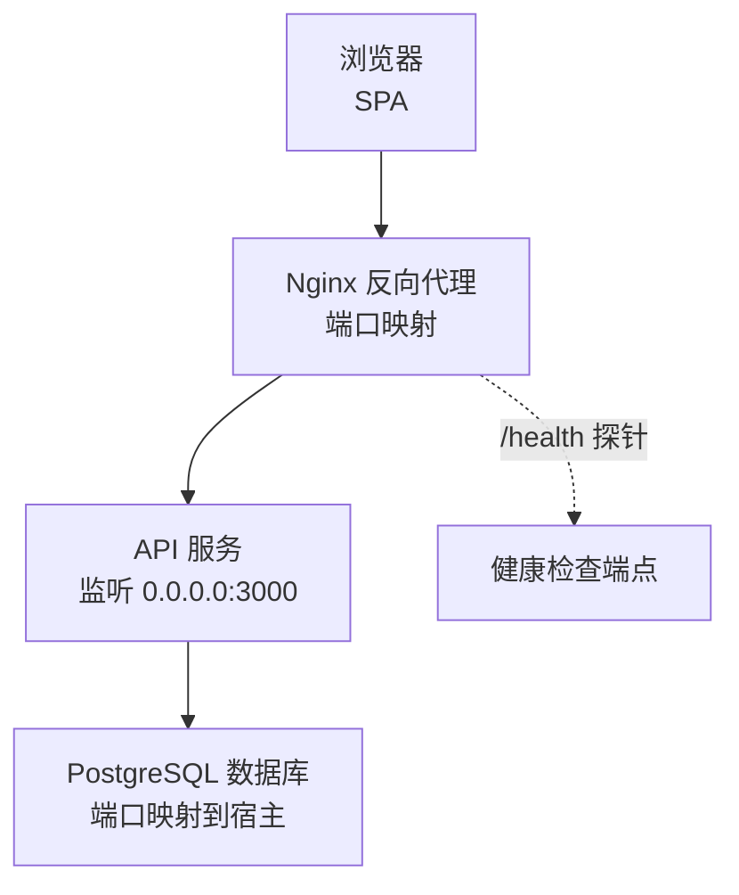
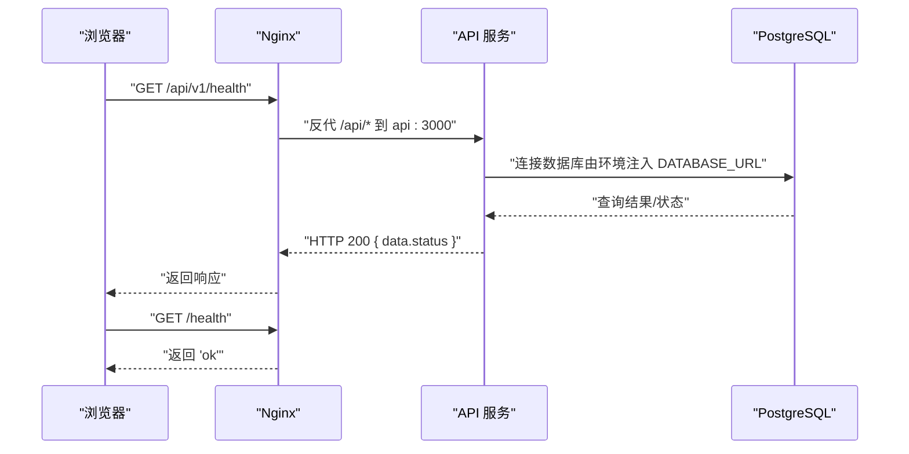
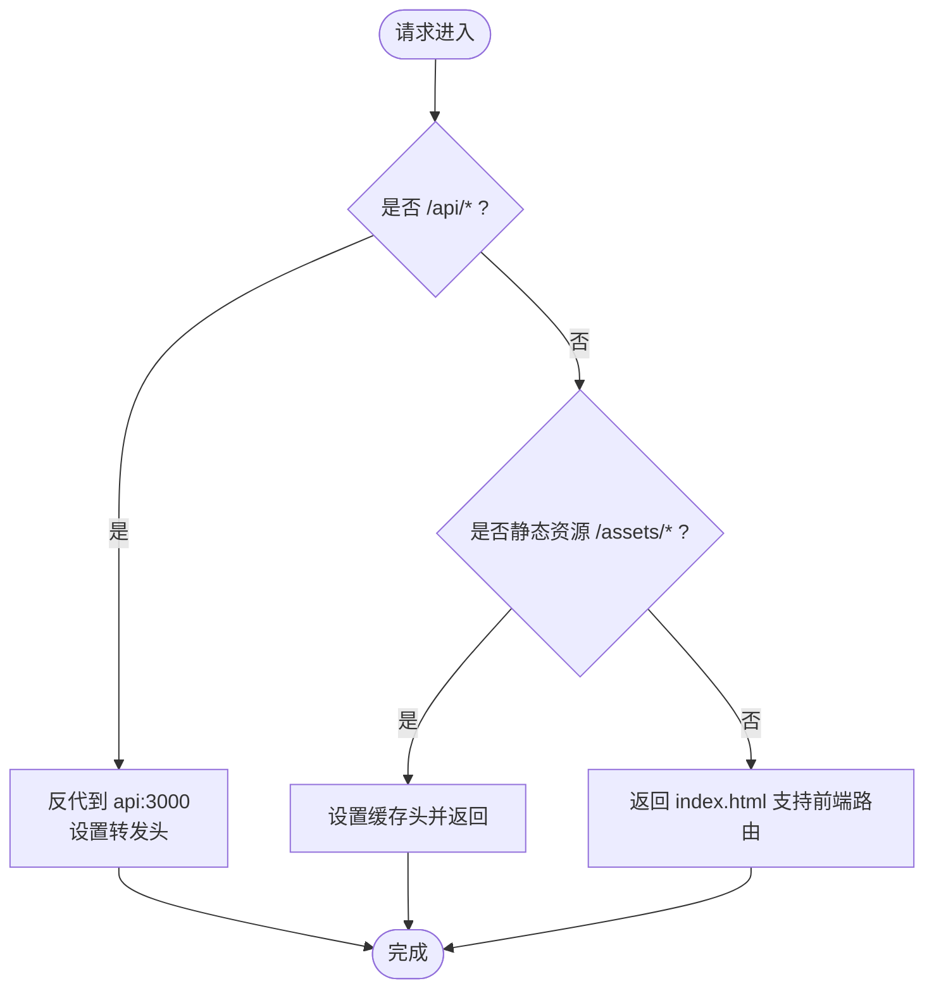
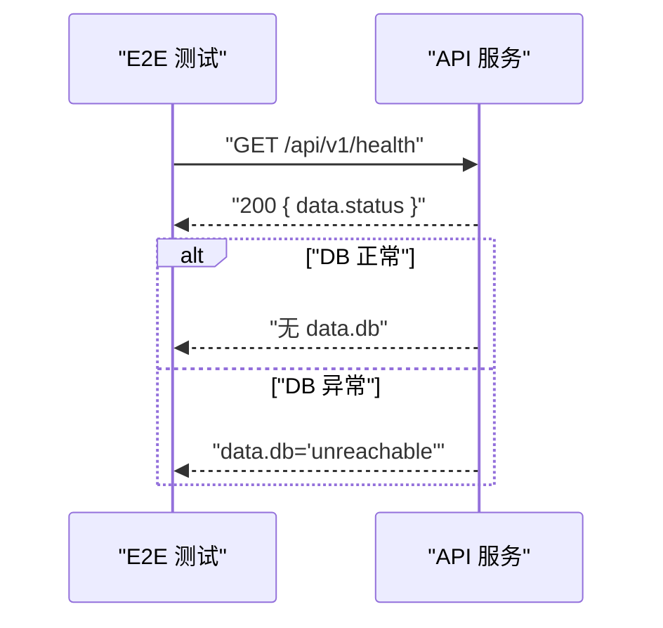
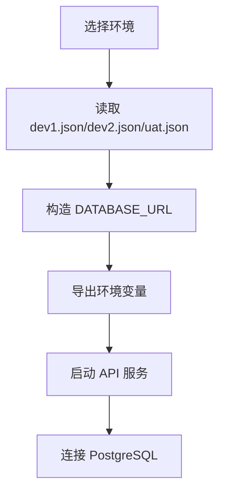
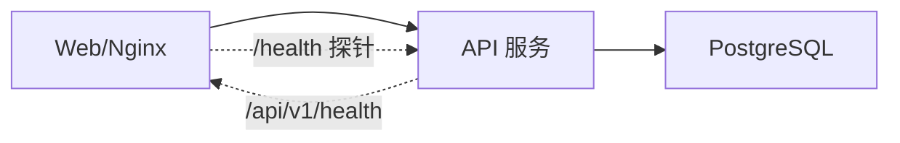

# 网络问题

<cite>
**本文引用的文件**
- [multi-env-deploy.md](file://docs/07-deploy-design/multi-env-deploy.md)
- [set-env.sh](file://environments/set-env.sh)
- [README.md（环境管理）](file://environments/README.md)
- [dev1.json](file://environments/dev1.json)
- [dev2.json](file://environments/dev2.json)
- [uat.json](file://environments/uat.json)
- [smoke.spec.ts](file://packages/e2e/tests/smoke.spec.ts)
- [openapi-schema.test.ts](file://packages/api/tests/openapi/openapi-schema.test.ts)
</cite>

## 目录
1. [简介](#简介)
2. [项目结构](#项目结构)
3. [核心组件](#核心组件)
4. [架构总览](#架构总览)
5. [详细组件分析](#详细组件分析)
6. [依赖关系分析](#依赖关系分析)
7. [性能考量](#性能考量)
8. [故障排查指南](#故障排查指南)
9. [结论](#结论)
10. [附录](#附录)

## 简介
本指南面向“AI原型管理系统”的网络问题排查，聚焦以下场景：
- API 连接失败：DNS 解析、SSL 证书、跨域（CORS）、同源策略、代理链路
- 数据库连接问题：连接字符串、防火墙、网络延迟、权限与认证
- 负载均衡与反向代理：Nginx 反代、健康检查、超时与缓冲
- WebSocket 连接问题：协议升级、代理支持、心跳与断线重连
- 环境间网络通信：开发/测试/生产差异、端口与域名映射
- API 网关与微服务通信：服务发现、内部网络、服务名解析
- 网络监控与连通性测试：健康检查端点、E2E 冒烟测试
- 网络安全与访问控制：CORS、鉴权、最小暴露面

## 项目结构
本项目采用“部署层注入配置”的多环境架构，核心网络路径如下：
- 前端浏览器通过 Web 端口访问 SPA，请求以相对路径 /api/* 发起
- Nginx 作为单入口反向代理，将 /api/* 转发至同 Compose 网络内的 API 服务
- API 服务连接 Postgres 数据库，数据库端口按环境映射到宿主
- 健康检查端点用于容器探活与运维观测

图表来源
- [multi-env-deploy.md:251-310](file://docs/07-deploy-design/multi-env-deploy.md#L251-L310)

章节来源
- [multi-env-deploy.md:75-102](file://docs/07-deploy-design/multi-env-deploy.md#L75-L102)
- [multi-env-deploy.md:251-310](file://docs/07-deploy-design/multi-env-deploy.md#L251-L310)

## 核心组件
- Nginx 反向代理：统一入口、静态资源、API 反代、健康检查
- API 服务：业务接口、健康检查、数据库连接
- PostgreSQL：数据持久化、按环境隔离
- 环境系统：端口与连接参数注入、激活与校验
- E2E 冒烟测试：前端加载、后端健康、数据库连通性

章节来源
- [multi-env-deploy.md:251-310](file://docs/07-deploy-design/multi-env-deploy.md#L251-L310)
- [README.md（环境管理）:1-62](file://environments/README.md#L1-L62)
- [smoke.spec.ts:1-30](file://packages/e2e/tests/smoke.spec.ts#L1-L30)

## 架构总览
下图展示浏览器到 API、再到数据库的典型链路，以及健康检查与探活路径。

图表来源
- [multi-env-deploy.md:251-310](file://docs/07-deploy-design/multi-env-deploy.md#L251-L310)
- [smoke.spec.ts:14-29](file://packages/e2e/tests/smoke.spec.ts#L14-L29)

## 详细组件分析

### Nginx 反向代理与 CORS
- 单入口与同源策略：浏览器仅访问 Web 端口，API 请求为相对路径，避免跨域问题
- 反代规则：/api/* 转发到 api:3000；设置 Host/X-Real-IP/X-Forwarded-* 头
- 健康检查：/health 返回纯文本 ok，便于探活
- 静态资源与 SPA 回退：资产缓存与 try_files 支持前端路由

图表来源
- [multi-env-deploy.md:251-310](file://docs/07-deploy-design/multi-env-deploy.md#L251-L310)

章节来源
- [multi-env-deploy.md:251-310](file://docs/07-deploy-design/multi-env-deploy.md#L251-L310)

### API 服务与健康检查
- 健康检查端点：/api/v1/health，返回 data.status
- 数据库连通性：当数据库不可达时，data.db 会包含 unreachable 标识
- OpenAPI 响应规范：确保 2xx/4xx/5xx 响应定义完整，便于客户端与网关契约一致

图表来源
- [smoke.spec.ts:14-29](file://packages/e2e/tests/smoke.spec.ts#L14-L29)
- [openapi-schema.test.ts:82-167](file://packages/api/tests/openapi/openapi-schema.test.ts#L82-L167)

章节来源
- [smoke.spec.ts:14-29](file://packages/e2e/tests/smoke.spec.ts#L14-L29)
- [openapi-schema.test.ts:82-167](file://packages/api/tests/openapi/openapi-schema.test.ts#L82-L167)

### 数据库连接与环境注入
- 环境激活：set-env.sh 读取 environments/*.json，构造 DATABASE_URL 并导出
- 端口映射：各环境 DB 端口映射到宿主不同端口，避免冲突
- 约束与规则：禁止硬编码 DATABASE_URL、禁止 fallback 连接串、必须先激活环境再启动服务

图表来源
- [set-env.sh:66-103](file://environments/set-env.sh#L66-L103)
- [dev1.json](file://environments/dev1.json)
- [dev2.json](file://environments/dev2.json)
- [uat.json](file://environments/uat.json)

章节来源
- [set-env.sh:66-103](file://environments/set-env.sh#L66-L103)
- [README.md（环境管理）:1-62](file://environments/README.md#L1-L62)

## 依赖关系分析
- 前端与 API：通过 Nginx 同源代理，避免 CORS
- API 与数据库：通过环境注入的 DATABASE_URL 连接
- 健康检查：Nginx /health 与 API /api/v1/health 双重探活

图表来源
- [multi-env-deploy.md:251-310](file://docs/07-deploy-design/multi-env-deploy.md#L251-L310)
- [smoke.spec.ts:14-29](file://packages/e2e/tests/smoke.spec.ts#L14-L29)

章节来源
- [multi-env-deploy.md:251-310](file://docs/07-deploy-design/multi-env-deploy.md#L251-L310)
- [smoke.spec.ts:14-29](file://packages/e2e/tests/smoke.spec.ts#L14-L29)

## 性能考量
- 反代超时与缓冲：proxy_connect_timeout/proxy_send_timeout/proxy_read_timeout 控制上游超时
- Gzip 压缩：减少传输体积
- 静态资源缓存：assets 设置一年缓存，immutable 提升命中率
- 健康检查：/health 端点简单快速，适合频繁探活

章节来源
- [multi-env-deploy.md:251-310](file://docs/07-deploy-design/multi-env-deploy.md#L251-L310)

## 故障排查指南

### 一、API 连接失败（浏览器侧）
- 症状：页面空白、控制台跨域错误、/api/* 404 或 502
- 排查步骤
  1) 确认浏览器访问的是 Web 端口，且请求为相对路径 /api/*
  2) 检查 Nginx 是否运行且 /api/* 反代到 api:3000
  3) 使用 /health 端点验证 Nginx 探活
  4) 使用 /api/v1/health 验证 API 健康与数据库状态
  5) 若出现跨域错误，检查是否绕过了 Nginx 单入口或手动配置了绝对路径
- 相关证据
  - Nginx 反代与 /health 定义
  - 健康检查端点与数据库可达性判断

章节来源
- [multi-env-deploy.md:251-310](file://docs/07-deploy-design/multi-env-deploy.md#L251-L310)
- [smoke.spec.ts:14-29](file://packages/e2e/tests/smoke.spec.ts#L14-L29)

### 二、DNS 解析问题
- 症状：/api/* 请求 502/504，或连接 api:3000 失败
- 排查步骤
  1) 确认 API 服务名称在 Compose 网络内可解析
  2) 检查 Nginx 反代配置是否使用服务名而非 IP
  3) 在 Nginx 容器内执行 nslookup 或 dig 验证解析
- 相关证据
  - 反代使用服务名 api:3000

章节来源
- [multi-env-deploy.md:251-310](file://docs/07-deploy-design/multi-env-deploy.md#L251-L310)

### 三、SSL 证书错误
- 症状：HTTPS 场景下证书不受信、Mixed Content、浏览器拦截
- 排查步骤
  1) 确认生产环境由反向代理统一终止 TLS
  2) 检查证书链与过期时间
  3) 如需本地 HTTPS，使用受信自签名证书或本地 CA
- 说明：本项目以 Nginx 作为单入口，建议在 Nginx 层配置 SSL

章节来源
- [multi-env-deploy.md:251-310](file://docs/07-deploy-design/multi-env-deploy.md#L251-L310)

### 四、跨域（CORS）问题
- 症状：浏览器 403/预检失败
- 排查步骤
  1) 本项目采用 Nginx 单入口与同源策略，前端请求相对路径 /api/*，理论上无需 CORS
  2) 若绕过 Nginx 或改为绝对路径，请在 API 层补充 CORS 头
- 说明：同源策略与 Nginx 反代已规避 CORS

章节来源
- [multi-env-deploy.md:75-82](file://docs/07-deploy-design/multi-env-deploy.md#L75-L82)

### 五、数据库连接问题
- 症状：/api/v1/health 返回 data.db='unreachable'，或应用启动报连接错误
- 排查步骤
  1) 确认已激活正确环境（先 source set-env.sh）
  2) 检查 DATABASE_URL 是否由环境系统注入，而非硬编码
  3) 校验宿主端口映射与数据库容器状态
  4) 使用宿主端口直连数据库验证网络连通性与权限
  5) 关注环境优先铁律：禁止 fallback 连接串与硬编码 DATABASE_URL
- 相关证据
  - 环境注入与规则约束
  - 健康检查对 DB 状态的反馈

章节来源
- [set-env.sh:66-103](file://environments/set-env.sh#L66-L103)
- [README.md（环境管理）:1-62](file://environments/README.md#L1-L62)
- [smoke.spec.ts:21-29](file://packages/e2e/tests/smoke.spec.ts#L21-L29)

### 六、负载均衡与反向代理问题
- 症状：请求超时、502/504、偶发断开
- 排查步骤
  1) 检查 Nginx 反代超时参数（proxy_connect/send/read_timeout）
  2) 确认 API 服务健康检查端点 /api/v1/health 可用
  3) 使用 /health 验证 Nginx 探活
  4) 观察日志与容器状态，必要时增加超时或优化后端性能
- 相关证据
  - 反代超时与 /health 端点

章节来源
- [multi-env-deploy.md:251-310](file://docs/07-deploy-design/multi-env-deploy.md#L251-L310)

### 七、WebSocket 连接问题
- 症状：握手失败、升级失败、断线重连频繁
- 排查步骤
  1) 确认 Nginx 支持 WebSocket 升级（需要 keepalive、upgrade/accept 头透传）
  2) 检查 API 服务对 WebSocket 的实现与心跳策略
  3) 使用浏览器开发者工具 Network/WS 面板观察升级过程
  4) 在反代层开启较长超时，避免代理中断长连接
- 说明：本项目以 Nginx 作为单入口，需确保其对 WebSocket 的支持

章节来源
- [multi-env-deploy.md:251-310](file://docs/07-deploy-design/multi-env-deploy.md#L251-L310)

### 八、环境间网络通信差异
- 症状：在 dev1 正常但在 dev2/uat 出错
- 排查步骤
  1) 确认使用相同环境激活方式（source set-env.sh 或 restart-env.sh）
  2) 对比 environments/*.json 的端口与数据库名
  3) 校验各环境端口映射与容器网络隔离
  4) 使用 /health 与 /api/v1/health 分别探活 Nginx 与 API
- 相关证据
  - 环境清单与端口分配规则
  - 环境激活脚本与 .active 记录

章节来源
- [multi-env-deploy.md:84-93](file://docs/07-deploy-design/multi-env-deploy.md#L84-L93)
- [README.md（环境管理）:1-62](file://environments/README.md#L1-L62)
- [set-env.sh:66-103](file://environments/set-env.sh#L66-L103)

### 九、API 网关与微服务通信问题
- 症状：服务间调用失败、超时、鉴权失败
- 排查步骤
  1) 使用服务名进行内部网络调用（compose 网络内 DNS）
  2) 确保服务间鉴权与令牌传递链路完整
  3) 通过健康检查端点与日志定位慢调用与失败节点
- 说明：本项目以 Nginx 为单入口，内部服务间通信遵循 Compose 网络

章节来源
- [multi-env-deploy.md:251-310](file://docs/07-deploy-design/multi-env-deploy.md#L251-L310)

### 十、网络监控与连通性测试
- 健康检查端点
  - Nginx: /health（返回 'ok'）
  - API: /api/v1/health（返回 data.status，DB 异常时包含 data.db）
- E2E 冒烟测试
  - 前端页面加载与菜单可见性
  - 后端 /api/v1/health 200 且 data.status='ok'
  - 数据库连通性：data.db 不存在
- 建议
  - 将 /health 与 /api/v1/health 纳入自动化探活
  - 结合日志与指标（CPU/内存/连接数）定位瓶颈

章节来源
- [multi-env-deploy.md:281-286](file://docs/07-deploy-design/multi-env-deploy.md#L281-L286)
- [smoke.spec.ts:1-30](file://packages/e2e/tests/smoke.spec.ts#L1-L30)

### 十一、网络安全与访问控制
- CORS：本项目通过 Nginx 同源策略规避 CORS，若需外部接入请在 API 层补充
- 最小暴露面：仅开放 Web 端口给浏览器，API/DB 仅在容器网络内可达
- 证书与 TLS：建议在 Nginx 层统一终止 TLS，避免后端直曝
- 鉴权：结合 API 层鉴权策略与网关（如有）进行统一管控

章节来源
- [multi-env-deploy.md:75-82](file://docs/07-deploy-design/multi-env-deploy.md#L75-L82)
- [multi-env-deploy.md:251-310](file://docs/07-deploy-design/multi-env-deploy.md#L251-L310)

## 结论
本项目的网络架构以 Nginx 单入口为核心，结合环境系统注入配置与健康检查端点，形成清晰、可诊断的链路。排查时应优先验证环境激活、反代与探活，再逐步深入到 DNS、数据库与安全策略。通过 E2E 冒烟测试与健康检查端点，可快速定位问题根因并恢复服务。

## 附录

### A. 环境激活与端口对照
- 环境激活：source environments/set-env.sh [env]
- 端口分配规则：Web = 13181 + N×100，API = 13180 + N×100，DB = 5432 + N
- 环境清单：dev1（默认）、dev2、uat

章节来源
- [multi-env-deploy.md:84-93](file://docs/07-deploy-design/multi-env-deploy.md#L84-L93)
- [README.md（环境管理）:1-62](file://environments/README.md#L1-L62)

### B. 健康检查端点速查
- Nginx: /health（返回 'ok'）
- API: /api/v1/health（data.status='ok' 或 data.db='unreachable'）

章节来源
- [multi-env-deploy.md:281-286](file://docs/07-deploy-design/multi-env-deploy.md#L281-L286)
- [smoke.spec.ts:14-29](file://packages/e2e/tests/smoke.spec.ts#L14-L29)