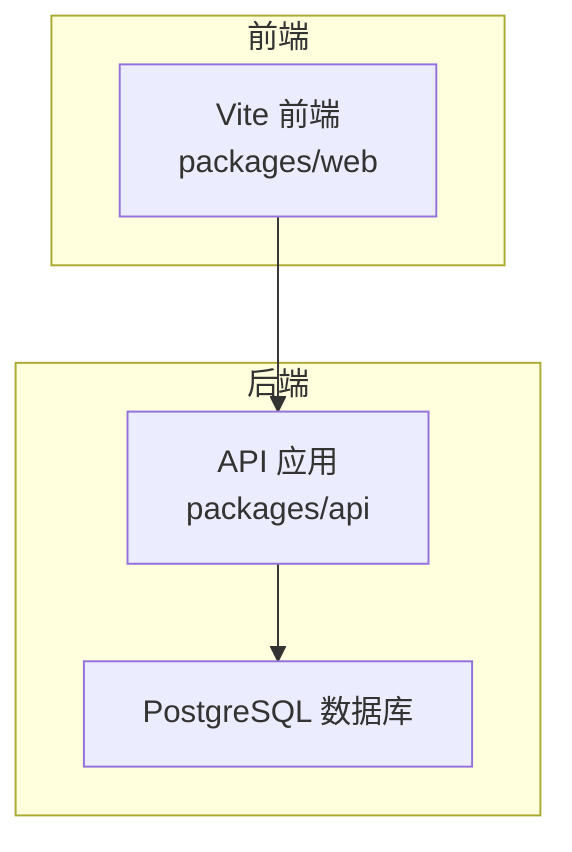
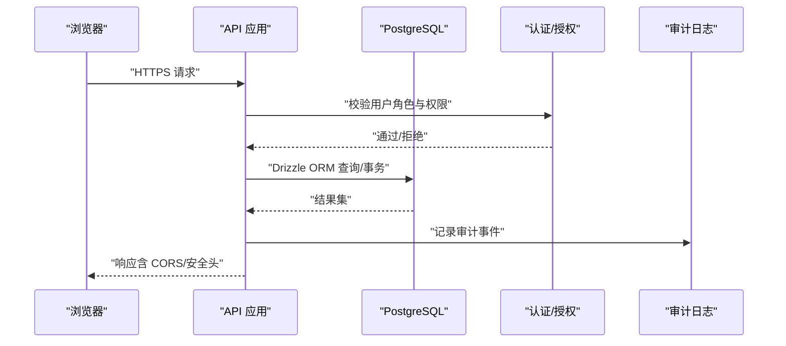
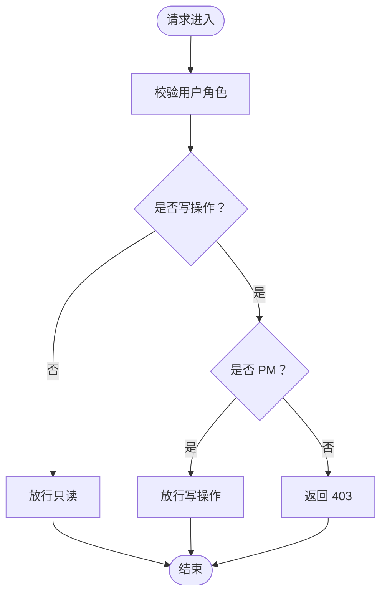
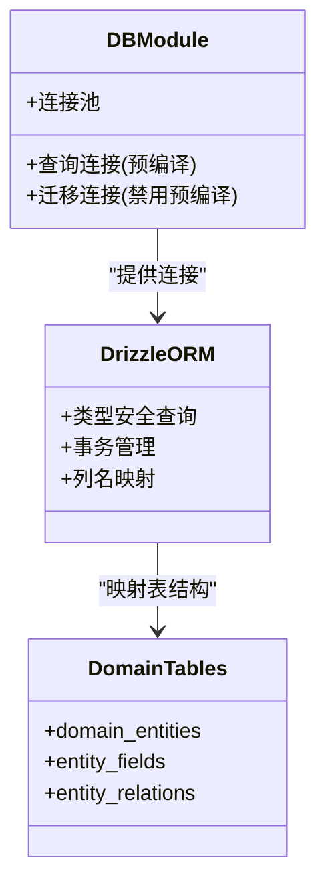
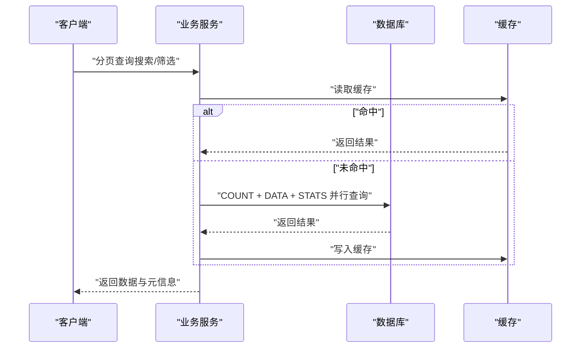
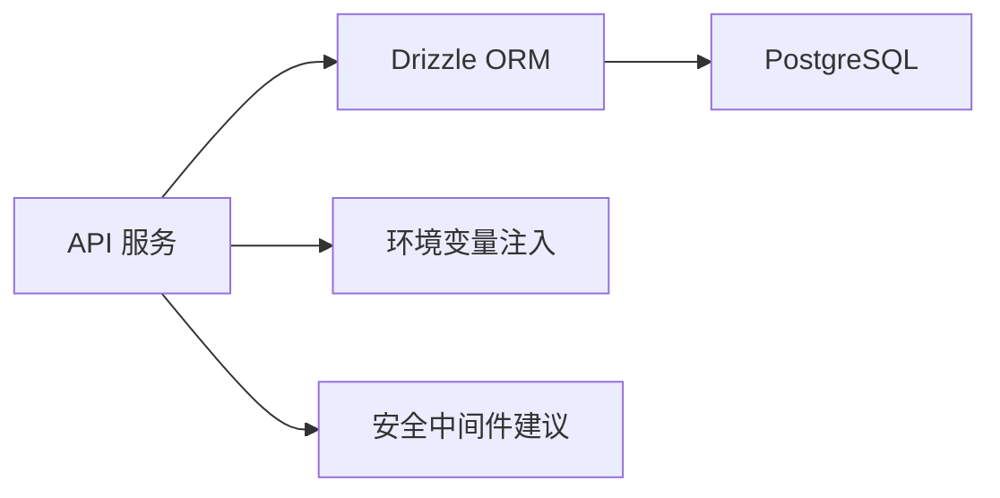

# 数据安全与性能

<cite>
**本文引用的文件**
- [packages/api/src/db.ts](file://packages/api/src/db.ts)
- [docs/04-tech-design/phase1-infrastructure-plan.md](file://docs/04-tech-design/phase1-infrastructure-plan.md)
- [docs/04-tech-design/coding-convention-backend.md](file://docs/04-tech-design/coding-convention-backend.md)
- [docs/03-prd-ux/modules/project-management/project-management-prd-2.md](file://docs/03-prd-ux/modules/project-management/project-management-prd-2.md)
- [docs/02-domain-model/app-shared-resources.md](file://docs/02-domain-model/app-shared-resources.md)
- [docs/04-tech-design/domain-model-tech-design.md](file://docs/04-tech-design/domain-model-tech-design.md)
- [packages/api/src/services/project.service.ts](file://packages/api/src/services/project.service.ts)
- [packages/api/src/services/organization.service.ts](file://packages/api/src/services/organization.service.ts)
- [docs/07-deploy-design/multi-env-deploy.md](file://docs/07-deploy-design/multi-env-deploy.md)
- [AGENTS.md](file://AGENTS.md)
- [docs/superpowers/plans/2026-05-21-f-m1-06-company.md](file://docs/superpowers/plans/2026-05-21-f-m1-06-company.md)
</cite>

## 目录
1. [简介](#简介)
2. [项目结构](#项目结构)
3. [核心组件](#核心组件)
4. [架构总览](#架构总览)
5. [详细组件分析](#详细组件分析)
6. [依赖分析](#依赖分析)
7. [性能考虑](#性能考虑)
8. [故障排查指南](#故障排查指南)
9. [结论](#结论)
10. [附录](#附录)

## 简介
本文件面向“AI原型管理系统”的数据安全与性能优化目标，结合仓库中现有的技术设计、权限模型、数据库设计与部署规划等资料，系统化梳理访问控制、数据加密策略、审计日志、SQL 注入防护、XSS 与 CSRF 防护、传输安全、数据库安全配置、性能优化策略、监控与指标、安全审计与基准测试建议、威胁模型与瓶颈分析，以及备份恢复与高可用设计建议。由于仓库中尚未包含具体的安全中间件与审计日志实现代码，本文在相应章节给出可落地的实施建议与最佳实践。

## 项目结构
系统采用前后端分离与多包工作区组织，核心后端位于 packages/api，数据库访问通过 Drizzle ORM 与 postgres-js 实现；权限模型在产品需求与技术设计文档中有明确规范；部署与环境管理遵循多环境方案。

**图表来源**
- [packages/api/src/db.ts:1-24](file://packages/api/src/db.ts#L1-L24)
- [docs/04-tech-design/phase1-infrastructure-plan.md:500-540](file://docs/04-tech-design/phase1-infrastructure-plan.md#L500-L540)

**章节来源**
- [packages/api/src/db.ts:1-24](file://packages/api/src/db.ts#L1-L24)
- [docs/04-tech-design/phase1-infrastructure-plan.md:480-540](file://docs/04-tech-design/phase1-infrastructure-plan.md#L480-L540)

## 核心组件
- 数据库连接与迁移：统一从环境变量读取 DATABASE_URL，确保连接串不硬编码，支持迁移与查询分离。
- 权限模型：基于角色的访问控制（RBAC），权限字符串格式为“资源:操作”，支持通配符与组件级绑定。
- 业务服务：项目与组织服务实现分页、搜索、并行查询与内嵌统计，降低前端 N+1 风险。
- 部署与环境：多环境部署基线，包含容器非 root 运行、CORS 策略、网络隔离与镜像供应链建议。

**章节来源**
- [packages/api/src/db.ts:1-24](file://packages/api/src/db.ts#L1-L24)
- [docs/03-prd-ux/modules/project-management/project-management-prd-2.md:1377-1424](file://docs/03-prd-ux/modules/project-management/project-management-prd-2.md#L1377-L1424)
- [docs/02-domain-model/app-shared-resources.md:290-344](file://docs/02-domain-model/app-shared-resources.md#L290-L344)
- [packages/api/src/services/project.service.ts:90-157](file://packages/api/src/services/project.service.ts#L90-L157)
- [docs/07-deploy-design/multi-env-deploy.md:574-595](file://docs/07-deploy-design/multi-env-deploy.md#L574-L595)

## 架构总览
下图展示从浏览器到 API 与数据库的整体交互流程，并标注安全与性能相关的关键节点。

**图表来源**
- [packages/api/src/db.ts:1-24](file://packages/api/src/db.ts#L1-L24)
- [docs/03-prd-ux/modules/project-management/project-management-prd-2.md:1377-1424](file://docs/03-prd-ux/modules/project-management/project-management-prd-2.md#L1377-L1424)
- [docs/07-deploy-design/multi-env-deploy.md:574-595](file://docs/07-deploy-design/multi-env-deploy.md#L574-L595)

## 详细组件分析

### 访问控制与权限管理
- 角色与权限
  - 角色：PM、Developer、Tester；PM 拥有全部读写权限，其他为只读。
  - 权限字符串格式：资源:操作，支持通配符“*”。
  - 组件级绑定：支持声明式注解与 Hook 条件判断。
- 后端校验
  - 每个 API 端点在业务逻辑前检查用户角色，非 PM 的写操作直接返回 403。
  - 前端仅做 UX 控制，安全保障依赖后端。
- 权限矩阵
  - 明确各角色对项目、公司、部门、角色、外部实体及行为等资源的读写边界。

**图表来源**
- [docs/03-prd-ux/modules/project-management/project-management-prd-2.md:1377-1424](file://docs/03-prd-ux/modules/project-management/project-management-prd-2.md#L1377-L1424)
- [docs/02-domain-model/app-shared-resources.md:290-344](file://docs/02-domain-model/app-shared-resources.md#L290-L344)

**章节来源**
- [docs/03-prd-ux/modules/project-management/project-management-prd-2.md:1377-1424](file://docs/03-prd-ux/modules/project-management/project-management-prd-2.md#L1377-L1424)
- [docs/02-domain-model/app-shared-resources.md:290-344](file://docs/02-domain-model/app-shared-resources.md#L290-L344)

### 数据库访问与 SQL 注入防护
- 连接与迁移
  - 通过 DATABASE_URL 动态加载连接串，查询连接启用预编译语句，迁移连接禁用预编译。
  - 未设置 DATABASE_URL 时抛出错误，杜绝隐式默认值。
- ORM 与查询
  - 使用 Drizzle ORM 的类型安全查询，参数化查询与列名映射，避免手写 SQL。
  - 事务处理保证多表写操作原子性，异常自动回滚。
- 索引与约束
  - 业务实体与关系表定义唯一索引，降低重复与冲突风险。

**图表来源**
- [packages/api/src/db.ts:1-24](file://packages/api/src/db.ts#L1-L24)
- [docs/04-tech-design/domain-model-tech-design.md:751-808](file://docs/04-tech-design/domain-model-tech-design.md#L751-L808)
- [docs/04-tech-design/coding-convention-backend.md:399-715](file://docs/04-tech-design/coding-convention-backend.md#L399-L715)

**章节来源**
- [packages/api/src/db.ts:1-24](file://packages/api/src/db.ts#L1-L24)
- [docs/04-tech-design/domain-model-tech-design.md:751-808](file://docs/04-tech-design/domain-model-tech-design.md#L751-L808)
- [docs/04-tech-design/coding-convention-backend.md:399-715](file://docs/04-tech-design/coding-convention-backend.md#L399-L715)

### XSS 与 CSRF 防护
- XSS 防护
  - 前端渲染严格区分 HTML 与文本，避免 innerHTML 直接拼接用户输入。
  - 对富文本输出进行白名单过滤或使用安全的 DOM 操作库。
- CSRF 防护
  - 采用 SameSite Cookie、CSRF Token 机制，配合后端校验。
  - GET/HEAD 请求仅用于只读场景，写操作强制使用 POST/PUT/DELETE。
- CORS 策略
  - 按环境配置 CORS_ORIGIN，避免使用宽松的 origin: true。
- 传输安全
  - 强制 HTTPS，HSTS 头部，TLS 最低版本与密码套件升级。

**章节来源**
- [docs/07-deploy-design/multi-env-deploy.md:574-595](file://docs/07-deploy-design/multi-env-deploy.md#L574-L595)

### 数据传输安全与 HTTPS
- 环境系统与端口约定
  - 开发环境端口与数据库实例分离，避免默认值绕过环境系统。
- HTTPS 与证书
  - 生产环境使用受信 CA 证书，自动续期；开发环境可使用自签名但仅限本地。
- 敏感数据保护
  - 数据库连接串、密钥与令牌通过环境变量注入，不落盘或不入库明文。

**章节来源**
- [AGENTS.md:132-150](file://AGENTS.md#L132-L150)
- [docs/04-tech-design/phase1-infrastructure-plan.md:480-492](file://docs/04-tech-design/phase1-infrastructure-plan.md#L480-L492)

### 数据库安全配置
- 用户权限管理
  - 为不同环境创建专用数据库用户，最小权限原则；应用仅具备必要 DML 权限。
- 备份与加密
  - 启用 WAL 日志与定期物理备份，备份存储加密；制定异地容灾策略。
- 灾难恢复
  - 定期演练 RTO/RPO 目标，确保可快速恢复至指定时间点。

**章节来源**
- [packages/api/src/db.ts:1-24](file://packages/api/src/db.ts#L1-L24)
- [docs/07-deploy-design/multi-env-deploy.md:574-595](file://docs/07-deploy-design/multi-env-deploy.md#L574-L595)

### 审计日志实现
- 建议方案
  - 在 API 层统一拦截器记录：请求 ID、用户标识、IP、时间、端点、方法、参数摘要、响应状态与耗时。
  - 审计事件分级：登录、敏感操作、批量删除、权限变更等。
  - 审计日志落盘与集中采集，保留周期符合合规要求。
- 与权限联动
  - 403 拒绝与权限不足事件单独标记，便于追踪越权尝试。

**章节来源**
- [docs/03-prd-ux/modules/project-management/project-management-prd-2.md:1414-1422](file://docs/03-prd-ux/modules/project-management/project-management-prd-2.md#L1414-L1422)

### 性能优化策略
- 查询性能
  - 分页与并行查询：COUNT + DATA + STATS 三路并行，减少往返次数。
  - 内嵌子查询统计：避免前端 N+1，降低网络与数据库压力。
- 索引优化
  - 唯一索引：实体名称与关系组合唯一性约束。
  - 复合索引：常见过滤字段（如 projectId、状态、创建时间）建立复合索引。
- 缓存策略
  - LRU 缓存热点数据（如静态字典、只读配置）。
  - Redis 缓存会话与临时聚合结果，设置合理 TTL。
- 事务与一致性
  - 多表写操作使用事务，异常自动回滚，保证 ACID。

**图表来源**
- [packages/api/src/services/project.service.ts:90-157](file://packages/api/src/services/project.service.ts#L90-L157)
- [packages/api/src/services/organization.service.ts:197-242](file://packages/api/src/services/organization.service.ts#L197-L242)
- [docs/superpowers/plans/2026-05-21-f-m1-06-company.md:706-765](file://docs/superpowers/plans/2026-05-21-f-m1-06-company.md#L706-L765)

**章节来源**
- [packages/api/src/services/project.service.ts:90-157](file://packages/api/src/services/project.service.ts#L90-L157)
- [packages/api/src/services/organization.service.ts:197-242](file://packages/api/src/services/organization.service.ts#L197-L242)
- [docs/superpowers/plans/2026-05-21-f-m1-06-company.md:706-765](file://docs/superpowers/plans/2026-05-21-f-m1-06-company.md#L706-L765)

### 数据库监控与性能指标
- 指标体系
  - 连接数、慢查询、锁等待、缓冲区命中率、WAL 写入速率。
- 监控告警
  - 阈值告警与趋势分析，异常自动通知。
- 调优建议
  - 定期分析 EXPLAIN/EXPLAIN ANALYZE，识别热点 SQL；根据业务峰值调整连接池大小与超时参数。

**章节来源**
- [packages/api/src/db.ts:1-24](file://packages/api/src/db.ts#L1-L24)

## 依赖分析
- 组件耦合
  - API 服务依赖 Drizzle ORM 与数据库连接模块；服务间通过参数传递与事务协作。
- 外部依赖
  - postgres-js、Drizzle ORM、Docker Compose、环境变量注入。
- 安全依赖
  - CORS、HTTPS、Cookie 安全属性、审计中间件（建议引入）。

**图表来源**
- [packages/api/src/db.ts:1-24](file://packages/api/src/db.ts#L1-L24)
- [docs/04-tech-design/phase1-infrastructure-plan.md:500-540](file://docs/04-tech-design/phase1-infrastructure-plan.md#L500-L540)

**章节来源**
- [packages/api/src/db.ts:1-24](file://packages/api/src/db.ts#L1-L24)
- [docs/04-tech-design/phase1-infrastructure-plan.md:500-540](file://docs/04-tech-design/phase1-infrastructure-plan.md#L500-L540)

## 性能考虑
- 查询层面
  - 使用并行查询与内嵌统计，减少 RTT 与 N+1。
- 索引层面
  - 针对高频过滤与排序字段建立复合索引，避免全表扫描。
- 缓存层面
  - 对只读数据与热点接口进行缓存，设置 TTL 与失效策略。
- 事务层面
  - 将多表写操作包裹在事务中，异常自动回滚，避免部分更新。

**章节来源**
- [packages/api/src/services/project.service.ts:90-157](file://packages/api/src/services/project.service.ts#L90-L157)
- [docs/04-tech-design/domain-model-tech-design.md:751-808](file://docs/04-tech-design/domain-model-tech-design.md#L751-L808)
- [docs/04-tech-design/coding-convention-backend.md:399-715](file://docs/04-tech-design/coding-convention-backend.md#L399-L715)

## 故障排查指南
- 数据库连接失败
  - 检查 DATABASE_URL 是否已通过环境脚本激活；确认端口与实例名正确。
- 权限拒绝（403）
  - 确认用户角色与操作权限矩阵；前端仅作 UX 优化，后端校验为最终依据。
- 性能问题
  - 使用 EXPLAIN 分析慢查询；检查索引是否生效；评估缓存命中率与连接池饱和度。
- 审计缺失
  - 确认审计中间件已接入；检查日志输出路径与轮转策略。

**章节来源**
- [AGENTS.md:132-150](file://AGENTS.md#L132-L150)
- [docs/03-prd-ux/modules/project-management/project-management-prd-2.md:1414-1422](file://docs/03-prd-ux/modules/project-management/project-management-prd-2.md#L1414-L1422)

## 结论
本项目在权限模型、数据库设计与部署基线上已具备良好的安全与性能基础。建议下一步引入统一的安全中间件与审计日志能力，完善 HTTPS 与 CORS 配置，强化数据库备份与灾备演练，并持续通过监控与基准测试迭代优化性能与安全性。

## 附录
- 安全威胁模型（建议）
  - 越权访问：RBAC 与最小权限；审计追踪。
  - 注入攻击：ORM 参数化；输入校验与白名单。
  - 会话劫持：HTTPS + Secure/SameSite Cookie + Token 管理。
  - 拒绝服务：连接池上限、慢查询阻断、熔断与降级。
- 性能基准测试（建议）
  - 压测工具：JMeter/Locust；指标：P50/P95 延迟、吞吐量、错误率、CPU/内存/IO。
  - 基准场景：分页列表、搜索、并发写入、事务批量导入。
- 备份恢复与高可用
  - 备份：增量/全量结合，异地加密存储；恢复演练定期进行。
  - 高可用：主从复制、读写分离、自动故障转移与健康检查。