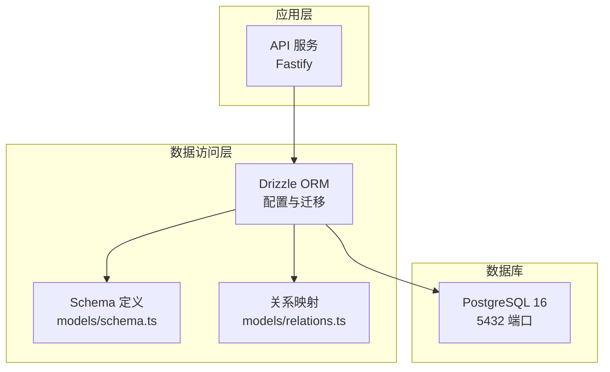
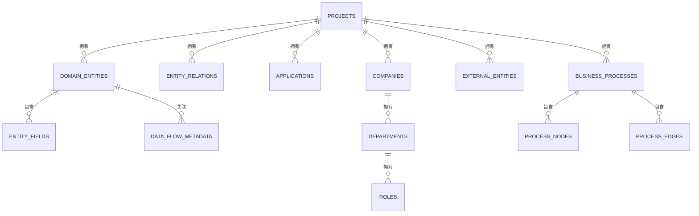
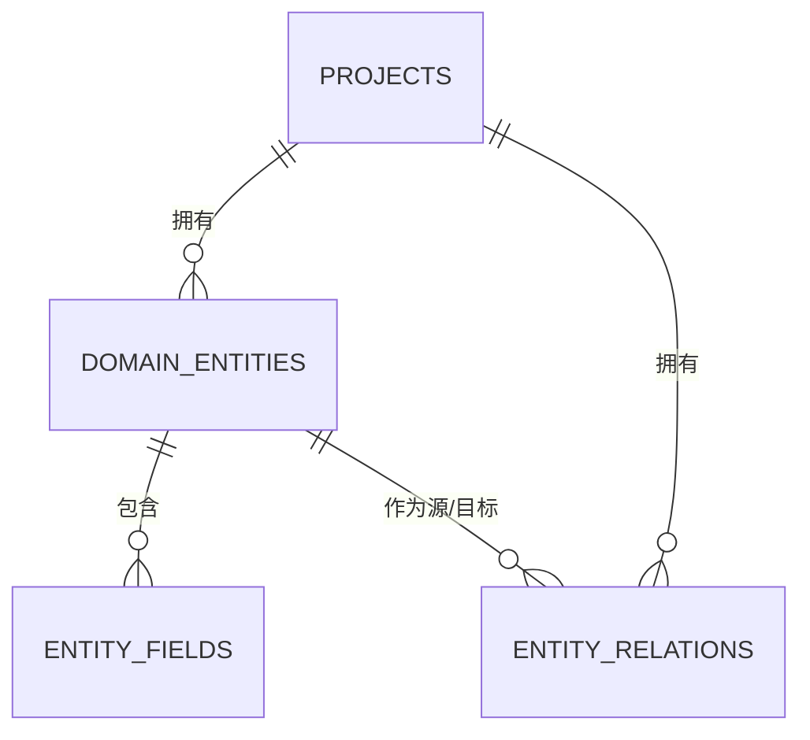
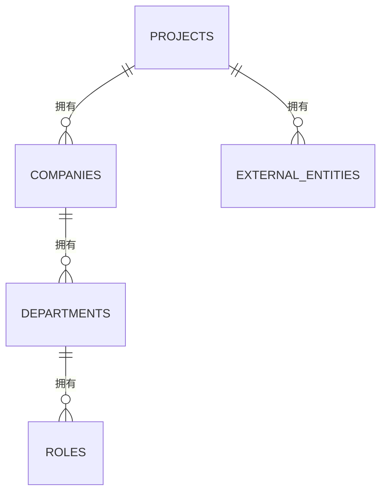
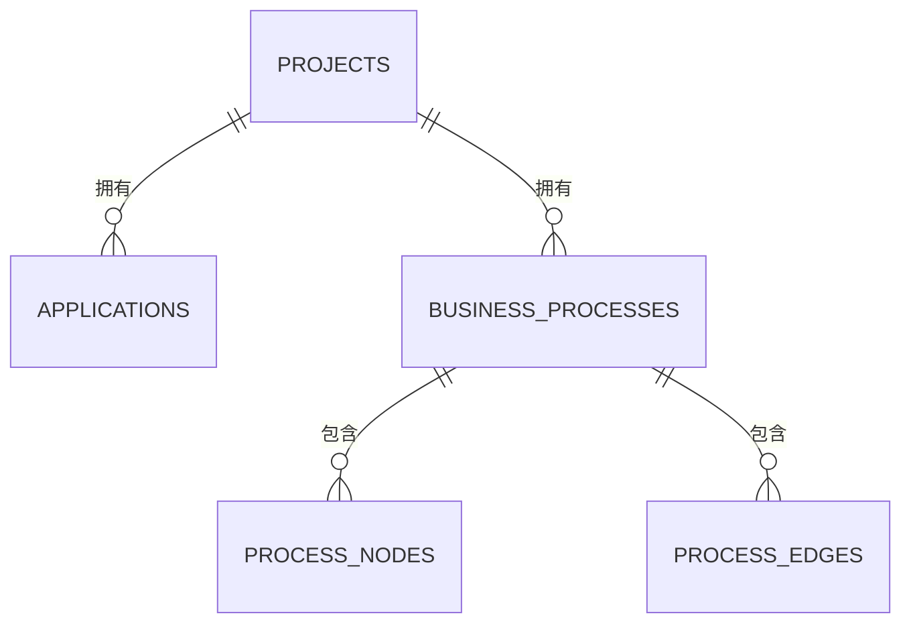
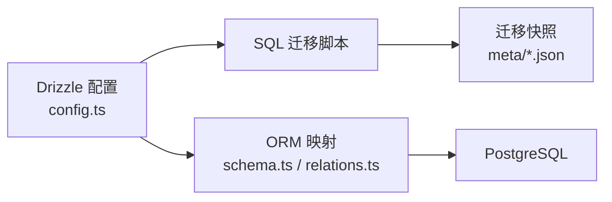

# 数据库架构设计

<cite>
**本文引用的文件**
- [README.md](file://README.md)
- [phase1-database-schema.md](file://docs/05-data-design/phase1-database-schema.md)
- [domain-model-tech-design.md](file://docs/04-tech-design/domain-model-tech-design.md)
- [coding-convention-backend.md](file://docs/04-tech-design/coding-convention-backend.md)
- [config.ts](file://packages/api/drizzle/config.ts)
- [0000_init_projects_table.sql](file://packages/api/drizzle/migrations/0000_init_projects_table.sql)
- [0001_confused_diamondback.sql](file://packages/api/drizzle/migrations/0001_confused_diamondback.sql)
- [0002_far_whizzer.sql](file://packages/api/drizzle/migrations/0002_far_whizzer.sql)
- [0003_rare_darwin.sql](file://packages/api/drizzle/migrations/0003_rare_darwin.sql)
- [0004_add_domain_entities_config.sql](file://packages/api/drizzle/migrations/0004_add_domain_entities_config.sql)
- [0005_flippant_colonel_america.sql](file://packages/api/drizzle/migrations/0005_flippant_colonel_america.sql)
- [0006_mean_rachel_grey.sql](file://packages/api/drizzle/migrations/0006_mean_rachel_grey.sql)
- [0000_snapshot.json](file://packages/api/drizzle/migrations/meta/0000_snapshot.json)
- [0001_snapshot.json](file://packages/api/drizzle/migrations/meta/0001_snapshot.json)
- [0002_snapshot.json](file://packages/api/drizzle/migrations/meta/0002_snapshot.json)
- [0003_snapshot.json](file://packages/api/drizzle/migrations/meta/0003_snapshot.json)
- [0004_snapshot.json](file://packages/api/drizzle/migrations/meta/0004_snapshot.json)
- [0005_snapshot.json](file://packages/api/drizzle/migrations/meta/0005_snapshot.json)
- [0006_snapshot.json](file://packages/api/drizzle/migrations/meta/0006_snapshot.json)
- [schema.ts](file://packages/api/src/models/schema.ts)
- [relations.ts](file://packages/api/src/models/relations.ts)
</cite>

## 目录
1. [简介](#简介)
2. [项目结构](#项目结构)
3. [核心组件](#核心组件)
4. [架构总览](#架构总览)
5. [详细组件分析](#详细组件分析)
6. [依赖分析](#依赖分析)
7. [性能考虑](#性能考虑)
8. [故障排查指南](#故障排查指南)
9. [结论](#结论)
10. [附录](#附录)

## 简介
本设计文档面向“AI原型管理系统”的数据库架构，基于项目采用的 PostgreSQL + Drizzle ORM 技术栈，系统化阐述数据库选型、表结构设计原则、索引与约束策略、核心业务模块（项目管理、域模型、组织架构等）的表结构与关系、性能优化策略、连接池与事务管理、初始化与迁移脚本及版本管理方案，并提供数据库拓扑图、表关系图与关键性能指标。

## 项目结构
- 后端技术栈：Fastify + PostgreSQL + Drizzle ORM + TypeBox + Ajv
- 数据库服务端口：5432
- 数据库驱动与配置：通过 Drizzle 配置文件集中管理连接参数与迁移元数据
- 迁移与快照：采用 Drizzle Migrate 的 SQL 迁移与 JSON 快照记录版本演进

图表来源
- [README.md](file://README.md)
- [config.ts](file://packages/api/drizzle/config.ts)
- [schema.ts](file://packages/api/src/models/schema.ts)
- [relations.ts](file://packages/api/src/models/relations.ts)

章节来源
- [README.md](file://README.md)
- [config.ts](file://packages/api/drizzle/config.ts)

## 核心组件
- 数据库选型：PostgreSQL 16，具备强一致性、JSONB 支持、扩展性强、成熟生态等优势，适合本系统的复杂域模型与组织架构存储。
- ORM 选型：Drizzle ORM，提供类型安全的 SQL 构建、迁移工具链与关系映射，便于在 TypeScript 中维护数据库结构与查询逻辑。
- 连接与配置：通过 Drizzle 配置文件集中管理连接字符串、驱动参数与迁移元数据，确保开发与部署一致性。
- 迁移与版本：采用 SQL 迁移脚本与 JSON 快照记录版本演进，支持增量升级与回滚。

章节来源
- [README.md](file://README.md)
- [config.ts](file://packages/api/drizzle/config.ts)

## 架构总览
系统数据库层围绕“项目”作为根实体，域模型（实体、字段、关系）与组织架构（公司、部门、角色、外部实体）均以项目为上下文进行组织。Drizzle 将 TypeScript 中的表定义映射到 PostgreSQL，迁移工具负责版本化演进。

图表来源
- [domain-model-tech-design.md](file://docs/04-tech-design/domain-model-tech-design.md)
- [schema.ts](file://packages/api/src/models/schema.ts)
- [relations.ts](file://packages/api/src/models/relations.ts)

## 详细组件分析

### 项目管理模块（Projects）
- 设计原则：以项目为根实体，所有域模型与组织对象均通过外键关联到项目，实现租户隔离与上下文限定。
- 关键字段：标识符、名称、显示名、描述、排序、时间戳等。
- 约束与索引：唯一性约束用于防止重复命名；必要时对常用过滤字段建立索引。
- 典型查询：按项目查询域实体、关系、应用、组织对象；分页与排序。

章节来源
- [domain-model-tech-design.md](file://docs/04-tech-design/domain-model-tech-design.md)
- [schema.ts](file://packages/api/src/models/schema.ts)

### 域模型模块（Domain Entities, Entity Fields, Entity Relations）
- 实体（Domain Entities）：承载业务概念，支持配置字段（如画布位置），并以项目+名称唯一。
- 字段（Entity Fields）：描述实体属性，支持必填、默认值、约束与排序。
- 关系（Entity Relations）：描述实体间关系，包含关系类型、目标基数、显示名与描述等。
- 关系映射：实体与字段、实体与关系之间为一对多；关系两端分别指向源/目标实体。
- 约束与索引：实体与字段的“项目+名称”唯一索引；关系的复合唯一索引避免重复关系。

图表来源
- [domain-model-tech-design.md](file://docs/04-tech-design/domain-model-tech-design.md)
- [schema.ts](file://packages/api/src/models/schema.ts)

章节来源
- [domain-model-tech-design.md](file://docs/04-tech-design/domain-model-tech-design.md)
- [schema.ts](file://packages/api/src/models/schema.ts)

### 组织架构模块（Companies, Departments, Roles, External Entities）
- 公司（Companies）：归属项目，支持类型、联系信息与排序。
- 部门（Departments）：归属公司，可为空（允许游离），支持排序与配置。
- 角色（Roles）：归属部门，支持排序与配置。
- 外部实体（External Entities）：与项目绑定，用于描述外部合作方或资源。
- 关系映射：公司→部门→角色；项目→外部实体；部门可空关联到用户（由应用层处理）。

图表来源
- [schema.ts](file://packages/api/src/models/schema.ts)

章节来源
- [schema.ts](file://packages/api/src/models/schema.ts)

### 应用与流程模块（Applications, Business Processes, Process Nodes, Process Edges）
- 应用（Applications）：与项目关联，承载业务能力与集成点。
- 业务流程（Business Processes）：与项目关联，描述业务活动序列。
- 流程节点与边（Process Nodes, Process Edges）：构成流程图，描述流转关系。
- 关系映射：项目→应用；项目→业务流程；流程→节点/边。

图表来源
- [schema.ts](file://packages/api/src/models/schema.ts)

章节来源
- [schema.ts](file://packages/api/src/models/schema.ts)

### 数据流与元数据（Data Flow Metadata）
- 作用：记录数据在实体字段与流程节点之间的流动关系，支撑可视化与审计。
- 关联：与实体字段、流程节点存在多对多或一对一映射，具体视业务而定。

章节来源
- [schema.ts](file://packages/api/src/models/schema.ts)

## 依赖分析
- Drizzle 配置：集中管理数据库连接与迁移元数据，确保迁移工具与运行时一致。
- 迁移脚本：按版本顺序执行，每个版本包含 SQL 与 JSON 快照，记录当前数据库结构。
- 类型映射：schema.ts 中的表定义与 relations.ts 的关系映射共同决定 ORM 查询与联结行为。

图表来源
- [config.ts](file://packages/api/drizzle/config.ts)
- [0000_snapshot.json](file://packages/api/drizzle/migrations/meta/0000_snapshot.json)
- [schema.ts](file://packages/api/src/models/schema.ts)
- [relations.ts](file://packages/api/src/models/relations.ts)

章节来源
- [config.ts](file://packages/api/drizzle/config.ts)
- [0000_snapshot.json](file://packages/api/drizzle/migrations/meta/0000_snapshot.json)
- [schema.ts](file://packages/api/src/models/schema.ts)
- [relations.ts](file://packages/api/src/models/relations.ts)

## 性能考虑
- 查询优化
  - 唯一性与复合索引：针对“项目+名称”组合建立唯一索引，避免重复与加速过滤。
  - 排序字段：对 sort_order、created_at、updated_at 等常用排序字段建立索引。
  - JSONB 查询：对高频检索的 JSONB 键使用 GIN 或索引表达式，减少全表扫描。
- 索引策略
  - 唯一索引：实体/字段名称在项目维度唯一。
  - 复合索引：关系的（项目、源实体、目标实体、关系类型）组合唯一。
  - 时间索引：对时间戳字段建立索引，支持高效范围查询与排序。
- 分区策略
  - 建议按项目 ID 进行逻辑分区或水平分片，结合应用层路由，降低单表膨胀风险。
  - 对历史归档数据可采用冷热分离，将旧数据迁移到独立表或只读副本。
- 连接池与并发
  - 连接池：根据 QPS 与并发事务数设置最小/最大连接数、空闲超时与生命周期。
  - 并发控制：使用 PostgreSQL 的行级锁与 MVCC，避免长事务；对热点表使用乐观锁或重试。
  - 事务管理：多表写操作统一纳入事务，异常自动回滚，保障一致性。

章节来源
- [domain-model-tech-design.md](file://docs/04-tech-design/domain-model-tech-design.md)
- [coding-convention-backend.md](file://docs/04-tech-design/coding-convention-backend.md)

## 故障排查指南
- 迁移失败
  - 症状：迁移执行报错或状态不一致。
  - 排查：检查对应 SQL 脚本与快照是否匹配；确认数据库版本号与迁移日志；必要时回滚至上一个稳定版本。
- 连接问题
  - 症状：无法连接数据库或连接超时。
  - 排查：核对 DATABASE_URL、网络连通性与防火墙；确认 PostgreSQL 服务状态与监听地址。
- 事务异常
  - 症状：部分写入导致数据不一致。
  - 排查：确认多表写操作是否包裹在事务中；捕获异常后检查自动回滚是否生效。
- 性能退化
  - 症状：查询慢、锁等待增多。
  - 排查：分析慢查询日志；检查缺失索引与大事务；评估分区与归档策略。

章节来源
- [coding-convention-backend.md](file://docs/04-tech-design/coding-convention-backend.md)
- [0000_snapshot.json](file://packages/api/drizzle/migrations/meta/0000_snapshot.json)

## 结论
本数据库架构以 PostgreSQL 为核心，结合 Drizzle ORM 的类型安全与迁移能力，实现了项目上下文下的域模型与组织架构的清晰建模。通过合理的索引与约束策略、事务管理与性能优化手段，能够满足系统在复杂业务场景下的数据一致性与高可用需求。后续建议持续完善分区与归档策略，并在 CI/CD 中强化迁移验证与回滚演练。

## 附录

### 数据库初始化与迁移脚本
- 初始化脚本：创建项目表与基础结构，作为首个迁移版本。
- 迁移脚本：按版本顺序递增，涵盖域模型配置、关系与字段增强等。
- 快照文件：记录每次迁移后的数据库结构快照，便于版本对比与回滚。

章节来源
- [0000_init_projects_table.sql](file://packages/api/drizzle/migrations/0000_init_projects_table.sql)
- [0001_confused_diamondback.sql](file://packages/api/drizzle/migrations/0001_confused_diamondback.sql)
- [0002_far_whizzer.sql](file://packages/api/drizzle/migrations/0002_far_whizzer.sql)
- [0003_rare_darwin.sql](file://packages/api/drizzle/migrations/0003_rare_darwin.sql)
- [0004_add_domain_entities_config.sql](file://packages/api/drizzle/migrations/0004_add_domain_entities_config.sql)
- [0005_flippant_colonel_america.sql](file://packages/api/drizzle/migrations/0005_flippant_colonel_america.sql)
- [0006_mean_rachel_grey.sql](file://packages/api/drizzle/migrations/0006_mean_rachel_grey.sql)
- [0000_snapshot.json](file://packages/api/drizzle/migrations/meta/0000_snapshot.json)
- [0001_snapshot.json](file://packages/api/drizzle/migrations/meta/0001_snapshot.json)
- [0002_snapshot.json](file://packages/api/drizzle/migrations/meta/0002_snapshot.json)
- [0003_snapshot.json](file://packages/api/drizzle/migrations/meta/0003_snapshot.json)
- [0004_snapshot.json](file://packages/api/drizzle/migrations/meta/0004_snapshot.json)
- [0005_snapshot.json](file://packages/api/drizzle/migrations/meta/0005_snapshot.json)
- [0006_snapshot.json](file://packages/api/drizzle/migrations/meta/0006_snapshot.json)

### 版本管理方案
- 迁移版本：以递增数字命名，确保幂等与可追踪。
- 快照校验：每次迁移后生成快照，用于比对结构差异与回滚依据。
- 回滚策略：优先使用逆向迁移脚本；若不可行，则基于快照重建目标版本。

章节来源
- [0000_snapshot.json](file://packages/api/drizzle/migrations/meta/0000_snapshot.json)
- [0006_snapshot.json](file://packages/api/drizzle/migrations/meta/0006_snapshot.json)

### 表关系与约束一览（节选）
- 唯一性约束
  - 实体：项目+名称唯一
  - 字段：实体+名称唯一
  - 关系：项目+源实体+目标实体+关系类型唯一
- 外键约束
  - 域模型与组织对象均通过外键关联到项目，支持级联删除以保持一致性
- 索引建议
  - 常用过滤与排序字段建立索引
  - JSONB 高频键建立索引或使用表达式索引

章节来源
- [domain-model-tech-design.md](file://docs/04-tech-design/domain-model-tech-design.md)
- [schema.ts](file://packages/api/src/models/schema.ts)