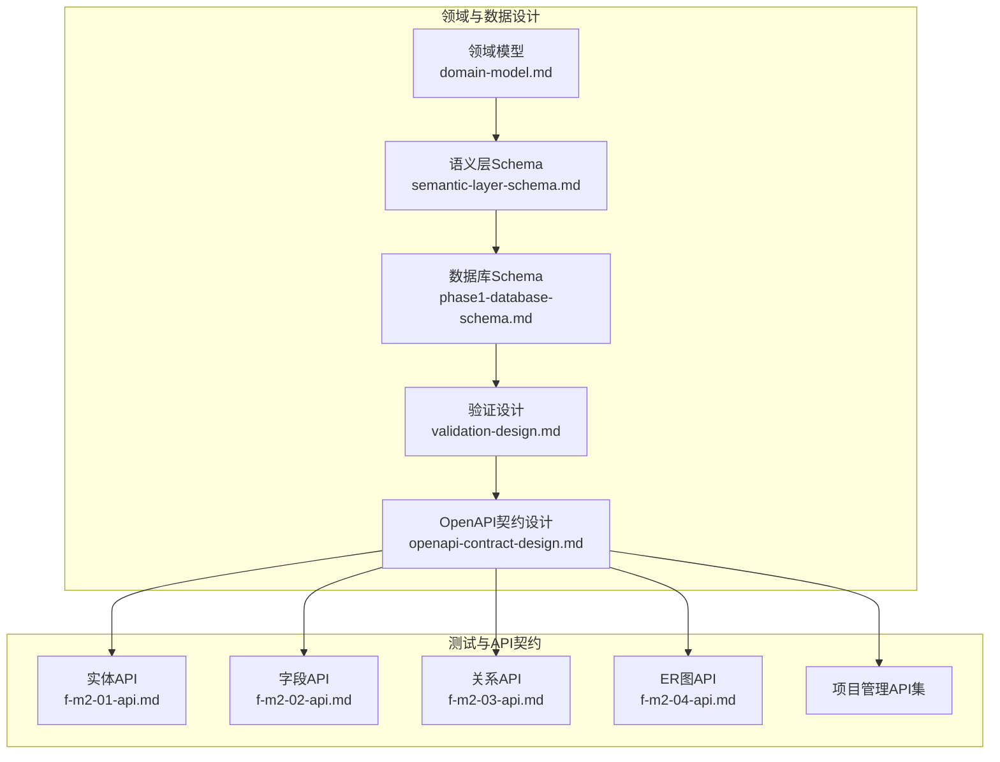
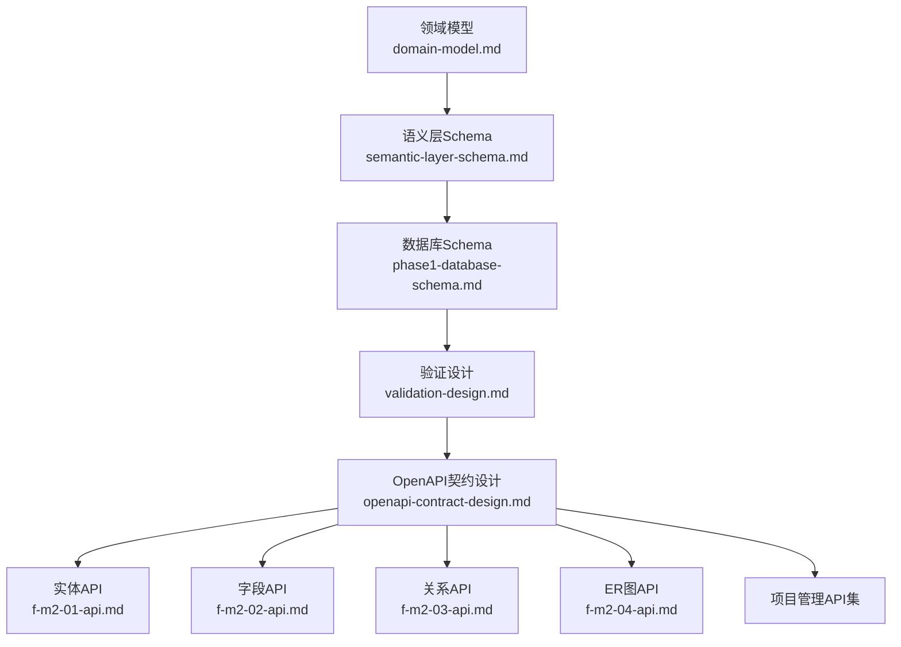
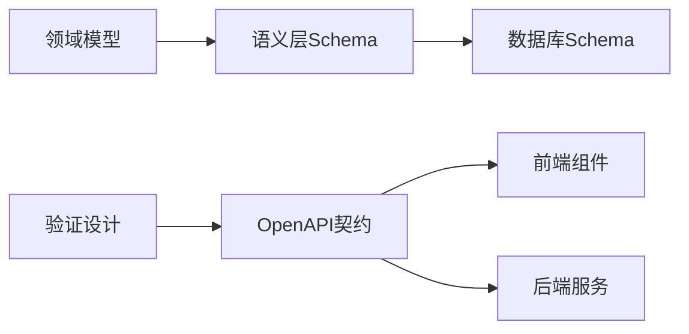

# 数据模型设计

<cite>
**本文引用的文件**
- [domain-model.md](file://docs/02-domain-model/domain-model.md)
- [semantic-layer-schema.md](file://docs/02-domain-model/semantic-layer-schema.md)
- [phase1-database-schema.md](file://docs/05-data-design/phase1-database-schema.md)
- [validation-design.md](file://docs/04-tech-design/validation-design.md)
- [openapi-contract-design.md](file://docs/04-tech-design/openapi-contract-design.md)
- [f-m2-01-api.md](file://docs/06-test-design/modules/domain-model/f-m2-01-entity/f-m2-01-api.md)
- [f-m2-02-api.md](file://docs/06-test-design/modules/domain-model/f-m2-02-field/f-m2-02-api.md)
- [f-m2-03-api.md](file://docs/06-test-design/modules/domain-model/f-m2-03-relation/f-m2-03-api.md)
- [f-m2-04-api.md](file://docs/06-test-design/modules/domain-model/f-m2-04-er-graph/f-m2-04-api.md)
- [f-m1-02-api.md](file://docs/06-test-design/modules/project-management/f-m1-02-create-project/f-m1-02-api.md)
- [f-m1-03-api.md](file://docs/06-test-design/modules/project-management/f-m1-03-project-detail/f-m-m1-03-api.md)
- [f-m1-04-api.md](file://docs/06-test-design/modules/project-management/f-m1-04-edit-project/f-m1-04-api.md)
- [f-m1-05-api.md](file://docs/06-test-design/modules/project-management/f-m1-05-archive/f-m1-05-api.md)
- [f-m1-06-api.md](file://docs/06-test-design/modules/project-management/f-m1-06-company/f-m1-06-api.md)
- [f-m1-07-api.md](file://docs/06-test-design/modules/project-management/f-m1-07-department/f-m1-07-api.md)
- [f-m1-08-api.md](file://docs/06-test-design/modules/project-management/f-m1-08-role/f-m1-08-api.md)
- [f-m1-09-api.md](file://docs/06-test-design/modules/project-management/f-m1-09-external-entity/f-m1-09-api.md)
- [f-m1-12-api.md](file://docs/06-test-design/modules/project-management/f-m1-12-role-behavior/f-m1-12-api.md)
- [f-m1-13-api.md](file://docs/06-test-design/modules/project-management/f-m1-13-external-entity-behavior/f-m1-13-api.md)
</cite>

## 目录
1. [引言](#引言)
2. [项目结构](#项目结构)
3. [核心组件](#核心组件)
4. [架构总览](#架构总览)
5. [详细组件分析](#详细组件分析)
6. [依赖分析](#依赖分析)
7. [性能考虑](#性能考虑)
8. [故障排查指南](#故障排查指南)
9. [结论](#结论)
10. [附录](#附录)

## 引言
本文件面向AI原型管理系统，系统性梳理数据模型设计，基于领域驱动设计（DDD）方法论，明确实体、值对象、聚合根的边界与协作；围绕核心业务实体（如Project、DomainEntity、EntityField、EntityRelation等）给出字段定义与业务规则；阐明实体关系建模（一对一、一对多、多对多）的设计与实现；总结数据验证规则与约束条件；解释版本控制与演进策略；并说明数据模型与前端组件及API契约的映射关系。

## 项目结构
本项目采用“文档驱动”的设计方式，数据模型与技术契约主要沉淀在docs目录中，涵盖领域模型、语义层Schema、数据库设计、验证设计与OpenAPI契约设计等模块。测试设计模块进一步以API契约形式固化了各功能域的数据交互规范。

**图表来源**
- [domain-model.md](file://docs/02-domain-model/domain-model.md)
- [semantic-layer-schema.md](file://docs/02-domain-model/semantic-layer-schema.md)
- [phase1-database-schema.md](file://docs/05-data-design/phase1-database-schema.md)
- [validation-design.md](file://docs/04-tech-design/validation-design.md)
- [openapi-contract-design.md](file://docs/04-tech-design/openapi-contract-design.md)
- [f-m2-01-api.md](file://docs/06-test-design/modules/domain-model/f-m2-01-entity/f-m2-01-api.md)
- [f-m2-02-api.md](file://docs/06-test-design/modules/domain-model/f-m2-02-field/f-m2-02-api.md)
- [f-m2-03-api.md](file://docs/06-test-design/modules/domain-model/f-m2-03-relation/f-m2-03-api.md)
- [f-m2-04-api.md](file://docs/06-test-design/modules/domain-model/f-m2-04-er-graph/f-m2-04-api.md)

**章节来源**
- [domain-model.md](file://docs/02-domain-model/domain-model.md)
- [semantic-layer-schema.md](file://docs/02-domain-model/semantic-layer-schema.md)
- [phase1-database-schema.md](file://docs/05-data-design/phase1-database-schema.md)
- [validation-design.md](file://docs/04-tech-design/validation-design.md)
- [openapi-contract-design.md](file://docs/04-tech-design/openapi-contract-design.md)

## 核心组件
本节从领域驱动视角，定义核心业务实体、值对象与聚合根，并给出其职责与边界。

- 聚合根（Aggregate Root）
  - Project：项目聚合根，承载项目生命周期、上下文信息与关联资源的统一入口。
  - DomainEntity：领域实体聚合根，封装实体元数据、字段集合与关系拓扑。
  - EntityField：实体字段聚合根，负责字段定义、类型与校验规则。
  - EntityRelation：实体关系聚合根，负责实体间关系的建模与一致性约束。

- 实体（Entity）
  - 由聚合根派生的子实体或关联实体，用于表达业务对象的唯一标识与状态变化。

- 值对象（Value Object）
  - 描述不可变的业务属性，如枚举型状态、坐标位置、时间区间等，强调“相等性”基于属性而非标识。

- 领域服务（Domain Service）
  - 跨聚合的业务编排与规则执行，如实体关系一致性校验、字段类型转换与验证。

- 基础设施与接口
  - OpenAPI契约定义数据契约与交互协议，确保前后端一致的字段与约束。
  - 验证设计文档定义字段级与业务级校验规则，保障数据质量。

**章节来源**
- [domain-model.md](file://docs/02-domain-model/domain-model.md)
- [validation-design.md](file://docs/04-tech-design/validation-design.md)
- [openapi-contract-design.md](file://docs/04-tech-design/openapi-contract-design.md)

## 架构总览
数据模型与技术契约协同工作，形成“领域模型→语义层Schema→数据库Schema→验证设计→OpenAPI契约→API测试契约”的闭环。

**图表来源**
- [domain-model.md](file://docs/02-domain-model/domain-model.md)
- [semantic-layer-schema.md](file://docs/02-domain-model/semantic-layer-schema.md)
- [phase1-database-schema.md](file://docs/05-data-design/phase1-database-schema.md)
- [validation-design.md](file://docs/04-tech-design/validation-design.md)
- [openapi-contract-design.md](file://docs/04-tech-design/openapi-contract-design.md)
- [f-m2-01-api.md](file://docs/06-test-design/modules/domain-model/f-m2-01-entity/f-m2-01-api.md)
- [f-m2-02-api.md](file://docs/06-test-design/modules/domain-model/f-m2-02-field/f-m2-02-api.md)
- [f-m2-03-api.md](file://docs/06-test-design/modules/domain-model/f-m2-03-relation/f-m2-03-api.md)
- [f-m2-04-api.md](file://docs/06-test-design/modules/domain-model/f-m2-04-er-graph/f-m2-04-api.md)

## 详细组件分析

### Project（项目聚合根）
- 职责
  - 管理项目上下文、生命周期状态与资源边界。
  - 作为领域实体、字段、关系的容器聚合根，协调跨实体的一致性。
- 关键字段（示例）
  - 项目标识、名称、描述、状态、创建者、所属组织/部门、创建时间、更新时间等。
- 业务规则
  - 状态流转规则（草稿→进行中→归档等）。
  - 组织/部门维度的访问控制与可见性。
  - 与DomainEntity的“一对多”关系，删除保护与级联处理策略。
- 与前端映射
  - 列表页：分页、筛选、排序字段。
  - 详情页：基础信息、统计信息、关联实体概览。
  - 编辑页：字段校验、权限校验、保存/发布流程。
- API契约要点
  - 创建/编辑/归档接口的请求体字段、响应体字段与状态码。
  - 错误码与错误消息的标准化。

**章节来源**
- [domain-model.md](file://docs/02-domain-model/domain-model.md)
- [f-m1-02-api.md](file://docs/06-test-design/modules/project-management/f-m1-02-create-project/f-m1-02-api.md)
- [f-m1-03-api.md](file://docs/06-test-design/modules/project-management/f-m1-03-project-detail/f-m-m1-03-api.md)
- [f-m1-04-api.md](file://docs/06-test-design/modules/project-management/f-m1-04-edit-project/f-m1-04-api.md)
- [f-m1-05-api.md](file://docs/06-test-design/modules/project-management/f-m1-05-archive/f-m1-05-api.md)

### DomainEntity（领域实体聚合根）
- 职责
  - 封装实体元数据（名称、标签、描述、分类等）。
  - 维护与EntityField的“一对多”关系，保证字段集合的完整性与一致性。
  - 维护与EntityRelation的“一对多”关系，支撑实体间拓扑。
- 关键字段（示例）
  - 实体标识、所属项目、名称、标签、描述、分类、创建/更新信息等。
- 业务规则
  - 同一项目内实体名称唯一性。
  - 字段集合与关系集合的原子性变更。
  - 删除时的依赖检查与保护策略。
- 与前端映射
  - 实体列表、实体详情、字段与关系视图联动。
  - 拓扑图渲染与交互（ER图）。
- API契约要点
  - 实体增删改查、批量导入导出、拓扑查询等接口的数据契约。

**章节来源**
- [domain-model.md](file://docs/02-domain-model/domain-model.md)
- [semantic-layer-schema.md](file://docs/02-domain-model/semantic-layer-schema.md)
- [f-m2-01-api.md](file://docs/06-test-design/modules/domain-model/f-m2-01-entity/f-m2-01-api.md)

### EntityField（实体字段聚合根）
- 职责
  - 定义字段的元信息（名称、显示名、类型、是否必填、默认值等）。
  - 承载字段级别的校验规则（类型、长度、取值范围、格式等）。
- 关键字段（示例）
  - 字段标识、所属实体、名称、显示名、类型、是否必填、默认值、描述、排序等。
- 业务规则
  - 同一实体内字段名称唯一。
  - 类型与校验规则的组合有效性。
  - 必填字段在实体实例化时的强制校验。
- 与前端映射
  - 字段配置面板、字段类型选择器、校验规则编辑器。
  - 表单渲染与实时校验。
- API契约要点
  - 字段创建/更新/删除、批量导入、校验规则查询等接口。

**章节来源**
- [domain-model.md](file://docs/02-domain-model/domain-model.md)
- [semantic-layer-schema.md](file://docs/02-domain-model/semantic-layer-schema.md)
- [f-m2-02-api.md](file://docs/06-test-design/modules/domain-model/f-m2-02-field/f-m2-02-api.md)

### EntityRelation（实体关系聚合根）
- 职责
  - 建模实体间的关联关系（一对一、一对多、多对多）。
  - 维护关系方向、基数、约束与一致性规则。
- 关键字段（示例）
  - 关系标识、来源实体、目标实体、关系名称、关系类型、基数约束、方向性、描述等。
- 业务规则
  - 关系类型的合法性与方向一致性。
  - 多对多关系需引入中间实体或映射表，保证可查询性与可维护性。
  - 删除实体时的关系清理策略（RESTRICT/CASCADE/SET NULL）。
- 与前端映射
  - ER图编辑器、关系连线、关系属性面板。
  - 图形布局与冲突检测。
- API契约要点
  - 关系创建/更新/删除、ER图查询、关系一致性校验等接口。

**章节来源**
- [domain-model.md](file://docs/02-domain-model/domain-model.md)
- [semantic-layer-schema.md](file://docs/02-domain-model/semantic-layer-schema.md)
- [f-m2-03-api.md](file://docs/06-test-design/modules/domain-model/f-m2-03-relation/f-m2-03-api.md)
- [f-m2-04-api.md](file://docs/06-test-design/modules/domain-model/f-m2-04-er-graph/f-m2-04-api.md)

### 项目管理相关实体（Company/Department/Role/ExternalEntity/RoleBehavior/ExternalEntityBehavior）
- 职责
  - 支撑项目的组织与角色维度，提供访问控制与行为授权的基础数据。
- 关键字段（示例）
  - Company：公司标识、名称、编码、层级、状态等。
  - Department：部门标识、上级部门、名称、编码、状态等。
  - Role：角色标识、名称、编码、权限矩阵、状态等。
  - ExternalEntity/ExternalEntityBehavior：外部实体与行为的映射与约束。
- 业务规则
  - 层级结构的完整性与环路检测。
  - 角色与行为的权限矩阵校验。
  - 与Project的关联与隔离。
- API契约要点
  - 公司、部门、角色、外部实体及其行为的增删改查与权限校验接口。

**章节来源**
- [f-m1-06-api.md](file://docs/06-test-design/modules/project-management/f-m1-06-company/f-m1-06-api.md)
- [f-m1-07-api.md](file://docs/06-test-design/modules/project-management/f-m1-07-department/f-m1-07-api.md)
- [f-m1-08-api.md](file://docs/06-test-design/modules/project-management/f-m1-08-role/f-m1-08-api.md)
- [f-m1-09-api.md](file://docs/06-test-design/modules/project-management/f-m1-09-external-entity/f-m1-09-api.md)
- [f-m1-12-api.md](file://docs/06-test-design/modules/project-management/f-m1-12-role-behavior/f-m1-12-api.md)
- [f-m1-13-api.md](file://docs/06-test-design/modules/project-management/f-m1-13-external-entity-behavior/f-m1-13-api.md)

## 依赖分析
- 领域模型到数据库Schema的映射
  - 领域模型中的聚合根与实体通过语义层Schema映射为数据库表结构，值对象拆分为标量字段或嵌套JSON。
- 验证设计到API契约的约束
  - 验证规则在API契约中以字段级校验与业务规则的形式体现，前端按契约进行本地校验与错误提示。
- API契约到前端组件的映射
  - 契约定义字段、类型、必填与约束，前端组件按契约渲染与交互。

**图表来源**
- [domain-model.md](file://docs/02-domain-model/domain-model.md)
- [semantic-layer-schema.md](file://docs/02-domain-model/semantic-layer-schema.md)
- [phase1-database-schema.md](file://docs/05-data-design/phase1-database-schema.md)
- [validation-design.md](file://docs/04-tech-design/validation-design.md)
- [openapi-contract-design.md](file://docs/04-tech-design/openapi-contract-design.md)

**章节来源**
- [domain-model.md](file://docs/02-domain-model/domain-model.md)
- [semantic-layer-schema.md](file://docs/02-domain-model/semantic-layer-schema.md)
- [phase1-database-schema.md](file://docs/05-data-design/phase1-database-schema.md)
- [validation-design.md](file://docs/04-tech-design/validation-design.md)
- [openapi-contract-design.md](file://docs/04-tech-design/openapi-contract-design.md)

## 性能考虑
- 查询性能
  - 对Project、DomainEntity、EntityField、EntityRelation建立必要的索引，覆盖常用过滤字段（如项目ID、实体ID、字段名称等）。
  - ER图查询应支持分页与懒加载，避免一次性拉取全量关系。
- 写入性能
  - 批量导入/导出采用事务与分批写入，减少锁竞争。
  - 关系变更采用幂等操作与冲突检测，避免重复写入。
- 缓存策略
  - 常用字典类数据（如枚举、类型定义）可缓存于Redis，降低数据库压力。
- 版本与迁移
  - 使用版本化的Schema与迁移脚本，确保向后兼容与平滑升级。

## 故障排查指南
- 常见问题
  - 字段类型不匹配：检查验证设计与API契约中的类型定义是否一致。
  - 必填字段缺失：确认前端表单校验与后端校验规则一致。
  - 关系循环或非法：在ER图编辑时启用环路检测与基数校验。
  - 权限不足：核对角色与行为矩阵，确保调用方具备相应权限。
- 排查步骤
  - 核对API契约与前端组件字段映射。
  - 查看后端日志与数据库约束错误。
  - 使用测试用例复现问题，定位具体字段与规则。

**章节来源**
- [validation-design.md](file://docs/04-tech-design/validation-design.md)
- [openapi-contract-design.md](file://docs/04-tech-design/openapi-contract-design.md)

## 结论
本数据模型设计以领域驱动为核心，通过清晰的聚合根边界、值对象与领域服务，结合严格的验证设计与OpenAPI契约，实现了从概念到实现的完整闭环。建议在后续迭代中持续完善ER图与字段校验规则，强化版本迁移与兼容策略，并加强前端与后端的契约一致性治理。

## 附录
- 数据模型与API契约映射清单
  - Project：创建/编辑/详情/归档接口
  - DomainEntity：实体增删改查、拓扑查询
  - EntityField：字段增删改查、批量导入
  - EntityRelation：关系增删改查、ER图查询
  - 组织与角色：公司/部门/角色/外部实体及其行为

**章节来源**
- [f-m1-02-api.md](file://docs/06-test-design/modules/project-management/f-m1-02-create-project/f-m1-02-api.md)
- [f-m1-03-api.md](file://docs/06-test-design/modules/project-management/f-m1-03-project-detail/f-m-m1-03-api.md)
- [f-m1-04-api.md](file://docs/06-test-design/modules/project-management/f-m1-04-edit-project/f-m1-04-api.md)
- [f-m1-05-api.md](file://docs/06-test-design/modules/project-management/f-m1-05-archive/f-m1-05-api.md)
- [f-m2-01-api.md](file://docs/06-test-design/modules/domain-model/f-m2-01-entity/f-m2-01-api.md)
- [f-m2-02-api.md](file://docs/06-test-design/modules/domain-model/f-m2-02-field/f-m2-02-api.md)
- [f-m2-03-api.md](file://docs/06-test-design/modules/domain-model/f-m2-03-relation/f-m2-03-api.md)
- [f-m2-04-api.md](file://docs/06-test-design/modules/domain-model/f-m2-04-er-graph/f-m2-04-api.md)
- [f-m1-06-api.md](file://docs/06-test-design/modules/project-management/f-m1-06-company/f-m1-06-api.md)
- [f-m1-07-api.md](file://docs/06-test-design/modules/project-management/f-m1-07-department/f-m1-07-api.md)
- [f-m1-08-api.md](file://docs/06-test-design/modules/project-management/f-m1-08-role/f-m1-08-api.md)
- [f-m1-09-api.md](file://docs/06-test-design/modules/project-management/f-m1-09-external-entity/f-m1-09-api.md)
- [f-m1-12-api.md](file://docs/06-test-design/modules/project-management/f-m1-12-role-behavior/f-m1-12-api.md)
- [f-m1-13-api.md](file://docs/06-test-design/modules/project-management/f-m1-13-external-entity-behavior/f-m1-13-api.md)