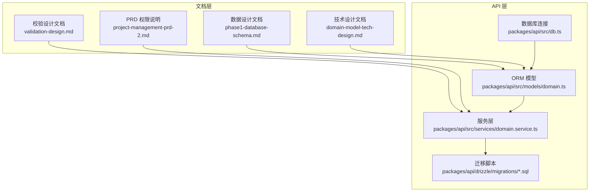
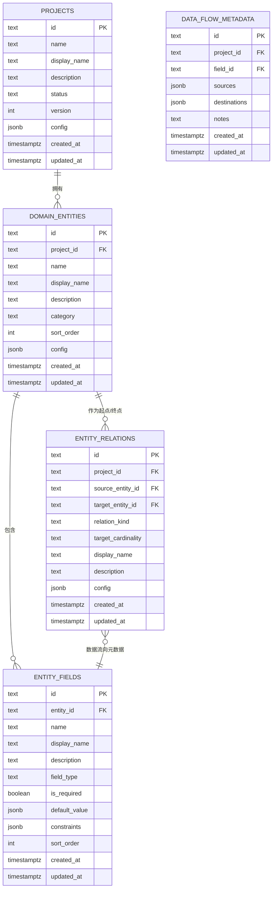
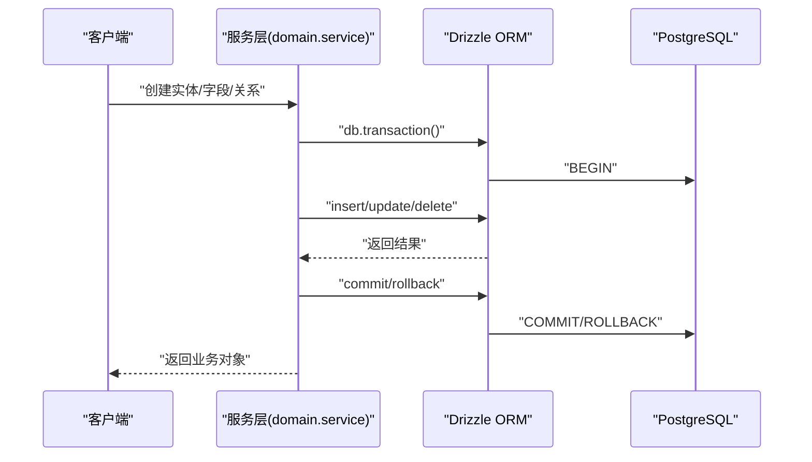
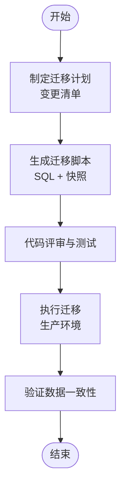
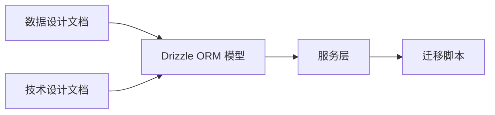
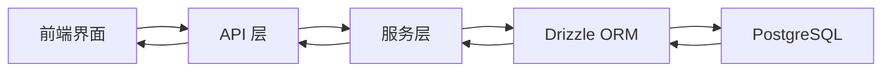

# 数据设计

<cite>
**本文引用的文件**
- [phase1-database-schema.md](file://docs/05-data-design/phase1-database-schema.md)
- [domain-model-tech-design.md](file://docs/04-tech-design/domain-model-tech-design.md)
- [coding-convention-backend.md](file://docs/04-tech-design/coding-convention-backend.md)
- [validation-design.md](file://docs/04-tech-design/validation-design.md)
- [app-shared-resources.md](file://docs/02-domain-model/app-shared-resources.md)
- [project-management-prd-2.md](file://docs/03-prd-ux/modules/project-management/project-management-prd-2.md)
- [f-m1-05-api.md](file://docs/06-test-design/modules/project-management/f-m1-05-archive/f-m1-05-api.md)
- [db.ts](file://packages/api/src/db.ts)
- [domain.service.ts](file://packages/api/src/services/domain.service.ts)
- [project.service.ts](file://packages/api/src/services/project.service.ts)
- [domain.ts](file://packages/api/src/models/domain.ts)
- [schema.ts](file://packages/api/src/models/schema.ts)
- [migrate-cardinality.ts](file://packages/api/src/db/migrate-cardinality.ts)
- [0000_init_projects_table.sql](file://packages/api/drizzle/migrations/0000_init_projects_table.sql)
- [0004_add_domain_entities_config.sql](file://packages/api/drizzle/migrations/0004_add_domain_entities_config.sql)
- [0006_mean_rachel_grey.sql](file://packages/api/drizzle/migrations/0006_mean_rachel_grey.sql)
</cite>

## 目录
1. [简介](#简介)
2. [项目结构](#项目结构)
3. [核心组件](#核心组件)
4. [架构总览](#架构总览)
5. [详细组件分析](#详细组件分析)
6. [依赖分析](#依赖分析)
7. [性能考虑](#性能考虑)
8. [故障排查指南](#故障排查指南)
9. [结论](#结论)
10. [附录](#附录)

## 简介
本文件面向“AI原型管理系统”的数据设计，围绕数据库架构、数据模型、数据访问层、迁移与版本控制、数据安全、备份恢复与性能监控等维度进行系统化梳理，并给出数据字典、ER 图与数据流图，帮助开发者与产品、测试团队建立统一的数据语言与协作契约。

## 项目结构
- 数据设计文档位于 docs/05-data-design/phase1-database-schema.md，定义了领域模型相关的核心表结构与约束。
- 技术设计文档位于 docs/04-tech-design/domain-model-tech-design.md，补充了 Drizzle ORM 的表定义、事务规范与字段约束校验。
- API 层位于 packages/api，包含数据库连接、ORM 模型、服务层与迁移脚本。
- 测试设计文档位于 docs/06-test-design，提供了与数据状态变更（如归档/恢复）相关的断言与回归保障。

图表来源
- [phase1-database-schema.md](file://docs/05-data-design/phase1-database-schema.md)
- [domain-model-tech-design.md](file://docs/04-tech-design/domain-model-tech-design.md)
- [validation-design.md](file://docs/04-tech-design/validation-design.md)
- [project-management-prd-2.md](file://docs/03-prd-ux/modules/project-management/project-management-prd-2.md)
- [db.ts](file://packages/api/src/db.ts)
- [domain.ts](file://packages/api/src/models/domain.ts)
- [domain.service.ts](file://packages/api/src/services/domain.service.ts)

章节来源
- [phase1-database-schema.md](file://docs/05-data-design/phase1-database-schema.md)
- [domain-model-tech-design.md](file://docs/04-tech-design/domain-model-tech-design.md)
- [db.ts](file://packages/api/src/db.ts)

## 核心组件
- 数据库架构与表结构：以领域模型为核心，包含实体、字段、关系与数据流向元数据四张表，辅以项目表与组织相关表。
- 数据模型与约束：通过 Drizzle ORM 的 pgTable 定义字段类型、外键、唯一索引与检查约束；字段类型体系来自共享资源文档。
- 数据访问层：基于 Drizzle ORM 的查询、事务与迁移；服务层负责数据映射与业务规则。
- 迁移与版本控制：Drizzle 自带迁移工具链，配合快照与 SQL 脚本管理演进。
- 数据安全：最小可行权限模型（PM/Developer/Teser），结合前端路由与后端鉴权策略；数据加密与审计日志在后续阶段规划。
- 性能与监控：索引策略、查询优化与事务规范；监控指标与告警在后续阶段规划。

章节来源
- [phase1-database-schema.md](file://docs/05-data-design/phase1-database-schema.md)
- [domain-model-tech-design.md](file://docs/04-tech-design/domain-model-tech-design.md)
- [app-shared-resources.md](file://docs/02-domain-model/app-shared-resources.md)
- [coding-convention-backend.md](file://docs/04-tech-design/coding-convention-backend.md)
- [project-management-prd-2.md](file://docs/03-prd-ux/modules/project-management/project-management-prd-2.md)

## 架构总览
系统采用“文档驱动 + ORM + 迁移”的数据架构：先在文档中确定表结构与约束，再在 Drizzle ORM 中落地，最后通过迁移脚本固化版本。

图表来源
- [phase1-database-schema.md](file://docs/05-data-design/phase1-database-schema.md)
- [domain.ts](file://packages/api/src/models/domain.ts)

## 详细组件分析

### 表结构与索引策略
- 项目表（projects）：包含状态与版本号，支持归档/恢复与并发更新的乐观锁语义。
- 领域实体表（domain_entities）：按项目维度隔离，支持分类与排序，节点位置持久化在 config 中。
- 实体字段表（entity_fields）：字段类型与约束以 JSONB 存储，支持复杂校验规则。
- 实体关系表（entity_relations）：单向关系模型，支持依赖/聚合/组合三类性质，目标基数采用数学区间表示法。
- 数据流向元数据表（data_flow_metadata）：自动推导来源与目的地，保留人工备注。

索引策略
- 实体关系表对 project_id 建有索引，便于按项目检索。
- 多列唯一索引确保实体名称在项目内唯一、关系记录在（项目+源+目标+关系类型）上唯一。

章节来源
- [phase1-database-schema.md](file://docs/05-data-design/phase1-database-schema.md)
- [domain.ts](file://packages/api/src/models/domain.ts)

### 字段类型体系与约束规则
字段类型体系覆盖原始类型、枚举/选择、结构化类型与引用类型，每类支持不同约束：
- 原始类型：字符串、长文本、整数、浮点数、布尔、日期/时间/时间。
- 枚举与选择：单选/多选枚举及其选择数量约束。
- 结构化类型：数组、对象、自由 JSON，支持嵌套 schema。
- 引用类型：单实体引用与多态引用，支持必填与目标类型字段。

约束规则
- 字段名称需满足标识符规范；显示名长度限制；描述长度限制。
- 字段类型与约束在服务层通过 TypeBox/AJV 校验，运行时按字段类型二次校验。

章节来源
- [app-shared-resources.md](file://docs/02-domain-model/app-shared-resources.md)
- [validation-design.md](file://docs/04-tech-design/validation-design.md)
- [domain-model-tech-design.md](file://docs/04-tech-design/domain-model-tech-design.md)

### 数据访问层设计（Drizzle ORM）
- 连接与迁移
  - 数据库连接通过环境变量 DATABASE_URL 初始化，Drizzle 与 postgres-js 配合使用。
  - 迁移使用独立连接（prepare=false）避免缓存干扰。
- 查询与映射
  - 服务层将 Drizzle 行映射为业务对象，统一时间字段为 ISO 字符串。
  - 关系查询通过 JOIN 获取实体名称与展示名，便于 UI 呈现。
- 事务管理
  - 多表写操作必须使用事务，异常自动回滚；只读查询无需事务。
  - 嵌套事务由 Drizzle 自动处理保存点。

图表来源
- [db.ts](file://packages/api/src/db.ts)
- [domain.service.ts](file://packages/api/src/services/domain.service.ts)
- [coding-convention-backend.md](file://docs/04-tech-design/coding-convention-backend.md)

章节来源
- [db.ts](file://packages/api/src/db.ts)
- [domain.service.ts](file://packages/api/src/services/domain.service.ts)
- [coding-convention-backend.md](file://docs/04-tech-design/coding-convention-backend.md)

### 数据迁移策略与版本控制
- 迁移工具链：Drizzle 提供迁移命令与快照管理，SQL 脚本与快照共同维护演进历史。
- 迁移脚本示例：
  - 初始化项目表：创建项目表与基础列。
  - 增量迁移：如为领域实体增加 config 字段，或调整基数表示法。
- 版本控制：每次变更生成新快照与 SQL 文件，确保可回溯与可重复部署。

图表来源
- [0000_init_projects_table.sql](file://packages/api/drizzle/migrations/0000_init_projects_table.sql)
- [0004_add_domain_entities_config.sql](file://packages/api/drizzle/migrations/0004_add_domain_entities_config.sql)
- [0006_mean_rachel_grey.sql](file://packages/api/drizzle/migrations/0006_mean_rachel_grey.sql)

章节来源
- [0000_init_projects_table.sql](file://packages/api/drizzle/migrations/0000_init_projects_table.sql)
- [0004_add_domain_entities_config.sql](file://packages/api/drizzle/migrations/0004_add_domain_entities_config.sql)
- [0006_mean_rachel_grey.sql](file://packages/api/drizzle/migrations/0006_mean_rachel_grey.sql)

### 数据安全设计
- 最小可行权限模型（Phase 1）：PM（全权）、Developer/Taster（只读），用于隔离不同角色的操作边界。
- 建议扩展：RBAC 权限矩阵、资源级授权、审计日志（操作人、时间、对象、变更前/后）。
- 数据加密：敏感字段（如联系信息）建议启用传输加密与静态加密（后续阶段）。

章节来源
- [project-management-prd-2.md](file://docs/03-prd-ux/modules/project-management/project-management-prd-2.md)

### 数据备份与恢复策略
- 备份：定期逻辑备份（pg_dump）与物理备份（文件系统层面）结合。
- 恢复：按迁移历史回放 SQL 脚本，结合快照进行点对点恢复。
- 验证：恢复后执行关键查询与一致性校验（如唯一约束、外键关系）。

章节来源
- [phase1-database-schema.md](file://docs/05-data-design/phase1-database-schema.md)

### 性能监控方案
- 指标：慢查询统计、连接池利用率、索引使用率、事务冲突率。
- 监控：结合数据库内置视图与 APM 工具，设置阈值告警。
- 优化：根据查询计划调整索引、拆分热点表、减少 N+1 查询。

章节来源
- [domain-model-tech-design.md](file://docs/04-tech-design/domain-model-tech-design.md)

## 依赖分析
- 文档到模型：数据设计文档定义表结构，技术设计文档补充 ORM 映射与校验规则。
- 模型到服务：ORM 模型提供类型安全的查询接口，服务层负责业务映射与事务控制。
- 服务到迁移：迁移脚本承载模型演进，确保生产环境一致性。

图表来源
- [phase1-database-schema.md](file://docs/05-data-design/phase1-database-schema.md)
- [domain-model-tech-design.md](file://docs/04-tech-design/domain-model-tech-design.md)
- [domain.ts](file://packages/api/src/models/domain.ts)
- [domain.service.ts](file://packages/api/src/services/domain.service.ts)

章节来源
- [phase1-database-schema.md](file://docs/05-data-design/phase1-database-schema.md)
- [domain-model-tech-design.md](file://docs/04-tech-design/domain-model-tech-design.md)
- [domain.ts](file://packages/api/src/models/domain.ts)
- [domain.service.ts](file://packages/api/src/services/domain.service.ts)

## 性能考虑
- 查询优化
  - 为高频过滤字段（如项目 ID、实体名称）建立索引。
  - 避免 SELECT *，按需投影字段。
  - 使用 LIMIT 与分页，避免一次性拉取大量数据。
- 事务管理
  - 多表写操作使用事务，减少中间态数据。
  - 控制事务粒度，避免长时间持有锁。
- 连接与缓存
  - 合理配置连接池大小，避免过度连接。
  - 对只读查询使用只读连接，减轻主库压力。

章节来源
- [coding-convention-backend.md](file://docs/04-tech-design/coding-convention-backend.md)
- [domain-model-tech-design.md](file://docs/04-tech-design/domain-model-tech-design.md)

## 故障排查指南
- 事务异常
  - 现象：多表写入后出现部分成功。
  - 排查：确认是否使用事务；检查异常抛出路径；核对唯一约束冲突。
- 数据一致性
  - 现象：关系记录缺失或重复。
  - 排查：核对唯一索引（项目+源+目标+关系类型）；检查外键约束；验证迁移脚本是否完整应用。
- 权限问题
  - 现象：只读角色无法写入。
  - 排查：核对最小可行权限模型；确认前端路由与后端鉴权策略。

章节来源
- [coding-convention-backend.md](file://docs/04-tech-design/coding-convention-backend.md)
- [f-m1-05-api.md](file://docs/06-test-design/modules/project-management/f-m1-05-archive/f-m1-05-api.md)
- [project-management-prd-2.md](file://docs/03-prd-ux/modules/project-management/project-management-prd-2.md)

## 结论
本数据设计以“文档先行、ORM 落地、迁移固化”为核心路径，围绕领域模型构建了清晰的表结构与约束，并通过事务与校验保障数据一致性。建议在后续阶段完善权限、审计与监控体系，持续迭代数据模型以适配业务演进。

## 附录

### 数据字典
- 项目表（projects）
  - 字段：id、name、display_name、description、status、version、config、created_at、updated_at
  - 约束：status 与 version 支持状态机与乐观锁；config 为 JSONB 扩展字段
- 领域实体表（domain_entities）
  - 字段：id、project_id、name、display_name、description、category、sort_order、config、created_at、updated_at
  - 约束：项目内实体名称唯一；config 存储画布位置等
- 实体字段表（entity_fields）
  - 字段：id、entity_id、name、display_name、description、field_type、is_required、default_value、constraints、sort_order、created_at、updated_at
  - 约束：字段类型与约束以 JSONB 存储；名称唯一性在实体维度内保证
- 实体关系表（entity_relations）
  - 字段：id、project_id、source_entity_id、target_entity_id、relation_kind、target_cardinality、display_name、description、config、created_at、updated_at
  - 约束：关系性质为依赖/聚合/组合；目标基数采用区间表示法；唯一索引防止重复关系
- 数据流向元数据表（data_flow_metadata）
  - 字段：id、project_id、field_id、sources、destinations、notes、created_at、updated_at
  - 约束：唯一索引保证每个字段仅有一条流向记录

章节来源
- [phase1-database-schema.md](file://docs/05-data-design/phase1-database-schema.md)
- [domain.ts](file://packages/api/src/models/domain.ts)

### 数据流图（概念示意）

图表来源
- [domain.service.ts](file://packages/api/src/services/domain.service.ts)
- [db.ts](file://packages/api/src/db.ts)