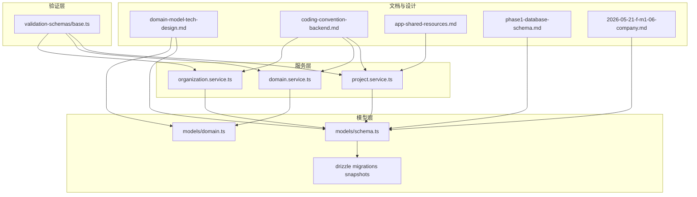
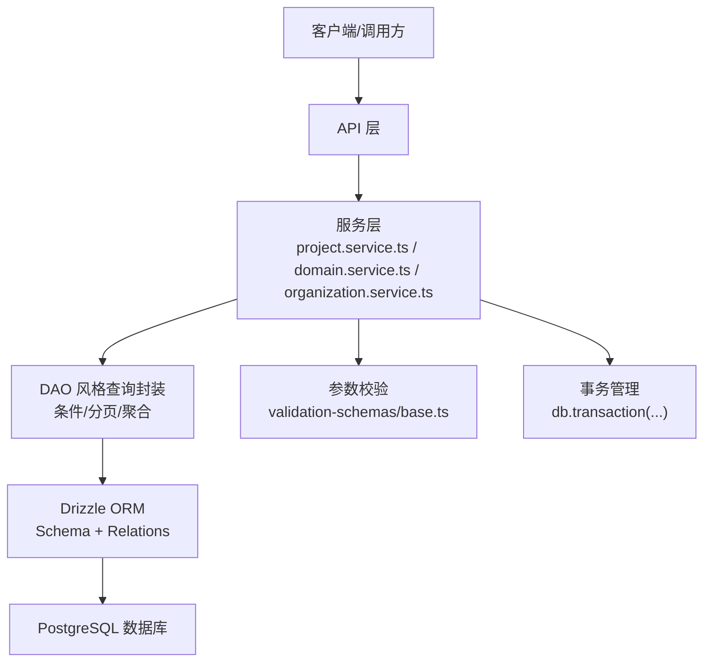
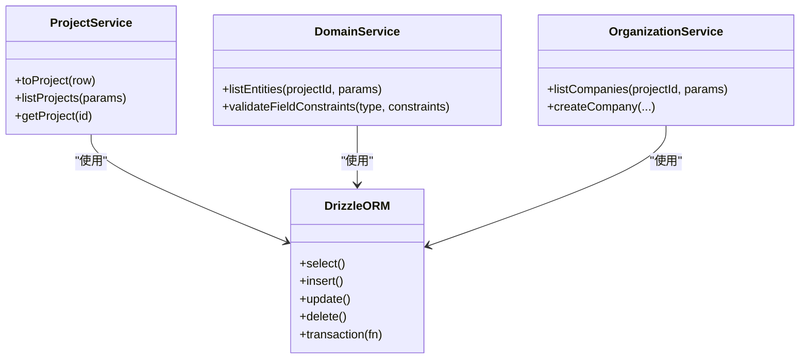
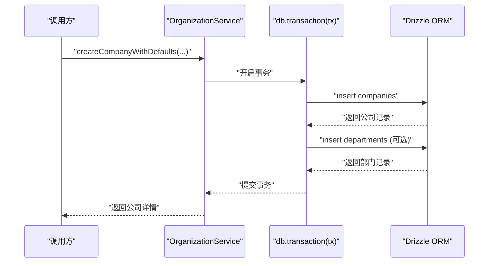
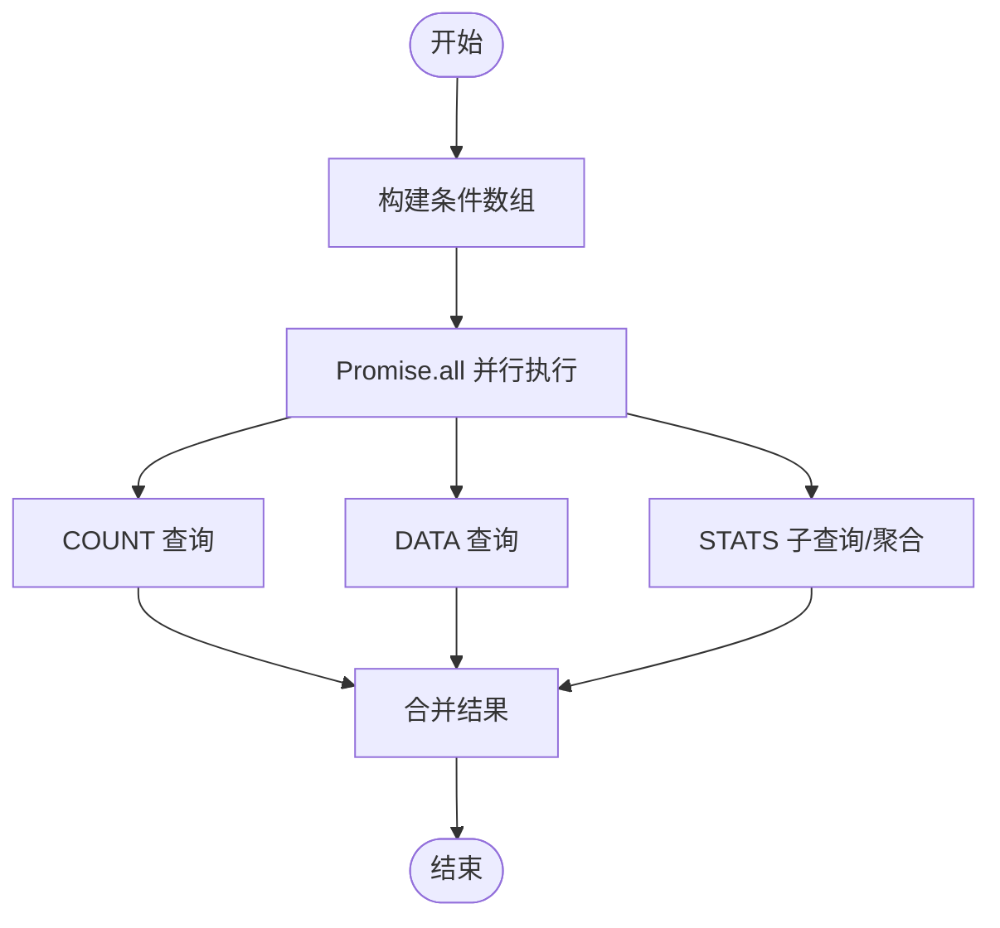
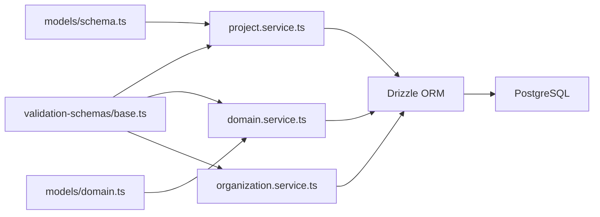

# 数据访问层设计

<cite>
**本文引用的文件**
- [domain-model-tech-design.md](file://docs/04-tech-design/domain-model-tech-design.md)
- [coding-convention-backend.md](file://docs/04-tech-design/coding-convention-backend.md)
- [app-shared-resources.md](file://docs/02-domain-model/app-shared-resources.md)
- [phase1-database-schema.md](file://docs/05-data-design/phase1-database-schema.md)
- [2026-05-21-f-m1-06-company.md](file://docs/superpowers/plans/2026-05-21-f-m1-06-company.md)
- [project.service.ts](file://packages/api/src/services/project.service.ts)
- [domain.service.ts](file://packages/api/src/services/domain.service.ts)
- [organization.service.ts](file://packages/api/src/services/organization.service.ts)
- [base.ts](file://packages/validation-schemas/src/base.ts)
- [domain.ts](file://packages/api/src/models/domain.ts)
- [schema.ts](file://packages/api/src/models/schema.ts)
- [0004_snapshot.json](file://packages/api/drizzle/migrations/meta/0004_snapshot.json)
- [0003_snapshot.json](file://packages/api/drizzle/migrations/meta/0003_snapshot.json)
</cite>

## 目录
1. [引言](#引言)
2. [项目结构](#项目结构)
3. [核心组件](#核心组件)
4. [架构总览](#架构总览)
5. [详细组件分析](#详细组件分析)
6. [依赖分析](#依赖分析)
7. [性能考虑](#性能考虑)
8. [故障排查指南](#故障排查指南)
9. [结论](#结论)
10. [附录](#附录)

## 引言
本设计文档聚焦于AI原型管理系统（APM）的数据访问层，系统采用Drizzle ORM进行PostgreSQL数据访问，结合服务层（Service Layer）实现业务逻辑与数据访问的清晰分离，并通过DAO风格的查询封装、事务管理、查询优化策略（预加载、批量、分页）、以及安全控制（SQL注入防护、权限控制）保障系统稳定性与性能。

## 项目结构
数据访问层主要分布在以下区域：
- 文档与设计：技术规范、领域模型技术设计、数据设计、变更计划等
- 服务层：项目、组织、领域等业务服务，负责查询构建、事务与结果映射
- 模型层：Drizzle ORM Schema定义与关系映射
- 验证层：分页、排序、过滤参数的Schema定义
- 迁移与快照：数据库结构演进与版本化管理

图表来源
- [domain-model-tech-design.md](file://docs/04-tech-design/domain-model-tech-design.md)
- [coding-convention-backend.md](file://docs/04-tech-design/coding-convention-backend.md)
- [app-shared-resources.md](file://docs/02-domain-model/app-shared-resources.md)
- [phase1-database-schema.md](file://docs/05-data-design/phase1-database-schema.md)
- [2026-05-21-f-m1-06-company.md](file://docs/superpowers/plans/2026-05-21-f-m1-06-company.md)
- [project.service.ts](file://packages/api/src/services/project.service.ts)
- [domain.service.ts](file://packages/api/src/services/domain.service.ts)
- [organization.service.ts](file://packages/api/src/services/organization.service.ts)
- [schema.ts](file://packages/api/src/models/schema.ts)
- [domain.ts](file://packages/api/src/models/domain.ts)
- [base.ts](file://packages/validation-schemas/src/base.ts)
- [0004_snapshot.json](file://packages/api/drizzle/migrations/meta/0004_snapshot.json)
- [0003_snapshot.json](file://packages/api/drizzle/migrations/meta/0003_snapshot.json)

章节来源
- [domain-model-tech-design.md](file://docs/04-tech-design/domain-model-tech-design.md)
- [coding-convention-backend.md](file://docs/04-tech-design/coding-convention-backend.md)
- [app-shared-resources.md](file://docs/02-domain-model/app-shared-resources.md)
- [phase1-database-schema.md](file://docs/05-data-design/phase1-database-schema.md)
- [2026-05-21-f-m1-06-company.md](file://docs/superpowers/plans/2026-05-21-f-m1-06-company.md)

## 核心组件
- Drizzle ORM Schema与关系映射：统一的表结构、索引、时间戳、JSONB字段、外键约束与关系定义
- DAO风格查询封装：以服务方法封装CRUD、条件查询、聚合统计、分页与排序
- 事务管理：多表写入使用db.transaction保证原子性
- 查询优化：并行COUNT与DATA、子查询聚合、批量统计、索引与排序策略
- 安全控制：参数化查询、输入校验、权限前置检查
- 缓存策略：基于业务场景的“读热点”缓存与失效（按需实现）

章节来源
- [domain-model-tech-design.md](file://docs/04-tech-design/domain-model-tech-design.md)
- [coding-convention-backend.md](file://docs/04-tech-design/coding-convention-backend.md)
- [app-shared-resources.md](file://docs/02-domain-model/app-shared-resources.md)

## 架构总览
数据访问层围绕“服务层-模型层-数据库”的三层结构展开，服务层负责业务编排与查询构建，模型层负责数据结构与关系映射，数据库通过Drizzle迁移与快照进行版本化管理。

图表来源
- [project.service.ts](file://packages/api/src/services/project.service.ts)
- [domain.service.ts](file://packages/api/src/services/domain.service.ts)
- [organization.service.ts](file://packages/api/src/services/organization.service.ts)
- [schema.ts](file://packages/api/src/models/schema.ts)
- [domain.ts](file://packages/api/src/models/domain.ts)
- [base.ts](file://packages/validation-schemas/src/base.ts)
- [coding-convention-backend.md](file://docs/04-tech-design/coding-convention-backend.md)

## 详细组件分析

### Drizzle ORM 配置与使用
- Schema定义规范
  - 列名使用snake_case，TS属性使用camelCase，Drizzle自动映射
  - 主键统一text('id').primaryKey().default(uuid)
  - 时间戳统一timestamp('xxx', { withTimezone: true }).notNull().defaultNow()
  - JSONB字段统一.default({})
  - 外键统一.references(() => targetTable.id, { onDelete: 'cascade' })
- 关系定义规范
  - relations()显式声明一对多/自引用关系，必要时指定relationName避免歧义
- 典型表结构
  - domain_entities、entity_fields、entity_relations等表，包含唯一索引、排序字段、配置字段等

章节来源
- [domain-model-tech-design.md](file://docs/04-tech-design/domain-model-tech-design.md)
- [coding-convention-backend.md](file://docs/04-tech-design/coding-convention-backend.md)
- [domain.ts](file://packages/api/src/models/domain.ts)
- [schema.ts](file://packages/api/src/models/schema.ts)

### 数据访问对象（DAO）模式实现
- DAO风格封装
  - 以服务方法封装CRUD与复杂查询，隐藏Drizzle细节
  - 提供Get/Find/FindAll/Count/Exists等只读方法
  - 提供Create/Update/Delete/UpdateMany/DeleteMany等写入方法
  - 提供transaction(fn)用于事务包裹
- 查询构建器使用
  - 条件组合：eq/and/or/like/ilike/在服务层拼装
  - 聚合与排序：count()/orderBy()/groupBy()等
  - 分页：offset/limit + parsePagination()

图表来源
- [project.service.ts](file://packages/api/src/services/project.service.ts)
- [domain.service.ts](file://packages/api/src/services/domain.service.ts)
- [organization.service.ts](file://packages/api/src/services/organization.service.ts)
- [schema.ts](file://packages/api/src/models/schema.ts)

章节来源
- [app-shared-resources.md](file://docs/02-domain-model/app-shared-resources.md)
- [project.service.ts](file://packages/api/src/services/project.service.ts)
- [domain.service.ts](file://packages/api/src/services/domain.service.ts)
- [organization.service.ts](file://packages/api/src/services/organization.service.ts)

### 事务管理
- 触发场景：多表写操作（如创建公司时初始化默认部门）
- 使用方式：db.transaction(async (tx) => {...})
- 语义：原子性，异常自动回滚；嵌套事务由Drizzle自动处理savepoint

图表来源
- [coding-convention-backend.md](file://docs/04-tech-design/coding-convention-backend.md)
- [organization.service.ts](file://packages/api/src/services/organization.service.ts)

章节来源
- [coding-convention-backend.md](file://docs/04-tech-design/coding-convention-backend.md)

### 查询优化策略
- 并行查询
  - COUNT与DATA并行执行，减少往返次数
  - 三路并行：COUNT + DATA + STATS（统计子查询聚合）
- 子查询聚合
  - 在项目详情中对多个模块计数使用子查询，避免N+1
  - 在组织列表中使用左连接统计部门与角色数量
- 批量与分页
  - 分页参数枚举化（10/20/50/100），防止过大请求
  - offset/limit + parsePagination
- 索引与排序
  - 为常用过滤字段建立索引（如companies.project_id）
  - 复合唯一索引（如domain_entities.project_id+name）

图表来源
- [project.service.ts](file://packages/api/src/services/project.service.ts)
- [organization.service.ts](file://packages/api/src/services/organization.service.ts)
- [base.ts](file://packages/validation-schemas/src/base.ts)

章节来源
- [project.service.ts](file://packages/api/src/services/project.service.ts)
- [organization.service.ts](file://packages/api/src/services/organization.service.ts)
- [base.ts](file://packages/validation-schemas/src/base.ts)

### 数据服务层设计
- 业务与数据分离
  - 服务层负责参数校验、权限检查、查询构建、结果映射
  - 数据层仅负责ORM操作与Schema映射
- 结果映射
  - toProject/toCompany等映射函数将Drizzle行转换为领域对象
- 权限前置
  - 在写入前检查项目状态等前置条件

章节来源
- [project.service.ts](file://packages/api/src/services/project.service.ts)
- [organization.service.ts](file://packages/api/src/services/organization.service.ts)

### 数据缓存策略与失效机制
- 读热点缓存
  - 对高频只读查询（如字典、配置、静态枚举）进行缓存
- 失效策略
  - 写入后主动失效相关缓存键
  - 基于TTL的被动过期
- 注意事项
  - 缓存与数据库一致性：写入事务完成后同步更新缓存或标记失效
  - 缓存穿透：对空结果也进行短时缓存

（本节为通用设计建议，未直接分析具体文件，故无章节来源）

### 数据访问安全控制
- SQL注入防护
  - 使用Drizzle查询构建器，避免字符串拼接SQL
  - 参数化查询（eq/like/ilike等）
- 权限控制
  - 服务层前置校验（如项目状态、所属关系）
  - 按projectId过滤，避免越权访问
- 输入校验
  - 使用TypeBox Schema校验分页、排序、过滤参数

章节来源
- [project.service.ts](file://packages/api/src/services/project.service.ts)
- [organization.service.ts](file://packages/api/src/services/organization.service.ts)
- [base.ts](file://packages/validation-schemas/src/base.ts)

## 依赖分析
- 服务层依赖模型层（Schema/Relations）
- 服务层依赖验证层（分页/排序/过滤）
- 服务层依赖Drizzle ORM（查询/事务）
- 模型层依赖Drizzle pg-core与relations
- 迁移与快照用于数据库结构演进与版本化

图表来源
- [base.ts](file://packages/validation-schemas/src/base.ts)
- [project.service.ts](file://packages/api/src/services/project.service.ts)
- [domain.service.ts](file://packages/api/src/services/domain.service.ts)
- [organization.service.ts](file://packages/api/src/services/organization.service.ts)
- [schema.ts](file://packages/api/src/models/schema.ts)
- [domain.ts](file://packages/api/src/models/domain.ts)

章节来源
- [base.ts](file://packages/validation-schemas/src/base.ts)
- [project.service.ts](file://packages/api/src/services/project.service.ts)
- [domain.service.ts](file://packages/api/src/services/domain.service.ts)
- [organization.service.ts](file://packages/api/src/services/organization.service.ts)
- [schema.ts](file://packages/api/src/models/schema.ts)
- [domain.ts](file://packages/api/src/models/domain.ts)

## 性能考虑
- 减少RTT：COUNT与DATA并行执行
- 避免N+1：使用子查询或JOIN聚合统计
- 合理分页：枚举化pageSize，限制最大值
- 索引优化：为过滤与排序字段建立索引
- 事务批处理：多表写入使用事务，减少锁竞争

（本节提供通用指导，未直接分析具体文件，故无章节来源）

## 故障排查指南
- 404处理
  - 单条查询未命中时抛出notFound错误
- 422校验
  - 字段约束校验失败抛出unprocessableEntity
- 事务异常
  - 任意异常触发自动回滚，检查日志定位问题
- 分页异常
  - 检查pageSize是否在允许集合内，page是否>=1

章节来源
- [organization.service.ts](file://packages/api/src/services/organization.service.ts)
- [domain.service.ts](file://packages/api/src/services/domain.service.ts)

## 结论
本数据访问层通过Drizzle ORM实现强类型Schema与关系映射，结合DAO风格的服务封装、严格的事务管理、查询优化策略与安全控制，形成清晰、可维护、高性能的数据访问体系。配合迁移与快照管理，确保数据库结构演进可控。

## 附录
- 数据库快照
  - companies表新增status与version列的迁移快照
  - 部门表外键约束变更快照

章节来源
- [0004_snapshot.json](file://packages/api/drizzle/migrations/meta/0004_snapshot.json)
- [0003_snapshot.json](file://packages/api/drizzle/migrations/meta/0003_snapshot.json)