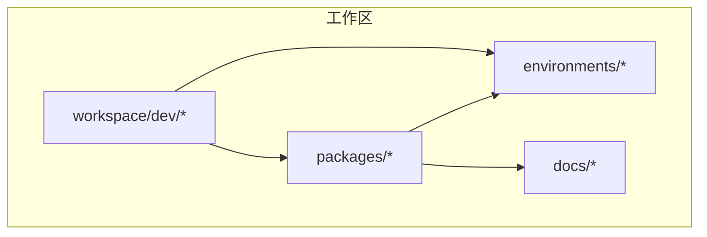
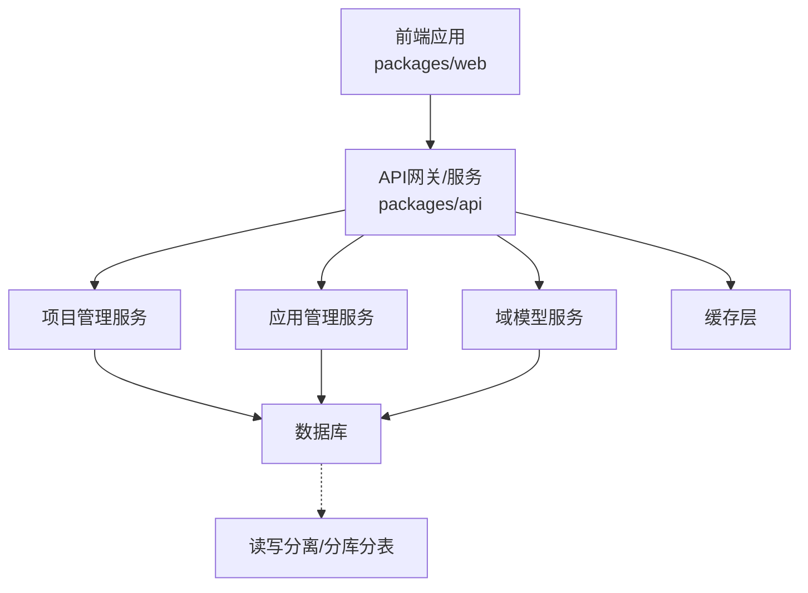
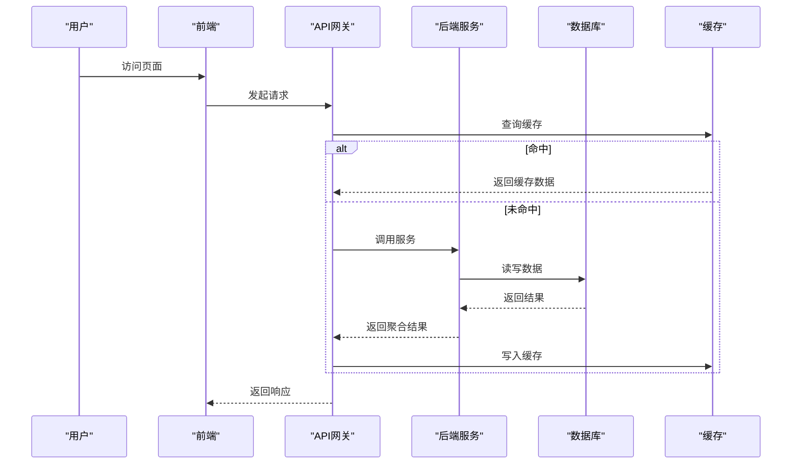
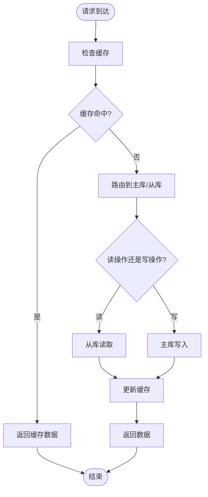
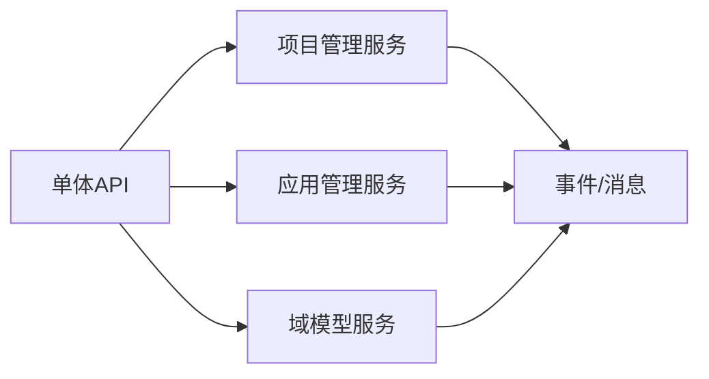
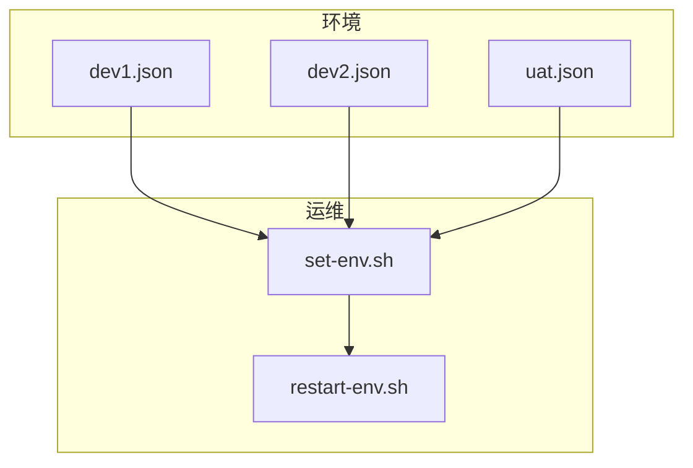
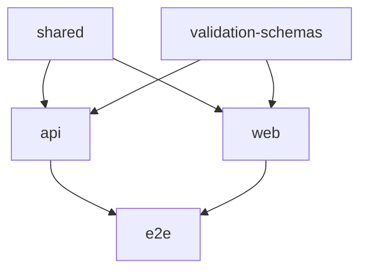

# 可扩展性设计

<cite>
**本文引用的文件**
- [README.md](file://README.md)
- [turbo.json](file://turbo.json)
- [pnpm-workspace.yaml](file://pnpm-workspace.yaml)
- [package.json](file://package.json)
- [workspace/dev/docker-compose.yml](file://workspace/dev/docker-compose.yml)
- [environments/dev1.json](file://environments/dev1.json)
- [environments/dev2.json](file://environments/dev2.json)
- [environments/uat.json](file://environments/uat.json)
- [environments/set-env.sh](file://environments/set-env.sh)
- [environments/restart-env.sh](file://environments/restart-env.sh)
- [docs/04-tech-design/phase1-infrastructure-plan.md](file://docs/04-tech-design/phase1-infrastructure-plan.md)
- [docs/04-tech-design/openapi-contract-design.md](file://docs/04-tech-design/openapi-contract-design.md)
- [docs/05-data-design/phase1-database-schema.md](file://docs/05-data-design/phase1-database-schema.md)
- [docs/07-deploy-design/multi-env-deploy.md](file://docs/07-deploy-design/multi-env-deploy.md)
- [docs/20-analyze-report/phase1-infrastructure-audit.md](file://docs/20-analyze-report/phase1-infrastructure-audit.md)
- [docs/04-tech-design/domain-model-tech-design.md](file://docs/04-tech-design/domain-model-tech-design.md)
- [docs/04-tech-design/object-lifecycle.md](file://docs/04-tech-design/object-lifecycle.md)
- [docs/04-tech-design/validation-design.md](file://docs/04-tech-design/validation-design.md)
- [docs/04-tech-design/coding-convention-backend.md](file://docs/04-tech-design/coding-convention-backend.md)
- [packages/api/package.json](file://packages/api/package.json)
- [packages/web/package.json](file://packages/web/package.json)
- [packages/shared/package.json](file://packages/shared/package.json)
- [packages/validation-schemas/package.json](file://packages/validation-schemas/package.json)
- [packages/e2e/package.json](file://packages/e2e/package.json)
</cite>

## 目录
1. [引言](#引言)
2. [项目结构](#项目结构)
3. [核心组件](#核心组件)
4. [架构总览](#架构总览)
5. [详细组件分析](#详细组件分析)
6. [依赖关系分析](#依赖关系分析)
7. [性能考量](#性能考量)
8. [故障排查指南](#故障排查指南)
9. [结论](#结论)
10. [附录](#附录)

## 引言
本设计文档面向AI原型管理系统，聚焦于可扩展性设计与演进路径。目标是建立支持水平扩展与垂直扩展的架构基线，明确微服务化演进方向、模块化设计原则、高可用与负载均衡策略、数据库扩展方案（读写分离、分库分表、缓存）、API版本控制与向后兼容、监控指标与容量规划，并总结常见扩展性挑战与优化策略。

## 项目结构
系统采用多包工作区（monorepo）组织方式，通过包管理器与构建系统实现模块化与可扩展性基础。核心目录与职责如下：
- packages：前端应用、API网关/服务、共享库、验证模式、端到端测试等子包，便于独立开发、测试与部署。
- environments：环境配置与运维脚本，支撑多环境部署与快速重启。
- docs：技术设计、数据设计、部署设计与分析报告，形成可追溯的设计与审计依据。
- workspace/dev：本地开发编排，便于快速启动与集成测试。

**章节来源**
- [pnpm-workspace.yaml](file://pnpm-workspace.yaml)
- [turbo.json](file://turbo.json)
- [package.json](file://package.json)

## 核心组件
- 前端应用（packages/web）：用户交互界面，承载项目管理、应用管理等业务视图。
- API服务（packages/api）：对外提供REST接口，作为统一入口与聚合层。
- 共享库（packages/shared）：跨包复用的类型定义、常量、工具函数与通用逻辑。
- 验证模式（packages/validation-schemas）：统一的数据校验规范与契约。
- 端到端测试（packages/e2e）：保障跨模块集成与回归质量。
- 环境配置（environments/*）：dev1/dev2/uat等环境参数与运维脚本。
- 文档（docs/*）：技术设计、数据库设计、部署设计与审计报告。

这些组件通过包管理与构建系统解耦，支持独立演进与按需扩展。

**章节来源**
- [packages/web/package.json](file://packages/web/package.json)
- [packages/api/package.json](file://packages/api/package.json)
- [packages/shared/package.json](file://packages/shared/package.json)
- [packages/validation-schemas/package.json](file://packages/validation-schemas/package.json)
- [packages/e2e/package.json](file://packages/e2e/package.json)

## 架构总览
系统建议采用“前端单页应用 + API网关/服务 + 多后端服务 + 数据与缓存”的分层架构。前端负责UI与交互；API层负责路由、鉴权、聚合与协议转换；后端服务按领域拆分（如项目管理、应用管理、域模型），通过事件或HTTP进行通信；数据库与缓存分别承担持久化与热点加速。

该架构支持：
- 水平扩展：通过无状态API与服务实例复制，结合负载均衡横向扩容。
- 垂直扩展：针对热点服务提升资源配额，配合缓存与异步处理降低延迟。
- 微服务化：以业务域划分服务，逐步引入消息队列与事件驱动，增强解耦与弹性。

## 详细组件分析

### API网关与服务拆分
- 设计原则：API层作为统一入口，负责鉴权、限流、熔断与聚合，避免服务间直接耦合。
- 扩展策略：无状态化、会话外置（如Redis）、灰度发布与蓝绿部署。
- 负载均衡：Nginx/Ingress + 健康检查 + 会话亲和（必要时）。
- 高可用：多副本+多可用区部署，自动故障转移与自愈。

**章节来源**
- [docs/04-tech-design/openapi-contract-design.md](file://docs/04-tech-design/openapi-contract-design.md)
- [docs/07-deploy-design/multi-env-deploy.md](file://docs/07-deploy-design/multi-env-deploy.md)

### 数据库扩展方案
- 读写分离：主库写入、从库读取，分担查询压力；通过连接池与只读副本实现。
- 分库分表：按业务维度（如租户/项目）分片，结合一致性哈希或范围分片策略。
- 缓存策略：多级缓存（本地缓存、分布式缓存），热点数据预热，失效策略与双写一致性。
- 容灾备份：主备切换、异地多活、增量备份与恢复演练。

**章节来源**
- [docs/05-data-design/phase1-database-schema.md](file://docs/05-data-design/phase1-database-schema.md)
- [docs/04-tech-design/phase1-infrastructure-plan.md](file://docs/04-tech-design/phase1-infrastructure-plan.md)

### 微服务演进路径与模块化设计
- 模块化原则：按业务域划分服务，清晰的边界与最小依赖；共享能力沉淀在shared。
- 演进路径：从单体API起步，逐步拆分为项目管理、应用管理、域模型等服务；引入事件驱动与异步消息。
- 接口契约：基于OpenAPI定义契约，确保前后端与服务间一致性。
- 版本控制：语义化版本与向后兼容策略，渐进式迁移与废弃周期。

**章节来源**
- [docs/04-tech-design/domain-model-tech-design.md](file://docs/04-tech-design/domain-model-tech-design.md)
- [docs/04-tech-design/openapi-contract-design.md](file://docs/04-tech-design/openapi-contract-design.md)
- [docs/04-tech-design/object-lifecycle.md](file://docs/04-tech-design/object-lifecycle.md)

### 高可用与负载均衡
- 多环境部署：dev1/dev2/uat区分开发、联调与验收，支持快速回滚与隔离。
- 运维脚本：一键设置环境变量与重启服务，保障变更可重复与可审计。
- 负载均衡：反向代理+健康检查，结合会话亲和与超时重试。
- 故障隔离：熔断与降级策略，快速失败与优雅退让。

**章节来源**
- [environments/dev1.json](file://environments/dev1.json)
- [environments/dev2.json](file://environments/dev2.json)
- [environments/uat.json](file://environments/uat.json)
- [environments/set-env.sh](file://environments/set-env.sh)
- [environments/restart-env.sh](file://environments/restart-env.sh)
- [docs/07-deploy-design/multi-env-deploy.md](file://docs/07-deploy-design/multi-env-deploy.md)

### API版本控制与向后兼容
- 版本策略：路径或头部携带版本号，语义化版本；对不兼容变更采用新版本并保留旧版本过渡期。
- 向后兼容：新增字段默认可选，删除字段仅在废弃周期后移除；严格契约校验。
- 渐进迁移：灰度发布、AB测试与回滚机制，确保变更可控。

**章节来源**
- [docs/04-tech-design/openapi-contract-design.md](file://docs/04-tech-design/openapi-contract-design.md)
- [docs/04-tech-design/validation-design.md](file://docs/04-tech-design/validation-design.md)

### 监控指标体系与容量规划
- 指标体系：请求量、错误率、P95/P99延迟、缓存命中率、数据库QPS/连接数、GC与内存、CPU使用率。
- 基准测试：接口压测、数据库读写放大测试、缓存穿透与雪崩模拟。
- 容量规划：根据业务增长曲线与峰值场景，预留冗余与弹性扩缩容阈值。

**章节来源**
- [docs/20-analyze-report/phase1-infrastructure-audit.md](file://docs/20-analyze-report/phase1-infrastructure-audit.md)
- [docs/04-tech-design/phase1-infrastructure-plan.md](file://docs/04-tech-design/phase1-infrastructure-plan.md)

## 依赖关系分析
工作区通过包管理与构建系统实现模块化与可扩展性：
- 包依赖：各子包通过共享库与验证模式实现复用，减少重复与冲突。
- 工作流：Turbo驱动的增量构建与缓存，提升迭代效率。
- 环境隔离：不同环境配置独立，避免交叉污染。

**章节来源**
- [pnpm-workspace.yaml](file://pnpm-workspace.yaml)
- [turbo.json](file://turbo.json)
- [packages/shared/package.json](file://packages/shared/package.json)
- [packages/validation-schemas/package.json](file://packages/validation-schemas/package.json)

## 性能考量
- 无状态与水平扩展：API与服务尽量无状态，结合会话外置与弹性伸缩。
- 缓存优先：热点数据前置缓存，合理设置TTL与失效策略，避免缓存穿透。
- 数据库优化：读写分离、索引优化、慢查询分析与批量写入。
- 异步化：耗时任务异步执行，避免阻塞主线程与长事务。
- 监控与告警：建立完善的指标体系与自动化告警，快速定位瓶颈。

## 故障排查指南
- 环境问题：使用环境脚本快速切换与重启，核对配置文件与日志。
- 集成问题：通过端到端测试覆盖关键流程，定位跨模块异常。
- 性能问题：结合基准测试与监控指标，识别CPU/内存/IO瓶颈与热点接口。

**章节来源**
- [environments/restart-env.sh](file://environments/restart-env.sh)
- [packages/e2e/package.json](file://packages/e2e/package.json)
- [docs/20-analyze-report/phase1-infrastructure-audit.md](file://docs/20-analyze-report/phase1-infrastructure-audit.md)

## 结论
本设计文档提出了以模块化与微服务化为核心的可扩展性基线，配套高可用、负载均衡、数据库扩展与API版本控制策略，并建立了监控与容量规划方法论。建议在后续阶段逐步落地服务拆分、事件驱动与弹性伸缩，持续完善可观测性与自动化运维。

## 附录
- 扩展性挑战与对策
  - 挑战：服务间耦合、数据一致性、缓存雪崩、热点突增。
  - 对策：事件解耦、分布式事务/最终一致、多级缓存与限流、弹性扩缩容与熔断。
- 容量规划模板（示例）
  - 业务峰值QPS：X
  - 单实例处理能力：Y
  - 预留冗余：20%
  - 初始实例数：ceil(X/Y*1.2)
  - 缓存命中率目标：≥90%
  - P99延迟目标：≤200ms
  - 数据库从库数量：≥2
  - 多可用区部署：是