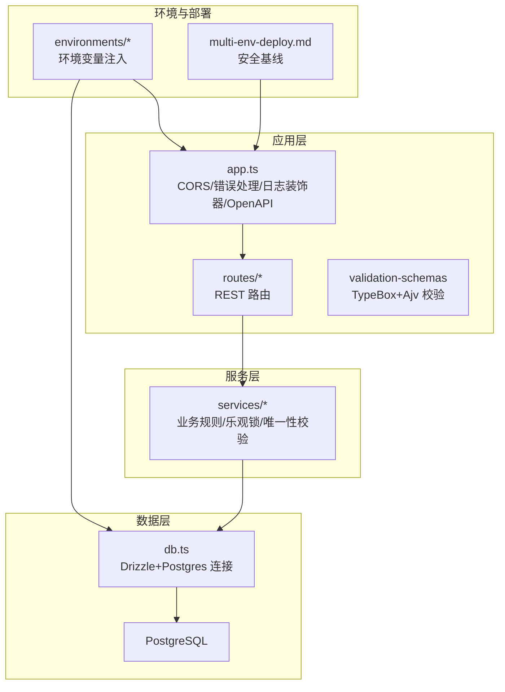
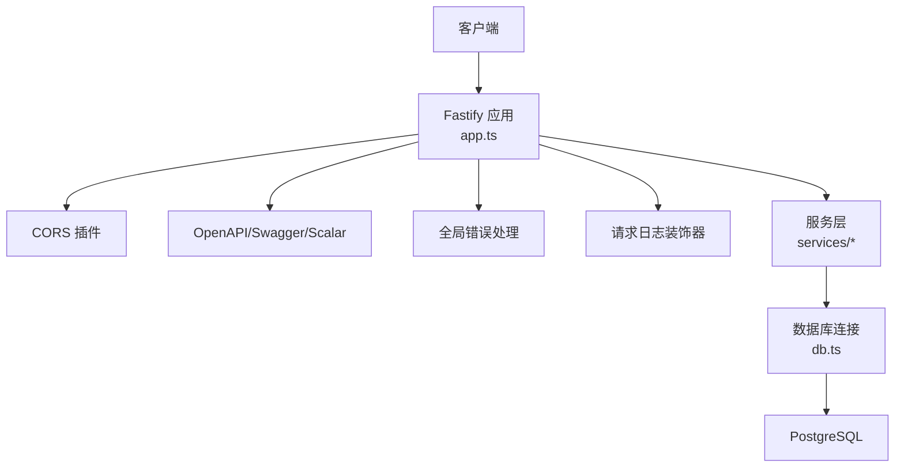
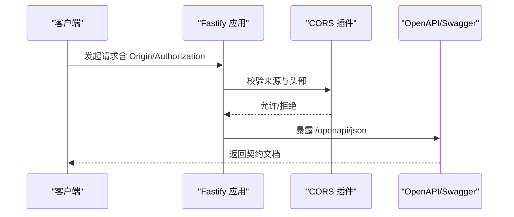
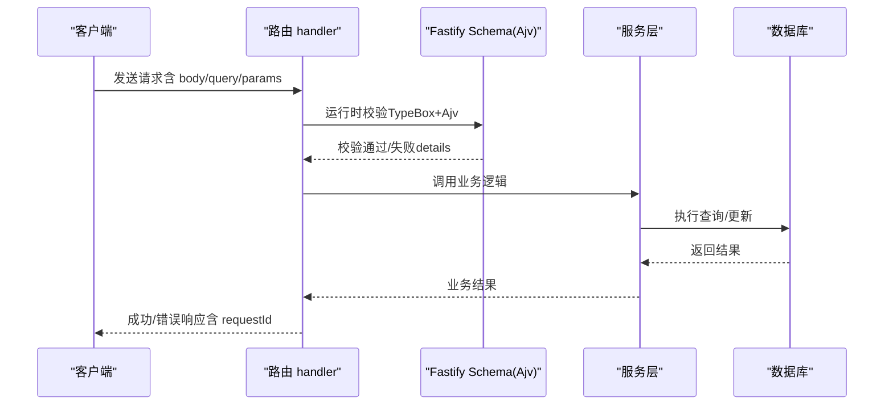
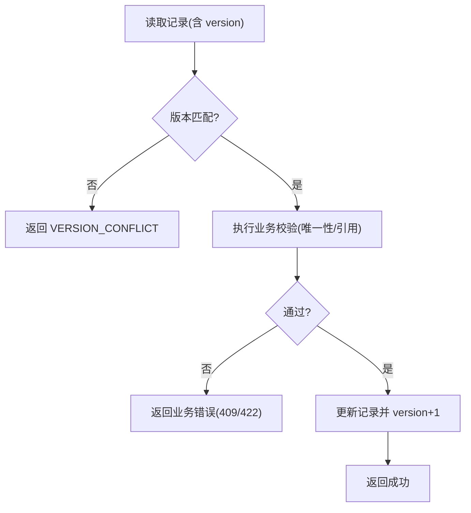
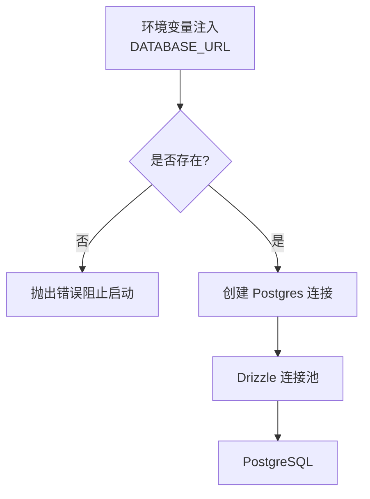
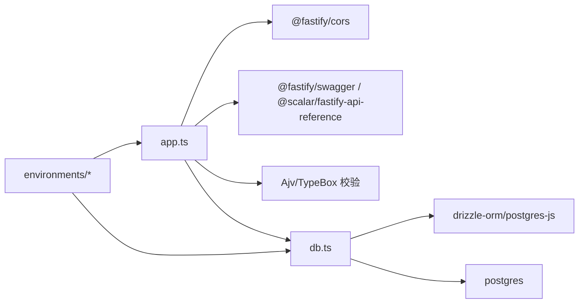

# 安全架构

<cite>
**本文引用的文件**
- [packages/api/src/app.ts](file://packages/api/src/app.ts)
- [packages/api/src/db.ts](file://packages/api/src/db.ts)
- [packages/api/src/routes/projects.ts](file://packages/api/src/routes/projects.ts)
- [packages/api/src/services/project.service.ts](file://packages/api/src/services/project.service.ts)
- [packages/validation-schemas/src/response.ts](file://packages/validation-schemas/src/response.ts)
- [docs/04-tech-design/coding-convention-backend.md](file://docs/04-tech-design/coding-convention-backend.md)
- [docs/04-tech-design/openapi-contract-design.md](file://docs/04-tech-design/openapi-contract-design.md)
- [docs/07-deploy-design/multi-env-deploy.md](file://docs/07-deploy-design/multi-env-deploy.md)
- [environments/README.md](file://environments/README.md)
- [environments/set-env.sh](file://environments/set-env.sh)
- [AGENTS.md](file://AGENTS.md)
- [packages/e2e/helpers/api-client.ts](file://packages/e2e/helpers/api-client.ts)
- [packages/api/tests/project-management/f-m1-06-company.test.ts](file://packages/api/tests/project-management/f-m1-06-company.test.ts)
</cite>

## 目录
1. [引言](#引言)
2. [项目结构](#项目结构)
3. [核心组件](#核心组件)
4. [架构总览](#架构总览)
5. [详细组件分析](#详细组件分析)
6. [依赖分析](#依赖分析)
7. [性能考虑](#性能考虑)
8. [故障排查指南](#故障排查指南)
9. [结论](#结论)
10. [附录](#附录)

## 引言
本文件面向“AI原型管理系统”（APM）后端，系统性梳理安全架构设计与实现，覆盖认证授权、API安全策略、数据访问控制、JWT与会话安全、密码加密策略、数据库安全配置、API安全实践、安全审计与异常监控、入侵检测机制，以及OWASP Top 10应对策略。文档基于仓库现有实现与设计文档进行归纳总结，并提出可落地的改进建议。

## 项目结构
后端采用 Fastify + Drizzle ORM + PostgreSQL 架构，安全相关能力主要分布在以下层次：
- 应用层：CORS、OpenAPI 文档与校验、统一错误处理、请求日志装饰器
- 服务层：业务规则与并发控制（乐观锁、唯一性约束）
- 数据层：数据库连接、迁移与连接池配置
- 环境与部署：环境变量注入、容器运行用户、CORS 配置基线



图表来源
- [packages/api/src/app.ts:16-20](file://packages/api/src/app.ts#L16-L20)
- [packages/api/src/app.ts:67-99](file://packages/api/src/app.ts#L67-L99)
- [packages/api/src/db.ts:1-24](file://packages/api/src/db.ts#L1-L24)
- [docs/07-deploy-design/multi-env-deploy.md:574-583](file://docs/07-deploy-design/multi-env-deploy.md#L574-L583)

章节来源
- [packages/api/src/app.ts:16-20](file://packages/api/src/app.ts#L16-L20)
- [packages/api/src/app.ts:67-99](file://packages/api/src/app.ts#L67-L99)
- [packages/api/src/db.ts:1-24](file://packages/api/src/db.ts#L1-L24)
- [docs/07-deploy-design/multi-env-deploy.md:574-583](file://docs/07-deploy-design/multi-env-deploy.md#L574-L583)

## 核心组件
- CORS 与 OpenAPI 文档：应用层注册 CORS 插件与 Swagger/Scalar 文档，统一暴露 OpenAPI JSON 端点，便于安全扫描与契约驱动测试。
- 统一错误处理：全局 setErrorHandler 捕获业务错误与未预期异常，屏蔽堆栈信息，输出标准化错误响应。
- 请求日志装饰器：记录请求方法、URL、状态码与耗时，支撑审计与异常定位。
- 数据库连接与迁移：严格要求通过环境系统注入 DATABASE_URL，禁用硬编码与 fallback，默认启用 prepared statements，迁移使用非 prepared 连接。
- 服务层并发控制：乐观锁版本号校验与唯一性预检，结合数据库约束保障并发安全。
- 环境与部署安全基线：容器以非 root 用户运行、CORS 未来增强为按环境配置、网络隔离与供应链基线。

章节来源
- [packages/api/src/app.ts:16-20](file://packages/api/src/app.ts#L16-L20)
- [packages/api/src/app.ts:67-99](file://packages/api/src/app.ts#L67-L99)
- [packages/api/src/app.ts:105-113](file://packages/api/src/app.ts#L105-L113)
- [packages/api/src/db.ts:5-12](file://packages/api/src/db.ts#L5-L12)
- [packages/api/src/db.ts:16-22](file://packages/api/src/db.ts#L16-L22)
- [packages/api/src/services/project.service.ts:283-312](file://packages/api/src/services/project.service.ts#L283-L312)
- [docs/07-deploy-design/multi-env-deploy.md:574-583](file://docs/07-deploy-design/multi-env-deploy.md#L574-L583)

## 架构总览
下图展示安全相关组件在系统中的交互关系与数据流向。



图表来源
- [packages/api/src/app.ts:16-20](file://packages/api/src/app.ts#L16-L20)
- [packages/api/src/app.ts:67-99](file://packages/api/src/app.ts#L67-L99)
- [packages/api/src/app.ts:105-113](file://packages/api/src/app.ts#L105-L113)
- [packages/api/src/db.ts:1-24](file://packages/api/src/db.ts#L1-L24)

## 详细组件分析

### CORS 与 API 文档安全
- CORS 配置：允许 GET/POST/PUT/DELETE/PATCH/OPTIONS 方法与 Content-Type、Authorization 头，origin 为 true（宽松模式）。
- OpenAPI 文档：注册 @fastify/swagger 与 @scalar/fastify-api-reference，暴露 /openapi/json 端点，便于安全扫描与契约测试。
- 建议：将 CORS.origin 从 true 改为按环境配置的白名单，避免跨域风险。



图表来源
- [packages/api/src/app.ts:16-20](file://packages/api/src/app.ts#L16-L20)
- [packages/api/src/app.ts:67-68](file://packages/api/src/app.ts#L67-L68)

章节来源
- [packages/api/src/app.ts:16-20](file://packages/api/src/app.ts#L16-L20)
- [packages/api/src/app.ts:67-68](file://packages/api/src/app.ts#L67-L68)
- [docs/07-deploy-design/multi-env-deploy.md:574-583](file://docs/07-deploy-design/multi-env-deploy.md#L574-L583)

### 统一错误处理与审计日志
- 全局错误处理：捕获业务错误（4xx）与未预期异常（5xx），屏蔽堆栈，输出标准化错误响应，包含 requestId。
- 请求日志装饰器：记录请求开始时间、结束时延，便于审计与性能分析。
- 建议：在生产环境开启结构化日志（JSON），并集成集中式日志收集与告警。

```mermaid
flowchart TD
Start(["请求进入"]) --> Try["执行业务逻辑"]
Try --> |成功| Ok["返回 2xx/200 成功响应"]
Try --> |业务错误(4xx)| BizErr["捕获业务错误<br/>输出标准化错误响应"]
Try --> |未预期异常(5xx)| SysErr["记录错误日志<br/>输出 INTERNAL_ERROR"]
Ok --> Log["记录请求耗时日志"]
BizErr --> Log
SysErr --> Log
Log --> End(["响应返回"])
```

图表来源
- [packages/api/src/app.ts:74-99](file://packages/api/src/app.ts#L74-L99)
- [packages/api/src/app.ts:105-113](file://packages/api/src/app.ts#L105-L113)

章节来源
- [packages/api/src/app.ts:74-99](file://packages/api/src/app.ts#L74-L99)
- [packages/api/src/app.ts:105-113](file://packages/api/src/app.ts#L105-L113)

### 请求验证与 OpenAPI 契约
- TypeBox + Ajv 校验：在路由层使用 Fastify 原生 schema 替代自定义 validate 中间件，实现强类型、高性能、可输出 JSON Schema 的统一校验。
- OpenAPI 响应契约：response.ts 定义统一成功/分页/删除/错误响应结构，与服务端错误码体系对齐。
- 建议：持续完善各端点 schema.response，覆盖所有可能状态码，配合 OpenAPI 合法性测试。



图表来源
- [packages/api/src/routes/projects.ts:138-175](file://packages/api/src/routes/projects.ts#L138-L175)
- [packages/validation-schemas/src/response.ts:109-136](file://packages/validation-schemas/src/response.ts#L109-L136)
- [docs/04-tech-design/openapi-contract-design.md:222-241](file://docs/04-tech-design/openapi-contract-design.md#L222-L241)

章节来源
- [packages/api/src/routes/projects.ts:138-175](file://packages/api/src/routes/projects.ts#L138-L175)
- [packages/validation-schemas/src/response.ts:109-136](file://packages/validation-schemas/src/response.ts#L109-L136)
- [docs/04-tech-design/openapi-contract-design.md:222-241](file://docs/04-tech-design/openapi-contract-design.md#L222-L241)

### 数据访问控制与并发安全
- 乐观锁：服务层通过版本号校验防止并发覆盖，冲突时返回 VERSION_CONFLICT。
- 唯一性约束：应用层预检 + 数据库 UNIQUE 约束，避免竞态条件。
- 建议：对高敏感接口增加最小权限访问控制（RBAC），并在服务层显式校验操作者权限。



图表来源
- [packages/api/src/services/project.service.ts:283-312](file://packages/api/src/services/project.service.ts#L283-L312)

章节来源
- [packages/api/src/services/project.service.ts:283-312](file://packages/api/src/services/project.service.ts#L283-L312)

### 数据库安全配置
- 连接字符串注入：严格要求通过环境系统注入 DATABASE_URL，未设置时抛错，杜绝硬编码与 fallback。
- 连接池与 SQL：默认使用 prepared statements 提升安全性；迁移使用非 prepared 连接。
- 建议：启用 SSL/TLS 连接、最小权限账号、连接池超时与健康检查、敏感字段脱敏日志输出。



图表来源
- [packages/api/src/db.ts:5-12](file://packages/api/src/db.ts#L5-L12)
- [packages/api/src/db.ts:16-22](file://packages/api/src/db.ts#L16-L22)
- [AGENTS.md:139-150](file://AGENTS.md#L139-L150)

章节来源
- [packages/api/src/db.ts:5-12](file://packages/api/src/db.ts#L5-L12)
- [packages/api/src/db.ts:16-22](file://packages/api/src/db.ts#L16-L22)
- [AGENTS.md:139-150](file://AGENTS.md#L139-L150)

### 环境与部署安全基线
- 容器用户：以非 root 用户运行 API 容器。
- CORS：当前为宽松模式，建议改为按环境配置的白名单。
- 网络隔离：compose 项目使用独立 bridge 网络，必要时考虑 overlay network。
- 供应链：本地构建镜像，未来可引入私有 registry。

章节来源
- [docs/07-deploy-design/multi-env-deploy.md:574-583](file://docs/07-deploy-design/multi-env-deploy.md#L574-L583)

### 认证授权机制与会话安全
现状：仓库未发现 JWT、会话存储、RBAC 等认证授权实现。
建议：
- 引入 Fastify JWT 插件，使用短期访问令牌与刷新令牌轮换。
- 会话存储：使用 HttpOnly、Secure、SameSite Cookie 或基于令牌的无状态会话。
- RBAC：在路由层或中间件中按角色与资源进行授权校验。
- 传输安全：强制 HTTPS、HSTS、安全头配置。

章节来源
- [packages/api/src/app.ts:16-20](file://packages/api/src/app.ts#L16-L20)

### API 安全实践
- 请求验证：使用 Fastify 原生 schema 与 TypeBox+Ajv，一次性返回全部字段级错误。
- 速率限制：建议引入速率限制中间件，按 IP/用户维度限制请求频率。
- 跨域：CORS 从 true 改为按环境配置的白名单。
- 健康检查：/api/v1/health 通过 DB SELECT 1 验证连通性。

章节来源
- [packages/api/src/app.ts:16-20](file://packages/api/src/app.ts#L16-L20)
- [packages/api/src/app.ts:120-131](file://packages/api/src/app.ts#L120-L131)

### 安全审计日志、异常监控与入侵检测
- 审计日志：请求日志装饰器记录方法、URL、状态码与耗时；建议输出 JSON 结构化日志并采集。
- 异常监控：全局错误处理器屏蔽堆栈，记录 requestId；建议接入 APM/日志平台进行告警。
- 入侵检测：结合 WAF/网关进行异常流量清洗与阻断，对 400/401/403/429/500 异常比例进行阈值告警。

章节来源
- [packages/api/src/app.ts:105-113](file://packages/api/src/app.ts#L105-L113)
- [packages/api/src/app.ts:74-99](file://packages/api/src/app.ts#L74-L99)

### 密码加密策略
现状：仓库未发现密码加密实现。
建议：
- 存储：使用强哈希算法（如 bcrypt/argon2）与随机盐，禁止明文存储。
- 传输：强制 HTTPS，避免弱密码协议。
- 轮换：定期轮换密钥与哈希参数，支持平滑升级。

## 依赖分析
- 应用层依赖：@fastify/cors、@fastify/swagger、@scalar/fastify-api-reference、Ajv/TypeBox。
- 数据层依赖：drizzle-orm/postgres-js、postgres。
- 环境依赖：环境系统注入 DATABASE_URL，禁用硬编码。



图表来源
- [packages/api/src/app.ts:16-20](file://packages/api/src/app.ts#L16-L20)
- [packages/api/src/db.ts:1-3](file://packages/api/src/db.ts#L1-L3)
- [environments/set-env.sh:85-94](file://environments/set-env.sh#L85-L94)

章节来源
- [packages/api/src/app.ts:16-20](file://packages/api/src/app.ts#L16-L20)
- [packages/api/src/db.ts:1-3](file://packages/api/src/db.ts#L1-L3)
- [environments/set-env.sh:85-94](file://environments/set-env.sh#L85-L94)

## 性能考虑
- Ajv 编译缓存：Schema 预编译，运行时零开销。
- Prepared Statements：默认使用 prepared statements，降低 SQL 注入风险并提升性能。
- 连接池：Drizzle 默认连接池，建议根据 QPS 调优最大连接数与超时。
- 日志开销：结构化日志与采样策略，避免高并发下日志成为瓶颈。

## 故障排查指南
- 环境变量缺失：DATABASE_URL 未设置时启动报错，需先激活环境。
- 版本冲突：更新接口返回 VERSION_CONFLICT，提示刷新后重试。
- E2E 客户端：统一错误响应格式，便于断言与定位。

章节来源
- [AGENTS.md:139-150](file://AGENTS.md#L139-L150)
- [packages/api/tests/project-management/f-m1-06-company.test.ts:306-318](file://packages/api/tests/project-management/f-m1-06-company.test.ts#L306-L318)
- [packages/e2e/helpers/api-client.ts:17-51](file://packages/e2e/helpers/api-client.ts#L17-L51)

## 结论
APM 后端在安全方面已具备良好基础：严格的环境变量注入、统一错误处理与日志装饰器、TypeBox+Ajv 的强类型校验与 OpenAPI 契约、Drizzle 连接与迁移的安全配置。建议下一步补齐认证授权（JWT/RBAC）、速率限制、CORS 白名单、HTTPS 强制、密码加密与密钥轮换、WAF/入侵检测与集中式日志监控，以满足生产级安全要求。

## 附录

### OWASP Top 10 应对策略（结合现状）
- A01:2021-Broken Access Control：通过 RBAC 与资源级授权中间件强化访问控制；对高敏感端点增加最小权限校验。
- A02:2021-Cryptographic Failures：引入密码哈希与密钥轮换；强制 HTTPS 与安全头。
- A03:2021-Injection：默认使用 prepared statements；Schema 校验与输入净化；OpenAPI 契约约束。
- A04:2021-Invalidated Authorization：引入短期令牌与刷新令牌轮换；会话无状态化。
- A05:2021-Security Misconfiguration：禁用硬编码与 fallback；CORS 白名单；容器非 root 运行。
- A06:2021-Vulnerable and Outdated Components：固定依赖版本；定期安全扫描；供应链本地构建。
- A07:2021-Identification and Authentication Failures：引入 JWT 与会话安全；速率限制；登录保护。
- A08:2021-Data Exposure：最小化日志输出敏感字段；SSL/TLS；传输加密。
- A09:2021-Logging and Monitoring Failures：结构化日志；集中式日志与告警；审计轨迹。
- A10:2021-Server-Side Request Forgery：CORS 白名单；API 网关与 WAF；异常流量检测。