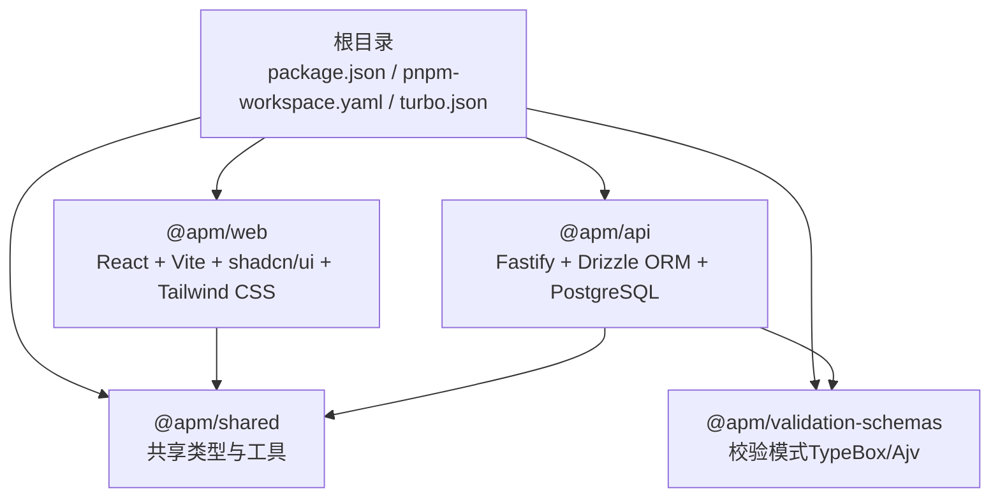
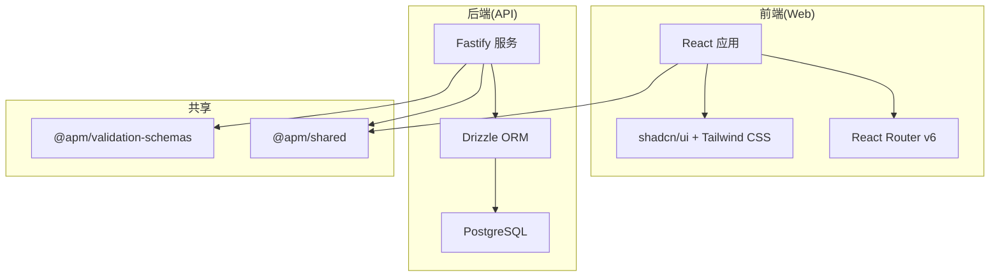
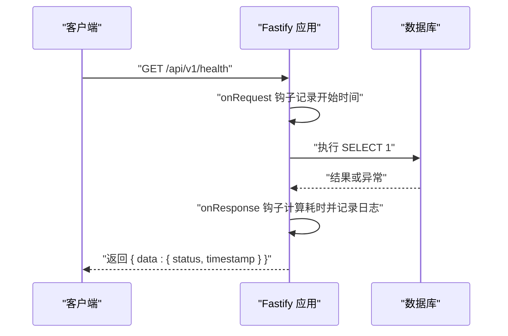
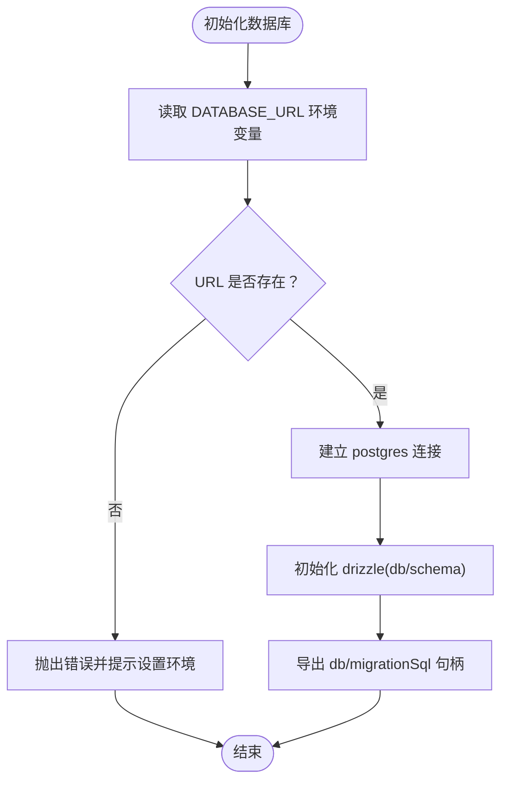
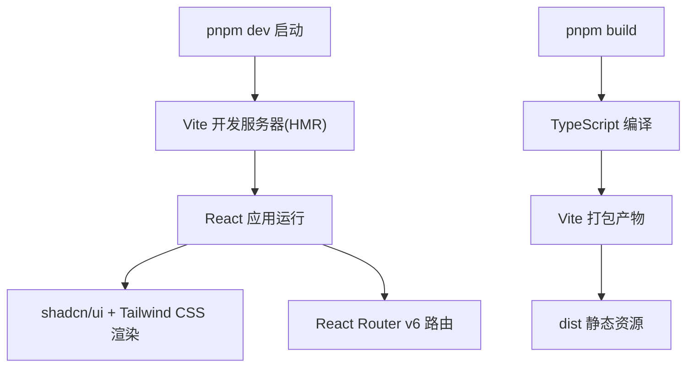
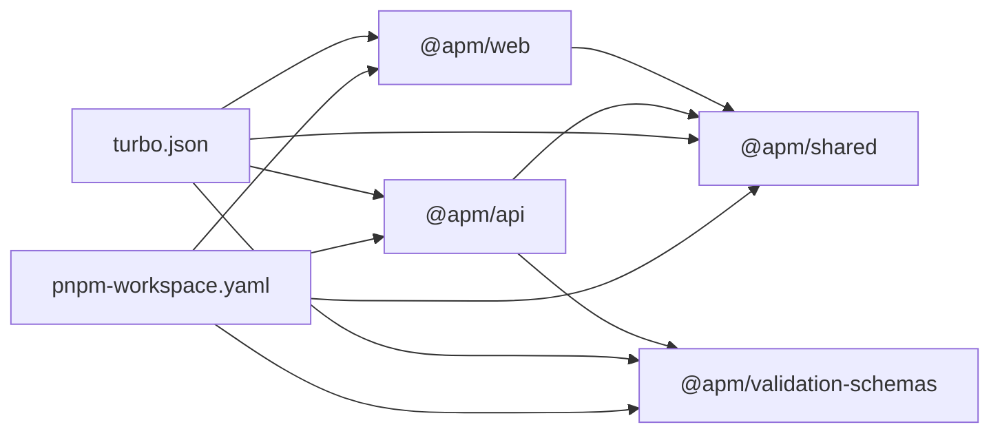
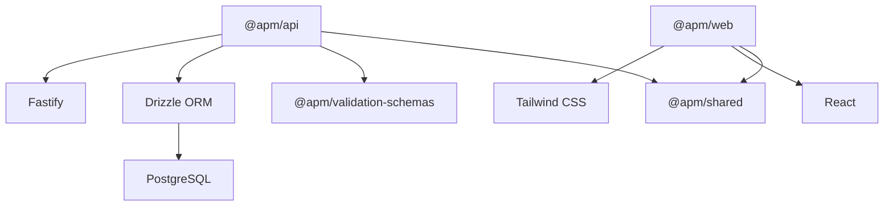

# 技术栈选择

<cite>
**本文引用的文件**
- [README.md](file://README.md)
- [package.json](file://package.json)
- [pnpm-workspace.yaml](file://pnpm-workspace.yaml)
- [turbo.json](file://turbo.json)
- [packages/api/package.json](file://packages/api/package.json)
- [packages/api/src/app.ts](file://packages/api/src/app.ts)
- [packages/api/src/db.ts](file://packages/api/src/db.ts)
- [packages/api/drizzle/config.ts](file://packages/api/drizzle/config.ts)
- [packages/web/package.json](file://packages/web/package.json)
- [packages/shared/package.json](file://packages/shared/package.json)
- [docs/04-tech-design/phase1-infrastructure-plan.md](file://docs/04-tech-design/phase1-infrastructure-plan.md)
- [docs/07-deploy-design/multi-env-deploy.md](file://docs/07-deploy-design/multi-env-deploy.md)
- [docs/99-archived/2026-04-28-phase1-design.md](file://docs/99-archived/2026-04-28-phase1-design.md)
- [AGENTS.md](file://AGENTS.md)
</cite>

## 目录
1. [引言](#引言)
2. [项目结构](#项目结构)
3. [核心组件](#核心组件)
4. [架构总览](#架构总览)
5. [详细组件分析](#详细组件分析)
6. [依赖分析](#依赖分析)
7. [性能考量](#性能考量)
8. [故障排查指南](#故障排查指南)
9. [结论](#结论)
10. [附录](#附录)

## 引言
本技术栈选择文档面向“AI原型管理系统”，围绕后端（Fastify）、前端（React）、数据库（PostgreSQL）、ORM（Drizzle ORM）、类型系统（TypeScript）、UI（shadcn/ui + Tailwind CSS）、Monorepo（pnpm workspaces + Turborepo）等关键技术点，系统阐述选型原因、优势与权衡，并给出替代方案对比与实践建议。目标是在保证工程化效率的同时，兼顾性能、可维护性与团队协作。

## 项目结构
项目采用 Monorepo 架构，根目录通过 pnpm workspace 管理多包，Turborepo 统一编排构建、测试与缓存。后端 API 包使用 Fastify + Drizzle ORM + PostgreSQL，前端 Web 包基于 React + Vite + shadcn/ui + Tailwind CSS，共享包提供跨包复用的类型与工具。

图表来源
- [pnpm-workspace.yaml:1-3](file://pnpm-workspace.yaml#L1-L3)
- [turbo.json:1-1](file://turbo.json#L1-L1)
- [packages/api/package.json:1-1](file://packages/api/package.json#L1-L1)
- [packages/web/package.json:1-1](file://packages/web/package.json#L1-L1)
- [packages/shared/package.json:1-1](file://packages/shared/package.json#L1-L1)

章节来源
- [README.md:32-52](file://README.md#L32-L52)
- [pnpm-workspace.yaml:1-3](file://pnpm-workspace.yaml#L1-L3)
- [turbo.json:1-1](file://turbo.json#L1-L1)

## 核心组件
- 后端框架：Fastify
  - 性能与插件生态：高性能 HTTP 服务器，插件体系完善，TypeScript 深度集成，便于中间件、路由与错误处理的类型安全实现。
  - 实践体现：全局 CORS 注册、统一错误处理器、请求/响应钩子、健康检查路由等均在后端骨架中落地。
- 数据库与 ORM：PostgreSQL + Drizzle ORM
  - 可靠性与扩展性：关系型数据库，强一致与事务支持；JSONB 与复杂查询能力满足原型系统的结构化语义存储。
  - 类型安全与现代化：Drizzle 提供 SQL-like API，与 TypeScript 无缝衔接；配合 TypeBox/Ajv 实现“一套定义三处复用”。
- 前端框架：React + Vite + TypeScript
  - 组件化与生态：React 生态成熟，开发体验佳；Vite 提供快速 HMR 与原生 ESM；TypeScript 统一前后端类型系统。
- UI 方案：shadcn/ui + Tailwind CSS
  - 效率与可控性：基于 Radix UI + Tailwind CSS，组件可完全定制，适配编辑器类产品的高度定制需求。
- Monorepo 与构建：pnpm workspaces + Turborepo
  - 依赖复用与增量构建：pnpm 原生支持 workspace，减少磁盘占用；Turborepo 提供任务编排与缓存，加速构建与测试。

章节来源
- [README.md:24-31](file://README.md#L24-L31)
- [docs/99-archived/2026-04-28-phase1-design.md:49-75](file://docs/99-archived/2026-04-28-phase1-design.md#L49-L75)
- [packages/api/src/app.ts:1213-1321](file://packages/api/src/app.ts#L1213-L1321)
- [packages/api/src/db.ts:1-24](file://packages/api/src/db.ts#L1-L24)
- [packages/api/drizzle/config.ts:1-10](file://packages/api/drizzle/config.ts#L1-L10)

## 架构总览
系统采用 B/S 架构，前后端通过 REST API 通信。后端以 Fastify 为核心，Drizzle ORM 访问 PostgreSQL；前端以 React 为基础，借助 shadcn/ui 与 Tailwind CSS 构建界面；共享包在两端复用类型与工具；Monorepo 与 Turborepo 提升工程化效率。

图表来源
- [README.md:26-29](file://README.md#L26-L29)
- [packages/api/src/app.ts:1213-1321](file://packages/api/src/app.ts#L1213-L1321)
- [packages/api/src/db.ts:1-24](file://packages/api/src/db.ts#L1-L24)
- [packages/web/package.json:1-1](file://packages/web/package.json#L1-L1)
- [packages/shared/package.json:1-1](file://packages/shared/package.json#L1-L1)

## 详细组件分析

### 后端框架：Fastify
- 选型理由
  - 高性能：零反射、极简内核，适合高并发 API 场景。
  - 插件生态：CORS、Swagger、API Reference 等插件完备，便于快速接入。
  - TypeScript 友好：类型推断与装饰器钩子，降低样板代码。
- 实践要点
  - 中间件：全局 CORS 注册，允许常见方法与头字段。
  - 错误处理：区分业务错误与未预期异常，统一返回结构并记录请求 ID。
  - 钩子：请求开始时间戳记录与响应耗时日志。
  - 健康检查：快速 DB 连通性检测，便于容器探针与运维监控。
- 替代方案对比
  - Express：生态更广但性能不及 Fastify；本项目追求极致性能与类型安全，优先选择 Fastify。
  - NestJS：企业级特性丰富，但对轻量 API 场景显得“过重”。

图表来源
- [packages/api/src/app.ts:1213-1321](file://packages/api/src/app.ts#L1213-L1321)

章节来源
- [docs/99-archived/2026-04-28-phase1-design.md:55](file://docs/99-archived/2026-04-28-phase1-design.md#L55)
- [packages/api/src/app.ts:1213-1321](file://packages/api/src/app.ts#L1213-L1321)

### 数据库与 ORM：PostgreSQL + Drizzle ORM
- 选型理由
  - PostgreSQL：关系型、强一致、JSONB 与复杂查询能力，适合结构化语义与多表关联。
  - Drizzle ORM：类型安全、SQL-like API、轻量、与 TypeScript 深度集成；与 TypeBox/Ajv 协作，实现“定义一次、多处复用”。
- 实践要点
  - 连接：通过 DATABASE_URL 建立连接，查询默认使用预编译语句；迁移使用非预编译连接。
  - 迁移：drizzle-kit 配置 schema 与输出目录，按环境变量加载连接串。
- 替代方案对比
  - Prisma：功能全面但体积较大；本项目强调轻量与类型安全，Drizzle 更契合。
  - Knex：SQL 构造器，类型安全不如 Drizzle；本项目追求“SQL-like API”，Drizzle 更合适。

图表来源
- [packages/api/src/db.ts:1-24](file://packages/api/src/db.ts#L1-L24)
- [packages/api/drizzle/config.ts:1-10](file://packages/api/drizzle/config.ts#L1-L10)

章节来源
- [docs/99-archived/2026-04-28-phase1-design.md:56-58](file://docs/99-archived/2026-04-28-phase1-design.md#L56-L58)
- [packages/api/src/db.ts:1-24](file://packages/api/src/db.ts#L1-L24)
- [packages/api/drizzle/config.ts:1-10](file://packages/api/drizzle/config.ts#L1-L10)

### 前端框架：React + Vite + TypeScript + shadcn/ui + Tailwind CSS
- 选型理由
  - React：组件化生态成熟，开发体验优秀；与 TypeScript 结合提供类型安全保障。
  - Vite：原生 ESM、快速 HMR，适合现代前端开发。
  - shadcn/ui + Tailwind CSS：基于 Radix UI 与原子化 CSS，组件可完全定制，适配编辑器类产品。
- 实践要点
  - 路由：React Router v6 硬编码路由，菜单驱动 Sidebar 与上下文导航。
  - UI：Tailwind CSS 配置 CSS 变量与暗色模式，shadcn/ui 提供 cn 工具函数合并类名。
  - 构建：Vite 构建产物与 TypeScript 编译协同，支持预览与本地调试。
- 替代方案对比
  - Next.js：全栈能力更强，但本项目前端偏“编辑器 UI”，无需 SSR/ISR；Vite 更轻量。
  - Ant Design：组件丰富但定制成本高；本项目强调“可完全定制”的 UI，shadcn/ui 更契合。

图表来源
- [packages/web/package.json:1-1](file://packages/web/package.json#L1-L1)
- [docs/04-tech-design/phase1-infrastructure-plan.md:1425-1542](file://docs/04-tech-design/phase1-infrastructure-plan.md#L1425-L1542)

章节来源
- [docs/99-archived/2026-04-28-phase1-design.md:61-66](file://docs/99-archived/2026-04-28-phase1-design.md#L61-L66)
- [packages/web/package.json:1-1](file://packages/web/package.json#L1-L1)
- [docs/04-tech-design/phase1-infrastructure-plan.md:1425-1542](file://docs/04-tech-design/phase1-infrastructure-plan.md#L1425-L1542)

### Monorepo 与构建：pnpm workspaces + Turborepo
- 选型理由
  - pnpm workspaces：原生支持、磁盘效率高、依赖去重；与本项目多包结构契合。
  - Turborepo：任务编排、增量构建、缓存优化；根级 scripts 与 turbo.json 配置统一入口。
- 实践要点
  - 依赖复用：@apm/shared 与 @apm/validation-schemas 在 API/Web 间共享。
  - 构建顺序：按依赖拓扑构建，避免重复与遗漏。
  - 缓存策略：Turborepo 缓存构建产物，显著缩短二次构建时间。
- 替代方案对比
  - Lerna：功能全面但配置复杂；本项目追求“开箱即用”的 Monorepo，pnpm + Turborepo 更合适。
  - Nx：工程能力强大但学习曲线陡峭；本项目规模适中，无需 Nx。

图表来源
- [pnpm-workspace.yaml:1-3](file://pnpm-workspace.yaml#L1-L3)
- [turbo.json:1-1](file://turbo.json#L1-L1)
- [packages/api/package.json:1-1](file://packages/api/package.json#L1-L1)
- [packages/web/package.json:1-1](file://packages/web/package.json#L1-L1)
- [packages/shared/package.json:1-1](file://packages/shared/package.json#L1-L1)

章节来源
- [docs/99-archived/2026-04-28-phase1-design.md:59-60](file://docs/99-archived/2026-04-28-phase1-design.md#L59-L60)
- [package.json:1-2](file://package.json#L1-L2)
- [pnpm-workspace.yaml:1-3](file://pnpm-workspace.yaml#L1-L3)
- [turbo.json:1-1](file://turbo.json#L1-L1)

### 类型系统：TypeScript 全栈统一
- 选型理由
  - 统一类型边界：前后端共享类型与校验模式，减少接口不一致带来的问题。
  - 开发体验：IDE 类型提示与编译期检查，降低回归风险。
- 实践要点
  - 共享类型：@apm/shared 提供纯类型库，API/Web 直接复用。
  - 校验模式：TypeBox + Ajv，实现“TS 类型 + 运行校验 + JSON Schema 输出”三合一。
- 替代方案对比
  - Zod：校验能力强大，但本项目已采用 TypeBox + Ajv 的统一方案，无需切换。

章节来源
- [docs/99-archived/2026-04-28-phase1-design.md:58](file://docs/99-archived/2026-04-28-phase1-design.md#L58)
- [packages/shared/package.json:1-1](file://packages/shared/package.json#L1-L1)
- [packages/api/package.json:1-1](file://packages/api/package.json#L1-L1)

## 依赖分析
- 组件耦合与内聚
  - API 包依赖共享类型与校验模式，内聚于业务与数据层；Web 包依赖共享 UI 与工具，内聚于展示层。
  - 数据层通过 Drizzle 与 PostgreSQL 解耦，便于演进与替换。
- 直接与间接依赖
  - API 对 drizzle-orm、postgres、@fastify/* 等直接依赖；Web 对 react、react-router-dom、shadcn/ui、tailwindcss 等直接依赖。
  - 共享包为纯类型库，被 API/Web 间接依赖。
- 外部依赖与集成点
  - 环境变量：API 依赖 DATABASE_URL、API_PORT、API_HOST、LOG_LEVEL；Web 依赖 VITE_API_BASE_URL（构建时注入）。
  - Docker 部署：通过环境变量注入与 Nginx 静态托管，前后端分离部署。

图表来源
- [packages/api/package.json:1-1](file://packages/api/package.json#L1-L1)
- [packages/web/package.json:1-1](file://packages/web/package.json#L1-L1)
- [packages/shared/package.json:1-1](file://packages/shared/package.json#L1-L1)
- [docs/07-deploy-design/multi-env-deploy.md:104-113](file://docs/07-deploy-design/multi-env-deploy.md#L104-L113)

章节来源
- [docs/07-deploy-design/multi-env-deploy.md:104-113](file://docs/07-deploy-design/multi-env-deploy.md#L104-L113)

## 性能考量
- 后端性能
  - Fastify 的零反射与插件化架构带来更低的 CPU 与内存占用；统一错误处理与钩子日志有助于定位性能瓶颈。
- 数据层性能
  - Drizzle 使用预编译语句查询，迁移使用非预编译连接，兼顾性能与灵活性。
- 前端性能
  - Vite 的原生 ESM 与 HMR 提升开发效率；Tailwind CSS 原子化样式减少打包体积。
- 构建与缓存
  - Turborepo 的增量构建与缓存显著缩短二次构建时间；pnpm 的去重与符号链接减少磁盘占用。

## 故障排查指南
- 环境变量缺失
  - 症状：启动时报错提示未设置 DATABASE_URL 或 API 端口。
  - 排查：确认环境脚本是否正确加载；Docker 部署时检查 compose environment 字段。
- 数据库连接失败
  - 症状：健康检查返回降级状态或查询报错。
  - 排查：确认 DATABASE_URL 正确、网络连通、容器健康状态；必要时使用迁移脚本验证版本。
- 前后端联调问题
  - 症状：Vite 代理无法转发到 Fastify。
  - 排查：确认 VITE_API_BASE_URL 与代理配置；检查 API 端口与主机绑定。

章节来源
- [packages/api/src/db.ts:5-12](file://packages/api/src/db.ts#L5-L12)
- [docs/07-deploy-design/multi-env-deploy.md:558-571](file://docs/07-deploy-design/multi-env-deploy.md#L558-L571)

## 结论
本技术栈在性能、类型安全、工程化效率与 UI 定制能力之间取得平衡：Fastify 提供高性能后端骨架，PostgreSQL + Drizzle ORM 保障数据层可靠与类型安全，React + Vite + shadcn/ui + Tailwind CSS 构建高效可定制的前端体验；pnpm workspaces + Turborepo 则确保 Monorepo 的可维护性与构建效率。整体方案与项目目标高度契合，具备良好的扩展性与团队协作体验。

## 附录
- 与替代方案的对比总结
  - 后端：Fastify vs Express/NestJS，倾向 Fastify 的性能与类型安全。
  - ORM：Drizzle vs Prisma/Knex，倾向 Drizzle 的轻量与类型安全。
  - 前端：Vite/React vs Next.js，倾向 Vite 的轻量与 HMR。
  - Monorepo：pnpm/Turborepo vs Lerna/Nx，倾向 pnpm/Turborepo 的易用与高效。
- 相关文件索引
  - 技术栈概览与决策：[docs/99-archived/2026-04-28-phase1-design.md:49-75](file://docs/99-archived/2026-04-28-phase1-design.md#L49-L75)
  - 基础设施搭建与实现：[docs/04-tech-design/phase1-infrastructure-plan.md:1-1995](file://docs/04-tech-design/phase1-infrastructure-plan.md#L1-L1995)
  - 部署与环境变量：[docs/07-deploy-design/multi-env-deploy.md:104-113](file://docs/07-deploy-design/multi-env-deploy.md#L104-L113)
  - 根与包配置：[package.json:1-2](file://package.json#L1-L2), [pnpm-workspace.yaml:1-3](file://pnpm-workspace.yaml#L1-L3), [turbo.json:1-1](file://turbo.json#L1-L1)
  - API 与 Web 包：[packages/api/package.json:1-1](file://packages/api/package.json#L1-L1), [packages/web/package.json:1-1](file://packages/web/package.json#L1-L1)
  - API 骨架与数据库：[packages/api/src/app.ts:1213-1321](file://packages/api/src/app.ts#L1213-L1321), [packages/api/src/db.ts:1-24](file://packages/api/src/db.ts#L1-L24), [packages/api/drizzle/config.ts:1-10](file://packages/api/drizzle/config.ts#L1-L10)
  - UI 与样式：[docs/04-tech-design/phase1-infrastructure-plan.md:1425-1542](file://docs/04-tech-design/phase1-infrastructure-plan.md#L1425-L1542)