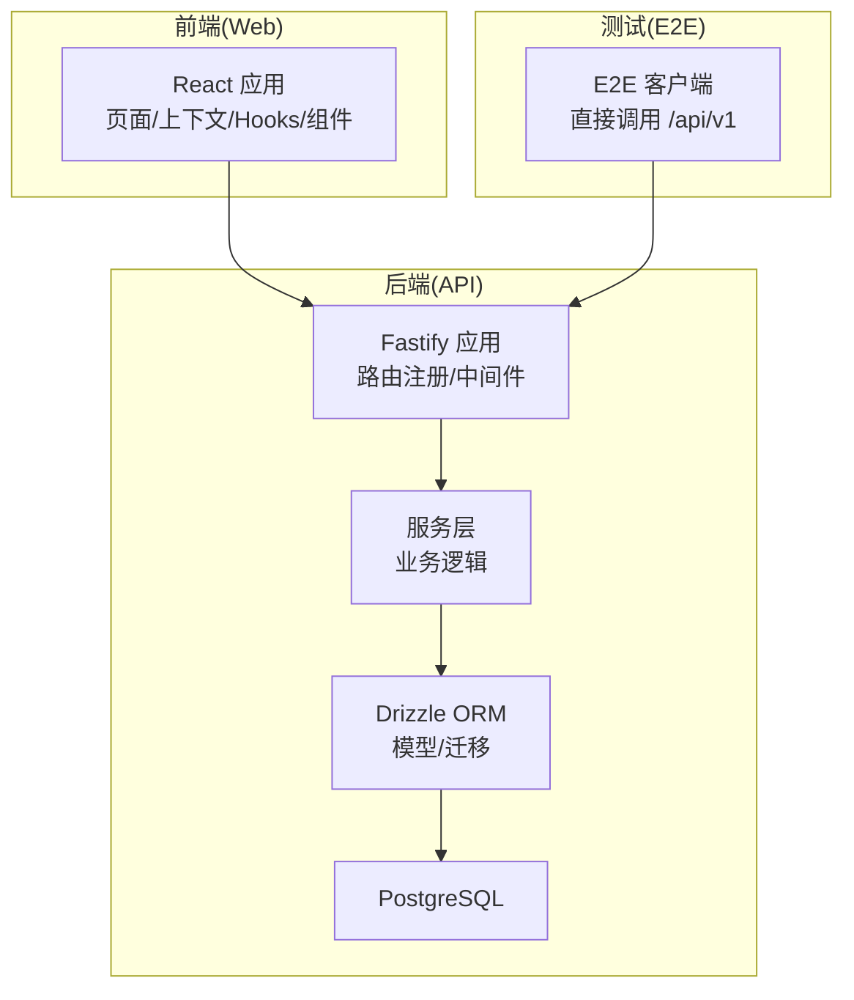
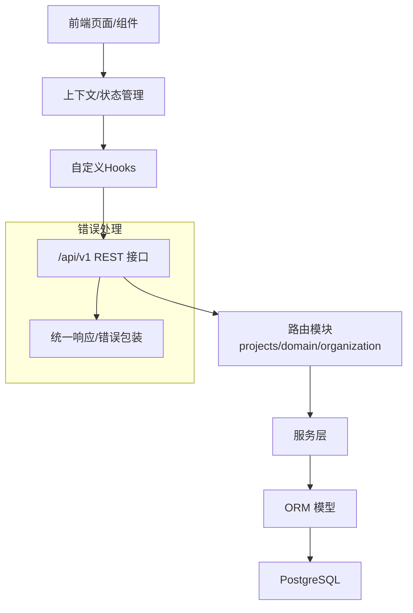
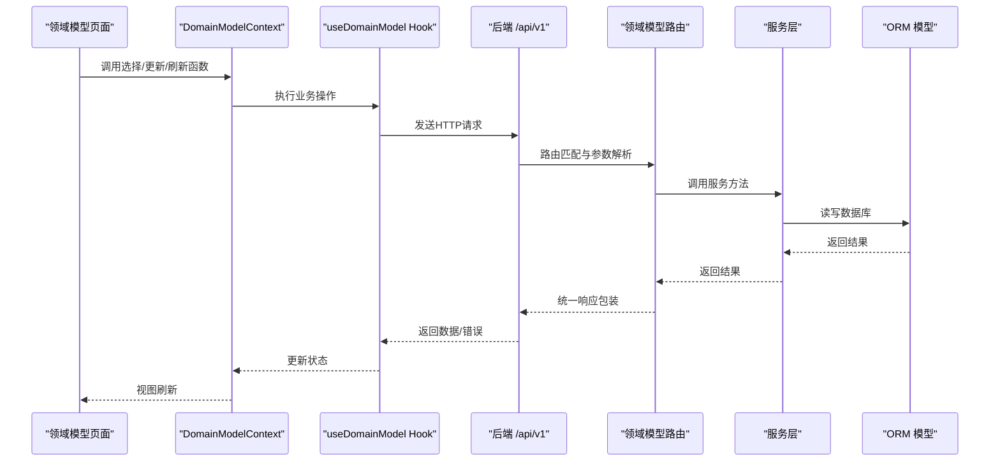
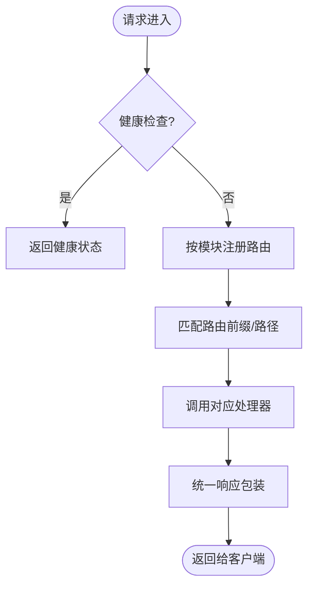
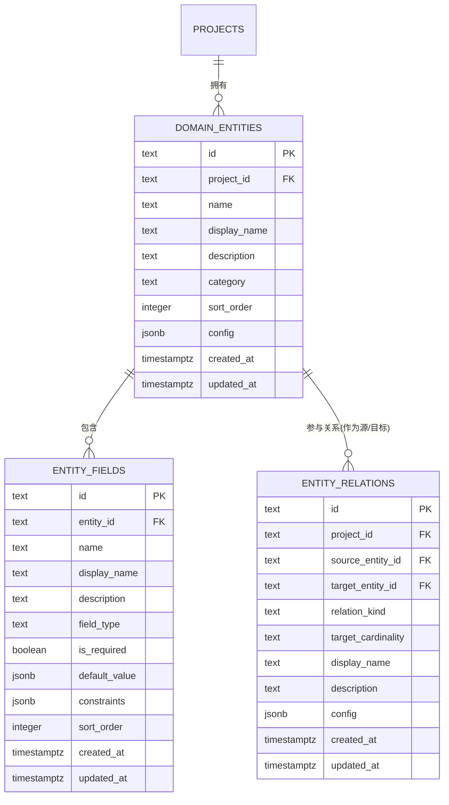
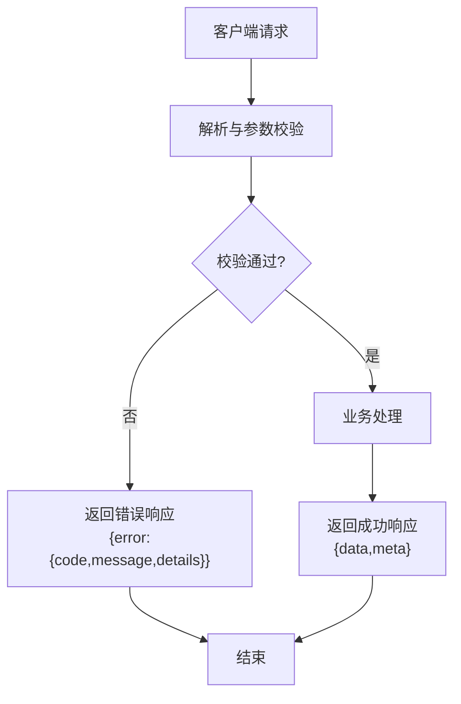
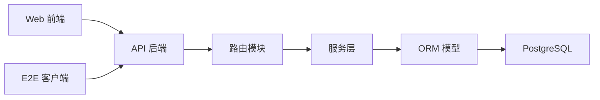

# 数据流设计

<cite>
**本文引用的文件**
- [packages/api/src/app.ts](file://packages/api/src/app.ts)
- [packages/web/src/contexts/DomainModelContext.tsx](file://packages/web/src/contexts/DomainModelContext.tsx)
- [docs/04-tech-design/domain-model-tech-design.md](file://docs/04-tech-design/domain-model-tech-design.md)
- [packages/e2e/helpers/api-client.ts](file://packages/e2e/helpers/api-client.ts)
- [logs-important/2026-05-08-conversation.md](file://logs-important/2026-05-08-conversation.md)
- [docs/04-tech-design/openapi-contract-design.md](file://docs/04-tech-design/openapi-contract-design.md)
- [docs/04-tech-design/validation-design.md](file://docs/04-tech-design/validation-design.md)
- [packages/web/src/pages/DomainModelPage.tsx](file://packages/web/src/pages/DomainModelPage.tsx)
- [packages/api/src/routes/domain.ts](file://packages/api/src/routes/domain.ts)
- [packages/api/src/services/domain.ts](file://packages/api/src/services/domain.ts)
- [packages/api/src/models/domain.ts](file://packages/api/src/models/domain.ts)
- [packages/api/src/utils/db.ts](file://packages/api/src/utils/db.ts)
- [packages/web/src/hooks/useDomainModel.ts](file://packages/web/src/hooks/useDomainModel.ts)
- [packages/web/src/components/DomainCanvas.tsx](file://packages/web/src/components/DomainCanvas.tsx)
</cite>

## 目录
1. [引言](#引言)
2. [项目结构](#项目结构)
3. [核心组件](#核心组件)
4. [架构总览](#架构总览)
5. [详细组件分析](#详细组件分析)
6. [依赖关系分析](#依赖关系分析)
7. [性能考虑](#性能考虑)
8. [故障排查指南](#故障排查指南)
9. [结论](#结论)
10. [附录](#附录)

## 引言
本设计文档聚焦于“AI原型管理系统”的数据流设计，围绕从前端React组件到后端API与数据库的完整数据流转路径展开，涵盖以下主题：
- 前端数据获取与状态管理（React Hooks、Context、页面组件）
- API层的数据处理与校验（Fastify应用、路由注册、错误响应格式）
- 数据库层的数据存储与查询优化（Drizzle ORM、PostgreSQL、索引）
- RESTful API设计原则与请求/响应模式
- 数据验证机制与错误处理策略
- 实时数据同步与状态更新机制（WebSocket/轮询策略建议）
- 数据缓存策略、性能优化技术与数据一致性保证
- 提供数据流图表与时序图，帮助开发者理解复杂数据交互场景

## 项目结构
系统采用多包工作区（pnpm workspace）组织，核心模块如下：
- packages/web：前端React应用，包含页面、上下文、Hooks、组件等
- packages/api：后端Fastify服务，包含路由、服务层、ORM模型、数据库工具
- packages/shared、packages/validation-schemas：共享工具与校验Schema
- packages/e2e：端到端测试辅助，包含直接调用后端API的客户端
- docs：技术设计文档，包含领域模型、OpenAPI契约、验证设计等

**章节来源**
- [packages/api/src/app.ts:132-177](file://packages/api/src/app.ts#L132-L177)
- [packages/web/src/contexts/DomainModelContext.tsx:436-447](file://packages/web/src/contexts/DomainModelContext.tsx#L436-L447)

## 核心组件
- 前端上下文与Hooks：负责领域模型数据的状态管理、刷新与更新触发
- API应用与路由：统一注册各模块路由，暴露REST接口
- 服务层：封装业务逻辑，协调数据访问与校验
- ORM与模型：定义领域模型相关表结构、索引与约束
- E2E客户端：直接调用后端API，便于测试与边界场景验证

**章节来源**
- [packages/web/src/contexts/DomainModelContext.tsx:436-447](file://packages/web/src/contexts/DomainModelContext.tsx#L436-L447)
- [packages/api/src/app.ts:132-177](file://packages/api/src/app.ts#L132-L177)
- [docs/04-tech-design/domain-model-tech-design.md:751-808](file://docs/04-tech-design/domain-model-tech-design.md#L751-L808)
- [packages/e2e/helpers/api-client.ts:17-51](file://packages/e2e/helpers/api-client.ts#L17-L51)

## 架构总览
系统采用分层架构：前端通过HTTP协议与后端交互；后端以Fastify为核心，按模块注册路由；服务层处理业务规则与数据校验；ORM映射到PostgreSQL数据库。

**图表来源**
- [packages/api/src/app.ts:132-177](file://packages/api/src/app.ts#L132-L177)
- [packages/web/src/hooks/useDomainModel.ts](file://packages/web/src/hooks/useDomainModel.ts)
- [packages/api/src/routes/domain.ts](file://packages/api/src/routes/domain.ts)
- [packages/api/src/services/domain.ts](file://packages/api/src/services/domain.ts)
- [packages/api/src/models/domain.ts](file://packages/api/src/models/domain.ts)

**章节来源**
- [packages/api/src/app.ts:115-177](file://packages/api/src/app.ts#L115-L177)
- [packages/web/src/pages/DomainModelPage.tsx](file://packages/web/src/pages/DomainModelPage.tsx)

## 详细组件分析

### 前端数据流与状态管理
- 页面组件通过上下文与自定义Hooks获取与更新领域模型数据
- 更新操作完成后，触发局部刷新与ER图重绘，确保视图与数据一致
- 上下文提供视图模式切换、搜索过滤、选中项管理与刷新函数

**图表来源**
- [packages/web/src/contexts/DomainModelContext.tsx:436-447](file://packages/web/src/contexts/DomainModelContext.tsx#L436-L447)
- [packages/web/src/hooks/useDomainModel.ts](file://packages/web/src/hooks/useDomainModel.ts)
- [packages/api/src/app.ts:132-177](file://packages/api/src/app.ts#L132-L177)
- [packages/api/src/routes/domain.ts](file://packages/api/src/routes/domain.ts)
- [packages/api/src/services/domain.ts](file://packages/api/src/services/domain.ts)
- [packages/api/src/models/domain.ts](file://packages/api/src/models/domain.ts)

**章节来源**
- [packages/web/src/contexts/DomainModelContext.tsx:436-447](file://packages/web/src/contexts/DomainModelContext.tsx#L436-L447)
- [packages/web/src/components/DomainCanvas.tsx](file://packages/web/src/components/DomainCanvas.tsx)

### API层设计与请求响应模式
- 健康检查路由用于服务可用性检测
- 模块化路由注册，按功能域划分前缀与路径
- 统一响应结构与错误包装，便于前端处理

**图表来源**
- [packages/api/src/app.ts:115-177](file://packages/api/src/app.ts#L115-L177)

**章节来源**
- [packages/api/src/app.ts:115-177](file://packages/api/src/app.ts#L115-L177)

### 数据库层与ORM模型
- 领域模型相关表包括实体、字段、关系，均与项目关联并支持级联删除
- 通过唯一索引保证名称与组合键的唯一性
- 使用JSONB存储配置与约束，便于扩展与查询

**图表来源**
- [docs/04-tech-design/domain-model-tech-design.md:751-808](file://docs/04-tech-design/domain-model-tech-design.md#L751-L808)

**章节来源**
- [docs/04-tech-design/domain-model-tech-design.md:751-808](file://docs/04-tech-design/domain-model-tech-design.md#L751-L808)

### 数据验证与错误处理
- 前端通过E2E客户端与后端交互时，统一使用JSON请求头与错误响应格式
- 后端路由返回统一响应结构，包含data/meta或error对象
- 建议在API层引入OpenAPI契约与校验设计，确保请求/响应规范与一致性

**图表来源**
- [packages/e2e/helpers/api-client.ts:17-51](file://packages/e2e/helpers/api-client.ts#L17-L51)
- [docs/04-tech-design/openapi-contract-design.md](file://docs/04-tech-design/openapi-contract-design.md)
- [docs/04-tech-design/validation-design.md](file://docs/04-tech-design/validation-design.md)

**章节来源**
- [packages/e2e/helpers/api-client.ts:17-51](file://packages/e2e/helpers/api-client.ts#L17-L51)
- [docs/04-tech-design/openapi-contract-design.md](file://docs/04-tech-design/openapi-contract-design.md)
- [docs/04-tech-design/validation-design.md](file://docs/04-tech-design/validation-design.md)

### 实时数据同步与状态更新机制
- 当前实现基于HTTP请求/响应与前端状态刷新
- 建议在需要实时性的场景引入WebSocket或轮询策略，以降低延迟并提升用户体验
- WebSocket可结合后端事件推送与前端订阅，确保状态变更即时可见

[本节为概念性说明，不直接分析具体文件，故无章节来源]

### 数据缓存策略与性能优化
- 前端：利用上下文与Hooks缓存最近查询结果，避免重复请求；对频繁刷新的区域进行局部重渲染
- 后端：对热点查询建立合适的索引与查询计划；对复杂聚合使用物化视图或缓存中间态
- 数据库：合理使用唯一索引与复合索引，减少重复约束检查；对JSONB字段建立GIN索引以加速查询

**章节来源**
- [docs/04-tech-design/domain-model-tech-design.md:751-808](file://docs/04-tech-design/domain-model-tech-design.md#L751-L808)

### 数据一致性保证
- 事务：对涉及多表的批量更新使用事务，确保原子性
- 级联删除：实体与字段、关系与项目之间使用级联删除，避免悬挂数据
- 并发控制：对关键更新使用乐观锁或版本号字段，防止并发覆盖

**章节来源**
- [docs/04-tech-design/domain-model-tech-design.md:751-808](file://docs/04-tech-design/domain-model-tech-design.md#L751-L808)

## 依赖关系分析
- 前端依赖后端提供的REST接口，通过统一的响应结构与错误格式进行交互
- 后端路由依赖服务层，服务层依赖ORM模型与数据库工具
- E2E测试通过直接调用后端API，绕过前端UI，验证接口契约与错误处理

**图表来源**
- [packages/api/src/app.ts:132-177](file://packages/api/src/app.ts#L132-L177)
- [packages/web/src/contexts/DomainModelContext.tsx:436-447](file://packages/web/src/contexts/DomainModelContext.tsx#L436-L447)
- [packages/e2e/helpers/api-client.ts:17-51](file://packages/e2e/helpers/api-client.ts#L17-L51)

**章节来源**
- [packages/api/src/app.ts:132-177](file://packages/api/src/app.ts#L132-L177)
- [packages/web/src/contexts/DomainModelContext.tsx:436-447](file://packages/web/src/contexts/DomainModelContext.tsx#L436-L447)
- [packages/e2e/helpers/api-client.ts:17-51](file://packages/e2e/helpers/api-client.ts#L17-L51)

## 性能考虑
- 查询优化：为常用过滤字段与排序字段建立索引；避免N+1查询，合并批量读取
- 缓存：对只读数据与静态资源进行缓存；对热点数据设置合理的TTL
- 连接池：后端数据库连接池参数需根据QPS与峰值调整
- 前端渲染：对大型ER图采用虚拟化与懒加载，减少DOM压力

[本节提供通用指导，不直接分析具体文件，故无章节来源]

## 故障排查指南
- 健康检查：通过健康检查路由确认数据库连通性与服务状态
- 端口与环境：确认API端口与Web端口配置，避免端口冲突
- 数据库连接串：通过环境变量覆盖默认连接串，确保开发与部署一致性
- 错误响应：前端统一解析后端错误响应，记录错误码与消息，便于定位问题

**章节来源**
- [packages/api/src/app.ts:115-130](file://packages/api/src/app.ts#L115-L130)
- [logs-important/2026-05-08-conversation.md:100-111](file://logs-important/2026-05-08-conversation.md#L100-L111)
- [packages/e2e/helpers/api-client.ts:17-51](file://packages/e2e/helpers/api-client.ts#L17-L51)

## 结论
本数据流设计文档梳理了从前端到后端再到数据库的完整数据流转路径，并结合现有代码与文档明确了模块职责、接口契约与数据模型。建议后续在API层完善OpenAPI契约与校验设计，在前端引入更完善的缓存与实时同步策略，并持续优化数据库索引与查询性能，以保障系统在高并发与大规模数据下的稳定性与一致性。

## 附录
- 端口与环境参考：API端口、Web端口、数据库连接串
- E2E客户端使用：直接调用后端API，便于准备测试数据与验证边界场景

**章节来源**
- [logs-important/2026-05-08-conversation.md:100-111](file://logs-important/2026-05-08-conversation.md#L100-L111)
- [packages/e2e/helpers/api-client.ts:17-51](file://packages/e2e/helpers/api-client.ts#L17-L51)