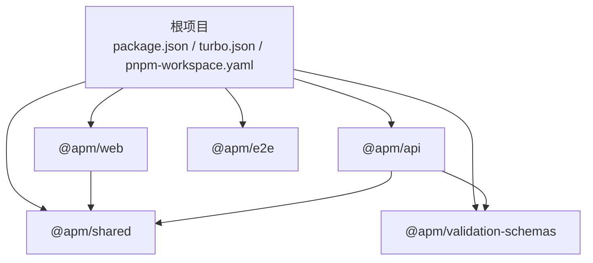
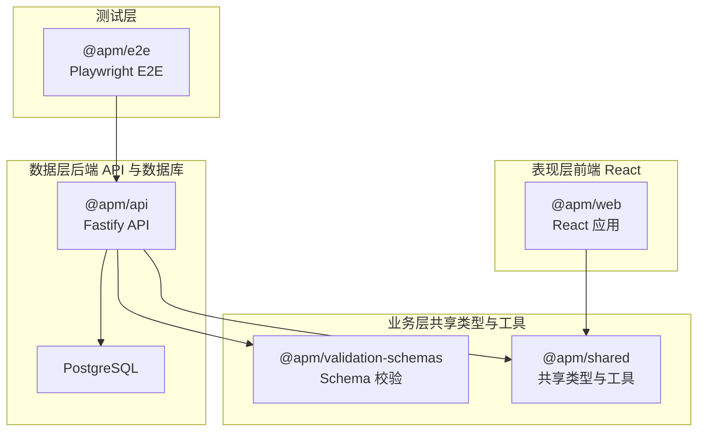
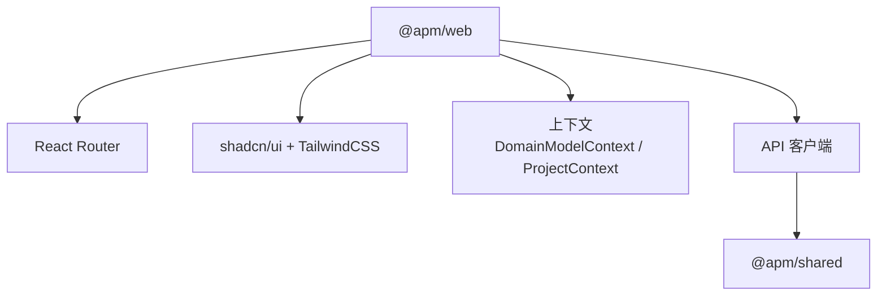
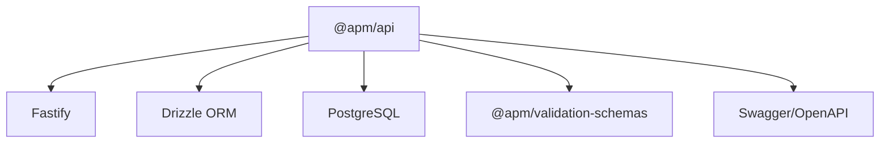
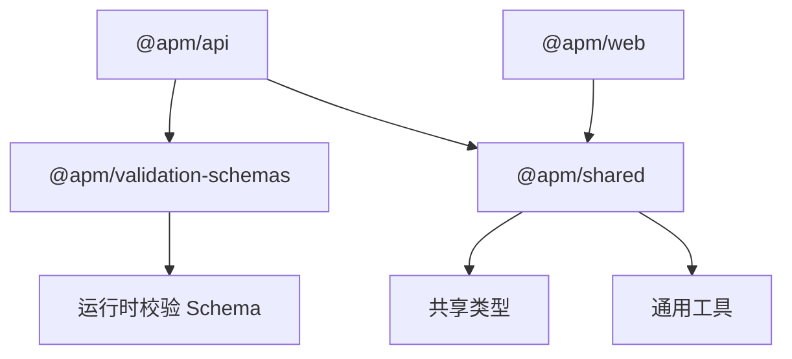
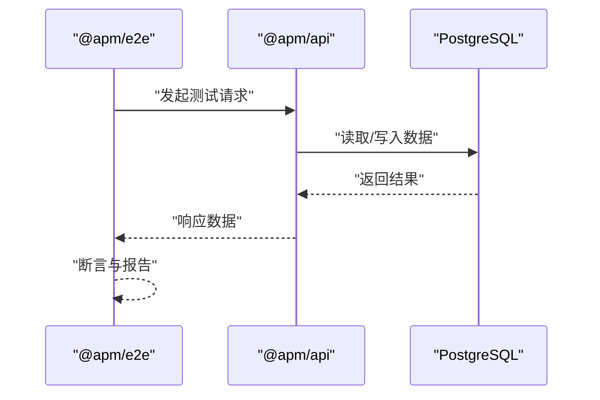
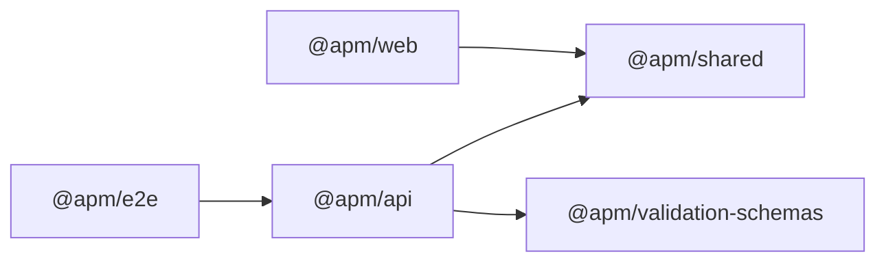

# 整体架构

<cite>
**本文引用的文件**
- [package.json](file://package.json)
- [pnpm-workspace.yaml](file://pnpm-workspace.yaml)
- [turbo.json](file://turbo.json)
- [README.md](file://README.md)
- [packages/api/package.json](file://packages/api/package.json)
- [packages/web/package.json](file://packages/web/package.json)
- [packages/shared/package.json](file://packages/shared/package.json)
- [packages/validation-schemas/package.json](file://packages/validation-schemas/package.json)
- [packages/e2e/package.json](file://packages/e2e/package.json)
</cite>

## 目录
1. [引言](#引言)
2. [项目结构](#项目结构)
3. [核心组件](#核心组件)
4. [架构总览](#架构总览)
5. [详细组件分析](#详细组件分析)
6. [依赖分析](#依赖分析)
7. [性能考虑](#性能考虑)
8. [故障排查指南](#故障排查指南)
9. [结论](#结论)
10. [附录](#附录)

## 引言
本项目是一个面向“给 AI 用的结构化语义原型”的产品定义与生命周期管理平台，采用 Monorepo 架构，结合 pnpm workspaces 与 Turborepo，实现多包协同开发与构建流水线。系统围绕“表现层（前端 React）—业务层（共享类型与工具）—数据层（后端 API 与数据库）”三层架构展开，通过统一的共享类型与校验 Schema，确保前后端契约一致与可演进。

## 项目结构
项目采用 Monorepo 组织方式，根目录通过 pnpm workspace 管理多个子包，使用 Turborepo 统一调度任务与缓存策略。核心包包括：
- packages/api：后端 API 服务（Fastify + Drizzle ORM + PostgreSQL）
- packages/web：前端应用（React + Vite + shadcn/ui + React Router）
- packages/shared：跨包共享类型与通用工具
- packages/validation-schemas：基于 TypeBox/AJV 的运行时校验 Schema
- packages/e2e：端到端测试（Playwright）

**图表来源**
- [pnpm-workspace.yaml:1-3](file://pnpm-workspace.yaml#L1-L3)
- [packages/api/package.json:1-1](file://packages/api/package.json#L1-L1)
- [packages/web/package.json:1-1](file://packages/web/package.json#L1-L1)
- [packages/shared/package.json:1-1](file://packages/shared/package.json#L1-L1)
- [packages/validation-schemas/package.json:1-1](file://packages/validation-schemas/package.json#L1-L1)
- [packages/e2e/package.json:1-1](file://packages/e2e/package.json#L1-L1)

**章节来源**
- [README.md:32-52](file://README.md#L32-L52)
- [pnpm-workspace.yaml:1-3](file://pnpm-workspace.yaml#L1-L3)
- [turbo.json:1-1](file://turbo.json#L1-L1)

## 核心组件
- 表现层（前端 React）
  - 使用 Vite 构建，React 18 + React Router v6，UI 基于 shadcn/ui 与 TailwindCSS。
  - 通过 @apm/shared 提供的共享类型与工具，保证与后端一致的数据契约。
  - 关键入口与路由在 packages/web 中，组件按功能域拆分（领域模型、组织、项目、角色行为等）。

- 业务层（共享类型与工具）
  - @apm/shared 汇聚跨包共享类型（如 application、domain、organization、project、role-behavior 等），以及通用工具导出。
  - 作为前后端契约的“单一事实来源”，避免重复定义与漂移。

- 数据层（后端 API 与数据库）
  - Fastify 作为 Web 框架，Drizzle ORM 进行数据库访问，PostgreSQL 存储数据。
  - 路由按功能域划分（applications、domain、organization、projects、role-behavior 等），服务层封装业务逻辑与错误处理。
  - 使用 @apm/validation-schemas 对请求/响应进行运行时校验，配合 OpenAPI/Swagger 文档。

- 端到端测试（E2E）
  - Playwright 驱动，覆盖项目管理等关键场景，提供稳定回归保障。

**章节来源**
- [README.md:24-31](file://README.md#L24-L31)
- [packages/web/package.json:1-1](file://packages/web/package.json#L1-L1)
- [packages/shared/package.json:1-1](file://packages/shared/package.json#L1-L1)
- [packages/api/package.json:1-1](file://packages/api/package.json#L1-L1)
- [packages/validation-schemas/package.json:1-1](file://packages/validation-schemas/package.json#L1-L1)
- [packages/e2e/package.json:1-1](file://packages/e2e/package.json#L1-L1)

## 架构总览
系统采用三层架构与清晰的系统边界：
- 表现层边界：浏览器/客户端渲染，负责用户交互与视图状态管理。
- 业务层边界：共享类型与工具，定义跨包契约与通用能力。
- 数据层边界：后端 API 与数据库，负责数据持久化与业务规则执行。

**图表来源**
- [packages/web/package.json:1-1](file://packages/web/package.json#L1-L1)
- [packages/shared/package.json:1-1](file://packages/shared/package.json#L1-L1)
- [packages/validation-schemas/package.json:1-1](file://packages/validation-schemas/package.json#L1-L1)
- [packages/api/package.json:1-1](file://packages/api/package.json#L1-L1)
- [packages/e2e/package.json:1-1](file://packages/e2e/package.json#L1-L1)

## 详细组件分析

### 前端组件分析（@apm/web）
- 职责
  - 用户界面渲染与交互编排
  - 通过 API 客户端与后端通信
  - 使用共享类型确保数据结构一致性
- 关键点
  - 组件按功能域组织（领域模型、组织、项目、角色行为等）
  - 使用上下文（DomainModelContext、ProjectContext）管理全局状态
  - 路由守卫与页面骨架提升用户体验

**图表来源**
- [packages/web/package.json:1-1](file://packages/web/package.json#L1-L1)

**章节来源**
- [packages/web/package.json:1-1](file://packages/web/package.json#L1-L1)

### 后端组件分析（@apm/api）
- 职责
  - 提供 REST 接口与 OpenAPI 文档
  - 执行业务规则与数据访问
  - 使用 Drizzle ORM 与 PostgreSQL
- 关键点
  - 路由按功能域划分，服务层封装业务逻辑
  - 使用 TypeBox/AJV 校验 Schema，保证输入输出一致性
  - 提供数据库迁移与本地开发工具脚本

**图表来源**
- [packages/api/package.json:1-1](file://packages/api/package.json#L1-L1)

**章节来源**
- [packages/api/package.json:1-1](file://packages/api/package.json#L1-L1)

### 共享层与校验层（@apm/shared 与 @apm/validation-schemas）
- 职责
  - 定义跨包共享类型与工具函数
  - 提供运行时校验 Schema，降低耦合与重复实现
- 关键点
  - 类型与 Schema 解耦，便于独立演进
  - 通过 workspace:* 在 monorepo 内部解析依赖

**图表来源**
- [packages/shared/package.json:1-1](file://packages/shared/package.json#L1-L1)
- [packages/validation-schemas/package.json:1-1](file://packages/validation-schemas/package.json#L1-L1)

**章节来源**
- [packages/shared/package.json:1-1](file://packages/shared/package.json#L1-L1)
- [packages/validation-schemas/package.json:1-1](file://packages/validation-schemas/package.json#L1-L1)

### 端到端测试（@apm/e2e）
- 职责
  - 使用 Playwright 驱动的 E2E 测试，覆盖关键业务路径
- 关键点
  - 与后端 API 协同，提供稳定回归保障

**图表来源**
- [packages/e2e/package.json:1-1](file://packages/e2e/package.json#L1-L1)
- [packages/api/package.json:1-1](file://packages/api/package.json#L1-L1)

**章节来源**
- [packages/e2e/package.json:1-1](file://packages/e2e/package.json#L1-L1)

## 依赖分析
- 包间依赖关系
  - @apm/web 依赖 @apm/shared
  - @apm/api 依赖 @apm/shared 与 @apm/validation-schemas
  - @apm/e2e 依赖 @apm/api（用于测试）
- Monorepo 与任务编排
  - pnpm workspace 通过 workspace:* 解析内部依赖
  - Turborepo 通过 tasks 配置实现并行构建、缓存与依赖拓扑排序

**图表来源**
- [packages/web/package.json:1-1](file://packages/web/package.json#L1-L1)
- [packages/api/package.json:1-1](file://packages/api/package.json#L1-L1)
- [packages/shared/package.json:1-1](file://packages/shared/package.json#L1-L1)
- [packages/validation-schemas/package.json:1-1](file://packages/validation-schemas/package.json#L1-L1)
- [packages/e2e/package.json:1-1](file://packages/e2e/package.json#L1-L1)

**章节来源**
- [pnpm-workspace.yaml:1-3](file://pnpm-workspace.yaml#L1-L3)
- [turbo.json:1-1](file://turbo.json#L1-L1)

## 性能考虑
- 构建与缓存
  - 使用 Turborepo 任务缓存与并行执行，减少重复构建时间
  - 通过 dependsOn 与 outputs 配置，精确控制任务依赖与缓存命中
- 开发体验
  - 前端使用 Vite 快速冷启动与热更新
  - 后端使用 tsx watch 支持开发期热重载
- 数据访问
  - Drizzle ORM 提供类型安全的查询与迁移工具，降低运行时开销与错误率

## 故障排查指南
- 常见问题定位
  - 依赖解析失败：检查 pnpm workspace 配置与 workspace:* 依赖声明
  - 构建缓存异常：清理 Turborepo 缓存或禁用缓存后重试
  - 数据库迁移失败：确认 Drizzle 迁移脚本与环境变量配置
- 日志与诊断
  - 使用 Playwright 报告查看 E2E 失败详情
  - 查看后端 Swagger/OpenAPI 文档核对接口契约

**章节来源**
- [turbo.json:1-1](file://turbo.json#L1-L1)
- [packages/api/package.json:1-1](file://packages/api/package.json#L1-L1)
- [packages/e2e/package.json:1-1](file://packages/e2e/package.json#L1-L1)

## 结论
本项目通过 Monorepo 与 Turborepo 的组合，实现了清晰的分层架构与高效的工程化协作。表现层、业务层与数据层边界明确，共享类型与校验 Schema 保证了契约一致性；E2E 测试进一步提升了交付质量。建议持续完善领域模型与测试矩阵，逐步扩展到更复杂的业务场景。

## 附录
- 系统边界与职责
  - 表现层：负责用户交互与视图渲染，依赖共享类型与 API 客户端
  - 业务层：提供共享类型与校验 Schema，作为契约与工具的统一出口
  - 数据层：提供 API 与数据库，承载业务规则与数据持久化
  - 测试层：通过 E2E 验证端到端流程与数据一致性