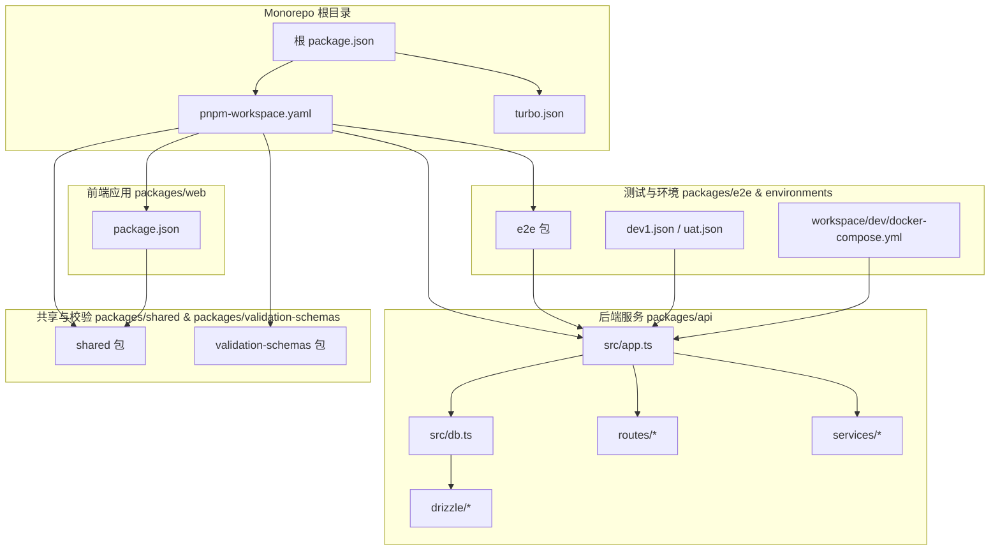
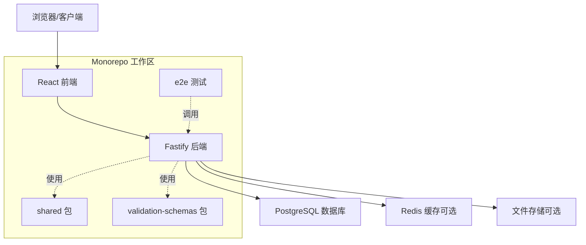
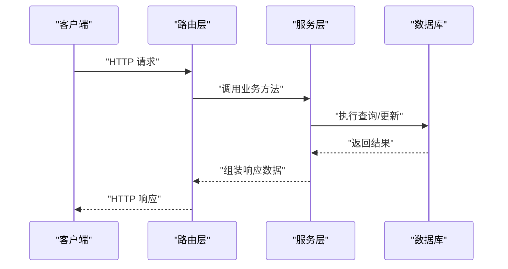
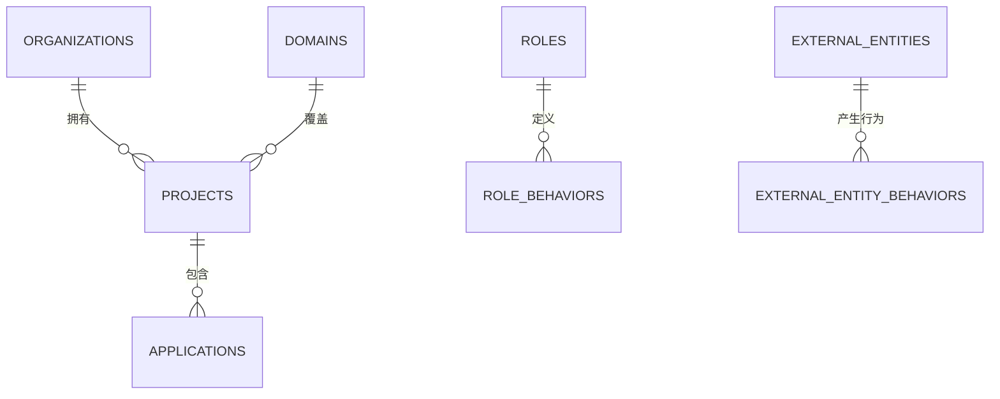
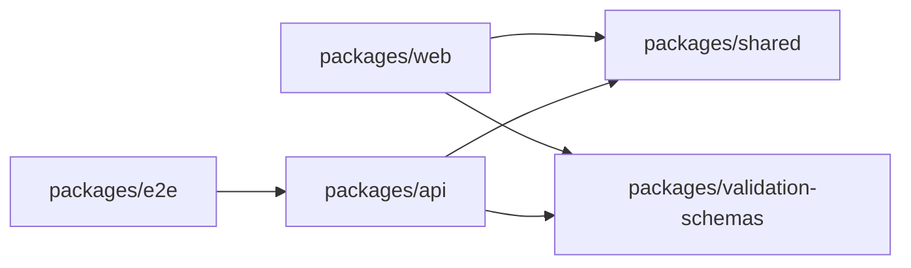

# 架构设计

<cite>
**本文引用的文件**
- [README.md](file://README.md)
- [package.json](file://package.json)
- [pnpm-workspace.yaml](file://pnpm-workspace.yaml)
- [turbo.json](file://turbo.json)
- [packages/api/src/app.ts](file://packages/api/src/app.ts)
- [packages/api/src/db.ts](file://packages/api/src/db.ts)
- [packages/api/src/routes/projects.ts](file://packages/api/src/routes/projects.ts)
- [packages/api/src/routes/applications.ts](file://packages/api/src/routes/applications.ts)
- [packages/api/src/routes/domain.ts](file://packages/api/src/routes/domain.ts)
- [packages/api/src/routes/organization.ts](file://packages/api/src/routes/organization.ts)
- [packages/api/src/routes/external-entity-behavior.ts](file://packages/api/src/routes/external-entity-behavior.ts)
- [packages/api/src/routes/role-behavior.ts](file://packages/api/src/routes/role-behavior.ts)
- [packages/api/src/services/project.service.ts](file://packages/api/src/services/project.service.ts)
- [packages/api/src/services/application.service.ts](file://packages/api/src/services/application.service.ts)
- [packages/api/src/services/domain.service.ts](file://packages/api/src/services/domain.service.ts)
- [packages/api/src/services/organization.service.ts](file://packages/api/src/services/organization.service.ts)
- [packages/api/src/services/external-entity-behavior.service.ts](file://packages/api/src/services/external-entity-behavior.service.ts)
- [packages/api/src/services/role-behavior.service.ts](file://packages/api/src/services/role-behavior.service.ts)
- [packages/api/src/models/schema.ts](file://packages/api/src/models/schema.ts)
- [packages/api/src/models/relations.ts](file://packages/api/src/models/relations.ts)
- [packages/api/drizzle/config.ts](file://packages/api/drizzle/config.ts)
- [packages/api/drizzle/migrations/0000_init_projects_table.sql](file://packages/api/drizzle/migrations/0000_init_projects_table.sql)
- [packages/api/drizzle/migrations/0004_add_domain_entities_config.sql](file://packages/api/drizzle/migrations/0004_add_domain_entities_config.sql)
- [packages/api/drizzle/migrations/0006_mean_rachel_grey.sql](file://packages/api/drizzle/migrations/0006_mean_rachel_grey.sql)
- [packages/web/package.json](file://packages/web/package.json)
- [packages/shared/package.json](file://packages/shared/package.json)
- [packages/validation-schemas/package.json](file://packages/validation-schemas/package.json)
- [packages/e2e/package.json](file://packages/e2e/package.json)
- [environments/dev1.json](file://environments/dev1.json)
- [environments/uat.json](file://environments/uat.json)
- [workspace/dev/docker-compose.yml](file://workspace/dev/docker-compose.yml)
</cite>

## 目录
1. [引言](#引言)
2. [项目结构](#项目结构)
3. [核心组件](#核心组件)
4. [架构总览](#架构总览)
5. [详细组件分析](#详细组件分析)
6. [依赖分析](#依赖分析)
7. [性能考量](#性能考量)
8. [故障排查指南](#故障排查指南)
9. [结论](#结论)
10. [附录](#附录)

## 引言
本项目旨在构建一个“AI原型管理系统”，通过清晰的分层架构与模块化组织，实现从前端到后端再到数据库的完整数据流闭环。系统采用Monorepo模式，结合pnpm workspace与Turborepo，统一管理多包依赖与构建流水线；后端基于Fastify框架，配合Drizzle ORM进行数据库建模与迁移；前端采用React生态，确保开发体验与可维护性。本文档将系统性阐述整体架构、技术选型、数据流设计、安全策略、可扩展性与性能优化，并提供架构图表帮助开发者快速理解系统全貌。

## 项目结构
项目采用Monorepo组织方式，根目录通过工作区配置统一管理多个子包（packages），并通过Turborepo进行任务编排与缓存加速。核心目录与职责如下：
- packages/api：后端服务，包含路由、服务层、模型与Drizzle迁移
- packages/web：前端应用（React）
- packages/shared：共享库（如通用类型、常量等）
- packages/validation-schemas：校验Schema（OpenAPI契约相关）
- packages/e2e：端到端测试
- environments：环境配置（dev1.json、uat.json等）
- workspace/dev：本地开发容器编排（docker-compose）

**图表来源**
- [package.json](file://package.json)
- [pnpm-workspace.yaml](file://pnpm-workspace.yaml)
- [turbo.json](file://turbo.json)
- [packages/api/src/app.ts](file://packages/api/src/app.ts)
- [packages/api/src/db.ts](file://packages/api/src/db.ts)
- [packages/api/drizzle/config.ts](file://packages/api/drizzle/config.ts)
- [packages/web/package.json](file://packages/web/package.json)
- [packages/shared/package.json](file://packages/shared/package.json)
- [packages/validation-schemas/package.json](file://packages/validation-schemas/package.json)
- [packages/e2e/package.json](file://packages/e2e/package.json)
- [environments/dev1.json](file://environments/dev1.json)
- [workspace/dev/docker-compose.yml](file://workspace/dev/docker-compose.yml)

**章节来源**
- [package.json](file://package.json)
- [pnpm-workspace.yaml](file://pnpm-workspace.yaml)
- [turbo.json](file://turbo.json)

## 核心组件
- 后端服务（Fastify）：负责HTTP路由、业务逻辑与数据库交互，提供REST风格接口
- 数据层（Drizzle ORM）：以类型安全的方式定义表结构、关系与迁移脚本
- 前端应用（React）：提供用户交互界面，调用后端API完成数据展示与操作
- 共享库（shared）：封装跨包复用的类型、常量与工具函数
- 校验Schema（validation-schemas）：承载OpenAPI契约与数据校验规则
- 端到端测试（e2e）：覆盖关键业务流程，保障系统稳定性
- 环境配置（environments）：按环境隔离配置，支持开发、UAT等环境
- 容器编排（docker-compose）：本地一键拉起数据库等基础设施

**章节来源**
- [packages/api/src/app.ts](file://packages/api/src/app.ts)
- [packages/api/src/db.ts](file://packages/api/src/db.ts)
- [packages/api/src/models/schema.ts](file://packages/api/src/models/schema.ts)
- [packages/api/drizzle/config.ts](file://packages/api/drizzle/config.ts)
- [packages/web/package.json](file://packages/web/package.json)
- [packages/shared/package.json](file://packages/shared/package.json)
- [packages/validation-schemas/package.json](file://packages/validation-schemas/package.json)
- [packages/e2e/package.json](file://packages/e2e/package.json)
- [environments/dev1.json](file://environments/dev1.json)
- [workspace/dev/docker-compose.yml](file://workspace/dev/docker-compose.yml)

## 架构总览
系统采用典型的三层架构：表现层（前端）、应用层（后端服务）、数据层（数据库）。Monorepo通过pnpm workspace实现包间依赖管理，Turborepo实现任务并行与缓存，提升开发与发布效率。

**图表来源**
- [packages/api/src/app.ts](file://packages/api/src/app.ts)
- [packages/api/src/db.ts](file://packages/api/src/db.ts)
- [packages/web/package.json](file://packages/web/package.json)
- [packages/shared/package.json](file://packages/shared/package.json)
- [packages/validation-schemas/package.json](file://packages/validation-schemas/package.json)
- [packages/e2e/package.json](file://packages/e2e/package.json)

## 详细组件分析

### 后端服务（Fastify）
- 应用入口与中间件：在应用入口中注册路由、插件与中间件，统一处理鉴权、日志与错误
- 路由模块化：按领域拆分路由文件（如项目、应用、域、组织、外部实体行为、角色行为），便于维护与扩展
- 服务层：每个路由对应的服务层负责具体业务逻辑，保持路由薄逻辑厚实现
- 数据访问：通过Drizzle ORM连接数据库，执行查询与事务

**图表来源**
- [packages/api/src/routes/projects.ts](file://packages/api/src/routes/projects.ts)
- [packages/api/src/routes/applications.ts](file://packages/api/src/routes/applications.ts)
- [packages/api/src/routes/domain.ts](file://packages/api/src/routes/domain.ts)
- [packages/api/src/routes/organization.ts](file://packages/api/src/routes/organization.ts)
- [packages/api/src/routes/external-entity-behavior.ts](file://packages/api/src/routes/external-entity-behavior.ts)
- [packages/api/src/routes/role-behavior.ts](file://packages/api/src/routes/role-behavior.ts)
- [packages/api/src/services/project.service.ts](file://packages/api/src/services/project.service.ts)
- [packages/api/src/services/application.service.ts](file://packages/api/src/services/application.service.ts)
- [packages/api/src/services/domain.service.ts](file://packages/api/src/services/domain.service.ts)
- [packages/api/src/services/organization.service.ts](file://packages/api/src/services/organization.service.ts)
- [packages/api/src/services/external-entity-behavior.service.ts](file://packages/api/src/services/external-entity-behavior.service.ts)
- [packages/api/src/services/role-behavior.service.ts](file://packages/api/src/services/role-behavior.service.ts)
- [packages/api/src/db.ts](file://packages/api/src/db.ts)

**章节来源**
- [packages/api/src/app.ts](file://packages/api/src/app.ts)
- [packages/api/src/routes/projects.ts](file://packages/api/src/routes/projects.ts)
- [packages/api/src/routes/applications.ts](file://packages/api/src/routes/applications.ts)
- [packages/api/src/routes/domain.ts](file://packages/api/src/routes/domain.ts)
- [packages/api/src/routes/organization.ts](file://packages/api/src/routes/organization.ts)
- [packages/api/src/routes/external-entity-behavior.ts](file://packages/api/src/routes/external-entity-behavior.ts)
- [packages/api/src/routes/role-behavior.ts](file://packages/api/src/routes/role-behavior.ts)
- [packages/api/src/services/project.service.ts](file://packages/api/src/services/project.service.ts)
- [packages/api/src/services/application.service.ts](file://packages/api/src/services/application.service.ts)
- [packages/api/src/services/domain.service.ts](file://packages/api/src/services/domain.service.ts)
- [packages/api/src/services/organization.service.ts](file://packages/api/src/services/organization.service.ts)
- [packages/api/src/services/external-entity-behavior.service.ts](file://packages/api/src/services/external-entity-behavior.service.ts)
- [packages/api/src/services/role-behavior.service.ts](file://packages/api/src/services/role-behavior.service.ts)
- [packages/api/src/db.ts](file://packages/api/src/db.ts)

### 数据模型与迁移（Drizzle ORM）
- 模型定义：通过类型安全的schema定义表结构与字段约束
- 关系映射：定义实体间一对多、多对多等关系，保证数据一致性
- 迁移管理：以版本化的SQL脚本管理数据库演进，支持初始化与增量升级

**图表来源**
- [packages/api/src/models/schema.ts](file://packages/api/src/models/schema.ts)
- [packages/api/src/models/relations.ts](file://packages/api/src/models/relations.ts)
- [packages/api/drizzle/migrations/0000_init_projects_table.sql](file://packages/api/drizzle/migrations/0000_init_projects_table.sql)
- [packages/api/drizzle/migrations/0004_add_domain_entities_config.sql](file://packages/api/drizzle/migrations/0004_add_domain_entities_config.sql)
- [packages/api/drizzle/migrations/0006_mean_rachel_grey.sql](file://packages/api/drizzle/migrations/0006_mean_rachel_grey.sql)

**章节来源**
- [packages/api/src/models/schema.ts](file://packages/api/src/models/schema.ts)
- [packages/api/src/models/relations.ts](file://packages/api/src/models/relations.ts)
- [packages/api/drizzle/config.ts](file://packages/api/drizzle/config.ts)
- [packages/api/drizzle/migrations/0000_init_projects_table.sql](file://packages/api/drizzle/migrations/0000_init_projects_table.sql)
- [packages/api/drizzle/migrations/0004_add_domain_entities_config.sql](file://packages/api/drizzle/migrations/0004_add_domain_entities_config.sql)
- [packages/api/drizzle/migrations/0006_mean_rachel_grey.sql](file://packages/api/drizzle/migrations/0006_mean_rachel_grey.sql)

### 前端应用（React）
- 组件化UI：围绕业务模块拆分页面与组件，复用shared中的通用能力
- 状态与路由：通过现代React生态管理状态与导航
- API对接：通过HTTP客户端调用后端接口，实现数据驱动的视图更新

**章节来源**
- [packages/web/package.json](file://packages/web/package.json)

### 共享库与校验Schema
- shared：提供跨包复用的类型、常量、工具函数，降低重复代码
- validation-schemas：承载OpenAPI契约与数据校验规则，确保前后端一致

**章节来源**
- [packages/shared/package.json](file://packages/shared/package.json)
- [packages/validation-schemas/package.json](file://packages/validation-schemas/package.json)

### 端到端测试
- 覆盖关键业务流程：从列表、创建、详情到编辑、归档等
- 集成测试：验证路由、服务与数据库的协同工作

**章节来源**
- [packages/e2e/package.json](file://packages/e2e/package.json)

## 依赖分析
- Monorepo依赖：pnpm workspace统一管理各包依赖，避免重复安装与版本冲突
- Turborepo任务：通过任务图并行执行构建、测试、lint等任务，提升工程效率
- 包间依赖：前端依赖shared与validation-schemas；后端服务依赖shared与validation-schemas；e2e依赖后端API

**图表来源**
- [pnpm-workspace.yaml](file://pnpm-workspace.yaml)
- [packages/web/package.json](file://packages/web/package.json)
- [packages/shared/package.json](file://packages/shared/package.json)
- [packages/validation-schemas/package.json](file://packages/validation-schemas/package.json)
- [packages/e2e/package.json](file://packages/e2e/package.json)

**章节来源**
- [pnpm-workspace.yaml](file://pnpm-workspace.yaml)
- [turbo.json](file://turbo.json)

## 性能考量
- 并发与缓存：利用Turborepo缓存与任务并行，减少重复构建时间；数据库层面可引入Redis缓存热点数据
- 查询优化：通过Drizzle ORM生成高效SQL，避免N+1查询；合理索引与分页
- 前端性能：组件懒加载、请求去抖与节流、资源压缩与CDN
- 部署优化：容器镜像分层、最小化运行时依赖、健康检查与自动伸缩

## 故障排查指南
- 日志与追踪：在Fastify中启用统一日志与请求追踪，定位问题根因
- 数据库诊断：检查Drizzle迁移是否成功、索引是否存在、慢查询日志
- 环境隔离：确认environments中的配置正确，区分开发与UAT环境差异
- 容器编排：通过docker-compose快速重建数据库等基础设施

**章节来源**
- [packages/api/src/app.ts](file://packages/api/src/app.ts)
- [packages/api/src/db.ts](file://packages/api/src/db.ts)
- [environments/dev1.json](file://environments/dev1.json)
- [workspace/dev/docker-compose.yml](file://workspace/dev/docker-compose.yml)

## 结论
本系统通过清晰的分层架构与模块化组织，结合Monorepo与现代化工具链，实现了高内聚、低耦合的可维护架构。后端以Fastify与Drizzle ORM为核心，前端以React为基础，辅以共享库与校验Schema，形成前后端一致的数据契约与开发体验。通过合理的性能与安全设计，系统具备良好的扩展性与稳定性，能够支撑后续业务迭代与功能扩展。

## 附录
- 技术选型说明
  - Fastify：高性能、低开销的Node.js框架，适合构建REST API
  - React：成熟的前端生态，组件化与状态管理能力完善
  - Drizzle ORM：类型安全、可移植的ORM，支持迁移与关系建模
  - pnpm workspace：高效的包管理与依赖解析
  - Turborepo：任务编排与缓存加速，显著提升开发效率
- 系统边界与第三方集成
  - 系统边界：前端、后端、数据库、缓存与文件存储
  - 第三方集成：可通过环境变量与配置文件接入外部服务（如消息队列、对象存储等）