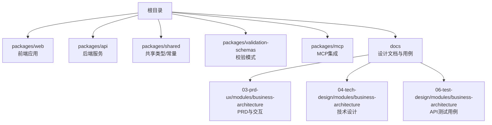
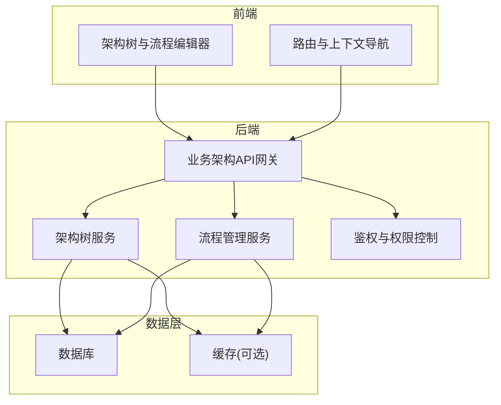
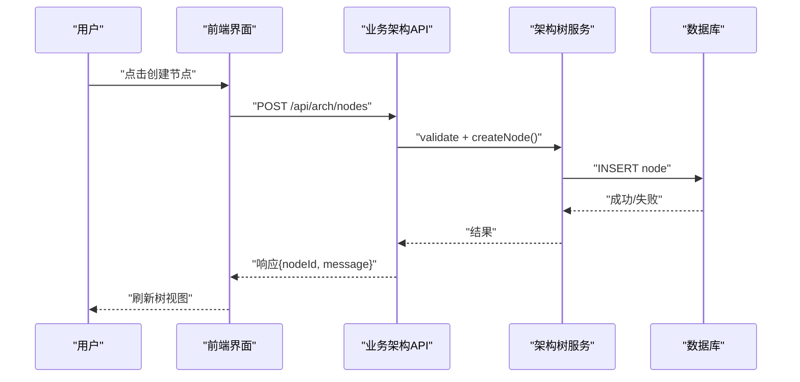
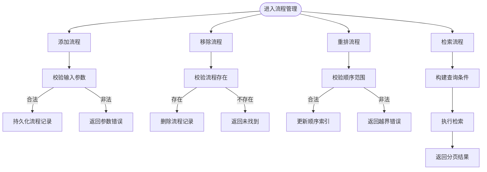
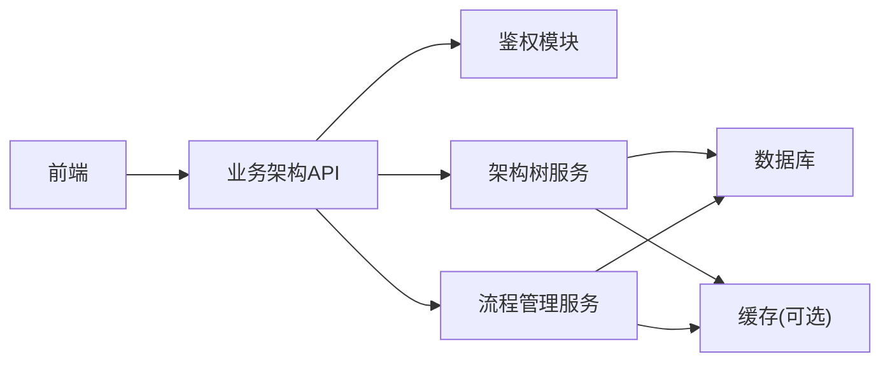

# 业务架构管理模块

<cite>
**本文引用的文件**   
- [README.md](file://README.md)
- [package.json](file://package.json)
- [pnpm-workspace.yaml](file://pnpm-workspace.yaml)
- [turbo.json](file://turbo.json)
- [business-architecture-prd.md](file://docs/03-prd-ux/modules/business-architecture/business-architecture-prd.md)
- [business-architecture-interaction.md](file://docs/03-prd-ux/modules/business-architecture/business-architecture-interaction.md)
- [business-architecture-tech-design.md](file://docs/04-tech-design/modules/business-architecture/business-architecture-tech-design.md)
- [f-m4-01-api.md](file://docs/06-test-design/modules/business-architecture/f-m4-01-arch-tree/f-m4-01-api.md)
- [f-m4-02-api.md](file://docs/06-test-design/modules/business-architecture/f-m4-02-create-node/f-m4-02-api.md)
- [f-m4-03-api.md](file://docs/06-test-design/modules/business-architecture/f-m4-03-edit-node/f-m4-03-api.md)
- [f-m4-04-api.md](file://docs/06-test-design/modules/business-architecture/f-m4-04-delete-node/f-m4-04-api.md)
- [f-m4-05-api.md](file://docs/06-test-design/modules/business-architecture/f-m4-05-add-process/f-m4-05-api.md)
- [f-m4-06-api.md](file://docs/06-test-design/modules/business-architecture/f-m4-06-remove-process/f-m4-06-api.md)
- [f-m4-07-api.md](file://docs/06-test-design/modules/business-architecture/f-m4-07-reorder-processes/f-m4-07-api.md)
- [f-m4-08-api.md](file://docs/06-test-design/modules/business-architecture/f-m4-08-process-search/f-m4-08-api.md)
</cite>

## 目录
1. [简介](#简介)
2. [项目结构](#项目结构)
3. [核心组件](#核心组件)
4. [架构总览](#架构总览)
5. [详细组件分析](#详细组件分析)
6. [依赖分析](#依赖分析)
7. [性能考虑](#性能考虑)
8. [故障排查指南](#故障排查指南)
9. [结论](#结论)
10. [附录](#附录)

## 简介
本文件聚焦“业务架构管理模块”的体系化说明，围绕产品需求、交互设计、技术设计与测试用例进行系统化梳理。该模块旨在为项目提供可视化的业务架构建模能力，包括架构树维护（节点增删改查）、业务流程编排（添加、移除、排序、检索）等关键能力，并通过统一的接口契约与前后端协作实现端到端闭环。

## 项目结构
仓库采用多包工作区组织，前端、后端、共享库、验证模式与MCP工具分别位于独立包中；文档按阶段与领域分层存放，业务架构相关的设计与测试用例集中在 docs 目录下对应子目录。

图表来源
- [README.md](file://README.md)
- [package.json](file://package.json)
- [pnpm-workspace.yaml](file://pnpm-workspace.yaml)
- [turbo.json](file://turbo.json)

章节来源
- [README.md](file://README.md)
- [package.json](file://package.json)
- [pnpm-workspace.yaml](file://pnpm-workspace.yaml)
- [turbo.json](file://turbo.json)

## 核心组件
- 架构树管理：支持节点的创建、编辑、删除与层级查询，用于表达业务架构的层次关系。
- 流程管理：支持在架构节点下添加、移除、重排业务流程，并提供流程检索能力。
- 统一接口契约：通过 OpenAPI 风格定义与测试用例对齐，确保前后端一致性与可回归性。
- 权限与上下文：结合项目上下文导航与角色行为设计，保障不同用户视角下的可见性与操作边界。

章节来源
- [business-architecture-prd.md](file://docs/03-prd-ux/modules/business-architecture/business-architecture-prd.md)
- [business-architecture-interaction.md](file://docs/03-prd-ux/modules/business-architecture/business-architecture-interaction.md)
- [business-architecture-tech-design.md](file://docs/04-tech-design/modules/business-architecture/business-architecture-tech-design.md)

## 架构总览
从端到端视角，业务架构管理模块由前端界面、后端服务、数据层与测试套件组成。前端负责交互与状态管理，后端暴露统一 API，数据层持久化架构树与流程信息，测试套件覆盖关键路径以确保质量。

图表来源
- [business-architecture-tech-design.md](file://docs/04-tech-design/modules/business-architecture/business-architecture-tech-design.md)

## 详细组件分析

### 架构树管理
- 功能要点
  - 获取架构树：返回节点层级结构与元信息。
  - 创建节点：在指定父节点下新增子节点。
  - 编辑节点：更新节点名称、描述、标签等属性。
  - 删除节点：级联或受控删除节点及其关联流程。
- 交互流程
  - 用户在界面选择目标节点后触发相应操作，前端调用对应 API 并刷新视图。
- 错误处理
  - 对非法参数、重复命名、权限不足等情况返回明确错误码与提示。

图表来源
- [f-m4-02-api.md](file://docs/06-test-design/modules/business-architecture/f-m4-02-create-node/f-m4-02-api.md)
- [f-m4-03-api.md](file://docs/06-test-design/modules/business-architecture/f-m4-03-edit-node/f-m4-03-api.md)
- [f-m4-04-api.md](file://docs/06-test-design/modules/business-architecture/f-m4-04-delete-node/f-m4-04-api.md)
- [f-m4-01-api.md](file://docs/06-test-design/modules/business-architecture/f-m4-01-arch-tree/f-m4-01-api.md)

章节来源
- [f-m4-01-api.md](file://docs/06-test-design/modules/business-architecture/f-m4-01-arch-tree/f-m4-01-api.md)
- [f-m4-02-api.md](file://docs/06-test-design/modules/business-architecture/f-m4-02-create-node/f-m4-02-api.md)
- [f-m4-03-api.md](file://docs/06-test-design/modules/business-architecture/f-m4-03-edit-node/f-m4-03-api.md)
- [f-m4-04-api.md](file://docs/06-test-design/modules/business-architecture/f-m4-04-delete-node/f-m4-04-api.md)

### 流程管理
- 功能要点
  - 添加流程：在节点下注册新流程，包含流程标识、名称、顺序等。
  - 移除流程：根据流程标识安全删除。
  - 重排流程：调整流程执行顺序。
  - 检索流程：按条件过滤与分页查询。
- 交互流程
  - 用户在流程面板中选择操作，前端调用流程管理 API，后端更新顺序索引并返回最新列表。
- 错误处理
  - 针对无效流程ID、越界排序、并发冲突等场景给出明确反馈。

图表来源
- [f-m4-05-api.md](file://docs/06-test-design/modules/business-architecture/f-m4-05-add-process/f-m4-05-api.md)
- [f-m4-06-api.md](file://docs/06-test-design/modules/business-architecture/f-m4-06-remove-process/f-m4-06-api.md)
- [f-m4-07-api.md](file://docs/06-test-design/modules/business-architecture/f-m4-07-reorder-processes/f-m4-07-api.md)
- [f-m4-08-api.md](file://docs/06-test-design/modules/business-architecture/f-m4-08-process-search/f-m4-08-api.md)

章节来源
- [f-m4-05-api.md](file://docs/06-test-design/modules/business-architecture/f-m4-05-add-process/f-m4-05-api.md)
- [f-m4-06-api.md](file://docs/06-test-design/modules/business-architecture/f-m4-06-remove-process/f-m4-06-api.md)
- [f-m4-07-api.md](file://docs/06-test-design/modules/business-architecture/f-m4-07-reorder-processes/f-m4-07-api.md)
- [f-m4-08-api.md](file://docs/06-test-design/modules/business-architecture/f-m4-08-process-search/f-m4-08-api.md)

### 权限与上下文
- 项目上下文导航：在进入业务架构页面时加载当前项目上下文，限制资源访问范围。
- 角色行为设计：基于角色决定用户对架构树与流程的操作权限，如只读、编辑、管理员。
- 安全策略：所有写操作需经过鉴权与授权检查，避免越权访问。

章节来源
- [business-architecture-tech-design.md](file://docs/04-tech-design/modules/business-architecture/business-architecture-tech-design.md)

## 依赖分析
- 外部依赖
  - 数据库：存储架构树节点与流程信息。
  - 缓存（可选）：加速树形结构读取与流程列表检索。
- 内部依赖
  - 鉴权模块：提供身份认证与权限校验。
  - 共享类型与校验模式：保证前后端数据结构一致性。
- 耦合与内聚
  - 架构树与流程管理相对独立，通过统一 API 聚合，降低耦合度。
  - 权限逻辑集中管理，提升内聚性。

图表来源
- [business-architecture-tech-design.md](file://docs/04-tech-design/modules/business-architecture/business-architecture-tech-design.md)

章节来源
- [business-architecture-tech-design.md](file://docs/04-tech-design/modules/business-architecture/business-architecture-tech-design.md)

## 性能考虑
- 树形结构读取优化：使用增量加载与懒展开，减少首屏渲染压力。
- 流程列表分页与索引：对高频检索字段建立索引，避免全表扫描。
- 并发控制：重排流程时使用乐观锁或版本号，防止竞态条件导致顺序错乱。
- 缓存策略：对热点节点与流程列表设置合理过期时间，平衡一致性与性能。

[本节为通用指导，无需引用具体文件]

## 故障排查指南
- 常见问题
  - 节点创建失败：检查父节点是否存在、命名是否唯一、权限是否足够。
  - 流程重排异常：确认顺序值是否在有效范围内，是否存在并发修改。
  - 流程检索无结果：核对筛选条件与分页参数是否正确。
- 定位步骤
  - 查看前端网络请求与响应，确认入参与出参是否符合契约。
  - 在后端日志中搜索对应 API 的请求 ID，定位服务层错误堆栈。
  - 检查数据库记录与索引状态，确认数据完整性。
- 恢复建议
  - 对幂等操作重试；对非幂等操作引入去抖与防重提交机制。
  - 对数据不一致场景提供回滚或补偿任务。

章节来源
- [f-m4-02-api.md](file://docs/06-test-design/modules/business-architecture/f-m4-02-create-node/f-m4-02-api.md)
- [f-m4-07-api.md](file://docs/06-test-design/modules/business-architecture/f-m4-07-reorder-processes/f-m4-07-api.md)
- [f-m4-08-api.md](file://docs/06-test-design/modules/business-architecture/f-m4-08-process-search/f-m4-08-api.md)

## 结论
业务架构管理模块以清晰的职责划分与稳定的接口契约为基础，实现了架构树与流程管理的核心能力。通过完善的测试用例与权限控制，保障了功能的正确性与安全性。后续可在性能优化、用户体验与扩展性方面持续迭代。

[本节为总结性内容，无需引用具体文件]

## 附录
- 参考文档
  - 产品需求与交互：见 PRD 与交互设计文档。
  - 技术设计：见技术设计文档，涵盖架构、数据模型与接口约定。
  - 测试用例：见各功能点的 API 测试用例，覆盖正常与异常路径。

章节来源
- [business-architecture-prd.md](file://docs/03-prd-ux/modules/business-architecture/business-architecture-prd.md)
- [business-architecture-interaction.md](file://docs/03-prd-ux/modules/business-architecture/business-architecture-interaction.md)
- [business-architecture-tech-design.md](file://docs/04-tech-design/modules/business-architecture/business-architecture-tech-design.md)
- [f-m4-01-api.md](file://docs/06-test-design/modules/business-architecture/f-m4-01-arch-tree/f-m4-01-api.md)
- [f-m4-02-api.md](file://docs/06-test-design/modules/business-architecture/f-m4-02-create-node/f-m4-02-api.md)
- [f-m4-03-api.md](file://docs/06-test-design/modules/business-architecture/f-m4-03-edit-node/f-m4-03-api.md)
- [f-m4-04-api.md](file://docs/06-test-design/modules/business-architecture/f-m4-04-delete-node/f-m4-04-api.md)
- [f-m4-05-api.md](file://docs/06-test-design/modules/business-architecture/f-m4-05-add-process/f-m4-05-api.md)
- [f-m4-06-api.md](file://docs/06-test-design/modules/business-architecture/f-m4-06-remove-process/f-m4-06-api.md)
- [f-m4-07-api.md](file://docs/06-test-design/modules/business-architecture/f-m4-07-reorder-processes/f-m4-07-api.md)
- [f-m4-08-api.md](file://docs/06-test-design/modules/business-architecture/f-m4-08-process-search/f-m4-08-api.md)