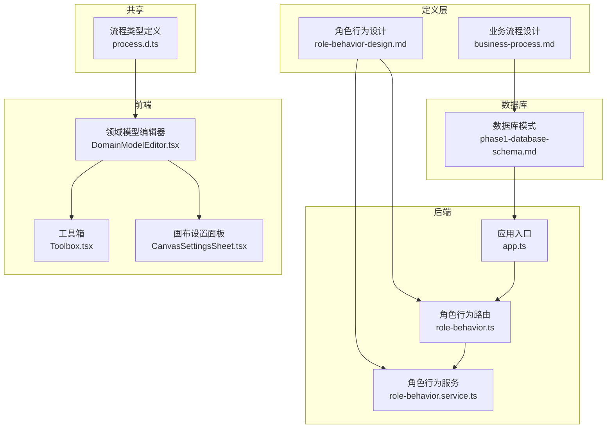
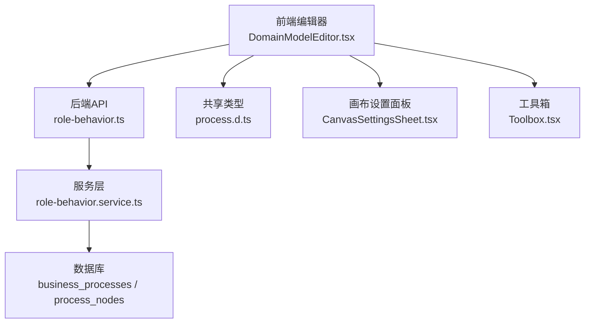
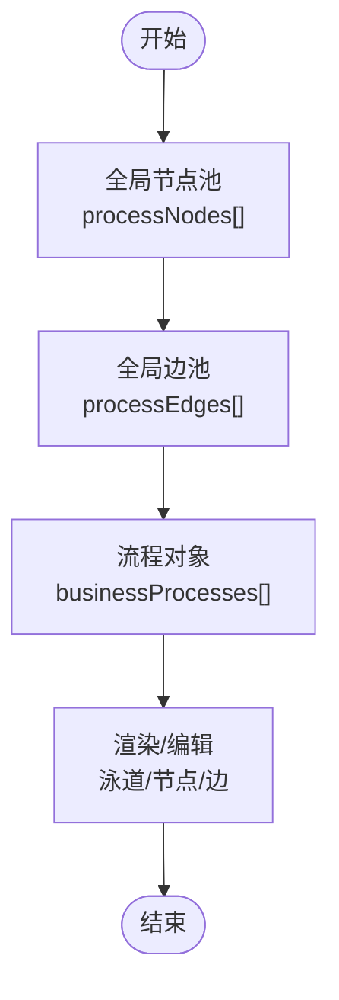
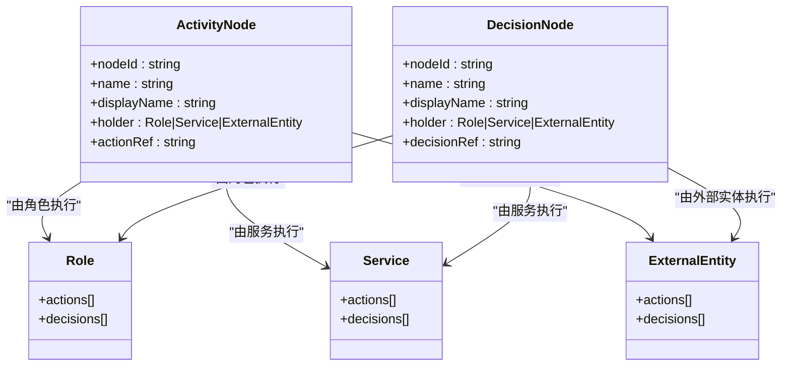
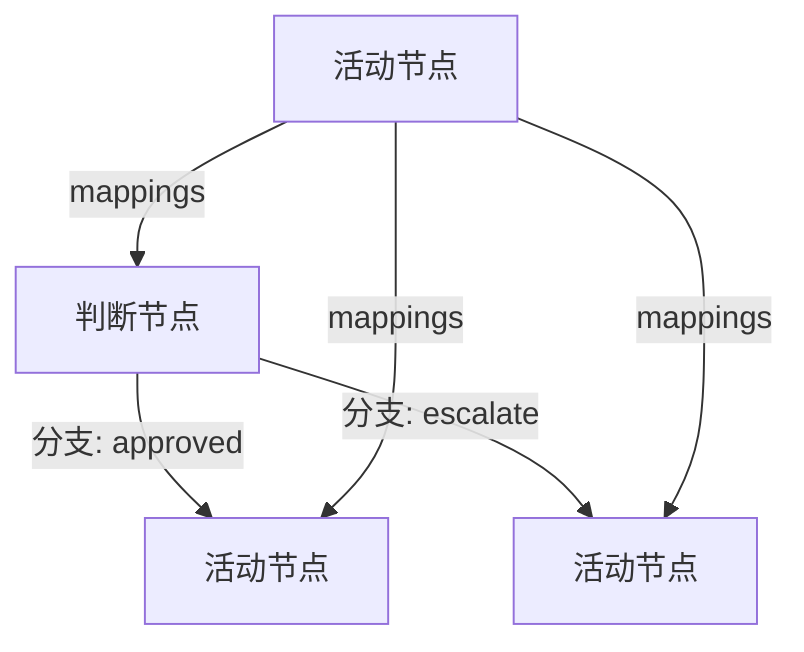
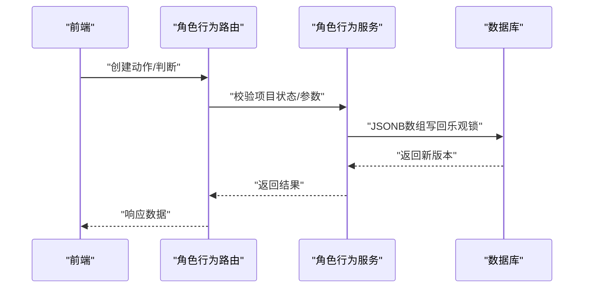
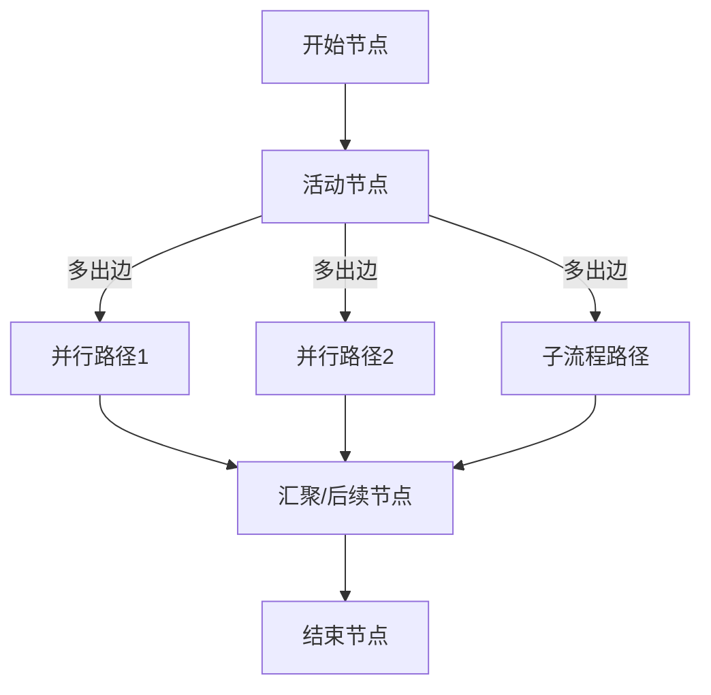
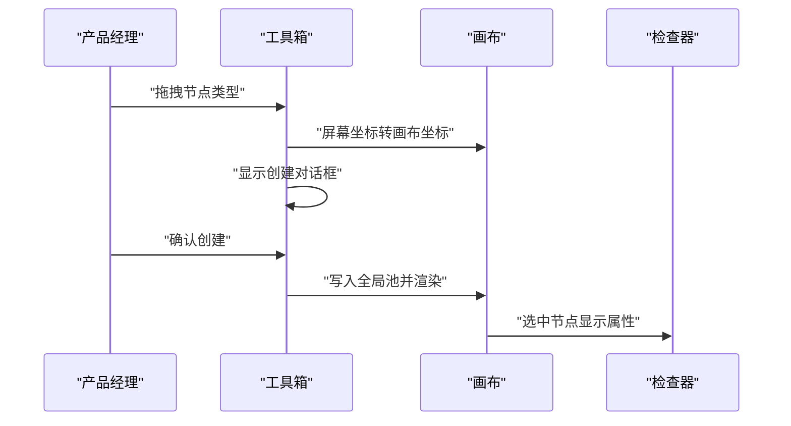
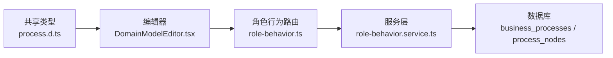

# 业务流程管理模块

<cite>
**本文引用的文件**
- [business-process.md](file://docs/02-domain-model/business-process.md)
- [phase1-database-schema.md](file://docs/05-data-design/phase1-database-schema.md)
- [role-behavior-design.md](file://docs/04-tech-design/role-behavior-design.md)
- [role-behavior.ts](file://packages/api/src/routes/role-behavior.ts)
- [role-behavior.service.ts](file://packages/api/src/services/role-behavior.service.ts)
- [app.ts](file://packages/api/src/app.ts)
- [process.d.ts](file://packages/shared/src/types/process.ts)
- [DomainModelEditor.tsx](file://packages/web/src/components/domain-model/DomainModelEditor.tsx)
- [Toolbox.tsx](file://packages/web/src/components/domain-model/canvas/Toolbox.tsx)
- [CanvasSettingsSheet.tsx](file://packages/web/src/components/domain-model/CanvasSettingsSheet.tsx)
- [api-client.ts](file://packages/e2e/helpers/api-client.ts)
</cite>

## 目录
1. [简介](#简介)
2. [项目结构](#项目结构)
3. [核心组件](#核心组件)
4. [架构总览](#架构总览)
5. [详细组件分析](#详细组件分析)
6. [依赖分析](#依赖分析)
7. [性能考虑](#性能考虑)
8. [故障排查指南](#故障排查指南)
9. [结论](#结论)
10. [附录](#附录)

## 简介
本文件面向“业务流程管理模块”的技术文档，围绕流程建模、节点与边的定义、角色行为与流程集成、执行引擎设计、以及用户界面与API规范进行系统化说明。文档基于仓库内已有的领域模型设计、数据库模式、角色行为API设计与前端编辑器组件，形成从定义层到运行时的全景理解。

## 项目结构
业务流程管理模块横跨“定义层设计”“数据库模式”“后端API”“前端编辑器”“共享类型”等多个部分，采用“定义先行、API落地、前端可视化”的分层组织方式。

图表来源
- [business-process.md:1-1378](file://docs/02-domain-model/business-process.md#L1-L1378)
- [phase1-database-schema.md:173-205](file://docs/05-data-design/phase1-database-schema.md#L173-L205)
- [role-behavior-design.md:579-1044](file://docs/04-tech-design/role-behavior-design.md#L579-L1044)
- [role-behavior.ts:1-160](file://packages/api/src/routes/role-behavior.ts#L1-L160)
- [role-behavior.service.ts:30-1044](file://packages/api/src/services/role-behavior.service.ts#L30-L1044)
- [app.ts:136-153](file://packages/api/src/app.ts#L136-L153)
- [DomainModelEditor.tsx:1-44](file://packages/web/src/components/domain-model/DomainModelEditor.tsx#L1-L44)
- [Toolbox.tsx:142-304](file://packages/web/src/components/domain-model/canvas/Toolbox.tsx#L142-L304)
- [CanvasSettingsSheet.tsx:1-34](file://packages/web/src/components/domain-model/CanvasSettingsSheet.tsx#L1-L34)
- [process.d.ts](file://packages/shared/src/types/process.ts)

章节来源
- [business-process.md:1-1378](file://docs/02-domain-model/business-process.md#L1-L1378)
- [phase1-database-schema.md:173-205](file://docs/05-data-design/phase1-database-schema.md#L173-L205)
- [role-behavior-design.md:579-1044](file://docs/04-tech-design/role-behavior-design.md#L579-L1044)
- [role-behavior.ts:1-160](file://packages/api/src/routes/role-behavior.ts#L1-L160)
- [role-behavior.service.ts:30-1044](file://packages/api/src/services/role-behavior.service.ts#L30-L1044)
- [app.ts:136-153](file://packages/api/src/app.ts#L136-L153)
- [DomainModelEditor.tsx:1-44](file://packages/web/src/components/domain-model/DomainModelEditor.tsx#L1-L44)
- [Toolbox.tsx:142-304](file://packages/web/src/components/domain-model/canvas/Toolbox.tsx#L142-L304)
- [CanvasSettingsSheet.tsx:1-34](file://packages/web/src/components/domain-model/CanvasSettingsSheet.tsx#L1-L34)
- [process.d.ts](file://packages/shared/src/types/process.ts)

## 核心组件
- 全局节点池与边池：流程图的底层由“全局节点池 + 全局边池”构成，流程对象仅持有引用ID，避免重复与耦合。
- 节点类型：活动节点（ActivityNode）与判断节点（DecisionNode），分别对应“做什么”和“判断什么”，二者在结构上对称。
- 边关系：四类形态（activity→activity、activity→decision、decision→activity、decision→decision），统一通过映射（mappings）衔接数据流。
- 角色行为：角色的动作（Action）与判断（DecisionDef）的CRUD，支撑流程节点的执行者与分支条件。
- 执行引擎：当前阶段聚焦定义层，运行时引擎（实例化、状态跟踪、异常处理）延后实现。
- 用户界面：领域模型编辑器包含工具箱、画布、设置面板与检查器，支持拖拽创建节点与边、泳道划分与可视化配置。

章节来源
- [business-process.md:91-1378](file://docs/02-domain-model/business-process.md#L91-L1378)
- [phase1-database-schema.md:173-205](file://docs/05-data-design/phase1-database-schema.md#L173-L205)
- [role-behavior-design.md:579-1044](file://docs/04-tech-design/role-behavior-design.md#L579-L1044)
- [DomainModelEditor.tsx:1-44](file://packages/web/src/components/domain-model/DomainModelEditor.tsx#L1-L44)
- [Toolbox.tsx:142-304](file://packages/web/src/components/domain-model/canvas/Toolbox.tsx#L142-L304)
- [CanvasSettingsSheet.tsx:1-34](file://packages/web/src/components/domain-model/CanvasSettingsSheet.tsx#L1-L34)

## 架构总览
业务流程管理模块采用“定义层优先”的架构：先以清晰的数据结构与工作流定义流程，再通过API与前端工具落地。后端以Fastify路由与服务层实现角色行为的CRUD，前端提供拖拽式流程编辑体验。

图表来源
- [role-behavior.ts:1-160](file://packages/api/src/routes/role-behavior.ts#L1-L160)
- [role-behavior.service.ts:30-1044](file://packages/api/src/services/role-behavior.service.ts#L30-L1044)
- [app.ts:136-153](file://packages/api/src/app.ts#L136-L153)
- [DomainModelEditor.tsx:1-44](file://packages/web/src/components/domain-model/DomainModelEditor.tsx#L1-L44)
- [CanvasSettingsSheet.tsx:1-34](file://packages/web/src/components/domain-model/CanvasSettingsSheet.tsx#L1-L34)
- [Toolbox.tsx:142-304](file://packages/web/src/components/domain-model/canvas/Toolbox.tsx#L142-L304)
- [process.d.ts](file://packages/shared/src/types/process.ts)

## 详细组件分析

### 流程建模与数据结构
- 全局池与流程引用：流程对象仅保存节点与边的ID引用，节点与边在全局池中唯一存在，保证复用与一致性。
- 节点类型与对称性：活动节点与判断节点在结构上对称，分别通过actionRef与decisionRef引用角色行为定义。
- 边的四类形态与映射：通过mappings将上游输出映射到下游输入或判断分支输出，确保数据流一致与可追踪。
- 泳道与参与者：编辑器支持按参与者创建泳道，节点归属泳道便于职责划分与可视化。

图表来源
- [business-process.md:91-1378](file://docs/02-domain-model/business-process.md#L91-L1378)
- [phase1-database-schema.md:173-205](file://docs/05-data-design/phase1-database-schema.md#L173-L205)

章节来源
- [business-process.md:91-1378](file://docs/02-domain-model/business-process.md#L91-L1378)
- [phase1-database-schema.md:173-205](file://docs/05-data-design/phase1-database-schema.md#L173-L205)

### 节点设计原理
- 活动节点（ActivityNode）：表示“做什么”，引用角色行为（Action），具备输入/输出I/O定义。
- 判断节点（DecisionNode）：表示“判断什么”，引用角色行为定义（DecisionDef），具备分支集合与条件表达式。
- 执行者（Holder）：节点归属角色、服务或外部实体，决定节点的可执行主体与可见范围。
- 对称性与一致性：活动与判断在结构与引用方式上保持对称，便于统一处理与渲染。

图表来源
- [business-process.md:114-198](file://docs/02-domain-model/business-process.md#L114-L198)

章节来源
- [business-process.md:114-198](file://docs/02-domain-model/business-process.md#L114-L198)

### 边关系配置机制
- 四类形态：活动→活动、活动→判断、判断→活动、判断→判断，分别描述不同数据与控制流组合。
- 唯一性规则：由(source.nodeId, target.nodeId)唯一确定，避免重复边。
- 映射（mappings）：统一承载数据从上游输出到下游输入或分支输出的映射关系，保证数据一致性。
- 分支逻辑：判断节点的分支由DecisionDef定义，分支包含条件表达式与输出集合，驱动后续边的选择。

图表来源
- [business-process.md:239-264](file://docs/02-domain-model/business-process.md#L239-L264)
- [business-process.md:843-872](file://docs/02-domain-model/business-process.md#L843-L872)

章节来源
- [business-process.md:239-264](file://docs/02-domain-model/business-process.md#L239-L264)
- [business-process.md:843-872](file://docs/02-domain-model/business-process.md#L843-L872)

### 角色行为设计与流程集成
- 角色行为（Action/Decision）：在角色维度定义可执行动作与判断分支，支撑流程节点的执行者与分支条件。
- CRUD能力：提供完整的增删改查接口，配合乐观锁与项目状态校验，保障并发安全与数据一致性。
- 集成关系：流程节点通过actionRef/decisionRef引用角色行为，实现“行为即节点”的统一建模。

图表来源
- [role-behavior.ts:1-160](file://packages/api/src/routes/role-behavior.ts#L1-L160)
- [role-behavior.service.ts:30-1044](file://packages/api/src/services/role-behavior.service.ts#L30-L1044)
- [role-behavior-design.md:579-1044](file://docs/04-tech-design/role-behavior-design.md#L579-L1044)

章节来源
- [role-behavior.ts:1-160](file://packages/api/src/routes/role-behavior.ts#L1-L160)
- [role-behavior.service.ts:30-1044](file://packages/api/src/services/role-behavior.service.ts#L30-L1044)
- [role-behavior-design.md:579-1044](file://docs/04-tech-design/role-behavior-design.md#L579-L1044)

### 执行引擎设计（定义层）
- 定义层优先：当前阶段聚焦流程定义与角色行为，执行引擎（实例化、状态跟踪、异常处理）延后实现。
- 并行与同步：一个活动节点的多条出边天然并行，子流程路径同步执行子流程。
- 超时与异常：通过判断分支表达超时/异常后的处理路径，保持定义层的可读性与可演进性。

图表来源
- [business-process.md:1066-1094](file://docs/02-domain-model/business-process.md#L1066-L1094)

章节来源
- [business-process.md:1066-1094](file://docs/02-domain-model/business-process.md#L1066-L1094)

### 用户界面设计
- 编辑器布局：顶部工具栏、可折叠工具箱、主画布/列表区、右侧检查器，支持泳道划分与节点/边创建。
- 工具箱：拖拽创建实体/边界，支持幽灵预览与高亮反馈。
- 画布设置：右侧抽屉式设置面板，持久化到本地存储，支持显示开关与偏好配置。
- 交互流程：拖拽→定位→弹窗创建→写入全局池→流程引用→渲染展示。

图表来源
- [Toolbox.tsx:142-304](file://packages/web/src/components/domain-model/canvas/Toolbox.tsx#L142-L304)
- [DomainModelEditor.tsx:1-44](file://packages/web/src/components/domain-model/DomainModelEditor.tsx#L1-L44)
- [CanvasSettingsSheet.tsx:1-34](file://packages/web/src/components/domain-model/CanvasSettingsSheet.tsx#L1-L34)

章节来源
- [DomainModelEditor.tsx:1-44](file://packages/web/src/components/domain-model/DomainModelEditor.tsx#L1-L44)
- [Toolbox.tsx:142-304](file://packages/web/src/components/domain-model/canvas/Toolbox.tsx#L142-L304)
- [CanvasSettingsSheet.tsx:1-34](file://packages/web/src/components/domain-model/CanvasSettingsSheet.tsx#L1-L34)

### API接口规范
- 路由前缀：/api/v1/projects/:projectId/roles/:roleId
- 端点清单：
  - GET /actions — 查询动作列表
  - POST /actions — 创建动作
  - PUT /actions/:actionId — 更新动作
  - DELETE /actions/:actionId — 删除动作
  - GET /decisions — 查询判断列表
  - POST /decisions — 创建判断
  - PUT /decisions/:decisionId — 更新判断
  - DELETE /decisions/:decisionId — 删除判断
- 响应格式：列表查询返回data数组；创建返回data包含对象与版本号；错误返回标准化错误结构。

章节来源
- [role-behavior-design.md:1273-1300](file://docs/04-tech-design/role-behavior-design.md#L1273-L1300)
- [role-behavior.ts:1-160](file://packages/api/src/routes/role-behavior.ts#L1-L160)

## 依赖分析
- 定义层对数据库的依赖：流程表与节点/边池的引用关系，确保流程对象轻量且可复用。
- 后端对共享类型的依赖：前端与后端共享流程类型定义，保证前后端契约一致。
- 前端对后端API的依赖：编辑器通过API获取/更新角色行为与流程定义，实现可视化配置与持久化。

图表来源
- [process.d.ts](file://packages/shared/src/types/process.ts)
- [DomainModelEditor.tsx:1-44](file://packages/web/src/components/domain-model/DomainModelEditor.tsx#L1-L44)
- [role-behavior.ts:1-160](file://packages/api/src/routes/role-behavior.ts#L1-L160)
- [role-behavior.service.ts:30-1044](file://packages/api/src/services/role-behavior.service.ts#L30-L1044)
- [phase1-database-schema.md:173-205](file://docs/05-data-design/phase1-database-schema.md#L173-L205)

章节来源
- [process.d.ts](file://packages/shared/src/types/process.ts)
- [DomainModelEditor.tsx:1-44](file://packages/web/src/components/domain-model/DomainModelEditor.tsx#L1-L44)
- [role-behavior.ts:1-160](file://packages/api/src/routes/role-behavior.ts#L1-L160)
- [role-behavior.service.ts:30-1044](file://packages/api/src/services/role-behavior.service.ts#L30-L1044)
- [phase1-database-schema.md:173-205](file://docs/05-data-design/phase1-database-schema.md#L173-L205)

## 性能考虑
- 全局池去重：节点与边在全局池中唯一存在，减少冗余与提升复用效率。
- 边唯一性：按(source.nodeId, target.nodeId)唯一确定，避免重复边带来的渲染与遍历开销。
- JSONB写回：角色行为数组采用JSONB原子写回与乐观锁，降低并发冲突概率。
- 前端渲染：工具箱幽灵预览与高亮反馈减少不必要的DOM重排，提升拖拽体验。

## 故障排查指南
- 项目状态限制：归档项目禁止修改角色行为，需检查项目状态后再操作。
- 乐观锁冲突：版本不匹配导致写回失败，提示“数据已被他人修改，请刷新后重试”。
- 引用完整性：删除动作/判断前需确保未被流程节点引用（预留检查，后续实现）。
- API错误：统一错误响应包含错误码与消息，便于前端提示与日志追踪。

章节来源
- [role-behavior.service.ts:30-1044](file://packages/api/src/services/role-behavior.service.ts#L30-L1044)
- [api-client.ts:1-51](file://packages/e2e/helpers/api-client.ts#L1-L51)

## 结论
业务流程管理模块以“全局池 + 流程引用”的定义层设计为核心，结合角色行为的CRUD能力与前端可视化编辑器，形成从定义到落地的完整闭环。当前阶段重点在于稳定定义与API，运行时引擎将在后续版本完善。建议在开发中严格遵循共享类型契约、乐观锁策略与泳道划分原则，确保流程可读性与可维护性。

## 附录
- 流程定义示例：参见“数据流示例（decision → activity）”章节，展示从活动节点到判断节点再到活动节点的数据映射与分支逻辑。
- 最佳实践：
  - 优先使用全局池中的现有节点/判断，避免重复创建。
  - 通过mappings明确上游输出到下游输入的映射关系。
  - 在判断节点中为每个分支提供清晰的条件表达式与输出集合。
  - 使用泳道划分职责边界，提升流程可读性。
  - 通过画布设置面板调整显示偏好，优化编辑体验。

章节来源
- [business-process.md:843-872](file://docs/02-domain-model/business-process.md#L843-L872)
- [CanvasSettingsSheet.tsx:1-34](file://packages/web/src/components/domain-model/CanvasSettingsSheet.tsx#L1-L34)