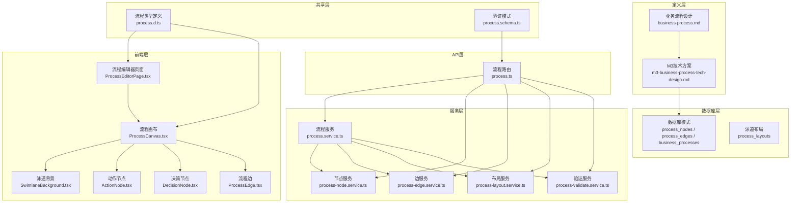
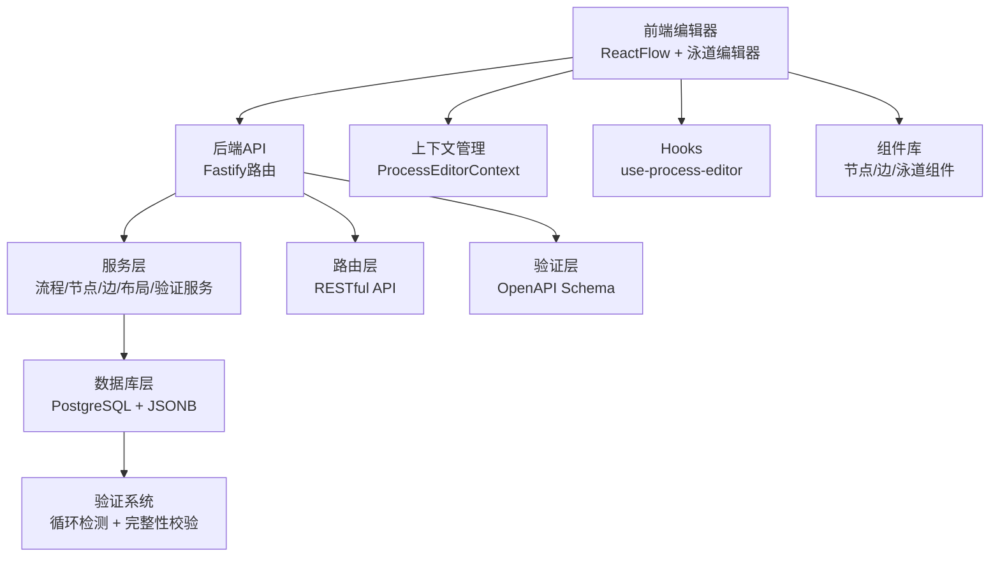
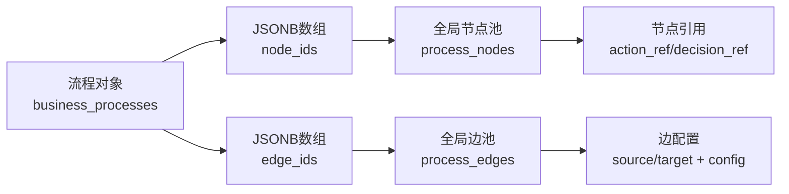
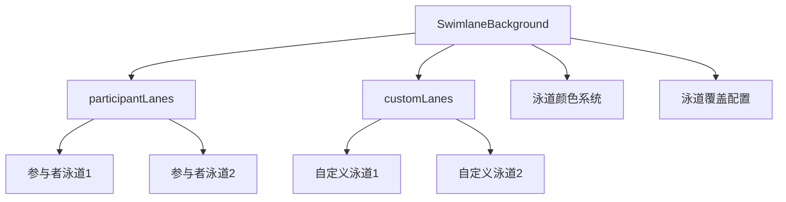
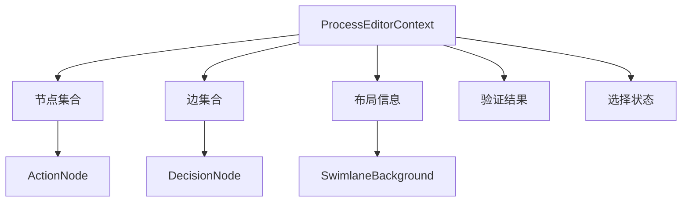
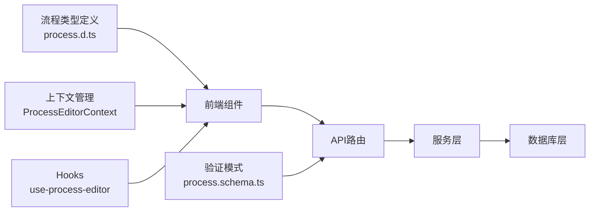

# 业务流程管理模块

<cite>
**本文引用的文件**
- [m3-business-process-tech-design.md](file://docs/04-tech-design/modules/business-process/m3-business-process-tech-design.md)
- [business-process.md](file://docs/02-domain-model/business-process.md)
- [process.ts](file://packages/api/src/routes/process.ts)
- [process.service.ts](file://packages/api/src/services/process.service.ts)
- [process-node.service.ts](file://packages/api/src/services/process-node.service.ts)
- [process-edge.service.ts](file://packages/api/src/services/process-edge.service.ts)
- [process-layout.service.ts](file://packages/api/src/services/process-layout.service.ts)
- [process-validate.service.ts](file://packages/api/src/services/process-validate.service.ts)
- [process.schema.ts](file://packages/validation-schemas/src/process.schema.ts)
- [process.d.ts](file://packages/shared/src/types/process.ts)
- [ProcessEditorPage.tsx](file://packages/web/src/pages/ProcessEditorPage.tsx)
- [ProcessCanvas.tsx](file://packages/web/src/components/process-editor/canvas/ProcessCanvas.tsx)
- [SwimlaneBackground.tsx](file://packages/web/src/components/process-editor/canvas/SwimlaneBackground.tsx)
- [ActionNode.tsx](file://packages/web/src/components/process-editor/canvas/ActionNode.tsx)
- [DecisionNode.tsx](file://packages/web/src/components/process-editor/canvas/DecisionNode.tsx)
- [ProcessEdge.tsx](file://packages/web/src/components/process-editor/canvas/ProcessEdge.tsx)
- [ProcessEditorContext.tsx](file://packages/web/src/contexts/ProcessEditorContext.tsx)
- [use-process-editor.ts](file://packages/web/src/hooks/use-process-editor.ts)
- [ProcessListPage.tsx](file://packages/web/src/pages/ProcessListPage.tsx)
- [ProcessToolbar.tsx](file://packages/web/src/components/process-editor/Toolbar.tsx)
- [ProcessPropertyPanel.tsx](file://packages/web/src/components/process-editor/PropertyPanel.tsx)
- [SelectBehaviorDialog.tsx](file://packages/web/src/components/process-editor/dialogs/SelectBehaviorDialog.tsx)
- [BranchSelectDialog.tsx](file://packages/web/src/components/process-editor/dialogs/BranchSelectDialog.tsx)
- [lane-palette.ts](file://packages/web/src/components/process-editor/canvas/lane-palette.ts)
- [ProcessNodePool.tsx](file://packages/web/src/components/process-editor/NodePool.tsx)
- [ProcessSwimlaneToolbar.tsx](file://packages/web/src/components/process-editor/SwimlaneToolbar.tsx)
</cite>

## 更新摘要
**所做更改**
- 新增完整的M3业务流程管理系统架构说明
- 添加泳道编辑器和双轴泳道系统设计
- 更新数据库模式和数据结构变更
- 新增循环约束校验和验证系统
- 扩展前端组件架构和交互设计
- 更新API接口规范和数据验证规则

## 目录
1. [简介](#简介)
2. [项目结构](#项目结构)
3. [核心组件](#核心组件)
4. [架构总览](#架构总览)
5. [详细组件分析](#详细组件分析)
6. [依赖分析](#依赖分析)
7. [性能考虑](#性能考虑)
8. [故障排查指南](#故障排查指南)
9. [结论](#结论)
10. [附录](#附录)

## 简介
本文档全面介绍M3阶段新增的完整业务流程管理系统，该系统采用"核心三层 + 循环约束 + 泳道编辑器"的设计理念，实现了从流程建模到执行验证的完整闭环。系统包括后端API服务、前端画布组件、泳道管理和验证系统等核心功能模块，为业务流程的数字化管理提供了强大的技术支撑。

## 项目结构
M3业务流程管理系统采用分层架构设计，涵盖定义层、服务层、数据层和表现层四个主要层次，形成了完整的业务流程管理解决方案。



**图表来源**
- [m3-business-process-tech-design.md:17-53](file://docs/04-tech-design/modules/business-process/m3-business-process-tech-design.md#L17-L53)
- [process.ts:1-100](file://packages/api/src/routes/process.ts#L1-L100)
- [process.service.ts:1-200](file://packages/api/src/services/process.service.ts#L1-L200)
- [ProcessEditorPage.tsx:1-50](file://packages/web/src/pages/ProcessEditorPage.tsx#L1-L50)
- [ProcessCanvas.tsx:1-100](file://packages/web/src/components/process-editor/canvas/ProcessCanvas.tsx#L1-L100)

**章节来源**
- [m3-business-process-tech-design.md:17-53](file://docs/04-tech-design/modules/business-process/m3-business-process-tech-design.md#L17-L53)
- [business-process.md:1-100](file://docs/02-domain-model/business-process.md#L1-L100)
- [process.ts:1-100](file://packages/api/src/routes/process.ts#L1-L100)

## 核心组件
M3业务流程管理系统的核心组件包括：

### 数据层组件
- **全局节点池与边池**：采用JSONB数组引用机制，实现节点和边的高效存储与管理
- **泳道布局系统**：支持双轴泳道（参与者轴×自定义轴），提供灵活的流程可视化
- **循环约束校验**：前后端双重校验机制，确保流程图的DAG特性

### 服务层组件
- **流程服务**：提供完整的CRUD操作，支持流程的创建、查询、更新和删除
- **节点服务**：管理活动节点和决策节点的生命周期
- **边服务**：处理节点间的连接关系和数据映射
- **布局服务**：管理泳道配置和节点位置信息
- **验证服务**：执行流程图的完整性检查和循环检测

### 前端组件
- **流程编辑器**：基于ReactFlow的双轴泳道编辑器
- **节点组件**：动作节点和决策节点的可视化表示
- **边组件**：流程边的可视化和交互处理
- **泳道背景**：动态生成的泳道网格背景
- **属性面板**：节点和边的属性配置界面

**章节来源**
- [m3-business-process-tech-design.md:21-43](file://docs/04-tech-design/modules/business-process/m3-business-process-tech-design.md#L21-L43)
- [process.service.ts:1-200](file://packages/api/src/services/process.service.ts#L1-L200)
- [ProcessCanvas.tsx:1-100](file://packages/web/src/components/process-editor/canvas/ProcessCanvas.tsx#L1-L100)

## 架构总览
M3业务流程管理系统采用现代化的全栈架构，从前端ReactFlow编辑器到后端微服务，形成了完整的业务流程管理生态系统。



**图表来源**
- [process.ts:569-642](file://packages/api/src/routes/process.ts#L569-L642)
- [process-validate.service.ts:1-100](file://packages/api/src/services/process-validate.service.ts#L1-L100)
- [ProcessEditorContext.tsx:1-50](file://packages/web/src/contexts/ProcessEditorContext.tsx#L1-L50)

**章节来源**
- [m3-business-process-tech-design.md:983-1004](file://docs/04-tech-design/modules/business-process/m3-business-process-tech-design.md#L983-L1004)
- [process.ts:569-642](file://packages/api/src/routes/process.ts#L569-L642)

## 详细组件分析

### 数据库架构设计
M3系统采用优化的数据库架构，通过JSONB数组实现全局池引用机制，显著提升了数据存储和查询效率。

#### 核心表结构变更
- **process_nodes表**：移除冗余的inputs/outputs字段，新增action_ref和decision_ref引用
- **process_edges表**：保留现有字段，在config中补充source branch/target action标识
- **process_layouts表**：新增泳道配置表，支持相对坐标存储
- **business_processes表**：新增node_ids和edge_ids JSONB数组，替代原有的关联表

#### 数据存储优化


**图表来源**
- [m3-business-process-tech-design.md:56-66](file://docs/04-tech-design/modules/business-process/m3-business-process-tech-design.md#L56-L66)

**章节来源**
- [m3-business-process-tech-design.md:56-66](file://docs/04-tech-design/modules/business-process/m3-business-process-tech-design.md#L56-L66)

### 泳道编辑器系统
M3系统引入了创新的双轴泳道编辑器，支持参与者轴和自定义轴的组合布局，提供直观的流程可视化体验。

#### 双轴泳道设计
- **参与者轴**：固定横向布局，按参与者类型排列
- **自定义轴**：灵活的列布局，支持业务场景定制
- **相对坐标系统**：存储{participantLaneIndex, customLaneIndex, offsetX, offsetY}

#### 泳道背景实现


**图表来源**
- [SwimlaneBackground.tsx:27-43](file://packages/web/src/components/process-editor/canvas/SwimlaneBackground.tsx#L27-L43)
- [ProcessCanvas.tsx:180-215](file://packages/web/src/components/process-editor/canvas/ProcessCanvas.tsx#L180-L215)

**章节来源**
- [SwimlaneBackground.tsx:1-43](file://packages/web/src/components/process-editor/canvas/SwimlaneBackground.tsx#L1-L43)
- [ProcessCanvas.tsx:180-215](file://packages/web/src/components/process-editor/canvas/ProcessCanvas.tsx#L180-L215)

### 循环约束校验系统
M3系统实现了前后端双重循环约束校验机制，确保流程图的DAG特性和逻辑正确性。

#### 校验算法
- **前端校验**：实时检测用户操作可能引入的循环
- **后端校验**：保存时执行完整的DAG检测
- **错误报告**：详细的错误信息和修复建议

#### 验证响应格式
```json
{
  "data": {
    "valid": false,
    "errors": [
      {
        "type": "cycle",
        "message": "流程图中存在循环",
        "nodeId": "node_001",
        "edgeId": "edge_001",
        "path": ["node_001", "node_002", "node_003"]
      }
    ]
  }
}
```

**章节来源**
- [m3-business-process-tech-design.md:647-670](file://docs/04-tech-design/modules/business-process/m3-business-process-tech-design.md#L647-L670)
- [process-validate.service.ts:1-100](file://packages/api/src/services/process-validate.service.ts#L1-L100)

### 前端组件架构
M3系统的前端采用模块化的组件架构，基于React和ReactFlow构建了功能丰富的流程编辑器。

#### 组件层次结构
- **页面组件**：ProcessEditorPage.tsx负责整体页面布局
- **画布组件**：ProcessCanvas.tsx管理流程图的渲染和交互
- **节点组件**：ActionNode.tsx和DecisionNode.tsx处理节点的可视化
- **边组件**：ProcessEdge.tsx管理节点间的连接关系
- **工具组件**：SwimlaneBackground.tsx提供泳道背景支持

#### 上下文管理


**图表来源**
- [ProcessEditorContext.tsx:1-50](file://packages/web/src/contexts/ProcessEditorContext.tsx#L1-L50)
- [ProcessCanvas.tsx:217-233](file://packages/web/src/components/process-editor/canvas/ProcessCanvas.tsx#L217-L233)

**章节来源**
- [ProcessEditorPage.tsx:1-50](file://packages/web/src/pages/ProcessEditorPage.tsx#L1-L50)
- [ProcessCanvas.tsx:217-233](file://packages/web/src/components/process-editor/canvas/ProcessCanvas.tsx#L217-L233)

### API接口规范
M3系统提供了完整的RESTful API接口，支持流程、节点、边和布局的全生命周期管理。

#### 主要接口路由
- **流程管理**：/api/v1/projects/:projectId/processes
- **节点管理**：/api/v1/projects/:projectId/processes/:processId/nodes
- **边管理**：/api/v1/projects/:projectId/processes/:processId/edges
- **布局管理**：/api/v1/projects/:projectId/processes/:processId/layout
- **验证接口**：/api/v1/projects/:projectId/processes/:processId/validate

#### 数据验证规则
系统采用OpenAPI Schema进行严格的输入验证，确保数据的完整性和安全性。

**章节来源**
- [m3-business-process-tech-design.md:983-1004](file://docs/04-tech-design/modules/business-process/m3-business-process-tech-design.md#L983-L1004)
- [process.schema.ts:126-317](file://packages/validation-schemas/src/process.schema.ts#L126-L317)

## 依赖分析
M3业务流程管理系统建立了清晰的依赖关系，从前端组件到后端服务，形成了完整的依赖链。



**图表来源**
- [process.d.ts:1-100](file://packages/shared/src/types/process.ts#L1-L100)
- [process.ts:1-100](file://packages/api/src/routes/process.ts#L1-L100)
- [process.service.ts:1-200](file://packages/api/src/services/process.service.ts#L1-L200)

**章节来源**
- [process.d.ts:1-100](file://packages/shared/src/types/process.ts#L1-L100)
- [process.ts:1-100](file://packages/api/src/routes/process.ts#L1-L100)

## 性能考虑
M3系统在设计时充分考虑了性能优化，采用了多种策略来提升系统的响应速度和用户体验。

### 数据存储优化
- **JSONB数组引用**：避免重复存储节点和边数据，减少数据库体积
- **相对坐标存储**：简化坐标计算，提升渲染性能
- **泳道缓存**：缓存泳道配置信息，减少重复计算

### 前端性能优化
- **虚拟化渲染**：大量节点时采用虚拟化技术
- **增量更新**：只更新发生变化的部分
- **防抖处理**：对频繁操作进行防抖优化

### 后端性能优化
- **批量操作**：支持批量创建和更新操作
- **连接池管理**：优化数据库连接使用
- **缓存策略**：对常用查询结果进行缓存

## 故障排查指南
M3系统提供了完善的错误处理和故障排查机制，帮助开发者快速定位和解决问题。

### 常见问题及解决方案
- **循环检测失败**：检查流程图是否存在环路，使用验证接口获取详细错误信息
- **泳道布局异常**：确认泳道配置是否正确，检查节点坐标计算逻辑
- **节点引用错误**：验证action_ref和decision_ref是否指向有效的参与者行为
- **API调用失败**：检查请求参数格式，确认OpenAPI Schema验证结果

### 调试工具
- **前端调试**：使用浏览器开发者工具检查React组件状态
- **后端日志**：查看API服务器日志获取详细错误信息
- **数据库监控**：监控查询性能和连接状态

**章节来源**
- [m3-business-process-tech-design.md:647-670](file://docs/04-tech-design/modules/business-process/m3-business-process-tech-design.md#L647-L670)

## 结论
M3业务流程管理系统代表了业务流程管理领域的最新技术成果，通过创新的双轴泳道设计、严格的循环约束校验和高效的前后端架构，为用户提供了强大而易用的流程管理工具。系统的设计理念和技术实现为后续的功能扩展和性能优化奠定了坚实的基础。

## 附录

### 流程定义示例
以下是一个完整的流程定义示例，展示了M3系统的数据结构和配置方式：

```json
{
  "id": "process_001",
  "name": "审批流程",
  "node_ids": ["node_001", "node_002", "node_003"],
  "edge_ids": ["edge_001", "edge_002"],
  "layout": {
    "orientation": "participant-horizontal",
    "participantLanes": [
      {"participantId": "role_001", "label": "申请人", "order": 0, "size": 200},
      {"participantId": "role_002", "label": "部门经理", "order": 1, "size": 200}
    ],
    "customLanes": [],
    "nodePositions": {
      "node_001": {"participantLaneIndex": 0, "customLaneIndex": 0, "offsetX": 100, "offsetY": 100}
    }
  }
}
```

### 最佳实践指南
- **泳道设计**：合理规划参与者泳道和自定义泳道，确保流程可视化清晰
- **节点命名**：使用语义化的节点名称，便于流程理解和维护
- **边配置**：为每条流程边配置清晰的标签和条件表达式
- **验证测试**：定期使用验证接口检查流程图的完整性和正确性
- **性能监控**：关注大型流程图的性能表现，及时进行优化

**章节来源**
- [m3-business-process-tech-design.md:647-670](file://docs/04-tech-design/modules/business-process/m3-business-process-tech-design.md#L647-L670)
- [ProcessPropertyPanel.tsx:1-100](file://packages/web/src/components/process-editor/PropertyPanel.tsx#L1-L100)