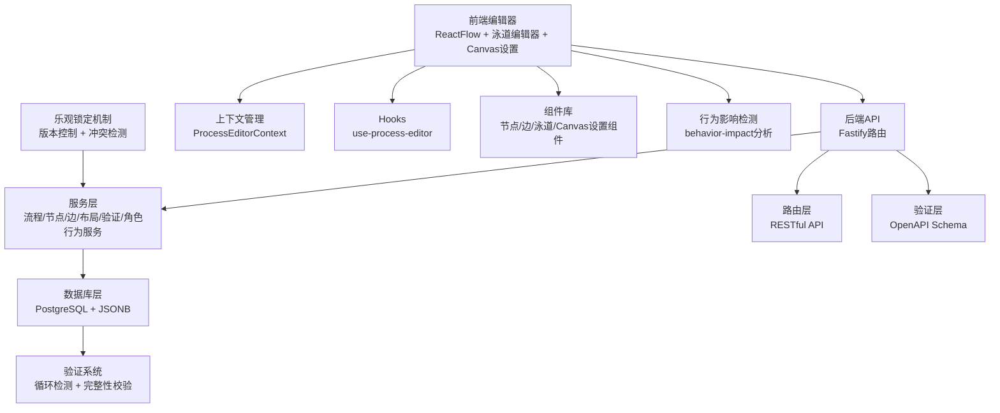
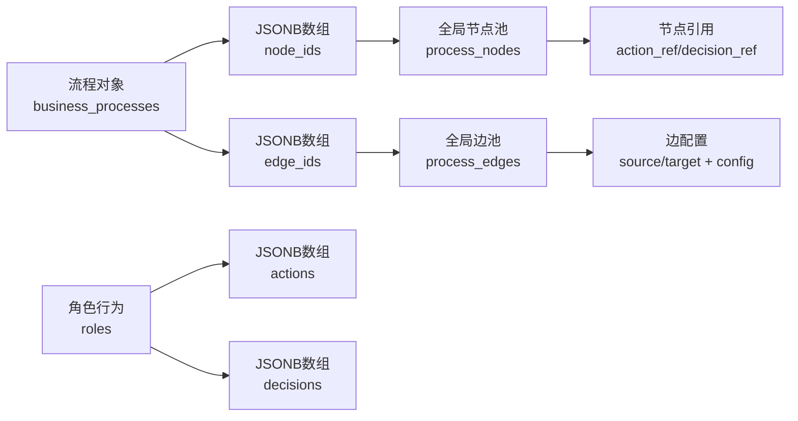
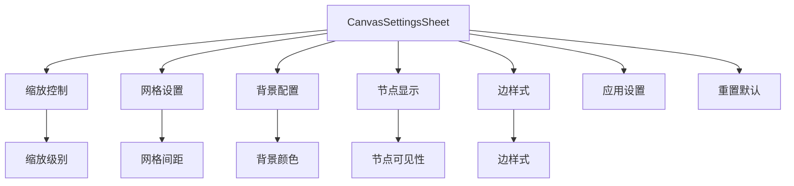
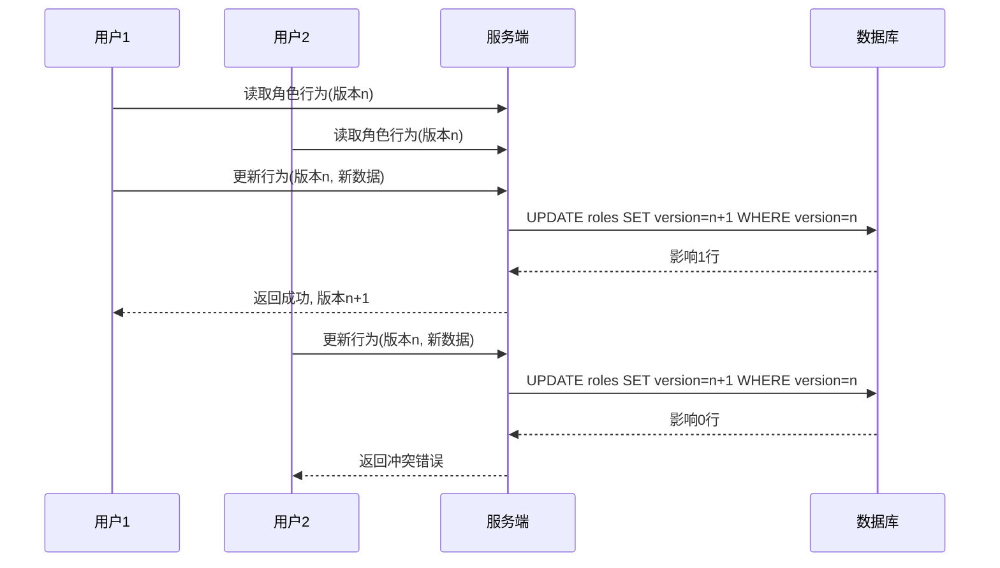
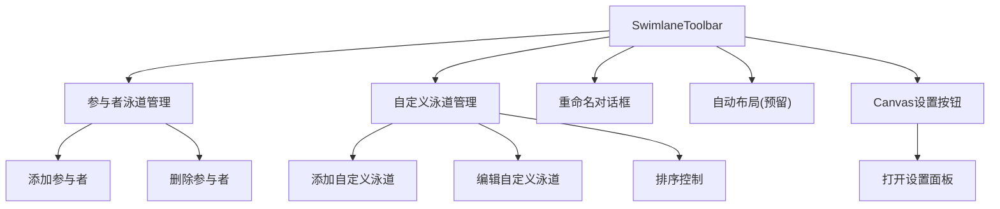
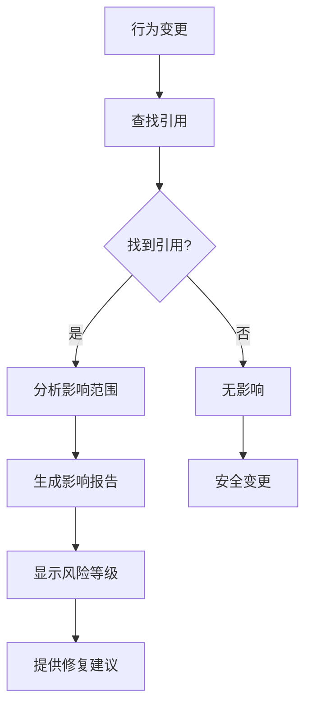
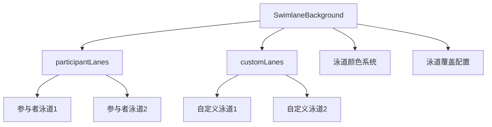
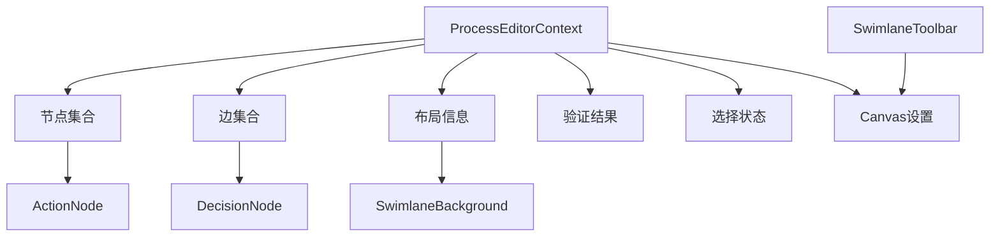
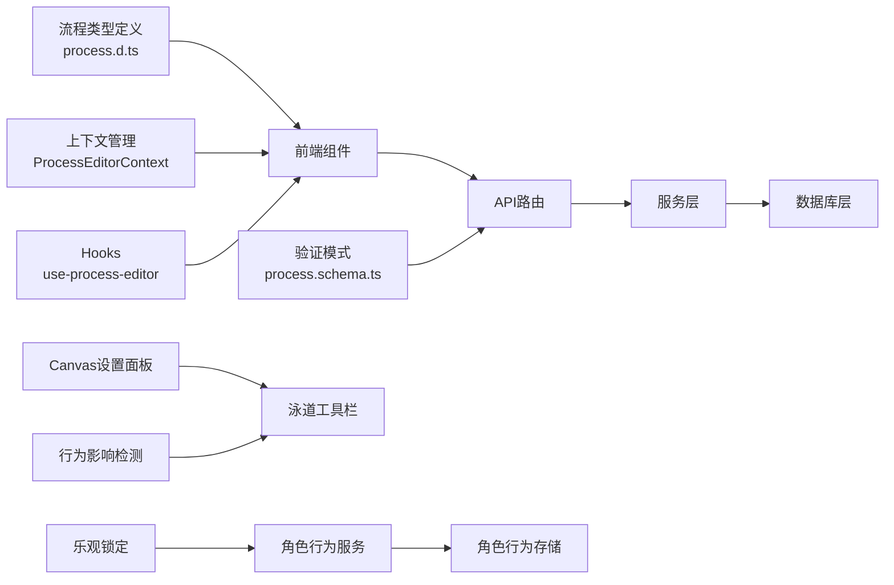

# 业务流程管理模块

<cite>
**本文引用的文件**
- [m3-business-process-tech-design.md](file://docs/04-tech-design/modules/business-process/m3-business-process-tech-design.md)
- [business-process.md](file://docs/02-domain-model/business-process.md)
- [process.ts](file://packages/api/src/routes/process.ts)
- [process.service.ts](file://packages/api/src/services/process.service.ts)
- [process-node.service.ts](file://packages/api/src/services/process-node.service.ts)
- [process-edge.service.ts](file://packages/api/src/services/process-edge.service.ts)
- [process-layout.service.ts](file://packages/api/src/services/process-layout.service.ts)
- [process-validate.service.ts](file://packages/api/src/services/process-validate.service.ts)
- [role-behavior.service.ts](file://packages/api/src/services/role-behavior.service.ts)
- [process.schema.ts](file://packages/validation-schemas/src/process.schema.ts)
- [process.d.ts](file://packages/shared/src/types/process.ts)
- [ProcessEditorPage.tsx](file://packages/web/src/pages/ProcessEditorPage.tsx)
- [ProcessCanvas.tsx](file://packages/web/src/components/process-editor/canvas/ProcessCanvas.tsx)
- [SwimlaneBackground.tsx](file://packages/web/src/components/process-editor/canvas/SwimlaneBackground.tsx)
- [ActionNode.tsx](file://packages/web/src/components/process-editor/canvas/ActionNode.tsx)
- [DecisionNode.tsx](file://packages/web/src/components/process-editor/canvas/DecisionNode.tsx)
- [ProcessEdge.tsx](file://packages/web/src/components/process-editor/canvas/ProcessEdge.tsx)
- [ProcessEditorContext.tsx](file://packages/web/src/contexts/ProcessEditorContext.tsx)
- [use-process-editor.ts](file://packages/web/src/hooks/use-process-editor.ts)
- [ProcessListPage.tsx](file://packages/web/src/pages/ProcessListPage.tsx)
- [ProcessToolbar.tsx](file://packages/web/src/components/process-editor/Toolbar.tsx)
- [ProcessPropertyPanel.tsx](file://packages/web/src/components/process-editor/PropertyPanel.tsx)
- [SelectBehaviorDialog.tsx](file://packages/web/src/components/process-editor/dialogs/SelectBehaviorDialog.tsx)
- [BranchSelectDialog.tsx](file://packages/web/src/components/process-editor/dialogs/BranchSelectDialog.tsx)
- [lane-palette.ts](file://packages/web/src/components/process-editor/canvas/lane-palette.ts)
- [ProcessNodePool.tsx](file://packages/web/src/components/process-editor/NodePool.tsx)
- [ProcessSwimlaneToolbar.tsx](file://packages/web/src/components/process-editor/SwimlaneToolbar.tsx)
- [CanvasSettingsSheet.tsx](file://packages/web/src/components/process-editor/CanvasSettingsSheet.tsx)
- [ProcessEditor.tsx](file://packages/web/src/components/process-editor/ProcessEditor.tsx)
- [behavior-impact.ts](file://packages/web/src/lib/behavior-impact.ts)
</cite>

## 更新摘要
**所做更改**
- 新增Canvas Settings Sheet组件的详细说明
- 实现乐观锁定机制的技术规范和实现细节
- 增强泳道工具栏功能的交互设计和实现
- 添加行为影响检测系统的分析和应用
- 更新前端组件架构以支持新的Canvas Settings功能

## 目录
1. [简介](#简介)
2. [项目结构](#项目结构)
3. [核心组件](#核心组件)
4. [架构总览](#架构总览)
5. [详细组件分析](#详细组件分析)
6. [依赖分析](#依赖分析)
7. [性能考虑](#性能考虑)
8. [故障排查指南](#故障排查指南)
9. [结论](#结论)
10. [附录](#附录)

## 简介
本文档全面介绍M3阶段新增的完整业务流程管理系统，该系统采用"核心三层 + 循环约束 + 泳道编辑器"的设计理念，实现了从流程建模到执行验证的完整闭环。系统包括后端API服务、前端画布组件、泳道管理和验证系统等核心功能模块，为业务流程的数字化管理提供了强大的技术支撑。

**更新** 新增Canvas Settings Sheet组件、乐观锁定机制、增强泳道工具栏功能、行为影响检测系统等重大功能增强。

## 项目结构
M3业务流程管理系统采用分层架构设计，涵盖定义层、服务层、数据层和表现层四个主要层次，形成了完整的业务流程管理解决方案。

```mermaid
graph TB
subgraph "定义层"
BP["业务流程设计<br/>business-process.md"]
M3["M3技术方案<br/>m3-business-process-tech-design.md"]
end
subgraph "数据库层"
DB["数据库模式<br/>process_nodes / process_edges / business_processes"]
LAYOUT["泳道布局<br/>process_layouts"]
BEHAVIOR["角色行为<br/>roles.actions/decisions"]
end
subgraph "服务层"
PS["流程服务<br/>process.service.ts"]
PNS["节点服务<br/>process-node.service.ts"]
PES["边服务<br/>process-edge.service.ts"]
PLS["布局服务<br/>process-layout.service.ts"]
PVS["验证服务<br/>process-validate.service.ts"]
RBS["角色行为服务<br/>role-behavior.service.ts"]
end
subgraph "API层"
PR["流程路由<br/>process.ts"]
end
subgraph "前端层"
PEP["流程编辑器页面<br/>ProcessEditorPage.tsx"]
PC["流程画布<br/>ProcessCanvas.tsx"]
CS["Canvas设置面板<br/>CanvasSettingsSheet.tsx"]
SW["泳道背景<br/>SwimlaneBackground.tsx"]
AN["动作节点<br/>ActionNode.tsx"]
DN["决策节点<br/>DecisionNode.tsx"]
PE["流程边<br/>ProcessEdge.tsx"]
ST["泳道工具栏<br/>SwimlaneToolbar.tsx"]
BI["行为影响检测<br/>behavior-impact.ts"]
end
subgraph "共享层"
PT["流程类型定义<br/>process.d.ts"]
VS["验证模式<br/>process.schema.ts"]
END
M3 --> DB
BP --> M3
PS --> PNS
PS --> PES
PS --> PLS
PS --> PVS
PR --> PS
PR --> PNS
PR --> PES
PR --> PLS
PR --> PVS
PEP --> PC
PC --> CS
PC --> SW
PC --> AN
PC --> DN
PC --> PE
ST --> CS
RBS --> BEHAVIOR
BI --> ST
PT --> PEP
PT --> PC
VS --> PR
```

**图表来源**
- [m3-business-process-tech-design.md:17-53](file://docs/04-tech-design/modules/business-process/m3-business-process-tech-design.md#L17-L53)
- [process.ts:1-100](file://packages/api/src/routes/process.ts#L1-L100)
- [process.service.ts:1-200](file://packages/api/src/services/process.service.ts#L1-L200)
- [role-behavior.service.ts:644-675](file://packages/api/src/services/role-behavior.service.ts#L644-L675)
- [ProcessEditorPage.tsx:1-50](file://packages/web/src/pages/ProcessEditorPage.tsx#L1-L50)
- [ProcessCanvas.tsx:1-100](file://packages/web/src/components/process-editor/canvas/ProcessCanvas.tsx#L1-L100)
- [CanvasSettingsSheet.tsx:1-100](file://packages/web/src/components/process-editor/CanvasSettingsSheet.tsx#L1-L100)

**章节来源**
- [m3-business-process-tech-design.md:17-53](file://docs/04-tech-design/modules/business-process/m3-business-process-tech-design.md#L17-L53)
- [business-process.md:1-100](file://docs/02-domain-model/business-process.md#L1-L100)
- [process.ts:1-100](file://packages/api/src/routes/process.ts#L1-L100)

## 核心组件
M3业务流程管理系统的核心组件包括：

### 数据层组件
- **全局节点池与边池**：采用JSONB数组引用机制，实现节点和边的高效存储与管理
- **泳道布局系统**：支持双轴泳道（参与者轴×自定义轴），提供灵活的流程可视化
- **循环约束校验**：前后端双重校验机制，确保流程图的DAG特性
- **角色行为存储**：JSONB数组存储角色的动作和决策定义，支持版本控制

### 服务层组件
- **流程服务**：提供完整的CRUD操作，支持流程的创建、查询、更新和删除
- **节点服务**：管理活动节点和决策节点的生命周期
- **边服务**：处理节点间的连接关系和数据映射
- **布局服务**：管理泳道配置和节点位置信息
- **验证服务**：执行流程图的完整性检查和循环检测
- **角色行为服务**：管理角色行为的CRUD操作，实现乐观锁定机制

### 前端组件
- **流程编辑器**：基于ReactFlow的双轴泳道编辑器
- **Canvas设置面板**：提供画布级别的配置选项和显示设置
- **节点组件**：动作节点和决策节点的可视化表示
- **边组件**：流程边的可视化和交互处理
- **泳道背景**：动态生成的泳道网格背景
- **泳道工具栏**：增强的泳道管理工具栏，支持Canvas设置
- **属性面板**：节点和边的属性配置界面
- **行为影响检测**：分析行为变更对流程的影响

**更新** 新增Canvas Settings Sheet组件、行为影响检测系统等前端增强功能。

**章节来源**
- [m3-business-process-tech-design.md:21-43](file://docs/04-tech-design/modules/business-process/m3-business-process-tech-design.md#L21-L43)
- [process.service.ts:1-200](file://packages/api/src/services/process.service.ts#L1-L200)
- [role-behavior.service.ts:644-675](file://packages/api/src/services/role-behavior.service.ts#L644-L675)
- [ProcessCanvas.tsx:1-100](file://packages/web/src/components/process-editor/canvas/ProcessCanvas.tsx#L1-L100)

## 架构总览
M3业务流程管理系统采用现代化的全栈架构，从前端ReactFlow编辑器到后端微服务，形成了完整的业务流程管理生态系统。



**图表来源**
- [process.ts:569-642](file://packages/api/src/routes/process.ts#L569-L642)
- [process-validate.service.ts:1-100](file://packages/api/src/services/process-validate.service.ts#L1-L100)
- [ProcessEditorContext.tsx:1-50](file://packages/web/src/contexts/ProcessEditorContext.tsx#L1-L50)
- [role-behavior.service.ts:644-675](file://packages/api/src/services/role-behavior.service.ts#L644-L675)

**章节来源**
- [m3-business-process-tech-design.md:983-1004](file://docs/04-tech-design/modules/business-process/m3-business-process-tech-design.md#L983-L1004)
- [process.ts:569-642](file://packages/api/src/routes/process.ts#L569-L642)

## 详细组件分析

### 数据库架构设计
M3系统采用优化的数据库架构，通过JSONB数组实现全局池引用机制，显著提升了数据存储和查询效率。

#### 核心表结构变更
- **process_nodes表**：移除冗余的inputs/outputs字段，新增action_ref和decision_ref引用
- **process_edges表**：保留现有字段，在config中补充source branch/target action标识
- **process_layouts表**：新增泳道配置表，支持相对坐标存储
- **business_processes表**：新增node_ids和edge_ids JSONB数组，替代原有的关联表
- **roles表**：新增actions和decisions JSONB数组，存储角色行为定义

#### 数据存储优化


**图表来源**
- [m3-business-process-tech-design.md:56-66](file://docs/04-tech-design/modules/business-process/m3-business-process-tech-design.md#L56-L66)

**章节来源**
- [m3-business-process-tech-design.md:56-66](file://docs/04-tech-design/modules/business-process/m3-business-process-tech-design.md#L56-L66)

### Canvas设置面板系统
M3系统新增了Canvas Settings Sheet组件，为用户提供画布级别的配置和显示选项。

#### Canvas设置功能
- **画布缩放控制**：支持手动缩放和自动适配
- **网格显示设置**：可配置网格线的显示和样式
- **背景设置**：支持不同的背景样式和透明度
- **节点显示选项**：控制节点的显示状态和样式
- **边样式配置**：自定义连接线的样式和箭头

#### 设置面板实现


**图表来源**
- [CanvasSettingsSheet.tsx:1-100](file://packages/web/src/components/process-editor/CanvasSettingsSheet.tsx#L1-L100)
- [ProcessEditor.tsx:182](file://packages/web/src/components/process-editor/ProcessEditor.tsx#L182)

**章节来源**
- [CanvasSettingsSheet.tsx:1-100](file://packages/web/src/components/process-editor/CanvasSettingsSheet.tsx#L1-L100)
- [ProcessEditor.tsx:182](file://packages/web/src/components/process-editor/ProcessEditor.tsx#L182)

### 乐观锁定机制
M3系统实现了基于版本号的乐观锁定机制，确保多用户并发编辑时的数据一致性。

#### 乐观锁实现策略
- **角色行级锁定**：对整个roles表行进行版本控制，而非单个行为元素
- **写回策略**：使用原子更新操作，确保数据完整性
- **冲突检测**：通过WHERE条件检查版本号匹配，防止并发修改

#### 锁定流程


**图表来源**
- [role-behavior.service.ts:644-675](file://packages/api/src/services/role-behavior.service.ts#L644-L675)

**章节来源**
- [role-behavior.service.ts:644-675](file://packages/api/src/services/role-behavior.service.ts#L644-L675)
- [role-behavior-design.md:1330-1346](file://docs/04-tech-design/role-behavior-design.md#L1330-L1346)

### 增强的泳道工具栏
M3系统对泳道工具栏进行了重大增强，增加了Canvas设置功能和改进的交互设计。

#### 工具栏功能增强
- **Canvas设置按钮**：新增设置图标按钮，打开Canvas设置面板
- **自动布局预留**：为未来的自动布局功能预留界面
- **改进的泳道管理**：增强的参与者和自定义泳道管理功能
- **实时预览**：设置变更的实时预览和应用

#### 工具栏组件结构


**图表来源**
- [SwimlaneToolbar.tsx:56-457](file://packages/web/src/components/process-editor/SwimlaneToolbar.tsx#L56-L457)

**章节来源**
- [SwimlaneToolbar.tsx:56-457](file://packages/web/src/components/process-editor/SwimlaneToolbar.tsx#L56-L457)

### 行为影响检测系统
M3系统新增了行为影响检测功能，帮助用户理解行为变更对流程的影响。

#### 影响检测功能
- **引用分析**：检测行为在流程节点中的使用情况
- **变更预测**：预测行为修改对现有流程的影响
- **风险评估**：评估行为删除或修改的风险等级
- **影响范围**：显示受影响的流程和节点列表

#### 检测算法


**图表来源**
- [behavior-impact.ts:1](file://packages/web/src/lib/behavior-impact.ts#L1)

**章节来源**
- [behavior-impact.ts:1](file://packages/web/src/lib/behavior-impact.ts#L1)

### 泳道编辑器系统
M3系统引入了创新的双轴泳道编辑器，支持参与者轴和自定义轴的组合布局，提供直观的流程可视化体验。

#### 双轴泳道设计
- **参与者轴**：固定横向布局，按参与者类型排列
- **自定义轴**：灵活的列布局，支持业务场景定制
- **相对坐标系统**：存储{participantLaneIndex, customLaneIndex, offsetX, offsetY}

#### 泳道背景实现


**图表来源**
- [SwimlaneBackground.tsx:27-43](file://packages/web/src/components/process-editor/canvas/SwimlaneBackground.tsx#L27-L43)
- [ProcessCanvas.tsx:180-215](file://packages/web/src/components/process-editor/canvas/ProcessCanvas.tsx#L180-L215)

**章节来源**
- [SwimlaneBackground.tsx:1-43](file://packages/web/src/components/process-editor/canvas/SwimlaneBackground.tsx#L1-L43)
- [ProcessCanvas.tsx:180-215](file://packages/web/src/components/process-editor/canvas/ProcessCanvas.tsx#L180-L215)

### 循环约束校验系统
M3系统实现了前后端双重循环约束校验机制，确保流程图的DAG特性和逻辑正确性。

#### 校验算法
- **前端校验**：实时检测用户操作可能引入的循环
- **后端校验**：保存时执行完整的DAG检测
- **错误报告**：详细的错误信息和修复建议

#### 验证响应格式
```json
{
  "data": {
    "valid": false,
    "errors": [
      {
        "type": "cycle",
        "message": "流程图中存在循环",
        "nodeId": "node_001",
        "edgeId": "edge_001",
        "path": ["node_001", "node_002", "node_003"]
      }
    ]
  }
}
```

**章节来源**
- [m3-business-process-tech-design.md:647-670](file://docs/04-tech-design/modules/business-process/m3-business-process-tech-design.md#L647-L670)
- [process-validate.service.ts:1-100](file://packages/api/src/services/process-validate.service.ts#L1-L100)

### 前端组件架构
M3系统的前端采用模块化的组件架构，基于React和ReactFlow构建了功能丰富的流程编辑器。

#### 组件层次结构
- **页面组件**：ProcessEditorPage.tsx负责整体页面布局
- **画布组件**：ProcessCanvas.tsx管理流程图的渲染和交互
- **Canvas设置组件**：CanvasSettingsSheet.tsx提供画布配置功能
- **节点组件**：ActionNode.tsx和DecisionNode.tsx处理节点的可视化
- **边组件**：ProcessEdge.tsx管理节点间的连接关系
- **工具组件**：SwimlaneBackground.tsx提供泳道背景支持
- **工具栏组件**：Enhanced SwimlaneToolbar.tsx提供增强的泳道管理

#### 上下文管理


**图表来源**
- [ProcessEditorContext.tsx:1-50](file://packages/web/src/contexts/ProcessEditorContext.tsx#L1-L50)
- [ProcessCanvas.tsx:217-233](file://packages/web/src/components/process-editor/canvas/ProcessCanvas.tsx#L217-L233)

**章节来源**
- [ProcessEditorPage.tsx:1-50](file://packages/web/src/pages/ProcessEditorPage.tsx#L1-L50)
- [ProcessCanvas.tsx:217-233](file://packages/web/src/components/process-editor/canvas/ProcessCanvas.tsx#L217-L233)

### API接口规范
M3系统提供了完整的RESTful API接口，支持流程、节点、边、布局和角色行为的全生命周期管理。

#### 主要接口路由
- **流程管理**：/api/v1/projects/:projectId/processes
- **节点管理**：/api/v1/projects/:projectId/processes/:processId/nodes
- **边管理**：/api/v1/projects/:projectId/processes/:processId/edges
- **布局管理**：/api/v1/projects/:projectId/processes/:processId/layout
- **验证接口**：/api/v1/projects/:projectId/processes/:processId/validate
- **角色行为接口**：/api/v1/projects/:projectId/roles/:roleId/actions和/decisions

#### 数据验证规则
系统采用OpenAPI Schema进行严格的输入验证，确保数据的完整性和安全性。

**章节来源**
- [m3-business-process-tech-design.md:983-1004](file://docs/04-tech-design/modules/business-process/m3-business-process-tech-design.md#L983-L1004)
- [process.schema.ts:126-317](file://packages/validation-schemas/src/process.schema.ts#L126-L317)

## 依赖分析
M3业务流程管理系统建立了清晰的依赖关系，从前端组件到后端服务，形成了完整的依赖链。



**图表来源**
- [process.d.ts:1-100](file://packages/shared/src/types/process.ts#L1-L100)
- [process.ts:1-100](file://packages/api/src/routes/process.ts#L1-L100)
- [process.service.ts:1-200](file://packages/api/src/services/process.service.ts#L1-L200)
- [role-behavior.service.ts:644-675](file://packages/api/src/services/role-behavior.service.ts#L644-L675)

**章节来源**
- [process.d.ts:1-100](file://packages/shared/src/types/process.ts#L1-L100)
- [process.ts:1-100](file://packages/api/src/routes/process.ts#L1-L100)

## 性能考虑
M3系统在设计时充分考虑了性能优化，采用了多种策略来提升系统的响应速度和用户体验。

### 数据存储优化
- **JSONB数组引用**：避免重复存储节点和边数据，减少数据库体积
- **相对坐标存储**：简化坐标计算，提升渲染性能
- **泳道缓存**：缓存泳道配置信息，减少重复计算
- **乐观锁优化**：使用原子更新操作，减少锁竞争

### 前端性能优化
- **虚拟化渲染**：大量节点时采用虚拟化技术
- **增量更新**：只更新发生变化的部分
- **防抖处理**：对频繁操作进行防抖优化
- **Canvas设置缓存**：缓存画布设置以提升响应速度

### 后端性能优化
- **批量操作**：支持批量创建和更新操作
- **连接池管理**：优化数据库连接使用
- **缓存策略**：对常用查询结果进行缓存
- **乐观锁冲突处理**：快速检测和处理版本冲突

## 故障排查指南
M3系统提供了完善的错误处理和故障排查机制，帮助开发者快速定位和解决问题。

### 常见问题及解决方案
- **循环检测失败**：检查流程图是否存在环路，使用验证接口获取详细错误信息
- **泳道布局异常**：确认泳道配置是否正确，检查节点坐标计算逻辑
- **节点引用错误**：验证action_ref和decision_ref是否指向有效的参与者行为
- **API调用失败**：检查请求参数格式，确认OpenAPI Schema验证结果
- **乐观锁冲突**：提示用户刷新页面后重试，检查是否有其他用户同时编辑
- **Canvas设置失效**：检查设置面板的权限和配置，确认画布组件的响应

### 调试工具
- **前端调试**：使用浏览器开发者工具检查React组件状态
- **后端日志**：查看API服务器日志获取详细错误信息
- **数据库监控**：监控查询性能和连接状态
- **行为影响分析**：使用行为影响检测工具分析变更影响

**章节来源**
- [m3-business-process-tech-design.md:647-670](file://docs/04-tech-design/modules/business-process/m3-business-process-tech-design.md#L647-L670)

## 结论
M3业务流程管理系统代表了业务流程管理领域的最新技术成果，通过创新的双轴泳道设计、严格的循环约束校验、高效的前后端架构以及新增的Canvas设置面板、乐观锁定机制、增强泳道工具栏和行为影响检测系统，为用户提供了强大而易用的流程管理工具。系统的设计理念和技术实现为后续的功能扩展和性能优化奠定了坚实的基础。

## 附录

### 流程定义示例
以下是一个完整的流程定义示例，展示了M3系统的数据结构和配置方式：

```json
{
  "id": "process_001",
  "name": "审批流程",
  "node_ids": ["node_001", "node_002", "node_003"],
  "edge_ids": ["edge_001", "edge_002"],
  "layout": {
    "orientation": "participant-horizontal",
    "participantLanes": [
      {"participantId": "role_001", "label": "申请人", "order": 0, "size": 200},
      {"participantId": "role_002", "label": "部门经理", "order": 1, "size": 200}
    ],
    "customLanes": [],
    "nodePositions": {
      "node_001": {"participantLaneIndex": 0, "customLaneIndex": 0, "offsetX": 100, "offsetY": 100}
    }
  }
}
```

### 最佳实践指南
- **泳道设计**：合理规划参与者泳道和自定义泳道，确保流程可视化清晰
- **节点命名**：使用语义化的节点名称，便于流程理解和维护
- **边配置**：为每条流程边配置清晰的标签和条件表达式
- **验证测试**：定期使用验证接口检查流程图的完整性和正确性
- **性能监控**：关注大型流程图的性能表现，及时进行优化
- **Canvas设置**：合理配置画布显示选项，提升用户体验
- **行为管理**：使用乐观锁定机制确保多用户协作时的数据一致性
- **影响分析**：在修改行为前使用影响检测系统评估变更风险

**章节来源**
- [m3-business-process-tech-design.md:647-670](file://docs/04-tech-design/modules/business-process/m3-business-process-tech-design.md#L647-L670)
- [ProcessPropertyPanel.tsx:1-100](file://packages/web/src/components/process-editor/PropertyPanel.tsx#L1-L100)
- [role-behavior.service.ts:644-675](file://packages/api/src/services/role-behavior.service.ts#L644-L675)