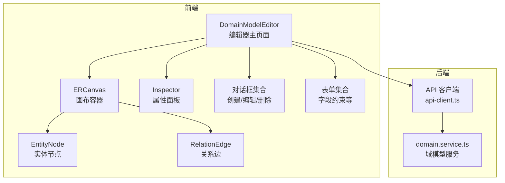
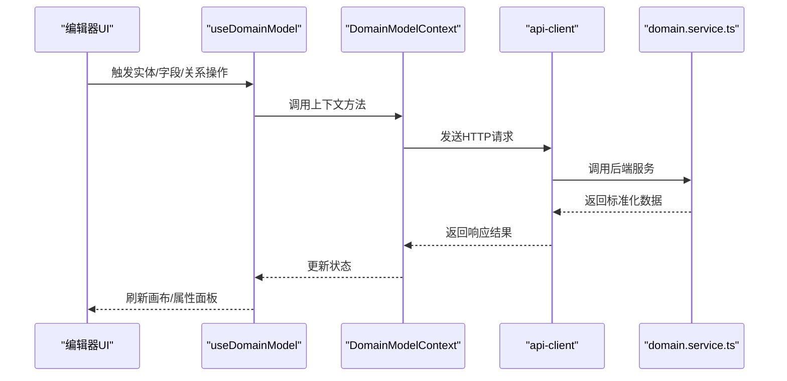
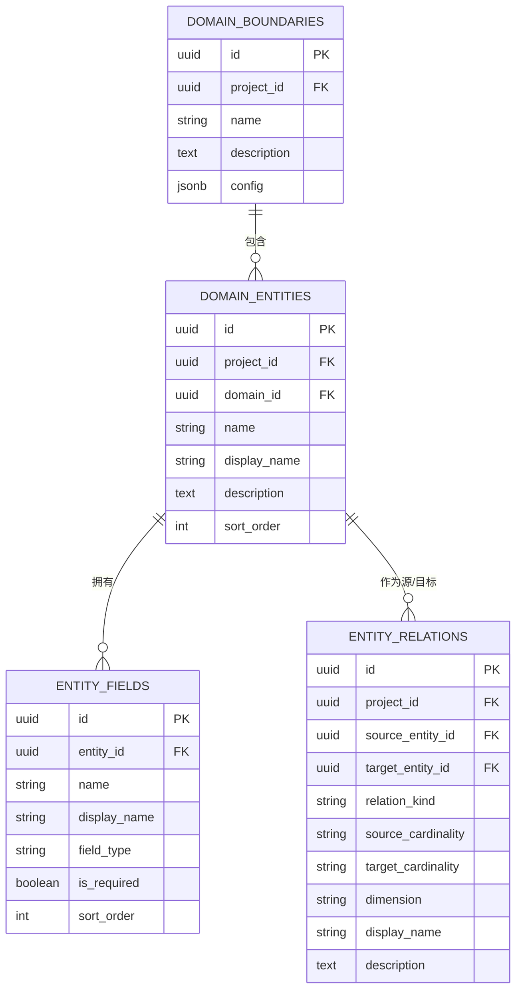
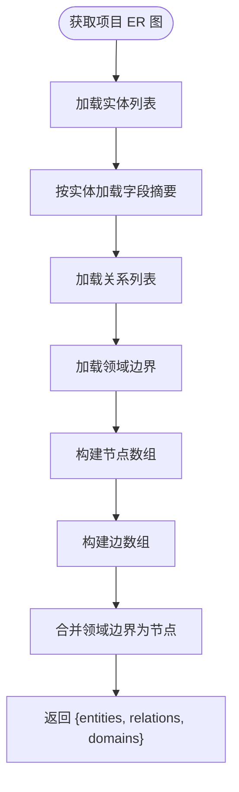
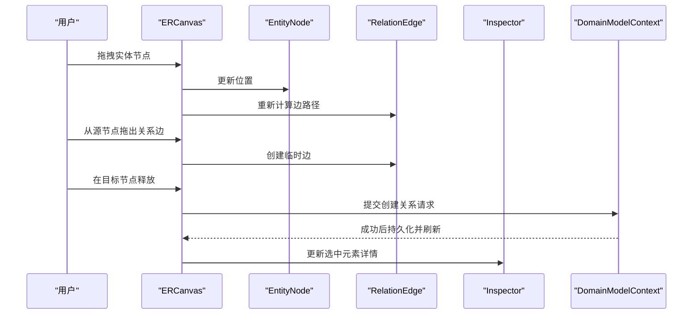
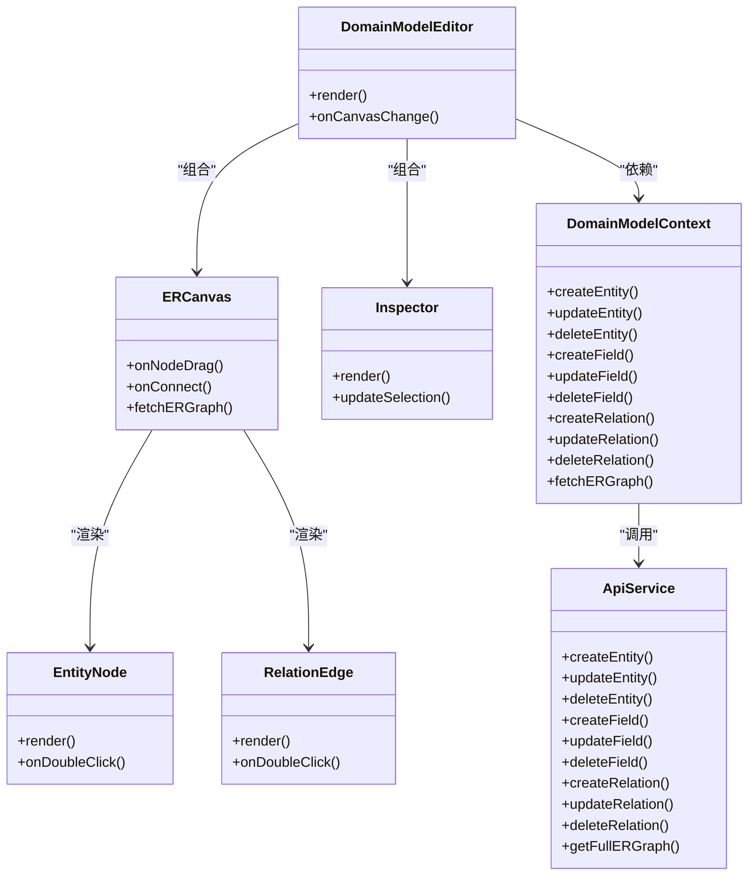
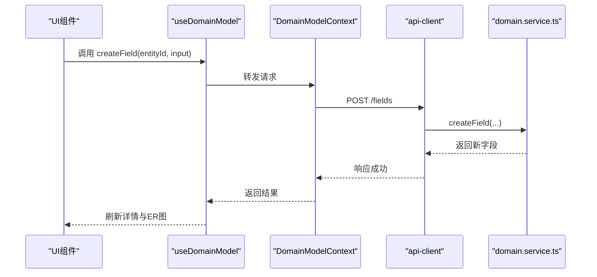
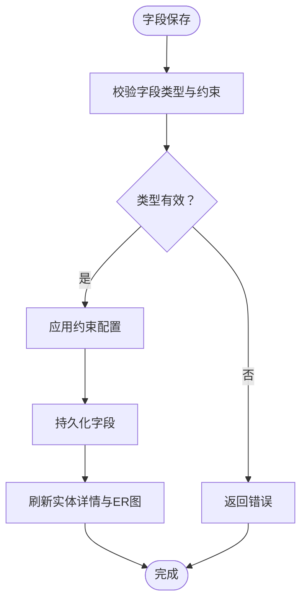
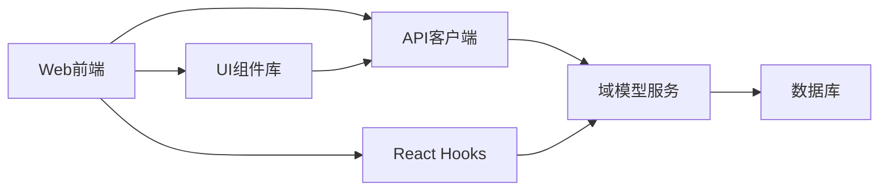

# 域模型管理模块

<cite>
**本文档引用的文件**
- [packages/api/src/services/domain.service.ts](file://packages/api/src/services/domain.service.ts)
- [packages/web/src/hooks/useDomainModel.ts](file://packages/web/src/hooks/useDomainModel.ts)
- [packages/web/src/contexts/DomainModelContext.tsx](file://packages/web/src/contexts/DomainModelContext.tsx)
- [packages/web/src/components/domain-model/DomainModelEditor.tsx](file://packages/web/src/components/domain-model/DomainModelEditor.tsx)
- [packages/web/src/components/domain-model/canvas/ERCanvas.tsx](file://packages/web/src/components/domain-model/canvas/ERCanvas.tsx)
- [packages/web/src/components/domain-model/canvas/EntityNode.tsx](file://packages/web/src/components/domain-model/canvas/EntityNode.tsx)
- [packages/web/src/components/domain-model/canvas/RelationEdge.tsx](file://packages/web/src/components/domain-model/canvas/RelationEdge.tsx)
- [packages/web/src/components/domain-model/dialogs/CreateEntityDialog.tsx](file://packages/web/src/components/domain-model/dialogs/CreateEntityDialog.tsx)
- [packages/web/src/components/domain-model/dialogs/FieldDialog.tsx](file://packages/web/src/components/domain-model/dialogs/FieldDialog.tsx)
- [packages/web/src/components/domain-model/dialogs/RelationDialog.tsx](file://packages/web/src/components/domain-model/dialogs/RelationDialog.tsx)
- [packages/web/src/components/domain-model/forms/FieldConstraintsForm.tsx](file://packages/web/src/components/domain-model/forms/FieldConstraintsForm.tsx)
- [packages/web/src/components/domain-model/inspector/Inspector.tsx](file://packages/web/src/components/domain-model/inspector/Inspector.tsx)
- [packages/web/src/components/domain-model/inspector/FieldsTab.tsx](file://packages/web/src/components/domain-model/inspector/FieldsTab.tsx)
- [packages/web/src/components/domain-model/inspector/RelationsTab.tsx](file://packages/web/src/components/domain-model/inspector/RelationsTab.tsx)
- [packages/web/src/components/domain-model/list/EntityListView.tsx](file://packages/web/src/components/domain-model/list/EntityListView.tsx)
- [packages/web/src/lib/api-client.ts](file://packages/web/src/lib/api-client.ts)
- [docs/02-domain-model/domain-model.md](file://docs/02-domain-model/domain-model.md)
- [docs/04-tech-design/domain-model-tech-design.md](file://docs/04-tech-design/domain-model-tech-design.md)
- [docs/05-data-design/phase1-database-schema.md](file://docs/05-data-design/phase1-database-schema.md)
- [docs/06-test-design/modules/domain-model/f-m2-01-entity/f-m2-01-api.md](file://docs/06-test-design/modules/domain-model/f-m2-01-entity/f-m2-01-api.md)
- [docs/06-test-design/modules/domain-model/f-m2-02-field/f-m2-02-api.md](file://docs/06-test-design/modules/domain-model/f-m2-02-field/f-m2-02-api.md)
- [docs/06-test-design/modules/domain-model/f-m2-03-relation/f-m2-03-api.md](file://docs/06-test-design/modules/domain-model/f-m2-03-relation/f-m2-03-api.md)
- [docs/06-test-design/modules/domain-model/f-m2-04-er-graph/f-m2-04-api.md](file://docs/06-test-design/modules/domain-model/f-m2-04-er-graph/f-m2-04-api.md)
</cite>

## 目录
1. [简介](#简介)
2. [项目结构](#项目结构)
3. [核心组件](#核心组件)
4. [架构总览](#架构总览)
5. [详细组件分析](#详细组件分析)
6. [依赖分析](#依赖分析)
7. [性能考虑](#性能考虑)
8. [故障排除指南](#故障排除指南)
9. [结论](#结论)
10. [附录](#附录)

## 简介
本文件为域模型管理模块的全面技术文档，围绕领域驱动设计（DDD）在本项目中的落地实践展开，覆盖实体建模、字段管理、关系设计、ER 图生成与渲染、API 接口规范、编辑器用户界面以及与业务流程和应用管理的集成方案。文档同时提供架构图、类图、时序图、流程图等可视化表达，并给出性能优化建议与故障排除要点。

## 项目结构
域模型管理模块由前端编辑器与后端服务两大部分组成：
- 前端：基于 React 的编辑器页面，包含画布组件、工具箱、属性面板、对话框与表单等。
- 后端：提供实体、字段、关系及 ER 图的 CRUD 与查询能力，统一输出标准化的节点/边数据结构。

**图表来源**
- [packages/web/src/components/domain-model/DomainModelEditor.tsx](file://packages/web/src/components/domain-model/DomainModelEditor.tsx)
- [packages/web/src/components/domain-model/canvas/ERCanvas.tsx](file://packages/web/src/components/domain-model/canvas/ERCanvas.tsx)
- [packages/web/src/components/domain-model/canvas/EntityNode.tsx](file://packages/web/src/components/domain-model/canvas/EntityNode.tsx)
- [packages/web/src/components/domain-model/canvas/RelationEdge.tsx](file://packages/web/src/components/domain-model/canvas/RelationEdge.tsx)
- [packages/web/src/lib/api-client.ts](file://packages/web/src/lib/api-client.ts)
- [packages/api/src/services/domain.service.ts](file://packages/api/src/services/domain.service.ts)

**章节来源**
- [packages/web/src/components/domain-model/DomainModelEditor.tsx](file://packages/web/src/components/domain-model/DomainModelEditor.tsx)
- [packages/web/src/components/domain-model/canvas/ERCanvas.tsx](file://packages/web/src/components/domain-model/canvas/ERCanvas.tsx)
- [packages/web/src/lib/api-client.ts](file://packages/web/src/lib/api-client.ts)
- [packages/api/src/services/domain.service.ts](file://packages/api/src/services/domain.service.ts)

## 核心组件
- 编辑器主页面：承载画布、工具箱、属性面板与列表视图，协调整体交互。
- 画布组件：负责实体节点与关系边的渲染、拖拽、连线、缩放与布局。
- 实体节点与关系边：封装节点/边的视觉样式与交互行为。
- 属性面板：展示选中元素的详细信息，支持字段与关系的编辑。
- 对话框与表单：提供创建/编辑/删除实体、字段、关系的弹窗与表单。
- API 客户端：封装与后端服务的通信，提供统一的请求/响应处理。
- 域模型服务：后端核心服务，提供实体、字段、关系的增删改查与 ER 图聚合查询。

**章节来源**
- [packages/web/src/components/domain-model/DomainModelEditor.tsx](file://packages/web/src/components/domain-model/DomainModelEditor.tsx)
- [packages/web/src/components/domain-model/canvas/EntityNode.tsx](file://packages/web/src/components/domain-model/canvas/EntityNode.tsx)
- [packages/web/src/components/domain-model/canvas/RelationEdge.tsx](file://packages/web/src/components/domain-model/canvas/RelationEdge.tsx)
- [packages/web/src/components/domain-model/inspector/Inspector.tsx](file://packages/web/src/components/domain-model/inspector/Inspector.tsx)
- [packages/web/src/components/domain-model/dialogs/CreateEntityDialog.tsx](file://packages/web/src/components/domain-model/dialogs/CreateEntityDialog.tsx)
- [packages/web/src/components/domain-model/dialogs/FieldDialog.tsx](file://packages/web/src/components/domain-model/dialogs/FieldDialog.tsx)
- [packages/web/src/components/domain-model/dialogs/RelationDialog.tsx](file://packages/web/src/components/domain-model/dialogs/RelationDialog.tsx)
- [packages/web/src/lib/api-client.ts](file://packages/web/src/lib/api-client.ts)
- [packages/api/src/services/domain.service.ts](file://packages/api/src/services/domain.service.ts)

## 架构总览
域模型管理采用前后端分离架构：
- 前端通过 React Hooks 和 Context 管理状态，调用 API 客户端发起请求。
- 后端提供 REST 风格的域模型服务，统一输出标准化的 ER 图数据结构。
- ER 图数据包含实体节点、关系边与领域边界，便于前端渲染与交互。

**图表来源**
- [packages/web/src/hooks/useDomainModel.ts](file://packages/web/src/hooks/useDomainModel.ts)
- [packages/web/src/contexts/DomainModelContext.tsx](file://packages/web/src/contexts/DomainModelContext.tsx)
- [packages/web/src/lib/api-client.ts](file://packages/web/src/lib/api-client.ts)
- [packages/api/src/services/domain.service.ts](file://packages/api/src/services/domain.service.ts)

## 详细组件分析

### 数据模型与类型系统
- 实体（Entity）：包含标识、名称、显示名、描述、排序、所属项目与领域等元数据。
- 字段（Field）：包含标识、所属实体、名称、显示名、字段类型、是否必填、排序等；支持约束配置。
- 关系（Relation）：包含标识、项目、源/目标实体、关系类型、基数约束、维度、显示名、描述等。
- ER 图（ER Graph）：聚合实体、字段与关系，输出统一的节点/边/领域边界结构，供前端渲染。

**图表来源**
- [packages/api/src/services/domain.service.ts](file://packages/api/src/services/domain.service.ts)
- [docs/05-data-design/phase1-database-schema.md](file://docs/05-data-design/phase1-database-schema.md)

**章节来源**
- [packages/api/src/services/domain.service.ts](file://packages/api/src/services/domain.service.ts)
- [docs/05-data-design/phase1-database-schema.md](file://docs/05-data-design/phase1-database-schema.md)

### ER 图设计原理
- 统一数据结构：节点包含 id、type、position、data；边包含 id、source、target、type、data；领域边界以独立节点形式返回。
- 连接线表示法：边的 type 表示关系类型（如 association、dependency、aggregation、composition、generalization）。
- 基数约束：sourceCardinality/targetCardinality 支持一对一、一对多、多对多等约束表达。
- 边界与领域：返回领域边界节点，便于前端渲染领域框与分组。

**图表来源**
- [packages/api/src/services/domain.service.ts](file://packages/api/src/services/domain.service.ts)

**章节来源**
- [packages/api/src/services/domain.service.ts](file://packages/api/src/services/domain.service.ts)

### API 接口规范（后端服务）
- 实体管理
  - 创建实体：输入项目标识、实体基本信息，返回新实体。
  - 更新实体：支持更新显示名、描述、领域归属等。
  - 删除实体：级联删除字段与关系。
  - 查询实体详情：返回实体及其字段与关系。
- 字段管理
  - 创建字段：指定实体、字段类型、约束等。
  - 更新字段：支持重排、约束变更、显示名等。
  - 删除字段：删除后刷新 ER 图。
  - 重排字段：按排序字段重新排列。
- 关系管理
  - 创建关系：指定源/目标实体、关系类型、基数、维度等。
  - 更新关系：可修改关系类型、基数、显示名、描述、维度。
  - 删除关系：删除后刷新 ER 图。
- ER 图查询
  - 全量 ER 图：返回实体节点、关系边与领域边界。
  - 局部 ER 图：根据实体集合返回子图与关联边界。

**章节来源**
- [packages/api/src/services/domain.service.ts](file://packages/api/src/services/domain.service.ts)

### 前端编辑器与交互
- 画布操作
  - 拖拽：实体节点可拖拽移动，关系边自动跟随。
  - 缩放与平移：支持滚轮缩放与框选。
  - 连线：从实体节点拖出关系边，连接到目标实体。
- 属性面板
  - 实体详情：显示字段列表与关系列表，支持跳转到关系详情。
  - 字段详情：展示字段类型、是否必填、约束等。
  - 关系详情：展示关系类型、基数、维度、显示名与描述。
- 对话框与表单
  - 创建/编辑实体：设置名称、显示名、描述、领域归属。
  - 创建/编辑字段：选择类型、设置是否必填、约束配置。
  - 创建/编辑关系：选择关系类型、设置基数、维度、显示名与描述。
- 实时预览
  - 每次增删改后，自动刷新实体详情与 ER 图，确保 UI 与数据一致。

**图表来源**
- [packages/web/src/components/domain-model/canvas/ERCanvas.tsx](file://packages/web/src/components/domain-model/canvas/ERCanvas.tsx)
- [packages/web/src/components/domain-model/canvas/EntityNode.tsx](file://packages/web/src/components/domain-model/canvas/EntityNode.tsx)
- [packages/web/src/components/domain-model/canvas/RelationEdge.tsx](file://packages/web/src/components/domain-model/canvas/RelationEdge.tsx)
- [packages/web/src/contexts/DomainModelContext.tsx](file://packages/web/src/contexts/DomainModelContext.tsx)

**章节来源**
- [packages/web/src/components/domain-model/canvas/ERCanvas.tsx](file://packages/web/src/components/domain-model/canvas/ERCanvas.tsx)
- [packages/web/src/components/domain-model/canvas/EntityNode.tsx](file://packages/web/src/components/domain-model/canvas/EntityNode.tsx)
- [packages/web/src/components/domain-model/canvas/RelationEdge.tsx](file://packages/web/src/components/domain-model/canvas/RelationEdge.tsx)
- [packages/web/src/contexts/DomainModelContext.tsx](file://packages/web/src/contexts/DomainModelContext.tsx)

### 类与组件关系

**图表来源**
- [packages/web/src/components/domain-model/DomainModelEditor.tsx](file://packages/web/src/components/domain-model/DomainModelEditor.tsx)
- [packages/web/src/components/domain-model/canvas/ERCanvas.tsx](file://packages/web/src/components/domain-model/canvas/ERCanvas.tsx)
- [packages/web/src/components/domain-model/canvas/EntityNode.tsx](file://packages/web/src/components/domain-model/canvas/EntityNode.tsx)
- [packages/web/src/components/domain-model/canvas/RelationEdge.tsx](file://packages/web/src/components/domain-model/canvas/RelationEdge.tsx)
- [packages/web/src/contexts/DomainModelContext.tsx](file://packages/web/src/contexts/DomainModelContext.tsx)
- [packages/api/src/services/domain.service.ts](file://packages/api/src/services/domain.service.ts)

**章节来源**
- [packages/web/src/components/domain-model/DomainModelEditor.tsx](file://packages/web/src/components/domain-model/DomainModelEditor.tsx)
- [packages/web/src/contexts/DomainModelContext.tsx](file://packages/web/src/contexts/DomainModelContext.tsx)
- [packages/api/src/services/domain.service.ts](file://packages/api/src/services/domain.service.ts)

### API 工作流（时序图）

**图表来源**
- [packages/web/src/hooks/useDomainModel.ts](file://packages/web/src/hooks/useDomainModel.ts)
- [packages/web/src/contexts/DomainModelContext.tsx](file://packages/web/src/contexts/DomainModelContext.tsx)
- [packages/web/src/lib/api-client.ts](file://packages/web/src/lib/api-client.ts)
- [packages/api/src/services/domain.service.ts](file://packages/api/src/services/domain.service.ts)

**章节来源**
- [packages/web/src/hooks/useDomainModel.ts](file://packages/web/src/hooks/useDomainModel.ts)
- [packages/web/src/contexts/DomainModelContext.tsx](file://packages/web/src/contexts/DomainModelContext.tsx)
- [packages/web/src/lib/api-client.ts](file://packages/web/src/lib/api-client.ts)
- [packages/api/src/services/domain.service.ts](file://packages/api/src/services/domain.service.ts)

### 复杂逻辑流程（字段约束校验）

**图表来源**
- [packages/web/src/components/domain-model/forms/FieldConstraintsForm.tsx](file://packages/web/src/components/domain-model/forms/FieldConstraintsForm.tsx)
- [packages/web/src/contexts/DomainModelContext.tsx](file://packages/web/src/contexts/DomainModelContext.tsx)

**章节来源**
- [packages/web/src/components/domain-model/forms/FieldConstraintsForm.tsx](file://packages/web/src/components/domain-model/forms/FieldConstraintsForm.tsx)
- [packages/web/src/contexts/DomainModelContext.tsx](file://packages/web/src/contexts/DomainModelContext.tsx)

## 依赖分析
- 前端依赖
  - React Hooks：useDomainModel、DomainModelContext 管理状态与副作用。
  - UI 组件：画布、节点、边、对话框、表单、属性面板等。
  - API 客户端：封装 HTTP 请求与响应处理。
- 后端依赖
  - 数据访问层：统一查询与更新实体、字段、关系与边界。
  - 业务规则：关系类型与基数约束的合法性校验、通用性关系的维度约束等。
- 外部依赖
  - 数据库：存储实体、字段、关系与边界。
  - 前端图形库：React Flow 或类似库用于画布渲染与交互。

**图表来源**
- [packages/web/src/hooks/useDomainModel.ts](file://packages/web/src/hooks/useDomainModel.ts)
- [packages/web/src/contexts/DomainModelContext.tsx](file://packages/web/src/contexts/DomainModelContext.tsx)
- [packages/web/src/lib/api-client.ts](file://packages/web/src/lib/api-client.ts)
- [packages/api/src/services/domain.service.ts](file://packages/api/src/services/domain.service.ts)

**章节来源**
- [packages/web/src/hooks/useDomainModel.ts](file://packages/web/src/hooks/useDomainModel.ts)
- [packages/web/src/contexts/DomainModelContext.tsx](file://packages/web/src/contexts/DomainModelContext.tsx)
- [packages/web/src/lib/api-client.ts](file://packages/web/src/lib/api-client.ts)
- [packages/api/src/services/domain.service.ts](file://packages/api/src/services/domain.service.ts)

## 性能考虑
- 数据加载
  - 分页与懒加载：实体列表与字段列表支持分页，避免一次性加载过多数据。
  - 按需加载：仅在打开实体详情或切换画布时加载对应字段与关系。
- 渲染优化
  - 虚拟化：长列表采用虚拟滚动减少 DOM 节点数量。
  - 稳定键值：节点与边使用稳定 id，避免不必要的重渲染。
- 网络优化
  - 批量请求：合并多次小请求，减少网络往返。
  - 缓存策略：对只读数据（如 ER 图）进行缓存，减少重复请求。
- 数据一致性
  - 并发控制：同一资源的并发操作进行互斥处理，避免脏写。
  - 乐观更新：UI 先本地更新，失败回滚，提升交互流畅度。

## 故障排除指南
- 常见问题
  - 无法创建/更新实体：检查项目标识与实体元数据是否合法。
  - 字段保存失败：确认字段类型与约束配置符合要求。
  - 关系创建异常：检查源/目标实体是否存在、关系类型与基数是否匹配。
  - ER 图不刷新：确认调用刷新函数并检查网络请求状态。
- 排查步骤
  - 查看浏览器控制台与网络面板，定位请求失败原因。
  - 检查后端日志与数据库状态，确认数据一致性。
  - 使用最小复现场景，逐步缩小问题范围。
- 回滚与恢复
  - 乐观更新失败时，回滚本地状态并提示用户重试。
  - 对关键操作增加确认对话框，防止误操作。

**章节来源**
- [packages/web/src/contexts/DomainModelContext.tsx](file://packages/web/src/contexts/DomainModelContext.tsx)
- [packages/api/src/services/domain.service.ts](file://packages/api/src/services/domain.service.ts)

## 结论
域模型管理模块以 DDD 为核心理念，结合前后端协作与标准化的数据结构，实现了从实体建模、字段管理到关系设计与 ER 图渲染的完整闭环。通过清晰的 API 规范、直观的编辑器界面与完善的错误处理机制，该模块能够高效支撑业务流程与应用管理的集成需求。

## 附录
- 设计文档参考
  - [域模型设计文档](file://docs/02-domain-model/domain-model.md)
  - [技术设计文档](file://docs/04-tech-design/domain-model-tech-design.md)
  - [数据库设计文档](file://docs/05-data-design/phase1-database-schema.md)
- 测试用例参考
  - [实体测试用例](file://docs/06-test-design/modules/domain-model/f-m2-01-entity/f-m2-01-api.md)
  - [字段测试用例](file://docs/06-test-design/modules/domain-model/f-m2-02-field/f-m2-02-api.md)
  - [关系测试用例](file://docs/06-test-design/modules/domain-model/f-m2-03-relation/f-m2-03-api.md)
  - [ER 图测试用例](file://docs/06-test-design/modules/domain-model/f-m2-04-er-graph/f-m2-04-api.md)