# 应用管理模块

<cite>
**本文档引用的文件**
- [ApplicationsPage.tsx](file://packages/web/src/pages/ApplicationsPage.tsx)
- [useApplications.ts](file://packages/web/src/hooks/useApplications.ts)
- [ApplicationDetailPage.tsx](file://packages/web/src/pages/ApplicationDetailPage.tsx)
- [ExternalEntityDetailPage.tsx](file://packages/web/src/pages/ExternalEntityDetailPage.tsx)
- [useApplicationBehavior.ts](file://packages/web/src/hooks/useApplicationBehavior.ts)
- [useExternalEntityBehavior.ts](file://packages/web/src/hooks/useExternalEntityBehavior.ts)
- [ExternalEntitiesPanel.tsx](file://packages/web/src/components/project/ExternalEntitiesPanel.tsx)
- [ExternalEntitiesPage.tsx](file://packages/web/src/pages/ExternalEntitiesPage.tsx)
- [application-management-interaction.md](file://docs/03-prd-ux/modules/application-management/application-management-interaction.md)
- [application-management-prd.md](file://docs/03-prd-ux/modules/application-management/application-management-prd.md)
- [mcp-interface.md](file://docs/04-tech-design/mcp-interface.md)
- [project-context-navigation-design.md](file://docs/04-tech-design/project-context-navigation-design.md)
- [Layout.tsx](file://packages/web/src/components/Layout.tsx)
- [ProjectRouteGuard.tsx](file://packages/web/src/components/ProjectRouteGuard.tsx)
- [ProjectContext.tsx](file://packages/web/src/contexts/ProjectContext.tsx)
- [client.ts](file://packages/web/src/api/client.ts)
- [api-client.ts](file://packages/web/src/lib/api-client.ts)
- [DomainModelContext.tsx](file://packages/web/src/contexts/DomainModelContext.tsx)
- [DomainModelEditor.tsx](file://packages/web/src/components/domain-model/DomainModelEditor.tsx)
- [ERCanvas.tsx](file://packages/web/src/components/domain-model/canvas/ERCanvas.tsx)
- [DomainNode.tsx](file://packages/web/src/components/domain-model/canvas/DomainNode.tsx)
- [EntityNode.tsx](file://packages/web/src/components/domain-model/canvas/EntityNode.tsx)
- [RelationEdge.tsx](file://packages/web/src/components/domain-model/canvas/RelationEdge.tsx)
- [Toolbox.tsx](file://packages/web/src/components/domain-model/canvas/Toolbox.tsx)
- [CanvasSettingsSheet.tsx](file://packages/web/src/components/CanvasSettingsSheet.tsx)
- [Toolbar.tsx](file://packages/web/src/components/domain-model/Toolbar.tsx)
- [CreateEntityDialog.tsx](file://packages/web/src/components/domain-model/dialogs/CreateEntityDialog.tsx)
- [DeleteEntityDialog.tsx](file://packages/web/src/components/domain-model/dialogs/DeleteEntityDialog.tsx)
- [FieldDialog.tsx](file://packages/web/src/components/domain-model/dialogs/FieldDialog.tsx)
- [DeleteFieldDialog.tsx](file://packages/web/src/components/domain-model/dialogs/DeleteFieldDialog.tsx)
- [CreateBoundaryDialog.tsx](file://packages/web/src/components/domain-model/dialogs/CreateBoundaryDialog.tsx)
- [DeleteBoundaryDialog.tsx](file://packages/web/src/components/domain-model/dialogs/DeleteBoundaryDialog.tsx)
- [DeleteRelationDialog.tsx](file://packages/web/src/components/domain-model/dialogs/DeleteRelationDialog.tsx)
- [DomainModelInspector.tsx](file://packages/web/src/components/domain-model/inspector/DomainModelInspector.tsx)
- [DomainModelForms.tsx](file://packages/web/src/components/domain-model/forms/DomainModelForms.tsx)
- [DomainModelList.tsx](file://packages/web/src/components/domain-model/list/DomainModelList.tsx)
- [DomainModelToolbar.tsx](file://packages/web/src/components/domain-model/Toolbar.tsx)
</cite>

## 更新摘要
**所做更改**
- 新增应用详情页面和外部实体详情页面的详细技术文档
- 增强应用管理功能，包括行为和决策的双标签页管理
- 扩展行为管理Hook，支持应用和外部实体的统一行为管理
- 完善项目上下文导航体系，支持详情页面的路由配置

## 目录
1. [引言](#引言)
2. [项目结构](#项目结构)
3. [核心组件](#核心组件)
4. [架构总览](#架构总览)
5. [详细组件分析](#详细组件分析)
6. [新增功能详解](#新增功能详解)
7. [依赖关系分析](#依赖关系分析)
8. [性能考虑](#性能考虑)
9. [故障排除指南](#故障排除指南)
10. [结论](#结论)
11. [附录](#附录)

## 引言
本技术文档围绕应用管理模块展开，重点覆盖以下方面：
- 应用页面布局管理：页面创建、编辑、删除的完整流程与数据流
- 区域管理机制：区域定义、属性配置、布局调整的实现方式
- 组件配置系统：组件类型、参数传递、状态管理的架构设计
- 应用管理与项目上下文导航：导航树构建、路由配置、权限控制
- MCP 接口应用：消息传递协议、组件间通信、状态同步机制
- 用户交互设计：界面布局、操作流程、用户体验优化
- **新增功能**：应用详情页面和外部实体详情页面的双标签页管理模式
- **增强功能**：行为和决策的统一管理架构，支持乐观锁版本控制
- 实际配置示例、API 接口规范与集成指导

## 项目结构
应用管理模块位于前端工作区 packages/web 中，采用按功能域划分的目录组织方式。核心页面与业务逻辑集中在 pages 与 hooks 目录，UI 组件分布在 components 子目录，上下文与路由守卫位于 contexts 与 components 根目录。

```mermaid
graph TB
subgraph "应用详情页面层"
ADP["ApplicationDetailPage.tsx"]
EEDP["ExternalEntityDetailPage.tsx"]
end
subgraph "行为管理Hook层"
UAB["useApplicationBehavior.ts"]
UEB["useExternalEntityBehavior.ts"]
end
subgraph "外部实体页面层"
EEP["ExternalEntitiesPage.tsx"]
EEPANEL["ExternalEntitiesPanel.tsx"]
end
subgraph "业务钩子层"
UA["useApplications.ts"]
end
subgraph "上下文与路由"
PC["ProjectContext.tsx"]
PRG["ProjectRouteGuard.tsx"]
LYT["Layout.tsx"]
end
subgraph "领域模型画布"
DME["DomainModelEditor.tsx"]
ERC["ERCanvas.tsx"]
DN["DomainNode.tsx"]
EN["EntityNode.tsx"]
RE["RelationEdge.tsx"]
TBX["Toolbox.tsx"]
CSS["CanvasSettingsSheet.tsx"]
DMT["Toolbar.tsx"]
end
subgraph "对话框与表单"
AFD["ActionFormDialog.tsx"]
DFD["DecisionFormDialog.tsx"]
CED["CreateEntityDialog.tsx"]
DED["DeleteEntityDialog.tsx"]
FD["FieldDialog.tsx"]
CBD["CreateBoundaryDialog.tsx"]
DBD["DeleteBoundaryDialog.tsx"]
DRD["DeleteRelationDialog.tsx"]
end
subgraph "API 客户端"
AC["api-client.ts"]
CL["client.ts"]
end
ADP --> UAB
EEDP --> UEB
EEP --> EEPANEL
UA --> PC
ADP --> LYT
ADP --> PRG
EEDP --> LYT
EEDP --> PRG
DME --> ERC
ERC --> DN
ERC --> EN
ERC --> RE
ERC --> TBX
DME --> CSS
DME --> DMT
DME --> CED
DME --> DED
DME --> FD
DME --> DFD
DME --> CBD
DME --> DBD
DME --> DRD
UAB --> AC
UEB --> AC
AC --> CL
```

**图表来源**
- [ApplicationDetailPage.tsx:1-414](file://packages/web/src/pages/ApplicationDetailPage.tsx#L1-L414)
- [ExternalEntityDetailPage.tsx:1-414](file://packages/web/src/pages/ExternalEntityDetailPage.tsx#L1-L414)
- [useApplicationBehavior.ts:1-139](file://packages/web/src/hooks/useApplicationBehavior.ts#L1-L139)
- [useExternalEntityBehavior.ts:1-139](file://packages/web/src/hooks/useExternalEntityBehavior.ts#L1-L139)
- [ExternalEntitiesPage.tsx:1-30](file://packages/web/src/pages/ExternalEntitiesPage.tsx#L1-L30)
- [ExternalEntitiesPanel.tsx:343-455](file://packages/web/src/components/project/ExternalEntitiesPanel.tsx#L343-L455)

**章节来源**
- [ApplicationsPage.tsx:1-200](file://packages/web/src/pages/ApplicationsPage.tsx#L1-L200)
- [useApplications.ts:1-200](file://packages/web/src/hooks/useApplications.ts#L1-L200)
- [Layout.tsx:1-200](file://packages/web/src/components/Layout.tsx#L1-L200)
- [ProjectRouteGuard.tsx:1-200](file://packages/web/src/components/ProjectRouteGuard.tsx#L1-L200)
- [ProjectContext.tsx:1-200](file://packages/web/src/contexts/ProjectContext.tsx#L1-L200)
- [DomainModelEditor.tsx:1-200](file://packages/web/src/components/domain-model/DomainModelEditor.tsx#L1-L200)
- [ERCanvas.tsx:1-200](file://packages/web/src/components/domain-model/canvas/ERCanvas.tsx#L1-L200)
- [api-client.ts:1-200](file://packages/web/src/lib/api-client.ts#L1-L200)
- [client.ts:1-200](file://packages/web/src/api/client.ts#L1-L200)

## 核心组件
- 应用页面 ApplicationsPage：负责应用列表展示、创建、编辑、删除等主流程入口，协调上下文与业务钩子
- **新增** 应用详情页面 ApplicationDetailPage：提供应用行为和决策的双标签页管理，支持创建、编辑、删除操作
- **新增** 外部实体详情页面 ExternalEntityDetailPage：提供外部实体行为和决策的双标签页管理，支持创建、编辑、删除操作
- **增强** 行为管理Hook：useApplicationBehavior 和 useExternalEntityBehavior 统一管理行为和决策的CRUD操作
- 业务钩子 useApplications：封装应用 CRUD 操作、状态管理与错误处理
- 上下文与路由 ProjectContext/ProjectRouteGuard：提供项目上下文与路由守卫能力，支撑导航与权限控制
- 领域模型画布 DomainModelEditor/ERCanvas：实现区域定义、节点与边的可视化编辑、布局调整
- 对话框与表单：ActionFormDialog、DecisionFormDialog、CreateEntityDialog、DeleteEntityDialog、FieldDialog 等，用于实体、字段、边界、关系的增删改查
- API 客户端：api-client.ts 与 client.ts 提供统一的请求封装与拦截器

**章节来源**
- [ApplicationsPage.tsx:1-200](file://packages/web/src/pages/ApplicationsPage.tsx#L1-L200)
- [ApplicationDetailPage.tsx:1-414](file://packages/web/src/pages/ApplicationDetailPage.tsx#L1-L414)
- [ExternalEntityDetailPage.tsx:1-414](file://packages/web/src/pages/ExternalEntityDetailPage.tsx#L1-L414)
- [useApplicationBehavior.ts:1-139](file://packages/web/src/hooks/useApplicationBehavior.ts#L1-L139)
- [useExternalEntityBehavior.ts:1-139](file://packages/web/src/hooks/useExternalEntityBehavior.ts#L1-L139)
- [ProjectContext.tsx:1-200](file://packages/web/src/contexts/ProjectContext.tsx#L1-L200)
- [ProjectRouteGuard.tsx:1-200](file://packages/web/src/components/ProjectRouteGuard.tsx#L1-L200)
- [DomainModelEditor.tsx:1-200](file://packages/web/src/components/domain-model/DomainModelEditor.tsx#L1-L200)
- [ERCanvas.tsx:1-200](file://packages/web/src/components/domain-model/canvas/ERCanvas.tsx#L1-L200)
- [api-client.ts:1-200](file://packages/web/src/lib/api-client.ts#L1-L200)
- [client.ts:1-200](file://packages/web/src/api/client.ts#L1-L200)

## 架构总览
应用管理模块采用分层架构：
- 表现层：Pages 与 Components 负责 UI 呈现与用户交互
- 业务层：Hooks 封装业务逻辑与状态管理
- 数据层：Contexts 提供上下文共享，API 客户端负责网络请求
- 领域模型层：Domain Model Editor 与 Canvas 提供可视化建模与区域管理

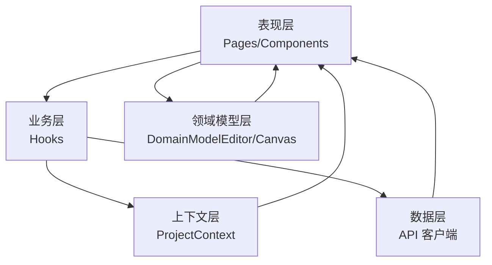

[此图为概念性架构图，不直接映射具体源码文件，故无图表来源]

## 详细组件分析

### 页面布局管理（创建、编辑、删除）
- 创建流程：ApplicationsPage 触发 useApplications 的创建函数，调用 API 客户端完成创建并刷新列表
- 编辑流程：通过对话框或表单收集变更，调用更新接口并同步状态
- 删除流程：确认删除后调用删除接口，清理本地状态并重新渲染

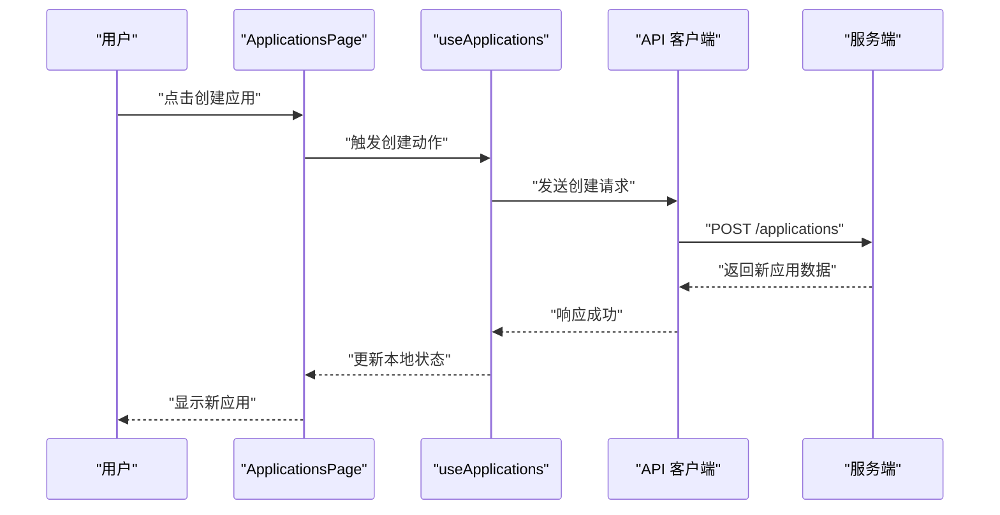

**图表来源**
- [ApplicationsPage.tsx:1-200](file://packages/web/src/pages/ApplicationsPage.tsx#L1-L200)
- [useApplications.ts:1-200](file://packages/web/src/hooks/useApplications.ts#L1-L200)
- [api-client.ts:1-200](file://packages/web/src/lib/api-client.ts#L1-L200)

**章节来源**
- [ApplicationsPage.tsx:1-200](file://packages/web/src/pages/ApplicationsPage.tsx#L1-L200)
- [useApplications.ts:1-200](file://packages/web/src/hooks/useApplications.ts#L1-L200)

### 区域管理机制（定义、属性配置、布局调整）
- 区域定义：在 ERCanvas 中通过工具箱选择区域类型，拖拽生成区域节点
- 属性配置：通过 CanvasSettingsSheet 打开设置面板，配置区域名称、描述、样式等属性
- 布局调整：支持节点拖拽、连线、缩放、对齐等操作，Toolbar 提供常用工具

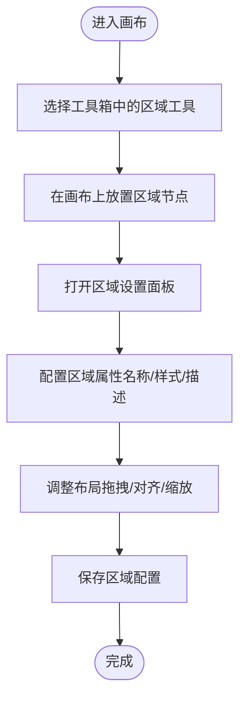

**图表来源**
- [ERCanvas.tsx:1-200](file://packages/web/src/components/domain-model/canvas/ERCanvas.tsx#L1-L200)
- [CanvasSettingsSheet.tsx:1-200](file://packages/web/src/components/CanvasSettingsSheet.tsx#L1-L200)
- [Toolbar.tsx:1-200](file://packages/web/src/components/domain-model/Toolbar.tsx#L1-L200)

**章节来源**
- [ERCanvas.tsx:1-200](file://packages/web/src/components/domain-model/canvas/ERCanvas.tsx#L1-L200)
- [CanvasSettingsSheet.tsx:1-200](file://packages/web/src/components/CanvasSettingsSheet.tsx#L1-L200)
- [DomainNode.tsx:1-200](file://packages/web/src/components/domain-model/canvas/DomainNode.tsx#L1-L200)
- [EntityNode.tsx:1-200](file://packages/web/src/components/domain-model/canvas/EntityNode.tsx#L1-L200)
- [RelationEdge.tsx:1-200](file://packages/web/src/components/domain-model/canvas/RelationEdge.tsx#L1-L200)
- [Toolbox.tsx:1-200](file://packages/web/src/components/domain-model/canvas/Toolbox.tsx#L1-L200)
- [Toolbar.tsx:1-200](file://packages/web/src/components/domain-model/Toolbar.tsx#L1-L200)

### 组件配置系统（类型、参数、状态）
- 组件类型：对话框类组件（CreateEntityDialog、DeleteEntityDialog、FieldDialog 等）用于不同配置场景
- 参数传递：通过 props 向组件传递当前上下文、目标对象 ID、回调函数等
- 状态管理：结合 React Hooks 与 Context，集中管理应用与画布状态，确保组件间一致性

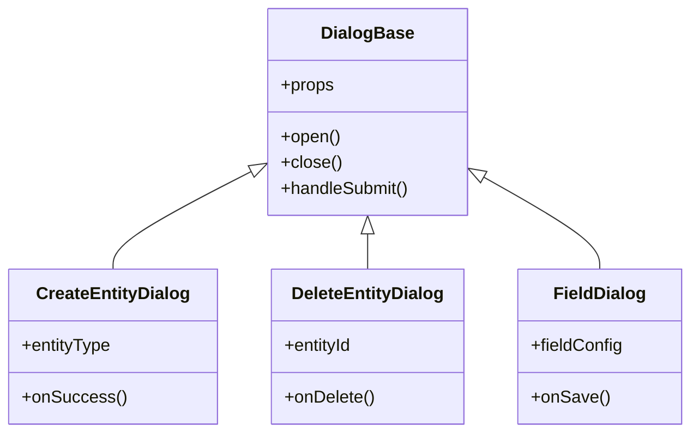

**图表来源**
- [CreateEntityDialog.tsx:1-200](file://packages/web/src/components/domain-model/dialogs/CreateEntityDialog.tsx#L1-L200)
- [DeleteEntityDialog.tsx:1-200](file://packages/web/src/components/domain-model/dialogs/DeleteEntityDialog.tsx#L1-L200)
- [FieldDialog.tsx:1-200](file://packages/web/src/components/domain-model/dialogs/FieldDialog.tsx#L1-L200)

**章节来源**
- [CreateEntityDialog.tsx:1-200](file://packages/web/src/components/domain-model/dialogs/CreateEntityDialog.tsx#L1-L200)
- [DeleteEntityDialog.tsx:1-200](file://packages/web/src/components/domain-model/dialogs/DeleteEntityDialog.tsx#L1-L200)
- [FieldDialog.tsx:1-200](file://packages/web/src/components/domain-model/dialogs/FieldDialog.tsx#L1-L200)

### 应用管理与项目上下文导航
- 导航树构建：基于项目上下文动态生成导航树，支持层级化菜单与面包屑
- 路由配置：通过路由守卫 ProjectRouteGuard 控制访问权限与上下文切换
- 权限控制：结合角色与行为（Role Behavior），在页面加载时校验访问权限

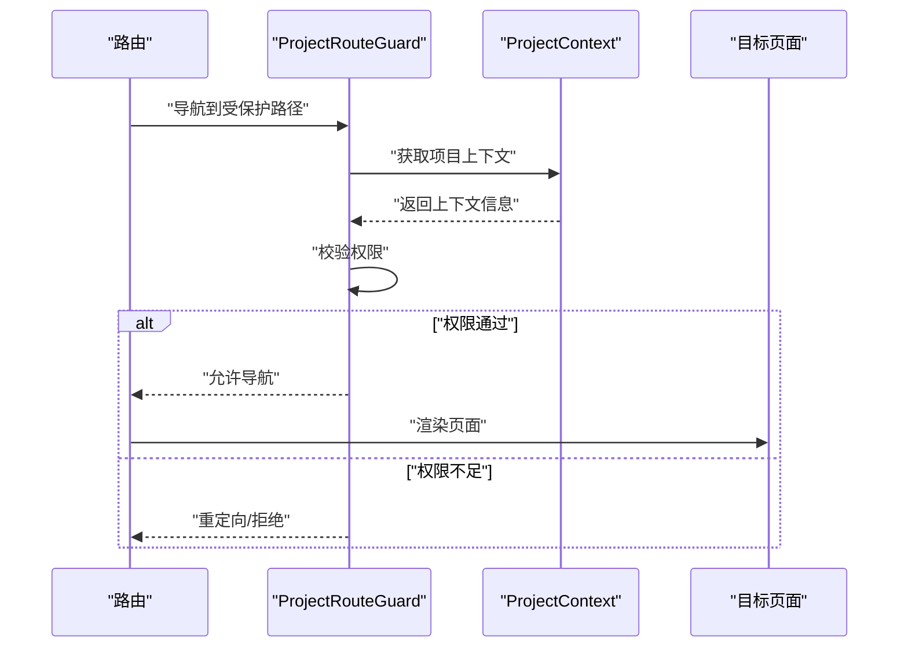

**图表来源**
- [ProjectRouteGuard.tsx:1-200](file://packages/web/src/components/ProjectRouteGuard.tsx#L1-L200)
- [ProjectContext.tsx:1-200](file://packages/web/src/contexts/ProjectContext.tsx#L1-L200)

**章节来源**
- [ProjectRouteGuard.tsx:1-200](file://packages/web/src/components/ProjectRouteGuard.tsx#L1-L200)
- [ProjectContext.tsx:1-200](file://packages/web/src/contexts/ProjectContext.tsx#L1-L200)
- [Layout.tsx:1-200](file://packages/web/src/components/Layout.tsx#L1-L200)

### MCP 接口应用（消息传递、组件通信、状态同步）
- 消息传递协议：通过 MCP 协议在组件间传递事件与状态变更
- 组件间通信：使用 Context 与自定义事件总线实现松耦合通信
- 状态同步：在画布操作与应用状态之间保持一致，避免竞态条件

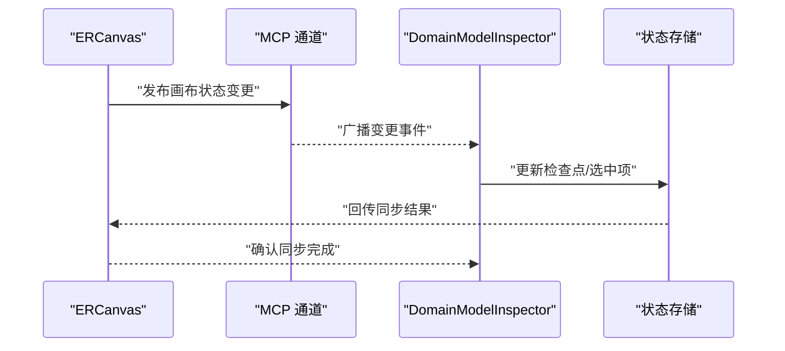

**图表来源**
- [ERCanvas.tsx:1-200](file://packages/web/src/components/domain-model/canvas/ERCanvas.tsx#L1-L200)
- [DomainModelInspector.tsx:1-200](file://packages/web/src/components/domain-model/inspector/DomainModelInspector.tsx#L1-L200)
- [mcp-interface.md:1-200](file://docs/04-tech-design/mcp-interface.md#L1-L200)

**章节来源**
- [mcp-interface.md:1-200](file://docs/04-tech-design/mcp-interface.md#L1-L200)
- [ERCanvas.tsx:1-200](file://packages/web/src/components/domain-model/canvas/ERCanvas.tsx#L1-L200)
- [DomainModelInspector.tsx:1-200](file://packages/web/src/components/domain-model/inspector/DomainModelInspector.tsx#L1-L200)

### 用户交互设计（界面布局、操作流程、体验优化）
- 界面布局：采用侧边栏+内容区的双栏布局，支持折叠与响应式适配
- 操作流程：以"选择-配置-应用"为主线，减少用户认知负担
- 体验优化：提供加载骨架、空状态提示、确认对话框与撤销操作

**章节来源**
- [Layout.tsx:1-200](file://packages/web/src/components/Layout.tsx#L1-L200)
- [application-management-interaction.md:1-200](file://docs/03-prd-ux/modules/application-management/application-management-interaction.md#L1-L200)

## 新增功能详解

### 应用详情页面（ApplicationDetailPage）
应用详情页面提供了应用行为和决策的双标签页管理模式，支持完整的CRUD操作：

- **双标签页设计**：左侧为行为（Actions）标签，右侧为决策（Decisions）标签
- **行为管理**：支持创建、编辑、删除应用行为，显示行为名称、描述、逻辑说明、输入输出参数
- **决策管理**：支持创建、编辑、删除应用决策，显示决策分支和条件
- **乐观锁版本控制**：通过版本号防止并发修改冲突
- **权限控制**：项目归档状态下禁用编辑操作

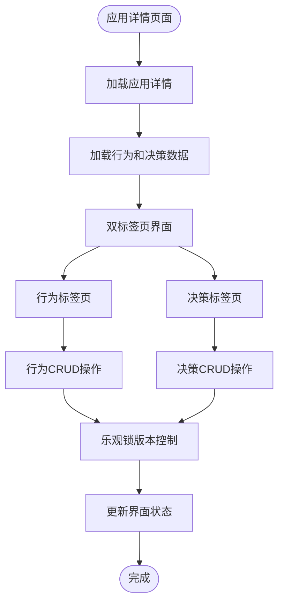

**图表来源**
- [ApplicationDetailPage.tsx:40-414](file://packages/web/src/pages/ApplicationDetailPage.tsx#L40-L414)
- [useApplicationBehavior.ts:51-139](file://packages/web/src/hooks/useApplicationBehavior.ts#L51-L139)

**章节来源**
- [ApplicationDetailPage.tsx:1-414](file://packages/web/src/pages/ApplicationDetailPage.tsx#L1-L414)
- [useApplicationBehavior.ts:1-139](file://packages/web/src/hooks/useApplicationBehavior.ts#L1-L139)

### 外部实体详情页面（ExternalEntityDetailPage）
外部实体详情页面提供了外部实体行为和决策的双标签页管理模式，与应用详情页面具有相同的架构：

- **统一架构**：与应用详情页面相同的双标签页设计和CRUD操作
- **外部实体专用**：专门管理外部实体的行为和决策
- **版本控制**：支持乐观锁版本控制，确保数据一致性
- **权限管理**：根据项目状态控制编辑权限

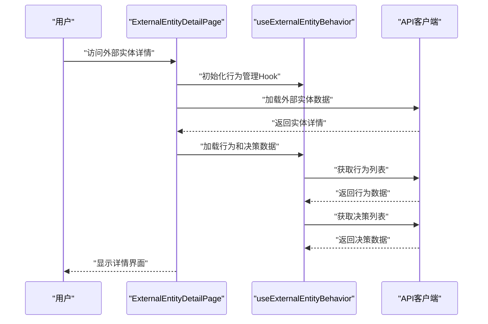

**图表来源**
- [ExternalEntityDetailPage.tsx:40-414](file://packages/web/src/pages/ExternalEntityDetailPage.tsx#L40-L414)
- [useExternalEntityBehavior.ts:51-139](file://packages/web/src/hooks/useExternalEntityBehavior.ts#L51-L139)

**章节来源**
- [ExternalEntityDetailPage.tsx:1-414](file://packages/web/src/pages/ExternalEntityDetailPage.tsx#L1-L414)
- [useExternalEntityBehavior.ts:1-139](file://packages/web/src/hooks/useExternalEntityBehavior.ts#L1-L139)

### 行为管理Hook（统一架构）
新增的行为管理Hook提供了统一的行为和决策管理接口：

- **应用行为Hook**：useApplicationBehavior 管理应用的行为和决策
- **外部实体行为Hook**：useExternalEntityBehavior 管理外部实体的行为和决策
- **统一CRUD接口**：支持创建、读取、更新、删除操作
- **版本控制**：内置乐观锁版本管理
- **数据同步**：自动同步最新数据状态

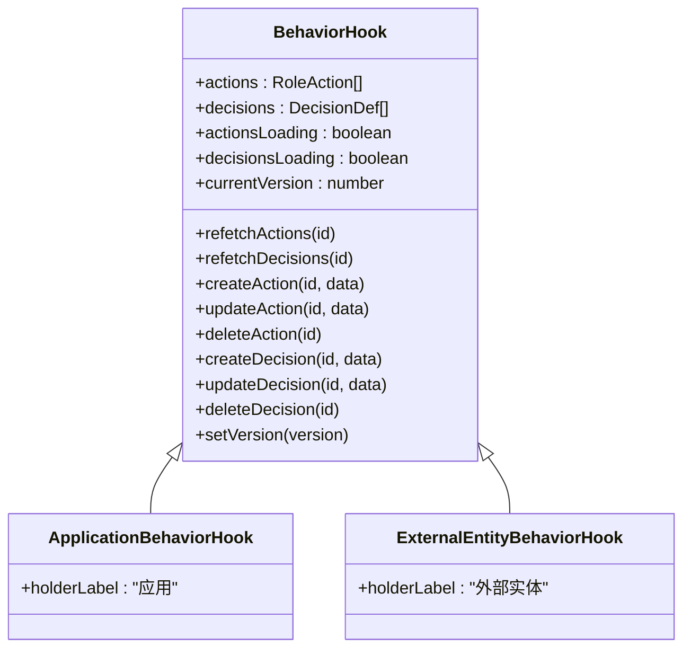

**图表来源**
- [useApplicationBehavior.ts:24-44](file://packages/web/src/hooks/useApplicationBehavior.ts#L24-L44)
- [useExternalEntityBehavior.ts:24-44](file://packages/web/src/hooks/useExternalEntityBehavior.ts#L24-L44)

**章节来源**
- [useApplicationBehavior.ts:1-139](file://packages/web/src/hooks/useApplicationBehavior.ts#L1-L139)
- [useExternalEntityBehavior.ts:1-139](file://packages/web/src/hooks/useExternalEntityBehavior.ts#L1-L139)

### 外部实体管理页面
外部实体管理页面提供了外部实体的列表管理和操作功能：

- **实体列表**：网格布局显示所有外部实体
- **搜索过滤**：支持按名称和类型过滤外部实体
- **操作功能**：支持创建、编辑、删除外部实体
- **导航集成**：点击实体卡片跳转到详情页面

**章节来源**
- [ExternalEntitiesPage.tsx:1-30](file://packages/web/src/pages/ExternalEntitiesPage.tsx#L1-L30)
- [ExternalEntitiesPanel.tsx:343-455](file://packages/web/src/components/project/ExternalEntitiesPanel.tsx#L343-L455)

## 依赖关系分析
- 组件耦合：Pages 与 Hooks 高内聚，通过 Context 解耦上下文依赖
- 外部依赖：API 客户端封装统一请求，便于替换与扩展
- 循环依赖：未发现循环依赖迹象，模块边界清晰
- **新增依赖**：应用详情页面和外部实体详情页面相互独立，但共享相同的行为管理架构

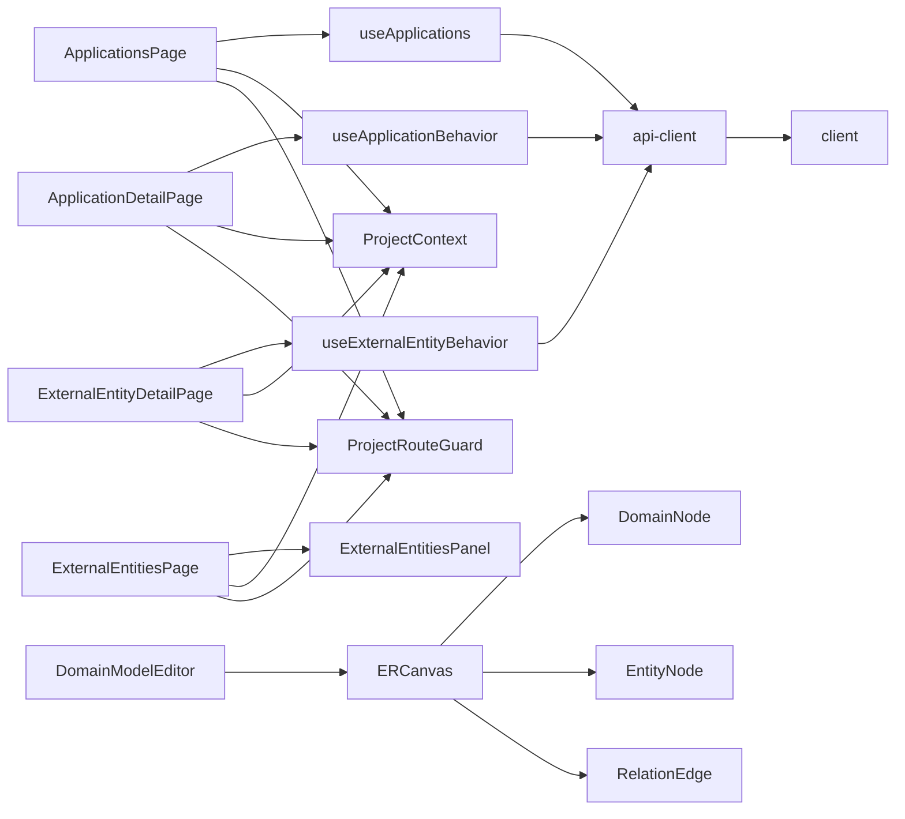

**图表来源**
- [ApplicationsPage.tsx:1-200](file://packages/web/src/pages/ApplicationsPage.tsx#L1-L200)
- [ApplicationDetailPage.tsx:1-414](file://packages/web/src/pages/ApplicationDetailPage.tsx#L1-L414)
- [ExternalEntityDetailPage.tsx:1-414](file://packages/web/src/pages/ExternalEntityDetailPage.tsx#L1-L414)
- [useApplicationBehavior.ts:1-139](file://packages/web/src/hooks/useApplicationBehavior.ts#L1-L139)
- [useExternalEntityBehavior.ts:1-139](file://packages/web/src/hooks/useExternalEntityBehavior.ts#L1-L139)
- [ExternalEntitiesPage.tsx:1-30](file://packages/web/src/pages/ExternalEntitiesPage.tsx#L1-L30)
- [ExternalEntitiesPanel.tsx:343-455](file://packages/web/src/components/project/ExternalEntitiesPanel.tsx#L343-L455)
- [api-client.ts:1-200](file://packages/web/src/lib/api-client.ts#L1-L200)
- [client.ts:1-200](file://packages/web/src/api/client.ts#L1-L200)
- [ProjectContext.tsx:1-200](file://packages/web/src/contexts/ProjectContext.tsx#L1-L200)
- [ProjectRouteGuard.tsx:1-200](file://packages/web/src/components/ProjectRouteGuard.tsx#L1-L200)
- [DomainModelEditor.tsx:1-200](file://packages/web/src/components/domain-model/DomainModelEditor.tsx#L1-L200)
- [ERCanvas.tsx:1-200](file://packages/web/src/components/domain-model/canvas/ERCanvas.tsx#L1-L200)
- [DomainNode.tsx:1-200](file://packages/web/src/components/domain-model/canvas/DomainNode.tsx#L1-L200)
- [EntityNode.tsx:1-200](file://packages/web/src/components/domain-model/canvas/EntityNode.tsx#L1-L200)
- [RelationEdge.tsx:1-200](file://packages/web/src/components/domain-model/canvas/RelationEdge.tsx#L1-L200)

**章节来源**
- [ApplicationsPage.tsx:1-200](file://packages/web/src/pages/ApplicationsPage.tsx#L1-L200)
- [ApplicationDetailPage.tsx:1-414](file://packages/web/src/pages/ApplicationDetailPage.tsx#L1-L414)
- [ExternalEntityDetailPage.tsx:1-414](file://packages/web/src/pages/ExternalEntityDetailPage.tsx#L1-L414)
- [useApplicationBehavior.ts:1-139](file://packages/web/src/hooks/useApplicationBehavior.ts#L1-L139)
- [useExternalEntityBehavior.ts:1-139](file://packages/web/src/hooks/useExternalEntityBehavior.ts#L1-L139)
- [ExternalEntitiesPage.tsx:1-30](file://packages/web/src/pages/ExternalEntitiesPage.tsx#L1-L30)
- [ExternalEntitiesPanel.tsx:343-455](file://packages/web/src/components/project/ExternalEntitiesPanel.tsx#L343-L455)
- [api-client.ts:1-200](file://packages/web/src/lib/api-client.ts#L1-L200)
- [client.ts:1-200](file://packages/web/src/api/client.ts#L1-L200)
- [ProjectContext.tsx:1-200](file://packages/web/src/contexts/ProjectContext.tsx#L1-L200)
- [ProjectRouteGuard.tsx:1-200](file://packages/web/src/components/ProjectRouteGuard.tsx#L1-L200)
- [DomainModelEditor.tsx:1-200](file://packages/web/src/components/domain-model/DomainModelEditor.tsx#L1-L200)
- [ERCanvas.tsx:1-200](file://packages/web/src/components/domain-model/canvas/ERCanvas.tsx#L1-L200)

## 性能考虑
- 渲染优化：使用 React.memo 与 useMemo 缓存计算结果，避免不必要的重渲染
- 请求节流：对高频 API 调用进行防抖/节流，降低网络压力
- 图形渲染：在 ERCanvas 中启用虚拟滚动与增量更新，提升大图渲染性能
- 状态持久化：将关键状态写入本地存储，减少重复请求与初始化时间
- **新增优化**：应用详情页面和外部实体详情页面使用懒加载和分页加载，提升大数据量下的性能表现

## 故障排除指南
- 权限问题：检查路由守卫与项目上下文是否正确初始化
- 网络异常：查看 API 客户端拦截器日志，确认请求头与认证信息
- 画布异常：确认 MCP 通道连接状态与事件订阅是否正常
- 状态不一致：检查 Context Provider 层级与状态合并策略
- **新增问题**：行为管理Hook版本冲突，检查乐观锁版本号是否正确更新

**章节来源**
- [ProjectRouteGuard.tsx:1-200](file://packages/web/src/components/ProjectRouteGuard.tsx#L1-L200)
- [ProjectContext.tsx:1-200](file://packages/web/src/contexts/ProjectContext.tsx#L1-L200)
- [api-client.ts:1-200](file://packages/web/src/lib/api-client.ts#L1-L200)
- [mcp-interface.md:1-200](file://docs/04-tech-design/mcp-interface.md#L1-L200)
- [useApplicationBehavior.ts:1-139](file://packages/web/src/hooks/useApplicationBehavior.ts#L1-L139)
- [useExternalEntityBehavior.ts:1-139](file://packages/web/src/hooks/useExternalEntityBehavior.ts#L1-L139)

## 结论
应用管理模块通过清晰的分层架构与模块化组件，实现了从页面布局到领域模型的全链路管理。新增的应用详情页面和外部实体详情页面进一步增强了系统的功能完整性，提供了统一的行为和决策管理架构。配合 MCP 接口与上下文导航体系，既保证了开发效率，也兼顾了可维护性与用户体验。后续可在性能优化与测试覆盖方面持续改进。

## 附录

### API 接口规范（示例）
- 创建应用
  - 方法：POST
  - 路径：/applications
  - 请求体：包含应用基础信息
  - 响应：新建应用对象
- 更新应用
  - 方法：PUT
  - 路径：/applications/{id}
  - 请求体：应用变更信息
  - 响应：更新后的应用对象
- 删除应用
  - 方法：DELETE
  - 路径：/applications/{id}
  - 响应：删除确认
- **新增** 应用行为管理
  - 获取行为：GET /projects/{projectId}/applications/{appId}/actions
  - 创建行为：POST /projects/{projectId}/applications/{appId}/actions
  - 更新行为：PUT /projects/{projectId}/applications/{appId}/actions/{actionId}
  - 删除行为：DELETE /projects/{projectId}/applications/{appId}/actions/{actionId}
- **新增** 应用决策管理
  - 获取决策：GET /projects/{projectId}/applications/{appId}/decisions
  - 创建决策：POST /projects/{projectId}/applications/{appId}/decisions
  - 更新决策：PUT /projects/{projectId}/applications/{appId}/decisions/{decisionId}
  - 删除决策：DELETE /projects/{projectId}/applications/{appId}/decisions/{decisionId}

**章节来源**
- [useApplications.ts:1-200](file://packages/web/src/hooks/useApplications.ts#L1-L200)
- [useApplicationBehavior.ts:1-139](file://packages/web/src/hooks/useApplicationBehavior.ts#L1-L139)
- [useExternalEntityBehavior.ts:1-139](file://packages/web/src/hooks/useExternalEntityBehavior.ts#L1-L139)
- [api-client.ts:1-200](file://packages/web/src/lib/api-client.ts#L1-L200)

### 集成指导
- 在 Pages 中引入 Hooks，集中处理业务逻辑
- 使用 Context 提供全局状态，避免深层传递
- 通过 MCP 通道实现跨组件通信与状态同步
- 遵循路由守卫与权限控制策略，确保安全访问
- **新增指导**：应用详情页面和外部实体详情页面共享相同的行为管理架构，可复用相同的UI组件和交互模式

**章节来源**
- [ApplicationsPage.tsx:1-200](file://packages/web/src/pages/ApplicationsPage.tsx#L1-L200)
- [ApplicationDetailPage.tsx:1-414](file://packages/web/src/pages/ApplicationDetailPage.tsx#L1-L414)
- [ExternalEntityDetailPage.tsx:1-414](file://packages/web/src/pages/ExternalEntityDetailPage.tsx#L1-L414)
- [ProjectRouteGuard.tsx:1-200](file://packages/web/src/components/ProjectRouteGuard.tsx#L1-L200)
- [ProjectContext.tsx:1-200](file://packages/web/src/contexts/ProjectContext.tsx#L1-L200)
- [mcp-interface.md:1-200](file://docs/04-tech-design/mcp-interface.md#L1-L200)
- [useApplicationBehavior.ts:1-139](file://packages/web/src/hooks/useApplicationBehavior.ts#L1-L139)
- [useExternalEntityBehavior.ts:1-139](file://packages/web/src/hooks/useExternalEntityBehavior.ts#L1-L139)