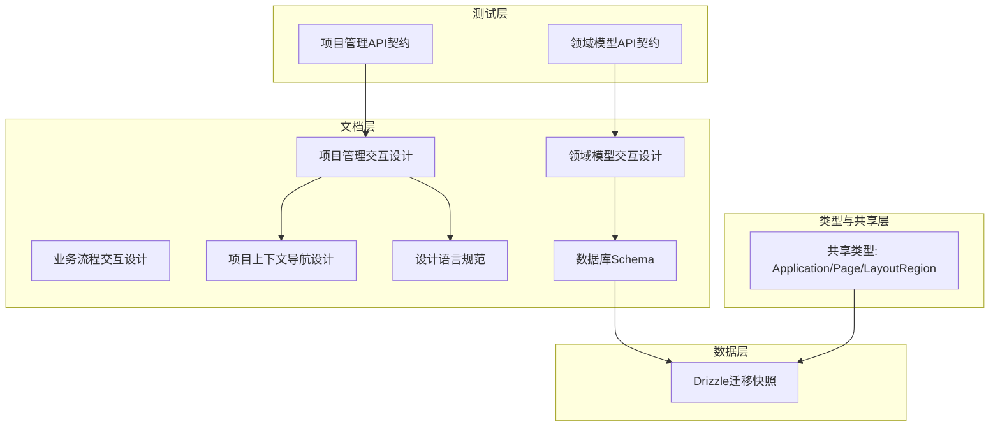
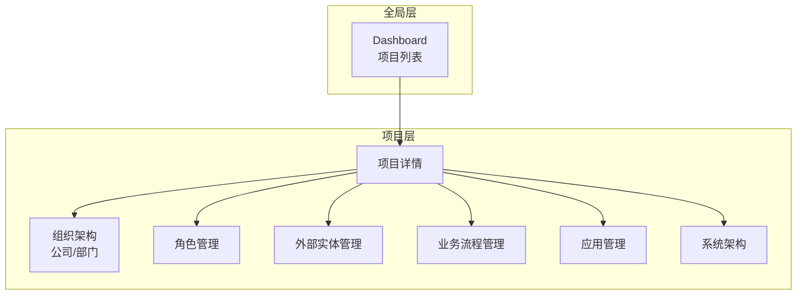
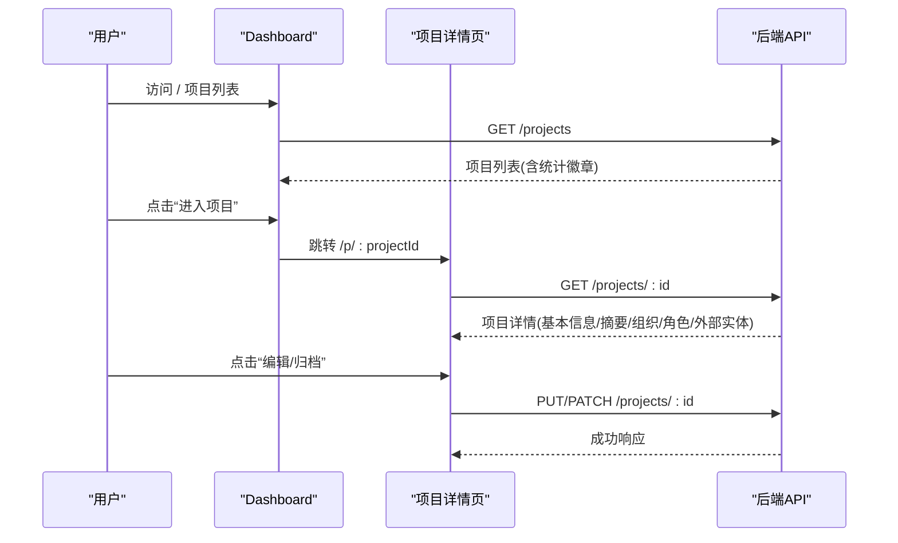
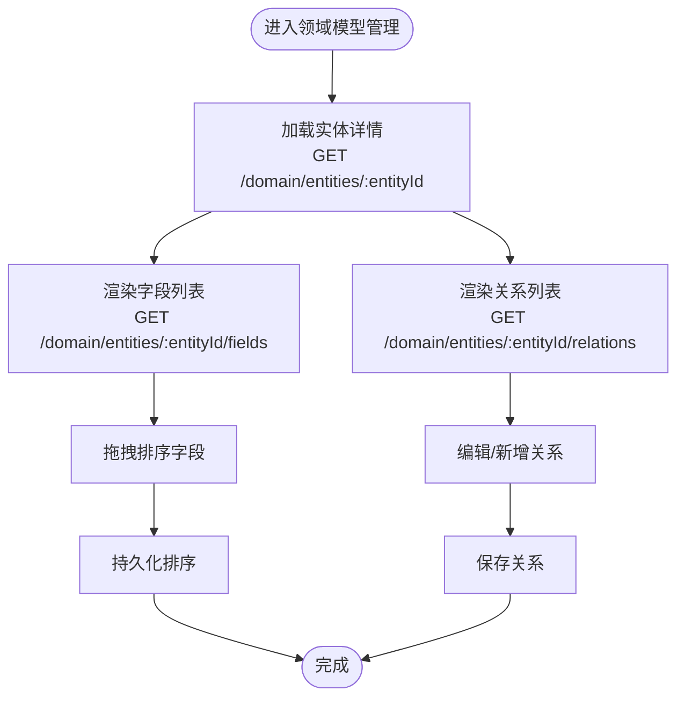
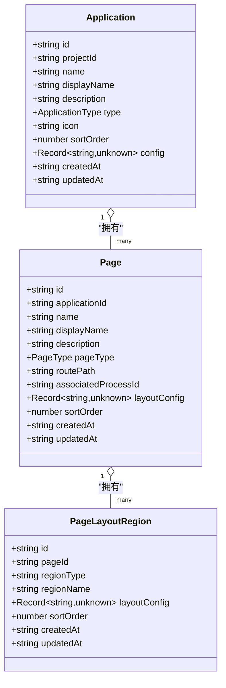
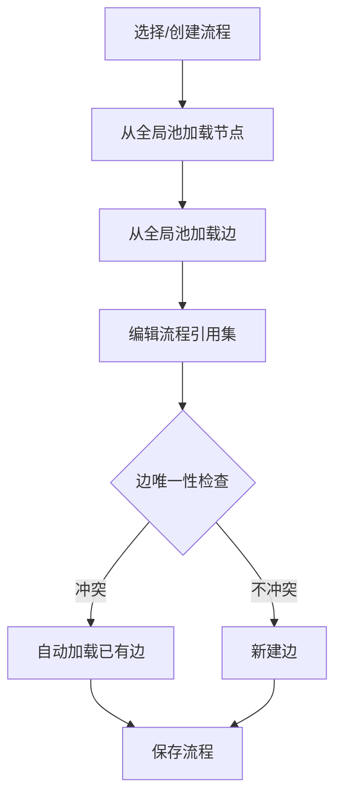
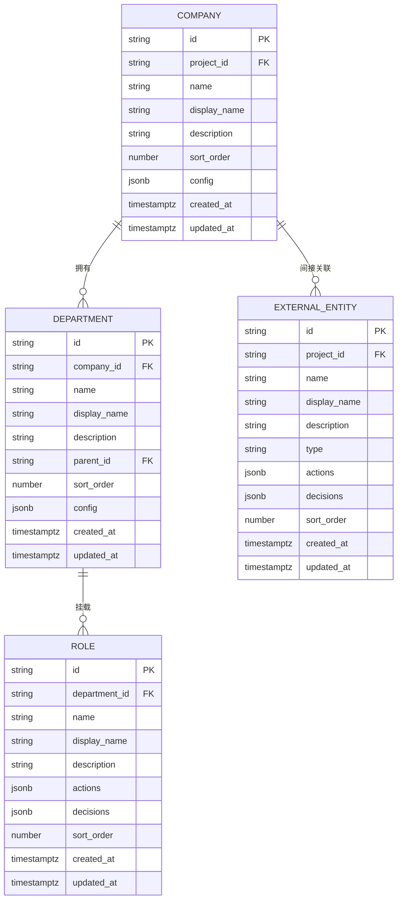
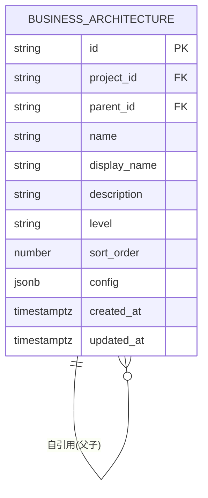
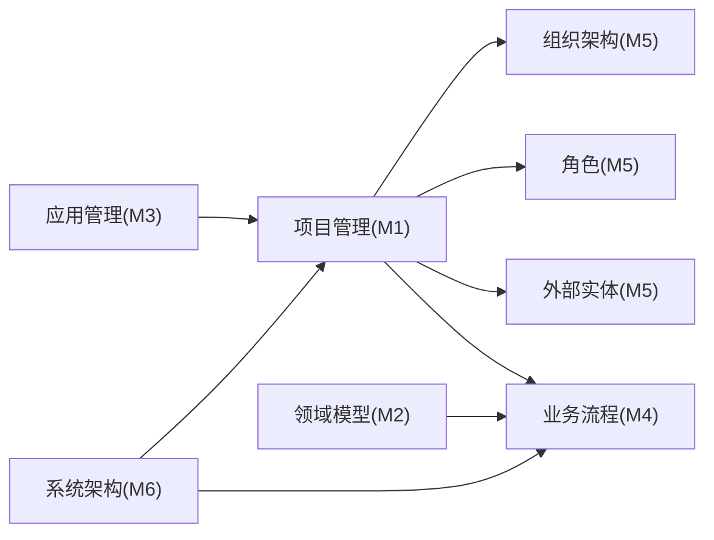

# 核心模块

<cite>
**本文引用的文件**
- [project-management-interaction.md](file://docs/03-prd-ux/modules/project-management/project-management-interaction.md)
- [domain-model-tech-design.md](file://docs/04-tech-design/domain-model-tech-design.md)
- [business-process.md](file://docs/02-domain-model/business-process.md)
- [domain-model.md](file://docs/02-domain-model/domain-model.md)
- [application.ts](file://packages/shared/src/types/application.ts)
- [0006_snapshot.json](file://packages/api/drizzle/migrations/meta/0006_snapshot.json)
- [0005_snapshot.json](file://packages/api/drizzle/migrations/meta/0005_snapshot.json)
- [0001_snapshot.json](file://packages/api/drizzle/migrations/meta/0001_snapshot.json)
- [0002_snapshot.json](file://packages/api/drizzle/migrations/meta/0002_snapshot.json)
- [phase1-database-schema.md](file://docs/05-data-design/phase1-database-schema.md)
- [project-context-navigation-design.md](file://docs/04-tech-design/project-context-navigation-design.md)
- [design-language.md](file://docs/04-tech-design/design-language.md)
- [f-m1-01-api.md](file://docs/06-test-design/modules/project-management/f-m1-01-project-list/f-m1-01-api.md)
- [f-m1-02-api.md](file://docs/06-test-design/modules/project-management/f-m1-02-create-project/f-m1-02-api.md)
- [f-m1-03-api.md](file://docs/06-test-design/modules/project-management/f-m1-03-project-detail/f-m1-03-api.md)
- [f-m1-04-api.md](file://docs/06-test-design/modules/project-management/f-m1-04-edit-project/f-m1-04-api.md)
- [f-m1-05-api.md](file://docs/06-test-design/modules/project-management/f-m1-05-archive/f-m1-05-api.md)
- [f-m1-06-api.md](file://docs/06-test-design/modules/project-management/f-m1-06-company/f-m1-06-api.md)
- [f-m1-07-api.md](file://docs/06-test-design/modules/project-management/f-m1-07-department/f-m1-07-api.md)
- [f-m1-08-api.md](file://docs/06-test-design/modules/project-management/f-m1-08-role/f-m1-08-api.md)
- [f-m1-09-api.md](file://docs/06-test-design/modules/project-management/f-m1-09-external-entity/f-m1-09-api.md)
- [f-m1-12-api.md](file://docs/06-test-design/modules/project-management/f-m1-12-role-behavior/f-m1-12-api.md)
- [f-m1-13-api.md](file://docs/06-test-design/modules/project-management/f-m1-13-external-entity-behavior/f-m1-13-api.md)
- [f-m2-01-api.md](file://docs/06-test-design/modules/domain-model/f-m2-01-entity/f-m2-01-api.md)
- [f-m2-02-api.md](file://docs/06-test-design/modules/domain-model/f-m2-02-field/f-m2-02-api.md)
- [f-m2-03-api.md](file://docs/06-test-design/modules/domain-model/f-m2-03-relation/f-m2-03-api.md)
- [f-m2-04-api.md](file://docs/06-test-design/modules/domain-model/f-m2-04-er-graph/f-m2-04-api.md)
</cite>

## 目录
1. [简介](#简介)
2. [项目结构](#项目结构)
3. [核心组件](#核心组件)
4. [架构总览](#架构总览)
5. [详细组件分析](#详细组件分析)
6. [依赖分析](#依赖分析)
7. [性能考虑](#性能考虑)
8. [故障排查指南](#故障排查指南)
9. [结论](#结论)
10. [附录](#附录)

## 简介
本文件面向AI原型管理系统的“核心模块”，围绕六大模块进行系统化梳理：项目管理、领域模型管理、应用管理、业务流程管理、组织架构管理、系统架构模块。内容覆盖功能概述、技术实现、API接口、用户界面与最佳实践，并给出模块间集成关系与数据流转说明，帮助开发者与产品人员快速理解与落地。

## 项目结构
系统采用“文档驱动 + 技术方案 + 数据设计”的分层结构：
- 文档层：PRD/UX交互设计、技术设计、数据设计、测试设计
- 类型与共享层：共享类型定义（如应用/页面/区域）
- 数据层：Drizzle迁移快照与数据库Schema
- 测试层：各功能点的OpenAPI契约与接口测试设计

**图表来源**
- [project-management-interaction.md:1-110](file://docs/03-prd-ux/modules/project-management/project-management-interaction.md#L1-L110)
- [domain-model-tech-design.md:1-336](file://docs/04-tech-design/domain-model-tech-design.md#L1-L336)
- [phase1-database-schema.md:470-495](file://docs/05-data-design/phase1-database-schema.md#L470-L495)
- [application.ts:1-47](file://packages/shared/src/types/application.ts#L1-L47)
- [0006_snapshot.json:1377-1427](file://packages/api/drizzle/migrations/meta/0006_snapshot.json#L1377-L1427)

**章节来源**
- [project-management-interaction.md:1-110](file://docs/03-prd-ux/modules/project-management/project-management-interaction.md#L1-L110)
- [domain-model-tech-design.md:1-336](file://docs/04-tech-design/domain-model-tech-design.md#L1-L336)
- [phase1-database-schema.md:470-495](file://docs/05-data-design/phase1-database-schema.md#L470-L495)
- [application.ts:1-47](file://packages/shared/src/types/application.ts#L1-L47)

## 核心组件
本节从“功能范围、技术实现、API契约、UI交互、最佳实践”五个维度，对六大核心模块进行概览式说明。

- 项目管理模块（M1）
  - 功能范围：项目列表、创建、详情、编辑、归档、组织架构（公司/部门）、角色、外部实体、摘要统计
  - 技术实现：基于项目上下文的路由与侧边栏导航；项目详情页包含模块摘要卡片网格与Tab导航
  - API契约：涵盖列表、创建、详情、编辑、归档、公司、部门、角色、外部实体及其行为管理
  - UI交互：Dashboard卡片网格、详情页顶部栏+基本信息卡+模块摘要+Tab导航
  - 最佳实践：路由与上下文解耦、项目级数据聚合、统一状态标签与操作按钮

- 领域模型管理模块（M2）
  - 功能范围：实体CRUD、字段管理（含拖拽排序）、实体关系管理、ER图可视化
  - 技术实现：实体/字段/关系三表模型；节点位置持久化；一次性返回实体+字段+关系
  - API契约：实体、字段、关系相关端点；约束校验与排序控制
  - UI交互：Canvas画布+Inspector面板；拖拽节点并持久化位置
  - 最佳实践：字段类型与约束动态校验、排序字段统一维护、外键级联删除

- 应用管理模块（M3）
  - 功能范围：应用、页面、页面布局区域的配置与管理
  - 技术实现：应用类型、页面类型、区域类型抽象；布局配置以JSONB存储
  - API契约：应用、页面、区域的CRUD与排序
  - UI交互：应用卡片、页面网格、区域面板
  - 最佳实践：区域类型枚举与布局配置解耦、排序字段统一管理

- 业务流程管理模块（M4）
  - 功能范围：流程建模、节点设计（Activity/Decision）、边关系配置
  - 技术实现：全局节点池与边池；流程仅存引用；边的四种形态与唯一性规则
  - API契约：节点、边、流程的CRUD与引用管理
  - UI交互：流程图编辑器、节点/边属性面板
  - 最佳实践：节点全局唯一、边唯一性约束、流程引用一致性

- 组织架构管理模块（M5）
  - 功能范围：公司、部门、角色、外部实体的管理与行为配置
  - 技术实现：公司/部门树形结构；角色与部门挂载；外部实体作为流程持有者
  - API契约：公司、部门、角色、外部实体及其行为管理
  - UI交互：组织架构卡片、树形结构、行为配置Tab
  - 最佳实践：父子关系与自引用索引、行为集合(actions/decisions)对称设计

- 系统架构模块（M6）
  - 功能范围：业务架构树设计与导航设计
  - 技术实现：业务架构节点（L1-L4）与流程的多对多映射
  - API契约：业务架构树的CRUD与排序
  - UI交互：树形导航、节点详情、流程关联
  - 最佳实践：层级约束与唯一性、索引优化树形查询

**章节来源**
- [project-management-interaction.md:1-110](file://docs/03-prd-ux/modules/project-management/project-management-interaction.md#L1-L110)
- [domain-model-tech-design.md:17-27](file://docs/04-tech-design/domain-model-tech-design.md#L17-L27)
- [business-process.md:91-274](file://docs/02-domain-model/business-process.md#L91-L274)
- [domain-model.md:107-136](file://docs/02-domain-model/domain-model.md#L107-L136)
- [application.ts:1-47](file://packages/shared/src/types/application.ts#L1-L47)
- [phase1-database-schema.md:470-495](file://docs/05-data-design/phase1-database-schema.md#L470-L495)

## 架构总览
六大模块围绕“项目上下文”展开，形成“全局层（Dashboard）→ 项目层（详情/组织/角色/外部实体/流程）”的导航架构。数据层面以项目为中心，跨模块共享与引用。

**图表来源**
- [project-management-interaction.md:17-32](file://docs/03-prd-ux/modules/project-management/project-management-interaction.md#L17-L32)
- [project-context-navigation-design.md:1-200](file://docs/04-tech-design/project-context-navigation-design.md#L1-L200)

**章节来源**
- [project-management-interaction.md:17-32](file://docs/03-prd-ux/modules/project-management/project-management-interaction.md#L17-L32)
- [project-context-navigation-design.md:1-200](file://docs/04-tech-design/project-context-navigation-design.md#L1-L200)

## 详细组件分析

### 项目管理模块（M1）
- 功能概述
  - 支持项目全生命周期管理：创建、查看、编辑、归档
  - 提供组织架构（公司/部门）、角色、外部实体的管理入口
  - 项目详情页提供模块摘要统计与导航
- 技术实现
  - 路由与导航：基于项目上下文的路由映射，支持侧边栏菜单
  - 详情页布局：顶部栏（面包屑/名称/状态/操作）、基本信息卡、模块摘要网格、Tab导航
- API接口
  - 列表、创建、详情、编辑、归档、公司、部门、角色、外部实体及行为管理
- 用户界面
  - Dashboard卡片网格、详情页响应式卡片网格、Tab切换、操作按钮组
- 最佳实践
  - 统一状态标签颜色与操作按钮样式
  - 项目级统计信息在列表行与详情页概要区复用

**图表来源**
- [project-management-interaction.md:17-32](file://docs/03-prd-ux/modules/project-management/project-management-interaction.md#L17-L32)
- [f-m1-01-api.md:1-200](file://docs/06-test-design/modules/project-management/f-m1-01-project-list/f-m1-01-api.md#L1-L200)
- [f-m1-03-api.md:1-200](file://docs/06-test-design/modules/project-management/f-m1-03-project-detail/f-m1-03-api.md#L1-L200)
- [f-m1-04-api.md:1-200](file://docs/06-test-design/modules/project-management/f-m1-04-edit-project/f-m1-04-api.md#L1-L200)
- [f-m1-05-api.md:1-200](file://docs/06-test-design/modules/project-management/f-m1-05-archive/f-m1-05-api.md#L1-L200)

**章节来源**
- [project-management-interaction.md:1-110](file://docs/03-prd-ux/modules/project-management/project-management-interaction.md#L1-L110)
- [f-m1-01-api.md:1-200](file://docs/06-test-design/modules/project-management/f-m1-01-project-list/f-m1-01-api.md#L1-L200)
- [f-m1-02-api.md:1-200](file://docs/06-test-design/modules/project-management/f-m1-02-create-project/f-m1-02-api.md#L1-L200)
- [f-m1-03-api.md:1-200](file://docs/06-test-design/modules/project-management/f-m1-03-project-detail/f-m1-03-api.md#L1-L200)
- [f-m1-04-api.md:1-200](file://docs/06-test-design/modules/project-management/f-m1-04-edit-project/f-m1-04-api.md#L1-L200)
- [f-m1-05-api.md:1-200](file://docs/06-test-design/modules/project-management/f-m1-05-archive/f-m1-05-api.md#L1-L200)
- [f-m1-06-api.md:1-200](file://docs/06-test-design/modules/project-management/f-m1-06-company/f-m1-06-api.md#L1-L200)
- [f-m1-07-api.md:1-200](file://docs/06-test-design/modules/project-management/f-m1-07-department/f-m1-07-api.md#L1-L200)
- [f-m1-08-api.md:1-200](file://docs/06-test-design/modules/project-management/f-m1-08-role/f-m1-08-api.md#L1-L200)
- [f-m1-09-api.md:1-200](file://docs/06-test-design/modules/project-management/f-m1-09-external-entity/f-m1-09-api.md#L1-L200)
- [f-m1-12-api.md:1-200](file://docs/06-test-design/modules/project-management/f-m1-12-role-behavior/f-m1-12-api.md#L1-L200)
- [f-m1-13-api.md:1-200](file://docs/06-test-design/modules/project-management/f-m1-13-external-entity-behavior/f-m1-13-api.md#L1-L200)

### 领域模型管理模块（M2）
- 功能概述
  - 实体CRUD、字段管理（含拖拽排序）、实体关系管理、ER图可视化
- 技术实现
  - 三表模型：实体、字段、关系；节点位置持久化；一次性返回实体+字段+关系
- API接口
  - 实体：GET/PUT/DELETE；字段：GET/POST/PUT/DELETE；关系：GET/POST/PUT/DELETE；ER图：画布与Inspector
- 用户界面
  - Canvas画布+Inspector面板；字段拖拽排序；关系连线
- 最佳实践
  - 字段类型与约束动态校验；排序字段统一维护；外键级联删除

**图表来源**
- [domain-model-tech-design.md:150-203](file://docs/04-tech-design/domain-model-tech-design.md#L150-L203)
- [domain-model-tech-design.md:277-336](file://docs/04-tech-design/domain-model-tech-design.md#L277-L336)

**章节来源**
- [domain-model-tech-design.md:17-27](file://docs/04-tech-design/domain-model-tech-design.md#L17-L27)
- [domain-model-tech-design.md:150-203](file://docs/04-tech-design/domain-model-tech-design.md#L150-L203)
- [domain-model-tech-design.md:277-336](file://docs/04-tech-design/domain-model-tech-design.md#L277-L336)
- [f-m2-01-api.md:1-200](file://docs/06-test-design/modules/domain-model/f-m2-01-entity/f-m2-01-api.md#L1-L200)
- [f-m2-02-api.md:1-200](file://docs/06-test-design/modules/domain-model/f-m2-02-field/f-m2-02-api.md#L1-L200)
- [f-m2-03-api.md:1-200](file://docs/06-test-design/modules/domain-model/f-m2-03-relation/f-m2-03-api.md#L1-L200)
- [f-m2-04-api.md:1-200](file://docs/06-test-design/modules/domain-model/f-m2-04-er-graph/f-m2-04-api.md#L1-L200)

### 应用管理模块（M3）
- 功能概述
  - 应用、页面、页面布局区域的配置与管理
- 技术实现
  - 应用类型、页面类型、区域类型抽象；布局配置以JSONB存储
- API接口
  - 应用：CRUD；页面：CRUD；区域：CRUD
- 用户界面
  - 应用卡片、页面网格、区域面板
- 最佳实践
  - 区域类型枚举与布局配置解耦；排序字段统一管理

**图表来源**
- [application.ts:1-47](file://packages/shared/src/types/application.ts#L1-L47)

**章节来源**
- [application.ts:1-47](file://packages/shared/src/types/application.ts#L1-L47)

### 业务流程管理模块（M4）
- 功能概述
  - 流程建模、节点设计（Activity/Decision）、边关系配置
- 技术实现
  - 全局节点池与边池；流程仅存引用；边的四种形态与唯一性规则
- API接口
  - 节点、边、流程的CRUD与引用管理
- 用户界面
  - 流程图编辑器、节点/边属性面板
- 最佳实践
  - 节点全局唯一、边唯一性约束、流程引用一致性

**图表来源**
- [business-process.md:91-111](file://docs/02-domain-model/business-process.md#L91-L111)
- [business-process.md:239-264](file://docs/02-domain-model/business-process.md#L239-L264)

**章节来源**
- [business-process.md:91-111](file://docs/02-domain-model/business-process.md#L91-L111)
- [business-process.md:239-264](file://docs/02-domain-model/business-process.md#L239-L264)

### 组织架构管理模块（M5）
- 功能概述
  - 公司、部门、角色、外部实体的管理与行为配置
- 技术实现
  - 公司/部门树形结构；角色与部门挂载；外部实体作为流程持有者
- API接口
  - 公司、部门、角色、外部实体及其行为管理
- 用户界面
  - 组织架构卡片、树形结构、行为配置Tab
- 最佳实践
  - 父子关系与自引用索引、行为集合(actions/decisions)对称设计

**图表来源**
- [domain-model.md:107-136](file://docs/02-domain-model/domain-model.md#L107-L136)

**章节来源**
- [domain-model.md:107-136](file://docs/02-domain-model/domain-model.md#L107-L136)

### 系统架构模块（M6）
- 功能概述
  - 业务架构树设计与导航设计
- 技术实现
  - 业务架构节点（L1-L4）与流程的多对多映射
- API接口
  - 业务架构树的CRUD与排序
- 用户界面
  - 树形导航、节点详情、流程关联
- 最佳实践
  - 层级约束与唯一性、索引优化树形查询

**图表来源**
- [phase1-database-schema.md:470-495](file://docs/05-data-design/phase1-database-schema.md#L470-L495)

**章节来源**
- [phase1-database-schema.md:470-495](file://docs/05-data-design/phase1-database-schema.md#L470-L495)

## 依赖分析
- 模块耦合
  - 项目管理模块是其他模块的“入口与上下文载体”，组织架构、角色、外部实体、业务流程均在项目上下文中管理
  - 领域模型管理与业务流程管理在数据层面相互引用：流程引用全局节点池，节点可指向角色/外部实体
  - 应用管理模块为前端页面布局提供抽象，与项目管理模块的“详情页”布局结合
- 外部依赖
  - Drizzle迁移快照与数据库Schema定义了实体/字段/关系/布局区域的物理结构
  - 共享类型定义确保前后端一致的数据契约

**图表来源**
- [project-management-interaction.md:17-32](file://docs/03-prd-ux/modules/project-management/project-management-interaction.md#L17-L32)
- [domain-model-tech-design.md:17-27](file://docs/04-tech-design/domain-model-tech-design.md#L17-L27)
- [business-process.md:91-111](file://docs/02-domain-model/business-process.md#L91-L111)
- [phase1-database-schema.md:470-495](file://docs/05-data-design/phase1-database-schema.md#L470-L495)

**章节来源**
- [project-management-interaction.md:17-32](file://docs/03-prd-ux/modules/project-management/project-management-interaction.md#L17-L32)
- [domain-model-tech-design.md:17-27](file://docs/04-tech-design/domain-model-tech-design.md#L17-L27)
- [business-process.md:91-111](file://docs/02-domain-model/business-process.md#L91-L111)
- [phase1-database-schema.md:470-495](file://docs/05-data-design/phase1-database-schema.md#L470-L495)

## 性能考虑
- 查询优化
  - 项目详情页一次性返回实体+字段+关系，减少往返次数
  - 业务流程采用全局池+引用方式，避免重复存储节点/边
- 存储优化
  - JSONB字段用于灵活配置（如布局配置、行为定义），配合索引提升查询效率
  - 排序字段统一维护，避免复杂计算
- 前端体验
  - 画布拖拽节点位置持久化，减少重绘成本
  - 卡片网格与响应式布局，降低首屏压力

## 故障排查指南
- 项目管理
  - 列表为空：检查项目上下文是否正确传递；确认筛选条件与分页参数
  - 编辑失败：核对必填字段与权限；查看状态标签是否允许编辑
- 领域模型
  - 字段约束报错：根据字段类型匹配约束结构；确保唯一性与正则表达式
  - ER图异常：检查节点位置是否为空；确认画布与Inspector同步
- 业务流程
  - 边冲突：遵循唯一性规则；利用自动加载逻辑避免重复创建
  - 节点引用丢失：检查流程引用集与全局池一致性
- 组织架构
  - 父子关系错误：确认自引用索引与层级约束；避免循环引用
  - 行为配置不同步：核对actions/decisions集合是否对称
- 应用管理
  - 区域配置无效：检查区域类型枚举与布局配置JSONB结构

**章节来源**
- [domain-model-tech-design.md:322-336](file://docs/04-tech-design/domain-model-tech-design.md#L322-L336)
- [business-process.md:260-264](file://docs/02-domain-model/business-process.md#L260-L264)
- [domain-model.md:107-136](file://docs/02-domain-model/domain-model.md#L107-L136)
- [application.ts:1-47](file://packages/shared/src/types/application.ts#L1-L47)

## 结论
六大核心模块围绕“项目上下文”构建，形成从“项目管理”到“领域模型/业务流程/组织架构/系统架构”的完整闭环。通过统一的导航设计、清晰的API契约与数据模型、以及良好的性能与可维护性设计，系统能够支撑复杂的AI原型管理场景。建议在后续迭代中持续完善测试契约与监控埋点，保障模块间的稳定协作与数据一致性。

## 附录
- 术语
  - 项目上下文：以项目为单位的导航与数据作用域
  - 全局池：流程节点与边的全局唯一存储集合
  - 行为集合：actions/decisions，对称定义于角色与外部实体
- 参考路径
  - 项目管理API契约：[f-m1-01-api.md](file://docs/06-test-design/modules/project-management/f-m1-01-project-list/f-m1-01-api.md)、[f-m1-02-api.md](file://docs/06-test-design/modules/project-management/f-m1-02-create-project/f-m1-02-api.md)、[f-m1-03-api.md](file://docs/06-test-design/modules/project-management/f-m1-03-project-detail/f-m1-03-api.md)、[f-m1-04-api.md](file://docs/06-test-design/modules/project-management/f-m1-04-edit-project/f-m1-04-api.md)、[f-m1-05-api.md](file://docs/06-test-design/modules/project-management/f-m1-05-archive/f-m1-05-api.md)、[f-m1-06-api.md](file://docs/06-test-design/modules/project-management/f-m1-06-company/f-m1-06-api.md)、[f-m1-07-api.md](file://docs/06-test-design/modules/project-management/f-m1-07-department/f-m1-07-api.md)、[f-m1-08-api.md](file://docs/06-test-design/modules/project-management/f-m1-08-role/f-m1-08-api.md)、[f-m1-09-api.md](file://docs/06-test-design/modules/project-management/f-m1-09-external-entity/f-m1-09-api.md)、[f-m1-12-api.md](file://docs/06-test-design/modules/project-management/f-m1-12-role-behavior/f-m1-12-api.md)、[f-m1-13-api.md](file://docs/06-test-design/modules/project-management/f-m1-13-external-entity-behavior/f-m1-13-api.md)
  - 领域模型API契约：[f-m2-01-api.md](file://docs/06-test-design/modules/domain-model/f-m2-01-entity/f-m2-01-api.md)、[f-m2-02-api.md](file://docs/06-test-design/modules/domain-model/f-m2-02-field/f-m2-02-api.md)、[f-m2-03-api.md](file://docs/06-test-design/modules/domain-model/f-m2-03-relation/f-m2-03-api.md)、[f-m2-04-api.md](file://docs/06-test-design/modules/domain-model/f-m2-04-er-graph/f-m2-04-api.md)