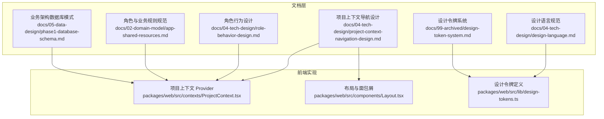
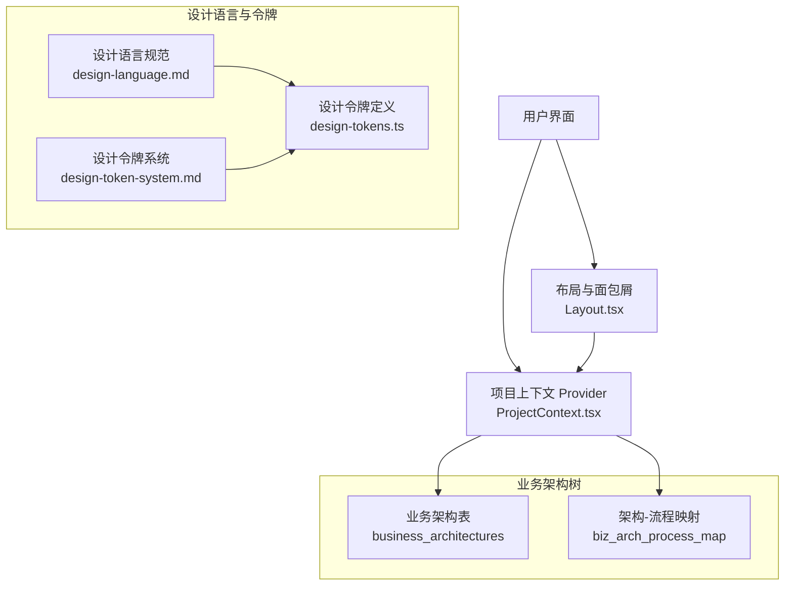
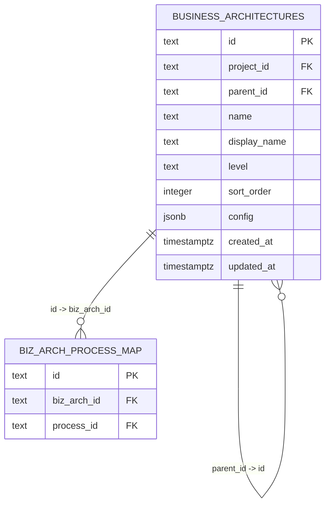
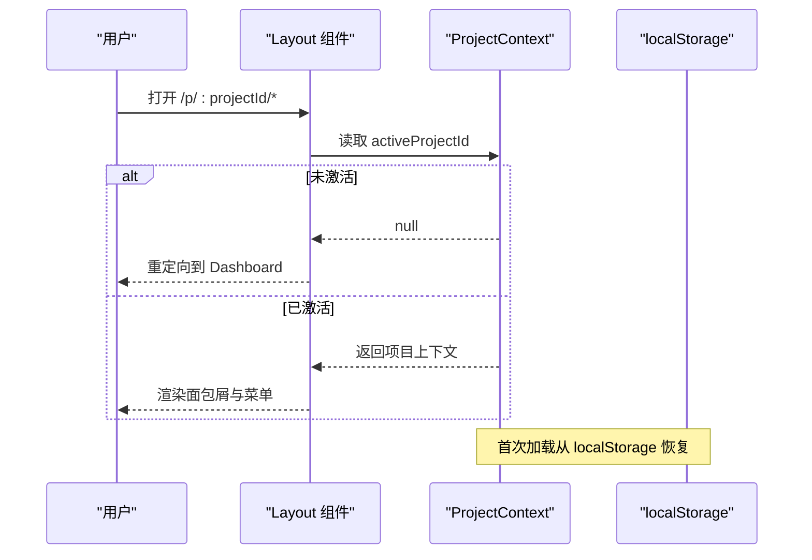
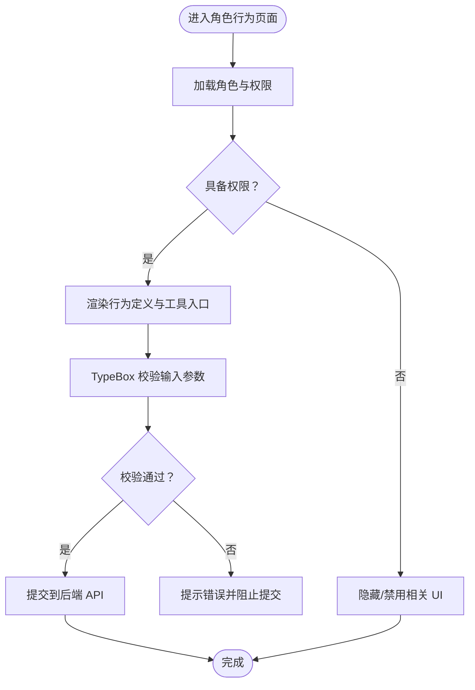
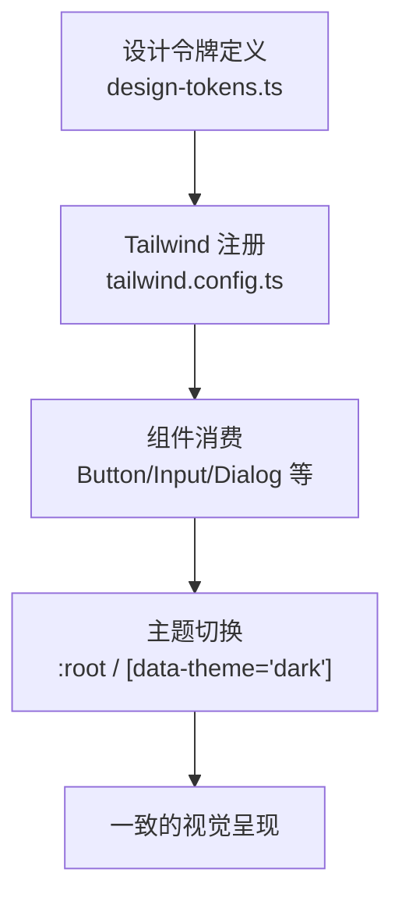
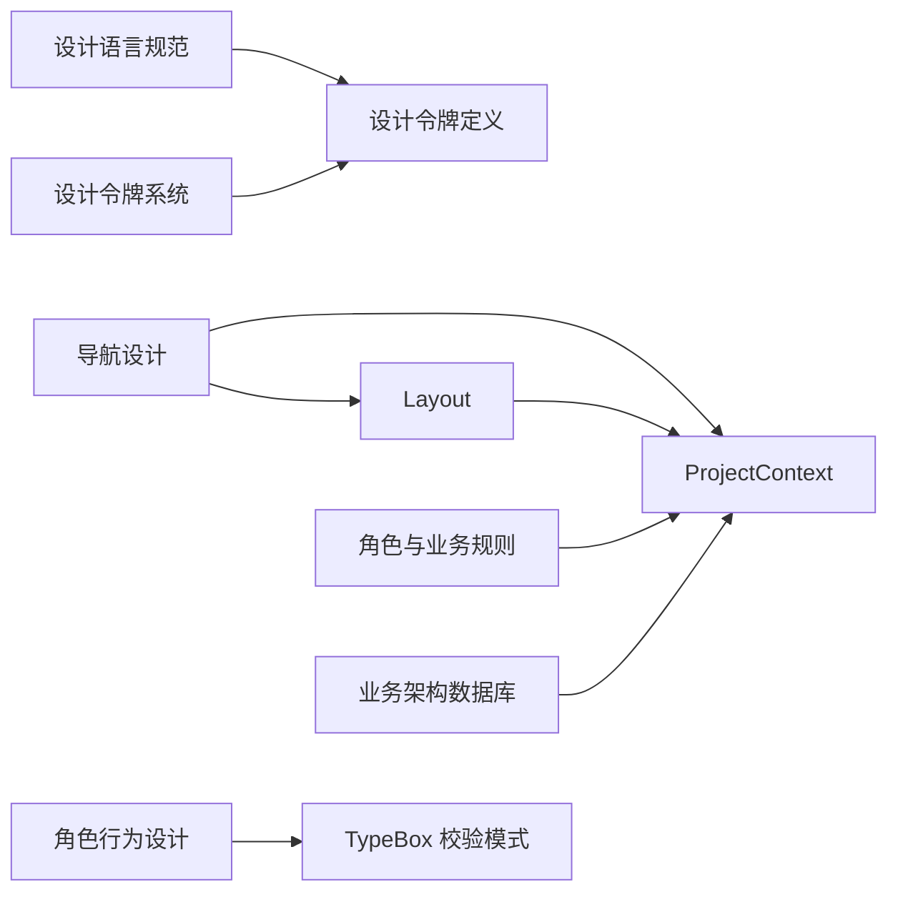

# 系统架构模块

<cite>
**本文引用的文件**
- [设计语言规范](file://docs/04-tech-design/design-language.md)
- [设计令牌系统](file://docs/99-archived/design-token-system.md)
- [设计令牌定义](file://packages/web/src/lib/design-tokens.ts)
- [项目上下文导航设计](file://docs/04-tech-design/project-context-navigation-design.md)
- [项目上下文 Provider](file://packages/web/src/contexts/ProjectContext.tsx)
- [布局与面包屑](file://packages/web/src/components/Layout.tsx)
- [角色行为设计](file://docs/04-tech-design/role-behavior-design.md)
- [角色与业务规则规范](file://docs/02-domain-model/app-shared-resources.md)
- [业务架构数据库模式](file://docs/05-data-design/phase1-database-schema.md)
- [早期业务架构数据库模式（归档）](file://docs/99-archived/2026-04-28-phase1-design.md)
- [TypeBox 角色行为校验模式](file://packages/validation-schemas/src/role-behavior.schema.ts)
</cite>

## 目录
1. [简介](#简介)
2. [项目结构](#项目结构)
3. [核心组件](#核心组件)
4. [架构总览](#架构总览)
5. [详细组件分析](#详细组件分析)
6. [依赖分析](#依赖分析)
7. [性能考虑](#性能考虑)
8. [故障排查指南](#故障排查指南)
9. [结论](#结论)
10. [附录](#附录)

## 简介
本文件系统性梳理“系统架构模块”的技术设计与实现，围绕以下目标展开：
- 业务架构树设计：理念、层次划分、组件关系管理与数据流向控制
- 项目上下文导航：导航树构建算法、路由配置与状态管理
- 角色行为设计：行为规则引擎、权限验证与访问控制
- 设计语言系统：视觉设计规范、组件库管理与主题定制
- 模块集成：数据共享、接口调用与状态同步
- 扩展性：插件机制、配置管理与版本兼容策略

## 项目结构
系统采用多包工作区（monorepo）组织，前端位于 packages/web，技术设计文档集中于 docs/04-tech-design 与相关归档文档；数据库模式位于 docs/05-data-design。

**图表来源**
- [设计语言规范:1-680](file://docs/04-tech-design/design-language.md#L1-L680)
- [设计令牌系统:45-91](file://docs/99-archived/design-token-system.md#L45-L91)
- [项目上下文导航设计:165-201](file://docs/04-tech-design/project-context-navigation-design.md#L165-L201)
- [项目上下文 Provider:1-146](file://packages/web/src/contexts/ProjectContext.tsx#L1-L146)
- [布局与面包屑:249-287](file://packages/web/src/components/Layout.tsx#L249-L287)
- [设计令牌定义:1-35](file://packages/web/src/lib/design-tokens.ts#L1-L35)
- [角色行为设计:207-398](file://docs/04-tech-design/role-behavior-design.md#L207-L398)
- [角色与业务规则规范:290-344](file://docs/02-domain-model/app-shared-resources.md#L290-L344)
- [业务架构数据库模式:470-495](file://docs/05-data-design/phase1-database-schema.md#L470-L495)

**章节来源**
- [设计语言规范:1-680](file://docs/04-tech-design/design-language.md#L1-L680)
- [项目上下文导航设计:165-201](file://docs/04-tech-design/project-context-navigation-design.md#L165-L201)

## 核心组件
- 设计语言与令牌体系：通过“唯一真相源”令牌定义与 Tailwind 注册，确保全局视觉一致性与主题自适应。
- 项目上下文导航：基于 React Context 的项目状态管理，结合路由与面包屑，实现跨页面的上下文感知。
- 角色行为与权限：以 TypeBox 校验模式驱动的 API 输入输出，配合角色权限字符串进行访问控制。
- 业务架构树：以数据库树形结构承载业务架构层级，支持父子节点与排序，支撑导航与流程映射。

**章节来源**
- [设计令牌定义:1-35](file://packages/web/src/lib/design-tokens.ts#L1-L35)
- [项目上下文 Provider:1-146](file://packages/web/src/contexts/ProjectContext.tsx#L1-L146)
- [布局与面包屑:249-287](file://packages/web/src/components/Layout.tsx#L249-L287)
- [角色行为设计:207-398](file://docs/04-tech-design/role-behavior-design.md#L207-L398)
- [角色与业务规则规范:290-344](file://docs/02-domain-model/app-shared-resources.md#L290-L344)
- [业务架构数据库模式:470-495](file://docs/05-data-design/phase1-database-schema.md#L470-L495)

## 架构总览
系统架构以“文档驱动 + 前端实现 + 数据层”协同：
- 文档层：设计语言与令牌、导航设计、角色行为、数据库模式
- 前端层：上下文 Provider、布局与面包屑、令牌消费
- 数据层：业务架构树表结构与索引，支持树形查询与多对多映射

**图表来源**
- [布局与面包屑:249-287](file://packages/web/src/components/Layout.tsx#L249-L287)
- [项目上下文 Provider:1-146](file://packages/web/src/contexts/ProjectContext.tsx#L1-L146)
- [设计语言规范:1-680](file://docs/04-tech-design/design-language.md#L1-L680)
- [设计令牌系统:45-91](file://docs/99-archived/design-token-system.md#L45-L91)
- [设计令牌定义:1-35](file://packages/web/src/lib/design-tokens.ts#L1-L35)
- [业务架构数据库模式:470-495](file://docs/05-data-design/phase1-database-schema.md#L470-L495)

## 详细组件分析

### 业务架构树设计
- 层次与约束：支持 L1-L4 多层级，通过 parent_id 自引用形成树形结构，配合排序字段与唯一约束保证一致性。
- 关系映射：通过 biz_arch_process_map 实现架构节点与业务流程的多对多关联，便于在导航与流程视图间跳转。
- 导航与数据流：前端根据项目上下文与路由动态生成面包屑，后端提供树形查询能力，数据在 UI 与服务之间双向同步。

**图表来源**
- [业务架构数据库模式:470-495](file://docs/05-data-design/phase1-database-schema.md#L470-L495)
- [早期业务架构数据库模式（归档）:633-658](file://docs/99-archived/2026-04-28-phase1-design.md#L633-L658)

**章节来源**
- [业务架构数据库模式:470-495](file://docs/05-data-design/phase1-database-schema.md#L470-L495)
- [项目上下文 Provider:1-146](file://packages/web/src/contexts/ProjectContext.tsx#L1-L146)
- [布局与面包屑:249-287](file://packages/web/src/components/Layout.tsx#L249-L287)

### 项目上下文导航设计
- 上下文状态：activeProjectId、activeProject、isLoading，持久化于 localStorage，刷新后自动恢复。
- 路由与菜单：引入 /p/:projectId/* 路由组，Layout 根据 activeProjectId 切换菜单与面包屑。
- 路由守卫：未激活项目时访问 /p/... 自动重定向至 Dashboard。
- 实施步骤：从基础设施到页面拆分，逐步完善路由、菜单、面包屑与空状态。

**图表来源**
- [项目上下文 Provider:67-74](file://packages/web/src/contexts/ProjectContext.tsx#L67-L74)
- [布局与面包屑:254-287](file://packages/web/src/components/Layout.tsx#L254-L287)
- [项目上下文导航设计:165-201](file://docs/04-tech-design/project-context-navigation-design.md#L165-L201)

**章节来源**
- [项目上下文 Provider:1-146](file://packages/web/src/contexts/ProjectContext.tsx#L1-L146)
- [布局与面包屑:249-287](file://packages/web/src/components/Layout.tsx#L249-L287)
- [项目上下文导航设计:165-201](file://docs/04-tech-design/project-context-navigation-design.md#L165-L201)

### 角色行为设计与权限验证
- 行为定义：Action 与 Decision 的输入输出、逻辑与工具引用，均通过 TypeBox 模式严格约束。
- 权限字符串：资源:操作，支持通配符，用于组件级可见性与编辑性控制。
- 访问控制：前端在渲染层依据权限判断，后端在 API 层进行鉴权与校验。

**图表来源**
- [角色行为设计:207-398](file://docs/04-tech-design/role-behavior-design.md#L207-L398)
- [TypeBox 角色行为校验模式:1-200](file://packages/validation-schemas/src/role-behavior.schema.ts#L1-L200)
- [角色与业务规则规范:290-344](file://docs/02-domain-model/app-shared-resources.md#L290-L344)

**章节来源**
- [角色行为设计:207-398](file://docs/04-tech-design/role-behavior-design.md#L207-L398)
- [角色与业务规则规范:290-344](file://docs/02-domain-model/app-shared-resources.md#L290-L344)
- [TypeBox 角色行为校验模式:1-200](file://packages/validation-schemas/src/role-behavior.schema.ts#L1-L200)

### 设计语言系统与主题定制
- 唯一真相源：design-tokens.ts 定义品牌色、文本色、边框与分隔等 Token。
- 注册映射：tailwind.config.ts 将 Token 注册为 Tailwind 变量，组件消费 CSS 类名而非硬编码值。
- 主题自适应：通过 :root 或 data-theme 属性切换明/暗主题，组件自动适配。

**图表来源**
- [设计令牌系统:45-91](file://docs/99-archived/design-token-system.md#L45-L91)
- [设计令牌定义:1-35](file://packages/web/src/lib/design-tokens.ts#L1-L35)
- [设计语言规范:1-680](file://docs/04-tech-design/design-language.md#L1-L680)

**章节来源**
- [设计令牌系统:45-91](file://docs/99-archived/design-token-system.md#L45-L91)
- [设计令牌定义:1-35](file://packages/web/src/lib/design-tokens.ts#L1-L35)
- [设计语言规范:1-680](file://docs/04-tech-design/design-language.md#L1-L680)

## 依赖分析
- 文档到实现：设计语言与令牌文档驱动前端组件的视觉实现；导航设计驱动路由与上下文；角色行为设计驱动 API 校验与权限控制。
- 前端内部：Layout 依赖 ProjectContext；组件依赖设计令牌；业务架构树通过上下文与路由联动。
- 数据层：业务架构表与映射表支撑树形导航与流程关联。

**图表来源**
- [设计语言规范:1-680](file://docs/04-tech-design/design-language.md#L1-L680)
- [设计令牌系统:45-91](file://docs/99-archived/design-token-system.md#L45-L91)
- [项目上下文导航设计:165-201](file://docs/04-tech-design/project-context-navigation-design.md#L165-L201)
- [项目上下文 Provider:1-146](file://packages/web/src/contexts/ProjectContext.tsx#L1-L146)
- [布局与面包屑:249-287](file://packages/web/src/components/Layout.tsx#L249-L287)
- [角色行为设计:207-398](file://docs/04-tech-design/role-behavior-design.md#L207-L398)
- [角色与业务规则规范:290-344](file://docs/02-domain-model/app-shared-resources.md#L290-L344)
- [业务架构数据库模式:470-495](file://docs/05-data-design/phase1-database-schema.md#L470-L495)

**章节来源**
- [项目上下文 Provider:1-146](file://packages/web/src/contexts/ProjectContext.tsx#L1-L146)
- [布局与面包屑:249-287](file://packages/web/src/components/Layout.tsx#L249-L287)
- [角色行为设计:207-398](file://docs/04-tech-design/role-behavior-design.md#L207-L398)
- [业务架构数据库模式:470-495](file://docs/05-data-design/phase1-database-schema.md#L470-L495)

## 性能考虑
- 导航与上下文：localStorage 恢复避免重复请求；面包屑按需生成，减少不必要渲染。
- 设计令牌：集中定义与注册，降低组件内样式计算成本；主题切换通过属性选择器高效生效。
- 角色行为：TypeBox 校验前置，减少无效请求；权限判断在渲染层快速短路。
- 数据层：树形查询使用自引用索引，避免深度遍历带来的查询膨胀。

[本节为通用建议，无需特定文件引用]

## 故障排查指南
- 项目上下文未激活导致 /p/... 访问异常：检查 ProjectContext 初始化与 localStorage 存储键；确认路由守卫逻辑。
- 面包屑标签不正确：核对 Layout 中的路径匹配与标签映射逻辑。
- 设计令牌未生效：确认 tailwind.config.ts 是否正确注册；组件是否使用 CSS 类名而非内联样式。
- 角色行为校验失败：对照 TypeBox 模式检查输入字段类型与长度限制；后端返回的错误信息用于定位问题。
- 业务架构树显示异常：检查 parent_id 与排序字段；确认数据库索引与查询条件。

**章节来源**
- [项目上下文 Provider:67-74](file://packages/web/src/contexts/ProjectContext.tsx#L67-L74)
- [布局与面包屑:254-287](file://packages/web/src/components/Layout.tsx#L254-L287)
- [设计令牌系统:45-91](file://docs/99-archived/design-token-system.md#L45-L91)
- [角色行为设计:207-398](file://docs/04-tech-design/role-behavior-design.md#L207-L398)
- [业务架构数据库模式:470-495](file://docs/05-data-design/phase1-database-schema.md#L470-L495)

## 结论
系统架构模块通过“文档驱动 + 前端实现 + 数据层”协同，实现了：
- 业务架构树的层次化与可扩展性
- 项目上下文的稳定导航与状态管理
- 角色行为的强类型校验与权限控制
- 设计语言的统一令牌体系与主题自适应
- 与各功能模块的清晰集成边界与数据同步机制

[本节为总结，无需特定文件引用]

## 附录
- 最佳实践
  - 令牌与规范：所有视觉属性从设计令牌派生，组件禁止硬编码值
  - 导航与路由：路由守卫与上下文联动，确保用户体验一致性
  - 角色与权限：前后端一致的权限字符串约定，前端快速短路，后端严格校验
  - 数据层：树形结构使用自引用索引，避免深层查询性能问题
- 扩展性策略
  - 插件机制：以 TypeBox 模式扩展角色行为输入输出，保持向后兼容
  - 配置管理：通过 JSONB config 字段承载节点级配置，支持动态扩展
  - 版本兼容：TypeBox 版本字段与响应封装，保障接口演进的稳定性

[本节为通用建议，无需特定文件引用]