# 组织架构管理模块

<cite>
**本文档引用的文件**
- [f-m1-06-api.md](file://docs/06-test-design/modules/project-management/f-m1-06-company/f-m1-06-api.md)
- [f-m1-07-api.md](file://docs/06-test-design/modules/project-management/f-m1-07-department/f-m1-07-api.md)
- [f-m1-08-api.md](file://docs/06-test-design/modules/project-management/f-m1-08-role/f-m1-08-api.md)
- [f-m1-09-api.md](file://docs/06-test-design/modules/project-management/f-m1-09-external-entity/f-m1-09-api.md)
- [f-m1-12-api.md](file://docs/06-test-design/modules/project-management/f-m1-12-role-behavior/f-m1-12-api.md)
- [f-m1-13-api.md](file://docs/06-test-design/modules/project-management/f-m1-13-external-entity-behavior/f-m1-13-api.md)
</cite>

## 目录
1. [引言](#引言)
2. [项目结构](#项目结构)
3. [核心组件](#核心组件)
4. [架构概览](#架构概览)
5. [详细组件分析](#详细组件分析)
6. [依赖分析](#依赖分析)
7. [性能考虑](#性能考虑)
8. [故障排除指南](#故障排除指南)
9. [结论](#结论)
10. [附录](#附录)

## 引言

组织架构管理模块是AI原型管理系统中的核心业务模块，负责企业组织结构的全生命周期管理。该模块实现了从公司管理到部门管理，再到角色管理和外部实体管理的完整组织架构管理体系，同时提供了行为管理能力，支持复杂的业务流程自动化。

本模块采用分层架构设计，通过RESTful API提供标准化的接口服务，支持多租户环境下的组织结构管理，具备完善的权限控制和数据同步机制。模块设计充分考虑了企业组织结构的复杂性和动态性，提供了灵活的配置能力和强大的扩展性。

## 项目结构

组织架构管理模块在项目中的位置和组织方式如下：

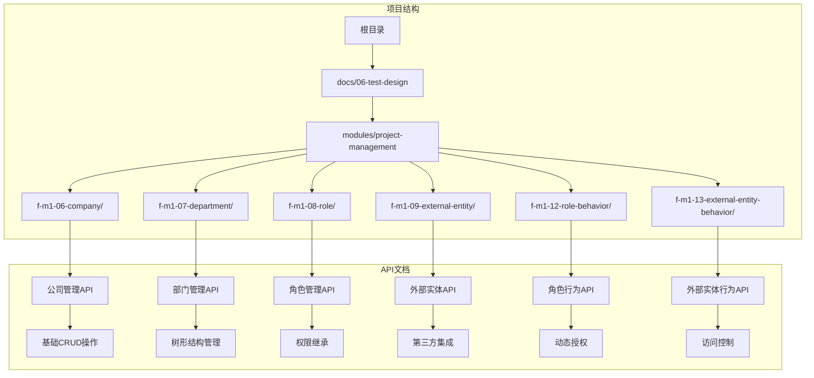
```mermaid
graph TB
subgraph "项目结构"
A[根目录] --> B[docs/06-test-design]
B --> C[modules/project-management]
C --> D[f-m1-06-company/]
C --> E[f-m1-07-department/]
C --> F[f-m1-08-role/]
C --> G[f-m1-09-external-entity/]
C --> H[f-m1-12-role-behavior/]
C --> I[f-m1-13-external-entity-behavior/]
end
subgraph "API文档"
J[公司管理API] --> K[基础CRUD操作]
L[部门管理API] --> M[树形结构管理]
N[角色管理API] --> O[权限继承]
P[外部实体API] --> Q[第三方集成]
R[角色行为API] --> S[动态授权]
T[外部实体行为API] --> U[访问控制]
end
D --> J
E --> L
F --> N
G --> P
H --> R
I --> T
```

**图表来源**
- [f-m1-06-api.md:1-618](file://docs/06-test-design/modules/project-management/f-m1-06-company/f-m1-06-api.md#L1-L618)
- [f-m1-07-api.md:1-827](file://docs/06-test-design/modules/project-management/f-m1-07-department/f-m1-07-api.md#L1-L827)
- [f-m1-08-api.md:1-822](file://docs/06-test-design/modules/project-management/f-m1-08-role/f-m1-08-api.md#L1-L822)
- [f-m1-09-api.md:1-683](file://docs/06-test-design/modules/project-management/f-m1-09-external-entity/f-m1-09-api.md#L1-L683)
- [f-m1-12-api.md:1-1253](file://docs/06-test-design/modules/project-management/f-m1-12-role-behavior/f-m1-12-api.md#L1-L1253)
- [f-m1-13-api.md:1-1256](file://docs/06-test-design/modules/project-management/f-m1-13-external-entity-behavior/f-m1-13-api.md#L1-L1256)

**章节来源**
- [f-m1-06-api.md:1-618](file://docs/06-test-design/modules/project-management/f-m1-06-company/f-m1-06-api.md#L1-L618)
- [f-m1-07-api.md:1-827](file://docs/06-test-design/modules/project-management/f-m1-07-department/f-m1-07-api.md#L1-L827)
- [f-m1-08-api.md:1-822](file://docs/06-test-design/modules/project-management/f-m1-08-role/f-m1-08-api.md#L1-L822)
- [f-m1-09-api.md:1-683](file://docs/06-test-design/modules/project-management/f-m1-09-external-entity/f-m1-09-api.md#L1-L683)
- [f-m1-12-api.md:1-1253](file://docs/06-test-design/modules/project-management/f-m1-12-role-behavior/f-m1-12-api.md#L1-L1253)
- [f-m1-13-api.md:1-1256](file://docs/06-test-design/modules/project-management/f-m1-13-external-entity-behavior/f-m1-13-api.md#L1-L1256)

## 核心组件

组织架构管理模块由六个核心子模块组成，每个模块都有明确的职责和功能边界：

### 1. 公司管理模块
负责企业主体的全生命周期管理，包括公司信息维护、层级结构管理、数据同步机制等核心功能。

### 2. 部门管理模块  
实现树形部门结构管理，支持多级嵌套、权限继承、组织关系维护等功能。

### 3. 角色管理模块
提供角色定义、权限分配、动态授权的完整流程，支持独立角色和挂载角色两种模式。

### 4. 外部实体管理模块
管理合作伙伴、供应商等外部实体，支持多种实体类型和第三方集成。

### 5. 角色行为管理模块
基于JSONB存储的行为定义，支持动作(Action)和决策(Decision)的灵活配置。

### 6. 外部实体行为管理模块
为外部实体提供类似的角色行为管理能力，支持复杂的业务流程自动化。

**章节来源**
- [f-m1-06-api.md:31-618](file://docs/06-test-design/modules/project-management/f-m1-06-company/f-m1-06-api.md#L31-L618)
- [f-m1-07-api.md:36-827](file://docs/06-test-design/modules/project-management/f-m1-07-department/f-m1-07-api.md#L36-L827)
- [f-m1-08-api.md:32-822](file://docs/06-test-design/modules/project-management/f-m1-08-role/f-m1-08-api.md#L32-L822)
- [f-m1-09-api.md:31-683](file://docs/06-test-design/modules/project-management/f-m1-09-external-entity/f-m1-09-api.md#L31-L683)
- [f-m1-12-api.md:36-1253](file://docs/06-test-design/modules/project-management/f-m1-12-role-behavior/f-m1-12-api.md#L36-L1253)
- [f-m1-13-api.md:36-1256](file://docs/06-test-design/modules/project-management/f-m1-13-external-entity-behavior/f-m1-13-api.md#L36-L1256)

## 架构概览

组织架构管理模块采用分层架构设计，通过清晰的职责分离和标准化的接口规范，实现了高度模块化的系统架构。

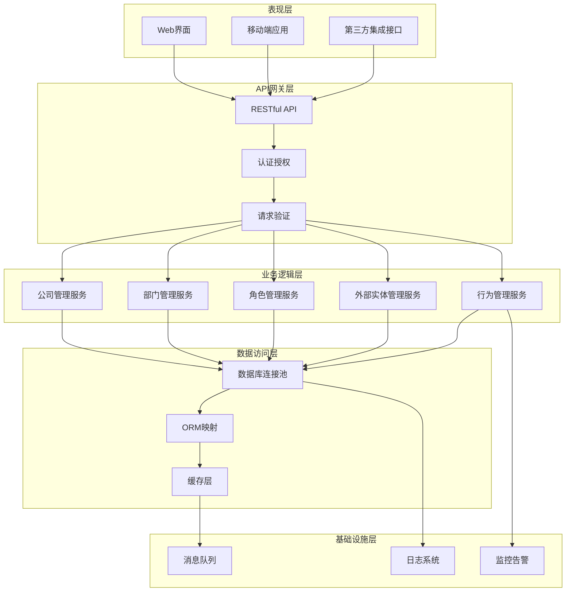
```mermaid
graph TB
subgraph "表现层"
A[Web界面]
B[移动端应用]
C[第三方集成接口]
end
subgraph "API网关层"
D[RESTful API]
E[认证授权]
F[请求验证]
end
subgraph "业务逻辑层"
G[公司管理服务]
H[部门管理服务]
I[角色管理服务]
J[外部实体管理服务]
K[行为管理服务]
end
subgraph "数据访问层"
L[数据库连接池]
M[ORM映射]
N[缓存层]
end
subgraph "基础设施层"
O[消息队列]
P[日志系统]
Q[监控告警]
end
A --> D
B --> D
C --> D
D --> E
E --> F
F --> G
F --> H
F --> I
F --> J
F --> K
G --> L
H --> L
I --> L
J --> L
K --> L
L --> M
M --> N
N --> O
L --> P
K --> Q
```

**图表来源**
- [f-m1-06-api.md:8-16](file://docs/06-test-design/modules/project-management/f-m1-06-company/f-m1-06-api.md#L8-L16)
- [f-m1-07-api.md:8-16](file://docs/06-test-design/modules/project-management/f-m1-07-department/f-m1-07-api.md#L8-L16)
- [f-m1-08-api.md:8-16](file://docs/06-test-design/modules/project-management/f-m1-08-role/f-m1-08-api.md#L8-L16)
- [f-m1-09-api.md:8-16](file://docs/06-test-design/modules/project-management/f-m1-09-external-entity/f-m1-09-api.md#L8-L16)

### 数据流架构

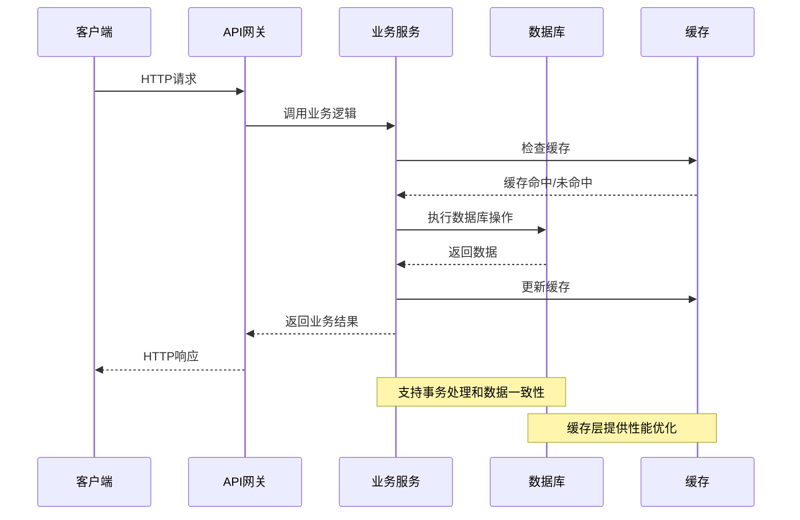
```mermaid
sequenceDiagram
participant Client as 客户端
participant API as API网关
participant Service as 业务服务
participant DB as 数据库
participant Cache as 缓存
Client->>API : HTTP请求
API->>Service : 调用业务逻辑
Service->>Cache : 检查缓存
Cache-->>Service : 缓存命中/未命中
Service->>DB : 执行数据库操作
DB-->>Service : 返回数据
Service->>Cache : 更新缓存
Service-->>API : 返回业务结果
API-->>Client : HTTP响应
Note over Service,DB : 支持事务处理和数据一致性
Note over Cache,DB : 缓存层提供性能优化
```

**图表来源**
- [f-m1-06-api.md:123-260](file://docs/06-test-design/modules/project-management/f-m1-06-company/f-m1-06-api.md#L123-L260)
- [f-m1-07-api.md:132-350](file://docs/06-test-design/modules/project-management/f-m1-07-department/f-m1-07-api.md#L132-L350)
- [f-m1-08-api.md:179-386](file://docs/06-test-design/modules/project-management/f-m1-08-role/f-m1-08-api.md#L179-L386)
- [f-m1-09-api.md:122-257](file://docs/06-test-design/modules/project-management/f-m1-09-external-entity/f-m1-09-api.md#L122-L257)

## 详细组件分析

### 公司管理模块

公司管理模块是组织架构的基础单元，负责企业主体的全生命周期管理。

#### 核心功能特性

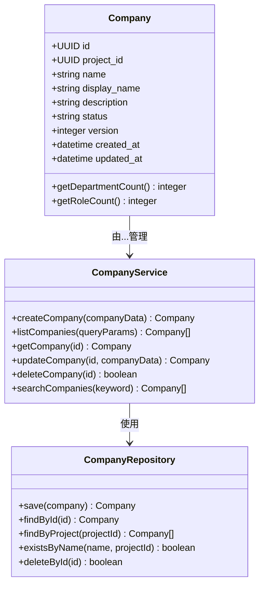
```mermaid
classDiagram
class Company {
+UUID id
+UUID project_id
+string name
+string display_name
+string description
+string status
+integer version
+datetime created_at
+datetime updated_at
+getDepartmentCount() integer
+getRoleCount() integer
}
class CompanyService {
+createCompany(companyData) Company
+listCompanies(queryParams) Company[]
+getCompany(id) Company
+updateCompany(id, companyData) Company
+deleteCompany(id) boolean
+searchCompanies(keyword) Company[]
}
class CompanyRepository {
+save(company) Company
+findById(id) Company
+findByProject(projectId) Company[]
+existsByName(name, projectId) boolean
+deleteById(id) boolean
}
CompanyService --> CompanyRepository : 使用
Company --> CompanyService : 由...管理
```

**图表来源**
- [f-m1-06-api.md:33-170](file://docs/06-test-design/modules/project-management/f-m1-06-company/f-m1-06-api.md#L33-L170)
- [f-m1-06-api.md:195-260](file://docs/06-test-design/modules/project-management/f-m1-06-company/f-m1-06-api.md#L195-L260)

#### API接口规范

| 接口 | 方法 | 路径 | 描述 |
|------|------|------|------|
| 查询公司列表 | GET | `/projects/{projectId}/companies` | 支持分页、排序、统计字段返回 |
| 创建公司 | POST | `/projects/{projectId}/companies` | 创建新的公司实体 |
| 获取公司详情 | GET | `/api/v1/companies/{companyId}` | 获取单个公司详细信息 |
| 更新公司 | PUT | `/api/v1/companies/{companyId}` | 更新公司信息 |
| 删除公司 | DELETE | `/api/v1/companies/{companyId}` | 删除公司并级联处理子实体 |

#### 数据验证规则

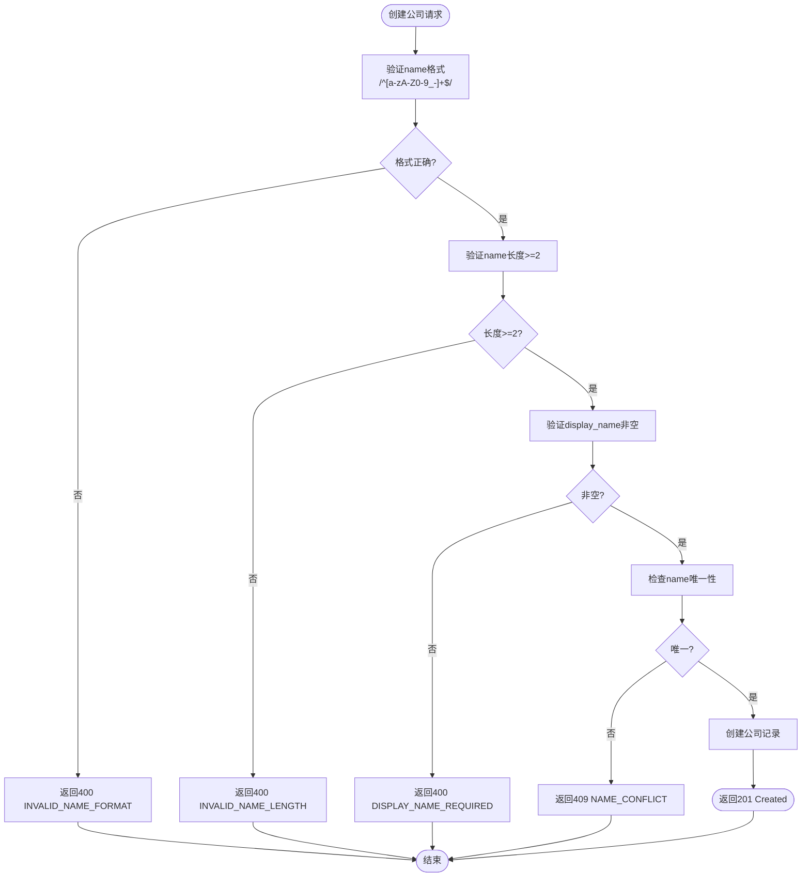
```mermaid
flowchart TD
Start([创建公司请求]) --> ValidateName["验证name格式<br/>/^[a-zA-Z0-9_-]+$/"]
ValidateName --> NameValid{"格式正确?"}
NameValid --> |否| ErrorFormat["返回400 INVALID_NAME_FORMAT"]
NameValid --> |是| ValidateLength["验证name长度>=2"]
ValidateLength --> LengthValid{"长度>=2?"}
LengthValid --> |否| ErrorLength["返回400 INVALID_NAME_LENGTH"]
LengthValid --> |是| ValidateDisplayName["验证display_name非空"]
ValidateDisplayName --> DisplayNameValid{"非空?"}
DisplayNameValid --> |否| ErrorRequired["返回400 DISPLAY_NAME_REQUIRED"]
DisplayNameValid --> |是| CheckUnique["检查name唯一性"]
CheckUnique --> UniqueValid{"唯一?"}
UniqueValid --> |否| ErrorConflict["返回409 NAME_CONFLICT"]
UniqueValid --> |是| CreateCompany["创建公司记录"]
CreateCompany --> Success([返回201 Created])
ErrorFormat --> End([结束])
ErrorLength --> End
ErrorRequired --> End
ErrorConflict --> End
Success --> End
```

**图表来源**
- [f-m1-06-api.md:262-323](file://docs/06-test-design/modules/project-management/f-m1-06-company/f-m1-06-api.md#L262-L323)
- [f-m1-06-api.md:345-364](file://docs/06-test-design/modules/project-management/f-m1-06-company/f-m1-06-api.md#L345-L364)

**章节来源**
- [f-m1-06-api.md:31-618](file://docs/06-test-design/modules/project-management/f-m1-06-company/f-m1-06-api.md#L31-L618)

### 部门管理模块

部门管理模块实现树形部门结构管理，支持复杂的层级关系和权限继承。

#### 树形结构管理

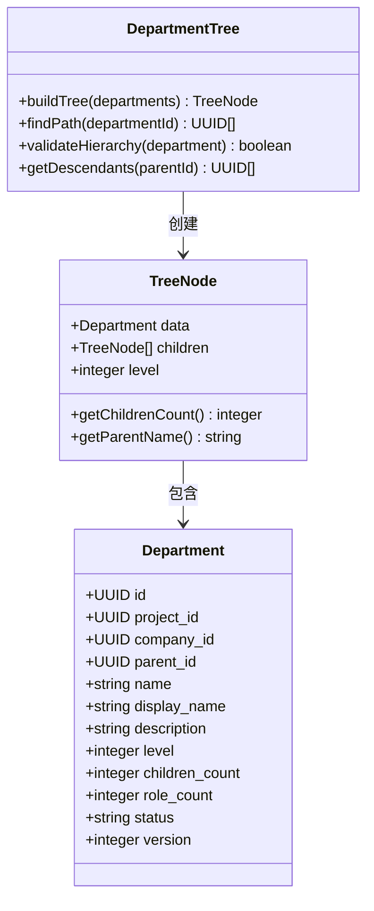
```mermaid
classDiagram
class Department {
+UUID id
+UUID project_id
+UUID company_id
+UUID parent_id
+string name
+string display_name
+string description
+integer level
+integer children_count
+integer role_count
+string status
+integer version
}
class DepartmentTree {
+buildTree(departments) TreeNode
+findPath(departmentId) UUID[]
+validateHierarchy(department) boolean
+getDescendants(parentId) UUID[]
}
class TreeNode {
+Department data
+TreeNode[] children
+integer level
+getChildrenCount() integer
+getParentName() string
}
DepartmentTree --> TreeNode : 创建
TreeNode --> Department : 包含
```

**图表来源**
- [f-m1-07-api.md:38-130](file://docs/06-test-design/modules/project-management/f-m1-07-department/f-m1-07-api.md#L38-L130)
- [f-m1-07-api.md:246-350](file://docs/06-test-design/modules/project-management/f-m1-07-department/f-m1-07-api.md#L246-L350)

#### 核心API流程

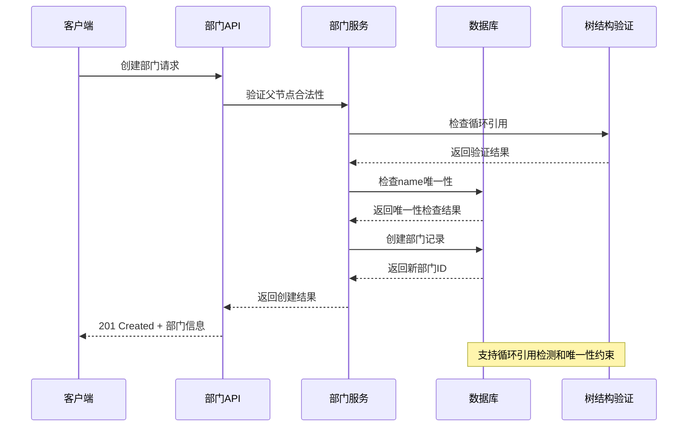
```mermaid
sequenceDiagram
participant Client as 客户端
participant API as 部门API
participant Service as 部门服务
participant DB as 数据库
participant Tree as 树结构验证
Client->>API : 创建部门请求
API->>Service : 验证父节点合法性
Service->>Tree : 检查循环引用
Tree-->>Service : 返回验证结果
Service->>DB : 检查name唯一性
DB-->>Service : 返回唯一性检查结果
Service->>DB : 创建部门记录
DB-->>Service : 返回新部门ID
Service-->>API : 返回创建结果
API-->>Client : 201 Created + 部门信息
Note over Tree,DB : 支持循环引用检测和唯一性约束
```

**图表来源**
- [f-m1-07-api.md:132-216](file://docs/06-test-design/modules/project-management/f-m1-07-department/f-m1-07-api.md#L132-L216)
- [f-m1-07-api.md:278-350](file://docs/06-test-design/modules/project-management/f-m1-07-department/f-m1-07-api.md#L278-L350)

#### 高级查询功能

部门管理支持多种高级查询模式：

| 查询类型 | 参数 | 功能描述 |
|----------|------|----------|
| 树形查询 | `?tree=true` | 返回嵌套的树形结构 |
| 搜索查询 | `?search=keyword` | 按名称和显示名称模糊搜索 |
| 父节点查询 | `?parentId=id` | 获取指定父节点的直接子部门 |
| 层级查询 | `?level=n` | 获取指定层级的所有部门 |

**章节来源**
- [f-m1-07-api.md:36-827](file://docs/06-test-design/modules/project-management/f-m1-07-department/f-m1-07-api.md#L36-L827)

### 角色管理模块

角色管理模块提供灵活的角色定义和权限分配机制，支持独立角色和挂载角色两种模式。

#### 角色类型设计

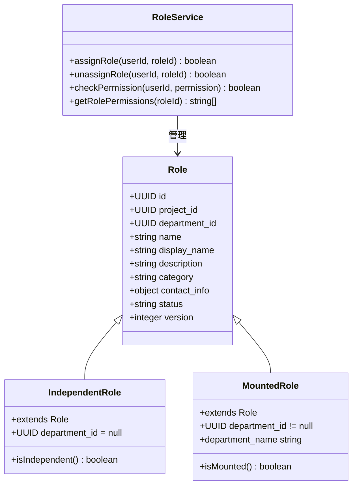
```mermaid
classDiagram
class Role {
+UUID id
+UUID project_id
+UUID department_id
+string name
+string display_name
+string description
+string category
+object contact_info
+string status
+integer version
}
class IndependentRole {
+extends Role
+UUID department_id = null
+isIndependent() boolean
}
class MountedRole {
+extends Role
+UUID department_id != null
+department_name string
+isMounted() boolean
}
class RoleService {
+assignRole(userId, roleId) boolean
+unassignRole(userId, roleId) boolean
+checkPermission(userId, permission) boolean
+getRolePermissions(roleId) string[]
}
Role <|-- IndependentRole
Role <|-- MountedRole
RoleService --> Role : 管理
```

**图表来源**
- [f-m1-08-api.md:32-177](file://docs/06-test-design/modules/project-management/f-m1-08-role/f-m1-08-api.md#L32-L177)
- [f-m1-08-api.md:259-386](file://docs/06-test-design/modules/project-management/f-m1-08-role/f-m1-08-api.md#L259-L386)

#### 权限继承机制

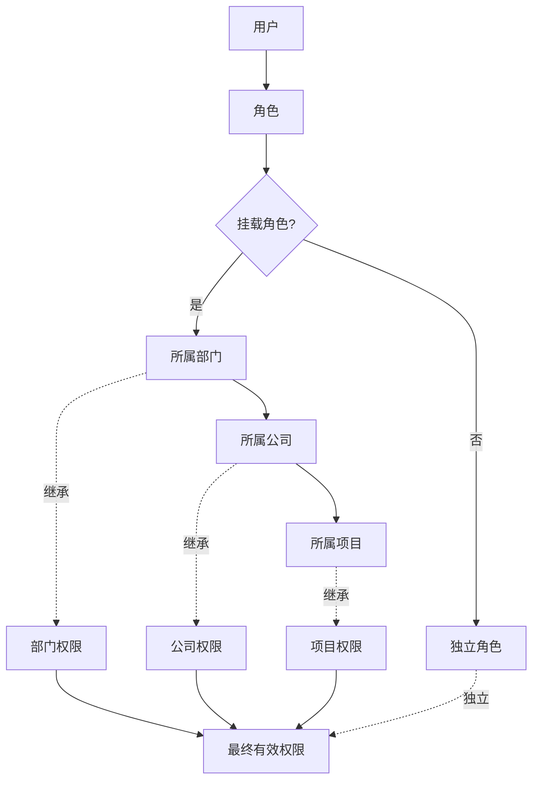
```mermaid
flowchart TD
User[用户] --> Role[角色]
Role --> MountedRole{挂载角色?}
MountedRole --> |是| Department[所属部门]
MountedRole --> |否| IndependentRole[独立角色]
Department --> Company[所属公司]
Company --> Project[所属项目]
Department -.->|继承| Permissions1[部门权限]
Company -.->|继承| Permissions2[公司权限]
Project -.->|继承| Permissions3[项目权限]
Permissions1 --> EffectivePerms[最终有效权限]
Permissions2 --> EffectivePerms
Permissions3 --> EffectivePerms
IndependentRole -.->|独立| EffectivePerms
```

**图表来源**
- [f-m1-08-api.md:100-150](file://docs/06-test-design/modules/project-management/f-m1-08-role/f-m1-08-api.md#L100-L150)
- [f-m1-08-api.md:290-350](file://docs/06-test-design/modules/project-management/f-m1-08-role/f-m1-08-api.md#L290-L350)

#### 动态授权流程

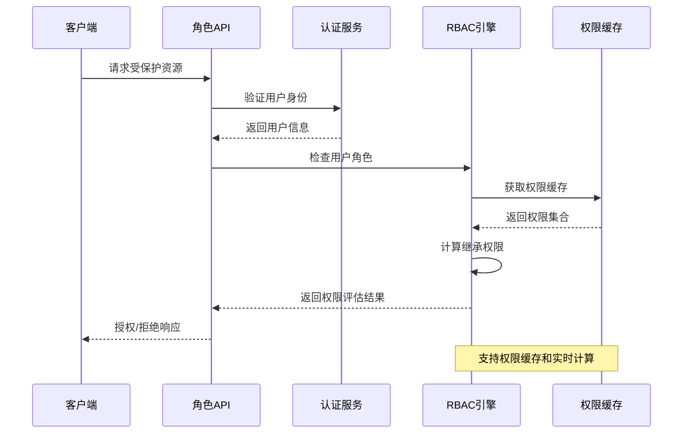
```mermaid
sequenceDiagram
participant Client as 客户端
participant API as 角色API
participant Auth as 认证服务
participant RBAC as RBAC引擎
participant Cache as 权限缓存
Client->>API : 请求受保护资源
API->>Auth : 验证用户身份
Auth-->>API : 返回用户信息
API->>RBAC : 检查用户角色
RBAC->>Cache : 获取权限缓存
Cache-->>RBAC : 返回权限集合
RBAC->>RBAC : 计算继承权限
RBAC-->>API : 返回权限评估结果
API-->>Client : 授权/拒绝响应
Note over RBAC,Cache : 支持权限缓存和实时计算
```

**图表来源**
- [f-m1-08-api.md:179-386](file://docs/06-test-design/modules/project-management/f-m1-08-role/f-m1-08-api.md#L179-L386)
- [f-m1-08-api.md:516-623](file://docs/06-test-design/modules/project-management/f-m1-08-role/f-m1-08-api.md#L516-L623)

**章节来源**
- [f-m1-08-api.md:32-822](file://docs/06-test-design/modules/project-management/f-m1-08-role/f-m1-08-api.md#L32-L822)

### 外部实体管理模块

外部实体管理模块负责合作伙伴、供应商等外部实体的全生命周期管理，支持多种实体类型和第三方集成。

#### 实体类型设计

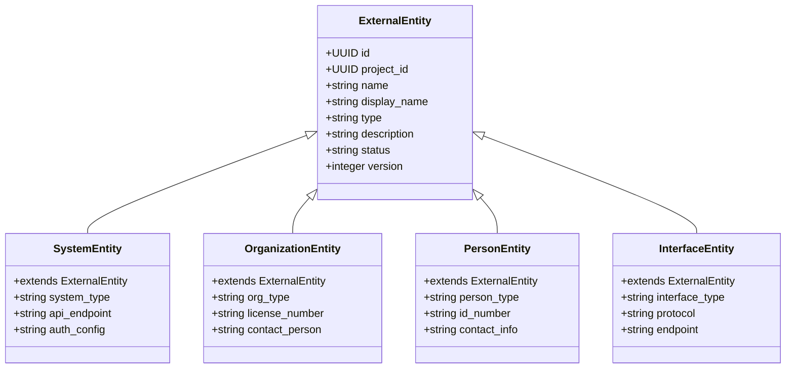
```mermaid
classDiagram
class ExternalEntity {
+UUID id
+UUID project_id
+string name
+string display_name
+string type
+string description
+string status
+integer version
}
class SystemEntity {
+extends ExternalEntity
+string system_type
+string api_endpoint
+string auth_config
}
class OrganizationEntity {
+extends ExternalEntity
+string org_type
+string license_number
+string contact_person
}
class PersonEntity {
+extends ExternalEntity
+string person_type
+string id_number
+string contact_info
}
class InterfaceEntity {
+extends ExternalEntity
+string interface_type
+string protocol
+string endpoint
}
ExternalEntity <|-- SystemEntity
ExternalEntity <|-- OrganizationEntity
ExternalEntity <|-- PersonEntity
ExternalEntity <|-- InterfaceEntity
```

**图表来源**
- [f-m1-09-api.md:31-120](file://docs/06-test-design/modules/project-management/f-m1-09-external-entity/f-m1-09-api.md#L31-L120)
- [f-m1-09-api.md:193-257](file://docs/06-test-design/modules/project-management/f-m1-09-external-entity/f-m1-09-api.md#L193-L257)

#### 第三方集成机制

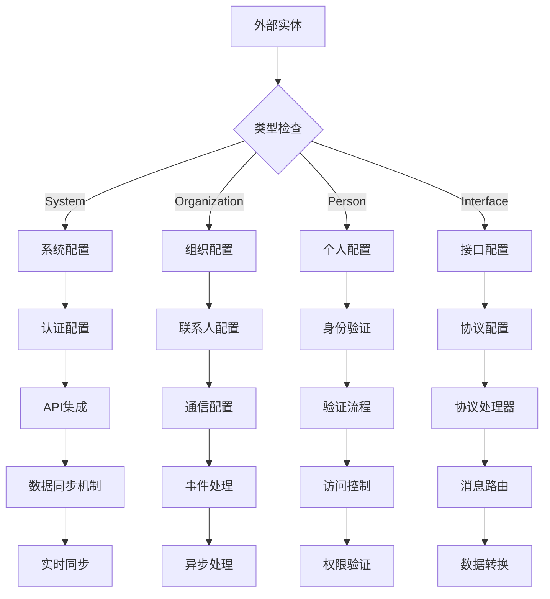
```mermaid
flowchart TD
ExternalEntity[外部实体] --> TypeCheck{类型检查}
TypeCheck --> |System| SystemConfig[系统配置]
TypeCheck --> |Organization| OrgConfig[组织配置]
TypeCheck --> |Person| PersonConfig[个人配置]
TypeCheck --> |Interface| InterfaceConfig[接口配置]
SystemConfig --> AuthSetup[认证配置]
OrgConfig --> ContactSetup[联系人配置]
PersonConfig --> IDSetup[身份验证]
InterfaceConfig --> ProtocolSetup[协议配置]
AuthSetup --> APIIntegration[API集成]
ContactSetup --> Communication[通信配置]
IDSetup --> Verification[验证流程]
ProtocolSetup --> ProtocolHandler[协议处理器]
APIIntegration --> SyncMechanism[数据同步机制]
Communication --> EventHandling[事件处理]
Verification --> AccessControl[访问控制]
ProtocolHandler --> MessageRouting[消息路由]
SyncMechanism --> RealTimeSync[实时同步]
EventHandling --> AsyncProcessing[异步处理]
AccessControl --> PermissionValidation[权限验证]
MessageRouting --> DataTransformation[数据转换]
```

**图表来源**
- [f-m1-09-api.md:122-257](file://docs/06-test-design/modules/project-management/f-m1-09-external-entity/f-m1-09-api.md#L122-L257)
- [f-m1-09-api.md:341-431](file://docs/06-test-design/modules/project-management/f-m1-09-external-entity/f-m1-09-api.md#L341-L431)

**章节来源**
- [f-m1-09-api.md:31-683](file://docs/06-test-design/modules/project-management/f-m1-09-external-entity/f-m1-09-api.md#L31-L683)

### 角色行为管理模块

角色行为管理模块提供基于JSONB存储的行为定义能力，支持动作(Action)和决策(Decision)的灵活配置。

#### 行为模型设计

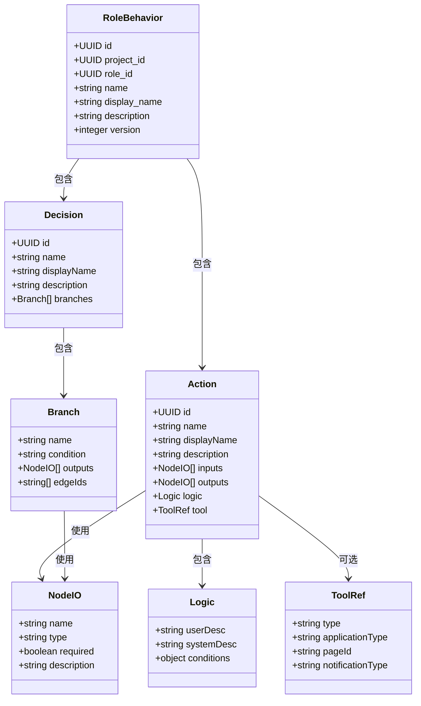
```mermaid
classDiagram
class RoleBehavior {
+UUID id
+UUID project_id
+UUID role_id
+string name
+string display_name
+string description
+integer version
}
class Action {
+UUID id
+string name
+string displayName
+string description
+NodeIO[] inputs
+NodeIO[] outputs
+Logic logic
+ToolRef tool
}
class Decision {
+UUID id
+string name
+string displayName
+string description
+Branch[] branches
}
class NodeIO {
+string name
+string type
+boolean required
+string description
}
class Logic {
+string userDesc
+string systemDesc
+object conditions
}
class ToolRef {
+string type
+string applicationType
+string pageId
+string notificationType
}
class Branch {
+string name
+string condition
+NodeIO[] outputs
+string[] edgeIds
}
RoleBehavior --> Action : 包含
RoleBehavior --> Decision : 包含
Action --> NodeIO : 使用
Action --> Logic : 包含
Action --> ToolRef : 可选
Decision --> Branch : 包含
Branch --> NodeIO : 使用
```

**图表来源**
- [f-m1-12-api.md:36-120](file://docs/06-test-design/modules/project-management/f-m1-12-role-behavior/f-m1-12-api.md#L36-L120)
- [f-m1-12-api.md:354-540](file://docs/06-test-design/modules/project-management/f-m1-12-role-behavior/f-m1-12-api.md#L354-L540)

#### 动态授权流程

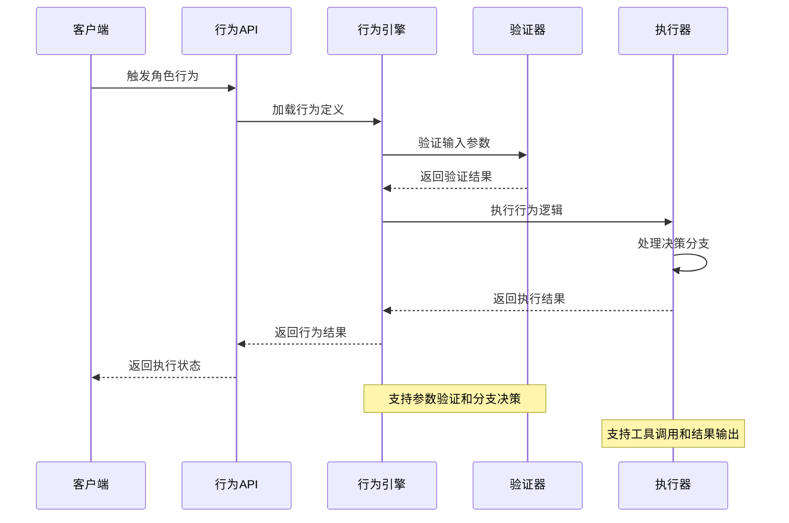
```mermaid
sequenceDiagram
participant Client as 客户端
participant BehaviorAPI as 行为API
participant Engine as 行为引擎
participant Validator as 验证器
participant Executor as 执行器
Client->>BehaviorAPI : 触发角色行为
BehaviorAPI->>Engine : 加载行为定义
Engine->>Validator : 验证输入参数
Validator-->>Engine : 返回验证结果
Engine->>Executor : 执行行为逻辑
Executor->>Executor : 处理决策分支
Executor-->>Engine : 返回执行结果
Engine-->>BehaviorAPI : 返回行为结果
BehaviorAPI-->>Client : 返回执行状态
Note over Engine,Validator : 支持参数验证和分支决策
Note over Executor : 支持工具调用和结果输出
```

**图表来源**
- [f-m1-12-api.md:122-352](file://docs/06-test-design/modules/project-management/f-m1-12-role-behavior/f-m1-12-api.md#L122-L352)
- [f-m1-12-api.md:543-800](file://docs/06-test-design/modules/project-management/f-m1-12-role-behavior/f-m1-12-api.md#L543-L800)

**章节来源**
- [f-m1-12-api.md:36-1253](file://docs/06-test-design/modules/project-management/f-m1-12-role-behavior/f-m1-12-api.md#L36-L1253)

### 外部实体行为管理模块

外部实体行为管理模块为外部实体提供类似的角色行为管理能力，支持复杂的业务流程自动化。

#### 外部实体行为架构

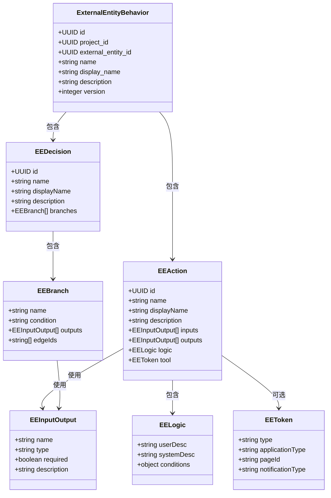
```mermaid
classDiagram
class ExternalEntityBehavior {
+UUID id
+UUID project_id
+UUID external_entity_id
+string name
+string display_name
+string description
+integer version
}
class EEAction {
+UUID id
+string name
+string displayName
+string description
+EEInputOutput[] inputs
+EEInputOutput[] outputs
+EELogic logic
+EEToken tool
}
class EEDecision {
+UUID id
+string name
+string displayName
+string description
+EEBranch[] branches
}
class EEInputOutput {
+string name
+string type
+boolean required
+string description
}
class EELogic {
+string userDesc
+string systemDesc
+object conditions
}
class EEToken {
+string type
+string applicationType
+string pageId
+string notificationType
}
class EEBranch {
+string name
+string condition
+EEInputOutput[] outputs
+string[] edgeIds
}
ExternalEntityBehavior --> EEAction : 包含
ExternalEntityBehavior --> EEDecision : 包含
EEAction --> EEInputOutput : 使用
EEAction --> EELogic : 包含
EEAction --> EEToken : 可选
EEDecision --> EEBranch : 包含
EEBranch --> EEInputOutput : 使用
```

**图表来源**
- [f-m1-13-api.md:36-122](file://docs/06-test-design/modules/project-management/f-m1-13-external-entity-behavior/f-m1-13-api.md#L36-L122)
- [f-m1-13-api.md:356-543](file://docs/06-test-design/modules/project-management/f-m1-13-external-entity-behavior/f-m1-13-api.md#L356-L543)

#### 行为模板配置

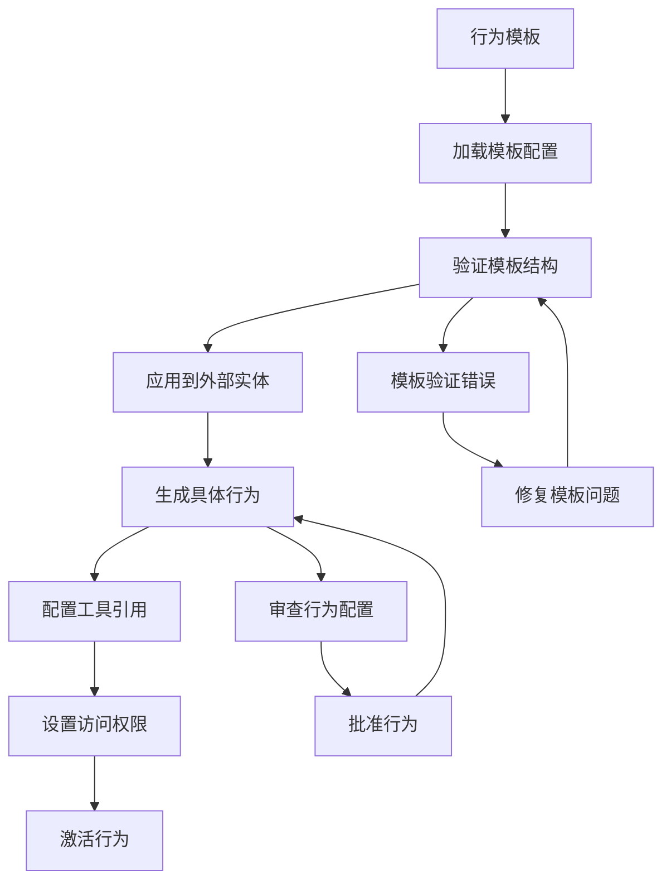
```mermaid
flowchart TD
Template[行为模板] --> LoadTemplate[加载模板配置]
LoadTemplate --> ValidateTemplate[验证模板结构]
ValidateTemplate --> ApplyTemplate[应用到外部实体]
ApplyTemplate --> GenerateActions[生成具体行为]
GenerateActions --> ConfigureTools[配置工具引用]
ConfigureTools --> SetPermissions[设置访问权限]
SetPermissions --> ActivateBehavior[激活行为]
ValidateTemplate --> TemplateError[模板验证错误]
TemplateError --> TemplateFix[修复模板问题]
TemplateFix --> ValidateTemplate
GenerateActions --> ReviewActions[审查行为配置]
ReviewActions --> ApproveActions[批准行为]
ApproveActions --> GenerateActions
```

**图表来源**
- [f-m1-13-api.md:124-353](file://docs/06-test-design/modules/project-management/f-m1-13-external-entity-behavior/f-m1-13-api.md#L124-L353)
- [f-m1-13-api.md:545-800](file://docs/06-test-design/modules/project-management/f-m1-13-external-entity-behavior/f-m1-13-api.md#L545-L800)

**章节来源**
- [f-m1-13-api.md:36-1256](file://docs/06-test-design/modules/project-management/f-m1-13-external-entity-behavior/f-m1-13-api.md#L36-L1256)

## 依赖分析

组织架构管理模块的依赖关系呈现清晰的层次化结构，各模块间通过标准化接口进行交互。

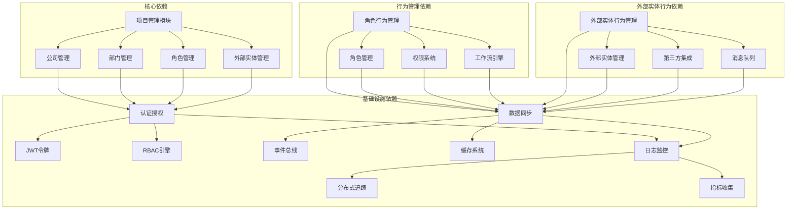
```mermaid
graph TB
subgraph "核心依赖"
A[项目管理模块] --> B[公司管理]
A --> C[部门管理]
A --> D[角色管理]
A --> E[外部实体管理]
end
subgraph "行为管理依赖"
F[角色行为管理] --> G[角色管理]
F --> H[权限系统]
F --> I[工作流引擎]
end
subgraph "外部实体行为依赖"
J[外部实体行为管理] --> K[外部实体管理]
J --> L[第三方集成]
J --> M[消息队列]
end
subgraph "基础设施依赖"
N[认证授权] --> O[JWT令牌]
N --> P[RBAC引擎]
Q[数据同步] --> R[事件总线]
Q --> S[缓存系统]
T[日志监控] --> U[分布式追踪]
T --> V[指标收集]
end
B --> N
C --> N
D --> N
E --> N
F --> Q
G --> Q
H --> Q
I --> Q
J --> Q
K --> Q
L --> Q
M --> Q
N --> T
Q --> T
```

**图表来源**
- [f-m1-06-api.md:8-16](file://docs/06-test-design/modules/project-management/f-m1-06-company/f-m1-06-api.md#L8-L16)
- [f-m1-07-api.md:8-16](file://docs/06-test-design/modules/project-management/f-m1-07-department/f-m1-07-api.md#L8-L16)
- [f-m1-08-api.md:8-16](file://docs/06-test-design/modules/project-management/f-m1-08-role/f-m1-08-api.md#L8-L16)
- [f-m1-09-api.md:8-16](file://docs/06-test-design/modules/project-management/f-m1-09-external-entity/f-m1-09-api.md#L8-L16)

### 数据依赖关系

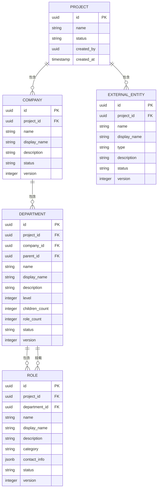
```mermaid
erDiagram
PROJECT {
uuid id PK
string name
string status
uuid created_by
timestamp created_at
}
COMPANY {
uuid id PK
uuid project_id FK
string name
string display_name
string description
string status
integer version
}
DEPARTMENT {
uuid id PK
uuid project_id FK
uuid company_id FK
uuid parent_id FK
string name
string display_name
string description
integer level
integer children_count
integer role_count
string status
integer version
}
ROLE {
uuid id PK
uuid project_id FK
uuid department_id FK
string name
string display_name
string description
string category
jsonb contact_info
string status
integer version
}
EXTERNAL_ENTITY {
uuid id PK
uuid project_id FK
string name
string display_name
string type
string description
string status
integer version
}
PROJECT ||--o{ COMPANY : "包含"
COMPANY ||--o{ DEPARTMENT : "包含"
DEPARTMENT ||--o{ ROLE : "包含"
PROJECT ||--o{ EXTERNAL_ENTITY : "包含"
DEPARTMENT ||--o{ ROLE : "挂载"
```

**图表来源**
- [f-m1-06-api.md:33-170](file://docs/06-test-design/modules/project-management/f-m1-06-company/f-m1-06-api.md#L33-L170)
- [f-m1-07-api.md:38-130](file://docs/06-test-design/modules/project-management/f-m1-07-department/f-m1-07-api.md#L38-L130)
- [f-m1-08-api.md:32-177](file://docs/06-test-design/modules/project-management/f-m1-08-role/f-m1-08-api.md#L32-L177)
- [f-m1-09-api.md:31-120](file://docs/06-test-design/modules/project-management/f-m1-09-external-entity/f-m1-09-api.md#L31-L120)

**章节来源**
- [f-m1-06-api.md:31-618](file://docs/06-test-design/modules/project-management/f-m1-06-company/f-m1-06-api.md#L31-L618)
- [f-m1-07-api.md:36-827](file://docs/06-test-design/modules/project-management/f-m1-07-department/f-m1-07-api.md#L36-L827)
- [f-m1-08-api.md:32-822](file://docs/06-test-design/modules/project-management/f-m1-08-role/f-m1-08-api.md#L32-L822)
- [f-m1-09-api.md:31-683](file://docs/06-test-design/modules/project-management/f-m1-09-external-entity/f-m1-09-api.md#L31-L683)

## 性能考虑

组织架构管理模块在设计时充分考虑了性能优化和扩展性需求，采用了多种性能优化策略：

### 缓存策略

- **多级缓存架构**：采用Redis缓存热点数据，减少数据库访问压力
- **智能缓存失效**：基于版本号的缓存失效机制，确保数据一致性
- **批量查询优化**：支持批量获取部门树形结构，减少网络往返

### 数据库优化

- **索引优化**：为常用查询字段建立复合索引，提升查询性能
- **分页查询**：默认分页机制，避免大数据量查询导致的性能问题
- **延迟加载**：树形结构采用延迟加载策略，按需加载子节点

### 并发控制

- **乐观锁机制**：所有更新操作都支持乐观锁，避免并发冲突
- **事务隔离**：合理的事务边界设计，确保数据一致性
- **死锁预防**：通过统一的锁顺序和超时机制预防死锁

## 故障排除指南

### 常见错误类型及解决方案

#### 1. 数据验证错误

| 错误类型 | 错误码 | 描述 | 解决方案 |
|----------|--------|------|----------|
| 名称格式错误 | `INVALID_NAME_FORMAT` | 名称不符合正则表达式要求 | 检查名称格式，仅允许字母数字下划线连字符 |
| 名称长度错误 | `INVALID_NAME_LENGTH` | 名称长度小于2位 | 确保名称至少包含2个字符 |
| 显示名称必填 | `DISPLAY_NAME_REQUIRED` | 显示名称为空 | 提供有效的显示名称 |
| 唯一性冲突 | `NAME_CONFLICT` | 同项目内名称重复 | 修改名称确保唯一性 |

#### 2. 权限相关错误

| 错误类型 | 错误码 | 描述 | 解决方案 |
|----------|--------|------|----------|
| 项目归档 | `PROJECT_ARCHIVED` | 对归档项目执行写操作 | 恢复项目状态或在活跃项目中操作 |
| 版本冲突 | `VERSION_CONFLICT` | 乐观锁冲突 | 重新获取最新数据后重试 |
| 引用保护 | `ENTITY_IN_USE` | 实体被其他对象引用 | 先解除引用再删除实体 |

#### 3. 数据库相关错误

| 错误类型 | 错误码 | 描述 | 解决方案 |
|----------|--------|------|----------|
| 循环引用 | `CIRCULAR_REFERENCE` | 部门层级形成循环 | 检查父节点设置，避免循环引用 |
| 无效UUID | `INVALID_UUID` | UUID格式不正确 | 验证UUID格式和有效性 |
| 数据库错误 | `DATABASE_ERROR` | 数据库操作失败 | 检查数据库连接和SQL语句 |

### 调试技巧

1. **启用详细日志**：在开发环境中启用详细的API调用日志
2. **使用Postman测试**：通过Postman验证API接口的正确性
3. **数据库监控**：监控慢查询和高负载操作
4. **缓存调试**：检查缓存命中率和失效策略

**章节来源**
- [f-m1-06-api.md:262-486](file://docs/06-test-design/modules/project-management/f-m1-06-company/f-m1-06-api.md#L262-L486)
- [f-m1-07-api.md:352-653](file://docs/06-test-design/modules/project-management/f-m1-07-department/f-m1-07-api.md#L352-L653)
- [f-m1-08-api.md:388-677](file://docs/06-test-design/modules/project-management/f-m1-08-role/f-m1-08-api.md#L388-L677)
- [f-m1-09-api.md:259-548](file://docs/06-test-design/modules/project-management/f-m1-09-external-entity/f-m1-09-api.md#L259-L548)

## 结论

组织架构管理模块通过精心设计的架构和完善的API接口，为企业提供了全面的组织结构管理能力。模块具有以下显著特点：

### 技术优势

1. **模块化设计**：六大核心模块职责清晰，便于维护和扩展
2. **标准化接口**：统一的RESTful API设计，易于集成和使用
3. **强类型验证**：完善的参数验证和错误处理机制
4. **性能优化**：多级缓存和数据库优化策略
5. **安全性保障**：基于角色的访问控制和权限继承机制

### 业务价值

1. **灵活性**：支持多种组织结构模式和业务场景
2. **可扩展性**：模块化架构便于功能扩展和定制
3. **易用性**：直观的API设计和丰富的配置选项
4. **可靠性**：完善的错误处理和数据一致性保证

### 发展前景

随着企业数字化转型的深入，组织架构管理模块将继续演进，支持更多复杂的业务场景和集成需求。模块的设计为未来的功能扩展和技术升级奠定了坚实的基础。

## 附录

### API接口规范汇总

#### 公司管理API
- **查询列表**：`GET /projects/{projectId}/companies`
- **创建公司**：`POST /projects/{projectId}/companies`
- **获取详情**：`GET /api/v1/companies/{companyId}`
- **更新公司**：`PUT /api/v1/companies/{companyId}`
- **删除公司**：`DELETE /api/v1/companies/{companyId}`

#### 部门管理API
- **查询列表**：`GET /companies/{companyId}/departments`
- **创建部门**：`POST /companies/{companyId}/departments`
- **更新部门**：`PUT /api/v1/departments/{departmentId}`
- **删除部门**：`DELETE /api/v1/departments/{departmentId}`

#### 角色管理API
- **查询列表**：`GET /projects/{projectId}/roles`
- **创建角色**：`POST /projects/{projectId}/roles`
- **更新角色**：`PUT /api/v1/roles/{roleId}`
- **删除角色**：`DELETE /api/v1/roles/{roleId}`

#### 外部实体API
- **查询列表**：`GET /projects/{projectId}/external-entities`
- **创建实体**：`POST /projects/{projectId}/external-entities`
- **更新实体**：`PUT /api/v1/external-entities/{entityId}`
- **删除实体**：`DELETE /api/v1/external-entities/{entityId}`

### 配置示例

#### 项目配置
```json
{
  "name": "组织架构管理",
  "version": "1.0.0",
  "dependencies": {
    "项目管理": ">=1.0.0",
    "认证授权": ">=1.0.0",
    "数据库": ">=1.0.0"
  }
}
```

#### 角色行为配置
```json
{
  "name": "审批流程",
  "actions": [
    {
      "name": "提交申请",
      "displayName": "提交采购申请",
      "logic": {
        "userDesc": "用户填写采购申请并提交"
      }
    }
  ],
  "decisions": [
    {
      "name": "金额审批",
      "branches": [
        {
          "name": "approved",
          "condition": "amount <= 10000"
        },
        {
          "name": "rejected", 
          "condition": "amount > 10000"
        }
      ]
    }
  ]
}
```

### 安全考虑

1. **认证授权**：所有API接口都需要有效的认证令牌
2. **权限控制**：基于角色的细粒度权限控制
3. **数据加密**：敏感数据的传输和存储加密
4. **审计日志**：完整的操作审计和访问日志
5. **输入验证**：严格的输入参数验证和清理
6. **速率限制**：防止API滥用和DDoS攻击