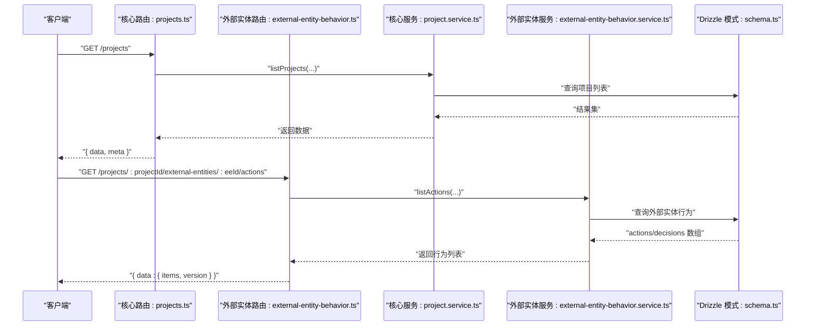
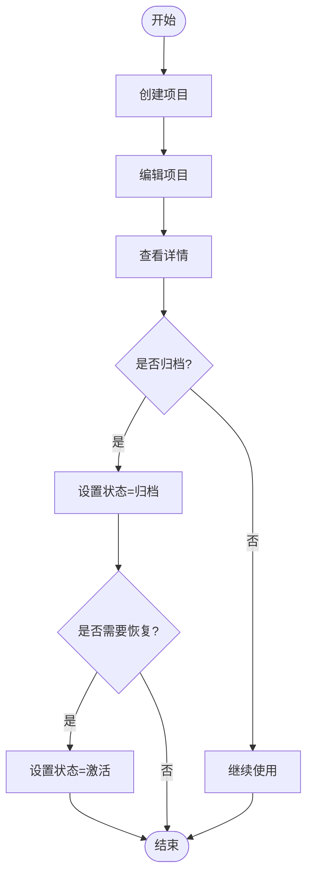
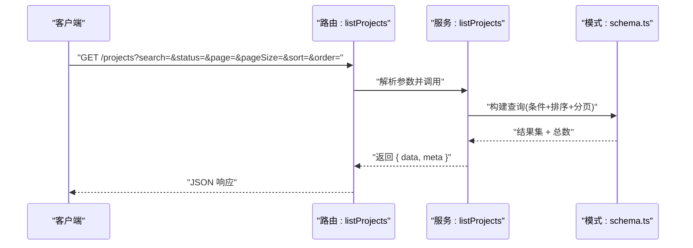
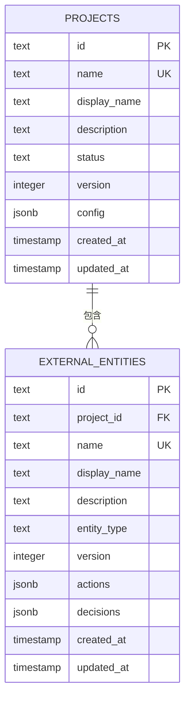
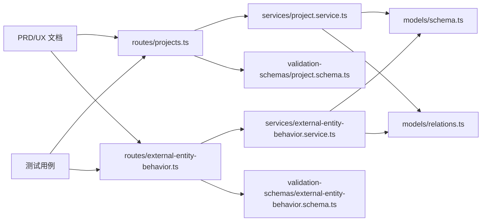

# 项目管理模块

<cite>
**本文引用的文件**
- [packages/api/src/routes/projects.ts](file://packages/api/src/routes/projects.ts)
- [packages/api/src/services/project.service.ts](file://packages/api/src/services/project.service.ts)
- [packages/api/src/models/schema.ts](file://packages/api/src/models/schema.ts)
- [packages/api/src/models/relations.ts](file://packages/api/src/models/relations.ts)
- [packages/validation-schemas/src/project.schema.ts](file://packages/validation-schemas/src/project.schema.ts)
- [packages/api/src/routes/external-entity-behavior.ts](file://packages/api/src/routes/external-entity-behavior.ts)
- [packages/api/src/services/external-entity-behavior.service.ts](file://packages/api/src/services/external-entity-behavior.service.ts)
- [packages/validation-schemas/src/external-entity-behavior.schema.ts](file://packages/validation-schemas/src/external-entity-behavior.schema.ts)
- [docs/03-prd-ux/modules/project-management/project-management-interaction.md](file://docs/03-prd-ux/modules/project-management/project-management-interaction.md)
- [docs/03-prd-ux/modules/project-management/project-management-prd-2.md](file://docs/03-prd-ux/modules/project-management/project-management-prd-2.md)
- [docs/04-tech-design/phase1-infrastructure-plan.md](file://docs/04-tech-design/phase1-infrastructure-plan.md)
- [docs/06-test-design/modules/project-management/f-m1-01-project-list/f-m1-01-api.md](file://docs/06-test-design/modules/project-management/f-m1-01-project-list/f-m1-01-api.md)
- [docs/06-test-design/modules/project-management/f-m1-02-create-project/f-m1-02-api.md](file://docs/06-test-design/modules/project-management/f-m1-02-create-project/f-m1-02-api.md)
- [docs/06-test-design/modules/project-management/f-m1-03-project-detail/f-m1-03-api.md](file://docs/06-test-design/modules/project-management/f-m1-03-project-detail/f-m1-03-api.md)
- [docs/06-test-design/modules/project-management/f-m1-04-edit-project/f-m1-04-api.md](file://docs/06-test-design/modules/project-management/f-m1-04-edit-project/f-m1-04-api.md)
- [docs/06-test-design/modules/project-management/f-m1-05-archive/f-m1-05-api.md](file://docs/06-test-design/modules/project-management/f-m1-05-archive/f-m1-05-api.md)
- [docs/06-test-design/modules/project-management/f-m1-13-external-entity-behavior/f-m1-13-api.md](file://docs/06-test-design/modules/project-management/f-m1-13-external-entity-behavior/f-m1-13-api.md)
- [packages/api/tests/project-management/f-m1-01-list.test.ts](file://packages/api/tests/project-management/f-m1-01-list.test.ts)
- [packages/api/tests/project-management/f-m1-02-create.test.ts](file://packages/api/tests/project-management/f-m1-02-create.test.ts)
- [packages/api/tests/project-management/f-m1-03-detail.test.ts](file://packages/api/tests/project-management/f-m1-03-detail.test.ts)
- [packages/api/tests/project-management/f-m1-04-edit.test.ts](file://packages/api/tests/project-management/f-m1-04-edit.test.ts)
- [packages/api/tests/project-management/f-m1-13-external-entity-behavior.test.ts](file://packages/api/tests/project-management/f-m1-13-external-entity-behavior.test.ts)
</cite>

## 更新摘要
**所做更改**
- 新增外部实体行为管理功能章节，涵盖 Action 和 Decision 的 CRUD 操作
- 更新项目生命周期管理，增加外部实体行为管理的集成关系
- 新增外部实体行为管理的 API 接口设计和数据模型
- 更新用户交互设计，包含外部实体行为管理的界面流程
- 新增外部实体行为管理的错误处理机制和测试用例

## 目录
1. [简介](#简介)
2. [项目结构](#项目结构)
3. [核心组件](#核心组件)
4. [架构总览](#架构总览)
5. [详细组件分析](#详细组件分析)
6. [依赖分析](#依赖分析)
7. [性能考虑](#性能考虑)
8. [故障排查指南](#故障排查指南)
9. [结论](#结论)
10. [附录](#附录)

## 简介
本文件系统化梳理项目管理模块的技术实现与设计，覆盖项目生命周期（创建、编辑、详情、归档与恢复）、列表检索与排序、数据模型、API 接口契约、用户交互设计以及与组织架构、域模型、业务流程的集成关系。**本次更新重点增强了外部实体行为管理能力**，新增对外部实体的 Action 和 Decision 的 CRUD 操作，为 M3 业务流程模块提供行为引用源。文档以仓库中已有的技术设计、产品交互文档与测试用例为依据，结合后端路由、服务层与数据库模式，形成可执行、可验证、可扩展的工程化方案。

## 项目结构
项目管理模块在后端采用分层架构：路由层负责请求解析与响应封装；服务层承载业务逻辑；数据层通过 Drizzle ORM 映射 PostgreSQL 表结构；校验层通过独立的校验模式保障输入输出一致性；前端交互与产品需求由 PRD/UX 文档定义。**新增的外部实体行为管理模块与核心项目管理模块并列，共同构成完整的项目管理体系**。

```mermaid
graph TB
subgraph "核心项目管理"
R["路由: projects.ts"]
S["服务: project.service.ts"]
D["模式: schema.ts"]
REL["关系: relations.ts"]
END
subgraph "外部实体行为管理"
EE_R["路由: external-entity-behavior.ts"]
EE_S["服务: external-entity-behavior.service.ts"]
EE_V["模式: external-entity-behavior.schema.ts"]
END
subgraph "校验层"
V["模式: project.schema.ts"]
END
subgraph "前端交互"
UX1["PRD/UX: 交互设计"]
UX2["PRD/UX: 产品文档"]
END
subgraph "测试"
T1["f-m1-01 列表测试"]
T2["f-m1-02 创建测试"]
T3["f-m1-03 详情测试"]
T4["f-m1-04 编辑测试"]
T13["f-m1-13 外部实体行为测试"]
END
R --> S
S --> D
S --> REL
EE_R --> EE_S
EE_S --> D
EE_S --> REL
R --> V
EE_R --> EE_V
UX1 --> R
UX1 --> EE_R
UX2 --> R
UX2 --> EE_R
T1 --> R
T2 --> R
T3 --> R
T4 --> R
T13 --> EE_R
```

**图表来源**
- [packages/api/src/routes/projects.ts:138-175](file://packages/api/src/routes/projects.ts#L138-L175)
- [packages/api/src/services/project.service.ts](file://packages/api/src/services/project.service.ts)
- [packages/api/src/models/schema.ts:542-570](file://packages/api/src/models/schema.ts#L542-L570)
- [packages/api/src/models/relations.ts:572-585](file://packages/api/src/models/relations.ts#L572-L585)
- [packages/validation-schemas/src/project.schema.ts](file://packages/validation-schemas/src/project.schema.ts)
- [packages/api/src/routes/external-entity-behavior.ts:1-209](file://packages/api/src/routes/external-entity-behavior.ts#L1-L209)
- [packages/api/src/services/external-entity-behavior.service.ts:1-463](file://packages/api/src/services/external-entity-behavior.service.ts#L1-L463)
- [packages/validation-schemas/src/external-entity-behavior.schema.ts:1-90](file://packages/validation-schemas/src/external-entity-behavior.schema.ts#L1-L90)
- [docs/03-prd-ux/modules/project-management/project-management-interaction.md](file://docs/03-prd-ux/modules/project-management/project-management-interaction.md)
- [docs/03-prd-ux/modules/project-management/project-management-prd-2.md](file://docs/03-prd-ux/modules/project-management/project-management-prd-2.md)
- [packages/api/tests/project-management/f-m1-01-list.test.ts](file://packages/api/tests/project-management/f-m1-01-list.test.ts)
- [packages/api/tests/project-management/f-m1-02-create.test.ts](file://packages/api/tests/project-management/f-m1-02-create.test.ts)
- [packages/api/tests/project-management/f-m1-03-detail.test.ts](file://packages/api/tests/project-management/f-m1-03-detail.test.ts)
- [packages/api/tests/project-management/f-m1-04-edit.test.ts](file://packages/api/tests/project-management/f-m1-04-edit.test.ts)
- [packages/api/tests/project-management/f-m1-13-external-entity-behavior.test.ts](file://packages/api/tests/project-management/f-m1-13-external-entity-behavior.test.ts)

**章节来源**
- [packages/api/src/routes/projects.ts:138-175](file://packages/api/src/routes/projects.ts#L138-L175)
- [packages/api/src/models/schema.ts:542-570](file://packages/api/src/models/schema.ts#L542-L570)
- [packages/api/src/models/relations.ts:572-585](file://packages/api/src/models/relations.ts#L572-L585)
- [packages/validation-schemas/src/project.schema.ts](file://packages/validation-schemas/src/project.schema.ts)
- [packages/api/src/routes/external-entity-behavior.ts:1-209](file://packages/api/src/routes/external-entity-behavior.ts#L1-L209)
- [packages/api/src/services/external-entity-behavior.service.ts:1-463](file://packages/api/src/services/external-entity-behavior.service.ts#L1-L463)
- [packages/validation-schemas/src/external-entity-behavior.schema.ts:1-90](file://packages/validation-schemas/src/external-entity-behavior.schema.ts#L1-L90)
- [docs/03-prd-ux/modules/project-management/project-management-interaction.md](file://docs/03-prd-ux/modules/project-management/project-management-interaction.md)
- [docs/03-prd-ux/modules/project-management/project-management-prd-2.md](file://docs/03-prd-ux/modules/project-management/project-management-prd-2.md)
- [packages/api/tests/project-management/f-m1-01-list.test.ts](file://packages/api/tests/project-management/f-m1-01-list.test.ts)
- [packages/api/tests/project-management/f-m1-02-create.test.ts](file://packages/api/tests/project-management/f-m1-02-create.test.ts)
- [packages/api/tests/project-management/f-m1-03-detail.test.ts](file://packages/api/tests/project-management/f-m1-03-detail.test.ts)
- [packages/api/tests/project-management/f-m1-04-edit.test.ts](file://packages/api/tests/project-management/f-m1-04-edit.test.ts)
- [packages/api/tests/project-management/f-m1-13-external-entity-behavior.test.ts](file://packages/api/tests/project-management/f-m1-13-external-entity-behavior.test.ts)

## 核心组件
- **核心项目管理组件**：路由层提供项目管理相关 RESTful 端点，包括列表查询、创建、详情、汇总等；服务层封装项目业务逻辑；数据层定义项目主表结构及关系占位；校验层定义输入输出模式。
- **外部实体行为管理组件**：新增的独立模块，提供外部实体的 Action 和 Decision CRUD 操作，采用 JSONB 数组存储和乐观锁机制。
- **前端交互组件**：定义用户操作流程与界面布局，支撑项目生命周期各阶段体验，新增外部实体行为管理的交互设计。
- **测试组件**：围绕关键场景（列表、创建、详情、编辑、外部实体行为）编写测试用例，验证行为与边界。

**章节来源**
- [packages/api/src/routes/projects.ts:138-175](file://packages/api/src/routes/projects.ts#L138-L175)
- [packages/api/src/services/project.service.ts](file://packages/api/src/services/project.service.ts)
- [packages/api/src/models/schema.ts:542-570](file://packages/api/src/models/schema.ts#L542-L570)
- [packages/validation-schemas/src/project.schema.ts](file://packages/validation-schemas/src/project.schema.ts)
- [packages/api/src/routes/external-entity-behavior.ts:1-209](file://packages/api/src/routes/external-entity-behavior.ts#L1-L209)
- [packages/api/src/services/external-entity-behavior.service.ts:1-463](file://packages/api/src/services/external-entity-behavior.service.ts#L1-L463)
- [packages/validation-schemas/src/external-entity-behavior.schema.ts:1-90](file://packages/validation-schemas/src/external-entity-behavior.schema.ts#L1-L90)
- [docs/03-prd-ux/modules/project-management/project-management-interaction.md](file://docs/03-prd-ux/modules/project-management/project-management-interaction.md)
- [packages/api/tests/project-management/f-m1-01-list.test.ts](file://packages/api/tests/project-management/f-m1-01-list.test.ts)
- [packages/api/tests/project-management/f-m1-02-create.test.ts](file://packages/api/tests/project-management/f-m1-02-create.test.ts)
- [packages/api/tests/project-management/f-m1-03-detail.test.ts](file://packages/api/tests/project-management/f-m1-03-detail.test.ts)
- [packages/api/tests/project-management/f-m1-04-edit.test.ts](file://packages/api/tests/project-management/f-m1-04-edit.test.ts)
- [packages/api/tests/project-management/f-m1-13-external-entity-behavior.test.ts](file://packages/api/tests/project-management/f-m1-13-external-entity-behavior.test.ts)

## 架构总览
下图展示了从请求到响应的关键调用链路，以及与数据层的交互关系。**新增的外部实体行为管理模块与核心项目管理模块并行工作，共享相同的校验层和错误处理机制**。



**图表来源**
- [packages/api/src/routes/projects.ts:138-175](file://packages/api/src/routes/projects.ts#L138-L175)
- [packages/api/src/services/project.service.ts](file://packages/api/src/services/project.service.ts)
- [packages/api/src/models/schema.ts:542-570](file://packages/api/src/models/schema.ts#L542-L570)
- [packages/api/src/routes/external-entity-behavior.ts:156-209](file://packages/api/src/routes/external-entity-behavior.ts#L156-L209)
- [packages/api/src/services/external-entity-behavior.service.ts:128-134](file://packages/api/src/services/external-entity-behavior.service.ts#L128-L134)

## 详细组件分析

### 1) 项目生命周期管理
- **创建**：接收标准化输入，写入项目表，返回新建项目对象。
- **编辑**：按 ID 获取并更新项目信息，支持并发版本号控制。
- **详情**：按 ID 查询项目详情，支持汇总视图。
- **归档与恢复**：通过状态字段切换实现，配合版本号避免并发覆盖。
- **外部实体行为集成**：项目归档状态直接影响外部实体行为的写操作权限。



**章节来源**
- [packages/api/src/routes/projects.ts:152-175](file://packages/api/src/routes/projects.ts#L152-L175)
- [packages/api/src/services/project.service.ts](file://packages/api/src/services/project.service.ts)
- [packages/api/src/models/schema.ts:542-570](file://packages/api/src/models/schema.ts#L542-L570)

### 2) 项目列表展示、搜索过滤、排序
- **查询参数**：支持关键词搜索、状态过滤、分页（page/pageSize）、排序字段与方向。
- **返回结构**：data 为项目集合，meta 包含分页元信息。
- **实现要点**：服务层组合 SQL 条件与排序，统一返回格式。



**图表来源**
- [packages/api/src/routes/projects.ts:138-150](file://packages/api/src/routes/projects.ts#L138-L150)
- [packages/api/src/services/project.service.ts](file://packages/api/src/services/project.service.ts)
- [packages/api/src/models/schema.ts:542-570](file://packages/api/src/models/schema.ts#L542-L570)

**章节来源**
- [packages/api/src/routes/projects.ts:138-150](file://packages/api/src/routes/projects.ts#L138-L150)
- [docs/06-test-design/modules/project-management/f-m1-01-project-list/f-m1-01-api.md](file://docs/06-test-design/modules/project-management/f-m1-01-project-list/f-m1-01-api.md)

### 3) 数据模型设计
- **项目主表**：projects
  - 关键字段：id、name、displayName、description、status、version、config、createdAt、updatedAt
  - 约束：name 唯一、status 默认 active、version 默认 1
- **外部实体表**：external_entities
  - 关键字段：id、projectId、name、displayName、description、entityType、version、actions、decisions、createdAt、updatedAt
  - 约束：actions/decisions 为 JSONB 数组，默认为空数组
- **关系占位**：relations 中预留与其他模块（域实体、业务流程、公司等）的关联扩展点



**图表来源**
- [packages/api/src/models/schema.ts:542-570](file://packages/api/src/models/schema.ts#L542-L570)
- [packages/api/src/models/relations.ts:572-585](file://packages/api/src/models/relations.ts#L572-L585)
- [docs/04-tech-design/phase1-infrastructure-plan.md:542-585](file://docs/04-tech-design/phase1-infrastructure-plan.md#L542-L585)

**章节来源**
- [packages/api/src/models/schema.ts:542-570](file://packages/api/src/models/schema.ts#L542-L570)
- [packages/api/src/models/relations.ts:572-585](file://packages/api/src/models/relations.ts#L572-L585)
- [docs/04-tech-design/phase1-infrastructure-plan.md:542-585](file://docs/04-tech-design/phase1-infrastructure-plan.md#L542-L585)

### 4) 外部实体行为管理
**新增功能**：管理外部实体的 Action 和 Decision JSONB 数组，为 M3 业务流程模块提供行为引用源。

#### 4.1 Action CRUD 操作
- **查询**：获取外部实体的所有 Action，按数组原始顺序返回
- **创建**：创建新的 Action，系统生成 UUID，支持输入输出参数校验
- **更新**：更新现有 Action，支持乐观锁防并发覆盖
- **删除**：删除 Action，检查流程引用完整性

#### 4.2 Decision CRUD 操作
- **查询**：获取外部实体的所有 Decision，按数组原始顺序返回
- **创建**：创建新的 Decision，至少包含 2 个分支
- **更新**：更新现有 Decision，支持分支校验
- **删除**：删除 Decision，检查流程引用完整性

#### 4.3 校验规则
- **Action 校验**：name 唯一性（在外部实体范围内）、displayName 必填、NodeIO 校验、ToolRef 校验
- **Decision 校验**：分支数量≥2、分支名称唯一、NodeIO 校验、edgeIds 为空数组
- **通用规则**：项目状态检查、乐观锁校验、引用完整性检查

```mermaid
flowchart TD
ActionCRUD["Action CRUD"] --> ListA["查询 Actions"]
ActionCRUD --> CreateA["创建 Action"]
ActionCRUD --> UpdateA["更新 Action"]
ActionCRUD --> DeleteA["删除 Action"]
DecisionCRUD["Decision CRUD"] --> ListD["查询 Decisions"]
DecisionCRUD --> CreateD["创建 Decision"]
DecisionCRUD --> UpdateD["更新 Decision"]
DecisionCRUD --> DeleteD["删除 Decision"]
Validation["校验规则"] --> NameUnique["name 唯一性"]
Validation --> IOCheck["NodeIO 校验"]
Validation --> ToolCheck["ToolRef 校验"]
Validation --> BranchCheck["分支校验"]
Validation --> ProjectCheck["项目状态检查"]
Validation --> LockCheck["乐观锁校验"]
Validation --> RefCheck["引用完整性检查"]
```



**图表来源**
- [packages/api/src/routes/external-entity-behavior.ts:37-149](file://packages/api/src/routes/external-entity-behavior.ts#L37-L149)
- [packages/api/src/services/external-entity-behavior.service.ts:128-297](file://packages/api/src/services/external-entity-behavior.service.ts#L128-L297)
- [packages/api/src/services/external-entity-behavior.service.ts:309-462](file://packages/api/src/services/external-entity-behavior.service.ts#L309-L462)

**章节来源**
- [packages/api/src/routes/external-entity-behavior.ts:1-209](file://packages/api/src/routes/external-entity-behavior.ts#L1-L209)
- [packages/api/src/services/external-entity-behavior.service.ts:1-463](file://packages/api/src/services/external-entity-behavior.service.ts#L1-L463)
- [packages/validation-schemas/src/external-entity-behavior.schema.ts:1-90](file://packages/validation-schemas/src/external-entity-behavior.schema.ts#L1-L90)
- [docs/03-prd-ux/modules/project-management/project-management-prd-2.md:1062-1259](file://docs/03-prd-ux/modules/project-management/project-management-prd-2.md#L1062-L1259)

### 5) API 接口设计
#### 5.1 核心项目管理 API
- **列表查询**
  - 方法与路径：GET /projects
  - 查询参数：search、status、page、pageSize、sort、order
  - 响应：{ data: 项目数组, meta: 分页元信息 }
- **创建项目**
  - 方法与路径：POST /projects
  - 请求体：符合项目输入模式
  - 响应：{ data: 新建项目 }，状态码 201
- **详情查询**
  - 方法与路径：GET /projects/:id
  - 响应：{ data: 项目详情 }
- **汇总查询**
  - 方法与路径：GET /projects/:id/summary
  - 响应：{ data: 项目汇总信息 }

#### 5.2 外部实体行为管理 API
- **Action CRUD**
  - 查询 Actions：GET /api/v1/projects/:projectId/external-entities/:eeId/actions
  - 创建 Action：POST /api/v1/projects/:projectId/external-entities/:eeId/actions
  - 更新 Action：PUT /api/v1/projects/:projectId/external-entities/:eeId/actions/:actionId
  - 删除 Action：DELETE /api/v1/projects/:projectId/external-entities/:eeId/actions/:actionId
- **Decision CRUD**
  - 查询 Decisions：GET /api/v1/projects/:projectId/external-entities/:eeId/decisions
  - 创建 Decision：POST /api/v1/projects/:projectId/external-entities/:eeId/decisions
  - 更新 Decision：PUT /api/v1/projects/:projectId/external-entities/:eeId/decisions/:decisionId
  - 删除 Decision：DELETE /api/v1/projects/:projectId/external-entities/:eeId/decisions/:decisionId

**章节来源**
- [packages/api/src/routes/projects.ts:138-175](file://packages/api/src/routes/projects.ts#L138-L175)
- [packages/validation-schemas/src/project.schema.ts](file://packages/validation-schemas/src/project.schema.ts)
- [packages/api/src/routes/external-entity-behavior.ts:37-149](file://packages/api/src/routes/external-entity-behavior.ts#L37-L149)
- [packages/validation-schemas/src/external-entity-behavior.schema.ts:37-89](file://packages/validation-schemas/src/external-entity-behavior.schema.ts#L37-L89)
- [docs/06-test-design/modules/project-management/f-m1-01-project-list/f-m1-01-api.md](file://docs/06-test-design/modules/project-management/f-m1-01-project-list/f-m1-01-api.md)
- [docs/06-test-design/modules/project-management/f-m1-02-create-project/f-m1-02-api.md](file://docs/06-test-design/modules/project-management/f-m1-02-create-project/f-m1-02-api.md)
- [docs/06-test-design/modules/project-management/f-m1-03-project-detail/f-m1-03-api.md](file://docs/06-test-design/modules/project-management/f-m1-03-project-detail/f-m1-03-api.md)
- [docs/06-test-design/modules/project-management/f-m1-04-edit-project/f-m1-04-api.md](file://docs/06-test-design/modules/project-management/f-m1-04-edit-project/f-m1-04-api.md)
- [docs/06-test-design/modules/project-management/f-m1-05-archive/f-m1-05-api.md](file://docs/06-test-design/modules/project-management/f-m1-05-archive/f-m1-05-api.md)
- [docs/06-test-design/modules/project-management/f-m1-13-external-entity-behavior/f-m1-13-api.md](file://docs/06-test-design/modules/project-management/f-m1-13-external-entity-behavior/f-m1-13-api.md)

### 6) 用户交互设计
- **核心项目管理交互**：PRD/UX 文档定义了项目管理的界面布局与操作流程，涵盖创建、编辑、查看、归档/恢复等关键步骤。
- **外部实体行为管理交互**：新增外部实体行为管理的交互设计，包括外部实体详情页、Action/Decision 列表页、表单编辑对话框等。
- **体验优化**：通过清晰的状态提示、分页与筛选能力、快速概览汇总，提升用户效率。外部实体卡片新增行为计数展示。

**章节来源**
- [docs/03-prd-ux/modules/project-management/project-management-interaction.md](file://docs/03-prd-ux/modules/project-management/project-management-interaction.md)
- [docs/03-prd-ux/modules/project-management/project-management-prd-2.md](file://docs/03-prd-ux/modules/project-management/project-management-prd-2.md)

### 7) 与其他模块的集成关系
- **组织架构**：项目可归属组织/部门，后续在 relations 中建立外键关联。
- **域模型**：项目承载领域概念，后续在 relations 中挂载域实体关系。
- **业务流程**：项目作为流程载体，后续在 relations 中挂载流程实例。
- **外部实体行为**：项目管理模块与外部实体行为管理模块紧密集成，外部实体行为为业务流程模块提供行为引用源。
- **外部实体管理**：F-M1-09 外部实体管理为 F-M1-13 外部实体行为管理提供基础，行为管理依赖外部实体的存在。

**章节来源**
- [packages/api/src/models/relations.ts:572-585](file://packages/api/src/models/relations.ts#L572-L585)
- [docs/04-tech-design/phase1-infrastructure-plan.md:542-585](file://docs/04-tech-design/phase1-infrastructure-plan.md#L542-L585)
- [docs/03-prd-ux/modules/project-management/project-management-prd-2.md:1062-1101](file://docs/03-prd-ux/modules/project-management/project-management-prd-2.md#L1062-L1101)

### 8) 错误处理机制
- **路由层**：对异常进行捕获与统一响应包装，保证 API 契约稳定。
- **服务层**：对业务异常（如唯一约束冲突、并发版本冲突）进行分类处理。
- **校验层**：通过输入/输出模式提前拦截非法请求，降低运行时错误概率。
- **外部实体行为管理**：新增专门的错误处理机制，包括项目归档检查、引用完整性检查、乐观锁冲突处理等。
- **测试层**：针对边界条件与异常分支编写测试，保障错误路径可验证。

**章节来源**
- [packages/api/src/routes/projects.ts:138-175](file://packages/api/src/routes/projects.ts#L138-L175)
- [packages/api/src/services/project.service.ts](file://packages/api/src/services/project.service.ts)
- [packages/validation-schemas/src/project.schema.ts](file://packages/validation-schemas/src/project.schema.ts)
- [packages/api/src/routes/external-entity-behavior.ts:156-209](file://packages/api/src/routes/external-entity-behavior.ts#L156-L209)
- [packages/api/src/services/external-entity-behavior.service.ts:37-45](file://packages/api/src/services/external-entity-behavior.service.ts#L37-L45)
- [packages/api/tests/project-management/f-m1-01-list.test.ts](file://packages/api/tests/project-management/f-m1-01-list.test.ts)
- [packages/api/tests/project-management/f-m1-02-create.test.ts](file://packages/api/tests/project-management/f-m1-02-create.test.ts)
- [packages/api/tests/project-management/f-m1-03-detail.test.ts](file://packages/api/tests/project-management/f-m1-03-detail.test.ts)
- [packages/api/tests/project-management/f-m1-04-edit.test.ts](file://packages/api/tests/project-management/f-m1-04-edit.test.ts)
- [packages/api/tests/project-management/f-m1-13-external-entity-behavior.test.ts](file://packages/api/tests/project-management/f-m1-13-external-entity-behavior.test.ts)

## 依赖分析
- **核心项目管理模块**：路由依赖服务层，服务层依赖数据层模式与关系定义。
- **外部实体行为管理模块**：路由依赖服务层，服务层依赖数据层模式与共享校验逻辑。
- **共享依赖**：两个模块共享校验层、错误处理机制和测试用例框架。
- **前端交互依赖**：PRD/UX 文档同时定义核心项目管理和外部实体行为管理的交互流程。



**图表来源**
- [packages/api/src/routes/projects.ts:138-175](file://packages/api/src/routes/projects.ts#L138-L175)
- [packages/api/src/services/project.service.ts](file://packages/api/src/services/project.service.ts)
- [packages/api/src/models/schema.ts:542-570](file://packages/api/src/models/schema.ts#L542-L570)
- [packages/api/src/models/relations.ts:572-585](file://packages/api/src/models/relations.ts#L572-L585)
- [packages/validation-schemas/src/project.schema.ts](file://packages/validation-schemas/src/project.schema.ts)
- [packages/api/src/routes/external-entity-behavior.ts:1-209](file://packages/api/src/routes/external-entity-behavior.ts#L1-L209)
- [packages/api/src/services/external-entity-behavior.service.ts:1-463](file://packages/api/src/services/external-entity-behavior.service.ts#L1-L463)
- [packages/validation-schemas/src/external-entity-behavior.schema.ts:1-90](file://packages/validation-schemas/src/external-entity-behavior.schema.ts#L1-L90)
- [docs/03-prd-ux/modules/project-management/project-management-interaction.md](file://docs/03-prd-ux/modules/project-management/project-management-interaction.md)
- [packages/api/tests/project-management/f-m1-01-list.test.ts](file://packages/api/tests/project-management/f-m1-01-list.test.ts)
- [packages/api/tests/project-management/f-m1-13-external-entity-behavior.test.ts](file://packages/api/tests/project-management/f-m1-13-external-entity-behavior.test.ts)

**章节来源**
- [packages/api/src/routes/projects.ts:138-175](file://packages/api/src/routes/projects.ts#L138-L175)
- [packages/api/src/services/project.service.ts](file://packages/api/src/services/project.service.ts)
- [packages/api/src/models/schema.ts:542-570](file://packages/api/src/models/schema.ts#L542-L570)
- [packages/api/src/models/relations.ts:572-585](file://packages/api/src/models/relations.ts#L572-L585)
- [packages/validation-schemas/src/project.schema.ts](file://packages/validation-schemas/src/project.schema.ts)
- [packages/api/src/routes/external-entity-behavior.ts:1-209](file://packages/api/src/routes/external-entity-behavior.ts#L1-L209)
- [packages/api/src/services/external-entity-behavior.service.ts:1-463](file://packages/api/src/services/external-entity-behavior.service.ts#L1-L463)
- [packages/validation-schemas/src/external-entity-behavior.schema.ts:1-90](file://packages/validation-schemas/src/external-entity-behavior.schema.ts#L1-L90)
- [docs/03-prd-ux/modules/project-management/project-management-interaction.md](file://docs/03-prd-ux/modules/project-management/project-management-interaction.md)
- [packages/api/tests/project-management/f-m1-01-list.test.ts](file://packages/api/tests/project-management/f-m1-01-list.test.ts)
- [packages/api/tests/project-management/f-m1-13-external-entity-behavior.test.ts](file://packages/api/tests/project-management/f-m1-13-external-entity-behavior.test.ts)

## 性能考虑
- **查询优化**：在常用过滤字段（status）与排序字段（createdAt/updatedAt）上建立索引，减少全表扫描。
- **分页策略**：合理设置默认与最大分页大小，避免超大偏移导致的性能退化。
- **并发控制**：利用 version 字段实现乐观锁，减少写冲突带来的重试成本。
- **缓存策略**：对高频只读数据（如项目概览、外部实体行为列表）引入缓存，降低数据库压力。
- **批量操作**：对批量归档/恢复场景，采用分批事务提交，避免长事务阻塞。
- **JSONB 查询优化**：外部实体行为管理采用 JSONB 数组存储，适合读多写少的场景，可通过适当的索引优化查询性能。

## 故障排查指南
- **列表查询无结果或分页异常**
  - 检查查询参数是否正确传递，确认服务层条件拼装逻辑。
  - 参考测试用例定位边界条件。
- **创建失败（唯一约束冲突）**
  - 校验 name 是否重复，检查路由层错误处理是否返回明确错误码。
- **详情查询 404**
  - 确认 ID 是否有效，服务层是否存在空值处理。
- **编辑失败（版本冲突）**
  - 检查 version 是否最新，必要时引导用户刷新页面重试。
- **归档/恢复无效**
  - 确认状态字段映射与服务层更新逻辑一致。
- **外部实体行为管理异常**
  - 检查项目状态是否为 active，确认外部实体是否存在。
  - 验证 Action/Decision 的 name 唯一性，检查 NodeIO 和 ToolRef 校验规则。
  - 确认引用完整性检查是否通过，检查流程节点引用情况。

**章节来源**
- [packages/api/tests/project-management/f-m1-01-list.test.ts](file://packages/api/tests/project-management/f-m1-01-list.test.ts)
- [packages/api/tests/project-management/f-m1-02-create.test.ts](file://packages/api/tests/project-management/f-m1-02-create.test.ts)
- [packages/api/tests/project-management/f-m1-03-detail.test.ts](file://packages/api/tests/project-management/f-m1-03-detail.test.ts)
- [packages/api/tests/project-management/f-m1-04-edit.test.ts](file://packages/api/tests/project-management/f-m1-04-edit.test.ts)
- [packages/api/tests/project-management/f-m1-13-external-entity-behavior.test.ts](file://packages/api/tests/project-management/f-m1-13-external-entity-behavior.test.ts)

## 结论
项目管理模块以清晰的分层架构与完善的契约设计为基础，实现了从创建到归档/恢复的完整生命周期管理，并提供了可扩展的数据模型与 API 接口。**本次更新显著增强了外部实体行为管理能力，新增了 Action 和 Decision 的 CRUD 操作，为 M3 业务流程模块奠定了坚实基础**。结合 PRD/UX 的交互设计与测试用例的验证，模块具备良好的工程化落地能力。后续可在关系扩展、索引优化与缓存策略方面持续演进，同时关注外部实体行为管理的性能优化和并发控制。

## 附录
- **最佳实践**
  - 输入输出严格遵循校验模式，保持 API 稳定性。
  - 使用 version 字段实现乐观锁，提升并发安全性。
  - 在高并发场景下，优先采用分页与缓存策略。
  - 对关键流程补充端到端测试，确保跨模块集成稳定。
  - 外部实体行为管理采用 JSONB 数组存储，注意数据结构的向后兼容性。
  - 项目归档状态会影响外部实体行为的写操作，需在前端做好状态提示。