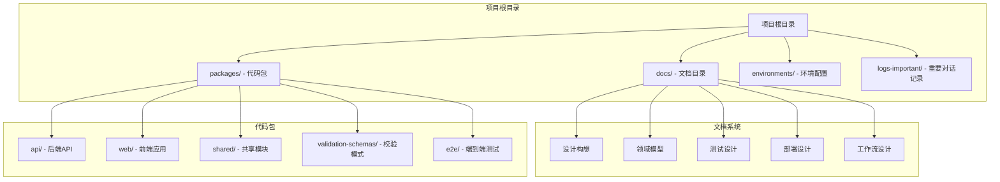
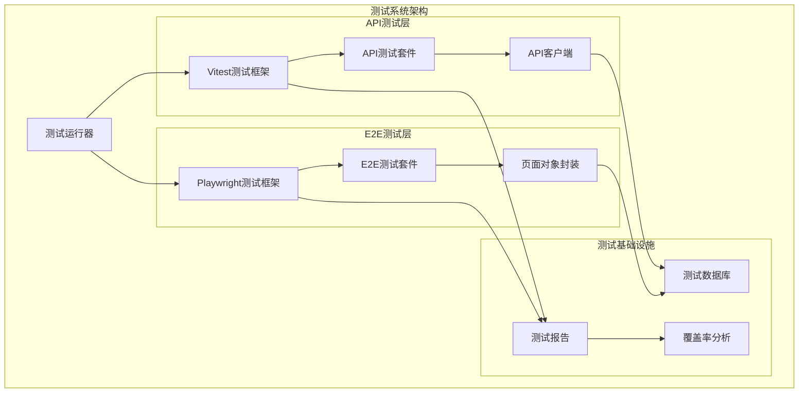
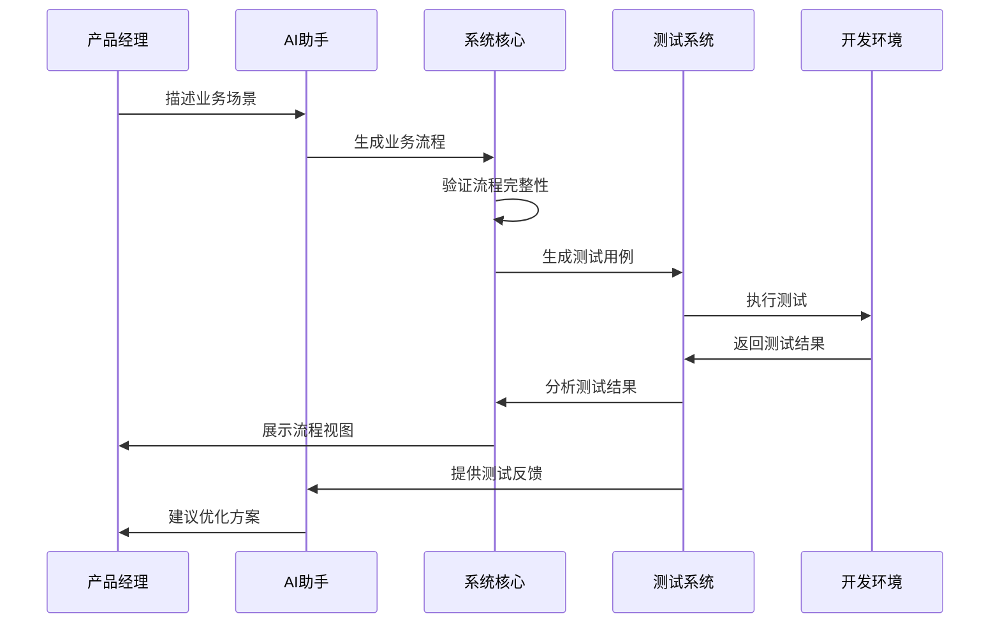
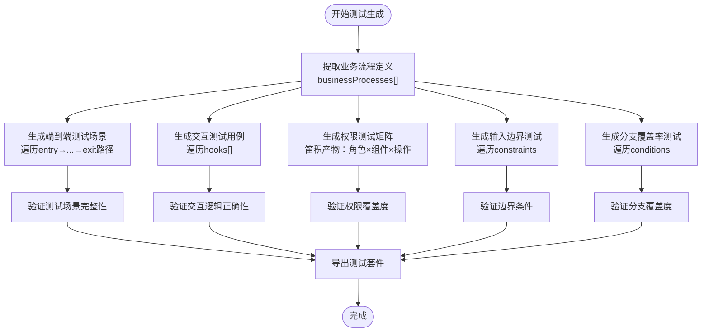
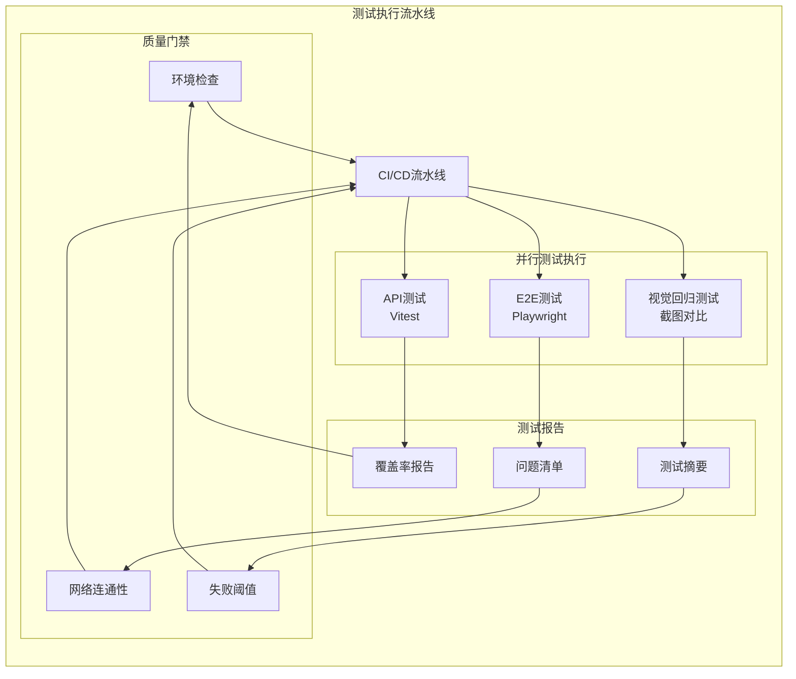
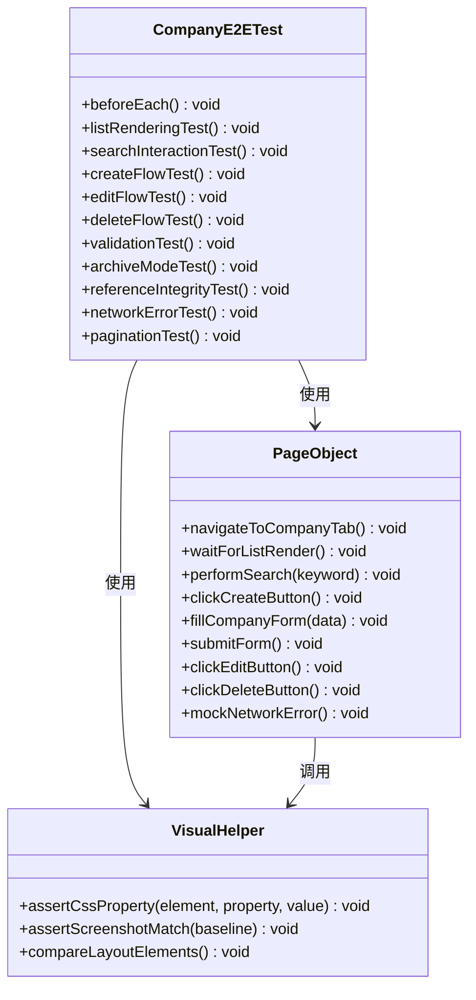
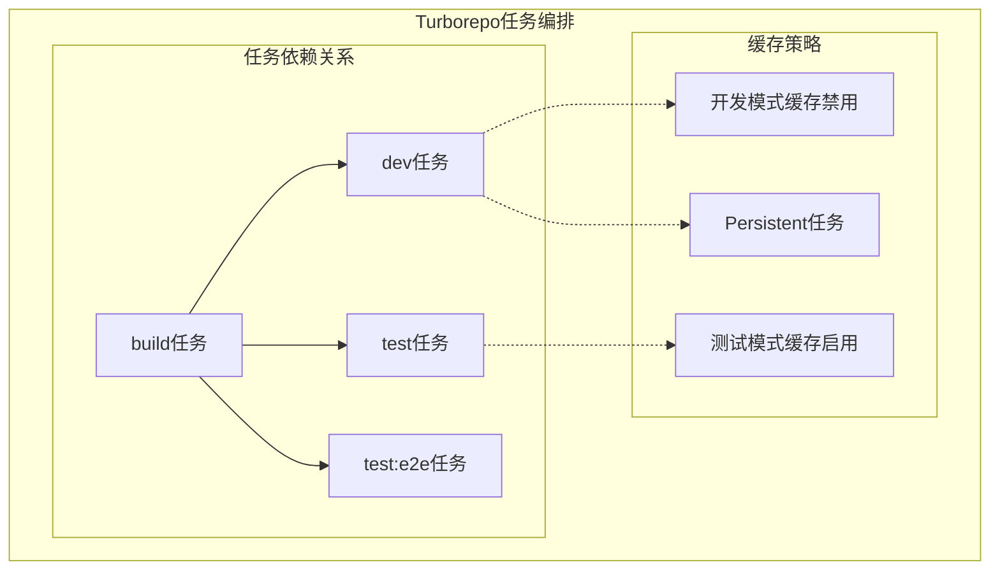
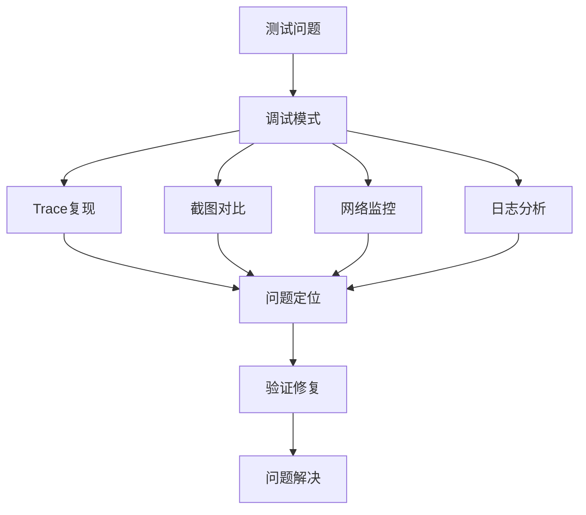

# 业务流程测试设计

<cite>
**本文档引用的文件**
- [README.md](file://README.md)
- [workflow.md](file://docs/01-design-idea/workflow.md)
- [business-process.md](file://docs/02-domain-model/business-process.md)
- [dev-test-loop-design.md](file://docs/00-project/workflow/dev-test-loop-design.md)
- [2026-05-21-f-m1-06-company.md](file://docs/superpowers/plans/2026-05-21-f-m1-06-company.md)
- [package.json](file://package.json)
- [turbo.json](file://turbo.json)
</cite>

## 目录
1. [简介](#简介)
2. [项目结构](#项目结构)
3. [核心组件](#核心组件)
4. [架构概览](#架构概览)
5. [详细组件分析](#详细组件分析)
6. [依赖分析](#依赖分析)
7. [性能考虑](#性能考虑)
8. [故障排除指南](#故障排除指南)
9. [结论](#结论)

## 简介

本项目是一个面向AI时代的软件产品定义与生命周期管理平台，专注于"给AI用的结构化语义"，确保原型中包含的业务逻辑、交互逻辑、数据关系等关键信息能够完整传递给下游Coding Agent。

项目采用六阶段工作流：理解业务（领域建模）→ 定义系统运转（业务流程设计）→ 定义人机接口（页面/组件）→ 视觉与验证（外部设计稿集成）→ 与研发集成（MCP输出规格）→ 与测试集成（测试用例生成）。

## 项目结构

项目采用Monorepo架构，包含以下核心模块：



**图表来源**
- [README.md:32-52](file://README.md#L32-L52)
- [package.json:1-2](file://package.json#L1-L2)

**章节来源**
- [README.md:32-52](file://README.md#L32-L52)
- [package.json:1-2](file://package.json#L1-L2)

## 核心组件

### 业务流程系统

业务流程系统是项目的核心组件，采用四层架构模型：

```mermaid
graph TB
subgraph "业务流程四层架构"
Layer3[流程架构层<br/>ProcessArchitecture<br/>树形分类导航]
Layer2[流程层<br/>Process<br/>命名切片]
Layer1[真相层<br/>全局节点池<br/>processNodes[] + processEdges[]]
end
Layer3 --> Layer2
Layer2 --> Layer1
subgraph "真相层详细结构"
Nodes[processNodes[]<br/>ActivityNode + DecisionNode]
Edges[processEdges[]<br/>连接+数据传递]
end
Layer1 --> Nodes
Layer1 --> Edges
```

**图表来源**
- [business-process.md:18-67](file://docs/02-domain-model/business-process.md#L18-L67)

业务流程系统的核心特征包括：
- **全局池即真相**：Project根级的processNodes[] + processEdges[]是全部业务流数据的唯一承载
- **节点原子且唯一**：一个Action/Decision在全局池中只有一条记录
- **纯管道数据流**：所有数据通过Action I/O + Edge.mappings流动
- **流程是切片**：流程=从全局池中选取连续节点段+边的命名视图

**章节来源**
- [business-process.md:71-88](file://docs/02-domain-model/business-process.md#L71-L88)

### 测试系统架构

测试系统采用双层测试架构，支持API测试和E2E测试：



**图表来源**
- [dev-test-loop-design.md:86-173](file://docs/00-project/workflow/dev-test-loop-design.md#L86-L173)

**章节来源**
- [dev-test-loop-design.md:86-173](file://docs/00-project/workflow/dev-test-loop-design.md#L86-L173)

## 架构概览

项目采用Dev-Test闭环设计，确保开发与测试的紧密集成：



**图表来源**
- [workflow.md:542-576](file://docs/01-design-idea/workflow.md#L542-L576)

## 详细组件分析

### 业务流程测试用例生成

测试系统支持从业务流程定义自动生成测试用例：



**图表来源**
- [workflow.md:550-563](file://docs/01-design-idea/workflow.md#L550-L563)

### 测试执行流水线

测试执行采用并行化设计，支持多种测试类型：



**图表来源**
- [dev-test-loop-design.md:977-1007](file://docs/00-project/workflow/dev-test-loop-design.md#L977-L1007)

**章节来源**
- [workflow.md:550-563](file://docs/01-design-idea/workflow.md#L550-L563)
- [dev-test-loop-design.md:977-1007](file://docs/00-project/workflow/dev-test-loop-design.md#L977-L1007)

### 公司管理模块测试设计

以公司管理模块为例，展示完整的测试设计实践：



**图表来源**
- [2026-05-21-f-m1-06-company.md:1231-1335](file://docs/superpowers/plans/2026-05-21-f-m1-06-company.md#L1231-L1335)

**章节来源**
- [2026-05-21-f-m1-06-company.md:1231-1335](file://docs/superpowers/plans/2026-05-21-f-m1-06-company.md#L1231-L1335)

## 依赖分析

项目采用Turborepo进行任务编排，支持并行构建和测试：



**图表来源**
- [turbo.json:1-1](file://turbo.json#L1-L1)

**章节来源**
- [turbo.json:1-1](file://turbo.json#L1-L1)
- [package.json:1-2](file://package.json#L1-L2)

## 性能考虑

测试系统在设计时充分考虑了性能优化：

### 测试并行化策略
- **API测试**：使用Vitest的内置并行执行能力
- **E2E测试**：Playwright的worker并行执行
- **视觉测试**：截图对比的批量化处理

### 缓存机制
- **构建缓存**：Turborepo的智能缓存系统
- **测试缓存**：测试结果的增量更新
- **依赖缓存**：外部依赖的版本锁定

### 资源管理
- **内存优化**：测试数据的及时清理
- **并发控制**：避免资源竞争
- **超时处理**：防止长时间阻塞

## 故障排除指南

### 常见测试问题

| 问题类型 | 症状 | 排查步骤 | 解决方案 |
|---------|------|----------|----------|
| 环境配置问题 | 测试无法启动 | 检查环境变量和端口占用 | 重新配置开发环境 |
| 网络连接问题 | API测试失败 | 验证数据库连接和网络连通性 | 重启服务或检查防火墙 |
| 截图对比失败 | 视觉测试不稳定 | 检查浏览器版本和屏幕分辨率 | 更新基准截图或调整容差 |
| 并发冲突 | 测试结果不一致 | 检查测试数据隔离 | 使用测试前缀标识符 |

### 调试工具



**图表来源**
- [dev-test-loop-design.md:977-1007](file://docs/00-project/workflow/dev-test-loop-design.md#L977-L1007)

**章节来源**
- [dev-test-loop-design.md:977-1007](file://docs/00-project/workflow/dev-test-loop-design.md#L977-L1007)

## 结论

本业务流程测试设计文档展示了AI时代软件原型管理系统中测试体系的完整架构。通过将业务流程定义直接转化为测试用例，实现了从产品定义到测试验证的完整闭环。

关键优势包括：
- **自动化程度高**：从业务流程定义自动生成测试用例
- **覆盖面广**：涵盖端到端场景、交互测试、权限矩阵、边界测试、分支覆盖
- **执行效率高**：支持并行测试执行和智能缓存
- **质量保障强**：完善的故障排除和调试机制

该设计为后续的测试系统集成奠定了坚实基础，确保了从概念阶段到最终产品的质量可控性和可追溯性。