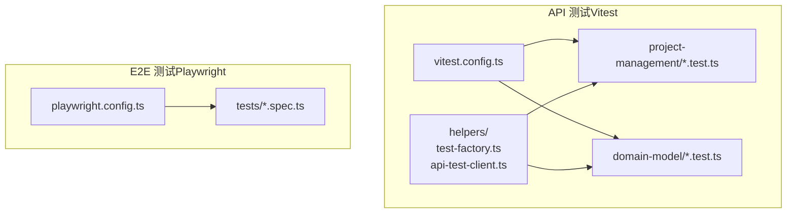
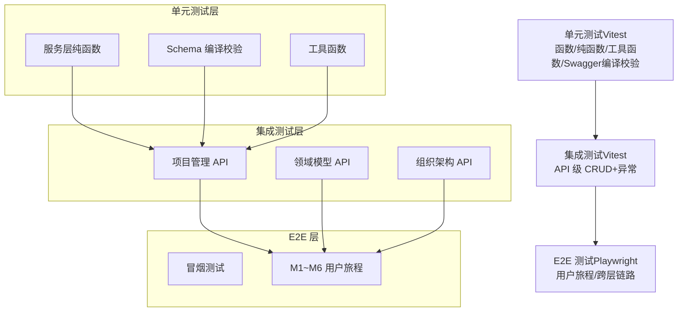
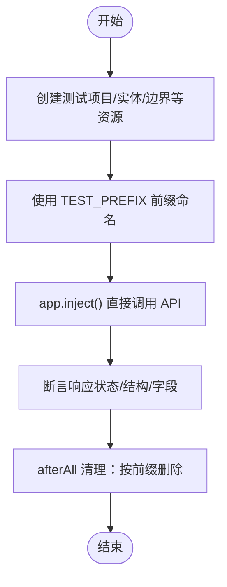
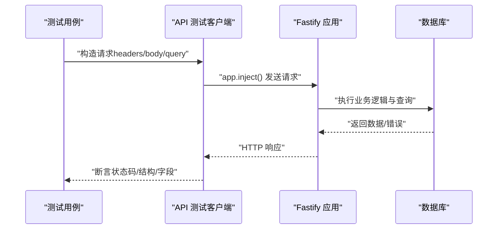
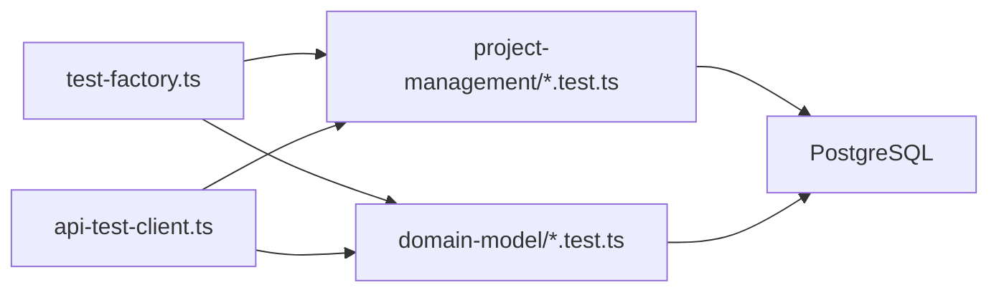

# 单元测试

<cite>
**本文引用的文件**
- [packages/api/tests/helpers/test-factory.ts](file://packages/api/tests/helpers/test-factory.ts)
- [packages/api/tests/helpers/api-test-client.ts](file://packages/api/tests/helpers/api-test-client.ts)
- [packages/api/tests/domain-model/f-m2-01-entity.test.ts](file://packages/api/tests/domain-model/f-m2-01-entity.test.ts)
- [packages/api/tests/domain-model/f-m2-06-boundary.test.ts](file://packages/api/tests/domain-model/f-m2-06-boundary.test.ts)
- [packages/api/tests/project-management/f-m1-01-list.test.ts](file://packages/api/tests/project-management/f-m1-01-list.test.ts)
- [packages/api/tests/project-management/f-m1-02-create.test.ts](file://packages/api/tests/project-management/f-m1-02-create.test.ts)
- [packages/api/tests/project-management/f-m1-03-detail.test.ts](file://packages/api/tests/project-management/f-m1-03-detail.test.ts)
- [packages/api/tests/project-management/f-m1-04-edit.test.ts](file://packages/api/tests/project-management/f-m1-04-edit.test.ts)
- [packages/api/tests/project-management/f-m1-05-archive.test.ts](file://packages/api/tests/project-management/f-m1-05-archive.test.ts)
- [packages/api/tests/project-management/f-m1-06-company.test.ts](file://packages/api/tests/project-management/f-m1-06-company.test.ts)
- [packages/api/tests/project-management/f-m1-07-department.test.ts](file://packages/api/tests/project-management/f-m1-07-department.test.ts)
- [packages/api/tests/project-management/f-m1-08-role.test.ts](file://packages/api/tests/project-management/f-m1-08-role.test.ts)
- [packages/api/tests/project-management/f-m1-09-external-entity.test.ts](file://packages/api/tests/project-management/f-m1-09-external-entity.test.ts)
- [packages/api/tests/project-management/f-m1-10-statistics.test.ts](file://packages/api/tests/project-management/f-m1-10-statistics.test.ts)
- [packages/api/tests/project-management/f-m1-12-role-behavior.test.ts](file://packages/api/tests/project-management/f-m1-12-role-behavior.test.ts)
- [packages/api/tests/project-management/f-m1-13-external-entity-behavior.test.ts](file://packages/api/tests/project-management/f-m1-13-external-entity-behavior.test.ts)
- [packages/api/vitest.config.ts](file://packages/api/vitest.config.ts)
- [docs/00-project/workflow/dev-test-loop-design.md](file://docs/00-project/workflow/dev-test-loop-design.md)
- [docs/04-tech-design/coding-convention-backend.md](file://docs/04-tech-design/coding-convention-backend.md)
- [docs/06-test-design/modules/project-management/f-m1-01-project-list/f-m1-01-api.md](file://docs/06-test-design/modules/project-management/f-m1-01-project-list/f-m1-01-api.md)
- [docs/06-test-design/modules/project-management/f-m1-02-create-project/f-m1-02-api.md](file://docs/06-test-design/modules/project-management/f-m1-02-create-project/f-m1-02-api.md)
- [docs/06-test-design/modules/project-management/f-m1-03-project-detail/f-m1-03-api.md](file://docs/06-test-design/modules/project-management/f-m1-03-project-detail/f-m1-03-api.md)
- [docs/06-test-design/modules/project-management/f-m1-05-archive/f-m1-05-api.md](file://docs/06-test-design/modules/project-management/f-m1-05-archive/f-m1-05-api.md)
- [docs/06-test-design/modules/domain-model/_coverage-summary.md](file://docs/06-test-design/modules/domain-model/_coverage-summary.md)
- [packages/e2e/README.md](file://packages/e2e/README.md)
- [packages/e2e/tests/project-management/f-m1-06-company.spec.ts](file://packages/e2e/tests/project-management/f-m1-06-company.spec.ts)
- [docs/superpowers/plans/2026-05-21-f-m1-06-company.md](file://docs/superpowers/plans/2026-05-21-f-m1-06-company.md)
</cite>

## 目录
1. [引言](#引言)
2. [项目结构](#项目结构)
3. [核心组件](#核心组件)
4. [架构总览](#架构总览)
5. [详细组件分析](#详细组件分析)
6. [依赖分析](#依赖分析)
7. [性能考虑](#性能考虑)
8. [故障排查指南](#故障排查指南)
9. [结论](#结论)
10. [附录](#附录)

## 引言
本文件面向AI原型管理系统（APM）的单元测试与API集成测试，系统性阐述测试金字塔底层结构、测试设计原则、Mock机制、测试数据准备、覆盖率与质量标准、断言与异常处理策略，以及测试环境配置与工具使用。目标是帮助开发者在不牺牲真实业务验证的前提下，高效构建稳定可靠的测试体系。

## 项目结构
- 测试工具与运行环境
  - API层测试采用 Vitest，配置位于 packages/api/vitest.config.ts，使用 JSON 报告器输出，便于 AI 解析与持续集成。
  - E2E 层采用 Playwright，独立包结构，避免污染主工程依赖树。
- 测试组织方式
  - API 测试按模块与功能点划分，每个功能点一个测试文件，便于定位与并行执行。
  - 测试数据工厂统一管理，确保测试数据隔离与可清理。
- 测试金字塔
  - 单元测试（函数级）：服务层纯函数、Schema 编译校验、工具函数。
  - 集成测试（API 级）：CRUD 正常与异常、404/409/422 等边界场景。
  - E2E 测试（端到端）：用户旅程与跨层链路验证。

图表来源
- [packages/api/vitest.config.ts](file://packages/api/vitest.config.ts)
- [packages/api/tests/helpers/test-factory.ts](file://packages/api/tests/helpers/test-factory.ts)
- [packages/api/tests/helpers/api-test-client.ts](file://packages/api/tests/helpers/api-test-client.ts)
- [packages/e2e/README.md](file://packages/e2e/README.md)

章节来源
- [packages/api/vitest.config.ts](file://packages/api/vitest.config.ts)
- [packages/e2e/README.md](file://packages/e2e/README.md)

## 核心组件
- 测试数据工厂（test-factory）
  - 作用：创建带 TEST_PREFIX 前缀的测试数据，确保与开发数据隔离；提供统一清理函数，按前缀批量删除。
  - 关键能力：创建项目、实体、边界、公司、部门、角色、外部实体、应用等；清理时利用外键级联自动清理子表。
- API 测试客户端（api-test-client）
  - 作用：封装 HTTP 断言与请求，统一断言风格，减少重复代码。
- Vitest 配置
  - 全局启用、setupFiles 指定全局初始化脚本、JSON 报告器输出到包内 test-results/，便于解析与归档。

章节来源
- [packages/api/tests/helpers/test-factory.ts](file://packages/api/tests/helpers/test-factory.ts)
- [packages/api/tests/helpers/api-test-client.ts](file://packages/api/tests/helpers/api-test-client.ts)
- [packages/api/vitest.config.ts](file://packages/api/vitest.config.ts)

## 架构总览
测试金字塔在本项目中的落地如下：

图表来源
- [docs/00-project/workflow/dev-test-loop-design.md](file://docs/00-project/workflow/dev-test-loop-design.md)
- [packages/e2e/README.md](file://packages/e2e/README.md)

## 详细组件分析

### 测试设计原则与金字塔底层结构
- 单元测试（函数级）
  - 优先测试纯函数、工具函数与 Schema 编译校验，确保逻辑正确性与可维护性。
  - 断言集中在返回值、错误抛出、边界条件与异常路径。
- 集成测试（API 级）
  - 使用 app.inject() 直接调用 Fastify 应用，无需启动 HTTP server，速度快、隔离好。
  - 严格的数据隔离与清理策略：TEST_PREFIX 前缀 + afterAll 清理 + WHERE 条件删除。
  - 覆盖 CRUD 正常路径与常见异常（404、409、422、5xx）。
- E2E 测试（端到端）
  - 覆盖主路径与边界场景，不追求 100% 端点覆盖率，强调用户旅程与跨层链路稳定性。

章节来源
- [docs/00-project/workflow/dev-test-loop-design.md](file://docs/00-project/workflow/dev-test-loop-design.md)
- [docs/04-tech-design/coding-convention-backend.md](file://docs/04-tech-design/coding-convention-backend.md)

### Mock 机制与测试数据准备
- Mock 机制
  - API 层：通过 app.inject() 直接注入请求，绕过网络栈，适合单元与集成测试。
  - E2E 层：使用 Playwright 的 page.route() 设置 stateful mock，模拟后端持久化效果，便于验证 UI 与交互。
- 测试数据准备
  - 使用 TEST_PREFIX 前缀隔离数据，确保不会污染生产数据。
  - 使用 test-factory 提供的工厂函数创建项目、实体、边界、组织等资源。
  - 清理策略：afterAll 调用 cleanupTestData，基于前缀删除；涉及多表时利用外键级联自动清理。

图表来源
- [packages/api/tests/helpers/test-factory.ts](file://packages/api/tests/helpers/test-factory.ts)
- [packages/api/tests/helpers/api-test-client.ts](file://packages/api/tests/helpers/api-test-client.ts)
- [packages/api/tests/domain-model/f-m2-01-entity.test.ts](file://packages/api/tests/domain-model/f-m2-01-entity.test.ts)

章节来源
- [packages/api/tests/helpers/test-factory.ts](file://packages/api/tests/helpers/test-factory.ts)
- [packages/api/tests/helpers/api-test-client.ts](file://packages/api/tests/helpers/api-test-client.ts)
- [packages/e2e/tests/project-management/f-m1-06-company.spec.ts](file://packages/e2e/tests/project-management/f-m1-06-company.spec.ts)

### 覆盖率与质量标准
- 覆盖率目标
  - 单元测试：核心纯函数与工具函数达到高覆盖率，重点在于分支与异常路径覆盖。
  - 集成测试：API 主路径 + 边界与异常场景，确保 404/409/422/5xx 场景被覆盖。
  - E2E：模块主路径 + 边界场景，不追求端点 100% 覆盖。
- 质量标准
  - 测试命名清晰、断言明确、前置条件与期望一致。
  - 测试数据安全：INSERT 带前缀、DELETE 带 WHERE 条件、测试项目 ID 与生产隔离。
  - 清理策略：每个测试文件自行 afterAll 清理，不依赖执行顺序。

章节来源
- [docs/06-test-design/modules/domain-model/_coverage-summary.md](file://docs/06-test-design/modules/domain-model/_coverage-summary.md)
- [docs/00-project/workflow/dev-test-loop-design.md](file://docs/00-project/workflow/dev-test-loop-design.md)

### 测试用例编写指南与最佳实践
- 命名与组织
  - 按功能点命名测试文件，如 f-m1-01-list.test.ts、f-m2-01-entity.test.ts。
  - 使用 TC-XXX 编号，便于追踪与回归。
- 断言方法
  - 响应状态码断言、响应体字段断言、分页/排序/搜索等业务规则断言。
  - 异常场景断言：404、409、422、5xx，以及 UI 层错误提示与降级行为。
- 异常处理测试
  - 无效参数、越界值、枚举校验、并发冲突（409）、乐观锁冲突（409）、网络异常（5xx）。
- 数据准备与清理
  - beforeAll 创建测试项目与资源；afterAll 清理；避免全局状态污染。
- E2E Mock
  - 使用 page.route() 设置 stateful mock，控制列表数据，模拟 DB 持久化效果。

章节来源
- [docs/06-test-design/modules/project-management/f-m1-01-project-list/f-m1-01-api.md](file://docs/06-test-design/modules/project-management/f-m1-01-project-list/f-m1-01-api.md)
- [docs/06-test-design/modules/project-management/f-m1-02-create-project/f-m1-02-api.md](file://docs/06-test-design/modules/project-management/f-m1-02-create-project/f-m1-02-api.md)
- [docs/06-test-design/modules/project-management/f-m1-03-project-detail/f-m1-03-api.md](file://docs/06-test-design/modules/project-management/f-m1-03-project-detail/f-m1-03-api.md)
- [docs/06-test-design/modules/project-management/f-m1-05-archive/f-m1-05-api.md](file://docs/06-test-design/modules/project-management/f-m1-05-archive/f-m1-05-api.md)
- [packages/e2e/tests/project-management/f-m1-06-company.spec.ts](file://packages/e2e/tests/project-management/f-m1-06-company.spec.ts)

### 具体模块测试策略

#### 项目管理（M1）
- 列表查询（F-M1-01）
  - 断言：默认排序、分页、搜索、状态筛选、边界值（page=0、pageSize 非法枚举）。
- 创建项目（F-M1-02）
  - 断言：全字段创建成功、name 唯一性冲突（409）、描述为空占位符。
- 详情查询（F-M1-03）
  - 断言：活跃/归档项目详情字段一致性、统计字段存在且非省略。
- 编辑项目（F-M1-04）
  - 断言：字段更新、版本递增、乐观锁冲突（409）。
- 归档/恢复（F-M1-05）
  - 断言：状态转换、version 递增、不级联子数据、幂等返回成功。
- 公司管理（F-M1-06）
  - 断言：列表渲染、搜索、空状态、创建/编辑/删除流程、name 格式与冲突处理、引用完整性拒绝删除、分页与网络错误处理。
- 部门管理（F-M1-07）
  - 断言：树形结构、层级关系、创建/编辑/删除、引用完整性。
- 角色管理（F-M1-08）
  - 断言：角色唯一性、权限分配、删除引用检查。
- 外部实体（F-M1-09）
  - 断言：实体 CRUD、与公司/流程关联、引用完整性。
- 统计（F-M1-10）
  - 断言：各模块计数字段存在且正确。
- 角色行为（F-M1-12）
  - 断言：行为定义、权限继承、冲突检测。
- 外部实体行为（F-M1-13）
  - 断言：Action/Decision CRUD、分支与输出、ToolRef 合法性、归档项目限制。

章节来源
- [packages/api/tests/project-management/f-m1-01-list.test.ts](file://packages/api/tests/project-management/f-m1-01-list.test.ts)
- [packages/api/tests/project-management/f-m1-02-create.test.ts](file://packages/api/tests/project-management/f-m1-02-create.test.ts)
- [packages/api/tests/project-management/f-m1-03-detail.test.ts](file://packages/api/tests/project-management/f-m1-03-detail.test.ts)
- [packages/api/tests/project-management/f-m1-04-edit.test.ts](file://packages/api/tests/project-management/f-m1-04-edit.test.ts)
- [packages/api/tests/project-management/f-m1-05-archive.test.ts](file://packages/api/tests/project-management/f-m1-05-archive.test.ts)
- [packages/api/tests/project-management/f-m1-06-company.test.ts](file://packages/api/tests/project-management/f-m1-06-company.test.ts)
- [packages/api/tests/project-management/f-m1-07-department.test.ts](file://packages/api/tests/project-management/f-m1-07-department.test.ts)
- [packages/api/tests/project-management/f-m1-08-role.test.ts](file://packages/api/tests/project-management/f-m1-08-role.test.ts)
- [packages/api/tests/project-management/f-m1-09-external-entity.test.ts](file://packages/api/tests/project-management/f-m1-09-external-entity.test.ts)
- [packages/api/tests/project-management/f-m1-10-statistics.test.ts](file://packages/api/tests/project-management/f-m1-10-statistics.test.ts)
- [packages/api/tests/project-management/f-m1-12-role-behavior.test.ts](file://packages/api/tests/project-management/f-m1-12-role-behavior.test.ts)
- [packages/api/tests/project-management/f-m1-13-external-entity-behavior.test.ts](file://packages/api/tests/project-management/f-m1-13-external-entity-behavior.test.ts)

#### 领域模型（M2）
- 实体管理（F-M2-01）
  - 断言：实体 CRUD、name 合法性（不含连字符）、跨项目隔离。
- 字段管理（F-M2-02）
  - 断言：字段类型、必填/可选、默认值、重复字段名冲突。
- 关系管理（F-M2-03）
  - 断言：一对一/一对多/多对多关系、自反关系、引用完整性。
- ER 图（F-M2-04）
  - 断言：图渲染、节点/边属性、布局一致性。
- 边界管理（F-M2-06）
  - 断言：边界创建、与实体关联、引用完整性、删除保护。

章节来源
- [packages/api/tests/domain-model/f-m2-01-entity.test.ts](file://packages/api/tests/domain-model/f-m2-01-entity.test.ts)
- [packages/api/tests/domain-model/f-m2-06-boundary.test.ts](file://packages/api/tests/domain-model/f-m2-06-boundary.test.ts)
- [docs/06-test-design/modules/domain-model/_coverage-summary.md](file://docs/06-test-design/modules/domain-model/_coverage-summary.md)

### API 测试调用序列（集成测试）

图表来源
- [packages/api/tests/helpers/api-test-client.ts](file://packages/api/tests/helpers/api-test-client.ts)
- [packages/api/tests/helpers/test-factory.ts](file://packages/api/tests/helpers/test-factory.ts)
- [packages/api/vitest.config.ts](file://packages/api/vitest.config.ts)

## 依赖分析
- 组件耦合
  - 测试文件依赖 test-factory 与 api-test-client，保持断言风格一致与数据隔离。
  - 模块间依赖通过测试数据工厂串联，如项目 -> 实体/边界/组织等。
- 外部依赖
  - Vitest 与 Drizzle ORM；E2E 使用 Playwright。
- 清理与隔离
  - TEST_PREFIX 前缀 + WHERE 条件删除 + 级联清理，避免跨测试污染。

图表来源
- [packages/api/tests/helpers/test-factory.ts](file://packages/api/tests/helpers/test-factory.ts)
- [packages/api/tests/helpers/api-test-client.ts](file://packages/api/tests/helpers/api-test-client.ts)
- [packages/api/tests/project-management/f-m1-01-list.test.ts](file://packages/api/tests/project-management/f-m1-01-list.test.ts)
- [packages/api/tests/domain-model/f-m2-01-entity.test.ts](file://packages/api/tests/domain-model/f-m2-01-entity.test.ts)

章节来源
- [packages/api/tests/helpers/test-factory.ts](file://packages/api/tests/helpers/test-factory.ts)
- [packages/api/tests/helpers/api-test-client.ts](file://packages/api/tests/helpers/api-test-client.ts)

## 性能考虑
- API 测试性能
  - 使用 app.inject() 直接调用应用，避免 HTTP server 启动成本，速度提升显著。
  - 测试数据批量清理，避免多次连接与事务开销。
- E2E 性能
  - 使用 headed/headless 模式切换；必要时开启 debug 模式辅助定位。
  - 合理拆分模块测试，避免单个 spec 文件过大导致执行时间过长。

章节来源
- [docs/00-project/workflow/dev-test-loop-design.md](file://docs/00-project/workflow/dev-test-loop-design.md)
- [packages/e2e/README.md](file://packages/e2e/README.md)

## 故障排查指南
- 环境与网络问题
  - 若出现 SETUP_FAILURE 或 NETWORK_ERROR，优先检查 dev server 是否运行、数据库是否可达、端口占用情况。
- 连续失败与暂停
  - 当连续失败超过阈值，系统将暂停等待人工介入；建议查看持久化失败汇总，定位根因。
- 常见异常场景
  - 404：资源不存在；409：并发冲突/引用完整性；422：参数校验失败；5xx：服务端内部错误。
- E2E 截图与 Trace
  - 失败时查看 test-results/ 下的截图与 trace，辅助定位 UI 交互问题。

章节来源
- [docs/00-project/workflow/dev-test-loop-design.md](file://docs/00-project/workflow/dev-test-loop-design.md)
- [packages/e2e/README.md](file://packages/e2e/README.md)

## 结论
本测试体系以“单元测试为基础、集成测试为核心、E2E 保障用户旅程”为原则，结合统一的 Mock 机制、测试数据工厂与清理策略，确保测试可维护、可扩展、可回归。通过明确的断言方法与异常处理策略，以及严格的覆盖率与质量标准，能够有效验证业务逻辑正确性，并为持续交付提供可靠保障。

## 附录
- 常用命令
  - 启动开发服务器：pnpm dev
  - 运行单模块 API 测试：cd packages/api && npx vitest run tests/project-management/f-m1-01-list.test.ts
  - 运行全量 API 测试：cd packages/api && npx vitest run
  - 运行单模块 E2E 测试：cd packages/e2e && npx playwright test tests/project-management/f-m1-01-list.spec.ts
  - 运行全量 E2E 测试：cd packages/e2e && npx playwright test
  - 打开 E2E HTML 报告：open packages/e2e/reports/run-*.html

章节来源
- [docs/00-project/workflow/dev-test-loop-design.md](file://docs/00-project/workflow/dev-test-loop-design.md)
- [packages/e2e/README.md](file://packages/e2e/README.md)