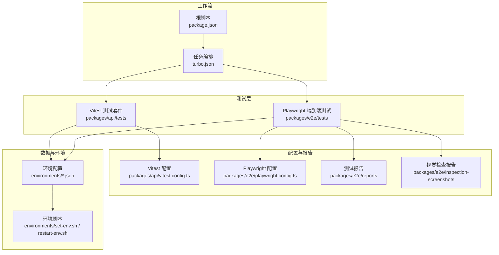
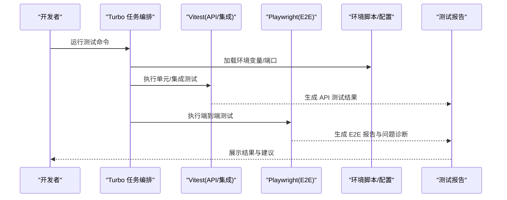
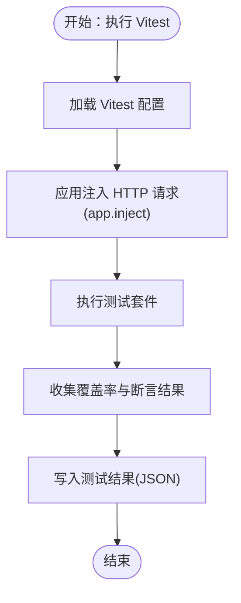
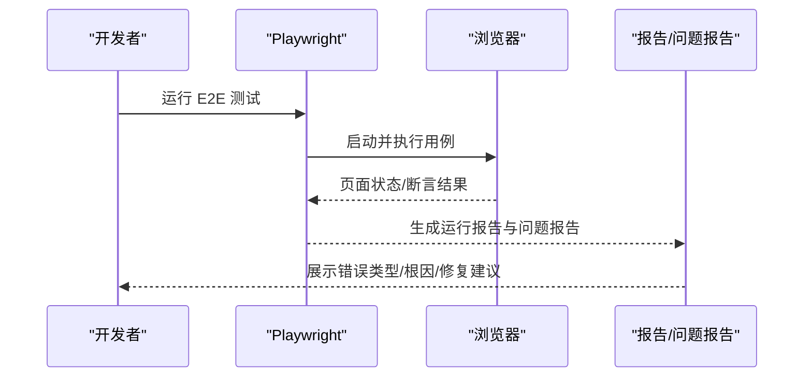
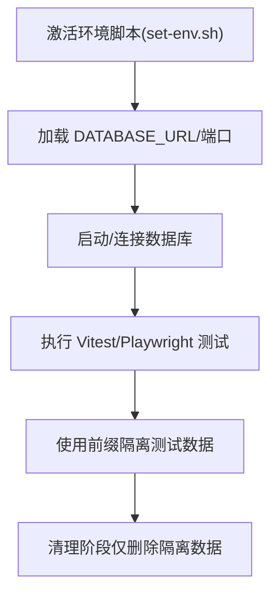
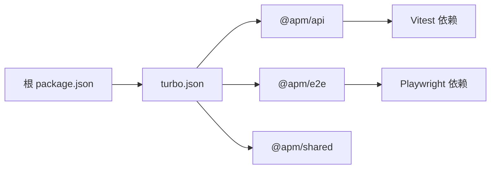
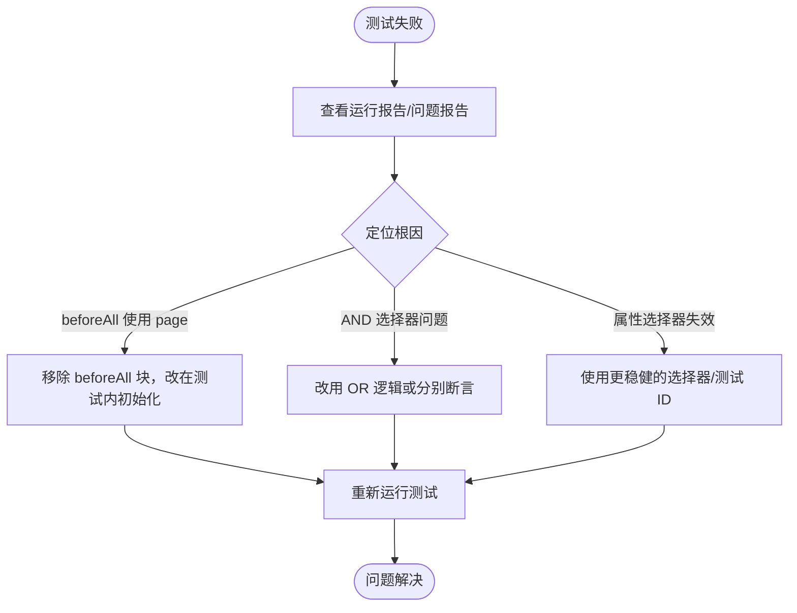

# 测试工具链

<cite>
**本文引用的文件**
- [package.json](file://package.json)
- [turbo.json](file://turbo.json)
- [packages/api/vitest.config.ts](file://packages/api/vitest.config.ts)
- [packages/api/package.json](file://packages/api/package.json)
- [packages/api/src/app.ts](file://packages/api/src/app.ts)
- [packages/api/tests/setup.ts](file://packages/api/tests/setup.ts)
- [packages/api/tests/helpers/api-test-client.ts](file://packages/api/tests/helpers/api-test-client.ts)
- [packages/api/tests/helpers/test-factory.ts](file://packages/api/tests/helpers/test-factory.ts)
- [packages/api/tests/project-management/f-m1-01-list.test.ts](file://packages/api/tests/project-management/f-m1-01-list.test.ts)
- [packages/api/tests/project-management/f-m1-02-create.test.ts](file://packages/api/tests/project-management/f-m1-02-create.test.ts)
- [packages/api/tests/project-management/f-m1-03-detail.test.ts](file://packages/api/tests/project-management/f-m1-03-detail.test.ts)
- [packages/api/tests/project-management/f-m1-04-edit.test.ts](file://packages/api/tests/project-management/f-m1-04-edit.test.ts)
- [packages/api/tests/project-management/f-m1-05-archive.test.ts](file://packages/api/tests/project-management/f-m1-05-archive.test.ts)
- [packages/api/tests/project-management/f-m1-06-company.test.ts](file://packages/api/tests/project-management/f-m1-06-company.test.ts)
- [packages/api/tests/project-management/f-m1-07-department.test.ts](file://packages/api/tests/project-management/f-m1-07-department.test.ts)
- [packages/api/tests/project-management/f-m1-08-roles.test.ts](file://packages/api/tests/project-management/f-m1-08-roles.test.ts)
- [packages/api/tests/project-management/f-m1-09-external-entities.test.ts](file://packages/api/tests/project-management/f-m1-09-external-entities.test.ts)
- [packages/api/tests/project-management/f-m1-11-application.test.ts](file://packages/api/tests/project-management/f-m1-11-application.test.ts)
- [packages/api/tests/project-management/f-m1-12-role-behavior.test.ts](file://packages/api/tests/project-management/f-m1-12-role-behavior.test.ts)
- [packages/api/tests/project-management/f-m1-13-external-entity-behavior.test.ts](file://packages/api/tests/project-management/f-m1-13-external-entity-behavior.test.ts)
- [packages/api/tests/domain-model/f-m2-01-entity.test.ts](file://packages/api/tests/domain-model/f-m2-01-entity.test.ts)
- [packages/api/tests/domain-model/f-m2-02-field.test.ts](file://packages/api/tests/domain-model/f-m2-02-field.test.ts)
- [packages/api/tests/domain-model/f-m2-03-relation.test.ts](file://packages/api/tests/domain-model/f-m2-03-relation.test.ts)
- [packages/api/tests/domain-model/f-m2-04-er-graph.test.ts](file://packages/api/tests/domain-model/f-m2-04-er-graph.test.ts)
- [packages/api/tests/domain-model/f-m2-06-boundary.test.ts](file://packages/api/tests/domain-model/f-m2-06-boundary.test.ts)
- [packages/api/test-results/api-results.json](file://packages/api/test-results/api-results.json)
- [packages/api/test-results/e2e-results.json](file://packages/api/test-results/e2e-results.json)
- [packages/e2e/package.json](file://packages/e2e/package.json)
- [packages/e2e/playwright.config.ts](file://packages/e2e/playwright.config.ts)
- [packages/e2e/tests/project-management/f-m1-01-list.spec.ts](file://packages/e2e/tests/project-management/f-m1-01-list.spec.ts)
- [packages/e2e/tests/project-management/f-m1-02-create.spec.ts](file://packages/e2e/tests/project-management/f-m1-02-create.spec.ts)
- [packages/e2e/tests/project-management/f-m1-03-detail.spec.ts](file://packages/e2e/tests/project-management/f-m1-03-detail.spec.ts)
- [packages/e2e/tests/project-management/f-m1-04-edit.spec.ts](file://packages/e2e/tests/project-management/f-m1-04-edit.spec.ts)
- [packages/e2e/tests/project-management/f-m1-05-archive.spec.ts](file://packages/e2e/tests/project-management/f-m1-05-archive.spec.ts)
- [packages/e2e/tests/project-management/f-m1-06-company.spec.ts](file://packages/e2e/tests/project-management/f-m1-06-company.spec.ts)
- [packages/e2e/tests/smoke.spec.ts](file://packages/e2e/tests/smoke.spec.ts)
- [packages/e2e/reports/run-20260512-171712.json](file://packages/e2e/reports/run-20260512-171712.json)
- [packages/e2e/reports/run-20260514-111728.json](file://packages/e2e/reports/run-20260514-111728.json)
- [packages/e2e/reports/issues/run-20260512-171712-issues.json](file://packages/e2e/reports/issues/run-20260512-171712-issues.json)
- [packages/e2e/reports/issues/run-20260514-111728-issues.json](file://packages/e2e/reports/issues/run-20260514-111728-issues.json)
- [packages/e2e/inspection-screenshots/report-v4.json](file://packages/e2e/inspection-screenshots/report-v4.json)
- [packages/e2e/inspection-screenshots/ui-inspection-report.json](file://packages/e2e/inspection-screenshots/ui-inspection-report.json)
- [packages/e2e/inspect-ui.mjs](file://packages/e2e/inspect-ui.mjs)
- [packages/shared/package.json](file://packages/shared/package.json)
- [environments/dev1.json](file://environments/dev1.json)
- [environments/dev2.json](file://environments/dev2.json)
- [environments/uat.json](file://environments/uat.json)
- [environments/set-env.sh](file://environments/set-env.sh)
- [environments/restart-env.sh](file://environments/restart-env.sh)
- [docs/06-test-design/test-convention.md](file://docs/06-test-design/test-convention.md)
- [docs/99-lesson-learn/test-case-review-fm1-01.md](file://docs/99-lesson-learn/test-case-review-fm1-01.md)
- [AGENTS.md](file://AGENTS.md)
- [CLAUDE.md](file://CLAUDE.md)
- [README.md](file://README.md)
</cite>

## 目录
1. 引言
2. 项目结构
3. 核心组件
4. 架构总览
5. 详细组件分析
6. 依赖分析
7. 性能考虑
8. 故障排查指南
9. 结论
10. 附录

## 引言
本文件面向“AI原型管理系统”的测试工具链，系统性梳理单元/集成测试（Vitest）、端到端测试（Playwright）与测试数据/环境管理的实践，覆盖测试框架选择与配置、测试数据隔离与同步策略、持续集成中的测试自动化与质量门禁、测试报告与问题诊断、代码覆盖率配置与解读、以及测试调试与性能分析方法。目标是帮助团队高效开展测试开发与维护。

## 项目结构
测试相关的关键目录与文件分布如下：
- 单元/集成测试（Vitest）：packages/api/tests 及其配置文件
- 端到端测试（Playwright）：packages/e2e 及其配置文件
- 测试报告与问题诊断：packages/e2e/reports、packages/e2e/inspection-screenshots
- 测试数据与环境：environments 下的环境配置与脚本
- 测试设计与规范：docs/06-test-design、docs/99-lesson-learn
- 工作流与任务编排：turbo.json、根 package.json

图表来源
- [packages/api/vitest.config.ts](file://packages/api/vitest.config.ts)
- [packages/e2e/playwright.config.ts](file://packages/e2e/playwright.config.ts)
- [turbo.json](file://turbo.json)
- [package.json](file://package.json)

章节来源
- [package.json](file://package.json)
- [turbo.json](file://turbo.json)

## 核心组件
- Vitest（API/集成测试）
  - 用于快速运行 API 与业务服务的单元/集成测试，支持 HTTP 应用注入测试，避免真实监听端口。
  - 配置位于 packages/api/vitest.config.ts，测试结果输出至 packages/api/test-results。
- Playwright（端到端测试）
  - 用于浏览器级 UI 行为验证，支持有头/无头模式、调试模式与报告生成。
  - 配置位于 packages/e2e/playwright.config.ts，测试报告与问题诊断位于 packages/e2e/reports。
- 测试数据与工厂
  - 测试数据通过测试工厂与 API 客户端进行创建与清理，确保隔离与幂等。
- 环境与脚本
  - environments 下提供多环境配置与一键切换/重启脚本，保障测试环境一致性。

章节来源
- [packages/api/vitest.config.ts](file://packages/api/vitest.config.ts)
- [packages/api/test-results/api-results.json](file://packages/api/test-results/api-results.json)
- [packages/api/test-results/e2e-results.json](file://packages/api/test-results/e2e-results.json)
- [packages/e2e/package.json](file://packages/e2e/package.json)
- [packages/e2e/playwright.config.ts](file://packages/e2e/playwright.config.ts)
- [packages/e2e/reports/run-20260512-171712.json](file://packages/e2e/reports/run-20260512-171712.json)
- [packages/e2e/reports/run-20260514-111728.json](file://packages/e2e/reports/run-20260514-111728.json)
- [environments/dev1.json](file://environments/dev1.json)
- [environments/dev2.json](file://environments/dev2.json)
- [environments/uat.json](file://environments/uat.json)
- [environments/set-env.sh](file://environments/set-env.sh)
- [environments/restart-env.sh](file://environments/restart-env.sh)

## 架构总览
测试工具链围绕“本地开发-CI 自动化-质量门禁”闭环展开，结合 Vitest 与 Playwright 的分层测试策略，配合测试数据隔离与环境脚本，形成稳定可靠的测试流水线。

图表来源
- [turbo.json](file://turbo.json)
- [packages/api/vitest.config.ts](file://packages/api/vitest.config.ts)
- [packages/e2e/playwright.config.ts](file://packages/e2e/playwright.config.ts)
- [packages/api/test-results/api-results.json](file://packages/api/test-results/api-results.json)
- [packages/e2e/reports/run-20260512-171712.json](file://packages/e2e/reports/run-20260512-171712.json)

## 详细组件分析

### Vitest 组件分析
- 配置与运行
  - 配置文件定义了测试路径、覆盖率、别名映射与快照策略等；测试通过 Vitest 执行，结果以 JSON 形式落盘，便于 CI 解析。
  - 应用层通过 app.inject() 注入 HTTP 请求，避免真实监听端口，提升测试速度与稳定性。
- 测试组织
  - API 测试按功能模块划分（如项目管理、领域模型），每个模块包含多个 TC（测试用例）。
  - 测试工厂与 API 客户端负责数据准备与断言，保证用例独立与可重复。
- 覆盖率与报告
  - 配置中启用覆盖率收集，报告可用于质量门禁与回归分析。

图表来源
- [packages/api/vitest.config.ts](file://packages/api/vitest.config.ts)
- [packages/api/src/app.ts](file://packages/api/src/app.ts)
- [packages/api/test-results/api-results.json](file://packages/api/test-results/api-results.json)

章节来源
- [packages/api/vitest.config.ts](file://packages/api/vitest.config.ts)
- [packages/api/src/app.ts](file://packages/api/src/app.ts)
- [packages/api/tests/setup.ts](file://packages/api/tests/setup.ts)
- [packages/api/tests/helpers/api-test-client.ts](file://packages/api/tests/helpers/api-test-client.ts)
- [packages/api/tests/helpers/test-factory.ts](file://packages/api/tests/helpers/test-factory.ts)
- [packages/api/test-results/api-results.json](file://packages/api/test-results/api-results.json)

### Playwright 组件分析
- 配置与运行
  - 配置文件定义浏览器、超时、并发、报告输出等；支持有头/无头、调试模式与报告展示。
  - 测试报告包含运行汇总、错误分类与根因诊断，问题报告提供修复建议与定位信息。
- 测试组织
  - E2E 测试按模块划分，覆盖列表、创建、详情、编辑、归档、公司/部门/角色等场景。
  - 通过 Page Object 与可视化助手进行页面交互与截图检查。
- 报告与问题诊断
  - 运行报告与问题报告双轨制：运行报告用于整体质量评估，问题报告用于定位具体用例的根因与修复建议。

图表来源
- [packages/e2e/playwright.config.ts](file://packages/e2e/playwright.config.ts)
- [packages/e2e/tests/project-management/f-m1-03-detail.spec.ts](file://packages/e2e/tests/project-management/f-m1-03-detail.spec.ts)
- [packages/e2e/reports/run-20260514-111728.json](file://packages/e2e/reports/run-20260514-111728.json)
- [packages/e2e/reports/issues/run-20260514-111728-issues.json](file://packages/e2e/reports/issues/run-20260514-111728-issues.json)

章节来源
- [packages/e2e/package.json](file://packages/e2e/package.json)
- [packages/e2e/playwright.config.ts](file://packages/e2e/playwright.config.ts)
- [packages/e2e/tests/project-management/f-m1-01-list.spec.ts](file://packages/e2e/tests/project-management/f-m1-01-list.spec.ts)
- [packages/e2e/tests/project-management/f-m1-03-detail.spec.ts](file://packages/e2e/tests/project-management/f-m1-03-detail.spec.ts)
- [packages/e2e/reports/run-20260512-171712.json](file://packages/e2e/reports/run-20260512-171712.json)
- [packages/e2e/reports/run-20260514-111728.json](file://packages/e2e/reports/run-20260514-111728.json)
- [packages/e2e/reports/issues/run-20260512-171712-issues.json](file://packages/e2e/reports/issues/run-20260512-171712-issues.json)
- [packages/e2e/reports/issues/run-20260514-111728-issues.json](file://packages/e2e/reports/issues/run-20260514-111728-issues.json)
- [packages/e2e/inspection-screenshots/report-v4.json](file://packages/e2e/inspection-screenshots/report-v4.json)
- [packages/e2e/inspection-screenshots/ui-inspection-report.json](file://packages/e2e/inspection-screenshots/ui-inspection-report.json)
- [packages/e2e/inspect-ui.mjs](file://packages/e2e/inspect-ui.mjs)

### 测试数据管理与环境配置
- 数据隔离策略
  - 测试数据统一使用前缀隔离（如 e2e-），避免与手工数据冲突；删除操作限定在隔离前缀范围内，防止误删非测试数据。
- 环境配置与脚本
  - environments 提供多环境配置与一键切换/重启脚本；测试前需先激活环境，再执行数据库迁移或测试。
- 端口一致性
  - E2E 配置中的 baseURL/webServer.port 必须与环境脚本/数据库端口保持一致，避免连接失败。

图表来源
- [environments/set-env.sh](file://environments/set-env.sh)
- [environments/dev1.json](file://environments/dev1.json)
- [environments/dev2.json](file://environments/dev2.json)
- [environments/uat.json](file://environments/uat.json)
- [AGENTS.md](file://AGENTS.md)
- [CLAUDE.md](file://CLAUDE.md)

章节来源
- [AGENTS.md](file://AGENTS.md)
- [CLAUDE.md](file://CLAUDE.md)
- [environments/set-env.sh](file://environments/set-env.sh)
- [environments/restart-env.sh](file://environments/restart-env.sh)

### 测试用例组织与规范
- 用例命名与模块划分
  - API 与 E2E 用例均按功能点（F-M1/F-M2）与场景（TC-xxx）命名，便于检索与追踪。
- 测试设计文档
  - docs/06-test-design 提供测试方案与用例设计说明，指导测试编写与评审。
- 用例评审与复盘
  - docs/99-lesson-learn 记录用例评审与问题复盘，沉淀经验教训。

章节来源
- [docs/06-test-design/test-convention.md](file://docs/06-test-design/test-convention.md)
- [docs/99-lesson-learn/test-case-review-fm1-01.md](file://docs/99-lesson-learn/test-case-review-fm1-01.md)
- [packages/api/tests/project-management/f-m1-01-list.test.ts](file://packages/api/tests/project-management/f-m1-01-list.test.ts)
- [packages/e2e/tests/project-management/f-m1-01-list.spec.ts](file://packages/e2e/tests/project-management/f-m1-01-list.spec.ts)

## 依赖分析
- 任务编排
  - turbo.json 定义了 build、dev、test、test:e2e 等任务依赖关系，确保测试在构建完成后执行。
- 根脚本与子包脚本
  - 根 package.json 提供 test、test:e2e 等聚合脚本；各子包（如 @apm/api、@apm/e2e、@apm/shared）提供独立脚本与依赖。
- 测试工具链耦合
  - API 测试依赖 @apm/shared 的公共能力；E2E 依赖 Playwright 生态；两者通过环境脚本与配置文件解耦。

图表来源
- [package.json](file://package.json)
- [turbo.json](file://turbo.json)
- [packages/api/package.json](file://packages/api/package.json)
- [packages/e2e/package.json](file://packages/e2e/package.json)
- [packages/shared/package.json](file://packages/shared/package.json)

章节来源
- [package.json](file://package.json)
- [turbo.json](file://turbo.json)
- [packages/api/package.json](file://packages/api/package.json)
- [packages/e2e/package.json](file://packages/e2e/package.json)
- [packages/shared/package.json](file://packages/shared/package.json)

## 性能考虑
- 测试执行效率
  - 使用 app.inject() 避免 HTTP 监听开销，提升 Vitest 执行速度。
  - 合理拆分测试套件，按模块并行运行（在 CI 中利用并行度）。
- 端到端测试优化
  - 控制浏览器实例数量与超时时间；减少不必要的截图与报告体积。
- 数据准备与清理
  - 使用前缀隔离与最小化数据准备，缩短测试准备时间。

## 故障排查指南
- 常见问题与根因
  - Playwright beforeAll 中使用 page fixture 导致块级失败：应移除 beforeAll 块并在每个测试内初始化页面对象。
  - 多文本 AND 逻辑选择器：单元素需同时包含所有文本，但 UI 分散显示时应改用 OR 或分别断言。
  - data-lucide 属性选择器不匹配：可能受组件库版本或包装层级影响，建议使用更稳健的选择器或测试 ID。
- 诊断资源
  - 运行报告与问题报告提供错误类型、根因、修复建议与修改建议行号，便于快速定位与修复。
- 环境与端口
  - 确保 set-env.sh 激活后端口与 Playwright 配置一致；必要时使用 restart-env.sh 重启环境。

图表来源
- [packages/e2e/reports/run-20260514-111728.json](file://packages/e2e/reports/run-20260514-111728.json)
- [packages/e2e/reports/issues/run-20260514-111728-issues.json](file://packages/e2e/reports/issues/run-20260514-111728-issues.json)
- [packages/e2e/tests/project-management/f-m1-03-detail.spec.ts](file://packages/e2e/tests/project-management/f-m1-03-detail.spec.ts)

章节来源
- [packages/e2e/reports/run-20260512-171712.json](file://packages/e2e/reports/run-20260512-171712.json)
- [packages/e2e/reports/run-20260514-111728.json](file://packages/e2e/reports/run-20260514-111728.json)
- [packages/e2e/reports/issues/run-20260512-171712-issues.json](file://packages/e2e/reports/issues/run-20260512-171712-issues.json)
- [packages/e2e/reports/issues/run-20260514-111728-issues.json](file://packages/e2e/reports/issues/run-20260514-111728-issues.json)
- [packages/e2e/tests/project-management/f-m1-03-detail.spec.ts](file://packages/e2e/tests/project-management/f-m1-03-detail.spec.ts)

## 结论
本测试工具链以 Vitest 与 Playwright 为核心，结合严格的测试数据隔离、环境脚本与报告诊断机制，形成了从本地到 CI 的闭环测试体系。通过模块化的用例组织、明确的质量门禁与问题修复建议，能够有效支撑高效的测试开发与维护工作。

## 附录
- 测试命令与脚本
  - 根级：test、test:e2e
  - API 包：dev、build、db:generate、db:migrate、db:studio、db:seed
  - E2E 包：test、test:headed、test:debug、report
- 覆盖率与报告
  - Vitest 覆盖率配置与报告输出路径参见配置文件与测试结果 JSON。
  - Playwright 报告与问题报告位于 reports 与 inspection-screenshots 目录。

章节来源
- [package.json](file://package.json)
- [packages/api/package.json](file://packages/api/package.json)
- [packages/e2e/package.json](file://packages/e2e/package.json)
- [packages/api/vitest.config.ts](file://packages/api/vitest.config.ts)
- [packages/api/test-results/api-results.json](file://packages/api/test-results/api-results.json)
- [packages/e2e/reports/run-20260514-111728.json](file://packages/e2e/reports/run-20260514-111728.json)
- [packages/e2e/inspection-screenshots/report-v4.json](file://packages/e2e/inspection-screenshots/report-v4.json)