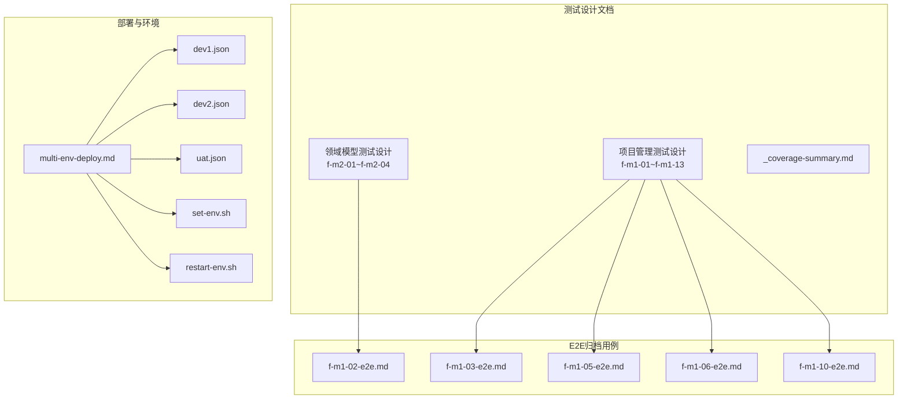
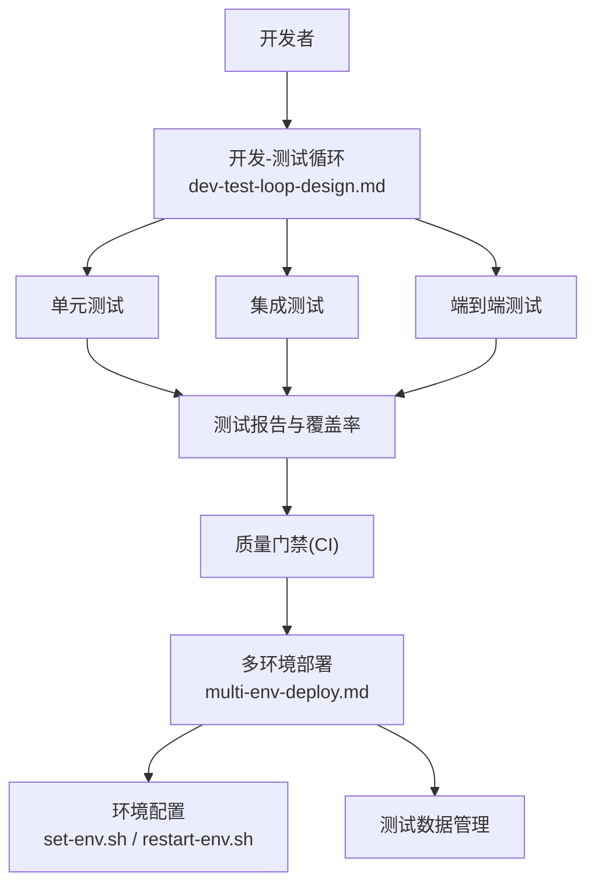
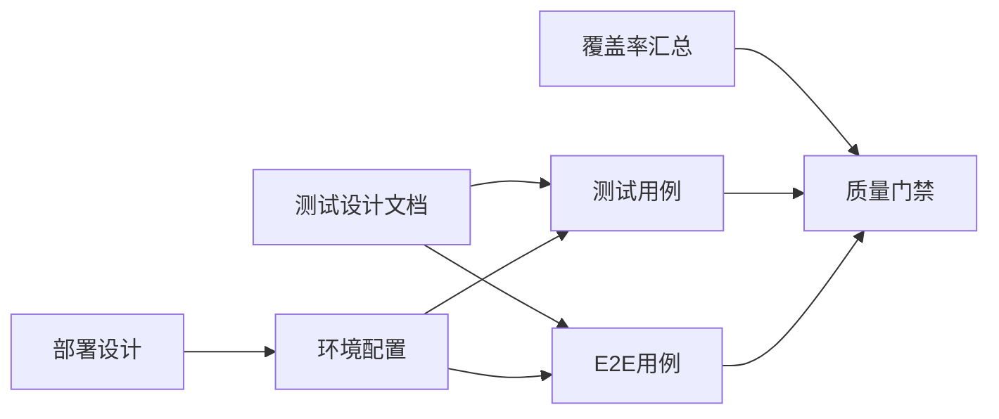

# 测试策略

<cite>
**本文引用的文件**
- [dev-test-loop-design.md](file://docs/00-project/workflow/dev-test-loop-design.md)
- [f-m2-01-api.md](file://docs/06-test-design/modules/domain-model/f-m2-01-entity/f-m2-01-api.md)
- [f-m2-02-api.md](file://docs/06-test-design/modules/domain-model/f-m2-02-field/f-m2-02-api.md)
- [f-m2-03-api.md](file://docs/06-test-design/modules/domain-model/f-m2-03-relation/f-m2-03-api.md)
- [f-m2-04-api.md](file://docs/06-test-design/modules/domain-model/f-m2-04-er-graph/f-m2-04-api.md)
- [f-m1-01-api.md](file://docs/06-test-design/modules/project-management/f-m1-01-project-list/f-m1-01-api.md)
- [f-m1-02-api.md](file://docs/06-test-design/modules/project-management/f-m1-02-create-project/f-m1-02-api.md)
- [f-m1-03-api.md](file://docs/06-test-design/modules/project-management/f-m1-03-project-detail/f-m1-03-api.md)
- [f-m1-04-api.md](file://docs/06-test-design/modules/project-management/f-m1-04-edit-project/f-m1-04-api.md)
- [f-m1-05-api.md](file://docs/06-test-design/modules/project-management/f-m1-05-archive/f-m1-05-api.md)
- [f-m1-06-api.md](file://docs/06-test-design/modules/project-management/f-m1-06-company/f-m1-06-api.md)
- [f-m1-07-api.md](file://docs/06-test-design/modules/project-management/f-m1-07-department/f-m1-07-api.md)
- [f-m1-08-api.md](file://docs/06-test-design/modules/project-management/f-m1-08-role/f-m1-08-api.md)
- [f-m1-09-api.md](file://docs/06-test-design/modules/project-management/f-m1-09-external-entity/f-m1-09-api.md)
- [f-m1-12-api.md](file://docs/06-test-design/modules/project-management/f-m1-12-role-behavior/f-m1-12-api.md)
- [f-m1-13-api.md](file://docs/06-test-design/modules/project-management/f-m1-13-external-entity-behavior/f-m1-13-api.md)
- [f-m1-02-e2e.md](file://docs/99-archived/e2e-test-cases/f-m1-02-e2e.md)
- [f-m1-03-e2e.md](file://docs/99-archived/e2e-test-cases/f-m1-03-e2e.md)
- [f-m1-05-e2e.md](file://docs/99-archived/e2e-test-cases/f-m1-05-e2e.md)
- [f-m1-06-e2e.md](file://docs/99-archived/e2e-test-cases/f-m1-06-e2e.md)
- [f-m1-10-e2e.md](file://docs/99-archived/e2e-test-cases/f-m1-10-e2e.md)
- [_coverage-summary.md](file://docs/06-test-design/modules/domain-model/_coverage-summary.md)
- [multi-env-deploy.md](file://docs/07-deploy-design/multi-env-deploy.md)
- [package.json](file://package.json)
- [pnpm-workspace.yaml](file://pnpm-workspace.yaml)
- [turbo.json](file://turbo.json)
- [docker-compose.yml](file://workspace/dev/docker-compose.yml)
- [set-env.sh](file://environments/set-env.sh)
- [restart-env.sh](file://environments/restart-env.sh)
- [dev1.json](file://environments/dev1.json)
- [dev2.json](file://environments/dev2.json)
- [uat.json](file://environments/uat.json)
</cite>

## 目录
1. [引言](#引言)
2. [项目结构](#项目结构)
3. [核心组件](#核心组件)
4. [架构总览](#架构总览)
5. [详细组件分析](#详细组件分析)
6. [依赖分析](#依赖分析)
7. [性能考虑](#性能考虑)
8. [故障排查指南](#故障排查指南)
9. [结论](#结论)
10. [附录](#附录)

## 引言
本测试策略面向AI原型管理系统，目标是建立覆盖全生命周期的质量保障体系，确保系统在功能、性能与稳定性方面满足预期。策略以测试金字塔为核心指导思想：底层为单元测试（高密度、快速反馈），中层为集成测试（模块间接口与数据库交互），顶层为端到端测试（真实用户场景）。同时配套测试数据管理、测试环境配置、持续集成质量门禁、性能与负载测试、测试工具链与报告分析等实践，形成闭环的质量工程能力。

## 项目结构
项目采用多包工作区组织，测试相关文档集中在“测试设计”与“归档的E2E用例”，并通过部署设计文档定义多环境配置。测试策略需与前端Web、后端API、共享模块、验证Schema以及E2E测试协同。

图示来源
- [f-m2-01-api.md](file://docs/06-test-design/modules/domain-model/f-m2-01-entity/f-m2-01-api.md)
- [f-m1-02-api.md](file://docs/06-test-design/modules/project-management/f-m1-02-create-project/f-m1-02-api.md)
- [f-m1-03-api.md](file://docs/06-test-design/modules/project-management/f-m1-03-project-detail/f-m1-03-api.md)
- [f-m1-05-api.md](file://docs/06-test-design/modules/project-management/f-m1-05-archive/f-m1-05-api.md)
- [f-m1-06-api.md](file://docs/06-test-design/modules/project-management/f-m1-06-company/f-m1-06-api.md)
- [f-m1-10-e2e.md](file://docs/99-archived/e2e-test-cases/f-m1-10-e2e.md)
- [multi-env-deploy.md](file://docs/07-deploy-design/multi-env-deploy.md)
- [dev1.json](file://environments/dev1.json)
- [dev2.json](file://environments/dev2.json)
- [uat.json](file://environments/uat.json)
- [set-env.sh](file://environments/set-env.sh)
- [restart-env.sh](file://environments/restart-env.sh)

章节来源
- [pnpm-workspace.yaml](file://pnpm-workspace.yaml)
- [turbo.json](file://turbo.json)
- [package.json](file://package.json)

## 核心组件
- 测试金字塔分层
  - 单元测试：面向函数/方法级逻辑，强调可测试性、隔离性与高覆盖率；通过Mock外部依赖，聚焦纯函数与业务规则。
  - 集成测试：验证模块间接口契约、数据库交互、事务一致性与错误传播；覆盖API与数据库双栈。
  - 端到端测试：模拟真实用户路径，覆盖跨页面、跨模块的完整业务流，验证UI与后端协作。
- 覆盖率与质量门禁
  - 基于已有覆盖率汇总文档，设定行/分支/函数/语句覆盖率阈值，并纳入CI质量门禁。
- 工具链与框架
  - 基于工作区与构建配置，结合测试框架与报告工具，统一测试执行与结果聚合。

章节来源
- [_coverage-summary.md](file://docs/06-test-design/modules/domain-model/_coverage-summary.md)
- [dev-test-loop-design.md](file://docs/00-project/workflow/dev-test-loop-design.md)

## 架构总览
测试架构围绕“开发-测试-部署-验证”的闭环展开，测试数据与环境由部署设计文档与环境配置脚本支撑，测试执行通过工作区与任务编排工具统一调度。

图示来源
- [dev-test-loop-design.md](file://docs/00-project/workflow/dev-test-loop-design.md)
- [multi-env-deploy.md](file://docs/07-deploy-design/multi-env-deploy.md)
- [set-env.sh](file://environments/set-env.sh)
- [restart-env.sh](file://environments/restart-env.sh)

## 详细组件分析

### 单元测试设计与实现
- 设计原则
  - 隔离外部依赖：对IO、网络、时钟等进行Mock或替换，保证测试可重复与稳定。
  - 小而快：单个用例聚焦单一行为，执行时间短，便于高频反馈。
  - 可验证性：断言清晰、覆盖关键分支与边界条件。
- Mock策略
  - 使用依赖注入与接口抽象，将外部服务替换为可控的Mock对象。
  - 对纯函数与业务规则进行充分测试，避免过度Mock导致测试脆弱。
- 覆盖率要求
  - 行/分支/函数/语句覆盖率应达到团队约定阈值，结合现有覆盖率汇总文档进行基线评估与持续改进。

章节来源
- [dev-test-loop-design.md](file://docs/00-project/workflow/dev-test-loop-design.md)
- [_coverage-summary.md](file://docs/06-test-design/modules/domain-model/_coverage-summary.md)

### 集成测试实施方案
- API测试
  - 基于各模块的API测试设计文档，针对每个端点编写请求/响应契约测试，覆盖成功、失败与边界场景。
  - 使用OpenAPI契约驱动测试，确保前后端一致。
- 数据库测试
  - 在受控环境中初始化测试数据库，验证CRUD、关联查询、事务与约束。
  - 通过迁移脚本与种子数据，确保测试前置条件一致。
- 端到端测试
  - 基于归档的E2E用例，梳理关键用户路径，拆分为可维护的自动化测试脚本。
  - 覆盖登录、创建项目、查看详情、编辑、归档、公司/部门/角色管理等主流程。

章节来源
- [f-m2-01-api.md](file://docs/06-test-design/modules/domain-model/f-m2-01-entity/f-m2-01-api.md)
- [f-m2-02-api.md](file://docs/06-test-design/modules/domain-model/f-m2-02-field/f-m2-02-api.md)
- [f-m2-03-api.md](file://docs/06-test-design/modules/domain-model/f-m2-03-relation/f-m2-03-api.md)
- [f-m2-04-api.md](file://docs/06-test-design/modules/domain-model/f-m2-04-er-graph/f-m2-04-api.md)
- [f-m1-01-api.md](file://docs/06-test-design/modules/project-management/f-m1-01-project-list/f-m1-01-api.md)
- [f-m1-02-api.md](file://docs/06-test-design/modules/project-management/f-m1-02-create-project/f-m1-02-api.md)
- [f-m1-03-api.md](file://docs/06-test-design/modules/project-management/f-m1-03-project-detail/f-m1-03-api.md)
- [f-m1-04-api.md](file://docs/06-test-design/modules/project-management/f-m1-04-edit-project/f-m1-04-api.md)
- [f-m1-05-api.md](file://docs/06-test-design/modules/project-management/f-m1-05-archive/f-m1-05-api.md)
- [f-m1-06-api.md](file://docs/06-test-design/modules/project-management/f-m1-06-company/f-m1-06-api.md)
- [f-m1-07-api.md](file://docs/06-test-design/modules/project-management/f-m1-07-department/f-m1-07-api.md)
- [f-m1-08-api.md](file://docs/06-test-design/modules/project-management/f-m1-08-role/f-m1-08-api.md)
- [f-m1-09-api.md](file://docs/06-test-design/modules/project-management/f-m1-09-external-entity/f-m1-09-api.md)
- [f-m1-12-api.md](file://docs/06-test-design/modules/project-management/f-m1-12-role-behavior/f-m1-12-api.md)
- [f-m1-13-api.md](file://docs/06-test-design/modules/project-management/f-m1-13-external-entity-behavior/f-m1-13-api.md)
- [f-m1-02-e2e.md](file://docs/99-archived/e2e-test-cases/f-m1-02-e2e.md)
- [f-m1-03-e2e.md](file://docs/99-archived/e2e-test-cases/f-m1-03-e2e.md)
- [f-m1-05-e2e.md](file://docs/99-archived/e2e-test-cases/f-m1-05-e2e.md)
- [f-m1-06-e2e.md](file://docs/99-archived/e2e-test-cases/f-m1-06-e2e.md)
- [f-m1-10-e2e.md](file://docs/99-archived/e2e-test-cases/f-m1-10-e2e.md)

### 端到端测试设计与执行
- 用户场景模拟
  - 从E2E归档用例中提取关键业务流，如创建项目、查看详情、编辑属性、归档项目、公司/部门/角色管理等。
  - 将复杂场景拆分为子步骤，确保可维护与可回放。
- 自动化测试
  - 结合部署设计的多环境配置，确保E2E在不同环境（dev1/dev2/UAT）下的一致性。
  - 使用稳定的测试数据与环境脚本，减少外部波动对测试的影响。

章节来源
- [f-m1-02-e2e.md](file://docs/99-archived/e2e-test-cases/f-m1-02-e2e.md)
- [f-m1-03-e2e.md](file://docs/99-archived/e2e-test-cases/f-m1-03-e2e.md)
- [f-m1-05-e2e.md](file://docs/99-archived/e2e-test-cases/f-m1-05-e2e.md)
- [f-m1-06-e2e.md](file://docs/99-archived/e2e-test-cases/f-m1-06-e2e.md)
- [f-m1-10-e2e.md](file://docs/99-archived/e2e-test-cases/f-m1-10-e2e.md)
- [multi-env-deploy.md](file://docs/07-deploy-design/multi-env-deploy.md)

### 测试数据管理与环境配置
- 测试数据管理
  - 通过种子数据与迁移脚本初始化测试数据库，确保测试前置条件一致。
  - 对敏感数据进行脱敏或虚拟化处理，避免泄露风险。
- 环境配置
  - 使用多环境配置文件与环境脚本，支持本地开发、预发与UAT环境的快速切换与重置。
  - 在CI中复用相同配置，保证测试环境一致性。

章节来源
- [multi-env-deploy.md](file://docs/07-deploy-design/multi-env-deploy.md)
- [dev1.json](file://environments/dev1.json)
- [dev2.json](file://environments/dev2.json)
- [uat.json](file://environments/uat.json)
- [set-env.sh](file://environments/set-env.sh)
- [restart-env.sh](file://environments/restart-env.sh)

### 持续集成中的测试流程与质量门禁
- 测试流程
  - 在CI流水线中按序执行单元测试、集成测试与端到端测试，确保每次提交均经过质量校验。
- 质量门禁
  - 基于覆盖率汇总文档设定阈值，未达标则阻断合并。
  - 对关键模块增加强制检查项，如API契约一致性、数据库迁移通过率等。

章节来源
- [dev-test-loop-design.md](file://docs/00-project/workflow/dev-test-loop-design.md)
- [_coverage-summary.md](file://docs/06-test-design/modules/domain-model/_coverage-summary.md)

### 性能测试与负载测试
- 性能测试
  - 针对关键API与数据库查询进行压力前移，识别热点路径与瓶颈。
- 负载测试
  - 在UAT或独立压测环境模拟并发访问，观察系统在高负载下的稳定性与响应时间。
- 报告与回归
  - 输出性能指标报告，纳入质量门禁；对回归问题进行回归测试验证。

章节来源
- [multi-env-deploy.md](file://docs/07-deploy-design/multi-env-deploy.md)

### 测试工具链与框架使用指南
- 工作区与任务编排
  - 基于工作区与任务编排配置，统一执行测试命令与产物收集。
- 框架与报告
  - 选择适合的测试框架与报告工具，确保覆盖率与结果可视化。

章节来源
- [pnpm-workspace.yaml](file://pnpm-workspace.yaml)
- [turbo.json](file://turbo.json)
- [package.json](file://package.json)

## 依赖分析
测试策略与项目其他维度存在强耦合关系：测试设计文档指导具体测试用例编写；部署设计文档与环境配置为测试执行提供基础设施；覆盖率汇总文档为质量门禁提供量化依据。

图示来源
- [f-m2-01-api.md](file://docs/06-test-design/modules/domain-model/f-m2-01-entity/f-m2-01-api.md)
- [f-m1-02-e2e.md](file://docs/99-archived/e2e-test-cases/f-m1-02-e2e.md)
- [multi-env-deploy.md](file://docs/07-deploy-design/multi-env-deploy.md)
- [set-env.sh](file://environments/set-env.sh)
- [_coverage-summary.md](file://docs/06-test-design/modules/domain-model/_coverage-summary.md)

章节来源
- [pnpm-workspace.yaml](file://pnpm-workspace.yaml)
- [turbo.json](file://turbo.json)
- [package.json](file://package.json)

## 性能考虑
- 将性能测试纳入CI回归，优先发现性能退化。
- 对数据库查询与API响应时间设置阈值，异常即阻断。
- 利用多环境配置进行对比测试，区分本地与生产差异。

## 故障排查指南
- 单元测试失败
  - 检查Mock是否正确替换外部依赖；确认输入参数与期望输出。
- 集成测试失败
  - 核对API契约与数据库状态；检查环境配置与测试数据。
- 端到端测试失败
  - 复核用户路径与页面元素定位；确认环境脚本执行顺序与依赖服务可用性。
- 覆盖率不达标
  - 查看覆盖率汇总，补充关键分支与边界场景用例。

章节来源
- [_coverage-summary.md](file://docs/06-test-design/modules/domain-model/_coverage-summary.md)

## 结论
通过测试金字塔分层与测试设计文档的协同，配合多环境部署与质量门禁，本策略能够在开发早期发现问题、在集成阶段验证契约、在端到端层面保障用户体验。建议持续完善覆盖率与性能指标，强化自动化与可视化，确保系统稳定可靠。

## 附录
- 关键参考文件索引
  - 测试设计：领域模型与项目管理模块的API测试设计文档
  - E2E用例：归档的用户场景用例
  - 部署与环境：多环境部署设计与环境配置脚本
  - 覆盖率：覆盖率汇总文档

章节来源
- [f-m2-01-api.md](file://docs/06-test-design/modules/domain-model/f-m2-01-entity/f-m2-01-api.md)
- [f-m1-02-e2e.md](file://docs/99-archived/e2e-test-cases/f-m1-02-e2e.md)
- [multi-env-deploy.md](file://docs/07-deploy-design/multi-env-deploy.md)
- [_coverage-summary.md](file://docs/06-test-design/modules/domain-model/_coverage-summary.md)