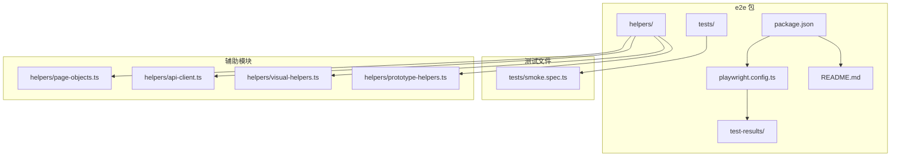
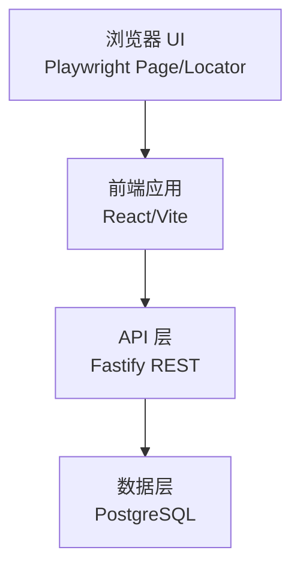
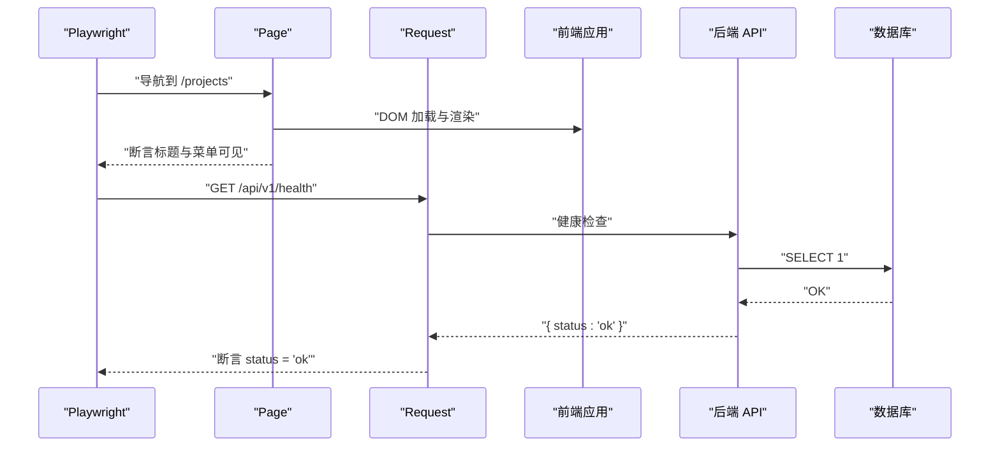
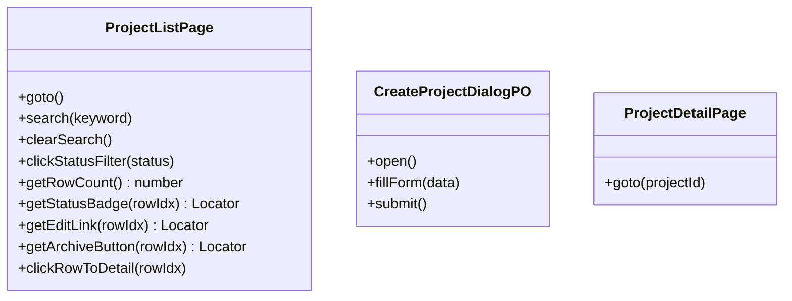
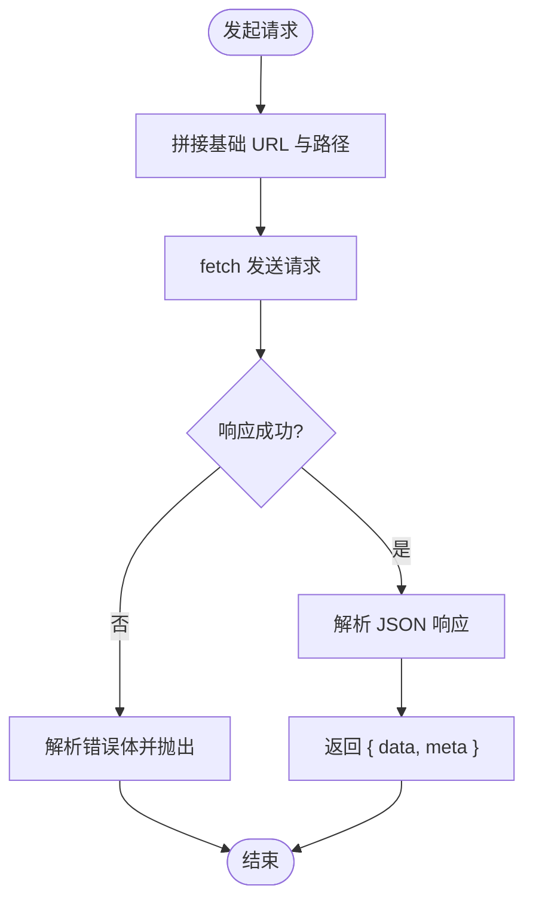
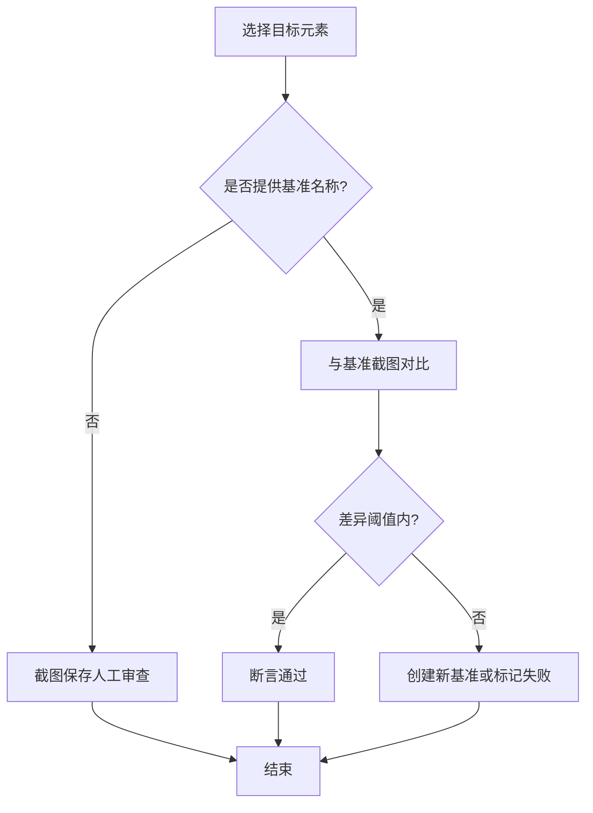
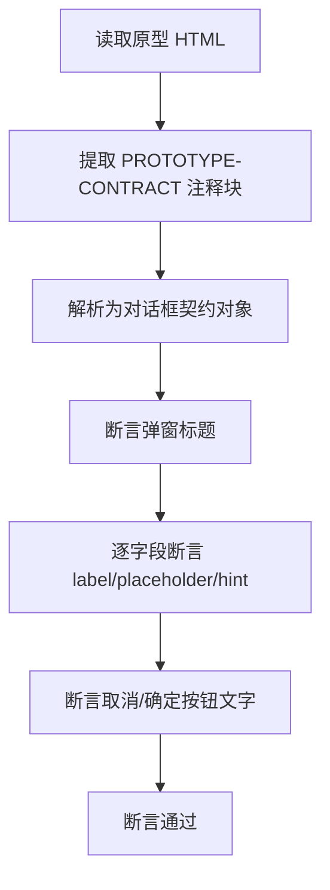
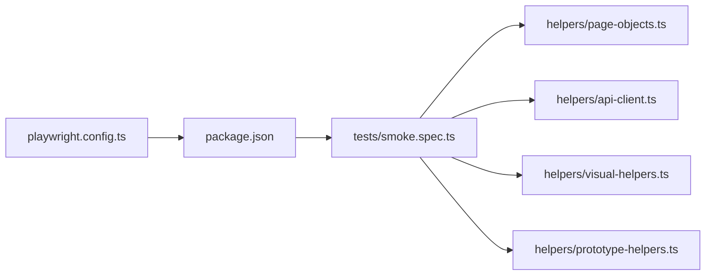

# 端到端测试

<cite>
**本文引用的文件**   
- [packages/e2e/playwright.config.ts](file://packages/e2e/playwright.config.ts)
- [packages/e2e/package.json](file://packages/e2e/package.json)
- [packages/e2e/README.md](file://packages/e2e/README.md)
- [packages/e2e/tests/smoke.spec.ts](file://packages/e2e/tests/smoke.spec.ts)
- [packages/e2e/helpers/page-objects.ts](file://packages/e2e/helpers/page-objects.ts)
- [packages/e2e/helpers/api-client.ts](file://packages/e2e/helpers/api-client.ts)
- [packages/e2e/helpers/visual-helpers.ts](file://packages/e2e/helpers/visual-helpers.ts)
- [packages/e2e/helpers/prototype-helpers.ts](file://packages/e2e/helpers/prototype-helpers.ts)
</cite>

## 目录
1. [引言](#引言)
2. [项目结构](#项目结构)
3. [核心组件](#核心组件)
4. [架构总览](#架构总览)
5. [详细组件分析](#详细组件分析)
6. [依赖分析](#依赖分析)
7. [性能考虑](#性能考虑)
8. [故障排查指南](#故障排查指南)
9. [结论](#结论)
10. [附录](#附录)

## 引言
本文件面向“AI原型管理系统”的端到端测试，系统化阐述基于 Playwright 的用户场景驱动测试设计与实施方法。重点覆盖项目管理、域模型编辑等核心业务流程的自动化测试，明确测试用例设计原则、测试数据准备与环境配置策略，以及 UI 自动化测试的页面元素定位与交互模拟方法。同时提供测试脚本编写指南、测试维护策略、测试结果分析与缺陷跟踪流程，并给出性能与压力测试的实施方案建议，确保端到端测试全面验证系统业务功能与用户体验。

## 项目结构
端到端测试位于独立的 e2e 包中，采用“按模块分组”的测试文件组织方式，配合 helpers 提供可复用的页面对象、API 客户端与可视化辅助工具。Playwright 配置集中管理浏览器设备、超时、截图与 trace 等行为，并通过脚本统一触发测试与生成报告。

**图表来源**
- [packages/e2e/playwright.config.ts:1-32](file://packages/e2e/playwright.config.ts#L1-L32)
- [packages/e2e/package.json:1-1](file://packages/e2e/package.json#L1-L1)
- [packages/e2e/README.md:53-79](file://packages/e2e/README.md#L53-L79)
- [packages/e2e/tests/smoke.spec.ts:1-31](file://packages/e2e/tests/smoke.spec.ts#L1-L31)
- [packages/e2e/helpers/page-objects.ts:1-192](file://packages/e2e/helpers/page-objects.ts#L1-L192)
- [packages/e2e/helpers/api-client.ts:1-74](file://packages/e2e/helpers/api-client.ts#L1-L74)
- [packages/e2e/helpers/visual-helpers.ts:1-125](file://packages/e2e/helpers/visual-helpers.ts#L1-L125)
- [packages/e2e/helpers/prototype-helpers.ts:1-163](file://packages/e2e/helpers/prototype-helpers.ts#L1-L163)

**章节来源**
- [packages/e2e/README.md:53-79](file://packages/e2e/README.md#L53-L79)
- [packages/e2e/playwright.config.ts:1-32](file://packages/e2e/playwright.config.ts#L1-L32)

## 核心组件
- Playwright 配置与运行参数：集中定义测试目录、浏览器设备、超时、截图与 trace 策略、报告输出等。
- 测试脚本：以模块为单位组织，首个冒烟测试验证前端、后端与数据库三层基础设施。
- 页面对象（Page Objects）：封装页面元素定位与常用交互，提升可读性与可维护性。
- API 客户端：直接调用后端 REST API，用于数据准备与边界场景测试。
- 视觉辅助工具：提供 CSS 属性断言与可选的截图基准对比能力。
- 原型一致性断言：从原型 HTML 中抽取文案契约，断言渲染结果与原型一致。

**章节来源**
- [packages/e2e/playwright.config.ts:1-32](file://packages/e2e/playwright.config.ts#L1-L32)
- [packages/e2e/tests/smoke.spec.ts:1-31](file://packages/e2e/tests/smoke.spec.ts#L1-L31)
- [packages/e2e/helpers/page-objects.ts:1-192](file://packages/e2e/helpers/page-objects.ts#L1-L192)
- [packages/e2e/helpers/api-client.ts:1-74](file://packages/e2e/helpers/api-client.ts#L1-L74)
- [packages/e2e/helpers/visual-helpers.ts:1-125](file://packages/e2e/helpers/visual-helpers.ts#L1-L125)
- [packages/e2e/helpers/prototype-helpers.ts:1-163](file://packages/e2e/helpers/prototype-helpers.ts#L1-L163)

## 架构总览
端到端测试的执行链路自上而下覆盖浏览器 UI、React 前端、REST API、Fastify 后端与 PostgreSQL 数据库。Playwright 以“零配置”方式自动等待元素就绪、截图与生成 trace，结合结构化报告与错误定位能力，形成“快速反馈、可复现、可定位”的闭环。

**图表来源**
- [packages/e2e/README.md:9-25](file://packages/e2e/README.md#L9-L25)
- [packages/e2e/playwright.config.ts:13-14](file://packages/e2e/playwright.config.ts#L13-L14)

## 详细组件分析

### 冒烟测试（基础设施验证）
冒烟测试覆盖前端页面加载、后端健康检查与数据库连通性，确保 E2E 执行所需的三层基础设施可用。该测试在模块开发早期即可运行，验证 Vite 编译、React 渲染、Fastify 响应与 PG 连接。

**图表来源**
- [packages/e2e/tests/smoke.spec.ts:1-31](file://packages/e2e/tests/smoke.spec.ts#L1-L31)
- [packages/e2e/README.md:213-241](file://packages/e2e/README.md#L213-L241)

**章节来源**
- [packages/e2e/tests/smoke.spec.ts:1-31](file://packages/e2e/tests/smoke.spec.ts#L1-L31)
- [packages/e2e/README.md:209-241](file://packages/e2e/README.md#L209-L241)

### 页面对象（ProjectListPage、CreateProjectDialogPO、ProjectDetailPage）
页面对象将 Playwright 的定位器封装为语义化方法，降低测试代码中的选择器耦合，提升可读性与可维护性。典型方法包括导航、搜索、筛选、表单填写与提交、断言等。

**图表来源**
- [packages/e2e/helpers/page-objects.ts:18-109](file://packages/e2e/helpers/page-objects.ts#L18-L109)
- [packages/e2e/helpers/page-objects.ts:115-158](file://packages/e2e/helpers/page-objects.ts#L115-L158)
- [packages/e2e/helpers/page-objects.ts:164-191](file://packages/e2e/helpers/page-objects.ts#L164-L191)

**章节来源**
- [packages/e2e/helpers/page-objects.ts:1-192](file://packages/e2e/helpers/page-objects.ts#L1-L192)

### API 客户端（E2eApiClient）
E2eApiClient 提供统一的 REST 调用封装，支持 GET/POST/PUT/DELETE，内置错误解析与异常抛出，便于在测试中进行数据准备与边界场景验证。

**图表来源**
- [packages/e2e/helpers/api-client.ts:24-47](file://packages/e2e/helpers/api-client.ts#L24-L47)
- [packages/e2e/helpers/api-client.ts:49-69](file://packages/e2e/helpers/api-client.ts#L49-L69)

**章节来源**
- [packages/e2e/helpers/api-client.ts:1-74](file://packages/e2e/helpers/api-client.ts#L1-L74)

### 视觉辅助工具（CSS 属性断言与截图对比）
视觉辅助工具提供两类验证手段：Layer 1（CSS 计算属性断言）与 Layer 2（截图基准对比）。前者无需截图即可断言样式细节；后者在存在基准时进行像素级对比，不存在时自动创建基准。

**图表来源**
- [packages/e2e/helpers/visual-helpers.ts:63-95](file://packages/e2e/helpers/visual-helpers.ts#L63-L95)

**章节来源**
- [packages/e2e/helpers/visual-helpers.ts:1-125](file://packages/e2e/helpers/visual-helpers.ts#L1-L125)

### 原型一致性断言（从原型 HTML 提取契约）
原型一致性断言从原型 HTML 的注释块中抽取弹窗文案契约（标题、字段、占位提示、必填标记、按钮文字等），并在运行时断言渲染结果与契约一致，拦截“实现与原型视觉偏差”。

**图表来源**
- [packages/e2e/helpers/prototype-helpers.ts:60-109](file://packages/e2e/helpers/prototype-helpers.ts#L60-L109)
- [packages/e2e/helpers/prototype-helpers.ts:124-162](file://packages/e2e/helpers/prototype-helpers.ts#L124-L162)

**章节来源**
- [packages/e2e/helpers/prototype-helpers.ts:1-163](file://packages/e2e/helpers/prototype-helpers.ts#L1-L163)

## 依赖分析
- Playwright 配置依赖于浏览器设备与超时策略，控制截图与 trace 的保留策略，以及报告输出位置。
- 测试脚本依赖页面对象与 API 客户端，以实现稳定的 UI 自动化与数据准备。
- 视觉与原型断言工具作为辅助模块，增强测试的可维护性与质量保障。

**图表来源**
- [packages/e2e/playwright.config.ts:1-32](file://packages/e2e/playwright.config.ts#L1-L32)
- [packages/e2e/package.json:1-1](file://packages/e2e/package.json#L1-L1)
- [packages/e2e/tests/smoke.spec.ts:1-31](file://packages/e2e/tests/smoke.spec.ts#L1-L31)
- [packages/e2e/helpers/page-objects.ts:1-192](file://packages/e2e/helpers/page-objects.ts#L1-L192)
- [packages/e2e/helpers/api-client.ts:1-74](file://packages/e2e/helpers/api-client.ts#L1-L74)
- [packages/e2e/helpers/visual-helpers.ts:1-125](file://packages/e2e/helpers/visual-helpers.ts#L1-L125)
- [packages/e2e/helpers/prototype-helpers.ts:1-163](file://packages/e2e/helpers/prototype-helpers.ts#L1-L163)

**章节来源**
- [packages/e2e/playwright.config.ts:1-32](file://packages/e2e/playwright.config.ts#L1-L32)
- [packages/e2e/package.json:1-1](file://packages/e2e/package.json#L1-L1)

## 性能考虑
- 串行执行策略：为避免数据库并发冲突，测试默认串行执行，确保稳定性。
- 自动等待与超时：Playwright 的自动等待策略减少显式 sleep，提高稳定性与速度。
- 截图与 trace：仅在失败时生成截图与 trace，降低开销并聚焦问题定位。
- 报告输出：HTML 与 JSON 报告便于快速审阅与后续分析。

**章节来源**
- [packages/e2e/playwright.config.ts:5-31](file://packages/e2e/playwright.config.ts#L5-L31)
- [packages/e2e/README.md:263-287](file://packages/e2e/README.md#L263-L287)

## 故障排查指南
- 快速反馈：优先查看终端输出的错误信息与断言失败详情。
- 报告路径：若问题复杂，查看 test-results/index.html 与 results.json。
- 截图与 trace：失败时的截图与 trace.zip 提供直观的现场信息，便于定位前端渲染、网络请求或状态问题。
- 环境检查：确认前端、后端与数据库均已启动并可互相连通；检查 baseURL 与端口配置。
- 数据隔离：确保测试数据使用唯一前缀，避免相互干扰；必要时在 afterAll 中清理测试数据。

**章节来源**
- [packages/e2e/README.md:108-159](file://packages/e2e/README.md#L108-L159)
- [packages/e2e/README.md:162-196](file://packages/e2e/README.md#L162-L196)

## 结论
通过 Playwright 驱动的端到端测试，结合页面对象、API 客户端与可视化辅助工具，能够系统性地覆盖项目管理、域模型编辑等核心业务流程。以冒烟测试为入口，逐步完善各模块的用户旅程测试，配合结构化报告与 trace 定位，形成高效、可维护的质量保障体系。对于性能与压力测试，建议在现有 E2E 基础上引入独立的性能测试套件，聚焦关键用户旅程的响应时间与吞吐量指标。

## 附录
- 测试脚本编写指南
  - 以模块为单位组织测试文件，先写冒烟测试，再补充主路径与边界场景。
  - 使用页面对象封装 UI 操作，保持测试代码简洁可读。
  - 使用 API 客户端进行数据准备与边界验证，避免 UI 干扰。
  - 在需要时启用视觉断言与原型一致性断言，提升质量保障。
- 测试维护策略
  - 选择器变更时同步更新页面对象；新增页面时补充对应 PO。
  - 定期清理测试数据，确保环境整洁。
  - 将失败案例纳入回归清单，持续优化断言与等待策略。
- 性能与压力测试实施方案
  - 使用独立的性能测试工具（如 k6 或 Artillery）对关键 API 与页面进行压力测试。
  - 关注关键用户旅程的 P95/P99 响应时间与错误率。
  - 将性能测试纳入 CI，设定阈值告警，防止回归。