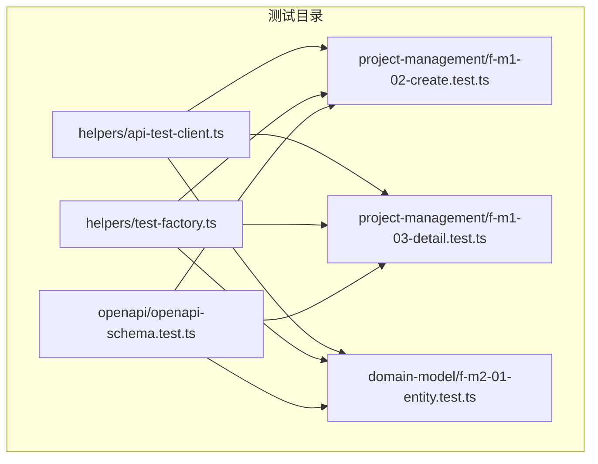
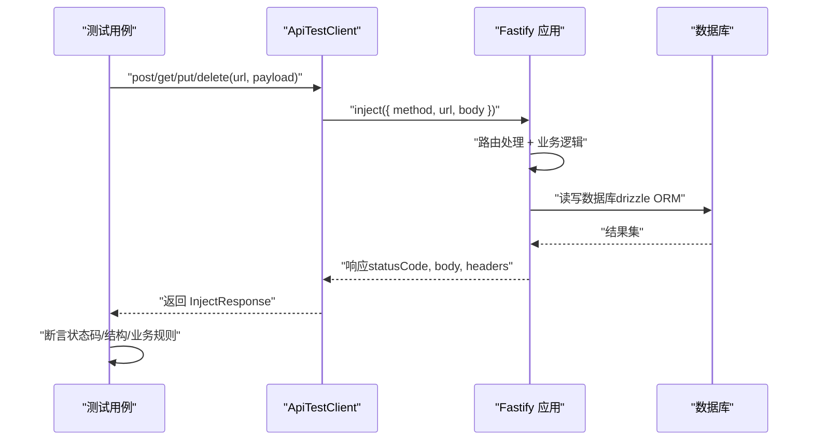
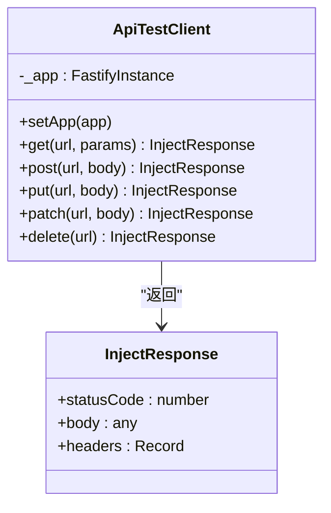
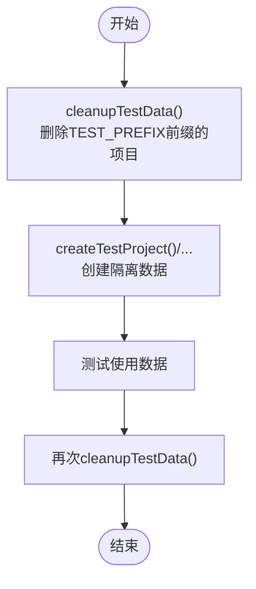
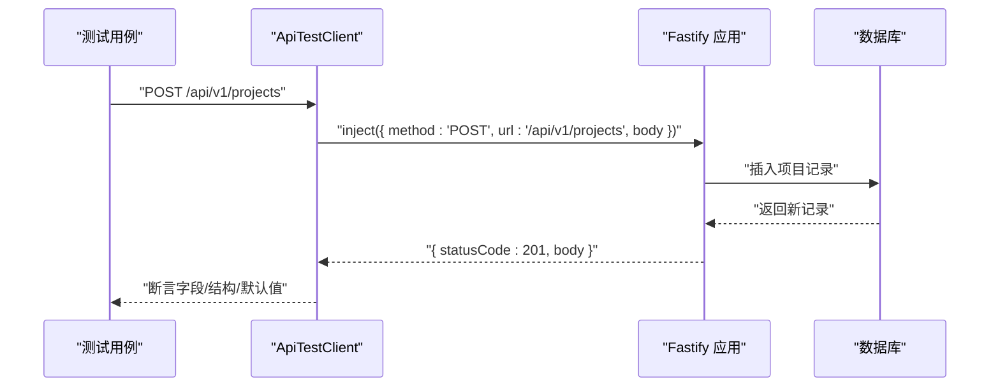
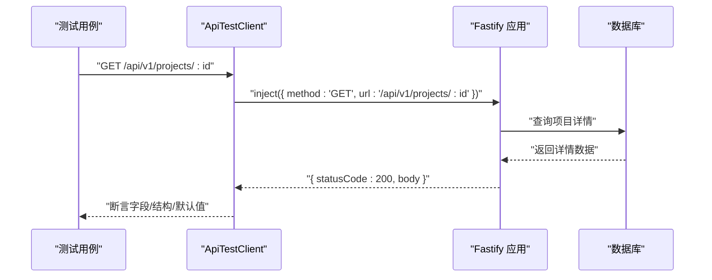
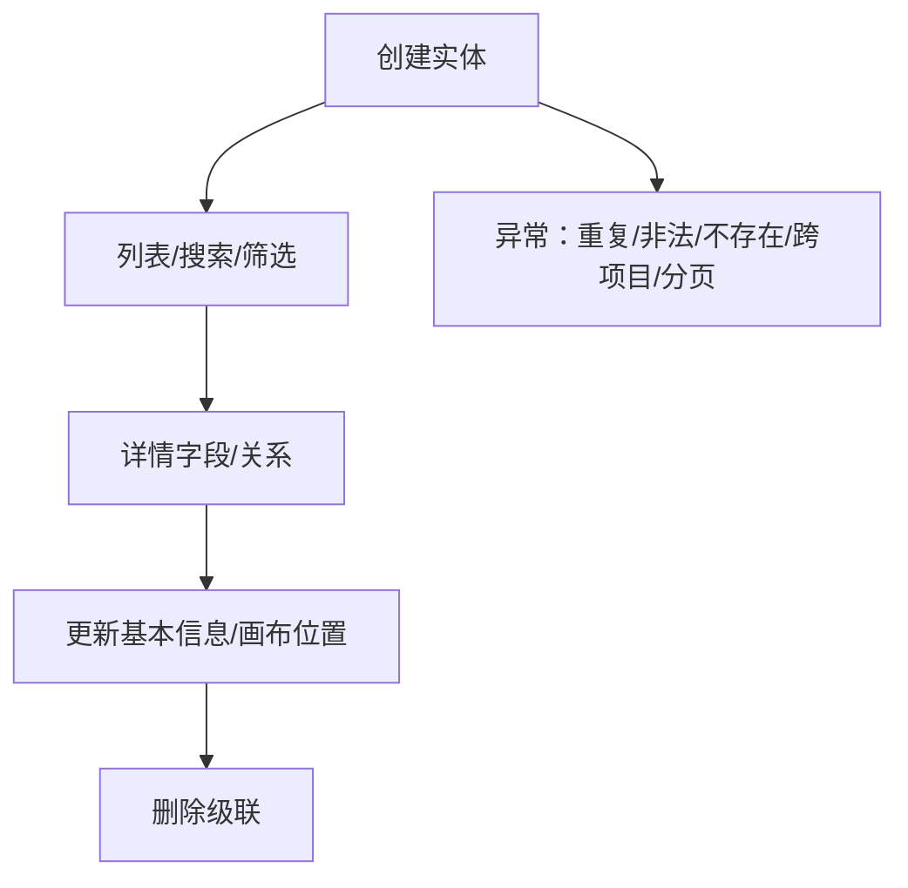
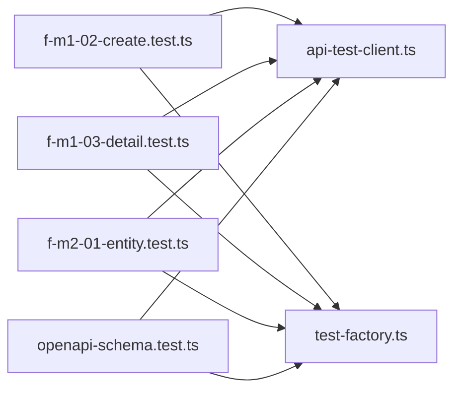

# 集成测试

<cite>
**本文引用的文件**
- [packages/api/tests/helpers/api-test-client.ts](file://packages/api/tests/helpers/api-test-client.ts)
- [packages/api/tests/helpers/test-factory.ts](file://packages/api/tests/helpers/test-factory.ts)
- [packages/api/tests/project-management/f-m1-02-create.test.ts](file://packages/api/tests/project-management/f-m1-02-create.test.ts)
- [packages/api/tests/project-management/f-m1-03-detail.test.ts](file://packages/api/tests/project-management/f-m1-03-detail.test.ts)
- [packages/api/tests/domain-model/f-m2-01-entity.test.ts](file://packages/api/tests/domain-model/f-m2-01-entity.test.ts)
- [packages/api/tests/openapi/openapi-schema.test.ts](file://packages/api/tests/openapi/openapi-schema.test.ts)
</cite>

## 目录
1. [引言](#引言)
2. [项目结构](#项目结构)
3. [核心组件](#核心组件)
4. [架构总览](#架构总览)
5. [详细组件分析](#详细组件分析)
6. [依赖分析](#依赖分析)
7. [性能考虑](#性能考虑)
8. [故障排查指南](#故障排查指南)
9. [结论](#结论)
10. [附录](#附录)

## 引言
本文件面向“AI原型管理系统”的集成测试，目标是构建一套覆盖API集成测试、数据库集成测试与服务间集成测试的完整方案，并配套测试环境搭建、测试数据管理、自动化测试流程以及测试报告与质量度量建议。文档基于仓库中现有的测试实现进行归纳总结，帮助测试工程师与开发者理解当前测试体系、扩展测试覆盖面并持续改进质量。

## 项目结构
本项目采用多包工作区组织，集成测试主要集中在 packages/api/tests 下，按功能域划分：
- helpers：测试基础设施（API客户端、测试数据工厂）
- project-management：项目管理相关API的集成测试
- domain-model：领域模型相关API的集成测试
- openapi：OpenAPI契约与Schema校验测试

图表来源
- [packages/api/tests/helpers/api-test-client.ts:1-126](file://packages/api/tests/helpers/api-test-client.ts#L1-L126)
- [packages/api/tests/helpers/test-factory.ts:1-428](file://packages/api/tests/helpers/test-factory.ts#L1-L428)
- [packages/api/tests/project-management/f-m1-02-create.test.ts:1-296](file://packages/api/tests/project-management/f-m1-02-create.test.ts#L1-L296)
- [packages/api/tests/project-management/f-m1-03-detail.test.ts:1-280](file://packages/api/tests/project-management/f-m1-03-detail.test.ts#L1-L280)
- [packages/api/tests/domain-model/f-m2-01-entity.test.ts:1-260](file://packages/api/tests/domain-model/f-m1-01-entity.test.ts#L1-L260)
- [packages/api/tests/openapi/openapi-schema.test.ts](file://packages/api/tests/openapi/openapi-schema.test.ts)

章节来源
- [packages/api/tests/helpers/api-test-client.ts:1-126](file://packages/api/tests/helpers/api-test-client.ts#L1-L126)
- [packages/api/tests/helpers/test-factory.ts:1-428](file://packages/api/tests/helpers/test-factory.ts#L1-L428)
- [packages/api/tests/project-management/f-m1-02-create.test.ts:1-296](file://packages/api/tests/project-management/f-m1-02-create.test.ts#L1-L296)
- [packages/api/tests/project-management/f-m1-03-detail.test.ts:1-280](file://packages/api/tests/project-management/f-m1-03-detail.test.ts#L1-L280)
- [packages/api/tests/domain-model/f-m2-01-entity.test.ts:1-260](file://packages/api/tests/domain-model/f-m2-01-entity.test.ts#L1-L260)
- [packages/api/tests/openapi/openapi-schema.test.ts](file://packages/api/tests/openapi/openapi-schema.test.ts)

## 核心组件
- API测试客户端（Fastify inject）：提供对内部路由的快速调用，避免HTTP栈开销，提升测试执行效率。
- 测试数据工厂：统一创建带前缀的测试数据，确保与生产/开发数据隔离，并提供批量创建与清理能力。
- 功能域测试套件：按功能域拆分，覆盖端点行为、请求响应结构、错误码、业务规则与边界值。

章节来源
- [packages/api/tests/helpers/api-test-client.ts:1-126](file://packages/api/tests/helpers/api-test-client.ts#L1-L126)
- [packages/api/tests/helpers/test-factory.ts:1-428](file://packages/api/tests/helpers/test-factory.ts#L1-L428)

## 架构总览
集成测试的总体流程如下：
- 初始化：设置Fastify应用实例，注入API客户端
- 数据准备：使用测试工厂创建隔离数据
- 执行测试：调用API端点，断言状态码、响应结构与业务语义
- 清理：按前缀清理测试数据，保证环境干净

图表来源
- [packages/api/tests/helpers/api-test-client.ts:38-113](file://packages/api/tests/helpers/api-test-client.ts#L38-L113)
- [packages/api/tests/helpers/test-factory.ts:35-84](file://packages/api/tests/helpers/test-factory.ts#L35-L84)

## 详细组件分析

### API测试客户端（ApiTestClient）
- 设计要点
  - 基于Fastify inject，绕过HTTP网络层，直接进入路由处理，显著提升执行速度
  - 统一封装GET/POST/PUT/PATCH/DELETE，自动拼接 /api/v1 前缀与JSON序列化
  - 对204 No Content特殊处理，避免解析空body
  - 提供全局单例与初始化入口，确保测试前注入应用实例
- 使用建议
  - 在每个测试文件的beforeAll/afterAll中调用初始化与清理
  - 优先使用该客户端进行API集成测试，避免真实HTTP开销

图表来源
- [packages/api/tests/helpers/api-test-client.ts:16-113](file://packages/api/tests/helpers/api-test-client.ts#L16-L113)

章节来源
- [packages/api/tests/helpers/api-test-client.ts:1-126](file://packages/api/tests/helpers/api-test-client.ts#L1-L126)

### 测试数据工厂（Test Factory）
- 设计要点
  - 统一前缀TEST_PREFIX，确保测试数据可识别与可清理
  - 提供项目、公司、部门、角色、外部实体、领域实体、字段、关系、边界、应用等工厂方法
  - 批量创建支持排序稳定性（微延迟）
  - 提供cleanupTestData，利用外键CASCADE自动清理子表
- 使用建议
  - 所有测试在beforeAll中清理，在afterAll中再次清理，确保幂等
  - 跨表依赖的测试，先创建父表再创建子表，保证外键约束

图表来源
- [packages/api/tests/helpers/test-factory.ts:421-428](file://packages/api/tests/helpers/test-factory.ts#L421-L428)
- [packages/api/tests/helpers/test-factory.ts:35-84](file://packages/api/tests/helpers/test-factory.ts#L35-L84)

章节来源
- [packages/api/tests/helpers/test-factory.ts:1-428](file://packages/api/tests/helpers/test-factory.ts#L1-L428)

### 项目管理：创建项目（F-M1-02）
- 测试范围
  - 正常流程：完整字段、省略可选字段、响应结构、创建后查询
  - Schema校验：必填缺失、name格式/长度、displayName/description长度、空请求体
  - 业务规则：name唯一性、并发安全（模拟并发）
  - 边界值：最小长度、连字符、CJK显示名、空字符串
- 断言重点
  - 状态码：201/200/400/409/404
  - 响应结构：Envelope结构、字段集合、默认值、时间戳
  - 业务语义：唯一性冲突、错误码、国际化显示

图表来源
- [packages/api/tests/project-management/f-m1-02-create.test.ts:27-95](file://packages/api/tests/project-management/f-m1-02-create.test.ts#L27-L95)

章节来源
- [packages/api/tests/project-management/f-m1-02-create.test.ts:1-296](file://packages/api/tests/project-management/f-m1-02-create.test.ts#L1-L296)

### 项目管理：查看项目详情（F-M1-03）
- 测试范围
  - 正常流程：活跃/归档项目详情、摘要统计、摘要字段零计数显示、并行查询一致性
  - 异常流程：不存在/无效UUID
  - 边界值：description为null、config默认空对象、应用类型分组统计
- 断言重点
  - 详情与摘要字段一致性
  - 计数聚合与类型分组
  - 错误码与错误信息

图表来源
- [packages/api/tests/project-management/f-m1-03-detail.test.ts:32-67](file://packages/api/tests/project-management/f-m1-03-detail.test.ts#L32-L67)

章节来源
- [packages/api/tests/project-management/f-m1-03-detail.test.ts:1-280](file://packages/api/tests/project-management/f-m1-03-detail.test.ts#L1-L280)

### 领域模型：实体管理（F-M2-01）
- 测试范围
  - 正常流程：创建实体（必填/全字段）、列表、搜索、筛选、详情（含字段/关系）、更新、删除（级联）
  - 异常流程：name重复、非法格式、不存在、跨项目访问、分页
- 断言重点
  - Canvas位置更新/清除
  - 分类筛选与搜索
  - 级联删除验证

图表来源
- [packages/api/tests/domain-model/f-m2-01-entity.test.ts:41-182](file://packages/api/tests/domain-model/f-m2-01-entity.test.ts#L41-L182)

章节来源
- [packages/api/tests/domain-model/f-m2-01-entity.test.ts:1-260](file://packages/api/tests/domain-model/f-m2-01-entity.test.ts#L1-L260)

### OpenAPI契约与Schema校验
- 测试范围
  - 基于OpenAPI契约的Schema校验，确保API定义与实现一致
- 断言重点
  - 请求/响应Schema匹配
  - 错误响应结构与错误码

章节来源
- [packages/api/tests/openapi/openapi-schema.test.ts](file://packages/api/tests/openapi/openapi-schema.test.ts)

## 依赖分析
- 组件耦合
  - ApiTestClient与Fastify应用强耦合，需在测试初始化阶段注入
  - 测试用例依赖ApiTestClient与TestFactory，二者相对独立，便于复用
- 外部依赖
  - Drizzle ORM用于数据库操作
  - Vitest用于测试运行与断言
- 潜在风险
  - 测试数据隔离依赖前缀与清理流程，需确保每次测试均执行清理
  - 并发测试场景建议结合数据库层面的唯一性约束验证

图表来源
- [packages/api/tests/project-management/f-m1-02-create.test.ts:10-21](file://packages/api/tests/project-management/f-m1-02-create.test.ts#L10-L21)
- [packages/api/tests/project-management/f-m1-03-detail.test.ts:11-26](file://packages/api/tests/project-management/f-m1-03-detail.test.ts#L11-L26)
- [packages/api/tests/domain-model/f-m2-01-entity.test.ts:13-35](file://packages/api/tests/domain-model/f-m2-01-entity.test.ts#L13-L35)
- [packages/api/tests/helpers/api-test-client.ts:123-125](file://packages/api/tests/helpers/api-test-client.ts#L123-L125)
- [packages/api/tests/helpers/test-factory.ts:421-428](file://packages/api/tests/helpers/test-factory.ts#L421-L428)

章节来源
- [packages/api/tests/project-management/f-m1-02-create.test.ts:1-296](file://packages/api/tests/project-management/f-m1-02-create.test.ts#L1-L296)
- [packages/api/tests/project-management/f-m1-03-detail.test.ts:1-280](file://packages/api/tests/project-management/f-m1-03-detail.test.ts#L1-L280)
- [packages/api/tests/domain-model/f-m2-01-entity.test.ts:1-260](file://packages/api/tests/domain-model/f-m2-01-entity.test.ts#L1-L260)
- [packages/api/tests/helpers/api-test-client.ts:1-126](file://packages/api/tests/helpers/api-test-client.ts#L1-L126)
- [packages/api/tests/helpers/test-factory.ts:1-428](file://packages/api/tests/helpers/test-factory.ts#L1-L428)

## 性能考虑
- 使用inject替代HTTP请求，减少网络与序列化开销
- 测试数据批量创建时注意微延迟，避免排序测试受时间精度影响
- 并行查询场景（如详情/摘要）建议使用Promise.all，缩短总耗时
- 清理流程使用前缀过滤，避免扫描全表，提高效率

## 故障排查指南
- 常见问题
  - app未初始化：ApiTestClient抛出未初始化错误，检查是否在测试前调用初始化
  - 数据未清理：确认beforeAll/afterAll中调用了cleanupTestData
  - 并发冲突：关注唯一性约束导致的409，必要时调整并发策略
- 排查步骤
  - 打印响应状态码与body，定位失败点
  - 检查请求URL、路径参数与查询参数
  - 核对Drizzle ORM插入/查询条件与字段映射

章节来源
- [packages/api/tests/helpers/api-test-client.ts:31-36](file://packages/api/tests/helpers/api-test-client.ts#L31-L36)
- [packages/api/tests/helpers/test-factory.ts:421-428](file://packages/api/tests/helpers/test-factory.ts#L421-L428)

## 结论
本集成测试体系以Fastify inject为核心，结合统一的测试数据工厂与按功能域拆分的测试套件，实现了高效、可维护、可扩展的API集成测试方案。通过覆盖端点行为、请求响应验证、错误处理与业务规则，能够有效验证系统各组件协同工作的正确性。建议在此基础上逐步扩展服务间通信与数据同步测试，并完善自动化流程与质量度量。

## 附录

### 测试环境搭建与数据管理
- 环境准备
  - 使用Vitest运行测试
  - 在测试前注入Fastify应用实例
  - 准备数据库连接（Drizzle ORM）
- 数据管理
  - 使用TEST_PREFIX隔离测试数据
  - 所有测试结束后执行cleanupTestData

章节来源
- [packages/api/tests/helpers/api-test-client.ts:123-125](file://packages/api/tests/helpers/api-test-client.ts#L123-L125)
- [packages/api/tests/helpers/test-factory.ts:17-18](file://packages/api/tests/helpers/test-factory.ts#L17-L18)
- [packages/api/tests/helpers/test-factory.ts:421-428](file://packages/api/tests/helpers/test-factory.ts#L421-L428)

### API测试工具与自动化流程
- 工具
  - Vitest：测试运行与断言
  - Fastify inject：HTTP无关的API调用
- 流程
  - 初始化 -> 数据准备 -> 执行测试 -> 清理
- 建议
  - 将测试纳入CI流水线，按功能域分批执行
  - 生成测试报告（HTML/JSON），结合覆盖率与失败重试策略

章节来源
- [packages/api/tests/helpers/api-test-client.ts:1-126](file://packages/api/tests/helpers/api-test-client.ts#L1-L126)
- [packages/api/tests/helpers/test-factory.ts:1-428](file://packages/api/tests/helpers/test-factory.ts#L1-L428)

### 测试报告与质量度量
- 报告内容
  - 用例执行结果（通过/失败/跳过）
  - 失败用例的响应状态码与body快照
  - 覆盖率（代码/分支/函数/行）
- 质量度量
  - 用例通过率、失败率、平均执行时长
  - 关键业务路径的回归通过率
  - 并发冲突率（唯一性约束）

章节来源
- [packages/api/tests/project-management/f-m1-02-create.test.ts:1-296](file://packages/api/tests/project-management/f-m1-02-create.test.ts#L1-L296)
- [packages/api/tests/project-management/f-m1-03-detail.test.ts:1-280](file://packages/api/tests/project-management/f-m1-03-detail.test.ts#L1-L280)
- [packages/api/tests/domain-model/f-m2-01-entity.test.ts:1-260](file://packages/api/tests/domain-model/f-m2-01-entity.test.ts#L1-L260)