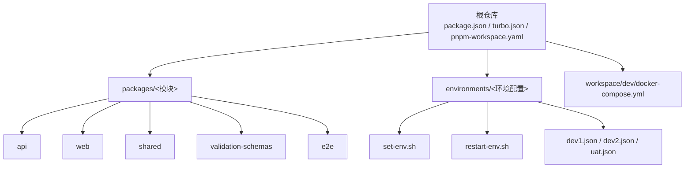
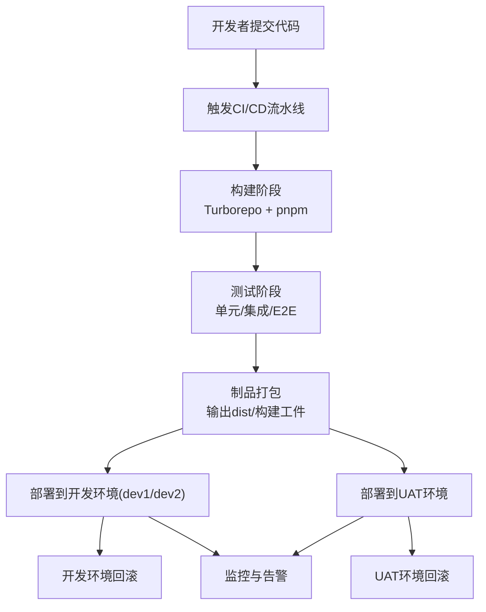
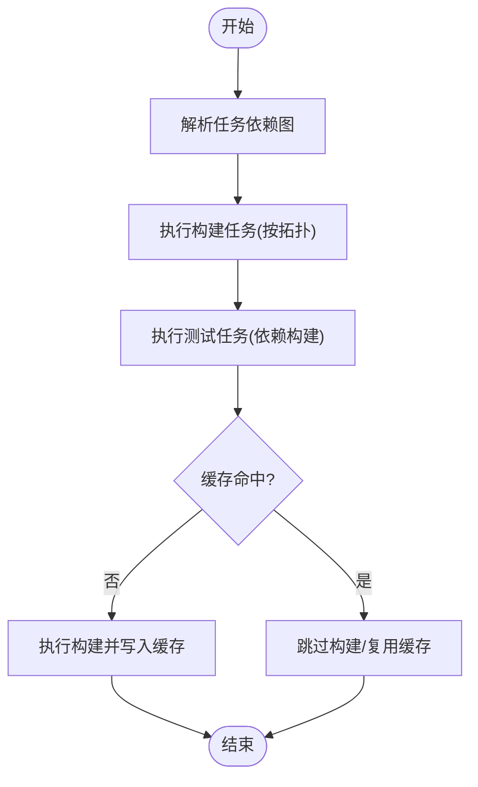
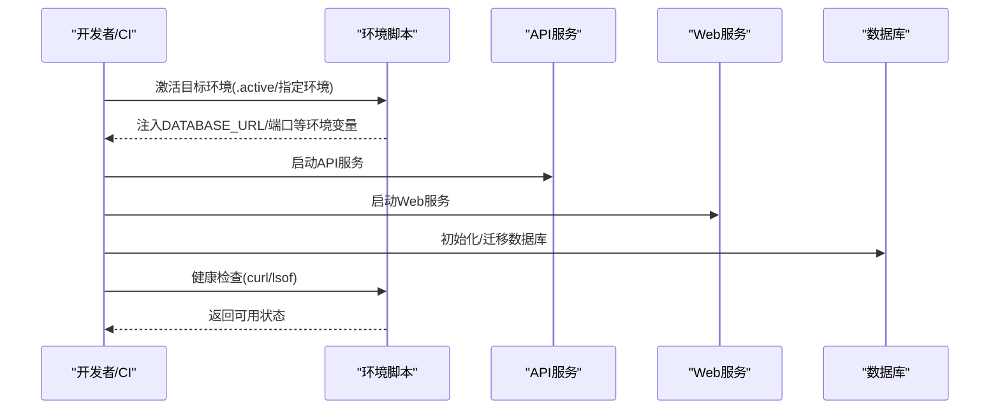
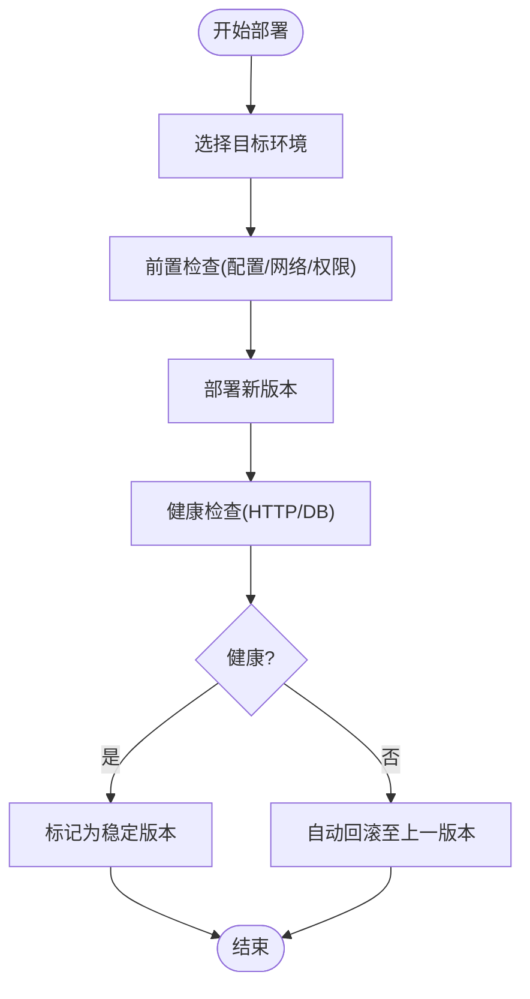
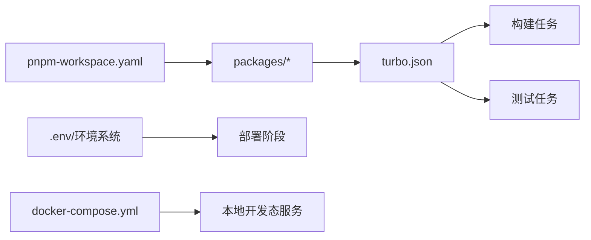

# CI/CD流水线

<cite>
**本文引用的文件**
- [README.md](file://README.md)
- [package.json](file://package.json)
- [turbo.json](file://turbo.json)
- [pnpm-workspace.yaml](file://pnpm-workspace.yaml)
- [environments/README.md](file://environments/README.md)
- [environments/set-env.sh](file://environments/set-env.sh)
- [environments/restart-env.sh](file://environments/restart-env.sh)
- [workspace/dev/docker-compose.yml](file://workspace/dev/docker-compose.yml)
</cite>

## 目录
1. [引言](#引言)
2. [项目结构](#项目结构)
3. [核心组件](#核心组件)
4. [架构总览](#架构总览)
5. [详细组件分析](#详细组件分析)
6. [依赖分析](#依赖分析)
7. [性能考虑](#性能考虑)
8. [故障排查指南](#故障排查指南)
9. [结论](#结论)
10. [附录](#附录)

## 引言
本文件面向AI原型管理系统，围绕CI/CD流水线设计目标，系统化阐述自动化构建、测试与部署的完整流程设计。内容覆盖持续集成策略（代码提交触发的自动化检查与测试）、持续部署方案（多环境自动部署与回滚机制）、部署脚本设计与CLI使用方法、流水线配置最佳实践（构建缓存、测试并行化、部署策略）、监控与告警机制以及故障诊断与恢复方法，帮助开发团队建立可靠高效的自动化部署流程。

## 项目结构
项目采用Monorepo架构，使用pnpm workspaces组织多包模块，通过Turborepo统一调度构建、测试与开发任务；环境管理通过独立的environments目录与shell脚本实现，支持多环境隔离与一键重启；开发态使用docker-compose编排本地服务。

**图表来源**
- [pnpm-workspace.yaml:1-3](file://pnpm-workspace.yaml#L1-L3)
- [package.json:1-2](file://package.json#L1-L2)
- [turbo.json:1-1](file://turbo.json#L1-L1)
- [environments/README.md:11-20](file://environments/README.md#L11-L20)
- [workspace/dev/docker-compose.yml](file://workspace/dev/docker-compose.yml)

**章节来源**
- [README.md:32-51](file://README.md#L32-L51)
- [pnpm-workspace.yaml:1-3](file://pnpm-workspace.yaml#L1-L3)
- [package.json:1-2](file://package.json#L1-L2)
- [turbo.json:1-1](file://turbo.json#L1-L1)
- [environments/README.md:11-20](file://environments/README.md#L11-L20)

## 核心组件
- 任务编排与缓存：Turborepo负责跨包任务编排、依赖拓扑排序、增量构建与缓存复用，提升整体效率。
- 包管理与工作区：pnpm workspaces统一管理多包依赖，保证版本一致性与安装性能。
- 环境系统：通过JSON配置与shell脚本实现环境激活、端口与数据库URL注入、服务重启等能力，保障多环境一致性与可审计性。
- 开发容器编排：docker-compose用于本地开发态服务编排，便于快速拉起Web/API/DB等服务。
- 多环境部署：结合环境系统与CI平台，实现不同环境的自动化部署与回滚。

**章节来源**
- [turbo.json:1-1](file://turbo.json#L1-L1)
- [pnpm-workspace.yaml:1-3](file://pnpm-workspace.yaml#L1-L3)
- [environments/README.md:1-103](file://environments/README.md#L1-L103)
- [workspace/dev/docker-compose.yml](file://workspace/dev/docker-compose.yml)

## 架构总览
下图展示从代码提交到多环境部署的端到端流水线视图，涵盖触发、构建、测试、打包、部署与回滚的关键节点。

[本图为概念性架构示意，无需图表来源]

## 详细组件分析

### 组件A：任务编排与缓存（Turborepo）
- 作用：统一管理构建、测试、开发任务，按依赖拓扑执行，支持增量构建与缓存复用。
- 关键特性：
  - 构建任务依赖上游包构建结果，确保产物一致性。
  - 测试任务依赖构建完成，避免无意义测试。
  - 开发任务禁用缓存并持久化，保证热更新体验。
  - E2E测试禁用缓存，确保端到端场景最新。
- 性能影响：合理利用缓存与增量构建，显著缩短CI时间。

**图表来源**
- [turbo.json:1-1](file://turbo.json#L1-L1)

**章节来源**
- [turbo.json:1-1](file://turbo.json#L1-L1)

### 组件B：包管理与工作区（pnpm workspaces）
- 作用：统一管理多包依赖，保证版本一致与安装性能。
- 关键点：
  - 工作区路径声明，确保所有包被纳入管理。
  - 与Turborepo配合，实现跨包任务编排。
- 影响：减少重复依赖、加速安装、降低镜像体积。

**章节来源**
- [pnpm-workspace.yaml:1-3](file://pnpm-workspace.yaml#L1-L3)

### 组件C：环境系统与部署脚本
- 环境激活：通过shell脚本加载JSON配置，注入端口与数据库URL等环境变量，确保服务启动前已就绪。
- 完整重启：一键清理旧进程并启动新服务，便于快速恢复。
- 端口分配：明确各服务在不同环境的端口规则，避免冲突。
- 与CI集成：CI在部署前先激活目标环境，再执行部署与健康检查。

**图表来源**
- [environments/README.md:22-62](file://environments/README.md#L22-L62)
- [environments/set-env.sh](file://environments/set-env.sh)
- [environments/restart-env.sh](file://environments/restart-env.sh)

**章节来源**
- [environments/README.md:1-103](file://environments/README.md#L1-L103)

### 组件D：开发态容器编排（docker-compose）
- 作用：本地快速拉起Web/API/DB等服务，与环境系统配合，形成一致的开发体验。
- 建议：在CI中可复用相同compose配置进行预检或最小化部署验证。

**章节来源**
- [workspace/dev/docker-compose.yml](file://workspace/dev/docker-compose.yml)

### 组件E：多环境自动部署与回滚
- 部署策略：
  - 开发环境(dev1/dev2)：快速部署，支持蓝绿/金丝雀小流量发布，失败立即回滚。
  - UAT环境：严格审批后发布，保留最近N个版本以便回滚。
- 回滚机制：
  - 通过版本标签/镜像标签快速回退至上一稳定版本。
  - 自动化执行回滚脚本，确保数据库迁移与前端静态资源同步。
- 健康检查：
  - 部署后执行HTTP探针与数据库连通性检查，失败则触发自动回滚。

[本图为概念性流程示意，无需图表来源]

## 依赖分析
- 包依赖：各包通过workspaces统一管理，构建顺序由Turborepo根据任务定义与依赖拓扑决定。
- 环境依赖：部署阶段依赖环境系统提供的DATABASE_URL与端口配置，确保服务正确连接数据库。
- 运行时依赖：docker-compose用于本地开发态服务编排，CI可复用相同配置进行验证。

**图表来源**
- [pnpm-workspace.yaml:1-3](file://pnpm-workspace.yaml#L1-L3)
- [turbo.json:1-1](file://turbo.json#L1-L1)
- [environments/README.md:94-103](file://environments/README.md#L94-L103)
- [workspace/dev/docker-compose.yml](file://workspace/dev/docker-compose.yml)

**章节来源**
- [pnpm-workspace.yaml:1-3](file://pnpm-workspace.yaml#L1-L3)
- [turbo.json:1-1](file://turbo.json#L1-L1)
- [environments/README.md:94-103](file://environments/README.md#L94-L103)

## 性能考虑
- 构建缓存：
  - 利用Turborepo的增量构建与缓存复用，避免重复构建。
  - 将构建输出目录加入缓存白名单，确保产物可复用。
- 测试并行化：
  - 在CI中按包维度并行执行测试任务，缩短总耗时。
  - E2E测试单独串行，避免共享资源竞争。
- 镜像与安装优化：
  - 使用pnpm替代npm/yarn，提升安装速度与磁盘占用。
  - 在CI中缓存pnpm store与node_modules，进一步提速。
- 环境隔离：
  - 通过环境系统与端口规则，避免多环境间冲突，减少重试成本。

[本节为通用性能建议，无需章节来源]

## 故障排查指南
- 环境未激活导致的连接错误：
  - 症状：数据库连接失败或端口不可达。
  - 排查：确认是否使用source加载环境脚本；检查.active与对应JSON配置。
- 端口冲突：
  - 症状：服务启动失败或端口被占用。
  - 排查：核对端口分配规则；使用完整重启脚本清理旧进程。
- 健康检查失败：
  - 症状：部署后无法访问或数据库不可用。
  - 排查：查看部署日志与探针返回；必要时手动回滚至上一版本。
- CI构建失败：
  - 症状：构建或测试任务中断。
  - 排查：检查任务依赖与缓存命中情况；优先在本地复现问题。

**章节来源**
- [environments/README.md:22-62](file://environments/README.md#L22-L62)
- [environments/README.md:74-82](file://environments/README.md#L74-L82)

## 结论
通过Turborepo的任务编排与缓存、pnpm workspaces的包管理、环境系统的标准化配置与脚本化控制，以及docker-compose的开发态编排，AI原型管理系统具备了构建高效、测试可控、部署可回滚的CI/CD基础。结合本文提出的多环境部署策略、监控告警与故障恢复方法，开发团队可快速落地一套可靠且可扩展的自动化流水线。

## 附录
- 部署CLI使用要点：
  - 激活环境：使用环境脚本加载目标环境配置。
  - 完整重启：一键清理并启动服务，适合快速恢复。
  - 环境新增：复制现有JSON并修改端口与数据库字段，设置.active。
- 最佳实践清单：
  - 在CI中启用构建缓存与并行测试。
  - 对生产/UAT采用审批与灰度发布策略。
  - 保持环境配置与脚本的版本化管理。
  - 建立完善的监控与告警体系，确保异常可感知、可回滚。

[本节为通用实践建议，无需章节来源]