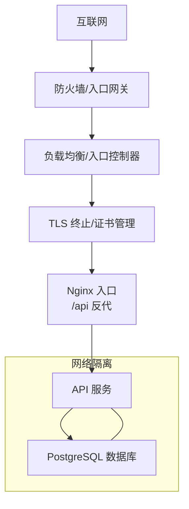
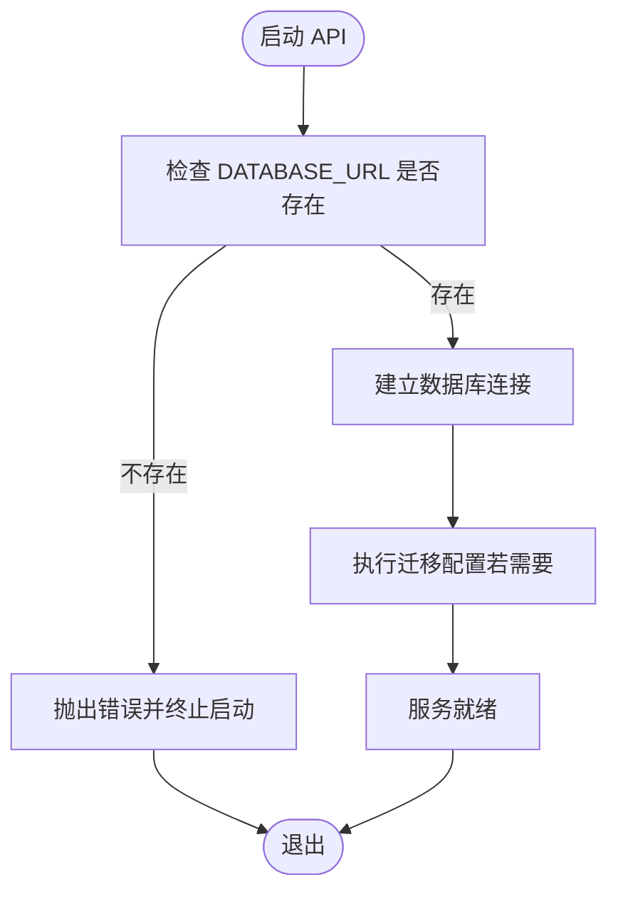
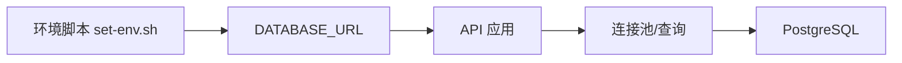

# 安全加固

<cite>
**本文引用的文件**
- [multi-env-deploy.md](file://docs/07-deploy-design/multi-env-deploy.md)
- [db.ts](file://packages/api/src/db.ts)
- [config.ts](file://packages/api/drizzle/config.ts)
- [set-env.sh](file://environments/set-env.sh)
- [dev1.json](file://environments/dev1.json)
- [dev2.json](file://environments/dev2.json)
- [docker-compose.yml](file://workspace/dev/docker-compose.yml)
- [app.ts](file://packages/api/src/app.ts)
- [vite.config.ts](file://packages/web/vite.config.ts)
</cite>

## 目录
1. [简介](#简介)
2. [项目结构](#项目结构)
3. [核心组件](#核心组件)
4. [架构总览](#架构总览)
5. [详细组件分析](#详细组件分析)
6. [依赖分析](#依赖分析)
7. [性能考虑](#性能考虑)
8. [故障排查指南](#故障排查指南)
9. [结论](#结论)
10. [附录](#附录)

## 简介
本文件面向“AI原型管理系统”的安全加固，聚焦于容器安全、数据库安全、网络安全与合规审计等方面。结合仓库现有部署与配置文档，梳理当前基线安全实践，并提出可落地的改进方案，帮助系统在生产环境中具备更强的抗风险能力。

## 项目结构
系统采用多环境容器化部署，通过环境定义文件与环境脚本统一注入配置，API 服务通过 Nginx 单一入口对外暴露，前端静态资源由 Nginx 提供并进行反向代理转发至后端 API。数据库使用 PostgreSQL，按环境隔离存储。

```mermaid
graph TB
subgraph "开发环境"
Nginx["Nginx 容器<br/>端口: 80 -> 13181"]
API["API 容器<br/>端口: 3000 -> 13180"]
DB["PostgreSQL 容器<br/>端口: 5432 -> 5432"]
end
Browser["浏览器"] --> |HTTP(S)| Nginx
Nginx --> |/api/* 反代| API
API --> |DATABASE_URL| DB
```

图表来源
- [multi-env-deploy.md:251-301](file://docs/07-deploy-design/multi-env-deploy.md#L251-L301)
- [docker-compose.yml](file://workspace/dev/docker-compose.yml)

章节来源
- [multi-env-deploy.md:75-102](file://docs/07-deploy-design/multi-env-deploy.md#L75-L102)
- [multi-env-deploy.md:251-301](file://docs/07-deploy-design/multi-env-deploy.md#L251-L301)

## 核心组件
- 容器编排与入口
  - Nginx 作为单一入口，负责静态资源分发与 /api* 请求反代，浏览器与 API 处于同源，降低 CORS 风险。
- 环境配置注入
  - 通过环境脚本与环境 JSON 统一生成 DATABASE_URL 等敏感参数，避免硬编码与明文写入 .env。
- 数据库连接
  - API 侧严格校验 DATABASE_URL 是否存在，缺失时直接抛错，杜绝隐式默认值带来的误连风险。
- API 进程生命周期
  - API 容器内置优雅停机处理，保障容器停止时的事务与资源释放。

章节来源
- [multi-env-deploy.md:75-102](file://docs/07-deploy-design/multi-env-deploy.md#L75-L102)
- [multi-env-deploy.md:251-301](file://docs/07-deploy-design/multi-env-deploy.md#L251-L301)
- [db.ts:5-12](file://packages/api/src/db.ts#L5-L12)
- [config.ts:7-9](file://packages/api/drizzle/config.ts#L7-L9)
- [set-env.sh:85-95](file://environments/set-env.sh#L85-L95)
- [app.ts](file://packages/api/src/app.ts)

## 架构总览
下图展示生产环境建议的网络与安全边界：外部仅暴露 Nginx，内部 API 与 DB 位于受控网络；API 通过受控的 DATABASE_URL 访问数据库；TLS 与 CORS 策略在 Nginx 层面集中治理。



图表来源
- [multi-env-deploy.md:251-301](file://docs/07-deploy-design/multi-env-deploy.md#L251-L301)
- [multi-env-deploy.md:574-583](file://docs/07-deploy-design/multi-env-deploy.md#L574-L583)

## 详细组件分析

### 容器安全配置
- 非 root 用户运行
  - 已在容器基线中明确 API 容器以非 root 用户运行，降低权限滥用风险。
- 最小权限原则
  - 通过独立 bridge 网络实现环境隔离；API 仅暴露必要端口；数据库仅对同网络容器开放。
- 镜像供应链安全
  - 建议采用本地构建并纳入镜像签名与漏洞扫描流程；可选将镜像推送至私有仓库或 GHCR，配合镜像签名校验。
- 运行时安全
  - 引入只读根文件系统、禁用特权模式、限制资源配额；挂载卷最小化，避免敏感路径暴露。

章节来源
- [multi-env-deploy.md:578-583](file://docs/07-deploy-design/multi-env-deploy.md#L578-L583)

### 数据库安全措施
- 密码管理
  - 当前 DATABASE_URL 明文出现在环境覆写文件中，建议迁移到密钥管理服务（如 KMS/Secrets Manager），并以环境脚本动态注入。
- 网络隔离
  - 每个环境使用独立 bridge 网络与端口范围，避免横向移动；数据库仅对 API 容器开放。
- 访问控制
  - 使用专用数据库用户与最小权限账号；启用 SSL 连接；限制连接数与会话超时。
- 连接与迁移
  - API 侧严格校验 DATABASE_URL；迁移配置同样依赖环境变量，杜绝硬编码 fallback。



图表来源
- [db.ts:5-12](file://packages/api/src/db.ts#L5-L12)
- [config.ts:7-9](file://packages/api/drizzle/config.ts#L7-L9)

章节来源
- [db.ts:5-12](file://packages/api/src/db.ts#L5-L12)
- [config.ts:7-9](file://packages/api/drizzle/config.ts#L7-L9)
- [set-env.sh:85-95](file://environments/set-env.sh#L85-L95)
- [dev1.json](file://environments/dev1.json)
- [dev2.json](file://environments/dev2.json)

### 网络安全配置
- 防火墙与入口
  - 生产环境仅暴露 Nginx 入口；API 与 DB 收敛在受控网络；建议在入口层启用 WAF 与速率限制。
- TLS 加密
  - 建议在入口层启用 TLS 终止，统一证书管理与轮换；后端 API 与 DB 间通信可启用 SSL。
- CORS 策略
  - 基线允许宽松 CORS，建议改为按环境配置的白名单 origin，避免跨域风险。

章节来源
- [multi-env-deploy.md:574-583](file://docs/07-deploy-design/multi-env-deploy.md#L574-L583)
- [multi-env-deploy.md:251-301](file://docs/07-deploy-design/multi-env-deploy.md#L251-L301)

### 安全审计与合规检查
- 漏洞扫描
  - 容器镜像：构建后进行 SCA 扫描，关注基础镜像与依赖漏洞；结合镜像签名验证。
  - 代码与配置：CI 中集成 SAST/DAST，覆盖数据库连接字符串、CORS 配置、TLS 设置等。
- 安全测试
  - 单元/集成测试中增加安全断言（如连接串来源、日志脱敏、异常处理）。
- 合规报告
  - 生成镜像清单、依赖清单与扫描报告；保留审计轨迹（启动/停止、配置变更、密钥轮换）。

章节来源
- [multi-env-deploy.md:574-583](file://docs/07-deploy-design/multi-env-deploy.md#L574-L583)

### 安全事件响应与应急预案
- 快速定位
  - 通过健康检查端点与日志聚合快速判断入口、API、数据库状态。
- 隔离与降级
  - 入口层限流/熔断；临时关闭非关键接口；必要时回滚镜像版本。
- 修复与复盘
  - 修复后进行回归测试与二次扫描；更新应急预案并组织演练。

章节来源
- [multi-env-deploy.md:281-286](file://docs/07-deploy-design/multi-env-deploy.md#L281-L286)

## 依赖分析
API 服务对数据库的依赖链路清晰：环境脚本生成 DATABASE_URL → API 连接池初始化 → 数据库查询/迁移。



图表来源
- [set-env.sh:85-95](file://environments/set-env.sh#L85-L95)
- [db.ts:14-19](file://packages/api/src/db.ts#L14-L19)

章节来源
- [set-env.sh:85-95](file://environments/set-env.sh#L85-L95)
- [db.ts:5-12](file://packages/api/src/db.ts#L5-L12)
- [config.ts:7-9](file://packages/api/drizzle/config.ts#L7-L9)

## 性能考虑
- 连接池与超时
  - 合理设置连接池大小与超时参数，避免并发高峰下的连接耗尽。
- 反向代理优化
  - Nginx 层开启压缩与缓存，减少后端压力；对 /api 路径设置合理的超时与缓冲区。
- 网络隔离与带宽
  - 独立 bridge 网络降低广播风暴影响；生产环境建议使用更高带宽与 QoS 策略。

章节来源
- [multi-env-deploy.md:251-301](file://docs/07-deploy-design/multi-env-deploy.md#L251-L301)

## 故障排查指南
- 启动失败（数据库连接）
  - 确认已先激活环境并生成 DATABASE_URL；检查环境 JSON 与脚本输出；核对数据库端口与网络可达性。
- CORS 报错
  - 检查前端构建 base 配置与后端 CORS 白名单；确保浏览器与 API 处于同源。
- 健康检查
  - 通过 /health 端点确认入口与后端存活状态；结合日志定位具体模块。

章节来源
- [db.ts:5-12](file://packages/api/src/db.ts#L5-L12)
- [vite.config.ts](file://packages/web/vite.config.ts)
- [multi-env-deploy.md:281-286](file://docs/07-deploy-design/multi-env-deploy.md#L281-L286)

## 结论
系统已在容器非 root 运行、环境化注入、网络隔离与入口反代方面形成良好基线。建议在生产环境进一步完善密钥管理、镜像供应链安全、TLS 与 CORS 策略、以及持续化的安全扫描与应急响应机制，以满足更高的安全与合规要求。

## 附录
- 最佳实践清单
  - 容器：非 root、只读根文件系统、最小权限、资源配额、镜像签名与漏洞扫描。
  - 数据库：专用用户、SSL 连接、最小权限账号、密钥管理、定期轮换。
  - 网络：入口层 WAF/限流、TLS 终止、CORS 白名单、网络隔离。
  - 审计：SCA/SAST/DAST、合规报告、变更审计、演练复盘。
  - 应急：快速定位、隔离降级、回滚策略、二次验证。