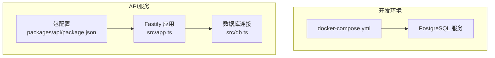
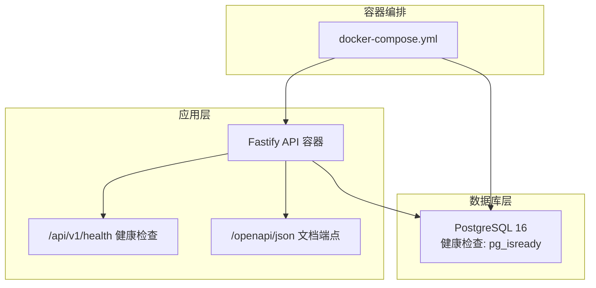
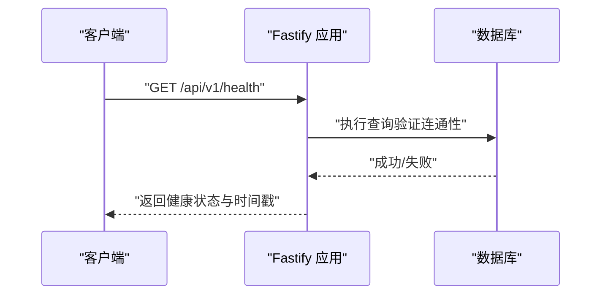
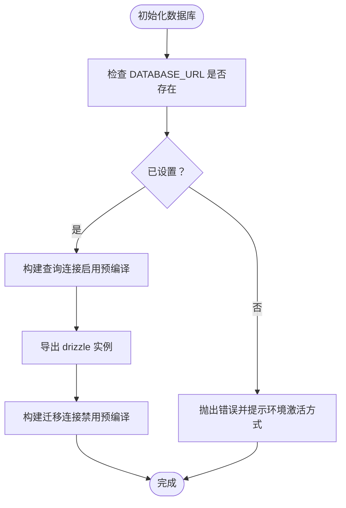
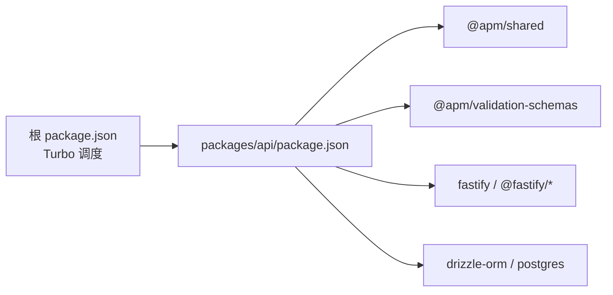

# API容器配置

<cite>
**本文引用的文件**
- [docker-compose.yml](file://workspace/dev/docker-compose.yml)
- [packages/api/package.json](file://packages/api/package.json)
- [packages/api/src/app.ts](file://packages/api/src/app.ts)
- [packages/api/src/db.ts](file://packages/api/src/db.ts)
- [package.json](file://package.json)
</cite>

## 目录
1. [简介](#简介)
2. [项目结构](#项目结构)
3. [核心组件](#核心组件)
4. [架构总览](#架构总览)
5. [详细组件分析](#详细组件分析)
6. [依赖关系分析](#依赖关系分析)
7. [性能考虑](#性能考虑)
8. [故障排查指南](#故障排查指南)
9. [结论](#结论)
10. [附录](#附录)

## 简介
本文件面向AI原型管理系统API容器的配置与运维，聚焦于Fastify API容器的Docker编排与运行参数、Node.js运行时选择、依赖安装优化、生产环境配置、数据库连接与连接池管理、健康检查与监控指标、容器资源限制与性能调优、以及错误处理与日志收集最佳实践。本文所有技术细节均基于仓库中现有配置与代码实现进行归纳总结。

## 项目结构
本项目采用多包工作区结构，API服务位于packages/api目录，开发环境使用docker-compose定义PostgreSQL数据库服务。API服务通过环境变量DATABASE_URL连接数据库，并在启动时进行健康检查。

**图表来源**
- [docker-compose.yml:1-20](file://workspace/dev/docker-compose.yml#L1-L20)
- [packages/api/src/app.ts:1-182](file://packages/api/src/app.ts#L1-L182)
- [packages/api/src/db.ts:1-25](file://packages/api/src/db.ts#L1-L25)
- [packages/api/package.json:1-1](file://packages/api/package.json#L1-L1)

**章节来源**
- [docker-compose.yml:1-20](file://workspace/dev/docker-compose.yml#L1-L20)
- [packages/api/package.json:1-1](file://packages/api/package.json#L1-L1)
- [package.json:1-2](file://package.json#L1-L2)

## 核心组件
- Fastify应用与插件：启用CORS、OpenAPI/Swagger与Scalar文档、统一错误处理、请求响应日志装饰器、健康检查路由。
- 数据库连接：通过DATABASE_URL建立连接，使用postgres驱动与drizzle-orm进行查询与迁移。
- 开发与构建：使用Turbo统一调度，API包内含开发、构建与数据库相关脚本。

**章节来源**
- [packages/api/src/app.ts:1-182](file://packages/api/src/app.ts#L1-L182)
- [packages/api/src/db.ts:1-25](file://packages/api/src/db.ts#L1-L25)
- [packages/api/package.json:1-1](file://packages/api/package.json#L1-L1)
- [package.json:1-2](file://package.json#L1-L2)

## 架构总览
API容器与PostgreSQL容器通过docker-compose编排在同一网络中，API容器通过环境变量DATABASE_URL连接数据库；API容器暴露健康检查端点用于容器编排与监控。

**图表来源**
- [docker-compose.yml:1-20](file://workspace/dev/docker-compose.yml#L1-L20)
- [packages/api/src/app.ts:120-131](file://packages/api/src/app.ts#L120-L131)
- [packages/api/src/app.ts:67-68](file://packages/api/src/app.ts#L67-L68)

## 详细组件分析

### Fastify API容器与启动流程
- 运行时与日志：应用以Fastify为核心，日志级别由LOG_LEVEL控制，默认info；开发模式通过dev脚本启动。
- 插件注册：CORS允许跨域访问；OpenAPI与Scalar UI提供交互式文档；同时提供/openapi/json导出。
- 错误处理：全局错误处理器区分客户端错误与未预期异常，返回结构化错误响应并记录日志。
- 请求日志：通过钩子记录请求开始时间与响应耗时，便于性能观测。
- 健康检查：/api/v1/health路由执行简单SQL验证数据库连通性。
- 启动参数：监听API_PORT与API_HOST，非测试模式下启动HTTP服务。

**图表来源**
- [packages/api/src/app.ts:120-131](file://packages/api/src/app.ts#L120-L131)
- [packages/api/src/db.ts:17-19](file://packages/api/src/db.ts#L17-L19)

**章节来源**
- [packages/api/src/app.ts:6-10](file://packages/api/src/app.ts#L6-L10)
- [packages/api/src/app.ts:16-20](file://packages/api/src/app.ts#L16-L20)
- [packages/api/src/app.ts:26-65](file://packages/api/src/app.ts#L26-L65)
- [packages/api/src/app.ts:74-99](file://packages/api/src/app.ts#L74-L99)
- [packages/api/src/app.ts:105-114](file://packages/api/src/app.ts#L105-L114)
- [packages/api/src/app.ts:120-131](file://packages/api/src/app.ts#L120-L131)
- [packages/api/src/app.ts:169-179](file://packages/api/src/app.ts#L169-L179)

### 数据库连接与连接池管理
- 连接字符串：从DATABASE_URL读取，未设置时抛出明确错误提示。
- 查询连接：使用postgres驱动默认配置（启用预编译语句），适用于常规查询。
- 迁移连接：使用prepare=false的独立连接，避免迁移过程中的预编译缓存问题。
- drizzle-orm：通过schema绑定模型，提供类型安全的查询接口。

**图表来源**
- [packages/api/src/db.ts:5-12](file://packages/api/src/db.ts#L5-L12)
- [packages/api/src/db.ts:17-22](file://packages/api/src/db.ts#L17-L22)

**章节来源**
- [packages/api/src/db.ts:1-25](file://packages/api/src/db.ts#L1-L25)

### API服务启动脚本与环境变量
- 包级脚本：dev、build、db:generate、db:migrate、db:studio、db:seed等，分别对应开发、构建与数据库操作。
- 开发模式：通过dev脚本以tsx watch方式监听源码变化并重启。
- 生产监听：API_PORT与API_HOST决定监听地址与端口；VITEST为假时启动HTTP服务。
- 环境变量：DATABASE_URL用于数据库连接；LOG_LEVEL用于日志级别。

**章节来源**
- [packages/api/package.json:1-1](file://packages/api/package.json#L1-L1)
- [packages/api/src/app.ts:169-179](file://packages/api/src/app.ts#L169-L179)
- [packages/api/src/db.ts:5-12](file://packages/api/src/db.ts#L5-L12)

### 健康检查与监控指标
- 容器健康检查：PostgreSQL使用pg_isready进行健康探测，适合容器编排系统。
- 应用健康检查：/api/v1/health通过执行简单SQL验证数据库可用性，返回状态与时间戳。
- 日志指标：请求耗时与状态码通过日志输出，可用于外部日志聚合与告警。

**章节来源**
- [docker-compose.yml:12-16](file://workspace/dev/docker-compose.yml#L12-L16)
- [packages/api/src/app.ts:120-131](file://packages/api/src/app.ts#L120-L131)
- [packages/api/src/app.ts:109-114](file://packages/api/src/app.ts#L109-L114)

## 依赖关系分析
API服务依赖共享包与校验Schema包，同时使用Fastify生态与数据库相关依赖。工作区根配置使用Turbo进行统一任务调度。

**图表来源**
- [package.json:1-2](file://package.json#L1-L2)
- [packages/api/package.json:1-1](file://packages/api/package.json#L1-L1)

**章节来源**
- [package.json:1-2](file://package.json#L1-L2)
- [packages/api/package.json:1-1](file://packages/api/package.json#L1-L1)

## 性能考虑
- 连接池与驱动：当前实现使用单一查询连接与迁移连接，未显式配置连接池参数。建议在生产环境中根据并发量与数据库规格调整连接数与超时策略。
- 预编译语句：查询连接默认启用预编译，有助于减少解析开销；迁移连接禁用预编译，避免缓存干扰。
- 日志开销：DEBUG级别日志会带来额外I/O，建议在高负载场景下调低日志级别。
- 启动与热重载：开发阶段使用tsx watch，生产环境应直接运行编译后的产物以降低启动延迟。

[本节为通用性能建议，不直接分析具体文件]

## 故障排查指南
- 数据库连接失败：确认DATABASE_URL已正确设置，检查PostgreSQL容器健康状态与网络连通性。
- 健康检查异常：/api/v1/health返回degraded状态时，优先检查数据库连通性与权限。
- 未预期异常：全局错误处理器会记录错误并返回统一格式的错误响应，结合请求ID定位问题。
- 日志定位：开启DEBUG级别日志可观察请求耗时与状态码，便于性能分析与问题追踪。

**章节来源**
- [packages/api/src/db.ts:5-12](file://packages/api/src/db.ts#L5-L12)
- [packages/api/src/app.ts:120-131](file://packages/api/src/app.ts#L120-L131)
- [packages/api/src/app.ts:74-99](file://packages/api/src/app.ts#L74-L99)
- [packages/api/src/app.ts:109-114](file://packages/api/src/app.ts#L109-L114)

## 结论
本API容器配置围绕Fastify应用与PostgreSQL数据库展开，具备清晰的错误处理、健康检查与文档化接口。建议在生产环境中补充连接池参数、资源限制与更细粒度的监控指标，并完善容器编排与部署策略以提升稳定性与可观测性。

[本节为总结性内容，不直接分析具体文件]

## 附录
- 环境变量清单
  - DATABASE_URL：数据库连接字符串
  - LOG_LEVEL：日志级别（默认info）
  - API_PORT：监听端口（默认13180）
  - API_HOST：监听地址（默认0.0.0.0）
  - VITEST：测试模式开关（非空时跳过HTTP监听）

**章节来源**
- [packages/api/src/db.ts:5-12](file://packages/api/src/db.ts#L5-L12)
- [packages/api/src/app.ts:169-179](file://packages/api/src/app.ts#L169-L179)