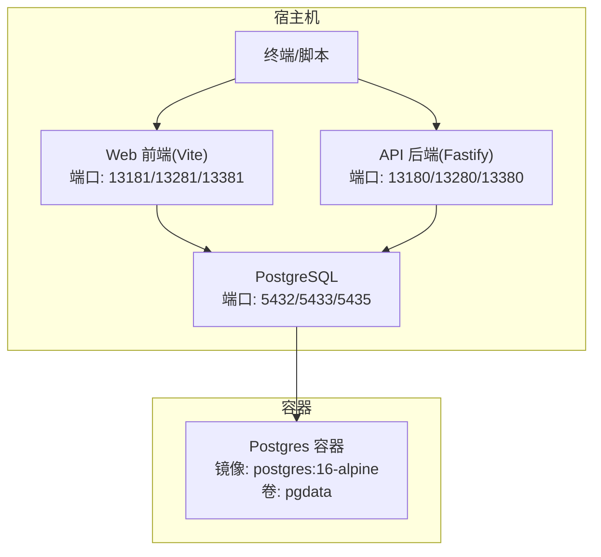
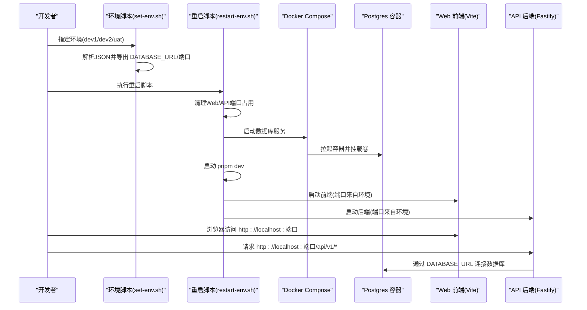
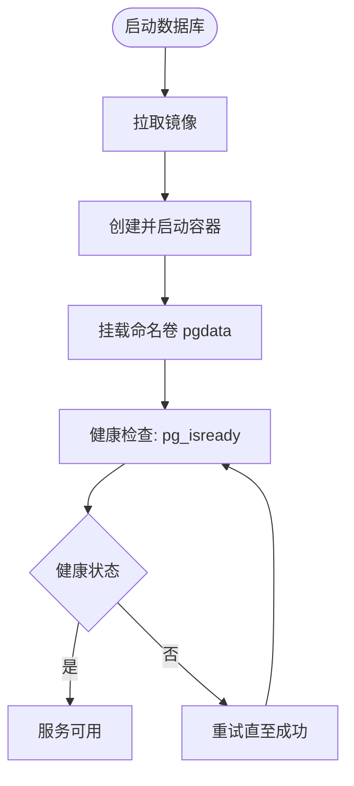
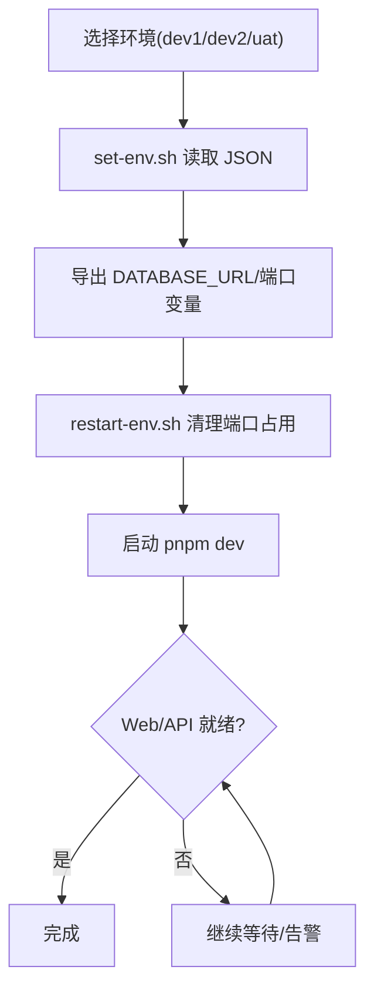
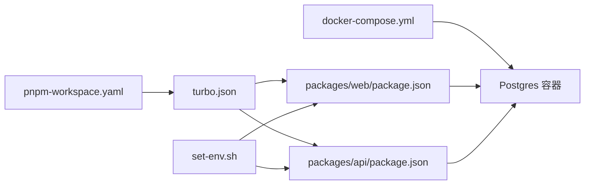

# Docker Compose编排

<cite>
**本文引用的文件**
- [docker-compose.yml](file://workspace/dev/docker-compose.yml)
- [dev1.json](file://environments/dev1.json)
- [dev2.json](file://environments/dev2.json)
- [uat.json](file://environments/uat.json)
- [set-env.sh](file://environments/set-env.sh)
- [restart-env.sh](file://environments/restart-env.sh)
- [turbo.json](file://turbo.json)
- [pnpm-workspace.yaml](file://pnpm-workspace.yaml)
- [package.json](file://package.json)
- [packages/web/package.json](file://packages/web/package.json)
- [packages/api/package.json](file://packages/api/package.json)
</cite>

## 目录
1. [引言](#引言)
2. [项目结构](#项目结构)
3. [核心组件](#核心组件)
4. [架构总览](#架构总览)
5. [详细组件分析](#详细组件分析)
6. [依赖分析](#依赖分析)
7. [性能考虑](#性能考虑)
8. [故障排查指南](#故障排查指南)
9. [结论](#结论)
10. [附录](#附录)

## 引言
本文件面向AI原型管理系统，提供基于Docker Compose的编排说明，覆盖数据库服务的容器化、Web与API服务在宿主机上的运行方式、环境配置与端口映射、卷挂载与数据持久化、以及跨环境的配置管理与运维流程。文档同时结合项目内现有的环境脚本与工作空间配置，给出可落地的部署与运维建议。

## 项目结构
- 开发环境编排位于 workspace/dev/docker-compose.yml，当前仅包含PostgreSQL数据库服务。
- 环境配置位于 environments/，包含dev1.json、dev2.json、uat.json三份环境定义，分别描述Web/API端口、数据库连接信息及协议。
- 环境变量与端口管理通过 set-env.sh 脚本实现，restart-env.sh 则提供一键清理与启动流程。
- 项目采用 pnpm monorepo 结构，packages/web 与 packages/api 分别对应前端与后端工程；turbo.json 定义了开发任务与缓存策略。

图表来源
- [docker-compose.yml:1-20](file://workspace/dev/docker-compose.yml#L1-L20)
- [dev1.json:1-1](file://environments/dev1.json#L1-L1)
- [dev2.json:1-1](file://environments/dev2.json#L1-L1)
- [uat.json:1-1](file://environments/uat.json#L1-L1)

章节来源
- [docker-compose.yml:1-20](file://workspace/dev/docker-compose.yml#L1-L20)
- [pnpm-workspace.yaml:1-3](file://pnpm-workspace.yaml#L1-L3)

## 核心组件
- 数据库服务(PostgreSQL)
  - 镜像版本: postgres:16-alpine
  - 端口映射: 宿主机5432映射至容器5432
  - 卷挂载: pgdata 持久化数据目录
  - 健康检查: 使用 pg_isready 进行周期性探测
- 环境配置
  - dev1/dev2/uat 三套环境，分别定义Web/API端口、数据库主机/库名/端口与协议
  - set-env.sh 读取环境JSON，生成 DATABASE_URL 并导出 WEB_PORT/API_PORT/DB_PORT
  - restart-env.sh 在清理端口占用后启动 pnpm dev，等待Web/API就绪

章节来源
- [docker-compose.yml:1-20](file://workspace/dev/docker-compose.yml#L1-L20)
- [dev1.json:1-1](file://environments/dev1.json#L1-L1)
- [dev2.json:1-1](file://environments/dev2.json#L1-L1)
- [uat.json:1-1](file://environments/uat.json#L1-L1)
- [set-env.sh:78-95](file://environments/set-env.sh#L78-L95)
- [restart-env.sh:50-55](file://environments/restart-env.sh#L50-L55)

## 架构总览
下图展示容器与宿主机之间的网络与端口关系，以及环境脚本如何影响服务启动与访问路径。

图表来源
- [set-env.sh:78-95](file://environments/set-env.sh#L78-L95)
- [restart-env.sh:50-55](file://environments/restart-env.sh#L50-L55)
- [docker-compose.yml:1-20](file://workspace/dev/docker-compose.yml#L1-L20)
- [dev1.json:1-1](file://environments/dev1.json#L1-L1)
- [dev2.json:1-1](file://environments/dev2.json#L1-L1)
- [uat.json:1-1](file://environments/uat.json#L1-L1)

## 详细组件分析

### 数据库服务(PostgreSQL)
- 服务定义
  - 镜像: postgres:16-alpine
  - 环境变量: 用户名、密码、数据库名
  - 端口映射: 5432:5432
  - 卷: pgdata 挂载至 /var/lib/postgresql/data
  - 健康检查: 使用 pg_isready 周期性探测
- 数据持久化
  - 通过命名卷 pgdata 实现容器重启后的数据保留
- 网络与通信
  - 默认桥接网络，容器可通过服务名访问
  - 当前未暴露额外端口，数据库连接由宿主机侧通过环境脚本提供的 DATABASE_URL 指向宿主机本地端口

图表来源
- [docker-compose.yml:1-20](file://workspace/dev/docker-compose.yml#L1-L20)

章节来源
- [docker-compose.yml:1-20](file://workspace/dev/docker-compose.yml#L1-L20)

### Web 前端服务
- 运行方式
  - 通过 pnpm dev 启动 Vite 开发服务器，端口由环境脚本导出的 WEB_PORT 控制
  - 项目采用 monorepo，前端工程位于 packages/web
- 端口与访问
  - dev1: 13181
  - dev2: 13281
  - uat: 13381
- 与后端协作
  - 前端通过代理或直接请求 API 服务，API 端口同样由环境脚本导出

章节来源
- [packages/web/package.json:1-1](file://packages/web/package.json#L1-L1)
- [dev1.json:1-1](file://environments/dev1.json#L1-L1)
- [dev2.json:1-1](file://environments/dev2.json#L1-L1)
- [uat.json:1-1](file://environments/uat.json#L1-L1)

### API 后端服务
- 运行方式
  - 通过 pnpm dev 启动 Fastify 应用，端口由 API_PORT 控制
  - 项目采用 monorepo，后端工程位于 packages/api
- 数据库连接
  - 通过 DATABASE_URL 连接数据库，该变量由 set-env.sh 基于环境JSON生成并导出
- 端口与访问
  - dev1: 13180
  - dev2: 13280
  - uat: 13380

章节来源
- [packages/api/package.json:1-1](file://packages/api/package.json#L1-L1)
- [set-env.sh:85-88](file://environments/set-env.sh#L85-L88)
- [dev1.json:1-1](file://environments/dev1.json#L1-L1)
- [dev2.json:1-1](file://environments/dev2.json#L1-L1)
- [uat.json:1-1](file://environments/uat.json#L1-L1)

### 环境配置与脚本
- 环境JSON
  - dev1.json/dev2.json/uat.json 提供端口、URL、数据库连接信息
- set-env.sh
  - 读取环境JSON，解析 db/web/api 端口与数据库名，构造 DATABASE_URL
  - 导出 DATABASE_URL、WEB_PORT、API_PORT、DB_PORT，并更新 .active
- restart-env.sh
  - 通过 set-env.sh 激活环境
  - 清理Web/API端口占用进程
  - 启动 pnpm dev 并轮询等待 Web/API 就绪

图表来源
- [set-env.sh:78-95](file://environments/set-env.sh#L78-L95)
- [restart-env.sh:119-147](file://environments/restart-env.sh#L119-L147)

章节来源
- [set-env.sh:78-95](file://environments/set-env.sh#L78-L95)
- [restart-env.sh:50-55](file://environments/restart-env.sh#L50-L55)

## 依赖分析
- Monorepo 结构
  - pnpm-workspace.yaml 指定 packages/* 为工作区包
  - turbo.json 定义 dev 任务持久化并注入 WEB_PORT/API_PORT/DATABASE_URL 环境变量
- 组件耦合
  - Web/API 依赖 DATABASE_URL 连接数据库
  - 环境脚本为 Web/API 提供统一的端口与连接信息
  - Docker Compose 仅负责数据库服务，Web/API 在宿主机运行

图表来源
- [pnpm-workspace.yaml:1-3](file://pnpm-workspace.yaml#L1-L3)
- [turbo.json:1-1](file://turbo.json#L1-L1)
- [packages/web/package.json:1-1](file://packages/web/package.json#L1-L1)
- [packages/api/package.json:1-1](file://packages/api/package.json#L1-L1)
- [set-env.sh:85-88](file://environments/set-env.sh#L85-L88)
- [docker-compose.yml:1-20](file://workspace/dev/docker-compose.yml#L1-L20)

章节来源
- [pnpm-workspace.yaml:1-3](file://pnpm-workspace.yaml#L1-L3)
- [turbo.json:1-1](file://turbo.json#L1-L1)

## 性能考虑
- 开发阶段
  - Web/API 使用 pnpm dev，turbo.json 中 dev 任务 cache=false 以保证实时更新
  - 建议在本地磁盘挂载卷时避免不必要的文件同步开销
- 数据库
  - 使用 alpine 镜像减小体积，注意I/O性能与日志级别
  - 健康检查间隔较短，有助于快速发现异常
- 端口与并发
  - 多环境并行开发时，确保端口不冲突（dev1/dev2/uat 端口已分离）

## 故障排查指南
- 端口占用
  - 使用 restart-env.sh 自动清理Web/API端口占用，若仍被占用，按脚本提示进行手动处理
- 数据库不可达
  - 确认 DATABASE_URL 与数据库端口一致，检查容器健康状态
  - 如需重置数据，删除命名卷后重建容器（注意数据丢失风险）
- Web/API 未就绪
  - 观察 restart-env.sh 输出，必要时延长等待时间或检查本地防火墙
- 环境切换
  - 使用 set-env.sh 指定环境并导出变量，再执行 restart-env.sh 启动服务

章节来源
- [restart-env.sh:61-95](file://environments/restart-env.sh#L61-L95)
- [docker-compose.yml:12-16](file://workspace/dev/docker-compose.yml#L12-L16)

## 结论
本编排以最小化容器化为目标，将数据库服务容器化，Web/API 服务保留在宿主机以便开发调试。通过环境脚本统一管理端口与数据库连接，配合 pnpm monorepo 与 turbo 缓存策略，形成高效、可扩展的本地开发体验。后续可根据团队规范引入更多服务（如缓存、消息队列）并完善密钥与配置管理。

## 附录

### 环境配置文件说明
- dev1.json
  - 描述: 日常开发默认环境
  - Web 端口: 13181
  - API 端口: 13180
  - 数据库: localhost:5432, 数据库名 apm_dev1
- dev2.json
  - 描述: 隔离测试环境
  - Web 端口: 13281
  - API 端口: 13280
  - 数据库: localhost:5433, 数据库名 apm_dev2
- uat.json
  - 描述: 用户验收环境
  - Web 端口: 13381
  - API 端口: 13380
  - 数据库: localhost:5435, 数据库名 apm_uat

章节来源
- [dev1.json:1-1](file://environments/dev1.json#L1-L1)
- [dev2.json:1-1](file://environments/dev2.json#L1-L1)
- [uat.json:1-1](file://environments/uat.json#L1-L1)

### 环境变量与密钥管理策略
- 环境变量
  - set-env.sh 从环境JSON读取端口与数据库信息，构造 DATABASE_URL 并导出
  - 通过 source 方式在当前shell生效，避免子shell变量不可见问题
- 密钥管理
  - 建议将敏感信息（如数据库密码）移出JSON，改用系统环境变量或密钥管理服务
  - 在CI/CD中使用加密的密文与解密流程，避免明文存储

章节来源
- [set-env.sh:78-95](file://environments/set-env.sh#L78-L95)

### 卷挂载与数据持久化
- 数据库卷
  - 使用命名卷 pgdata，路径映射至容器内数据目录
  - 容器重启后数据保持，便于开发迭代
- 代码挂载
  - Web/API 在宿主机运行，无需容器内代码挂载
  - 若需容器内开发，可在 compose 中添加卷映射，但需注意文件权限与同步开销

章节来源
- [docker-compose.yml:10-11](file://workspace/dev/docker-compose.yml#L10-L11)

### 部署命令与运维操作
- 启动数据库
  - 在 workspace/dev 目录执行 docker compose up -d
- 启动Web/API
  - 在项目根目录执行 source environments/set-env.sh <env> 后，执行 ./environments/restart-env.sh <env>
- 停止服务
  - Ctrl+C 或 kill -- -$DEV_PID（由 restart-env.sh 输出）
- 重启服务
  - 先清理端口占用，再启动 pnpm dev，等待服务就绪

章节来源
- [docker-compose.yml:1-20](file://workspace/dev/docker-compose.yml#L1-L20)
- [restart-env.sh:101-117](file://environments/restart-env.sh#L101-L117)