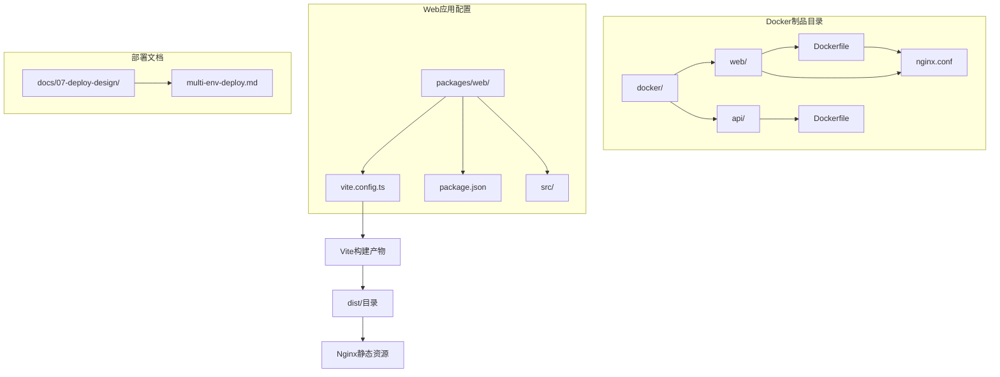
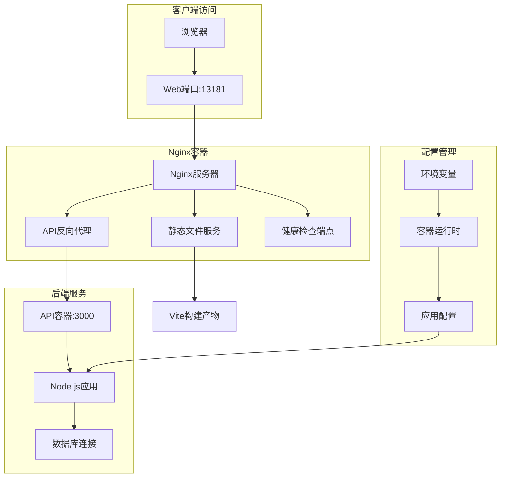
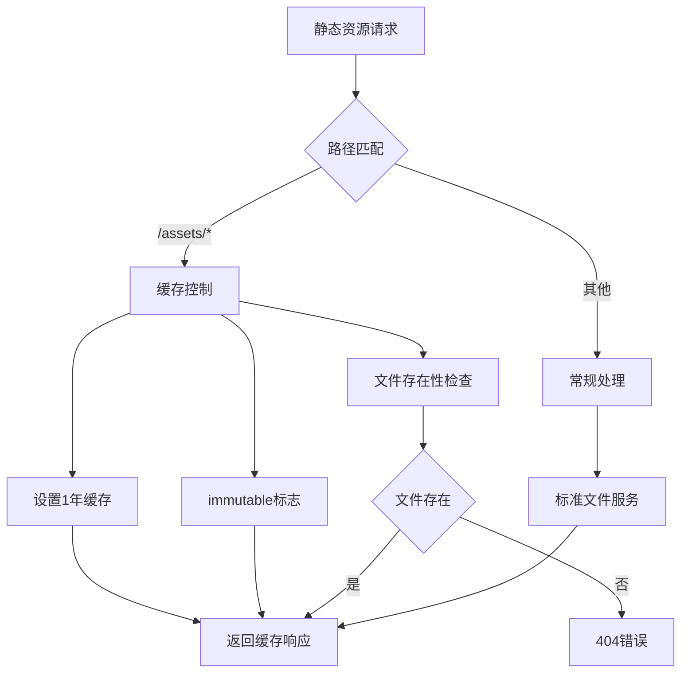
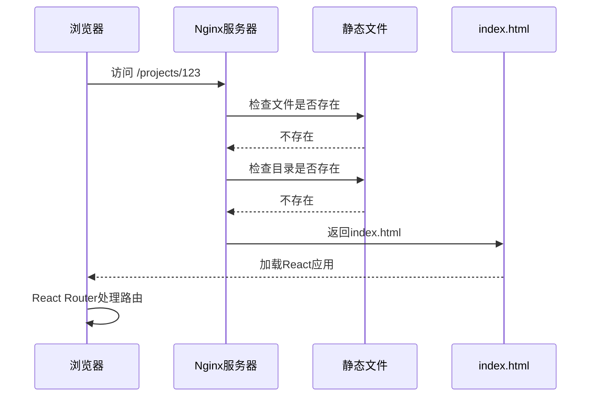
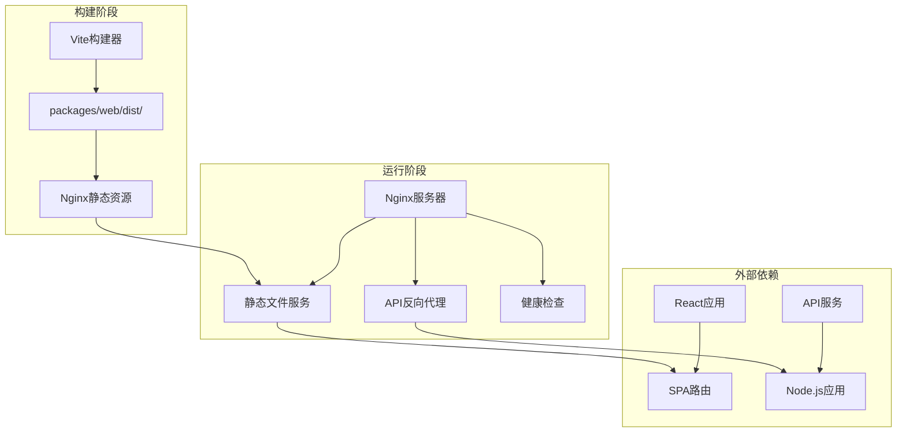

# Web容器配置

<cite>
**本文档引用的文件**
- [multi-env-deploy.md](file://docs/07-deploy-design/multi-env-deploy.md)
- [vite.config.ts](file://packages/web/vite.config.ts)
- [package.json](file://packages/web/package.json)
</cite>

## 目录
1. [简介](#简介)
2. [项目结构](#项目结构)
3. [核心组件](#核心组件)
4. [架构概览](#架构概览)
5. [详细组件分析](#详细组件分析)
6. [依赖关系分析](#依赖关系分析)
7. [性能考虑](#性能考虑)
8. [故障排除指南](#故障排除指南)
9. [结论](#结论)
10. [附录](#附录)

## 简介

AI原型管理系统Web容器采用Nginx作为轻量级Web服务器，通过多阶段Docker构建实现极小的镜像体积（约25MB）。该容器负责提供SPA静态资源服务、API反向代理以及健康检查功能。系统采用nginx.conf配置文件实现SPA路由回退机制、静态文件缓存优化和Gzip压缩等核心功能。

## 项目结构

Web容器相关的核心文件组织如下：



**图表来源**
- [multi-env-deploy.md: 229-249:229-249](file://docs/07-deploy-design/multi-env-deploy.md#L229-L249)

**章节来源**
- [multi-env-deploy.md: 229-249:229-249](file://docs/07-deploy-design/multi-env-deploy.md#L229-L249)

## 核心组件

### 多阶段构建策略

Web容器采用两阶段构建模式实现最小化镜像：

**第一阶段（构建器）**：基于node:20-alpine，执行以下操作
- 复制pnpm锁定文件和包配置
- 安装生产依赖（--frozen-lockfile）
- 复制源代码（shared、validation-schemas、web包）
- 执行Vite构建，输出到packages/web/dist/

**第二阶段（运行器）**：基于nginx:alpine，执行以下操作
- 复制自定义nginx.conf配置
- 复制第一阶段的构建产物到/usr/share/nginx/html
- 最终镜像大小约25MB

**章节来源**
- [multi-env-deploy.md: 193-205:193-205](file://docs/07-deploy-design/multi-env-deploy.md#L193-L205)

### Nginx配置文件详解

nginx.conf文件包含以下关键配置模块：

**基础服务器配置**
- 监听80端口
- 设置根目录为/usr/share/nginx/html
- 默认索引文件为index.html

**Gzip压缩配置**
- 启用gzip压缩
- 支持文本类型：text/plain、text/css、application/json、application/javascript、text/xml
- 最小压缩字节：256字节

**API反向代理**
- 路径前缀：/api/
- 目标地址：http://api:3000
- 设置必要的HTTP头部信息
- 配置超时参数

**健康检查端点**
- 路径：/health
- 返回状态码200
- 禁用访问日志记录

**静态资源缓存**
- 路径前缀：/assets/
- 缓存时间：1年
- Cache-Control头：public, immutable
- 文件存在性检查

**SPA路由回退**
- 根路径：/
- 使用try_files指令实现路由回退到index.html

**章节来源**
- [multi-env-deploy.md: 255-300:255-300](file://docs/07-deploy-design/multi-env-deploy.md#L255-L300)

### Vite构建配置

Vite配置中的关键设置：

**基础路径配置**
- base: './' - 使用相对路径而非绝对路径
- 原因：支持在任意路径下部署SPA应用
- 开发服务器不受影响，仍使用Vite的HMR功能

**构建产物特性**
- Vite构建产物包含content-hash文件名
- 例如：index-abc123.js格式
- 由于文件名包含哈希值，文件内容永不改变

**章节来源**
- [multi-env-deploy.md: 177-183:177-183](file://docs/07-deploy-design/multi-env-deploy.md#L177-L183)

## 架构概览

Web容器的整体架构设计体现了"单一入口点"原则：



**图表来源**
- [multi-env-deploy.md: 75-82:75-82](file://docs/07-deploy-design/multi-env-deploy.md#L75-L82)

**章节来源**
- [multi-env-deploy.md: 75-82:75-82](file://docs/07-deploy-design/multi-env-deploy.md#L75-L82)

## 详细组件分析

### Nginx配置组件分析

#### 静态资源优化组件



**图表来源**
- [multi-env-deploy.md: 288-293:288-293](file://docs/07-deploy-design/multi-env-deploy.md#L288-L293)

#### SPA路由回退机制



**图表来源**
- [multi-env-deploy.md: 295-299:295-299](file://docs/07-deploy-design/multi-env-deploy.md#L295-L299)

**章节来源**
- [multi-env-deploy.md: 295-299:295-299](file://docs/07-deploy-design/multi-env-deploy.md#L295-L299)

### Vite构建优化策略

#### 文件命名优化

Vite构建系统采用content-hash文件名策略：

| 文件类型 | 示例 | 特性 |
|---------|------|------|
| JavaScript | index-abc123.js | 哈希值确保唯一性 |
| CSS | styles-def456.css | 内容变化自动更新哈希 |
| 图片 | logo-789ghi.png | 永远不变的缓存策略 |

#### 资源路径优化

```mermaid
graph LR
subgraph "开发环境"
A[base: '/'] --> B[绝对路径]
B --> C[/assets/index.js]
end
subgraph "生产环境"
D[base: './'] --> E[相对路径]
E --> F[./assets/index.js]
end
subgraph "部署场景"
G[根路径部署] --> H[./assets/index.js]
I[子路径部署] --> J[./assets/index.js]
end
```

**图表来源**
- [multi-env-deploy.md: 177-183:177-183](file://docs/07-deploy-design/multi-env-deploy.md#L177-L183)

**章节来源**
- [multi-env-deploy.md: 177-183:177-183](file://docs/07-deploy-design/multi-env-deploy.md#L177-L183)

## 依赖关系分析

### 组件间依赖关系



**图表来源**
- [multi-env-deploy.md: 193-205:193-205](file://docs/07-deploy-design/multi-env-deploy.md#L193-L205)

### 环境配置依赖

| 环境 | Web端口 | API端口 | 数据库端口 | 用途 |
|------|---------|---------|---------|------|
| dev1 | 13181 | 13180 | 5432 | 日常开发（默认） |
| dev2 | 13281 | 13280 | 5433 | 并行开发/测试隔离 |
| uat | 13381 | 13380 | 5435 | 用户验收测试 |

**章节来源**
- [multi-env-deploy.md: 86-92:86-92](file://docs/07-deploy-design/multi-env-deploy.md#L86-L92)

## 性能考虑

### 静态资源缓存策略

**长期缓存优势**
- Vite构建产物的content-hash文件名确保文件内容永不改变
- /assets/路径下的资源设置1年缓存期
- immutable标志允许客户端永久缓存
- 显著减少带宽消耗和加载时间

**Gzip压缩效果**
- 对常见文本类型启用压缩
- 最小压缩阈值256字节，避免对小文件的无效压缩
- 减少传输数据量，提升加载速度

### SPA路由性能

**路由回退机制**
- try_files指令实现高效的文件存在性检查
- 避免不必要的重定向循环
- 支持深层嵌套路由的快速响应

## 故障排除指南

### 常见问题诊断

**静态资源404错误**
- 检查Vite构建是否成功完成
- 验证dist目录中文件是否存在
- 确认Nginx配置中的root路径正确

**API代理失败**
- 检查API容器是否正常运行
- 验证Docker网络连接
- 确认反向代理目标地址配置

**SPA路由问题**
- 确认base配置为'./'
- 检查React Router配置
- 验证nginx.conf中的try_files指令

**健康检查失败**
- 检查/health端点配置
- 验证Nginx进程状态
- 确认端口映射正确

### 日志管理策略

**访问日志**
- 除/health端点外，所有请求都有访问日志
- 日志格式标准化，便于分析
- 建议配置日志轮转策略

**错误日志**
- Nginx错误日志记录所有异常
- API代理错误单独记录
- 建议配置告警通知

**章节来源**
- [multi-env-deploy.md: 281-286:281-286](file://docs/07-deploy-design/multi-env-deploy.md#L281-L286)

## 结论

AI原型管理系统Web容器通过精心设计的多阶段构建和Nginx配置，实现了高性能、低资源占用的静态资源服务。其核心优势包括：

1. **极小镜像体积**：约25MB，显著降低部署成本
2. **智能缓存策略**：利用Vite构建产物的content-hash特性实现长期缓存
3. **完整的SPA支持**：通过路由回退机制完美支持前端路由
4. **生产就绪特性**：包含健康检查、Gzip压缩和安全配置

该配置方案为现代Web应用提供了可靠的容器化解决方案，既保证了性能又简化了运维复杂度。

## 附录

### 构建和运行命令

**构建命令**
```bash
# 基于Docker Compose构建
docker compose -p apm-dev1 -f docker/docker-compose.yml -f docker/docker-compose.dev1.yml build

# 验证配置语法
docker compose -p apm-dev1 -f docker/docker-compose.yml -f docker/docker-compose.dev1.yml config
```

**运行参数**
- 端口映射：Web端口13181（dev1环境）
- 环境变量：通过docker-compose文件注入
- 卷挂载：开发环境支持代码热更新

**章节来源**
- [multi-env-deploy.md: 628-629:628-629](file://docs/07-deploy-design/multi-env-deploy.md#L628-L629)