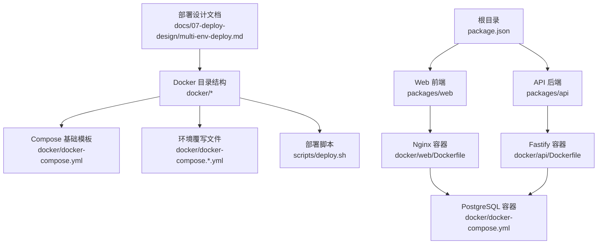
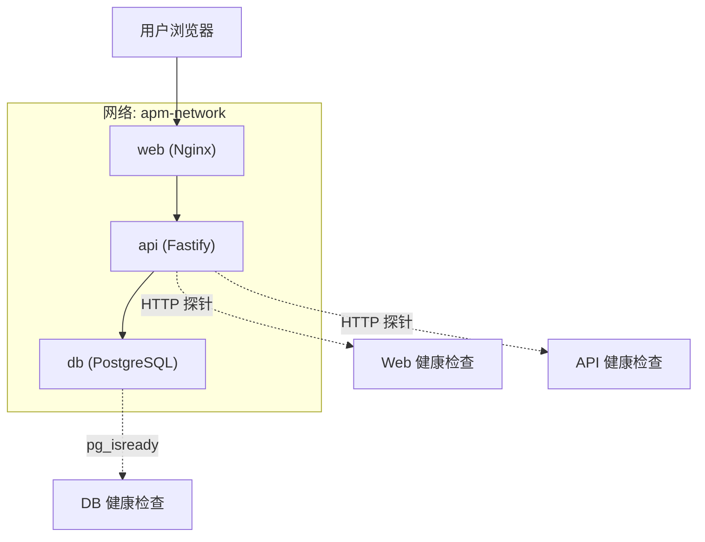
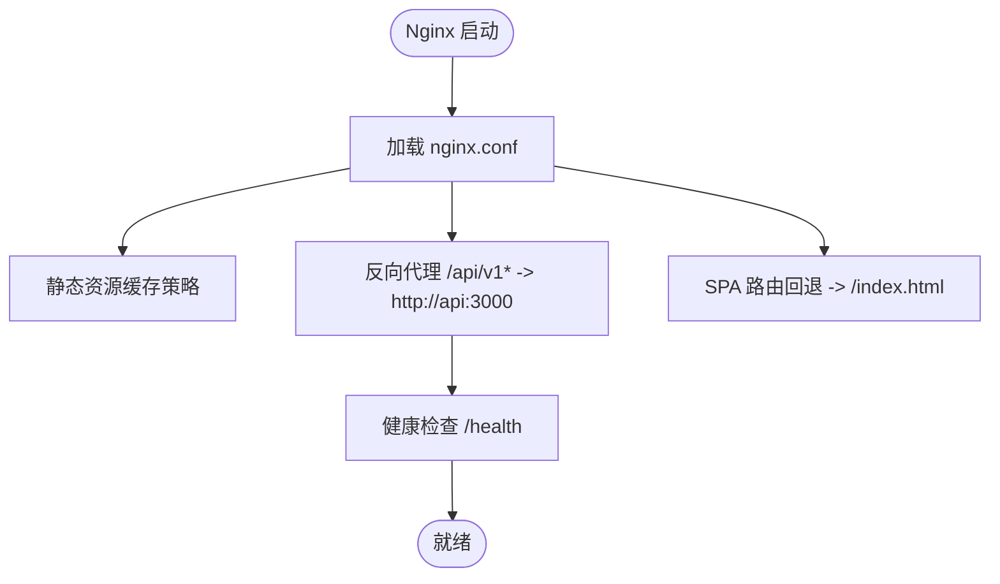
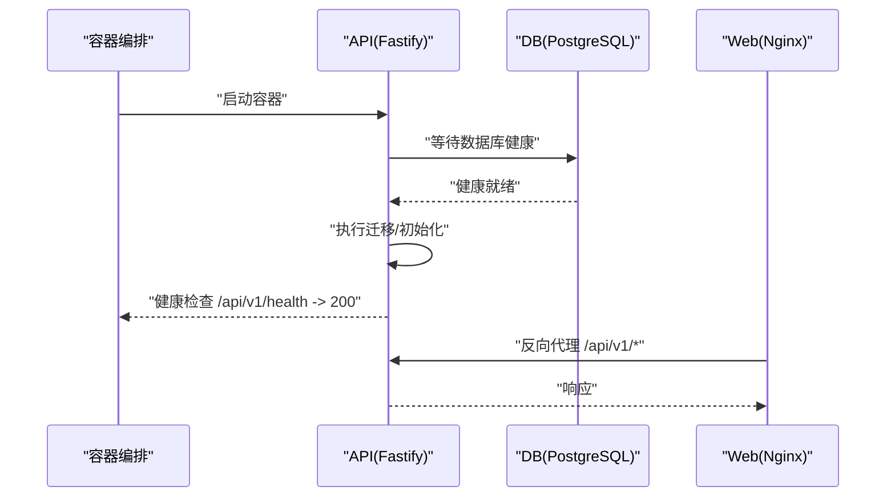
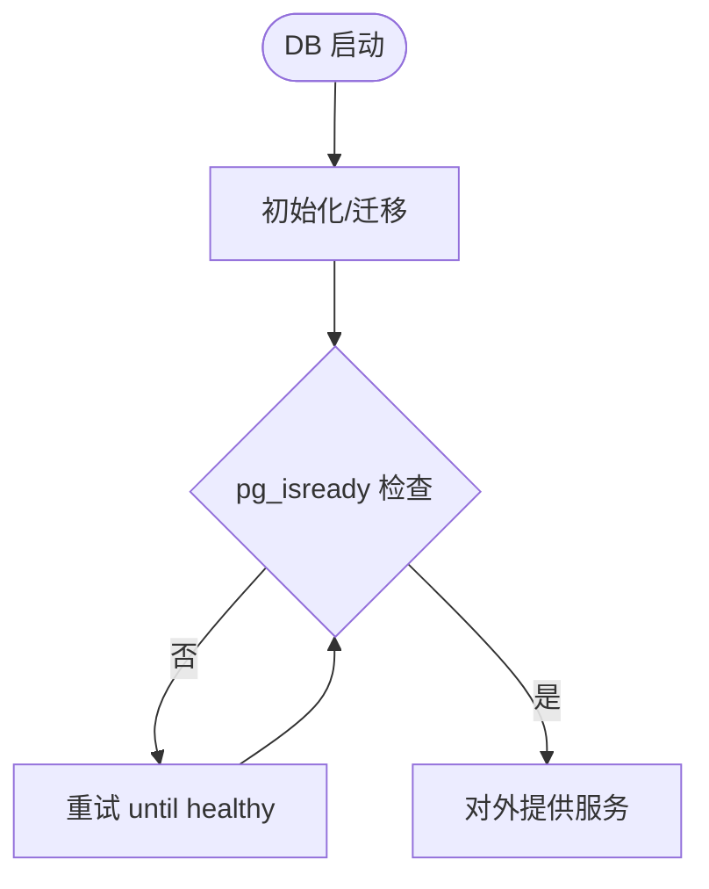
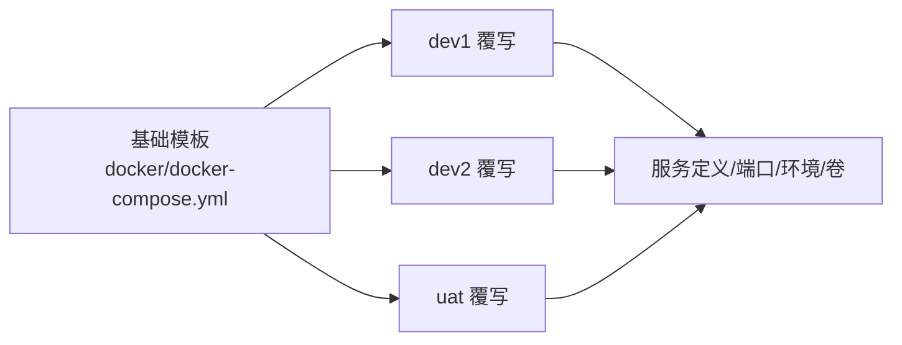
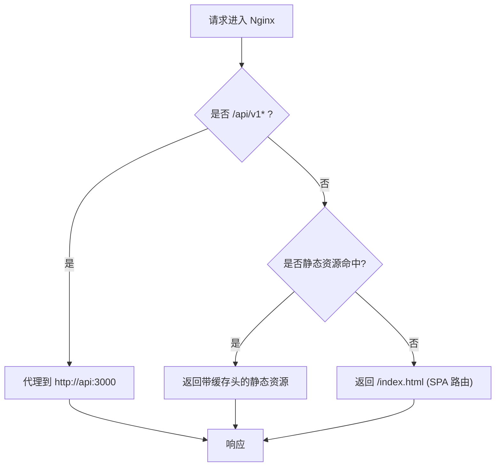
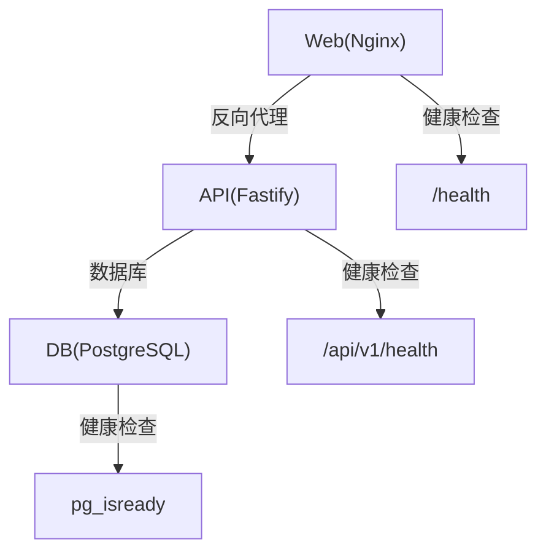

# 容器化部署

<cite>
**本文引用的文件**
- [multi-env-deploy.md](file://docs/07-deploy-design/multi-env-deploy.md)
- [docker-compose.yml](file://workspace/dev/docker-compose.yml)
- [package.json](file://package.json)
- [packages/api/package.json](file://packages/api/package.json)
- [packages/web/vite.config.ts](file://packages/web/vite.config.ts)
- [packages/api/src/app.ts](file://packages/api/src/app.ts)
</cite>

## 目录
1. [简介](#简介)
2. [项目结构](#项目结构)
3. [核心组件](#核心组件)
4. [架构总览](#架构总览)
5. [详细组件分析](#详细组件分析)
6. [依赖关系分析](#依赖关系分析)
7. [性能考虑](#性能考虑)
8. [故障排除指南](#故障排除指南)
9. [结论](#结论)
10. [附录](#附录)

## 简介
本文件面向AI原型管理系统（APM）的容器化部署，系统采用“Web前端（Nginx）+ API后端（Fastify）+ 数据库（PostgreSQL）”三层容器架构，通过Docker Compose进行编排，并基于多环境覆写文件实现开发、测试与UAT环境的隔离与复用。文档涵盖容器化架构设计、多阶段构建与镜像优化、Compose编排配置、Nginx反向代理与SPA路由回退、容器间通信与健康检查、操作指南、故障排除与性能优化建议。

## 项目结构
- 顶层目录包含统一的包管理与任务编排入口，便于在容器内执行构建与开发流程。
- 部署设计文档集中于docs/07-deploy-design，定义了docker目录结构、Compose基础模板与环境覆写文件、以及部署CLI脚本。
- Web前端（packages/web）与API后端（packages/api）分别对应Nginx与Fastify容器镜像的构建目标。
- 环境配置位于workspace/dev/docker-compose.yml，用于本地开发与演示。

**章节来源**
- [multi-env-deploy.md: 229-312:229-312](file://docs/07-deploy-design/multi-env-deploy.md#L229-L312)
- [multi-env-deploy.md: 312-468:312-468](file://docs/07-deploy-design/multi-env-deploy.md#L312-L468)
- [package.json: 1-2:1-2](file://package.json#L1-L2)

## 核心组件
- Web前端（Nginx）：负责静态资源分发、SPA路由回退至index.html、以及对后端API的反向代理。
- API后端（Fastify）：提供REST接口、健康检查端点、优雅关闭处理、数据库迁移与连接。
- 数据库（PostgreSQL）：持久化存储，按环境分离数据库实例与数据卷，确保隔离性与可恢复性。
- Compose编排：通过基础模板与环境覆写文件组合，实现端口映射、环境变量注入、卷挂载与网络隔离。
- 部署CLI：封装构建、启动、停止、状态查询与日志查看等常用操作，支持多环境并行运行。

**章节来源**
- [multi-env-deploy.md: 312-374:312-374](file://docs/07-deploy-design/multi-env-deploy.md#L312-L374)
- [multi-env-deploy.md: 378-468:378-468](file://docs/07-deploy-design/multi-env-deploy.md#L378-L468)
- [multi-env-deploy.md: 470-498:470-498](file://docs/07-deploy-design/multi-env-deploy.md#L470-L498)

## 架构总览
下图展示了容器化架构与服务交互关系：Web容器依赖API容器健康就绪后启动；API容器依赖数据库容器健康就绪后启动；Web容器通过Nginx反向代理访问API；三者均加入同一bridge网络以实现内部DNS解析与通信。

**图表来源**
- [multi-env-deploy.md: 312-374:312-374](file://docs/07-deploy-design/multi-env-deploy.md#L312-L374)

**章节来源**
- [multi-env-deploy.md: 312-374:312-374](file://docs/07-deploy-design/multi-env-deploy.md#L312-L374)

## 详细组件分析

### Web前端（Nginx）容器
- 多阶段构建：第一阶段用于构建Vite产物，第二阶段将产物复制到Nginx运行时镜像，减少最终镜像体积。
- Nginx配置要点：
  - 对静态资源设置不可变缓存头，提升CDN与浏览器缓存命中率。
  - 对SPA路由启用回退至index.html，支持React Router等客户端路由。
  - 反向代理将/api/v1*请求转发至api服务（Docker内部DNS主机名为api）。
  - 健康检查通过访问容器内/health端点实现。
- 与API通信：通过Docker Compose内部网络，使用服务名作为主机名进行解析。
- 与数据库：不直接访问数据库，仅代理API请求。

**图表来源**
- [multi-env-deploy.md: 303-312:303-312](file://docs/07-deploy-design/multi-env-deploy.md#L303-L312)

**章节来源**
- [multi-env-deploy.md: 303-312:303-312](file://docs/07-deploy-design/multi-env-deploy.md#L303-L312)
- [multi-env-deploy.md: 312-337:312-337](file://docs/07-deploy-design/multi-env-deploy.md#L312-L337)

### API后端（Fastify）容器
- 多阶段构建：第一阶段安装依赖并构建TypeScript源码，第二阶段仅复制运行时产物，降低镜像体积与攻击面。
- 健康检查：提供/api/v1/health端点，供Docker健康检查与外部探针使用。
- 优雅关闭：注册SIGTERM/SIGINT信号处理器，确保容器停止时完成收尾。
- 数据库连接：通过DATABASE_URL环境变量连接PostgreSQL，支持不同环境的数据库实例与凭据。
- 与Web通信：通过反向代理暴露给外部用户；内部通过服务名与Web容器通信。
- 与数据库通信：通过Docker内部网络访问db服务。

**图表来源**
- [multi-env-deploy.md: 338-354:338-354](file://docs/07-deploy-design/multi-env-deploy.md#L338-L354)

**章节来源**
- [multi-env-deploy.md: 338-354:338-354](file://docs/07-deploy-design/multi-env-deploy.md#L338-L354)
- [packages/api/src/app.ts: 1-200:1-200](file://packages/api/src/app.ts#L1-L200)

### 数据库（PostgreSQL）容器
- 使用postgres:16-alpine官方镜像，体积小且维护成本低。
- 健康检查使用pg_isready命令轮询数据库可用性。
- 每个环境独立的数据库名与数据卷，避免数据污染。
- 通过Docker内部网络暴露5432端口给API容器。

**图表来源**
- [multi-env-deploy.md: 356-370:356-370](file://docs/07-deploy-design/multi-env-deploy.md#L356-L370)

**章节来源**
- [multi-env-deploy.md: 356-370:356-370](file://docs/07-deploy-design/multi-env-deploy.md#L356-L370)

### Docker Compose编排配置
- 基础模板（docker/docker-compose.yml）：
  - 定义web、api、db三个服务及其健康检查。
  - 服务间通过apm-network桥接网络通信。
  - web依赖api健康，api依赖db健康。
- 环境覆写文件（docker/docker-compose.dev1.yml、dev2.yml、uat.yml）：
  - 分别覆盖端口映射、环境变量（如DATABASE_URL）、卷挂载（pgdata-*）。
  - 保证不同环境互不干扰，支持并行运行。
- 项目命名与隔离：
  - 通过-p apm-<env>区分不同compose项目，实现完全隔离。

**图表来源**
- [multi-env-deploy.md: 312-374:312-374](file://docs/07-deploy-design/multi-env-deploy.md#L312-L374)
- [multi-env-deploy.md: 378-468:378-468](file://docs/07-deploy-design/multi-env-deploy.md#L378-L468)

**章节来源**
- [multi-env-deploy.md: 312-374:312-374](file://docs/07-deploy-design/multi-env-deploy.md#L312-L374)
- [multi-env-deploy.md: 378-468:378-468](file://docs/07-deploy-design/multi-env-deploy.md#L378-L468)

### Nginx反向代理与SPA路由回退
- 反向代理规则：将/api/v1*请求转发至api:3000，利用Docker内部DNS解析服务名。
- SPA路由回退：对未匹配的静态资源返回/index.html，使前端路由接管。
- 缓存策略：对带content-hash的静态资源设置不可变缓存，减少带宽与延迟。
- 健康检查：/health端点用于容器健康探测。

**图表来源**
- [multi-env-deploy.md: 303-312:303-312](file://docs/07-deploy-design/multi-env-deploy.md#L303-L312)

**章节来源**
- [multi-env-deploy.md: 303-312:303-312](file://docs/07-deploy-design/multi-env-deploy.md#L303-L312)

### 多阶段构建与镜像优化
- Web前端（Nginx）：
  - 第一阶段：使用构建工具生成静态产物。
  - 第二阶段：仅复制产物到Nginx运行时镜像，移除构建依赖与源码。
- API后端（Fastify）：
  - 第一阶段：安装依赖并编译TS源码。
  - 第二阶段：仅复制dist运行时产物，避免运行时镜像携带开发依赖。
- 其他优化：
  - 使用Alpine基础镜像降低体积。
  - 非root用户运行（在Dockerfile中体现）。
  - 最小化层与清理缓存。

**章节来源**
- [multi-env-deploy.md: 601-603:601-603](file://docs/07-deploy-design/multi-env-deploy.md#L601-L603)

### 容器间通信与健康检查
- 通信机制：
  - 所有服务加入apm-network，内部通过服务名（web、api、db）解析。
  - Web容器通过api:3000访问后端API。
- 健康检查：
  - Web：curl探测容器内/health。
  - API：curl探测/api/v1/health。
  - DB：pg_isready轮询。
- 启动顺序：
  - web依赖api健康。
  - api依赖db健康。

**章节来源**
- [multi-env-deploy.md: 312-354:312-354](file://docs/07-deploy-design/multi-env-deploy.md#L312-L354)

## 依赖关系分析
- 组件耦合：
  - Web对API存在强依赖（反向代理）。
  - API对DB存在强依赖（数据访问）。
- 外部依赖：
  - PostgreSQL官方镜像。
  - Nginx运行时镜像。
- 环境隔离：
  - 不同环境通过独立数据库名与数据卷实现隔离。
  - 通过compose项目前缀实现网络与资源隔离。

**图表来源**
- [multi-env-deploy.md: 312-370:312-370](file://docs/07-deploy-design/multi-env-deploy.md#L312-L370)

**章节来源**
- [multi-env-deploy.md: 312-374:312-374](file://docs/07-deploy-design/multi-env-deploy.md#L312-L374)

## 性能考虑
- 镜像体积与启动速度：
  - 多阶段构建显著减小最终镜像体积，缩短拉取与启动时间。
  - Alpine基础镜像进一步降低体积与攻击面。
- 静态资源缓存：
  - 带content-hash的文件名天然适合长期缓存，结合immutable头可最大化缓存命中。
- 网络与I/O：
  - 将数据库数据持久化到独立卷，避免容器重启导致的数据丢失与重建开销。
- 并发与隔离：
  - 通过独立compose项目实现多环境并行运行，互不干扰。

**章节来源**
- [multi-env-deploy.md: 303-312:303-312](file://docs/07-deploy-design/multi-env-deploy.md#L303-L312)
- [multi-env-deploy.md: 601-603:601-603](file://docs/07-deploy-design/multi-env-deploy.md#L601-L603)

## 故障排除指南
- 容器无法启动或频繁重启：
  - 检查健康检查失败原因：web的/health、api的/api/v1/health、db的pg_isready。
  - 关注启动顺序：api必须在db健康后再启动；web必须在api健康后再启动。
- API无法连接数据库：
  - 校验DATABASE_URL格式与数据库实例名是否与环境覆写一致。
  - 确认db容器已创建并挂载了正确的数据卷。
- SPA路由404或刷新后空白页：
  - 确认Nginx配置中的SPA回退规则已启用。
  - 确认构建产物路径与nginx.conf中的root/alias一致。
- 端口冲突或访问异常：
  - 检查环境覆写文件中的端口映射是否与宿主机冲突。
  - 确认compose项目前缀（-p apm-<env>）未重复。
- 日志与诊断：
  - 使用部署CLI脚本status与logs动作快速定位问题。
  - 在容器内手动curl健康检查端点验证服务可用性。

**章节来源**
- [multi-env-deploy.md: 312-374:312-374](file://docs/07-deploy-design/multi-env-deploy.md#L312-L374)
- [multi-env-deploy.md: 470-498:470-498](file://docs/07-deploy-design/multi-env-deploy.md#L470-L498)

## 结论
该容器化方案以多阶段构建与最小化镜像为核心，结合Compose基础模板与环境覆写文件，实现了Web、API与数据库的清晰分层与高效编排。通过Nginx反向代理与SPA路由回退、完善的健康检查与启动顺序控制，系统具备良好的可维护性与可扩展性。配合部署CLI与环境隔离策略，能够满足开发、测试与UAT的多样化需求。

## 附录

### 操作指南（基于部署CLI）
- 构建并启动指定环境：
  - 示例：./scripts/deploy.sh dev1 up
- 同时启动多个环境（并行）：
  - 示例：./scripts/deploy.sh dev1 up 与 ./scripts/deploy.sh dev2 up
- 无缓存重建并重启：
  - 示例：./scripts/deploy.sh dev1 rebuild
- 查看服务状态与健康检查：
  - 示例：./scripts/deploy.sh dev1 status
- 查看日志：
  - 示例：./scripts/deploy.sh dev1 logs
- 停止并保留数据卷：
  - 示例：./scripts/deploy.sh dev1 down

**章节来源**
- [multi-env-deploy.md: 470-498:470-498](file://docs/07-deploy-design/multi-env-deploy.md#L470-L498)

### 关键文件与职责
- docker/docker-compose.yml：基础编排模板（服务定义、网络、健康检查）。
- docker/docker-compose.dev1.yml / dev2.yml / uat.yml：环境覆写（端口、数据库名、卷）。
- docker/web/Dockerfile：Web前端多阶段构建。
- docker/api/Dockerfile：API后端多阶段构建。
- docker/web/nginx.conf：Nginx配置（SPA回退、反代、缓存）。
- scripts/deploy.sh：部署CLI（up/down/rebuild/status/logs）。
- packages/api/src/app.ts：API应用入口（健康检查与优雅关闭）。
- packages/web/vite.config.ts：前端构建配置（base: './'）。

**章节来源**
- [multi-env-deploy.md: 229-312:229-312](file://docs/07-deploy-design/multi-env-deploy.md#L229-L312)
- [multi-env-deploy.md: 312-468:312-468](file://docs/07-deploy-design/multi-env-deploy.md#L312-L468)
- [packages/api/src/app.ts: 1-200:1-200](file://packages/api/src/app.ts#L1-L200)
- [packages/web/vite.config.ts: 1-200:1-200](file://packages/web/vite.config.ts#L1-L200)