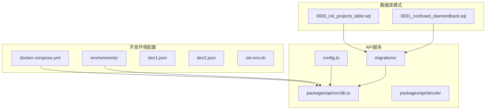
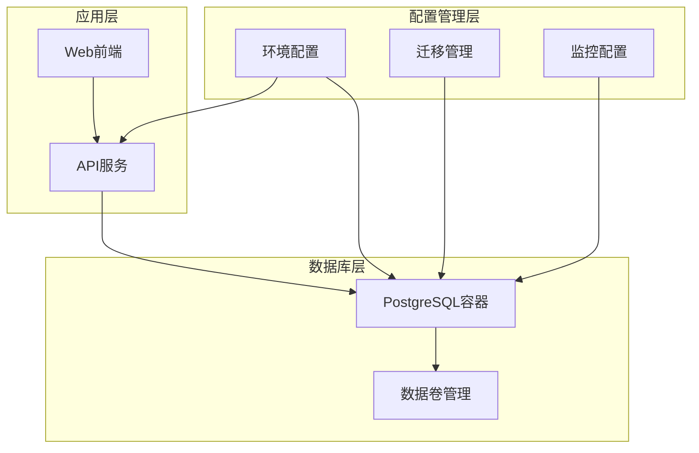
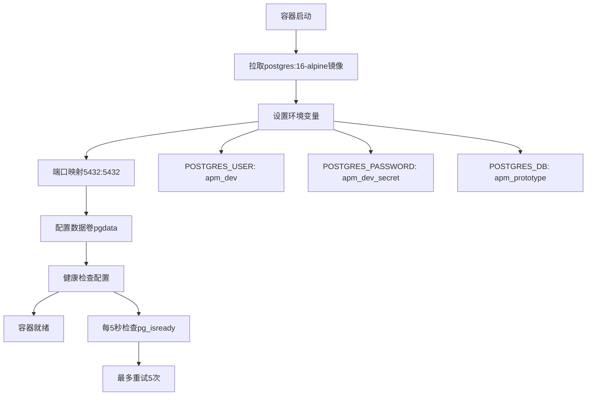
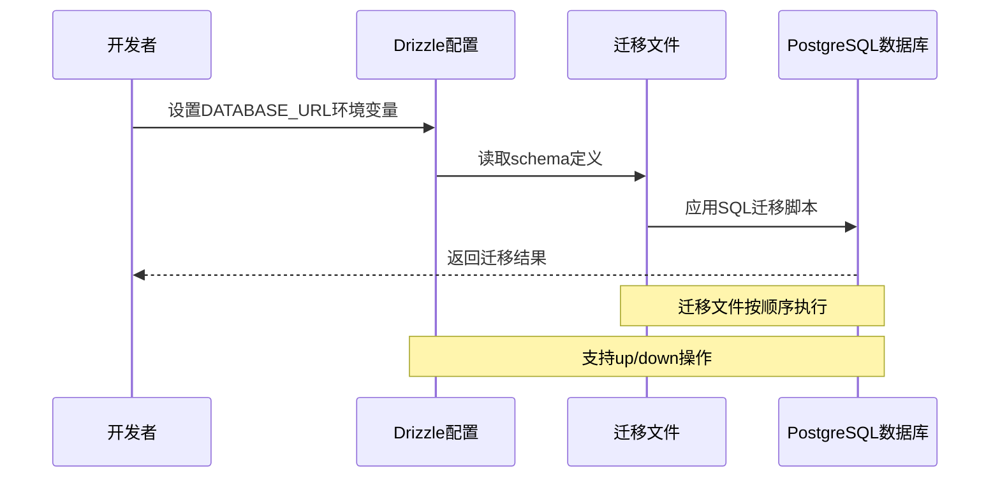
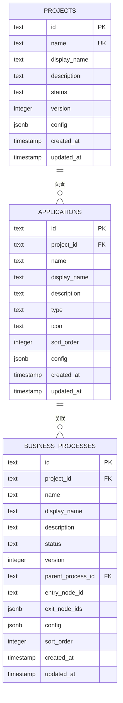
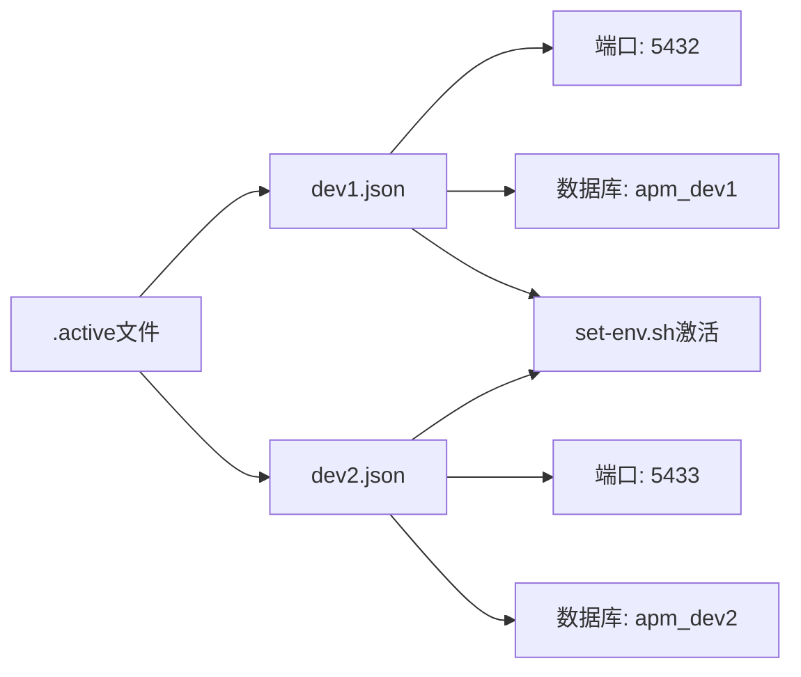
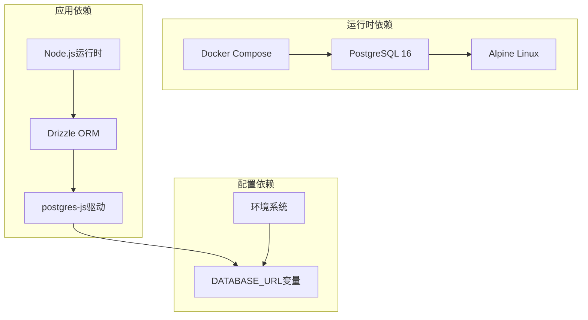
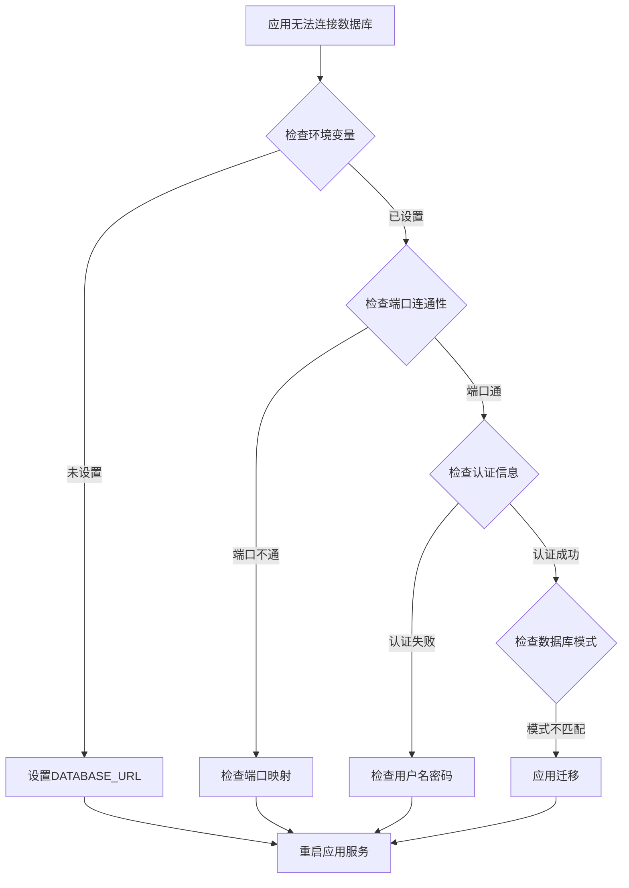
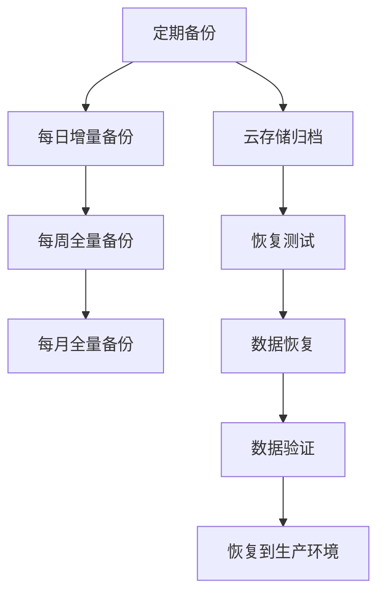

# 数据库容器配置

<cite>
**本文档引用的文件**
- [docker-compose.yml](file://workspace/dev/docker-compose.yml)
- [0000_init_projects_table.sql](file://packages/api/drizzle/migrations/0000_init_projects_table.sql)
- [0001_confused_diamondback.sql](file://packages/api/drizzle/migrations/0001_confused_diamondback.sql)
- [db.ts](file://packages/api/src/db.ts)
- [config.ts](file://packages/api/drizzle/config.ts)
- [dev1.json](file://environments/dev1.json)
- [dev2.json](file://environments/dev2.json)
- [README.md](file://environments/README.md)
- [AGENTS.md](file://AGENTS.md)
- [CLAUDE.md](file://CLAUDE.md)
</cite>

## 目录
1. [简介](#简介)
2. [项目结构](#项目结构)
3. [核心组件](#核心组件)
4. [架构概览](#架构概览)
5. [详细组件分析](#详细组件分析)
6. [依赖关系分析](#依赖关系分析)
7. [性能考虑](#性能考虑)
8. [故障排除指南](#故障排除指南)
9. [结论](#结论)
10. [附录](#附录)

## 简介

本文档为AI原型管理系统数据库容器创建详细的容器配置文档。该系统采用PostgreSQL作为主数据库，通过Docker Compose进行容器编排，使用Drizzle ORM进行数据库迁移和模型管理。本文档深入解释了PostgreSQL容器的Dockerfile构建和初始化过程，详细说明了数据库的配置参数，包括内存分配、连接数限制和字符集设置。同时提供了数据库模式初始化脚本和Drizzle ORM的迁移机制说明，以及数据库备份和恢复策略、性能监控和慢查询分析配置，最后包含数据持久化和卷管理的最佳实践。

## 项目结构

该项目采用多包架构，数据库相关的核心文件分布如下：

**图表来源**
- [docker-compose.yml:1-20](file://workspace/dev/docker-compose.yml#L1-L20)
- [db.ts:1-24](file://packages/api/src/db.ts#L1-L24)
- [config.ts:1-11](file://packages/api/drizzle/config.ts#L1-L11)

**章节来源**
- [docker-compose.yml:1-20](file://workspace/dev/docker-compose.yml#L1-L20)
- [db.ts:1-24](file://packages/api/src/db.ts#L1-L24)
- [config.ts:1-11](file://packages/api/drizzle/config.ts#L1-L11)

## 核心组件

### PostgreSQL容器配置

系统使用官方PostgreSQL 16 Alpine镜像，配置了基本的身份验证和网络映射：

- **基础镜像**: `postgres:16-alpine`
- **端口映射**: 主机5432端口映射到容器5432端口
- **数据卷**: 使用命名卷`pgdata`进行数据持久化
- **健康检查**: 每5秒检查一次数据库可用性

### 环境管理系统

系统实现了完整的环境管理机制，支持多环境隔离：

- **dev1环境**: 默认开发环境，数据库名为`apm_dev1`
- **dev2环境**: 隔离测试环境，数据库名为`apm_dev2`
- **端口分配**: 数据库端口按100间隔分配，避免冲突
- **环境激活**: 必须先激活环境再启动服务

**章节来源**
- [docker-compose.yml:1-20](file://workspace/dev/docker-compose.yml#L1-L20)
- [dev1.json:1-1](file://environments/dev1.json#L1-L1)
- [dev2.json:1-1](file://environments/dev2.json#L1-L1)
- [README.md:74-82](file://environments/README.md#L74-L82)

## 架构概览

系统采用分层架构设计，数据库容器作为基础设施层，为应用层提供数据存储服务：

**图表来源**
- [db.ts:1-24](file://packages/api/src/db.ts#L1-L24)
- [docker-compose.yml:1-20](file://workspace/dev/docker-compose.yml#L1-L20)

## 详细组件分析

### Docker Compose配置分析

PostgreSQL容器的Docker Compose配置简洁而完整，体现了最佳实践：

**图表来源**
- [docker-compose.yml:2-16](file://workspace/dev/docker-compose.yml#L2-L16)

关键配置说明：
- **身份验证**: 使用强密码认证，用户名为`apm_dev`
- **数据库名称**: 初始化时创建`apm_prototype`数据库
- **网络配置**: 容器内监听所有接口，主机端口5432映射
- **健康检查**: 使用`pg_isready`工具进行数据库可用性检查

**章节来源**
- [docker-compose.yml:1-20](file://workspace/dev/docker-compose.yml#L1-L20)

### Drizzle ORM迁移机制

系统使用Drizzle ORM进行数据库模式管理，采用版本化的迁移文件：

**图表来源**
- [config.ts:1-11](file://packages/api/drizzle/config.ts#L1-L11)
- [db.ts:1-24](file://packages/api/src/db.ts#L1-L24)

迁移文件结构分析：
- **初始迁移**: 创建`projects`表，包含项目基本信息
- **扩展迁移**: 创建业务实体相关表，如`applications`、`business_processes`等
- **外键约束**: 建立表间关系和引用完整性
- **索引优化**: 为常用查询字段建立索引

**章节来源**
- [config.ts:1-11](file://packages/api/drizzle/config.ts#L1-L11)
- [db.ts:1-24](file://packages/api/src/db.ts#L1-L24)
- [0000_init_projects_table.sql:1-13](file://packages/api/drizzle/migrations/0000_init_projects_table.sql#L1-L13)
- [0001_confused_diamondback.sql:1-319](file://packages/api/drizzle/migrations/0001_confused_diamondback.sql#L1-L319)

### 数据库模式初始化

系统采用渐进式模式初始化策略：

**图表来源**
- [0000_init_projects_table.sql:1-13](file://packages/api/drizzle/migrations/0000_init_projects_table.sql#L1-L13)
- [0001_confused_diamondback.sql:1-52](file://packages/api/drizzle/migrations/0001_confused_diamondback.sql#L1-L52)

**章节来源**
- [0000_init_projects_table.sql:1-13](file://packages/api/drizzle/migrations/0000_init_projects_table.sql#L1-L13)
- [0001_confused_diamondback.sql:1-319](file://packages/api/drizzle/migrations/0001_confused_diamondback.sql#L1-L319)

### 环境配置管理

系统实现了严格的环境管理机制，确保多环境隔离：

**图表来源**
- [dev1.json:1-1](file://environments/dev1.json#L1-L1)
- [dev2.json:1-1](file://environments/dev2.json#L1-L1)
- [README.md:74-82](file://environments/README.md#L74-L82)

**章节来源**
- [dev1.json:1-1](file://environments/dev1.json#L1-L1)
- [dev2.json:1-1](file://environments/dev2.json#L1-L1)
- [README.md:74-82](file://environments/README.md#L74-L82)

## 依赖关系分析

系统各组件间的依赖关系清晰明确：

**图表来源**
- [docker-compose.yml:1-20](file://workspace/dev/docker-compose.yml#L1-L20)
- [db.ts:1-24](file://packages/api/src/db.ts#L1-L24)
- [config.ts:1-11](file://packages/api/drizzle/config.ts#L1-L11)

**章节来源**
- [db.ts:1-24](file://packages/api/src/db.ts#L1-L24)
- [config.ts:1-11](file://packages/api/drizzle/config.ts#L1-L11)

## 性能考虑

### 内存分配配置

虽然当前Docker Compose配置未显式设置内存限制，但建议根据实际需求进行配置：

- **共享缓冲区**: PostgreSQL的shared_buffers建议设置为系统内存的15-25%
- **工作内存**: maintenance_work_mem建议设置为系统内存的5-10%
- **排序内存**: effective_cache_size建议设置为系统内存的50-60%

### 连接数限制

系统应合理配置最大连接数以平衡性能和资源消耗：

- **默认连接数**: PostgreSQL默认100个连接
- **生产环境**: 建议设置为200-500个连接
- **应用连接池**: 建议在应用层使用连接池，最大连接数不超过数据库限制的70%

### 字符集设置

系统使用UTF-8字符集，确保国际化支持：

- **字符集**: UTF8
- **排序规则**: C或POSIX
- **客户端编码**: UTF8

## 故障排除指南

### 常见连接问题

**图表来源**
- [db.ts:5-12](file://packages/api/src/db.ts#L5-L12)

### 健康检查问题

系统配置了自动健康检查，可通过以下方式诊断：

- **检查容器状态**: `docker compose ps postgres`
- **查看日志**: `docker compose logs postgres`
- **手动测试**: `docker compose exec postgres pg_isready`

**章节来源**
- [docker-compose.yml:12-16](file://workspace/dev/docker-compose.yml#L12-L16)
- [db.ts:5-12](file://packages/api/src/db.ts#L5-L12)

## 结论

该数据库容器配置方案体现了现代容器化应用的最佳实践：

1. **简洁高效**: 使用官方PostgreSQL镜像，配置简洁明了
2. **安全可靠**: 强密码认证，健康检查确保服务可用性
3. **可扩展性**: 支持多环境部署，便于横向扩展
4. **可观测性**: 完善的健康检查和日志记录
5. **自动化**: Drizzle ORM实现数据库迁移自动化

建议在生产环境中进一步完善监控、备份和性能调优配置。

## 附录

### 数据库备份和恢复策略

### 性能监控和慢查询分析

建议配置以下监控指标：
- **查询性能**: 慢查询阈值设置为100ms
- **连接统计**: 监控活跃连接数和等待时间
- **磁盘I/O**: 监控读写延迟和缓存命中率
- **内存使用**: 监控shared_buffers使用情况

### 数据持久化和卷管理最佳实践

- **卷命名**: 使用有意义的卷名，如`pgdata_dev1`
- **备份策略**: 定期备份重要数据
- **存储监控**: 监控磁盘空间使用情况
- **数据迁移**: 制定数据迁移和升级计划