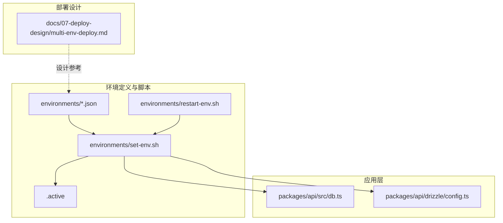
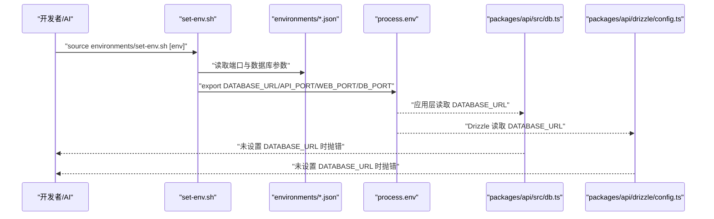
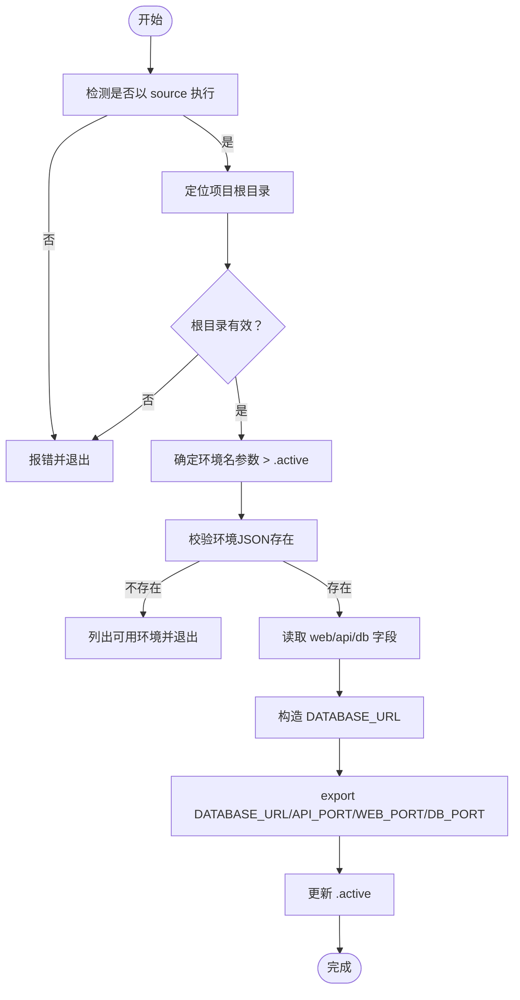
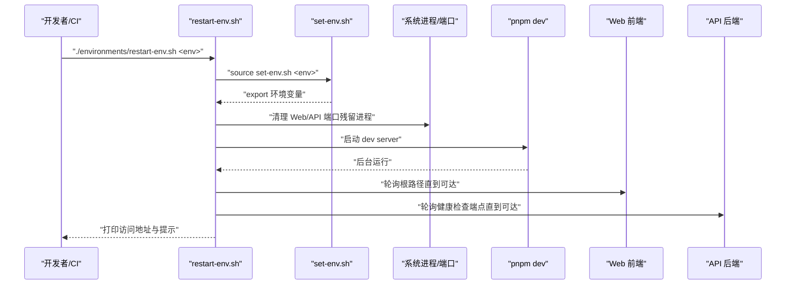
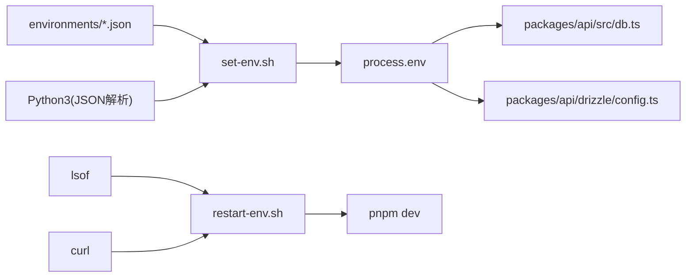

# 环境配置

<cite>
**本文引用的文件**
- [environments/README.md](file://environments/README.md)
- [environments/dev1.json](file://environments/dev1.json)
- [environments/dev2.json](file://environments/dev2.json)
- [environments/uat.json](file://environments/uat.json)
- [environments/set-env.sh](file://environments/set-env.sh)
- [environments/restart-env.sh](file://environments/restart-env.sh)
- [packages/api/src/db.ts](file://packages/api/src/db.ts)
- [packages/api/drizzle/config.ts](file://packages/api/drizzle/config.ts)
- [docs/07-deploy-design/multi-env-deploy.md](file://docs/07-deploy-design/multi-env-deploy.md)
- [logs-important/2026-05-13-conversation.md](file://logs-important/2026-05-13-conversation.md)
</cite>

## 目录
1. [简介](#简介)
2. [项目结构](#项目结构)
3. [核心组件](#核心组件)
4. [架构总览](#架构总览)
5. [详细组件分析](#详细组件分析)
6. [依赖关系分析](#依赖关系分析)
7. [性能考量](#性能考量)
8. [故障排查指南](#故障排查指南)
9. [结论](#结论)
10. [附录](#附录)

## 简介
本文件面向开发者与AI协作使用者，系统化说明AI原型管理系统的多环境配置策略与实施细节。重点涵盖：
- 开发环境（dev1/dev2）与测试环境（UAT）的配置差异与特性
- 环境配置文件结构与参数含义（数据库连接、端口映射、日志级别等）
- 环境切换机制与配置注入原理（环境变量优先级与覆盖规则）
- 最佳实践与安全注意事项
- 环境配置的验证方法与常见问题排查

## 项目结构
围绕“环境配置”的关键目录与文件如下：
- environments/：存放环境定义与激活/重启脚本
  - dev1.json / dev2.json / uat.json：环境定义JSON
  - set-env.sh：轻量级环境激活脚本（仅export环境变量）
  - restart-env.sh：完整重启脚本（清理进程+启动服务）
  - .active：当前激活的环境名
- packages/api/：数据库连接与Drizzle配置读取环境变量
- docs/07-deploy-design/multi-env-deploy.md：部署设计文档（Docker Compose方案）
- logs-important/：历史讨论记录（包含环境配置相关的设计要点）

图表来源
- [environments/README.md:11-20](file://environments/README.md#L11-L20)
- [environments/set-env.sh:53-98](file://environments/set-env.sh#L53-L98)
- [environments/restart-env.sh:50-56](file://environments/restart-env.sh#L50-L56)
- [packages/api/src/db.ts:5-12](file://packages/api/src/db.ts#L5-L12)
- [packages/api/drizzle/config.ts:8](file://packages/api/drizzle/config.ts#L8)
- [docs/07-deploy-design/multi-env-deploy.md:94-113](file://docs/07-deploy-design/multi-env-deploy.md#L94-L113)

章节来源
- [environments/README.md:9-20](file://environments/README.md#L9-L20)
- [environments/README.md:74-82](file://environments/README.md#L74-L82)

## 核心组件
- 环境定义JSON（dev1.json / dev2.json / uat.json）
  - 字段结构：name、description、web（port/url/protocol）、api（port/url/basePath/protocol）、db（host/port/database/protocol）、_meta
  - 作用：提供端口与数据库连接参数，供脚本读取并构造DATABASE_URL
- set-env.sh（环境激活脚本）
  - 功能：校验执行方式、定位项目根、确定环境名、读取JSON、构造DATABASE_URL并export关键变量（DATABASE_URL、API_PORT、WEB_PORT、DB_PORT）、更新.active
- restart-env.sh（完整重启脚本）
  - 功能：基于set-env.sh激活环境，清理目标端口残留进程，启动pnpm dev，等待服务就绪并通过HTTP探测验证
- 应用层消费
  - packages/api/src/db.ts：在未设置DATABASE_URL时抛错，确保强制通过环境系统注入
  - packages/api/drizzle/config.ts：Drizzle配置读取DATABASE_URL，未设置时抛错

章节来源
- [environments/dev1.json:1](file://environments/dev1.json#L1)
- [environments/dev2.json:1](file://environments/dev2.json#L1)
- [environments/uat.json:1](file://environments/uat.json#L1)
- [environments/set-env.sh:78-98](file://environments/set-env.sh#L78-L98)
- [environments/restart-env.sh:50-147](file://environments/restart-env.sh#L50-L147)
- [packages/api/src/db.ts:5-12](file://packages/api/src/db.ts#L5-L12)
- [packages/api/drizzle/config.ts:8](file://packages/api/drizzle/config.ts#L8)

## 架构总览
环境配置采用“先指定环境，再启动服务”的原则，确保无隐式默认值绕过环境系统。整体流程分为三步：
- 选择环境并激活（set-env.sh）
- 应用层读取环境变量（process.env）
- 服务启动与运行（API/Web/DB）

图表来源
- [environments/set-env.sh:78-98](file://environments/set-env.sh#L78-L98)
- [packages/api/src/db.ts:5-12](file://packages/api/src/db.ts#L5-L12)
- [packages/api/drizzle/config.ts:8](file://packages/api/drizzle/config.ts#L8)

## 详细组件分析

### 环境定义JSON（dev1/dev2/UAT）
- 结构要点
  - web：包含端口、URL、协议
  - api：包含端口、URL、basePath、协议
  - db：包含主机、端口、数据库名、协议
  - _meta：元信息（创建人、创建时间、是否默认）
- 端口分配规则
  - Web：dev1=13181、dev2=13281、uat=13381；每级间隔≥100
  - API：dev1=13180、dev2=13280、uat=13380；每级间隔≥100
  - DB：dev1=5432、dev2=5433、uat=5435；每级递增
- 特性
  - dev1为默认环境（isDefault=true）
  - dev2用于并行开发/隔离测试
  - uat用于用户验收测试

章节来源
- [environments/README.md:74-82](file://environments/README.md#L74-L82)
- [environments/dev1.json:1](file://environments/dev1.json#L1)
- [environments/dev2.json:1](file://environments/dev2.json#L1)
- [environments/uat.json:1](file://environments/uat.json#L1)

### 环境激活脚本（set-env.sh）
- 执行方式
  - 必须使用source执行，直接运行不会生效
- 根目录检测
  - 通过向上查找AGENTS.md与environments/来定位项目根
- 环境名确定
  - 优先使用命令行参数；若无参数则读取.environments/.active
- 配置读取与注入
  - 读取JSON中的web/api/db字段，构造DATABASE_URL并export
  - 同时export API_PORT、WEB_PORT、DB_PORT
- .active更新
  - 激活成功后写入当前环境名

图表来源
- [environments/set-env.sh:14-19](file://environments/set-env.sh#L14-L19)
- [environments/set-env.sh:21-42](file://environments/set-env.sh#L21-L42)
- [environments/set-env.sh:53-64](file://environments/set-env.sh#L53-L64)
- [environments/set-env.sh:66-76](file://environments/set-env.sh#L66-L76)
- [environments/set-env.sh:78-98](file://environments/set-env.sh#L78-L98)

章节来源
- [environments/README.md:24-44](file://environments/README.md#L24-L44)
- [environments/set-env.sh:14-98](file://environments/set-env.sh#L14-L98)

### 完整重启脚本（restart-env.sh）
- 作用
  - 基于set-env.sh激活环境（设置环境变量并更新.active）
  - 清理目标端口残留进程（Web/API）
  - 启动pnpm dev（后台），等待服务就绪并通过HTTP探测验证
- 端口清理
  - 使用lsof查询占用端口的进程，逐个kill并等待端口释放
- 服务就绪验证
  - Web：访问根路径
  - API：访问健康检查端点（基于basePath）
- 输出信息
  - 成功后打印Web/API/DB的访问地址

图表来源
- [environments/restart-env.sh:50-147](file://environments/restart-env.sh#L50-L147)
- [environments/set-env.sh:90-98](file://environments/set-env.sh#L90-L98)

章节来源
- [environments/restart-env.sh:1-158](file://environments/restart-env.sh#L1-L158)

### 应用层配置与注入（API）
- 数据库连接
  - packages/api/src/db.ts：在未设置DATABASE_URL时抛错，确保强制通过环境系统注入
- Drizzle配置
  - packages/api/drizzle/config.ts：Drizzle配置读取DATABASE_URL，未设置时抛错
- 与部署设计的衔接
  - 设计文档提出“代码零配置，运行时注入”的三层模型：compose覆写→process.env→应用消费
  - API层通过process.env读取API_PORT、API_HOST、DATABASE_URL、LOG_LEVEL等

章节来源
- [packages/api/src/db.ts:5-12](file://packages/api/src/db.ts#L5-L12)
- [packages/api/drizzle/config.ts:8](file://packages/api/drizzle/config.ts#L8)
- [docs/07-deploy-design/multi-env-deploy.md:94-113](file://docs/07-deploy-design/multi-env-deploy.md#L94-L113)

## 依赖关系分析
- set-env.sh依赖
  - environments/*.json：读取端口与数据库参数
  - Python3：用于解析JSON（构造DATABASE_URL）
- restart-env.sh依赖
  - set-env.sh：激活环境并export变量
  - lsof：检测并终止占用端口的进程
  - curl：验证服务就绪
- 应用层依赖
  - process.env：API层读取DATABASE_URL、API_PORT、API_HOST、LOG_LEVEL
  - Drizzle：读取DATABASE_URL进行迁移与Schema管理

图表来源
- [environments/set-env.sh:78-98](file://environments/set-env.sh#L78-L98)
- [environments/restart-env.sh:62-95](file://environments/restart-env.sh#L62-L95)
- [packages/api/src/db.ts:5-12](file://packages/api/src/db.ts#L5-L12)
- [packages/api/drizzle/config.ts:8](file://packages/api/drizzle/config.ts#L8)

章节来源
- [environments/set-env.sh:78-98](file://environments/set-env.sh#L78-L98)
- [environments/restart-env.sh:62-95](file://environments/restart-env.sh#L62-L95)
- [packages/api/src/db.ts:5-12](file://packages/api/src/db.ts#L5-L12)
- [packages/api/drizzle/config.ts:8](file://packages/api/drizzle/config.ts#L8)

## 性能考量
- 端口分配
  - 同一服务不同环境端口间隔≥100，避免相邻端口冲突，提升并发调试效率
- 服务就绪等待
  - restart-env.sh对Web/API分别设置最大等待时间，平衡启动速度与稳定性
- 部署设计（Docker Compose）
  - 三层注入模型减少代码改动，提升可维护性
  - nginx作为单入口点，统一处理SPA与API反代，降低跨域与路径复杂度

章节来源
- [environments/README.md:74-82](file://environments/README.md#L74-L82)
- [environments/restart-env.sh:119-146](file://environments/restart-env.sh#L119-L146)
- [docs/07-deploy-design/multi-env-deploy.md:35-83](file://docs/07-deploy-design/multi-env-deploy.md#L35-L83)

## 故障排查指南
- 症状：直接运行脚本而非source
  - 现象：环境变量未生效
  - 处理：改用source执行
  - 参考：[environments/README.md:37](file://environments/README.md#L37)
- 症状：未指定环境名且.active不存在
  - 现象：set-env.sh报错并列出可用环境
  - 处理：提供环境名或创建.active
  - 参考：[environments/set-env.sh:54-64](file://environments/set-env.sh#L54-L64)
- 症状：环境JSON不存在
  - 现象：set-env.sh报错并列出可用环境
  - 处理：检查文件名与路径
  - 参考：[environments/set-env.sh:66-76](file://environments/set-env.sh#L66-L76)
- 症状：DATABASE_URL未设置
  - 现象：API启动时报错
  - 处理：先执行source environments/set-env.sh激活环境
  - 参考：[packages/api/src/db.ts:5-12](file://packages/api/src/db.ts#L5-L12)
- 症状：端口被占用
  - 现象：服务启动失败或无法就绪
  - 处理：使用restart-env.sh清理残留进程，或手动kill
  - 参考：[environments/restart-env.sh:62-95](file://environments/restart-env.sh#L62-L95)
- 症状：Drizzle迁移报错
  - 现象：未设置DATABASE_URL
  - 处理：先激活环境再执行迁移
  - 参考：[packages/api/drizzle/config.ts:8](file://packages/api/drizzle/config.ts#L8)

章节来源
- [environments/README.md:37](file://environments/README.md#L37)
- [environments/set-env.sh:54-76](file://environments/set-env.sh#L54-L76)
- [packages/api/src/db.ts:5-12](file://packages/api/src/db.ts#L5-L12)
- [packages/api/drizzle/config.ts:8](file://packages/api/drizzle/config.ts#L8)
- [environments/restart-env.sh:62-95](file://environments/restart-env.sh#L62-L95)

## 结论
本环境配置体系通过严格的“先指定环境，再启动服务”原则，配合set-env.sh与restart-env.sh实现环境变量注入与服务生命周期管理。应用层在未设置DATABASE_URL时直接抛错，杜绝隐式默认值带来的风险。结合部署设计文档提出的三层注入模型，可在不改动代码的前提下实现多环境并存与独立运行。

## 附录

### 环境切换机制与配置注入原理
- 环境变量优先级
  - set-env.sh通过export将变量注入当前shell，随后pnpm dev读取process.env
  - 根据部署设计文档，Docker Compose覆写文件中的environment字段将process.env注入容器运行时
- 覆盖规则
  - 命令行参数优先于.active文件
  - JSON字段优先于硬编码默认值（已移除）
- 安全与合规
  - DATABASE_URL禁止硬编码在.env中，未设置时抛错
  - 仅用户可修改环境定义文件，AI仅可读取与验证

章节来源
- [environments/README.md:56-62](file://environments/README.md#L56-L62)
- [environments/README.md:98-102](file://environments/README.md#L98-L102)
- [packages/api/src/db.ts:5-12](file://packages/api/src/db.ts#L5-L12)
- [packages/api/drizzle/config.ts:8](file://packages/api/drizzle/config.ts#L8)

### 环境配置验证清单
- 开发环境（dev1/dev2）
  - 端口：Web/API/DB符合分配规则
  - 数据库：连接字符串指向对应数据库
  - 服务：可通过curl验证健康检查端点
- UAT环境
  - 端口：Web/API/DB符合分配规则
  - 数据库：连接字符串指向独立数据库
  - 日志级别：按设计文档设置为info
- 部署验证（Docker Compose）
  - 三层注入：compose覆写→process.env→应用消费
  - 多环境共存：dev1与dev2可同时运行
  - 健康检查：Web与API均可达

章节来源
- [environments/README.md:74-82](file://environments/README.md#L74-L82)
- [docs/07-deploy-design/multi-env-deploy.md:104-113](file://docs/07-deploy-design/multi-env-deploy.md#L104-L113)
- [docs/07-deploy-design/multi-env-deploy.md:470-516](file://docs/07-deploy-design/multi-env-deploy.md#L470-L516)