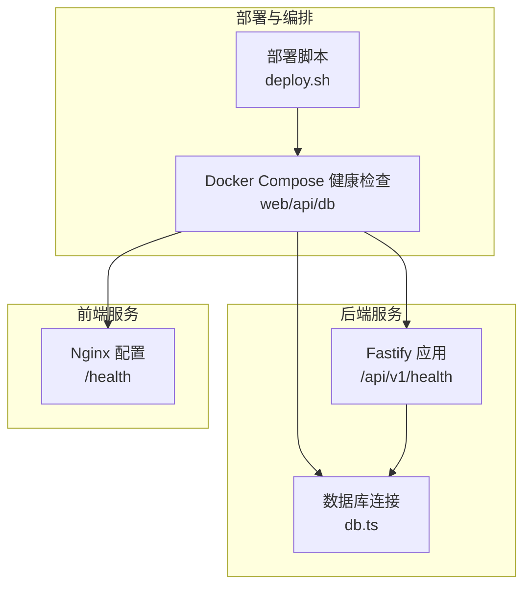
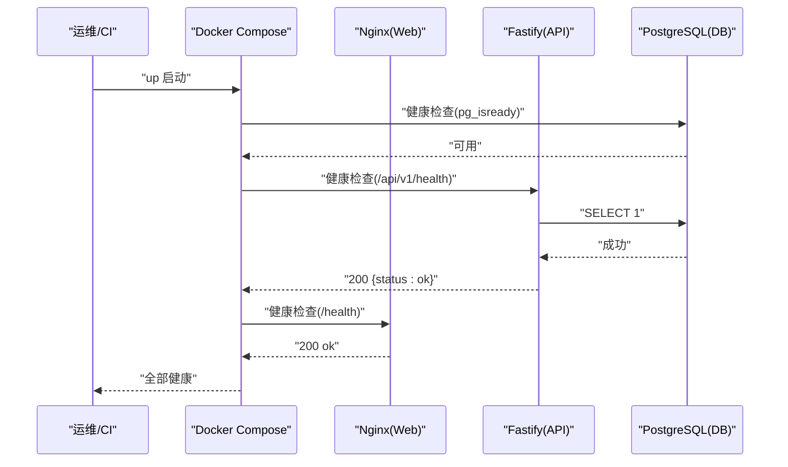
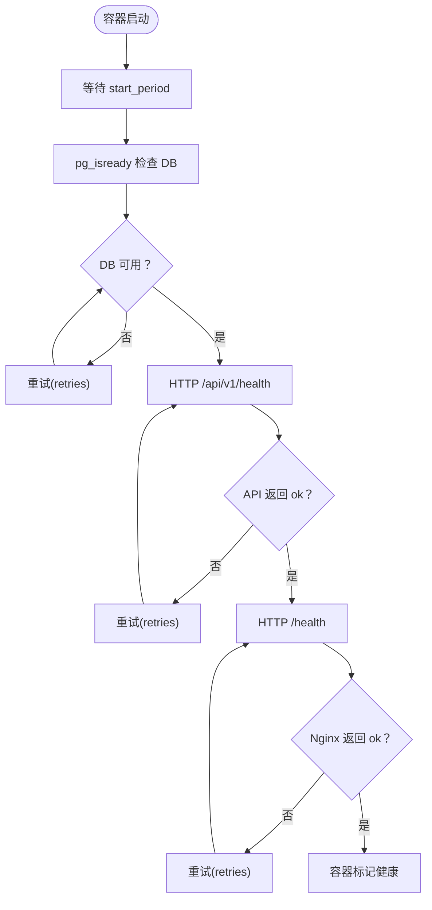
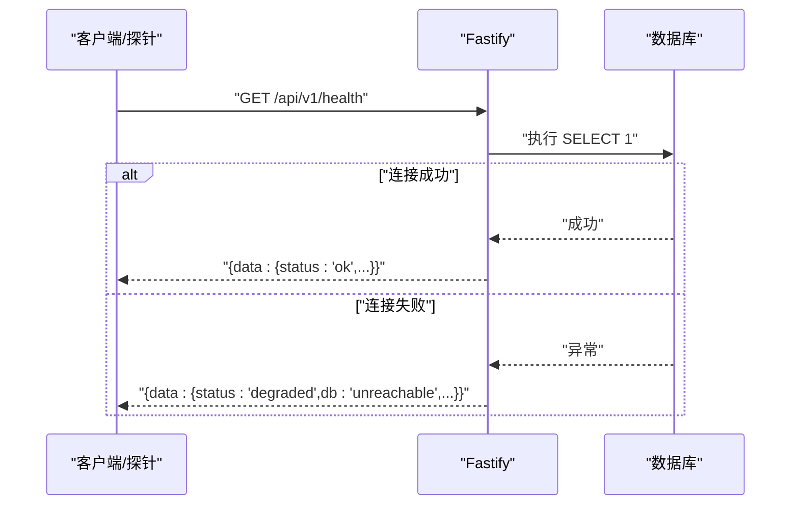
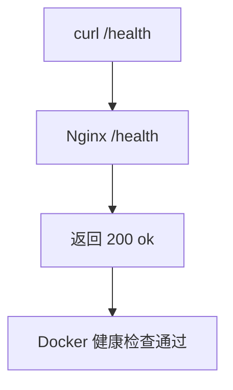
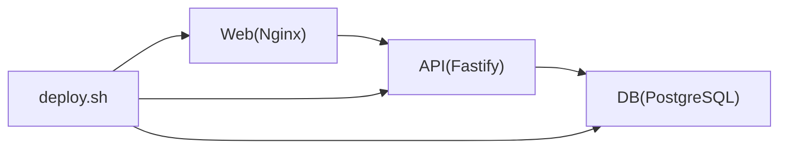

# 健康检查

<cite>
**本文引用的文件**
- [multi-env-deploy.md](file://docs/07-deploy-design/multi-env-deploy.md)
- [docker-compose.yml](file://workspace/dev/docker-compose.yml)
- [app.ts](file://packages/api/src/app.ts)
- [db.ts](file://packages/api/src/db.ts)
- [smoke.spec.ts](file://packages/e2e/tests/smoke.spec.ts)
- [deploy.sh](file://scripts/deploy.sh)
- [nginx.conf](file://docker/web/nginx.conf)
</cite>

## 目录
1. [简介](#简介)
2. [项目结构](#项目结构)
3. [核心组件](#核心组件)
4. [架构总览](#架构总览)
5. [详细组件分析](#详细组件分析)
6. [依赖分析](#依赖分析)
7. [性能考虑](#性能考虑)
8. [故障排查指南](#故障排查指南)
9. [结论](#结论)

## 简介
本文件面向“AI原型管理系统”的健康检查机制，覆盖容器健康状态监控、API 服务可用性检查、数据库连接状态检测，以及前端应用的健康状态检测。文档基于仓库中现有的 Docker Compose 健康检查配置、API 健康端点实现、Nginx 健康端点与部署脚本，提供参数解读、使用方法、最佳实践与常见问题解决方案。

## 项目结构
围绕健康检查的关键文件与位置如下：
- Docker Compose 健康检查配置：位于部署设计文档与工作区 Compose 文件中
- API 健康端点：位于后端应用路由中
- 数据库连接：通过后端连接模块进行健康探测
- 前端健康端点：位于 Nginx 配置中
- 部署与状态查询脚本：位于 scripts 目录

图表来源
- [multi-env-deploy.md](file://docs/07-deploy-design/multi-env-deploy.md)
- [docker-compose.yml](file://workspace/dev/docker-compose.yml)
- [app.ts](file://packages/api/src/app.ts)
- [db.ts](file://packages/api/src/db.ts)
- [nginx.conf](file://docker/web/nginx.conf)
- [deploy.sh](file://scripts/deploy.sh)

章节来源
- [multi-env-deploy.md](file://docs/07-deploy-design/multi-env-deploy.md)
- [docker-compose.yml](file://workspace/dev/docker-compose.yml)

## 核心组件
- 容器健康检查（Docker Compose）
  - Web 前端（Nginx）：通过本地 /health 端点进行健康探测
  - API 后端（Fastify）：通过 /api/v1/health 进行健康探测
  - 数据库（PostgreSQL）：通过 pg_isready 进行连接可用性探测
- API 健康端点
  - 实现：后端路由 /api/v1/health，数据库连通性快速检测
- 前端健康端点
  - 实现：Nginx 配置中 /health 返回纯文本 ok
- 部署与状态查询
  - 脚本：deploy.sh 提供 up/status/logs/down 等动作，其中 status 动作为健康检查

章节来源
- [multi-env-deploy.md](file://docs/07-deploy-design/multi-env-deploy.md)
- [app.ts](file://packages/api/src/app.ts)
- [nginx.conf](file://docker/web/nginx.conf)
- [deploy.sh](file://scripts/deploy.sh)

## 架构总览
系统健康检查分三层：
- 容器层：Docker Compose healthcheck 对 web/api/db 进行周期性探测
- 应用层：API /api/v1/health 检测数据库连通性；Nginx /health 返回存活
- 运维层：deploy.sh status 动作结合 Docker 健康状态与 HTTP 探针

图表来源
- [multi-env-deploy.md](file://docs/07-deploy-design/multi-env-deploy.md)
- [app.ts](file://packages/api/src/app.ts)
- [nginx.conf](file://docker/web/nginx.conf)

## 详细组件分析

### Docker Compose 健康检查配置
- Web(Nginx) 健康检查
  - 探测路径：/health
  - 参数：interval、timeout、retries
- API(Fastify) 健康检查
  - 探测路径：/api/v1/health
  - 参数：interval、timeout、retries、start_period
- 数据库(PostgreSQL) 健康检查
  - 探测命令：pg_isready
  - 参数：interval、timeout、retries

图表来源
- [multi-env-deploy.md](file://docs/07-deploy-design/multi-env-deploy.md)

章节来源
- [multi-env-deploy.md](file://docs/07-deploy-design/multi-env-deploy.md)
- [docker-compose.yml](file://workspace/dev/docker-compose.yml)

### API 健康端点实现
- 端点：/api/v1/health
- 逻辑：尝试执行一次数据库查询，成功返回 { status: 'ok' }，失败返回 { status: 'degraded', db: 'unreachable' }
- 依赖：数据库连接模块（db.ts）

图表来源
- [app.ts](file://packages/api/src/app.ts)
- [db.ts](file://packages/api/src/db.ts)

章节来源
- [app.ts](file://packages/api/src/app.ts)
- [db.ts](file://packages/api/src/db.ts)

### 前端健康状态检测机制
- Nginx 配置提供 /health，返回纯文本 ok
- Docker Compose 中 web 服务使用该端点进行健康检查
- E2E 测试中也对 /api/v1/health 进行断言，间接验证前端反向代理链路

图表来源
- [nginx.conf](file://docker/web/nginx.conf)
- [multi-env-deploy.md](file://docs/07-deploy-design/multi-env-deploy.md)

章节来源
- [nginx.conf](file://docker/web/nginx.conf)
- [multi-env-deploy.md](file://docs/07-deploy-design/multi-env-deploy.md)
- [smoke.spec.ts](file://packages/e2e/tests/smoke.spec.ts)

### 部署脚本与健康检查
- deploy.sh 提供 up/status/logs/down 等动作
- status 动作结合 docker compose ps 与 HTTP 探针，用于查看健康状态
- up 动作在启动后等待健康检查通过再报告 URL

章节来源
- [deploy.sh](file://scripts/deploy.sh)
- [multi-env-deploy.md](file://docs/07-deploy-design/multi-env-deploy.md)

## 依赖分析
- 容器依赖
  - web 依赖 api 健康（depends_on: condition: service_healthy）
  - api 依赖 db 健康（depends_on: condition: service_healthy）
- 应用依赖
  - API 健康端点依赖数据库连接模块
  - 前端健康端点依赖 Nginx 配置
- 运维依赖
  - 部署脚本依赖 Docker Compose 健康检查与 HTTP 探针

图表来源
- [multi-env-deploy.md](file://docs/07-deploy-design/multi-env-deploy.md)
- [app.ts](file://packages/api/src/app.ts)
- [db.ts](file://packages/api/src/db.ts)
- [nginx.conf](file://docker/web/nginx.conf)
- [deploy.sh](file://scripts/deploy.sh)

章节来源
- [multi-env-deploy.md](file://docs/07-deploy-design/multi-env-deploy.md)

## 性能考虑
- 探测频率与超时
  - API 健康检查的 interval/timeout/retries/start_period 参数需平衡探测开销与故障发现速度
  - DB 健康检查的 pg_isready 命令轻量，适合较短间隔
- 启动延迟
  - API 的 start_period 为容器预留数据库迁移与初始化时间，避免早期误判
- 前端健康
  - Nginx /health 为纯文本返回，开销极低，适合高频探测

章节来源
- [multi-env-deploy.md](file://docs/07-deploy-design/multi-env-deploy.md)

## 故障排查指南
- API 健康检查返回 degraded
  - 现象：/api/v1/health 返回 { status: 'degraded', db: 'unreachable' }
  - 排查步骤：
    - 确认数据库容器健康（compose ps + logs）
    - 确认 API 与 DB 在同一网络
    - 确认 DATABASE_URL 环境变量正确（容器内解析 db:5432）
    - 手动在 API 容器内执行数据库连通性测试
- 前端健康检查失败
  - 现象：/health 返回非 200
  - 排查步骤：
    - 检查 Nginx 配置是否正确加载
    - 检查 /api/* 反向代理是否指向 api:3000
    - 使用 curl 直接访问 /health 与 /api/v1/health 验证链路
- 容器启动后长时间不健康
  - 检查 API start_period 是否足够长以完成数据库迁移
  - 检查 DB 初始化是否成功（首次启动后需要执行迁移）
- 部署脚本状态异常
  - 使用 deploy.sh status 查看 compose ps 与 HTTP 探针结果
  - 使用 deploy.sh logs 查看聚合日志定位问题

章节来源
- [multi-env-deploy.md](file://docs/07-deploy-design/multi-env-deploy.md)
- [app.ts](file://packages/api/src/app.ts)
- [db.ts](file://packages/api/src/db.ts)
- [nginx.conf](file://docker/web/nginx.conf)
- [deploy.sh](file://scripts/deploy.sh)

## 结论
本系统通过 Docker Compose 健康检查、API 健康端点与 Nginx 健康端点形成完整的健康监测闭环。API 健康端点对数据库连通性的快速检测，配合容器层的依赖健康启动，确保了服务链路的稳定上线与持续可用。结合部署脚本的状态查询能力，可高效完成日常运维与故障排查。